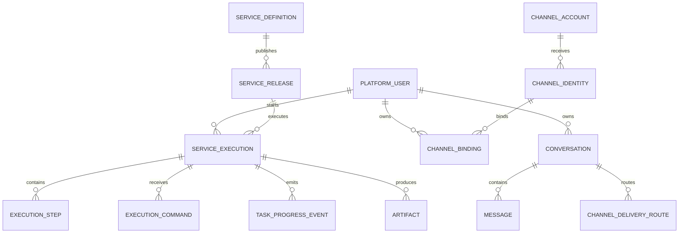

# 数据库设计基线

> **数据库**：PostgreSQL  
> **原则**：业务状态以 PostgreSQL 为权威；Redis 永远不是唯一事实源。

## 1. 统一公共字段

Framework 自建的每一张数据库表都必须包含：

| 字段 | PostgreSQL 类型 | 可空 | 默认值 | 规则 |
|---|---|---:|---|---|
| `is_deleted` | BOOLEAN | N | FALSE | 逻辑删除标记；业务查询默认 `false` |
| `create_time` | TIMESTAMPTZ | N | `now()` | 创建时间 |
| `update_time` | TIMESTAMPTZ | N | `now()` | 更新时间；每次 UPDATE 刷新 |

实现要求：

```text
ORM Model
→ 统一继承 SoftDeleteTimestampMixin

Repository
→ 默认过滤 is_deleted = false

Delete
→ 默认 UPDATE is_deleted = true

Unique
→ 对可复建资源使用 partial unique index
   WHERE is_deleted = false
```

事件/Audit 表也包含这三个字段；通常不执行删除，但 schema 保持一致。

LangGraph Checkpointer 等第三方库自管理表不修改其 schema，避免破坏升级兼容；该约束适用于 Framework 自建业务表。

## 2. 表分组

### 身份与配置域

```text
platform_user
channel_account
channel_identity
channel_binding
external_auth_profile
user_memory
agent_definition
service_definition
service_release
skill_artifact
knowledge_source
capability_definition
capability_implementation
integration_registration
workspace
```

### 会话与执行域

```text
conversation
message
channel_delivery_route
service_execution
execution_snapshot
execution_step
execution_command
task_progress_event
artifact
```

### 框架管理表

LangGraph Checkpointer 自己维护 checkpoint 表，仅负责 Agent Graph State，不替代：

```text
service_execution
execution_step
execution_command
task_progress_event
```

## 3. 核心 ER



## 4. Worker 关键索引

至少需要：

```text
service_execution(status, next_run_at)
service_execution(status, lease_expires_at)
service_execution(actor_user_id, created_at)
service_execution(trace_id)
execution_step(execution_id, status)
task_progress_event(execution_id, occurred_at)
message(conversation_id, created_at)
workspace(tenant_id, owner_type, owner_id)
workspace(status, expires_at)
```

`idempotency_key` 必须有唯一性约束或等价组合唯一约束。

## 5. Workspace

```text
workspace
- id
- tenant_id
- owner_type
- owner_id
- storage_backend
- root_ref
- status
- created_at
- expires_at
```

Workspace metadata 在生产必须持久化。

普通临时文件不要求逐文件建表；只有成为正式交付物/审计证据时，才持久化为 `artifact` 并写 Object Store。

## 6. 发布模型

`Service` / 关键 `Agent`：

```text
draft_payload
published_payload
release_id
content_hash
```

其他配置主要使用：

```text
revision
updated_at
audit
```

不建设统一 `version` / `active_version` / `retired_version` 体系。

## 7. 数据迁移

所有 Schema 修改必须通过 Alembic migration。

破坏性变更采用：

```text
expand
→ migrate/backfill
→ switch
→ contract
```

避免滚动发布时新旧 Pod 因 Schema 不兼容同时失败。
