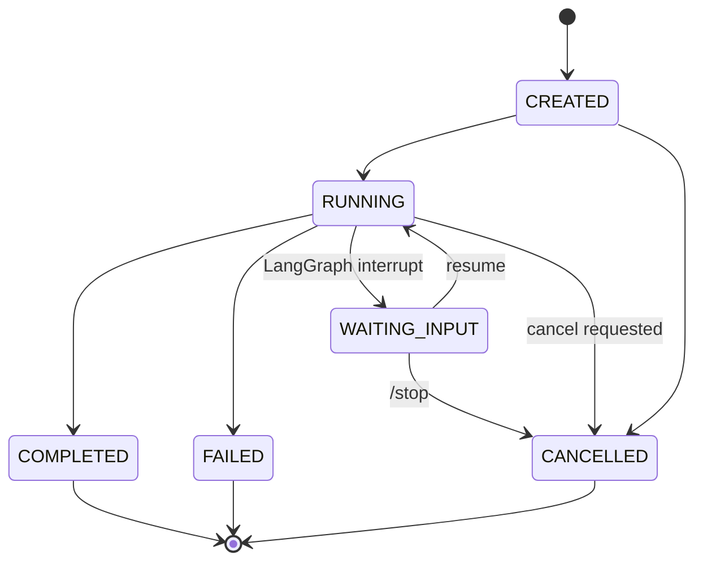
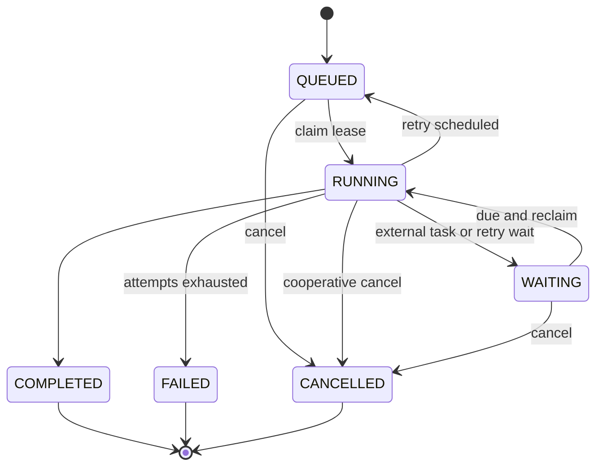

# 02 核心领域与数据库详细设计
## 1. 设计原则

- PostgreSQL 是权威事实源；
- `control`、`runtime`、`task`、`langgraph` 四个逻辑 schema 分离；
- Redis 仅存非权威协调数据；
- Secret Value 不落普通业务表；
- RuntimeSnapshot 与 CanonicalEvent 用于可复现和可审计；
- LangGraph Checkpointer 技术表不等价于业务会话历史。
---

## 2. 领域 ER 图

> **术语前提**：`AGENT_DEFINITION` 是 Console 中的逻辑 IM Agent；`BOT_ACCOUNT.agent_id` 绑定的是这个逻辑对象。数据库中不存在 Bot 到 Runtime Pod 的绑定字段，Runtime Pod 也不进入领域 ER。

```mermaid
erDiagram
    PLATFORM_USER ||--o{ AGENT_ACCESS_GRANT : granted
    AGENT_DEFINITION ||--o{ AGENT_ACCESS_GRANT : accessible_by
    MODEL_DEFINITION ||--o{ AGENT_DEFINITION : uses
    AGENT_DEFINITION ||--o{ AGENT_SKILL_BINDING : binds
    SKILL ||--o{ AGENT_SKILL_BINDING : assigned
    SKILL ||--o{ SKILL_ARTIFACT : versions
    AGENT_DEFINITION ||--o{ AGENT_MCP_BINDING : binds
    MCP_SERVER ||--o{ AGENT_MCP_BINDING : assigned
    PLATFORM_USER ||--o{ SKILL_USER_GRANT : selected_user
    SKILL ||--o{ SKILL_USER_GRANT : selected_scope
    PLATFORM_USER ||--o{ MCP_USER_GRANT : selected_user
    MCP_SERVER ||--o{ MCP_USER_GRANT : selected_scope
    AGENT_DEFINITION ||--o{ BOT_ACCOUNT : channel_accounts
    PLATFORM_USER ||--o{ CHANNEL_IDENTITY : identities
    PLATFORM_USER ||--o{ BIND_CODE : bind_codes
    PROJECT_PLATFORM ||--o{ USER_CREDENTIAL_REF : user_credentials
    PLATFORM_USER ||--o{ USER_CREDENTIAL_REF : owns
    PROJECT_PLATFORM ||--o{ SHARED_CREDENTIAL_REF : shared_credentials

    PLATFORM_USER ||--o{ CONVERSATION : has
    AGENT_DEFINITION ||--o{ CONVERSATION : serves
    CONVERSATION ||--o{ RUN_RECORD : runs
    RUN_RECORD ||--|| RUNTIME_SNAPSHOT : freezes
    CONVERSATION ||--o{ CANONICAL_EVENT : events
    RUN_RECORD ||--o{ CANONICAL_EVENT : produces
    PLATFORM_USER ||--o{ USER_MEMORY : owns
    RUN_RECORD ||--o{ ARTIFACT : creates
    RUN_RECORD ||--o{ RUN_INTERRUPT : pauses
    RUN_RECORD ||--o{ TOOL_CALL_AUDIT : tool_calls
    RUN_RECORD ||--o{ EGRESS_AUDIT : egress
    RUN_RECORD ||--o{ MODEL_INVOCATION_AUDIT : model_calls
    PLATFORM_USER ||--o{ TASK_SCHEDULE : owns
    AGENT_DEFINITION ||--o{ TASK_SCHEDULE : schedules
    TASK_SCHEDULE ||--o{ TASK_EXECUTION : fires
    PLATFORM_USER ||--o{ TASK_EXECUTION : actor
    AGENT_DEFINITION ||--o{ TASK_EXECUTION : executes_for
    TASK_EXECUTION ||--o{ TASK_EXECUTION : children
    PLATFORM_USER ||--o{ DELIVERY_ROUTE : receives
    TASK_EXECUTION ||--o{ TASK_EVENT : events
    TASK_EXECUTION ||--o{ ARTIFACT : artifacts
    DELIVERY_ROUTE ||--o{ TASK_EXECUTION : delivers
```



### 2.1 ER 图解读

ER 图分为三组关系：

1. **控制面定义与能力授权**：Agent 绑定 Model、Skill、MCP；PlatformUser 通过 AgentAccessGrant 获得 Agent 使用权；Skill/MCP 再通过 `user_scope=ALL/SELECTED` 控制能力对哪些 Agent 授权用户开放；一个 Agent 可拥有多条 BotAccount/ChannelAccount，每条 `bot_id` 只路由到一个逻辑 Agent。
2. **身份与平台接入**：ChannelIdentity 把企业微信外部身份映射到 PlatformUser；ProjectPlatform 保存平台实例与 `adapter_key`；PlatformAdapter 决定登录/签名/Session 协议；Credential 表只保存 SecretRef。
3. **实时运行态事实**：Conversation -> RunRecord -> RuntimeSnapshot/CanonicalEvent/Audit。Snapshot 冻结逻辑 Agent 的版本，但不记录 Runtime Pod；任意 Pod 通过相同 Snapshot 重建执行上下文。
4. **后台任务事实**：TaskSchedule 表达“什么时候触发”，TaskExecution 表达“一次实际执行”，父子 Task 表达 fan-out/fan-in，DeliveryRoute 表达完成后发到哪里。Task 不绑定 Worker Pod，只记录临时 lease_owner。

因此 ER 图刻意没有 `runtime_instance` 与 Agent/Bot 的外键关系，这是无状态横向扩展的关键约束。


---

## 3. Schema 归属

| Schema | Owner | 写入方 | 说明 |
|---|---|---|---|
| `control` | console-platform | console-platform | 配置、授权、Artifact 元数据 |
| `runtime` | agent-runtime | agent-runtime + agent-worker(仅共享 Audit/Artifact Port) | Conversation、Run、Memory、Audit/Artifact |
| `task` | agent-worker | agent-worker | Background Task、Schedule、Lease、Delivery |
| `langgraph` | LangGraph Checkpointer | agent-runtime | Checkpoint 技术状态 |

---

## 3.1 表分类与职责总览

| 表 | 业务用途 | 主要写入方 | 主要读取方 |
|---|---|---|---|
| platform_user | 平台统一用户 | Console | Console/Gateway/Runtime |
| model_definition | 模型定义 | Console | Runtime |
| agent_definition | 逻辑 IM Agent 定义 | Console | Console/Runtime/Gateway 间接解析 |
| skill / skill_artifact | Skill 元数据与不可变制品 | Console | Runtime |
| agent_skill_binding | Agent 绑定 Skill | Console | Runtime Resolve |
| mcp_server / agent_mcp_binding | MCP 注册与 Agent 绑定 | Console | Runtime Resolve |
| agent_access_grant | 用户是否能使用 Agent | Console | Gateway/Runtime Resolve |
| skill_user_grant / mcp_user_grant | SELECTED 资源的指定用户授权 | Console | Runtime Resolve |
| bot_account | `bot_id -> logical agent_id` | Console | Gateway |
| channel_identity / bind_code | IM 身份绑定 | Console API | Gateway/Console |
| project_platform | 业务平台实例、寻址、Adapter 与凭据选择策略 | Console | Runtime/Worker Egress |
| user/shared_credential_ref | 用户/共享凭据引用 | Console | Runtime Egress |
| config_audit_log | 控制面变更审计 | Console | Admin |
| conversation | 会话容器 | Runtime | Runtime |
| run_record | 一次用户请求执行记录 | Runtime | Runtime/Admin |
| runtime_snapshot | Run 的版本冻结 | Runtime | Runtime/Admin |
| canonical_event | 不可变真实历史 | Runtime | ContextBuilder/Admin |
| user_memory | 跨会话用户 Memory | Runtime/Console | Runtime/Console |
| artifact | 大结果/报告引用 | Runtime | Runtime/Console |
| run_interrupt | 会话内等待输入 | Runtime | Runtime/Gateway |
| tool_call_audit / egress_audit / model_invocation_audit | 执行审计 | Runtime | Admin/OTel |
| task_schedule | 定时任务定义 | Worker Task API / Agent Tool | Worker Scheduler/Console |
| task_execution | durable 后台执行，含父子任务与 lease | Worker | Worker/Console/Runtime |
| task_event | Task 状态迁移与重试事件 | Worker | Console/OTel |
| delivery_route | 后台完成后的 IM 投递目标 | Runtime/Worker | Worker/IM Gateway |

---

### 3.2 外键与跨 Schema 引用原则

物理 FK 只在同一 Owner Schema 内使用：

```text
control -> control
runtime -> runtime
task -> task
```

跨 Owner Schema 只保存 UUID 逻辑引用，由 Application Service 校验。例如：

```text
task.task_execution.agent_id -> control.agent_definition.id
```

同一 Owner Schema 内应建立物理 FK，例如：

```text
task_execution.schedule_id -> task_schedule.id
task_execution.delivery_route_id -> delivery_route.id
channel_identity.bot_account_id -> bot_account.id
```


## 3.3 Artifact Store 数据边界

V1 文件事实源固定为 NFS-backed RWX PVC。数据库不保存 Pod 本地路径，也不使用 `object_uri` 特定对象存储术语，统一保存：

```text
storage_key
```

例如：

```text
skills/{skill_id}/{artifact_id}/skill.zip
artifacts/2026/09/{artifact_id}
```

`/var/cache/muad/skills/{checksum}` 只是 Pod `emptyDir` 本地执行缓存，禁止进入业务表。


## 4. 表定义

### 4.1 `control.platform_user`

**表说明**

- **用途**：平台统一用户主体；IM 外部身份、Agent 授权、项目平台凭据最终都归并到该用户。
- **主要写入方**：Console 创建/维护；绑定流程只建立 ChannelIdentity 到该用户。
- **主要读取方**：Console、IM Gateway 解析接口、Agent Runtime Definition Resolve。
- **生命周期/边界**：长期存在；禁用不删除历史 Run。

| 字段 | 类型 | 约束 | 说明 |
|---|---|---|---|
| `id` | uuid | PK | 主键 |
| `is_deleted` | boolean | NOT NULL DEFAULT false | 软删除 |
| `create_time` | timestamptz | NOT NULL DEFAULT now() | 创建时间 |
| `update_time` | timestamptz | NOT NULL DEFAULT now() | 更新时间 |
| `tenant_id` | varchar(64) | NOT NULL | 租户/组织隔离键 |
| `user_code` | varchar(128) | NOT NULL | 平台用户编码 |
| `display_name` | varchar(128) | NOT NULL | 显示名 |
| `status` | varchar(32) | NOT NULL DEFAULT 'ACTIVE' | ACTIVE/DISABLED |
| `metadata_json` | jsonb | NOT NULL DEFAULT '{}' | 扩展信息 |

**索引/约束**：

- `UNIQUE (tenant_id, user_code) WHERE is_deleted=false`
- `INDEX (tenant_id, status)`

### 4.2 `control.model_definition`

**表说明**

- **用途**：Agent 可选择的模型配置定义，不代表模型实例。
- **主要写入方**：Console。
- **主要读取方**：Agent Runtime 创建 Snapshot 时读取。
- **生命周期/边界**：修改 revision+1；新 Run 生效，旧 Run Snapshot 不漂移。

| 字段 | 类型 | 约束 | 说明 |
|---|---|---|---|
| `id` | uuid | PK | 主键 |
| `is_deleted` | boolean | NOT NULL DEFAULT false | 软删除 |
| `create_time` | timestamptz | NOT NULL DEFAULT now() | 创建时间 |
| `update_time` | timestamptz | NOT NULL DEFAULT now() | 更新时间 |
| `tenant_id` | varchar(64) | NOT NULL | 隔离键 |
| `key` | varchar(128) | NOT NULL | 稳定业务 key |
| `name` | varchar(128) | NOT NULL | 名称 |
| `protocol` | varchar(32) | NOT NULL DEFAULT 'OPENAI' | 当前仅 OPENAI；对应 OpenAI-compatible 协议 |
| `model_id` | varchar(128) | NOT NULL | OpenAI 请求中的 `model` 字段 |
| `base_url` | text | NOT NULL | OpenAI-compatible Base URL，不包含具体 `/chat/completions` 路径 |
| `secret_ref` | varchar(256) |  | Secret Provider 引用 |
| `params_json` | jsonb | NOT NULL DEFAULT '{}' | temperature 等 |
| `revision` | bigint | NOT NULL DEFAULT 1 | 每次修改 +1 |
| `enabled` | boolean | NOT NULL DEFAULT true | 是否启用 |
| `last_test_status` | varchar(16) | NOT NULL DEFAULT 'UNTESTED' | UNTESTED/AVAILABLE/FAILED |
| `last_test_at` | timestamptz |  | 最近批量测试时间 |

**索引/约束**：

- `UNIQUE (tenant_id, key) WHERE is_deleted=false`

**明确不设计** `is_default`：Agent 必须显式选择 `model_id`。

### 4.3 `control.agent_definition`

**表说明**

- **用途**：产品层逻辑 IM Agent；承载 Instructions、Model 与运行参数。它不是 Runtime Pod。
- **主要写入方**：Console。
- **主要读取方**：Console 列表/详情；Runtime Definition Resolve。
- **生命周期/边界**：配置修改 revision+1；Bot 只绑定 agent_id；运行实例不落表。

| 字段 | 类型 | 约束 | 说明 |
|---|---|---|---|
| `id` | uuid | PK | 主键 |
| `is_deleted` | boolean | NOT NULL DEFAULT false | 软删除 |
| `create_time` | timestamptz | NOT NULL DEFAULT now() | 创建时间 |
| `update_time` | timestamptz | NOT NULL DEFAULT now() | 更新时间 |
| `tenant_id` | varchar(64) | NOT NULL | 隔离键 |
| `key` | varchar(128) | NOT NULL | Agent key |
| `name` | varchar(128) | NOT NULL | 名称 |
| `description` | text |  | 描述 |
| `instructions` | text | NOT NULL | Agent Instructions |
| `model_id` | uuid | NOT NULL FK -> model_definition.id | 绑定模型 |
| `runtime_config_json` | jsonb | NOT NULL DEFAULT '{}' | token budget/deadline 等 |
| `revision` | bigint | NOT NULL DEFAULT 1 | 配置版本 |
| `enabled` | boolean | NOT NULL DEFAULT true | 是否启用 |

**索引/约束**：

- `UNIQUE (tenant_id, key) WHERE is_deleted=false`
- `INDEX (model_id, enabled)`

### 4.4 `control.skill`

**表说明**

- **用途**：Skill 逻辑资源，name/description 主要来自 SKILL.md frontmatter。
- **主要写入方**：Skill 导入流程。
- **主要读取方**：Console、Runtime Skill Catalog。
- **生命周期/边界**：可切换 current_artifact；旧 Artifact 保持不可变。

| 字段 | 类型 | 约束 | 说明 |
|---|---|---|---|
| `id` | uuid | PK | 主键 |
| `is_deleted` | boolean | NOT NULL DEFAULT false | 软删除 |
| `create_time` | timestamptz | NOT NULL DEFAULT now() | 创建时间 |
| `update_time` | timestamptz | NOT NULL DEFAULT now() | 更新时间 |
| `tenant_id` | varchar(64) | NOT NULL | 隔离键 |
| `key` | varchar(128) | NOT NULL | Skill key |
| `name` | varchar(128) | NOT NULL | 名称 |
| `description` | text | NOT NULL | Catalog 描述 |
| `platform_label` | varchar(128) |  | 人类识别标签 |
| `user_scope` | varchar(16) | NOT NULL DEFAULT 'SELECTED' | ALL/SELECTED；默认指定用户，避免新导入能力直接对所有 Agent 授权用户开放 |
| `current_artifact_id` | uuid |  | 当前默认 Artifact |
| `enabled` | boolean | NOT NULL DEFAULT true | 是否启用 |

**索引/约束**：

- `UNIQUE (tenant_id, key) WHERE is_deleted=false`
- `INDEX (user_scope, enabled)`

### 4.5 `control.skill_artifact`

**表说明**

- **用途**：一次不可变 Skill 包上传结果。Package 以 SKILL.md + scripts/resources 为事实源。
- **主要写入方**：Console Skill Import。
- **主要读取方**：Runtime SkillLoader。
- **生命周期/边界**：append-only；checksum 确保可复现；不覆盖。

| 字段 | 类型 | 约束 | 说明 |
|---|---|---|---|
| `id` | uuid | PK | 主键 |
| `is_deleted` | boolean | NOT NULL DEFAULT false | 软删除 |
| `create_time` | timestamptz | NOT NULL DEFAULT now() | 创建时间 |
| `update_time` | timestamptz | NOT NULL DEFAULT now() | 更新时间 |
| `skill_id` | uuid | NOT NULL FK -> skill.id | 所属 Skill |
| `version` | varchar(64) | NOT NULL | Artifact 语义版本 |
| `checksum` | varchar(128) | NOT NULL | 不可变校验 |
| `storage_key` | text | NOT NULL | Artifact Store 相对键，例如 `skills/{skill_id}/{artifact_id}/skill.zip` |
| `frontmatter_json` | jsonb | NOT NULL DEFAULT '{}' | SKILL.md frontmatter 快照 |
| `manifest_json` | jsonb | NOT NULL DEFAULT '{}' | 包内文件清单、大小等，仅用于详情/校验，不作为第二套执行 manifest |
| `execution_mode` | varchar(16) | NOT NULL DEFAULT 'SYNC' | SYNC/ASYNC/AUTO；由 SKILL.md `execution` 提取 |
| `default_script` | varchar(256) |  | 可选默认脚本，例如 scripts/main.py；不是强制入口 |
| `package_size` | bigint | NOT NULL | 字节数 |
| `validation_status` | varchar(32) | NOT NULL | READY/REJECTED |
| `validation_message` | text |  | 校验信息 |
| `created_by` | uuid | NOT NULL | 上传人 |

**索引/约束**：

- `UNIQUE (skill_id, version) WHERE is_deleted=false`
- `UNIQUE (skill_id, checksum) WHERE is_deleted=false`
- `INDEX (skill_id, create_time DESC)`

### 4.6 `control.agent_skill_binding`

**表说明**

- **用途**：声明某个逻辑 Agent 绑定并可加载哪些 Skill；最终是否对某用户有效还需结合 AgentAccessGrant 与 Skill.user_scope。
- **主要写入方**：Console Agent 配置。
- **主要读取方**：Runtime Definition Resolve。
- **生命周期/边界**：绑定变更只影响新 Run。

| 字段 | 类型 | 约束 | 说明 |
|---|---|---|---|
| `id` | uuid | PK | 主键 |
| `is_deleted` | boolean | NOT NULL DEFAULT false | 软删除 |
| `create_time` | timestamptz | NOT NULL DEFAULT now() | 创建时间 |
| `update_time` | timestamptz | NOT NULL DEFAULT now() | 更新时间 |
| `agent_id` | uuid | NOT NULL FK -> agent_definition.id | Agent |
| `skill_id` | uuid | NOT NULL FK -> skill.id | Skill |
| `enabled` | boolean | NOT NULL DEFAULT true | 是否启用 |
| `sort_order` | int | NOT NULL DEFAULT 0 | Catalog 排序 |

**索引/约束**：

- `UNIQUE (agent_id, skill_id) WHERE is_deleted=false`

### 4.7 `control.mcp_server`

**表说明**

- **用途**：已登记 MCP Server 的连接定义。
- **主要写入方**：Console。
- **主要读取方**：Runtime MCP Registry。
- **生命周期/边界**：启停实时影响新 Run；当前 Run 按 Snapshot 处理。

| 字段 | 类型 | 约束 | 说明 |
|---|---|---|---|
| `id` | uuid | PK | 主键 |
| `is_deleted` | boolean | NOT NULL DEFAULT false | 软删除 |
| `create_time` | timestamptz | NOT NULL DEFAULT now() | 创建时间 |
| `update_time` | timestamptz | NOT NULL DEFAULT now() | 更新时间 |
| `tenant_id` | varchar(64) | NOT NULL | 隔离键 |
| `key` | varchar(128) | NOT NULL | Server key |
| `name` | varchar(128) | NOT NULL | 名称 |
| `transport` | varchar(32) | NOT NULL DEFAULT 'streamable-http' | V1 仅 streamable-http |
| `endpoint` | text | NOT NULL | MCP endpoint |
| `auth_secret_ref` | varchar(256) |  | 认证引用 |
| `auth_config_json` | jsonb | NOT NULL DEFAULT '{}' | 非 secret 认证配置 |
| `user_scope` | varchar(16) | NOT NULL DEFAULT 'SELECTED' | ALL/SELECTED；默认指定用户 |
| `enabled` | boolean | NOT NULL DEFAULT true | 管理侧启用状态 |
| `connection_status` | varchar(24) | NOT NULL DEFAULT 'UNKNOWN' | UNKNOWN/AVAILABLE/UNAVAILABLE/DISCOVERY_FAILED；连接/工具发现状态，不与 enabled 混用 |
| `tool_catalog_json` | jsonb | NOT NULL DEFAULT '[]' | 最近一次成功 `tools/list` 的 Tool Catalog 快照：name/description/input_schema/effect |
| `tool_catalog_hash` | varchar(128) |  | Tool Catalog 内容哈希 |
| `tool_catalog_revision` | bigint | NOT NULL DEFAULT 0 | 成功发现且目录变化时 +1 |
| `last_discovered_at` | timestamptz |  | 最近一次成功 tools/list 时间 |
| `last_discovery_error` | text |  | 最近发现失败摘要 |
| `connect_timeout_ms` | int | NOT NULL DEFAULT 5000 | 连接超时 |
| `tool_cache_ttl_sec` | int | NOT NULL DEFAULT 300 | Redis Runtime 缓存 TTL；PostgreSQL Catalog 仍是 Console 权威目录快照 |

**索引/约束**：

- `UNIQUE (tenant_id, key) WHERE is_deleted=false`
- `INDEX (user_scope, enabled)`

**Tool Catalog 原则**：

- V1 不建设独立 `mcp_tool` 配置表；
- Tool 不做平台侧单 Tool 启停，不做 Tool 级用户白名单；
- Tool 是否存在以最近一次成功 `tools/list` 的 `tool_catalog_json` 为准；
- Redis 只缓存解析后的 ToolDefinition，不是目录事实源。

### 4.8 `control.agent_mcp_binding`

**表说明**

- **用途**：逻辑 Agent 与 MCP Server 的绑定关系；最终是否对某用户有效还需结合 AgentAccessGrant 与 MCP.user_scope。
- **主要写入方**：Console。
- **主要读取方**：Runtime Resolve。
- **生命周期/边界**：配置关系；不对应 Runtime 连接实例。

| 字段 | 类型 | 约束 | 说明 |
|---|---|---|---|
| `id` | uuid | PK | 主键 |
| `is_deleted` | boolean | NOT NULL DEFAULT false | 软删除 |
| `create_time` | timestamptz | NOT NULL DEFAULT now() | 创建时间 |
| `update_time` | timestamptz | NOT NULL DEFAULT now() | 更新时间 |
| `agent_id` | uuid | NOT NULL FK -> agent_definition.id | Agent |
| `mcp_server_id` | uuid | NOT NULL FK -> mcp_server.id | MCP Server |
| `enabled` | boolean | NOT NULL DEFAULT true | 是否启用 |

**索引/约束**：

- `UNIQUE (agent_id, mcp_server_id) WHERE is_deleted=false`

### 4.9 `control.agent_access_grant`

**表说明**

- **用途**：平台用户使用某逻辑 Agent 的最小授权关系。
- **主要写入方**：Admin/Builder。
- **主要读取方**：Gateway resolve / Runtime resolve。
- **生命周期/边界**：撤销后新消息立即拒绝；历史运行保留。

| 字段 | 类型 | 约束 | 说明 |
|---|---|---|---|
| `id` | uuid | PK | 主键 |
| `is_deleted` | boolean | NOT NULL DEFAULT false | 软删除 |
| `create_time` | timestamptz | NOT NULL DEFAULT now() | 创建时间 |
| `update_time` | timestamptz | NOT NULL DEFAULT now() | 更新时间 |
| `user_id` | uuid | NOT NULL FK -> platform_user.id | 用户 |
| `agent_id` | uuid | NOT NULL FK -> agent_definition.id | Agent |
| `granted_by` | uuid | NOT NULL | 授权人 |
| `granted_at` | timestamptz | NOT NULL DEFAULT now() | 授权时间 |

**索引/约束**：

- `UNIQUE (user_id, agent_id) WHERE is_deleted=false`
- `INDEX (agent_id, user_id)`

### 4.10 `control.skill_user_grant`

**表说明**

- **用途**：当 Skill `user_scope=SELECTED` 时，声明哪些 PlatformUser 可以使用该 Skill。
- **主要写入方**：Admin/Builder。
- **主要读取方**：Runtime Visibility Resolver。
- **生命周期/边界**：
  - 只控制 Skill 的资源级用户范围；
  - 不授予 Agent 使用权；
  - 不把 Skill 自动绑定到 Agent；
  - 一个 Grant 对所有绑定该 Skill 的 Agent 生效，但用户仍必须分别拥有目标 Agent 的 AgentAccessGrant。

| 字段 | 类型 | 约束 | 说明 |
|---|---|---|---|
| `id` | uuid | PK | 主键 |
| `is_deleted` | boolean | NOT NULL DEFAULT false | 软删除 |
| `create_time` | timestamptz | NOT NULL DEFAULT now() | 创建时间 |
| `update_time` | timestamptz | NOT NULL DEFAULT now() | 更新时间 |
| `skill_id` | uuid | NOT NULL FK -> skill.id | Skill |
| `user_id` | uuid | NOT NULL FK -> platform_user.id | 指定用户 |
| `granted_by` | uuid | NOT NULL | 授权人 |
| `expires_at` | timestamptz |  | 可选到期时间；主要用于临时验证/灰度 |

**索引/约束**：

- `UNIQUE (skill_id, user_id) WHERE is_deleted=false`
- `INDEX (user_id, skill_id)`

### 4.11 `control.mcp_user_grant`

**表说明**

- **用途**：当 MCP Server `user_scope=SELECTED` 时，声明哪些 PlatformUser 可以使用该 MCP 暴露的工具目录。
- **主要写入方**：Admin/Builder。
- **主要读取方**：Runtime Visibility Resolver。
- **生命周期/边界**：
  - 与 AgentMcpBinding、AgentAccessGrant 共同生效；
  - V1.3 只做 MCP Server 级用户范围，不做单个 MCP Tool 的用户授权；
  - 指定用户授权不会把 MCP 自动绑定到任何 Agent。

| 字段 | 类型 | 约束 | 说明 |
|---|---|---|---|
| `id` | uuid | PK | 主键 |
| `is_deleted` | boolean | NOT NULL DEFAULT false | 软删除 |
| `create_time` | timestamptz | NOT NULL DEFAULT now() | 创建时间 |
| `update_time` | timestamptz | NOT NULL DEFAULT now() | 更新时间 |
| `mcp_server_id` | uuid | NOT NULL FK -> mcp_server.id | MCP Server |
| `user_id` | uuid | NOT NULL FK -> platform_user.id | 指定用户 |
| `granted_by` | uuid | NOT NULL | 授权人 |
| `expires_at` | timestamptz |  | 可选到期时间 |

**索引/约束**：

- `UNIQUE (mcp_server_id, user_id) WHERE is_deleted=false`
- `INDEX (user_id, mcp_server_id)`

### 4.12 `control.bot_account`

**表说明**

- **用途**：IM 通道账号配置；核心关系是 `bot_id/channel_account -> logical agent_id`。一个 Agent 可配置多条账号记录。
- **主要写入方**：Console Agent 的“IM 接入”页。
- **主要读取方**：IM Gateway 启动/刷新及消息路由。
- **生命周期/边界**：Bot 与 Runtime Pod 无任何绑定；Runtime 扩缩容无需更新本表。

| 字段 | 类型 | 约束 | 说明 |
|---|---|---|---|
| `id` | uuid | PK | 主键 |
| `is_deleted` | boolean | NOT NULL DEFAULT false | 软删除 |
| `create_time` | timestamptz | NOT NULL DEFAULT now() | 创建时间 |
| `update_time` | timestamptz | NOT NULL DEFAULT now() | 更新时间 |
| `tenant_id` | varchar(64) | NOT NULL | 隔离键 |
| `channel` | varchar(32) | NOT NULL DEFAULT 'WECOM' | 渠道类型 |
| `name` | varchar(128) | NOT NULL | 通道账号显示名称 |
| `bot_id` | varchar(256) | NOT NULL | 企业微信 bot_id |
| `secret_ref` | varchar(256) | NOT NULL | bot secret 引用 |
| `agent_id` | uuid | NOT NULL FK -> agent_definition.id | 绑定的逻辑 IM Agent；禁止存 Runtime Pod/实例 ID |
| `enabled` | boolean | NOT NULL DEFAULT true | 是否启用 |
| `config_json` | jsonb | NOT NULL DEFAULT '{}' | SDK 扩展配置 |
| `last_connected_at` | timestamptz |  | 最近成功连接时间 |

**索引/约束**：

- `UNIQUE (bot_id) WHERE is_deleted=false`
- `INDEX (agent_id, channel, enabled)`

### 4.13 `control.channel_identity`

**表说明**

- **用途**：外部 IM 用户身份到 PlatformUser 的映射。
- **主要写入方**：/bind Internal API。
- **主要读取方**：IM Gateway resolve。
- **生命周期/边界**：用户级长期映射；可支持 Bot 级 identity_key。

| 字段 | 类型 | 约束 | 说明 |
|---|---|---|---|
| `id` | uuid | PK | 主键 |
| `is_deleted` | boolean | NOT NULL DEFAULT false | 软删除 |
| `create_time` | timestamptz | NOT NULL DEFAULT now() | 创建时间 |
| `update_time` | timestamptz | NOT NULL DEFAULT now() | 更新时间 |
| `tenant_id` | varchar(64) | NOT NULL | 隔离键 |
| `channel` | varchar(32) | NOT NULL | 渠道 |
| `identity_key` | varchar(512) | NOT NULL | 归一化唯一键 |
| `external_user_id` | varchar(256) | NOT NULL | 渠道外部身份 |
| `bot_account_id` | uuid | NOT NULL FK -> bot_account.id | V1 企业微信身份按 bot 账号隔离 |
| `platform_user_id` | uuid | NOT NULL FK -> platform_user.id | 绑定用户 |
| `bound_at` | timestamptz | NOT NULL DEFAULT now() | 绑定时间 |
| `last_active_at` | timestamptz |  | 最近一次有效消息活动时间；Gateway 可节流更新 |

**索引/约束**：

- `UNIQUE (tenant_id, identity_key) WHERE is_deleted=false`
- `INDEX (platform_user_id, channel)`

### 4.14 `control.bind_code`

**表说明**

- **用途**：一次性短期绑定凭证。
- **主要写入方**：Console。
- **主要读取方**：/bind API。
- **生命周期/边界**：有 TTL、一次性消费，过期/使用后不可重用。

| 字段 | 类型 | 约束 | 说明 |
|---|---|---|---|
| `id` | uuid | PK | 主键 |
| `is_deleted` | boolean | NOT NULL DEFAULT false | 软删除 |
| `create_time` | timestamptz | NOT NULL DEFAULT now() | 创建时间 |
| `update_time` | timestamptz | NOT NULL DEFAULT now() | 更新时间 |
| `tenant_id` | varchar(64) | NOT NULL | 隔离键 |
| `platform_user_id` | uuid | NOT NULL FK -> platform_user.id | 目标用户 |
| `code_hash` | varchar(128) | NOT NULL | 只存 hash |
| `status` | varchar(16) | NOT NULL DEFAULT 'ACTIVE' | ACTIVE/USED/EXPIRED/REVOKED |
| `expires_at` | timestamptz | NOT NULL | 过期时间 |
| `used_at` | timestamptz |  | 使用时间 |
| `used_channel_identity_id` | uuid |  | 绑定成功后的 identity |
| `created_by` | uuid | NOT NULL | 生成管理员 |

**索引/约束**：

- `UNIQUE (code_hash) WHERE is_deleted=false`
- `INDEX (platform_user_id, status, expires_at)`

### 4.15 `control.project_platform`

**表说明**

- **用途**：一个真实业务平台实例的逻辑定义；保存寻址配置、PlatformAdapter 选择和非敏感 Adapter 配置。
- **主要写入方**：Console。
- **主要读取方**：Runtime/Worker Egress Boundary。
- **生命周期/边界**：
  - 不把 Bearer/Basic/OAuth2 等认证协议硬编码到 ProjectPlatform 领域模型；
  - 平台认证、签名、Session 逻辑由 `adapter_key` 对应的 PlatformAdapter 实现；
  - `adapter_config_json` 只能保存非 Secret 配置；
  - Adapter 本身是代码注册项，不在数据库存可执行代码。

| 字段 | 类型 | 约束 | 说明 |
|---|---|---|---|
| `id` | uuid | PK | 主键 |
| `is_deleted` | boolean | NOT NULL DEFAULT false | 软删除 |
| `create_time` | timestamptz | NOT NULL DEFAULT now() | 创建时间 |
| `update_time` | timestamptz | NOT NULL DEFAULT now() | 更新时间 |
| `tenant_id` | varchar(64) | NOT NULL | 隔离键 |
| `key` | varchar(128) | NOT NULL | 平台标识 |
| `name` | varchar(128) | NOT NULL | 名称 |
| `resolver_type` | varchar(32) | NOT NULL | SERVICE_DISCOVERY/BASE_URL |
| `resolver_config_json` | jsonb | NOT NULL | 服务发现或 base URL 配置 |
| `adapter_key` | varchar(128) | NOT NULL | PlatformAdapter Registry key |
| `adapter_config_json` | jsonb | NOT NULL DEFAULT '{}' | Adapter 非敏感平台配置 |
| `adapter_schema_version` | varchar(32) | NOT NULL DEFAULT '1' | 保存时采用的配置 Schema 版本 |
| `credential_mode` | varchar(32) | NOT NULL | USER_ONLY/SHARED_ONLY/USER_THEN_SHARED/NONE |
| `enabled` | boolean | NOT NULL DEFAULT true | 是否启用 |

**索引/约束**：

- `UNIQUE (tenant_id, key) WHERE is_deleted=false`
- `INDEX (adapter_key, enabled)`

**为什么不建 `platform_adapter` 表**

`PlatformAdapter` 是受控 Python 代码，不是业务数据。Registry 在应用启动时由 `platform-sdk` 注册；Console 通过 `GET /api/v1/platform-adapters` 获取 Metadata/Schema。这样新增 Adapter 必须经过代码评审和发布，不会把认证执行代码变成数据库动态脚本。

### 4.16 `control.user_credential_ref`

**表说明**

- **用途**：用户 × ProjectPlatform 的唯一凭据引用，只存 SecretRef。
- **主要写入方**：Console/认证配置。
- **主要读取方**：Runtime Egress。
- **生命周期/边界**：Secret 真值由 Secret Provider 管理。

| 字段 | 类型 | 约束 | 说明 |
|---|---|---|---|
| `id` | uuid | PK | 主键 |
| `is_deleted` | boolean | NOT NULL DEFAULT false | 软删除 |
| `create_time` | timestamptz | NOT NULL DEFAULT now() | 创建时间 |
| `update_time` | timestamptz | NOT NULL DEFAULT now() | 更新时间 |
| `tenant_id` | varchar(64) | NOT NULL | 隔离键 |
| `user_id` | uuid | NOT NULL FK -> platform_user.id | 用户 |
| `platform_id` | uuid | NOT NULL FK -> project_platform.id | 项目平台 |
| `secret_ref` | varchar(256) | NOT NULL | Secret Provider 引用 |
| `credential_schema_version` | varchar(32) | NOT NULL DEFAULT '1' | 创建凭据时的 Adapter Credential Schema 版本 |
| `status` | varchar(16) | NOT NULL DEFAULT 'ACTIVE' | ACTIVE/INVALID |
| `last_verified_at` | timestamptz |  | 最近验证 |

**索引/约束**：

- `UNIQUE (user_id, platform_id) WHERE is_deleted=false`

### 4.17 `control.shared_credential_ref`

**表说明**

- **用途**：平台级共享凭据回退引用。
- **主要写入方**：Console。
- **主要读取方**：Runtime Egress。
- **生命周期/边界**：V1 每个 ProjectPlatform 最多一套共享凭据；不做共享账号池/优先级；不向 Skill 暴露。

| 字段 | 类型 | 约束 | 说明 |
|---|---|---|---|
| `id` | uuid | PK | 主键 |
| `is_deleted` | boolean | NOT NULL DEFAULT false | 软删除 |
| `create_time` | timestamptz | NOT NULL DEFAULT now() | 创建时间 |
| `update_time` | timestamptz | NOT NULL DEFAULT now() | 更新时间 |
| `tenant_id` | varchar(64) | NOT NULL | 隔离键 |
| `platform_id` | uuid | NOT NULL FK -> project_platform.id | 项目平台 |
| `secret_ref` | varchar(256) | NOT NULL | 共享 Secret 引用 |
| `credential_schema_version` | varchar(32) | NOT NULL DEFAULT '1' | Adapter Credential Schema 版本 |
| `status` | varchar(16) | NOT NULL DEFAULT 'ACTIVE' | 状态 |

**索引/约束**：

- `UNIQUE (platform_id) WHERE is_deleted=false`
- `INDEX (platform_id, status)`


### 4.17.1 PlatformSession 为什么不建业务表

V1.3 的 PlatformSession 是**可重建缓存**，不作为 PostgreSQL 权威事实：

```text
Redis Key:
platform_session:{tenant_id}:{platform_id}:{actor_scope}:{credential_version}:{adapter_key}:{adapter_version}
```

缓存内容仅保存 Adapter 返回的 Session State，例如：

```text
cookie/token/session_id/csrf/expires_at/adapter_state
```

原则：

- 不缓存原始 AK/SK/username/password；
- Redis 丢失后通过 SecretRef 重新认证即可；
- Credential 更新后 `credential_version/fingerprint` 变化，自然命中新缓存 key；
- Runtime/Worker Pod 本地可有极短 L1 缓存，但不能成为权威源；
- 如某平台 Session 具备必须持久化且不可重建的语义，需单独评审，不默认升级 PostgreSQL。

### 4.18 `control.config_audit_log`

**表说明**

- **用途**：控制面配置变更审计。
- **主要写入方**：Console Application Service。
- **主要读取方**：Admin/审计。
- **生命周期/边界**：append-only，保存前后差异但不含 Secret Value。

| 字段 | 类型 | 约束 | 说明 |
|---|---|---|---|
| `id` | uuid | PK | 主键 |
| `is_deleted` | boolean | NOT NULL DEFAULT false | 软删除 |
| `create_time` | timestamptz | NOT NULL DEFAULT now() | 创建时间 |
| `update_time` | timestamptz | NOT NULL DEFAULT now() | 更新时间 |
| `tenant_id` | varchar(64) | NOT NULL | 隔离键 |
| `actor_user_id` | uuid | NOT NULL | 操作人 |
| `resource_type` | varchar(64) | NOT NULL | AGENT/SKILL/MCP/... |
| `resource_id` | uuid | NOT NULL | 资源 ID |
| `action` | varchar(64) | NOT NULL | CREATE/UPDATE/DELETE/GRANT/... |
| `before_json` | jsonb |  | 修改前 |
| `after_json` | jsonb |  | 修改后 |
| `trace_id` | varchar(64) |  | Trace |
| `source_ip` | varchar(64) |  | 来源 IP |

**索引/约束**：

- `INDEX (resource_type, resource_id, create_time DESC)`
- `INDEX (actor_user_id, create_time DESC)`

### 4.19 `runtime.conversation`

**表说明**

- **用途**：逻辑 Agent 与用户之间的会话容器。
- **主要写入方**：Agent Runtime。
- **主要读取方**：Agent Runtime。
- **生命周期/边界**：跨 Pod；/new 创建新会话；不存 Pod 归属。

| 字段 | 类型 | 约束 | 说明 |
|---|---|---|---|
| `id` | uuid | PK | 主键 |
| `is_deleted` | boolean | NOT NULL DEFAULT false | 软删除 |
| `create_time` | timestamptz | NOT NULL DEFAULT now() | 创建时间 |
| `update_time` | timestamptz | NOT NULL DEFAULT now() | 更新时间 |
| `tenant_id` | varchar(64) | NOT NULL | 隔离键 |
| `user_id` | uuid | NOT NULL | PlatformUser |
| `agent_id` | uuid | NOT NULL | Agent |
| `title` | varchar(256) |  | 标题 |
| `status` | varchar(16) | NOT NULL DEFAULT 'ACTIVE' | ACTIVE/ARCHIVED |
| `last_seq` | bigint | NOT NULL DEFAULT 0 | Canonical Event 序号 |
| `last_run_id` | uuid |  | 最近 Run |

**索引/约束**：

- `INDEX (tenant_id, user_id, agent_id, update_time DESC)`

### 4.20 `runtime.run_record`

**表说明**

- **用途**：一次用户消息对应的一次 Agent 执行。
- **主要写入方**：Agent Runtime。
- **主要读取方**：Runtime/Admin。
- **生命周期/边界**：短时执行记录；Pod crash 不改变历史事实。

| 字段 | 类型 | 约束 | 说明 |
|---|---|---|---|
| `id` | uuid | PK | 主键 |
| `is_deleted` | boolean | NOT NULL DEFAULT false | 软删除 |
| `create_time` | timestamptz | NOT NULL DEFAULT now() | 创建时间 |
| `update_time` | timestamptz | NOT NULL DEFAULT now() | 更新时间 |
| `tenant_id` | varchar(64) | NOT NULL | 隔离键 |
| `conversation_id` | uuid | NOT NULL FK -> conversation.id | 会话 |
| `user_id` | uuid | NOT NULL | 执行用户 |
| `agent_id` | uuid | NOT NULL | Agent |
| `snapshot_id` | uuid |  | Snapshot |
| `status` | varchar(24) | NOT NULL | CREATED/RUNNING/WAITING_INPUT/COMPLETED/FAILED/CANCELLED |
| `input_text` | text | NOT NULL | 本轮用户输入 |
| `trace_id` | varchar(64) | NOT NULL | 全链路 Trace |
| `start_time` | timestamptz |  | 开始 |
| `end_time` | timestamptz |  | 结束 |
| `cancel_requested` | boolean | NOT NULL DEFAULT false | 取消标记 |
| `error_code` | varchar(64) |  | 错误码 |
| `error_message` | text |  | 错误摘要 |

**索引/约束**：

- `INDEX (conversation_id, create_time DESC)`
- `INDEX (agent_id, status, create_time DESC)`
- `INDEX (trace_id)`

### 4.21 `runtime.runtime_snapshot`

**表说明**

- **用途**：冻结本 Run 的 Agent/Model/Skill/MCP 版本投影。
- **主要写入方**：Agent Runtime Run 创建阶段。
- **主要读取方**：Runtime/Admin。
- **生命周期/边界**：Run 内不可变；不包含 Secret 和 Pod 信息。

| 字段 | 类型 | 约束 | 说明 |
|---|---|---|---|
| `id` | uuid | PK | 主键 |
| `is_deleted` | boolean | NOT NULL DEFAULT false | 软删除 |
| `create_time` | timestamptz | NOT NULL DEFAULT now() | 创建时间 |
| `update_time` | timestamptz | NOT NULL DEFAULT now() | 更新时间 |
| `tenant_id` | varchar(64) | NOT NULL | 隔离键 |
| `run_id` | uuid | NOT NULL UNIQUE | 对应 Run |
| `schema_version` | int | NOT NULL DEFAULT 1 | Snapshot JSON Schema 版本 |
| `agent_revision` | bigint | NOT NULL | Agent revision |
| `model_revision` | bigint | NOT NULL | Model revision |
| `agent_json` | jsonb | NOT NULL | 冻结 Agent 定义 |
| `model_json` | jsonb | NOT NULL | 冻结 Model 非 secret 定义 |
| `skill_catalog_json` | jsonb | NOT NULL | Skill ID/version/checksum/catalog |
| `mcp_catalog_json` | jsonb | NOT NULL | MCP endpoint/tool schema snapshot |
| `policy_json` | jsonb | NOT NULL DEFAULT '{}' | 预算/策略快照 |
| `content_hash` | varchar(128) | NOT NULL | 快照哈希 |

**索引/约束**：

- `UNIQUE (run_id)`
- `INDEX (content_hash)`

### 4.22 `runtime.canonical_event`

**表说明**

- **用途**：会话真实发生的不可变事件日志。
- **主要写入方**：Agent Runtime EventWriter。
- **主要读取方**：ContextBuilder/Admin。
- **生命周期/边界**：append-only；上下文裁剪不得修改。

| 字段 | 类型 | 约束 | 说明 |
|---|---|---|---|
| `id` | uuid | PK | 主键 |
| `is_deleted` | boolean | NOT NULL DEFAULT false | 软删除 |
| `create_time` | timestamptz | NOT NULL DEFAULT now() | 创建时间 |
| `update_time` | timestamptz | NOT NULL DEFAULT now() | 更新时间 |
| `tenant_id` | varchar(64) | NOT NULL | 隔离键 |
| `conversation_id` | uuid | NOT NULL | 会话 |
| `run_id` | uuid |  | 所属 Run |
| `seq` | bigint | NOT NULL | Conversation 单调序号 |
| `event_type` | varchar(64) | NOT NULL | USER_MESSAGE/ASSISTANT_MESSAGE/TOOL_CALL/... |
| `payload_json` | jsonb | NOT NULL | 事件负载 |
| `artifact_id` | uuid |  | 大结果引用 |

**索引/约束**：

- `UNIQUE (conversation_id, seq)`
- `INDEX (run_id, seq)`
- `INDEX (conversation_id, create_time)`

### 4.23 `runtime.user_memory`

**表说明**

- **用途**：跨 Conversation 的长期用户上下文，不存实时业务事实。
- **主要写入方**：受控 Memory Writer/Console。
- **主要读取方**：ContextBuilder/Console。
- **生命周期/边界**：按 tenant+user 隔离；可查看/清理。

| 字段 | 类型 | 约束 | 说明 |
|---|---|---|---|
| `id` | uuid | PK | 主键 |
| `is_deleted` | boolean | NOT NULL DEFAULT false | 软删除 |
| `create_time` | timestamptz | NOT NULL DEFAULT now() | 创建时间 |
| `update_time` | timestamptz | NOT NULL DEFAULT now() | 更新时间 |
| `tenant_id` | varchar(64) | NOT NULL | 隔离键 |
| `user_id` | uuid | NOT NULL | 用户 |
| `memory_key` | varchar(128) | NOT NULL | 稳定 key |
| `category` | varchar(64) | NOT NULL | PREFERENCE/WORK_STYLE/EXPLICIT |
| `content_json` | jsonb | NOT NULL | 记忆内容 |
| `source_type` | varchar(32) | NOT NULL | USER_EXPLICIT/RUNTIME |
| `source_ref` | varchar(256) |  | 来源 Run/Event |
| `write_policy` | varchar(32) | NOT NULL DEFAULT 'CONTROLLED' | 写入策略 |
| `version` | bigint | NOT NULL DEFAULT 1 | 版本 |
| `enabled` | boolean | NOT NULL DEFAULT true | 是否使用 |

**索引/约束**：

- `UNIQUE (tenant_id, user_id, memory_key) WHERE is_deleted=false`
- `INDEX (user_id, enabled, update_time DESC)`

### 4.24 `runtime.artifact`

**表说明**

- **用途**：报告、大 Tool 结果、结构化产物的外部对象引用。
- **主要写入方**：Agent Runtime、Agent Worker（通过共享 Artifact Port）。
- **主要读取方**：ContextBuilder、Agent Worker、Console。
- **生命周期/边界**：内容在 Artifact Store（V1=NFS-backed RWX PVC），DB 只存 storage_key 和元数据；Run Artifact 与 Task Artifact 使用同一表，通过 run_id/task_id 区分。

| 字段 | 类型 | 约束 | 说明 |
|---|---|---|---|
| `id` | uuid | PK | 主键 |
| `is_deleted` | boolean | NOT NULL DEFAULT false | 软删除 |
| `create_time` | timestamptz | NOT NULL DEFAULT now() | 创建时间 |
| `update_time` | timestamptz | NOT NULL DEFAULT now() | 更新时间 |
| `tenant_id` | varchar(64) | NOT NULL | 隔离键 |
| `run_id` | uuid |  | 实时 Run；与 task_id 二选一 |
| `task_id` | uuid |  | 后台 Task；与 run_id 二选一 |
| `conversation_id` | uuid |  | 实时会话；定时任务产物可为空 |
| `artifact_type` | varchar(64) | NOT NULL | TOOL_RESULT/REPORT/FILE/... |
| `storage_key` | text | NOT NULL | Artifact Store 相对键 |
| `media_type` | varchar(128) | NOT NULL | MIME |
| `size` | bigint | NOT NULL | 字节 |
| `checksum` | varchar(128) | NOT NULL | 校验 |
| `preview_text` | text |  | LLM/用户预览 |
| `metadata_json` | jsonb | NOT NULL DEFAULT '{}' | 元数据 |

**索引/约束**：

- `CHECK ((run_id IS NOT NULL) <> (task_id IS NOT NULL))`
- `INDEX (run_id, create_time) WHERE run_id IS NOT NULL`
- `INDEX (task_id, create_time) WHERE task_id IS NOT NULL`
- `INDEX (conversation_id, create_time) WHERE conversation_id IS NOT NULL`

### 4.25 `runtime.run_interrupt`

**表说明**

- **用途**：会话内澄清/确认产生的暂停点。
- **主要写入方**：LangGraph/Runtime。
- **主要读取方**：resume API/Gateway/Admin。
- **生命周期/边界**：Phase 1 仅短时会话内等待，不等同 durable human task。

| 字段 | 类型 | 约束 | 说明 |
|---|---|---|---|
| `id` | uuid | PK | 主键 |
| `is_deleted` | boolean | NOT NULL DEFAULT false | 软删除 |
| `create_time` | timestamptz | NOT NULL DEFAULT now() | 创建时间 |
| `update_time` | timestamptz | NOT NULL DEFAULT now() | 更新时间 |
| `tenant_id` | varchar(64) | NOT NULL | 隔离键 |
| `run_id` | uuid | NOT NULL | Run |
| `conversation_id` | uuid | NOT NULL | 会话 |
| `interrupt_type` | varchar(32) | NOT NULL | CLARIFY/CONFIRM/PERMISSION |
| `prompt_text` | text | NOT NULL | 向用户展示的问题 |
| `options_json` | jsonb | NOT NULL DEFAULT '[]' | 可选项 |
| `status` | varchar(16) | NOT NULL DEFAULT 'WAITING' | WAITING/RESOLVED/CANCELLED |
| `resolution_json` | jsonb |  | 用户输入/选择 |
| `expires_at` | timestamptz |  | 可选过期 |
| `resolved_at` | timestamptz |  | 恢复时间 |

**索引/约束**：

- `INDEX (run_id, status)`
- `INDEX (conversation_id, status)`

### 4.26 `runtime.tool_call_audit`

**表说明**

- **用途**：所有 ToolRegistry 调用的统一审计。
- **主要写入方**：Runtime/Worker 共享 Tool Executor。
- **主要读取方**：Admin/Trace。
- **生命周期/边界**：记录参数摘要/结果状态，避免 Secret。

| 字段 | 类型 | 约束 | 说明 |
|---|---|---|---|
| `id` | uuid | PK | 主键 |
| `is_deleted` | boolean | NOT NULL DEFAULT false | 软删除 |
| `create_time` | timestamptz | NOT NULL DEFAULT now() | 创建时间 |
| `update_time` | timestamptz | NOT NULL DEFAULT now() | 更新时间 |
| `tenant_id` | varchar(64) | NOT NULL | 隔离键 |
| `run_id` | uuid |  | 实时 Run；与 task_id 至少一个存在 |
| `task_id` | uuid |  | 后台 Task |
| `conversation_id` | uuid |  | 会话；Scheduled Task 可为空 |
| `tool_call_id` | varchar(128) | NOT NULL | LLM Tool Call ID |
| `tool_name` | varchar(256) | NOT NULL | 规范化 tool 名 |
| `tool_kind` | varchar(32) | NOT NULL | BUILTIN/SKILL/MCP |
| `prepared_args_hash` | varchar(128) | NOT NULL | 不可变参数哈希 |
| `args_preview_json` | jsonb | NOT NULL DEFAULT '{}' | 脱敏参数预览 |
| `status` | varchar(24) | NOT NULL | PREPARED/RUNNING/SUCCESS/FAILED/DENIED |
| `start_time` | timestamptz |  | 开始 |
| `end_time` | timestamptz |  | 结束 |
| `latency_ms` | bigint |  | 耗时 |
| `error_code` | varchar(64) |  | 错误码 |
| `error_message` | text |  | 错误摘要 |
| `artifact_id` | uuid |  | 大结果引用 |

**索引/约束**：

- `UNIQUE (run_id, tool_call_id) WHERE run_id IS NOT NULL AND is_deleted=false`
- `UNIQUE (task_id, tool_call_id) WHERE task_id IS NOT NULL AND is_deleted=false`
- `CHECK (run_id IS NOT NULL OR task_id IS NOT NULL)`
- `INDEX (run_id, create_time) WHERE run_id IS NOT NULL`
- `INDEX (task_id, create_time) WHERE task_id IS NOT NULL`
- `INDEX (tool_name, status, create_time DESC)`

### 4.27 `runtime.egress_audit`

**表说明**

- **用途**：Skill/Runtime/Worker 调用业务平台的审计。
- **主要写入方**：Runtime/Worker 复用的 Egress Boundary。
- **主要读取方**：Admin/Trace。
- **生命周期/边界**：记录逻辑平台、actor、耗时和结果；V1 不做复杂公网安全策略。

| 字段 | 类型 | 约束 | 说明 |
|---|---|---|---|
| `id` | uuid | PK | 主键 |
| `is_deleted` | boolean | NOT NULL DEFAULT false | 软删除 |
| `create_time` | timestamptz | NOT NULL DEFAULT now() | 创建时间 |
| `update_time` | timestamptz | NOT NULL DEFAULT now() | 更新时间 |
| `tenant_id` | varchar(64) | NOT NULL | 隔离键 |
| `run_id` | uuid |  | 实时 Run |
| `task_id` | uuid |  | 后台 Task |
| `user_id` | uuid | NOT NULL | actor |
| `skill_artifact_id` | uuid |  | 调用来源 Skill |
| `platform_id` | uuid |  | 项目平台 |
| `adapter_key` | varchar(128) |  | 实际使用的 PlatformAdapter |
| `target_type` | varchar(32) | NOT NULL | PLATFORM/HTTP/MCP |
| `target` | text | NOT NULL | 逻辑目标/脱敏后的地址 |
| `operation` | varchar(256) |  | operation/path/tool |
| `method` | varchar(16) |  | HTTP method |
| `policy_decision` | varchar(16) | NOT NULL | ALLOW/DENY |
| `credential_ref_id` | uuid |  | 仅记录引用 ID，不记录值 |
| `status_code` | int |  | 下游状态 |
| `result_status` | varchar(24) | NOT NULL | SUCCESS/FAILED/DENIED |
| `latency_ms` | bigint |  | 耗时 |
| `error_code` | varchar(64) |  | 错误码 |

**索引/约束**：

- `CHECK (run_id IS NOT NULL OR task_id IS NOT NULL)`
- `INDEX (run_id, create_time) WHERE run_id IS NOT NULL`
- `INDEX (task_id, create_time) WHERE task_id IS NOT NULL`
- `INDEX (user_id, create_time DESC)`
- `INDEX (platform_id, result_status, create_time DESC)`

### 4.28 `runtime.model_invocation_audit`

**表说明**

- **用途**：模型调用与重试审计。
- **主要写入方**：Runtime/Worker 复用的 ModelGateway。
- **主要读取方**：Admin/Trace/指标。
- **生命周期/边界**：记录 provider/model/token/latency/retry，不保存完整敏感 Prompt。

| 字段 | 类型 | 约束 | 说明 |
|---|---|---|---|
| `id` | uuid | PK | 主键 |
| `is_deleted` | boolean | NOT NULL DEFAULT false | 软删除 |
| `create_time` | timestamptz | NOT NULL DEFAULT now() | 创建时间 |
| `update_time` | timestamptz | NOT NULL DEFAULT now() | 更新时间 |
| `tenant_id` | varchar(64) | NOT NULL | 隔离键 |
| `run_id` | uuid |  | 实时 Run |
| `task_id` | uuid |  | 后台 Task/AgentStep |
| `provider` | varchar(64) | NOT NULL | Provider |
| `model` | varchar(128) | NOT NULL | Model |
| `attempt` | int | NOT NULL | 第几次尝试 |
| `retry_reason` | varchar(64) |  | 重试原因 |
| `input_tokens` | bigint |  | 输入 token |
| `output_tokens` | bigint |  | 输出 token |
| `latency_ms` | bigint |  | 耗时 |
| `status` | varchar(24) | NOT NULL | SUCCESS/FAILED/CANCELLED |
| `error_code` | varchar(64) |  | 错误码 |

**索引/约束**：

- `CHECK (run_id IS NOT NULL OR task_id IS NOT NULL)`
- `INDEX (run_id, attempt) WHERE run_id IS NOT NULL`
- `INDEX (task_id, attempt) WHERE task_id IS NOT NULL`
- `INDEX (provider, model, status, create_time DESC)`


### 4.29 `task.task_schedule`

**表说明**

- **用途**：用户通过 Agent 创建的定时任务定义；它表达“什么时候触发 + 执行哪个已解析业务意图模板”，不是一个正在运行的 Task。
- **主要写入方**：Agent Runtime 的 `create_schedule` 内置 Tool，经 Agent Worker Task API 创建；Console 可做管理性启停。
- **主要读取方**：Agent Worker Scheduler、Console。
- **生命周期/边界**：Schedule 不永久冻结 Skill/Model 版本；每次触发创建新的 TaskExecution，并在触发时解析当前有效定义、生成 execution snapshot。
- **安全边界**：只保存 `actor_user_id` 和 CredentialRef 解析所需身份，不保存 Secret Value；每次触发重新校验 Agent 授权与业务凭据状态。

| 字段 | 类型 | 约束 | 说明 |
|---|---|---|---|
| `id` | uuid | PK | 主键 |
| `is_deleted` | boolean | NOT NULL DEFAULT false | 软删除 |
| `create_time` | timestamptz | NOT NULL DEFAULT now() | 创建时间 |
| `update_time` | timestamptz | NOT NULL DEFAULT now() | 更新时间 |
| `tenant_id` | varchar(64) | NOT NULL | 隔离键 |
| `name` | varchar(256) | NOT NULL | 人类可读名称 |
| `agent_id` | uuid | NOT NULL | 逻辑 Agent |
| `actor_user_id` | uuid | NOT NULL | 原始执行用户 |
| `intent_key` | varchar(128) | NOT NULL | 规范化业务意图，例如 policy_check |
| `skill_id` | uuid | NOT NULL | 创建 Schedule 时已解析的稳定 Skill ID；触发时不得按 key 重新匹配 |
| `input_template_json` | jsonb | NOT NULL | 规范化输入模板，可含 previous_day 等受控动态变量 |
| `schedule_type` | varchar(16) | NOT NULL DEFAULT 'CRON' | CRON/ONCE |
| `cron_expr` | varchar(128) |  | Cron 表达式 |
| `timezone` | varchar(64) | NOT NULL | IANA 时区 |
| `run_at` | timestamptz |  | ONCE 触发时间 |
| `delivery_route_id` | uuid | NOT NULL FK -> delivery_route.id | 最终投递路由 |
| `status` | varchar(16) | NOT NULL DEFAULT 'ACTIVE' | ACTIVE/PAUSED/COMPLETED；删除只用 is_deleted |
| `next_fire_at` | timestamptz |  | 下一次触发 |
| `last_fire_at` | timestamptz |  | 最近触发 |
| `misfire_policy` | varchar(16) | NOT NULL DEFAULT 'SKIP' | SKIP/FIRE_ONCE |
| `revision` | bigint | NOT NULL DEFAULT 1 | 修改版本 |
| `completed_at` | timestamptz |  | ONCE 成功创建对应 TaskExecution 后进入 COMPLETED |

**索引/约束**：

- `INDEX (status, next_fire_at)`
- `INDEX (actor_user_id, status)`
- `INDEX (agent_id, status)`
- CRON 必须有 `cron_expr`；ONCE 必须有 `run_at`。

### 4.30 `task.delivery_route`

**表说明**

- **用途**：后台任务完成后“结果发到哪里”的持久化路由。
- **主要写入方**：Agent Runtime 在创建 Background Task/Schedule 时根据当前 ChannelEnvelope 建立或复用。
- **主要读取方**：Agent Worker FinalDeliveryExecutor、IM Gateway。
- **生命周期/边界**：路由事实与 TaskProgress 分离；不保存 Bot Secret，只保存 `bot_id`、外部接收方标识及必要渠道元数据。

| 字段 | 类型 | 约束 | 说明 |
|---|---|---|---|
| `id` | uuid | PK | 主键 |
| `is_deleted` | boolean | NOT NULL DEFAULT false | 软删除 |
| `create_time` | timestamptz | NOT NULL DEFAULT now() | 创建时间 |
| `update_time` | timestamptz | NOT NULL DEFAULT now() | 更新时间 |
| `tenant_id` | varchar(64) | NOT NULL | 隔离键 |
| `channel` | varchar(32) | NOT NULL | WECOM |
| `bot_id` | varchar(256) | NOT NULL | 用于选择对应 Bot 连接 |
| `platform_user_id` | uuid | NOT NULL | 平台用户 |
| `external_user_id` | varchar(256) | NOT NULL | WeCom 接收方 |
| `external_conversation_id` | varchar(256) |  | 会话/群标识 |
| `route_json` | jsonb | NOT NULL DEFAULT '{}' | 其他渠道字段 |
| `status` | varchar(16) | NOT NULL DEFAULT 'ACTIVE' | ACTIVE/INVALID |

**索引/约束**：

- `INDEX (platform_user_id, channel, update_time DESC)`
- `INDEX (bot_id, external_user_id)`

### 4.31 `task.task_execution`

**表说明**

- **用途**：一次真正的 durable 后台执行实例；支持立即异步、定时触发、Parent/Child 批量并行。
- **主要写入方**：Agent Worker；Agent Runtime 通过 Task API 提交，不直接写 task schema。
- **主要读取方**：Agent Worker、Console、Agent Runtime 的查询/取消 Tool。
- **生命周期/边界**：不绑定固定 Worker Pod；`lease_owner` 只是当前租约持有者。Worker crash 后 lease 过期可被其他实例 reclaim。
- **意图边界**：Parent 与 Child 共享同一个 `intent_key`；多个 Child 不是多个 Agent 意图，而是同一意图的执行实例。
- **版本边界**：`execution_snapshot_json` 在本次 Task 开始时固定 Agent/Model/Skill/MCP 版本，不含 Secret。

| 字段 | 类型 | 约束 | 说明 |
|---|---|---|---|
| `id` | uuid | PK | Task ID |
| `is_deleted` | boolean | NOT NULL DEFAULT false | 软删除 |
| `create_time` | timestamptz | NOT NULL DEFAULT now() | 创建时间 |
| `update_time` | timestamptz | NOT NULL DEFAULT now() | 更新时间 |
| `tenant_id` | varchar(64) | NOT NULL | 隔离键 |
| `parent_id` | uuid | FK -> task_execution.id | 父 Task；根任务为空 |
| `root_id` | uuid |  | 根 Task；便于整批查询 |
| `schedule_id` | uuid | FK -> task_schedule.id | 定时触发来源 |
| `source_run_id` | uuid |  | 即时会话触发来源 Run |
| `agent_id` | uuid | NOT NULL | 逻辑 Agent |
| `actor_user_id` | uuid | NOT NULL | 权限与凭据执行主体 |
| `intent_key` | varchar(128) | NOT NULL | 单一业务意图 |
| `skill_id` | uuid | NOT NULL | 已解析稳定 Skill ID |
| `skill_artifact_id` | uuid | NOT NULL | 本次固定 Artifact |
| `trigger_type` | varchar(16) | NOT NULL | IMMEDIATE/SCHEDULED |
| `execution_mode` | varchar(16) | NOT NULL | ASYNC；Worker 内部实际执行模式 |
| `task_type` | varchar(24) | NOT NULL DEFAULT 'SKILL' | V1 仅 SKILL/BATCH；外部异步状态由 external_ref_json + WAITING 表达 |
| `status` | varchar(24) | NOT NULL | QUEUED/RUNNING/WAITING/COMPLETED/FAILED/CANCELLED |
| `input_json` | jsonb | NOT NULL | 规范化任务输入 |
| `result_json` | jsonb |  | 小结果 |
| `result_artifact_id` | uuid |  | 大结果引用 |
| `error_code` | varchar(64) |  | 错误码 |
| `error_message` | text |  | 错误摘要 |
| `cancel_requested` | boolean | NOT NULL DEFAULT false | 用户/管理员取消请求 |
| `external_ref_json` | jsonb | NOT NULL DEFAULT '{}' | external_task_id 等外部持久引用 |
| `deadline_at` | timestamptz |  | 任务总截止时间 |
| `execution_snapshot_schema_version` | int | NOT NULL DEFAULT 1 | Task Snapshot Schema 版本 |
| `execution_snapshot_json` | jsonb | NOT NULL | 本 Task 版本快照 |
| `snapshot_hash` | varchar(128) | NOT NULL | 快照哈希 |
| `idempotency_key` | varchar(256) | NOT NULL | 防重复创建/副作用 |
| `priority` | int | NOT NULL DEFAULT 100 | 优先级 |
| `attempt` | int | NOT NULL DEFAULT 0 | 当前尝试次数 |
| `max_attempts` | int | NOT NULL DEFAULT 3 | 最大尝试 |
| `lease_owner` | varchar(128) |  | 当前 Worker 实例 ID |
| `lease_until` | timestamptz |  | 租约到期 |
| `heartbeat_at` | timestamptz |  | 最近心跳 |
| `not_before` | timestamptz | NOT NULL DEFAULT now() | 最早执行时间 |
| `delivery_route_id` | uuid | FK -> delivery_route.id | 最终投递路由 |
| `delivery_mode` | varchar(16) | NOT NULL DEFAULT 'FINAL_ONLY' | FINAL_ONLY/NONE |
| `delivery_status` | varchar(16) | NOT NULL DEFAULT 'PENDING' | PENDING/SENT/FAILED/NONE |
| `started_at` | timestamptz |  | 开始时间 |
| `finished_at` | timestamptz |  | 完成时间 |

**索引/约束**：

- `UNIQUE (tenant_id, idempotency_key) WHERE is_deleted=false`
- `INDEX (status, not_before, priority, create_time)`
- `INDEX (lease_until) WHERE status IN ('RUNNING','WAITING')`
- `INDEX (root_id, parent_id, status)`
- `INDEX (actor_user_id, create_time DESC)`
- `INDEX (schedule_id, create_time DESC)`

### 4.32 `task.task_event`

**表说明**

- **用途**：Task 状态迁移、claim、heartbeat、retry、fan-out、fan-in、delivery 的 append-only 事件日志。
- **主要写入方**：Agent Worker。
- **主要读取方**：Console Timeline、排障、OTel 导出。
- **生命周期/边界**：不作为 Task 当前状态源；当前状态仍以 `task_execution.status` 为准。

| 字段 | 类型 | 约束 | 说明 |
|---|---|---|---|
| `id` | uuid | PK | 主键 |
| `is_deleted` | boolean | NOT NULL DEFAULT false | 保持通用字段 |
| `create_time` | timestamptz | NOT NULL DEFAULT now() | 创建时间 |
| `update_time` | timestamptz | NOT NULL DEFAULT now() | 更新时间 |
| `tenant_id` | varchar(64) | NOT NULL | 隔离键 |
| `task_id` | uuid | NOT NULL | TaskExecution |
| `seq` | bigint | NOT NULL | Task 内单调序号 |
| `event_type` | varchar(64) | NOT NULL | CREATED/CLAIMED/STARTED/RETRY/FAN_OUT/... |
| `payload_json` | jsonb | NOT NULL DEFAULT '{}' | 脱敏事件数据 |
| `trace_id` | varchar(64) |  | Trace |

**索引/约束**：

- `UNIQUE (task_id, seq)`
- `INDEX (task_id, create_time)`
- `INDEX (event_type, create_time DESC)`


---

## 5. 状态枚举

### 5.1 RunStatus

```text
CREATED
RUNNING
WAITING_INPUT
COMPLETED
FAILED
CANCELLED
```

### 5.2 InterruptStatus

```text
WAITING
RESOLVED
CANCELLED
```

### 5.3 SkillUserScope / McpUserScope

```text
ALL
SELECTED
```

- `ALL`：对所有同时满足 AgentAccessGrant + Agent Binding 的用户开放；
- `SELECTED`：还必须存在对应 SkillUserGrant/McpUserGrant。

### 5.4 Artifact Validation

```text
READY
REJECTED
```

### 5.5 Credential Status

```text
ACTIVE
INVALID
```

### 5.6 SkillExecutionMode

```text
SYNC
ASYNC
AUTO
```

### 5.7 TaskStatus

```text
QUEUED
RUNNING
WAITING
COMPLETED
FAILED
CANCELLED
```

### 5.8 ScheduleStatus

```text
ACTIVE
PAUSED
COMPLETED
```

删除由 `is_deleted=true` 表达；`ONCE` 成功创建唯一 TaskExecution 后进入 `COMPLETED`。

### 5.9 DeliveryStatus

```text
PENDING
SENT
FAILED
NONE
```

---


## 5.10 Effective Capability 判定

### Skill

```text
EffectiveSkill(user, agent, skill)
=
AgentAccessGrant(user, agent)
AND AgentSkillBinding(agent, skill)
AND Agent.enabled
AND Skill.enabled
AND (
    Skill.user_scope = ALL
    OR SkillUserGrant(skill, user) exists and not expired
)
```

### MCP

```text
EffectiveMcp(user, agent, mcp)
=
AgentAccessGrant(user, agent)
AND AgentMcpBinding(agent, mcp)
AND Agent.enabled
AND MCP.enabled
AND (
    MCP.user_scope = ALL
    OR McpUserGrant(mcp, user) exists and not expired
)
```

**约束**：

- `ALL` 不会使 Skill/MCP 自动出现在未绑定它的 Agent；
- `SELECTED` 不会授予用户 Agent 使用权；
- 不建立 `user_id + agent_id + skill_id/mcp_id` 三元授权；
- RuntimeDefinition 只返回 Effective Capability；
- 当前 Run/Task 创建 Snapshot 后，即使 Grant 被撤销也不修改当前 Snapshot；撤销对后续新 Run/Task 生效。

## 6. Run 状态机



> **图说明**：状态属于 `run_record`，与执行它的 Runtime Pod 无关。WAITING_INPUT 只表示会话内等待用户输入；Phase 1 不把它扩展成跨小时/跨天可靠任务。


## 6.1 Task 状态机



**图说明**：

- 状态属于 TaskExecution，不属于 Worker Pod；
- `RUNNING` 必须持有有效 lease；
- Worker crash 后 lease 过期，任务可重新进入 claim 流程；
- 外部异步任务可用 `WAITING + not_before` 表达下一次轮询时间；
- Parent Batch Task 只有在所有 Child 进入终态并完成 fan-in 后才进入自身终态。

---

## 7. Conversation 与 CanonicalEvent

`conversation.last_seq` 使用事务内 `SELECT ... FOR UPDATE` 或数据库原子更新生成单调序号：

```text
1 USER_MESSAGE
2 ASSISTANT_MESSAGE(delta aggregated)
3 TOOL_CALL
4 TOOL_RESULT
5 INTERRUPT
6 USER_MESSAGE(resume input)
...
```

CanonicalEvent 只记录**真实发生过的事实**。ContextBuilder 不允许为了 Token 裁剪去修改或删除 CanonicalEvent。

---

## 8. RuntimeSnapshot 内容

建议 Snapshot JSON 至少包含：

```json
{
  "schema_version": 1,
  "agent": {
    "id": "...",
    "revision": 12,
    "instructions": "..."
  },
  "model": {
    "id": "...",
    "revision": 4,
    "provider": "openai-compatible",
    "model": "...",
    "params": {}
  },
  "skills": [
    {
      "skill_id": "...",
      "artifact_id": "...",
      "key": "policy-check",
      "version": "1.3.0",
      "checksum": "sha256:...",
      "storage_key": "skills/.../.../skill.zip",
      "description": "...",
      "execution_mode": "ASYNC"
    }
  ],
  "mcp": [],
  "budget": {
    "max_turns": 20,
    "deadline_ms": 120000,
    "max_tool_calls": 30
  }
}
```

禁止放入：

- API Key；
- Password；
- Cookie；
- User Token；
- Bot Secret Value。

---

## 9. LangGraph Checkpointer

LangGraph 自身维护的 checkpoint 表放在 `langgraph` schema：

```text
langgraph.checkpoints
langgraph.checkpoint_blobs
langgraph.checkpoint_writes
...（以选定 Checkpointer 实现为准）
```

原则：

- 这些是执行恢复技术状态；
- 不作为 Console 业务查询的事实源；
- 不直接替代 `conversation / canonical_event / run_record`；
- 后续 Checkpointer Schema 升级跟随 LangGraph adapter migration，不混入产品表业务逻辑。

---

## 10. Redis Key 设计

Task/Worker 仅把 Redis 作为低延迟 hint，不作为队列权威源：

```text
task:wakeup              # 可选 pubsub/stream hint
task:cancel:{task_id}    # cooperative cancel hint
schedule:wakeup          # schedule 配置变更提示
```

Task claim、Schedule next_fire_at、lease/heartbeat 的权威状态全部在 PostgreSQL。


Redis 只放短期协调数据：

```text
im:dedupe:{channel}:{message_id}       TTL 10m
run:cancel:{run_id}                    TTL 30m
mcp:tools:{server_id}:{revision}       TTL 5m
runtime:def:{agent_id}:{revision}      TTL 1~5m（可选）
ratelimit:{scope}:{key}:{window}       TTL 随窗口
```

Redis 丢失后系统允许 cache miss，但不得丢失用户、Memory、Run、Artifact、授权关系。

---

## 11. 数据迁移原则

1. Alembic 统一管理 `control/runtime` 产品表；
2. 使用 expand → deploy → contract；
3. 新增 NOT NULL 字段先 nullable/backfill，再收紧；
4. 大表索引使用 `CREATE INDEX CONCURRENTLY`；
5. 删除字段至少跨一个版本；
6. RuntimeSnapshot JSON 必须向后兼容旧记录的审计读取；
7. 不允许应用启动时自动 destructive migration。
