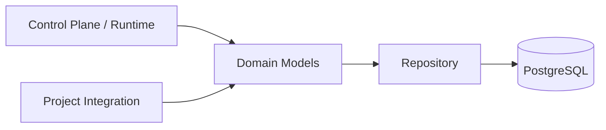
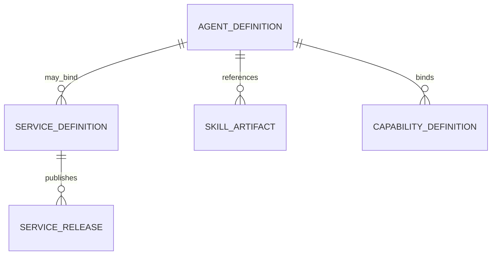

# 核心领域与发布模型 模块需求与设计一体化文档

> **文档编号**: MOD-CORE-1.0  
> **文档版本**: v1.2  
> **创建日期**: 2026-09-10  
> **文档状态**: 设计草稿（V1.7 整改对齐 + align 细化）  
> **设计基线**: 《通用智能服务执行框架 V1.6 总体设计说明书》+《05-变更记录/V1.6-to-V1.7-整改对齐说明》（D01/D04/D06/D08）  
> **模板类型**: design-full（跨模块/架构核心模块）

**评审边界说明**：

- 需求评审：第 2 章，确认模块职责和边界；
- 设计评审：第 3-4 章，确认技术实现、数据、接口、DFX、部署；
- 本文只设计 Framework Core，不引入任何具体项目业务字段。

---

## 1. 文档控制

### 1.1 责任人

| 角色 | 姓名 | 职责范围 |
|---|---|---|
| 产品/架构负责人 | 待定 | 模块边界、需求与总体设计一致性 |
| 开发负责人 | 待定 | 技术方案与实现 |
| 测试负责人 | 待定 | 场景与 Gate |
| 安全/运维评审 | 按需 | 安全、可靠性、部署评审 |

### 1.2 修订历史

| 版本 | 日期 | 变更描述 |
|---|---|---|
| v0.1 | 2026-09-10 | 基于总体设计 V1.6 首次形成模块详细设计 |
| v1.1 | 2026-09-10 | V1.7 整改：Agent 去发布化（D04）、Scope type 进 payload+schema_hash 冻结（D01）、删除 user_agent_binding（D06）、Owner 按角色填 |
| v1.2 | 2026-09-10 | align 细化：补 E-04（非法 scope 拒绝）、补 S-06（binding 删除回归）、追溯矩阵状态语义锁定为已实现+E2E待联调、Compliance Matrix 扩至 5 个 bind Spec |
| v1.4 | 2026-09-10 | §4.2 迁移策略明确「首发前允许直接 contract，首发后必须 expand→contract」 |
| v1.3 | 2026-09-10 | 补「归属」列；S-03/S-04 的后置 E2E 段登记承接方（模块 06 / 05）；S-05 的 scope 装载段承接方细化到模块 13 S-05 |

---

## 2. 需求分析

### 2.1 需求概述

| 项目 | 内容 |
|---|---|
| 模块名称 | 核心领域与发布模型 |
| 模块ID | MOD-CORE |
| 需求类型 | 新框架模块设计 |
| 业务背景 | 框架需要一组稳定、与具体项目无关的领域对象，承载 Agent、Service、Skill、Capability、Execution 等概念，并避免再次演化成万能 Resource 和重型版本中心。 |
| 核心目标 | 建立最小且稳定的领域模型、状态语义和发布边界，使上层 Console、Runtime、Worker、Integration 都依赖同一组通用对象。 |
| 运行形态 | Python Framework Library；不独立部署 |

### 2.2 痛点与价值

| 维度 | 内容 |
|---|---|
| 目标用户 | Builder、Admin；间接服务 Agent Runtime、Worker 和 Project Integration |
| 当前问题 | 历史方案中 Tool/MCP/Skill/Plugin 等对象边界漂移，RuntimeProfile 侵入产品语义，配置对象普遍引入复杂版本/生效状态。 |
| 框架影响 | 领域模型一旦错误会扩散到数据库、API、Console、Runtime 与 Integration，后期重构成本最高。 |
| 预期价值 | 用少量稳定对象支撑不同项目接入，同时把业务发布、运行配置和不可变资源的生命周期分开。 |

### 2.3 功能方案

#### 2.3.1 功能清单

| 功能ID | 功能名称 | 功能描述 | 优先级 | 来源 |
|---|---|---|---|---|
| FEAT-01 | 通用领域对象 | 定义 PlatformUser、AgentDefinition、ServiceDefinition、SkillArtifact、CapabilityDefinition、Execution 等核心对象。 | P0 | 总体设计 V1.6 |
| FEAT-02 | 轻量发布模型 | 只有 Service 保留草稿/已发布；Agent 统一 direct-effect + revision/audit（V1.7 D04，删除“关键 Agent”概念）；其他配置 direct-effect + revision/audit。 | P0 | 总体设计 V1.7 |
| FEAT-03 | 不可变资源 | Skill/静态知识等采用 artifact + checksum，不建立独立发布状态机。 | P0 | 总体设计 V1.6 |
| FEAT-04 | 通用 ResourceScope | `resource_scope_type` 放入 Service Draft/Published Payload 并冻结 `schema_hash`（V1.7 D01）；Execution 只保存通用 resource_scope，不出现 customer/device 等项目字段。 | P0 | 总体设计 V1.7 |

> 无 PRD，来源列引用总体设计基线；plan 拆解时 FEAT 来源即本表来源列。

#### 2.4 范围与边界

| 类别 | 内容 |
|---|---|
| 范围（In Scope） | Framework Core 的领域对象、枚举、状态、发布语义、ID/审计字段和跨模块引用规则。 |
| 非范围（Out of Scope） | 具体业务实体、项目 RBAC、MSS/CRM/ERP 字段、通用 Workflow Designer、复杂版本比较/激活中心。 |
| 前置假设 | 业务项目通过 Integration 扩展；PostgreSQL 为生产 SoT；Console 主要由低频管理员使用。 |
| 有意妥协/技术债 | V1 不设计复杂可视化版本差异；内部 release/audit 足以支撑排障和必要回滚。 |

### 2.5 验收条件

#### 2.5.1 业务规则与约束

| ID | 类型 | 描述 | 验证场景 |
|---|---|---|---|
| RULE-01 | 系统约束 | Framework Core 领域对象不得包含具体项目领域字段。 | S-01/E-01 |
| RULE-02 | 系统约束 | 只有 Service 有 draft/published 业务发布状态；Agent 统一 direct-effect + revision（V1.7 D04）。 | S-02 |
| RULE-03 | 系统约束 | 已发布 Snapshot 内容不可被原地修改；修改先进入 Draft。 | E-02 |
| RULE-04 | 系统约束 | 用户权限、Credential、紧急禁用不由 ExecutionSnapshot 固定。 | S-03 |
| RULE-05 | 系统约束 | `resource_scope_type` 必须随 ServiceRelease 快照冻结 `schema_hash`；Proposal.scope 为未验证候选，不得写入 TrustedExecutionContext（V1.7 D01）。 | S-05/E-04 |
| RULE-06 | 系统约束 | `user_agent_binding` 已删除（V1.7 D06）；路由由 ChannelAccount.default_agent + Routing Policy 决定。 | S-06 |

#### 2.5.2 功能验收场景

**正常场景**

| 场景ID | 功能ID | 优先级 | 测试层级 | 关键真实边界 | 归属 | 前置条件 | 操作步骤 | 预期结果 |
|---|---|---|---|---|---|---|---|---|
| S-01 | FEAT-01 | P0 | integration | Domain Model → Repository Schema | 本模块 | 已完成基础配置 | 创建不含任何项目专属字段的 Service/Agent/Capability 对象 | 对象可持久化并被 Runtime/Console 共用 |
| S-02 | FEAT-02 | P0 | integration | Console/API → Store → Runtime Resolve | 本模块 + 后置段 → 模块 02 / 05 | 已完成基础配置 | 修改 Service 形成 Draft，校验后发布 | current published 原子切换，线上请求只看到完整已发布内容 |
| S-03 | FEAT-04 | P0 | integration | ExecutionSnapshot → RuntimeDynamicContext | 后置 → 模块 05 / 09 | 已完成基础配置 | 创建 Execution 后撤销用户权限，再恢复任务 | 业务逻辑仍按 Snapshot，权限按当前状态重新校验 |
| S-04 | FEAT-03 | P0 | integration | Object Store → SkillArtifact → Published Resolver | 本模块 + 后置段 → 模块 05 | 已完成基础配置 | 上传两个不同 checksum 的 Skill artifact，并让新 Draft 选择新 artifact | 旧 artifact 保持不可变；发布后新 Execution 使用新 checksum |
| S-05 | FEAT-04 | P0 | integration | Manifest → ServiceRelease → ExecutionSnapshot | 本模块 + 后置段 → 模块 13 | 已完成基础配置 | Service payload 声明 scope type + schema_hash，Proposal 带合法 scope | 合法创建成功 |
| S-06 | FEAT-01 | P0 | integration | Migration Head → Models → Gate | 本模块 | 0002 已合入 | 升级到 head 并全库扫描模型定义 | 无 `user_agent_binding` 表及字段引用；路由解析只走 default_agent + Routing Policy |

**异常场景**

| 场景ID | 功能ID | 测试层级 | 关键真实边界 | 归属 | 触发条件 | 系统行为 | 用户感知 |
|---|---|---|---|---|---|---|---|
| E-01 | FEAT-01 | integration | Architecture Gate → framework/domain | 本模块 | Core 中引入 integrations/mss 或 customer/device 字段 | CI 失败，阻止合并 | 返回可识别错误，不泄露内部细节 |
| E-02 | FEAT-02 | integration | Repository → Published Snapshot | 本模块 | 尝试原地修改 published payload | Repository 层守卫拒绝 UPDATE（不暴露 update 方法，直调抛错）；DB 层不加 trigger——单一写入者约定由 gate 保证 | 返回可识别错误，不泄露内部细节 |
| E-04 | FEAT-04 | integration | Manifest → resource_scope_validator | 本模块 | Proposal.scope type 未知 / schema_hash 与 Release 冻结值不一致 | 拒绝并抛 `SERVICE_CONFIGURATION_INVALID`（D01：SCOPE_INVALID/SCOPE_FORBIDDEN 同族） | 返回可识别错误码，不泄露内部 schema 细节 |

#### 2.5.3 非功能指标

| 指标ID | 指标名称 | 目标值 | 测量方法 |
|---|---|---|---|
| NFR-REL-01 | 可靠性 | 不得丢失/破坏框架权威状态；具体 SLA 待真实部署压测后确定 | 故障注入 + integration/E2E |
| NFR-SEC-01 | 安全边界 | 不得信任 LLM 提供的身份/权限/Host 路径等安全上下文 | Architecture Gate + integration |
| NFR-OBS-01 | 可观测性 | 关键操作必须携带 request_id/trace_id 或 execution_id | 日志/Trace 断言 |

性能/QPS/延迟阈值当前没有真实压测依据，本文不虚构固定数字；上线门槛在真实 Reference Integration 跑通后补充。**无性能敏感点**：Core 为低频控制面库（发布/解析），无写热点、高频调用与大数据列表查询，跳过性能与容量维度。

---

## 3. 技术设计

### 3.1 方案选型

#### 关键决策记录

| 决策点 | 选择 | 被否决项 | 理由 | 可逆性 |
|---|---|---|---|---|
| 发布粒度 | 仅 Service 两态；Agent direct-effect | 所有对象统一版本中心 / 关键Agent两态 | V1.7 D04 做减法，Service 发布时冻结 Agent 配置 | 易 |
| 资源版本 | artifact + checksum | Skill Draft/Publish/Active/Retired | 不可变引用更简单且更可靠 | 易 |
| 业务范围 | resource_scope_type 进 payload + schema_hash 冻结 | customer_scope 固化列 / 类型另建表 | 保持 Core 通用 + 快照隔离（V1.7 D01） | 中 |

#### 技术栈

| 类别 | 选型 | 版本 | 选型理由 |
|---|---|---|---|
| 语言 | Python | 3.12+ | 与 Runtime/Worker 共仓共享模型 |
| 模型 | Pydantic v2 | 2.x | 强类型 Contract 与校验 |
| 持久化映射 | SQLAlchemy 2 Async | 2.x | Repository/ORM 与 Domain 分离 |
| 数据库 | PostgreSQL | 待部署确定 | 权威状态与事务发布 |

### 3.2 架构设计



#### 分层职责

| 层级 | 职责 | 代码落点 |
|---|---|---|
| Domain | 对象语义、枚举、不变量 | `framework/domain/` |
| Application | 发布、解析、校验用例 | `framework/domain/publish.py`、`framework/agent_core/resolver.py`、`framework/execution/` |
| Repository | 持久化接口 | `adapters/postgres/*_repository.py` |
| Adapter | SQLAlchemy/PostgreSQL 实现 | `adapters/postgres/models.py`、`session.py` |
| Integration | 只组合/引用 Core 对象，不反向修改 Core | `framework/integration/`（E-01 门禁） |

### 3.3 数据设计

> **统一数据库公共字段约束**：本模块凡新增 Framework 自建表，均必须包含 `is_deleted BOOLEAN NOT NULL DEFAULT FALSE`、`create_time TIMESTAMPTZ NOT NULL DEFAULT now()`、`update_time TIMESTAMPTZ NOT NULL DEFAULT now()`；Repository 默认过滤 `is_deleted=false`，删除默认逻辑删除。第三方自管理表（如 LangGraph Checkpointer）不修改其内部 Schema。


| 数据对象/表 | 关键字段 | 约束/索引 | 说明 |
|---|---|---|---|
| agent_definition | id、name、description、instructions、model_config_id、memory_policy、revision、enabled | id PK；name 唯一（WHERE is_deleted=false）；V1.7 D04 无 draft/published | Agent 配置对象（direct-effect） |
| service_definition | id、name、current_release_id、draft_payload、enabled | current_release_id FK | 业务服务定义 |
| service_release | id、service_id、release_id、content_hash、published_payload | UNIQUE(service_id, release_id/content_hash) | 原子发布快照 |
| skill_artifact | id、name、package_ref、checksum | checksum 索引 | 不可变资源 |
| capability_definition | id、name、risk、side_effect、enabled | name 唯一 | 稳定能力合同 |


**ER 图**



### 3.4 接口设计

形态：**函数库接口**（HTTP API 由 02 Platform API 模块设计，本模块只定库契约）。

| 接口ID | 接口/函数 | 形态 | 说明 | 关联功能 |
|---|---|---|---|---|
| LIB-01 | publish_service(draft) -> PublishedService | 函数库 | 校验并原子发布 Service | FEAT-02 |
| LIB-02 | resolve_agent(agent_id) -> AgentDefinition | 函数库 | 解析当前有效 Agent 配置 | FEAT-01 |
| LIB-03 | build_execution_snapshot(...) | 函数库 | 冻结必要执行逻辑 | FEAT-02,FEAT-04 |

函数库接口必须返回领域对象或显式错误，不允许通过 `dict` 隐式传递发布状态。所有 published 内容必须包含 `content_hash` 以支持审计和缓存一致性。

所有普通 HTTP JSON 接口必须复用统一响应 Envelope：

```json
{
  "code": "OK",
  "message": "success",
  "data": {},
  "request_id": "req-xxx",
  "timestamp": "2026-09-10T15:00:00+00:00"
}
```

SSE/WebSocket/文件流属于协议例外，但必须复用统一错误码 taxonomy 和 request/trace 关联策略。

### 3.5 质量实现方案

#### 可靠性

发布使用数据库事务完成 validate + snapshot persist + current pointer switch；失败不得留下半发布状态。

#### 安全性

Domain 层不保存 Credential 明文；安全动态状态不进入不可变业务 Snapshot。

#### 可观测性

发布、停用、紧急禁用记录 audit event；日志记录 entity_id/release_id/revision/content_hash，不记录完整敏感 payload。

#### 测试策略

```text
unit
→ 纯规则/状态机/转换

integration
→ Repository / Provider / Runtime 边界

E2E
→ 真实进程/API/数据库/用户可见结果

architecture
→ 依赖方向、Stateless、统一响应、Core Purity 等硬约束
```

---

## 4. 部署与运维

### 4.1 部署架构

作为 Python package 被 `platform-api`、`agent-runtime`、`worker` 引用，不独立 Deployment。

### 4.2 发布与回滚

- 框架代码通过镜像/包版本发布；
- Schema 变化使用 Alembic。**首次发布前允许直接 contract**（框架未发布、无存量部署，
  拆两步是空成本）；**首次发布后必须 expand → migrate → switch → contract**。当前 0002（Agent 去发布化删列）属前者；
- 只有 `Service` 采用草稿/已发布两态，`Agent` 统一 direct-effect + revision（V1.7 D04），不把代码发布和业务定义发布混成一套版本系统；
- 运行配置可直接生效时必须保留 revision/audit；
- 回滚不得恢复已经撤销的用户权限、Credential 或安全禁用状态。

### 4.3 监控告警

监控发布失败次数、resolve 失败、无效 binding、配置 hash 不一致；基线规则：**发布失败 > 0 即告警**（零阈值）；resolve 失败率与 hash 不一致先只记录不告警。

其余阈值统一标记为**待定**，由 Reference Integration 实测建立基线后配置。

---

## 5. 风险与依赖

### 5.1 项目依赖

| 依赖模块/团队 | 依赖内容 | 状态 | 风险等级 |
|---|---|---|---|
| PostgreSQL | 持久化领域对象/发布事务 | 必需 | 低 |
| Object Store | Skill/静态资源引用 | 按资源使用 | 低 |
| Project Integration | 提供具体 Service/Agent/Capability 配置 | 外部扩展 | 中 |

### 5.2 风险识别

| 风险ID | 类型 | 描述 | 概率 | 影响 | 应对措施 | 验证场景 |
|---|---|---|---|---|---|---|
| RISK-01 | 架构 | Core 被首个业务项目污染 | 中 | 高 | Core Purity Gate + 第二个非 MSS 示例 Integration | E-01 |
| RISK-02 | 复杂度 | 发布模型再次膨胀 | 中 | 高 | 只有 Service 允许业务发布状态（V1.7 D04）；新增状态机需架构评审 | S-02 |

---

## 6. 需求追溯矩阵

| 来源 | 功能ID | 接口ID | 测试场景 | 测试层级 | 状态 |
|---|---|---|---|---|---|
| 总体设计 V1.7 | FEAT-01 | LIB-02 | S-01, E-01, S-06 | integration | 已实现（unit；E2E 待联调） |
| 总体设计 V1.7 | FEAT-02 | LIB-01, LIB-03 | S-02, E-02 | integration | 已实现（unit+smoke；E2E 待联调） |
| 总体设计 V1.6 | FEAT-03 | 内部契约（§3.3 skill_artifact + resolver checksum 引用，无独立 LIB） | S-04 | integration | 功能段已实现（artifact 不可变）；**E2E 段后置 → 模块 05 `S-04`** |
| 总体设计 V1.7 | FEAT-04 | LIB-03 | S-03, S-05, E-04 | integration | S-05 功能段已实现；S-03 功能段已实现（快照隔离 RULE-04），**E2E 段后置 → 模块 06 `S-06`**（执行期权限重校验）/ 模块 09 |

> 状态语义（已锁定）：库层 unit+smoke 已实现；本简报面向 plan 的待办即各行 E2E 联调缺口。

> **后置 E2E 承接方登记**（依据 design-full 模板 §2.5.2「归属」列规则：标 `后置` 的场景必须写出承接方）：
>
> | 本模块场景 | 后置段 | 承接方 | 承接场景 |
> |---|---|---|---|
> | S-03 | 权限按当前状态重新校验 | `06-Worker Engine.md` | `S-06`（执行期重新解析 Auth/Authorization）、`E-03`（权限已撤销不自动提权） |
> | S-04 | 发布后新 Execution 使用新 checksum | `05-ExecutionService.md` | `S-04`（Published Resolver 取发布时冻结值）、`E-03`（无 published release 拒绝创建） |
> | S-02 | Console/API 段 | `02-Platform API 与控制面.md` | `S-02`（HTTP → Publish Service） |
> | S-02 | Runtime Resolve 段 | `03-Agent Runtime.md` | `S-04`（Current Revision Resolver） |
> | S-05 | Manifest 装载段（scope type 的 schema_hash 来源） | `13-Project Integration 与 Registry.md` | `S-05`（Manifest → ResourceScopeRegistry，FEAT-06/LIB-03） |

---

## Spec Compliance Matrix

| Spec/Rule | enforcement | 设计影响 | 设计落点 | 验证场景 | verifier | 状态 |
|---|---|---|---|---|---|---|
| backend-database#RULE-backend-database-001 | required | 5 张表三公共字段+软删；expand-contract 迁移；参数化查询 | §3.3 数据设计 | S-01/S-06 | `test_database_common_fields.py` + alembic head | applied |
| backend-code-quality-performance#RULE-backend-quality-001 | required | LIB 接口显式错误对象；Repository 超时/重试；每 LIB 有单测 | §3.4/§3.5 | S-02/S-05/E-04 | `test_publishing.py` | applied |
| backend-directory-structure#RULE-backend-directory-001 | required | domain/application/repository/adapter 分层落点 | §3.2 分层职责 | E-01 | `test_core_purity.py` | applied |
| backend-logging#RULE-backend-logging-001 | required | audit event + request_id/execution_id；禁敏感 payload | §3.5 可观测性 | S-02（audit 断言） | 日志/Trace 断言 | applied |
| backend-platform-rules#RULE-backend-platform-001 | required | 统一 Envelope + 错误码 taxonomy；发布回滚策略 | §3.4 Envelope/§4.2 | S-02/E-04 | `test_response.py` | applied |

---

## 附录：术语表

| 术语 | 定义 |
|---|---|
| Framework Core | 与具体业务项目解耦的框架内核 |
| Integration | 具体项目对框架 SPI/Contract 的实现和配置 |
| Capability | 稳定的“系统能做什么”合同 |
| Execution | 一次可靠业务服务执行实例 |
| SoT | Source of Truth，权威事实源 |
| SPI | Service Provider Interface，扩展接口 |
| DFX | 面向可靠性、安全性、可测试性、可运维性等质量属性的设计 |

---