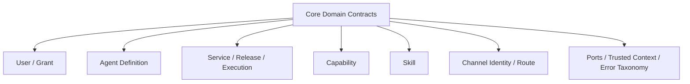

<!-- V1.11 module-split metadata -->
> **文档分档**：`Full`（模板 `design-full.md`）  
> **分档理由**：核心领域、发布语义、跨模块 Contract  
> **文档边界**：本文件是该模块唯一详细设计事实源；DB Owner 与接口 Owner 必须落在本模块，不允许在其他模块重复定义。  
> **拆分原则**：仅按可独立评审/编码/验收的一级模块拆分；不按单表/单接口继续碎片化。

# 核心领域与发布模型 模块需求与设计一体化文档

> **文档编号**: MOD-CORE-V1.13
> **文档版本**: V1.13
> **创建日期**: 2026-09-11
> **文档状态**: 设计基线草案（待仓库 Spec Context 绑定后进入正式评审）
> **模板**: `design-full.md`；生成流程按 `cf-task:align` 的复杂后端/架构模块路径执行。
> **上游基线**: V1.8 完整总体设计 + V6 完整 Playbook + Console V0.8 Final。


**评审边界说明**：
- 第 2 章是需求基线（What），禁止实现阶段自行改变领域语义；
- 第 3-4 章是设计基线（How），DB 与每个接口必须以本文为准；
- `Spec Compliance Matrix` 当前依据设计基线生成，因本轮未提供仓库 `spec-context.yml` 与代码目录，**不得声称已通过 cf-task:align 的 repo Spec Gate**；落码前必须在真实仓库执行 `refresh/catalog/bind`。


## 1. 文档控制

### 1.1 责任人

| 角色 | 姓名 | 职责范围 |
|---|---|---|
| 产品/架构负责人 | 待定 | 需求定义、领域边界、与总设/Playbook 一致性 |
| 开发负责人 | 待定 | 技术方案、DB/API、实现 |
| 测试负责人 | 待定 | S/E/B 场景、E2E Gate |
| 安全/运维 | 待定 | Secret、隔离、发布、监控 |

### 1.2 修订历史

| 版本 | 日期 | 作者 | 变更描述 |
|---|---|---|---|
| V1.11 模块分档拆分版 | 2026-09-11 | ChatGPT / 待项目负责人确认 | 按 cf-task:align + design-full 从最新完整总设/Playbook/交互稿重新生成；细化 DB 与全部接口 |
| V1.13 第三轮 Review 修复 | 2026-09-12 | Claude Code | 新增 CORE-LIB-06（TrustedExecutionContext 定义与构造）与 CORE-LIB-07（DomainError 与公共错误码引用）；补 S-CORE-06；Snapshot ModelProjection 超时字段改秒并补 extra_headers；修正 §6 追溯矩阵接口指向与合规矩阵 verifier |
| V1.13.1 第四轮合理性修复 | 2026-09-12 | Claude Code | 新增 CORE-LIB-08 LeaseQueue 共享租约原语（claim/renew/release/assert_owner；模块 06 与模块 11 共用同一实现与同一 epoch 语义，消除重复实现）及 FEAT-CORE-06、RULE-CORE-07、S-CORE-07；§3.3 明确租约字段语义的唯一实现；ExecutionProposal.resource_scope 按最小 typed 形态（`{type, refs[], attributes?}`）表述，去除 Service 级 scope JSON Schema 校验措辞 |

## 2. 需求分析

### 2.1 需求概述

| 项目 | 内容 |
|---|---|
| 模块名称 | 核心领域与发布模型 |
| 模块ID | MOD-CORE |
| 所属系统/产品线 | Fluxion 通用智能服务执行框架 |
| 需求类型 | 中大型功能 / 架构演进 |
| 业务背景 | 总设要求 Framework Core 与具体 MSS/CRM/ERP 业务解耦，同时只在真正需要的对象上保留发布边界；历史版本曾出现万能 Resource 和过重版本模型。 |
| 核心目标 | 固定跨模块不可绕过的领域语义、状态/发布边界、公共 DB/错误/revision/hash 规则，使后续模块只实现一个事实源。 |

### 2.2 痛点与价值

| 维度 | 内容 |
|---|---|
| 目标用户 | 架构师、所有后端开发者、测试负责人 |
| 当前问题 | 如果不同模块各自解释 Service/Agent/Skill/Capability/Execution、软删除、revision、发布语义，会产生双事实源与运行漂移。 |
| 业务影响 | 领域对象重叠、API 语义不一致、DB 关系难以维护、实现人员靠猜。 |
| 预期价值 | 把总设中最关键的语义变成可检查的公共 Contract 和编码约束。 |

**用户故事**

| 编号 | 用户故事 | 优先级 |
|---|---|---|
| US-CORE-01 | 作为模块开发者，我希望明确对象所有权和发布语义，以便新增代码不会形成第二套事实源。 | P0 |
| US-CORE-02 | 作为测试负责人，我希望 revision/release/snapshot 语义稳定，以便编写跨模块 E2E。 | P0 |

### 2.3 功能方案

#### 2.3.1 功能清单

| 功能ID | 功能名称 | 功能描述 | 优先级 | 来源 |
|---|---|---|---|---|
| FEAT-CORE-01 | 对象所有权 | 明确 User/Agent/Service/Skill/Capability/Execution 等所有权。 | P0 | 总体设计 P1/P3 |
| FEAT-CORE-02 | 发布边界 | 只有 Service Draft/Release；Agent/Model/Capability/ProjectPlatform direct-effect+revision。 | P0 | 总体设计 P11 |
| FEAT-CORE-03 | Execution Snapshot | 冻结一致性所需业务逻辑，不冻结实时授权/Credential。 | P0 | 总体设计 P6/P8 |
| FEAT-CORE-04 | 公共持久化规则 | tenant/软删除/revision/immutable/hash。 | P0 | 数据库基线 |
| FEAT-CORE-05 | 错误与可信上下文 | 统一 DomainError/TrustedExecutionContext。 | P0 | 总体设计 P8 |
| FEAT-CORE-06 | 共享租约原语 | claim/renew/release/fencing 的唯一实现（LeaseQueue），Execution 与 Chat Run 共用同一 epoch 语义。 | P0 | 第四轮 Review B1 |

#### 2.3.2 字段约束

| 字段/对象 | 类型 | 必填 | 约束 | 说明 |
|---|---|---|---|---|
| tenant_id | UUID | 是 | 服务端注入 | 所有业务对象租户隔离 |
| revision | BIGINT | 配置类对象是 | 单调递增 | direct-effect 乐观锁，不等于发布版本 |
| release | immutable object | 仅 Service | append-only | 正式发布边界 |
| snapshot | immutable projection | Execution 是 | 不可含 Secret | 执行一致性 |

### 2.4 范围与边界

| 类别 | 内容 |
|---|---|
| 范围（In Scope） | 领域名词、对象所有权、状态边界、Service 发布、direct-effect revision、Execution Snapshot、软删除、错误 taxonomy、公共 hash。 |
| 非范围（Out of Scope） | 具体业务 CRUD/Endpoint、具体 Adapter/Provider、MSS 专有对象。 |
| 前置假设 | 上游总设、公共 DB/API 规范、外部基础设施可用 |
| 有意妥协 / 技术债 | 无；未来扩展必须有真实旅程驱动 |

### 2.5 验收条件

#### 2.5.1 业务规则与约束

| ID | 类型 | 描述 | 验证场景 |
|---|---|---|---|
| RULE-CORE-01 | 架构 | Framework Core 不出现 MSS/customer/device/policy_check 领域表或核心 API。 | S-CORE-01 |
| RULE-CORE-02 | 发布 | 只有 Service 有 Draft/Validate/Test/Publish。 | S-CORE-02 |
| RULE-CORE-03 | 配置 | Agent/Model/Capability/ProjectPlatform 保存后新请求直接生效并 revision/audit。 | S-CORE-03 |
| RULE-CORE-04 | 快照 | Snapshot 不冻结 AgentAccessGrant/Credential/Capability emergency enabled。 | S-CORE-04 |
| RULE-CORE-05 | 数据 | Framework 可变表默认软删除并 tenant scoped。 | S-CORE-05 |
| RULE-CORE-06 | 可信身份 | tenant/actor/projection/test_mode 只能由 CORE-LIB-06 构造入口赋值，不得来自 LLM、请求体或 Skill 入参。 | S-CORE-06 |
| RULE-CORE-07 | 并发 | 租约领取/续租/释放/fencing 只能由 CORE-LIB-08 实现；使用方（模块 06/11）不得各自实现第二套 epoch 递增与续租语义。 | S-CORE-07 |

#### 2.5.2 功能验收场景

**正常场景**

| 场景ID | 功能ID | 优先级 | 测试层级 | 关键真实边界 | 归属 | 前置条件 | 操作步骤 | 预期结果 |
|---|---|---|---|---|---|---|---|---|
| S-CORE-05 | FEAT-CORE-01 | P1 | integration | 软删除后同 key 可重建 | 本模块 | 存在已软删对象 | 软删后以相同 key 新建 | 新建成功；旧记录保留且默认查询不可见 |
| S-CORE-01 | FEAT-CORE-01 | P0 | integration | module import/DB schema scan | 本模块 | 加载 Core | 检查领域/表/接口目录 | 无 MSS 专属核心对象 |
| S-CORE-02 | FEAT-CORE-02 | P0 | E2E | Service publish→Execution | 后置 → 模块 05 | Service 有 Draft | 发布 v1 后再修改 Draft | 旧 Execution 仍引用 v1，新请求可用新发布 |
| S-CORE-03 | FEAT-CORE-03 | P0 | E2E | Agent config→Runtime | 后置 → 模块 03/04 | Agent r1 | 保存 r2 | 新请求解析 r2，无 Agent publish |
| S-CORE-04 | FEAT-CORE-03 | P0 | E2E | Snapshot→dynamic auth | 后置 → 模块 05/18 | Execution 已创建 | 撤销 AgentAccessGrant 后恢复 | 恢复阶段被拒绝，不沿用旧授权 |
| S-CORE-06 | FEAT-CORE-05 | P0 | integration | 中间件/运行时→Library 边界 | 本模块+02 | 已认证调用方 | 请求体/Skill 入参与 IPC 参数携带伪造 tenant_id/actor_user_id/projection/test_mode | 构造入口拒绝或忽略外部传入的身份与 projection；消费方一律使用 ctx 中的可信值，伪造值不生效且不产生跨租户读写 |
| S-CORE-07 | FEAT-CORE-06 | P0 | integration | 两个 owner 并发 claim 同一行（真 PG）→ 失租方写入被拒 | 本模块+06/11 | service_execution 与 conversation_run 各有一条可领取行 | 两个 owner 经同一 CORE-LIB-08 并发 claim 同一行；失租 owner 随后用旧 lease_epoch 执行 renew/release/状态写入 | 只有一个 owner 领取成功（lease_epoch 只递增一次）；失租 owner 的 renew 返回 false、写入与 release 被 LEASE_LOST(409) 拒绝，并立即停止推进，不产生重复副作用 |

**异常场景**

| 场景ID | 功能ID | 测试层级 | 关键真实边界 | 归属 | 触发条件 | 系统行为 | 用户感知 |
|---|---|---|---|---|---|---|---|
| E-CORE-01 | FEAT-CORE-04 | integration | Repository→PG | 本模块 | 跨租户 FK/查询 | fail-closed/0 row | 不泄露存在性 |
| E-CORE-02 | FEAT-CORE-02 | integration | revision update | 本模块 | expected revision 过期 | REVISION_CONFLICT | 调用方刷新重试 |

**边界场景**

| 场景ID | 测试层级 | 关键真实边界 | 归属 | 字段/条件 | 边界值 | 预期行为 |
|---|---|---|---|---|---|---|
| B-CORE-01 | unit | canonical hash | 本模块 | JSON key 顺序 | 不同顺序同语义 | hash 相同 |

#### 2.5.3 非功能指标

| 指标ID | 指标名称 | 目标值 | 测量方法 |
|---|---|---|---|
| NFR-REL-01 | 可靠执行 | 不得因单 Runtime/Worker 进程退出丢失权威状态 | SIGKILL/E2E |
| NFR-SEC-01 | 可信身份 | LLM/客户端不得覆盖 tenant/actor/secret | 安全测试 |
| NFR-OBS-01 | 可追踪 | 关键路径可按 request_id/trace_id/execution_id 定位 | 集成/E2E |

## 3. 技术设计

### 3.1 方案选型

#### 3.1.1 关键决策记录

| 决策点 | 选择 | 被否决项 | 理由 | 可逆性 |
|---|---|---|---|---|
| 发布模型 | Service 唯一发布对象 | 所有对象都 Draft/Publish | 降低管理员和 Runtime 复杂度 | 难回退 |
| 状态一致性 | Snapshot + dynamic safety recheck | 冻结所有对象 | 授权/Credential 必须实时撤销 | 中 |
| 公共对象 | 独立领域模型 | 万能 Resource 表 | 避免弱类型和生命周期混乱 | 难 |

#### 3.1.2 技术栈

| 类别 | 选型 | 版本 | 选型理由 |
|---|---|---|---|
| 语言 | Python | 3.12+（仓库实际版本落码前确认） | 与 Agent/LLM 生态一致 |
| Web/API | FastAPI + Pydantic | 仓库实际版本确认 | 类型契约与异步 IO |
| ORM | SQLAlchemy 2 Async | 仓库实际版本确认 | 异步 PostgreSQL |
| 数据库 | PostgreSQL | 外部部署 | 业务 SoT |

### 3.2 架构设计



#### 3.2.1 模块职责分层

| 层级 | 职责 | 禁止事项 |
|---|---|---|
| Handler/API | 协议解析、DTO、权限入口、统一错误映射 | 业务逻辑/直接 SQL |
| Application Service | 用例编排、事务边界、领域校验 | 依赖具体 Web 框架 |
| Domain | 领域对象/规则 | 基础设施依赖 |
| Repository/Port | 持久化/外部能力抽象 | 泄露 Secret/跨领域修改 |
| Adapter | PostgreSQL/HTTP/MCP 等实现 | 改变领域语义 |

#### 3.2.2 外部依赖清单

| 外部系统/模块 | 依赖类型 | 协议/接口 | 超时/一致性 | 降级策略 |
|---|---|---|---|---|
| PostgreSQL | 公共约束 | SQLAlchemy/DDL | 事务一致性 | 不可用时控制/执行持久化失败 |
| 各领域模块 | Contract | Python interface | 编译/测试一致 | Architecture Gate |

### 3.3 数据设计

本模块**不拥有独立业务表**。这是刻意设计：权威状态由其领域所有者持久化，本模块只读取/调用 Port。禁止为了实现方便新增 shadow truth、本地 SQLite 或进程内业务事实。


公共表字段是规范，不建立 `core_resource` 万能表。各表由对应领域模块拥有。

`service_execution`（模块 06）与 `conversation_run`（模块 11）各自保留自己的租约字段（`lease_owner/lease_expires_at/lease_epoch`），因为两者的领域语义不同（执行调度事实 vs Chat turn 事实）；但**租约规则只有一处实现**：字段语义、claim 时的 epoch 递增、续租不改 epoch、以及所有状态写入前的 owner+epoch 校验统一由 CORE-LIB-08 提供，两张表不得各自定义第三套 claim/续租/fencing 语义。

### 3.4 接口设计

#### 3.4.1 接口清单

| 接口ID | 名称 | 形态 | 方法/签名 | 路径/用途 |
|---|---|---|---|---|
| CORE-LIB-01 | 公共软删除过滤 | Library | def active_scope(stmt, model, tenant_id: UUID): ... | Repository 基类强制使用 |
| CORE-LIB-02 | revision 乐观锁 | Library | async def update_with_revision(repo, id: UUID, expected_revision: int, patch: dict) -> object | direct-effect 配置写入 |
| CORE-LIB-03 | Canonical JSON Hash | Library | def canonical_json_sha256(value: object) -> str | Release/Snapshot/Manifest 指纹 |
| CORE-LIB-04 | ExecutionProposal 数据类 | Library | @dataclass class ExecutionProposal | 提案类型定义；模块 05 签发与消费 |
| CORE-LIB-05 | 执行冻结投影 | Library | ExecutionProjection | 数据类；本节 CORE-LIB-05 定义 |
| CORE-LIB-06 | TrustedExecutionContext 定义与构造 | Library | def build_trusted_context(identity: RuntimeIdentity, *, agent_id=None, conversation_id=None, execution_id=None, projection=None, test_mode=None, deadline=None) -> TrustedExecutionContext | 可信上下文唯一构造入口 |
| CORE-LIB-07 | DomainError 与公共错误码引用 | Library | class DomainError；def to_envelope(request_id) -> ApiEnvelope | 统一错误结构与公共错误码注册表引用 |
| CORE-LIB-08 | LeaseQueue 共享租约原语 | Library | async def claim(tx, *, table: LeaseTarget, now: datetime, limit: int, owner: str, ttl_ms: int, filter: ClaimFilter) -> list[Claimed]；async def renew(tx, *, target_id: UUID, owner: str, expected_epoch: int, ttl_ms: int) -> bool；async def release(tx, *, target_id: UUID, owner: str, expected_epoch: int, next_run_at: datetime \| None) -> None；def assert_owner(row_owner, row_epoch, owner, epoch, now, lease_expires_at) -> None | service_execution（模块 06）与 conversation_run（模块 11）的领取/续租/释放/fencing 唯一实现 |

**CORE-LIB-04: ExecutionProposal（模块 01 定义类型；模块 05 签发和消费）**

候选 `ExecutionProposalCandidate` 仅含 agent_id/service_id/intent/input/resource_scope/evidence/risk_level，由 AGCORE-LIB-04 构造，不携带授权。
可信提案 `ExecutionProposalView` 由 EXE-LIB-02 返回，持久化事实在模块 05 execution_proposal：

| 字段 | 类型 | 说明 |
|---|---|---|
| proposal_id / conversation_id / service_id / agent_id | UUID | 持久定位及归属 |
| input / resource_scope | object | input 经 Schema 校验；resource_scope 为最小 typed 形态 `{type, refs[], attributes?}`（模块 05 定义，V1 无 scope JSON Schema、无 schema_hash、无 Scope Registry 投影脱敏） |
| snapshot_id / service_release_id | UUID | 本次展示对应的不可变逻辑 |
| confirmation_digest | string | tenant/actor/conversation/agent/service/release content_hash/snapshot hash/input/scope/rendered_summary/expires_at 的 canonical SHA-256 |
| confirmation_ref | string | 服务端签名(proposal_id, confirmation_digest, expires_at)，不代表用户已经批准 |
| rendered_summary | string | 确认页面/消息实际展示内容 |
| created_at / expires_at | datetime | 服务端时间；默认有效 300 秒 |
| status | string | PENDING/CONFIRMED/EXPIRED/SUPERSEDED |

确认必须通过 EXE-LIB-03：可信入站 USER 消息关联 proposal_id，服务端从 PG 取回提案、检查本人/租户/会话及签名；不能由 LLM 回填“已确认”。同会话下一轮“确认”解析唯一 PENDING 提案，跨 Pod 不依赖内存；跨会话须重新签发提案，不能隐式搬用确认。重复已成功消费返回同一 Execution。字段变更或发布版本变更需重新展示/确认。

**CORE-LIB-05: ExecutionProjection（不可变业务投影）**

| 字段 | 类型 | 说明 |
|---|---|---|
| schema_version | integer | 固定 1；未知版本拒绝 |
| source | FORMAL/TEST | 来源；仅可信 Application 可赋值 |
| service | ServiceProjection | service_id、release_id 或 draft_revision、content_hash、primary_agent_id、完整 ServiceDraft |
| agents | map[UUID, AgentProjection] | id/revision/instructions/model_id/memory_policy/direct_capability_keys/skill_ids/service_ids |
| skills | map[UUID, SkillProjection] | skill_id/artifact_id/checksum/entrypoint/sdk_version/dependency_keys |
| models | map[UUID, ModelProjection] | model_id/revision/protocol/base_url/model_name/default_parameters/extra_headers/request_timeout_seconds；不含 Secret 值/密钥类认证头（extra_headers 仅非敏感 Header） |
| test_mode | DRY_RUN/REAL_TEST/null | TEST 必填，FORMAL 必须 null |
| content_hash | string | 除本字段外的 canonical hash |

Owner：EXE-LIB-02/测试入口在一致读取事务中构建，execution_snapshot.snapshot_json 持久化。Worker 从 snapshot_id 加载并校验 hash 后注入 `TrustedExecutionContext.projection`；AgentExecutionContext/宿主 SkillInvocationContext 引用同一只读对象。Execution 路径 projection 必填且 source 与根对象一致，缺失报 EXECUTION_PROJECTION_REQUIRED，禁止 fallback current。Chat 的 projection=null，使用 current。

AGENT-LIB-01 显式接收 projection；Agent instructions、绑定、MemoryPolicy、Skill checksum、Model 参数均来自它。当前 Agent/Skill/Model/Capability enabled、tenant/user 状态、AgentAccessGrant、Credential、Secret 始终实时校验；绑定配置变更只影响新请求，紧急禁止使用 enabled/撤销授权完成。Secret 按当前 model_id 或 Credential 解析，不从快照获取。实际 input 经快照内 Schema 校验。

#### CORE-LIB-06: TrustedExecutionContext 定义与构造

**入口类型**：Library

**认证/授权**：Library；本类型是所有数据访问与外部能力调用的唯一可信身份载体。构造入口只能由模块 02 的认证中间件（HTTP 路径，WEB-LIB-03）或模块 03/06 的运行时（Chat/Execution 路径）调用；Handler、Application Service、Repository/Port、Adapter、Provider 与 Skill 只读该上下文，不得自行构造或改写字段。

**函数签名**

```python
@dataclass(frozen=True)
class TrustedExecutionContext:
    tenant_id: UUID
    actor_user_id: UUID
    actor_role: str                       # END_USER/BUILDER/ADMIN/SERVICE
    service_role: str                     # platform-api/agent-runtime/worker/channel-gateway/skill-sandbox
    request_id: str
    deadline: datetime
    agent_id: UUID | None = None
    conversation_id: UUID | None = None
    execution_id: UUID | None = None
    projection: ExecutionProjection | None = None
    test_mode: TestMode | None = None     # DRY_RUN/REAL_TEST


def build_trusted_context(
    identity: RuntimeIdentity,
    *,
    agent_id: UUID | None = None,
    conversation_id: UUID | None = None,
    execution_id: UUID | None = None,
    projection: ExecutionProjection | None = None,
    test_mode: TestMode | None = None,
    deadline: datetime | None = None,
) -> TrustedExecutionContext
```

**入参**

| 参数 | 类型 | 必填 | 说明 |
|---|---|---|---|
| identity | RuntimeIdentity | Y | 唯一身份来源；由模块 02 中间件或模块 03/06 运行时解析 |
| agent_id / conversation_id / execution_id | uuid | N | 运行时按执行事实补齐，不来自请求体 |
| projection | ExecutionProjection | N | Execution 路径必填；Chat 路径必须为 None |
| test_mode | DRY_RUN/REAL_TEST | N | 仅 TEST 来源可赋值；FORMAL 必须为 None |
| deadline | datetime | N | 缺省由运行时按调用类型给出 |

**字段**

| 字段 | 类型 | 说明 |
|---|---|---|
| tenant_id | uuid | 唯一租户来源；后续查询/写入/RPC 一律以此为准 |
| actor_user_id | uuid | 真实用户；service 路径为服务身份对应的 system actor |
| actor_role | string | END_USER/BUILDER/ADMIN/SERVICE；Admin-only 判定依据 |
| service_role | string | 发起调用的运行角色，用于审计与内部调用诊断 |
| agent_id / conversation_id / execution_id | uuid | 路径标识；三者与 projection 共同决定解析 current 还是冻结投影 |
| projection | ExecutionProjection | 只读冻结投影；Execution 路径必填，Chat 路径为 None |
| test_mode | DRY_RUN/REAL_TEST | 仅 TEST 来源可赋值 |
| request_id | string | 关联 ID，贯穿日志/Trace/审计 |
| deadline | datetime | 本上下文的调用 deadline |

**处理逻辑**

```text
identity（模块 02 中间件 / 模块 03、06 运行时）是唯一身份来源；其余关键字参数由运行时按已固化的执行事实补齐；
构造结果不可变，贯穿 Handler → Application Service → Repository/Port → Provider/Skill。
```

**补充约束**

- 任何身份/租户/`projection`/`test_mode` 字段**不得**来自 LLM 输出、请求体、Query、Skill 入参或子进程 IPC 参数；构造方只能取认证中间件解析结果或运行时已固化的执行事实。
- 类型为 frozen dataclass，不提供 setter；身份变化必须重新构造，禁止原地修改或复制后改写。
- **Execution 路径**：`projection` 必填且 `execution_id` 非空；缺失时由消费方报 `EXECUTION_PROJECTION_REQUIRED`（见 CORE-LIB-05），禁止 fallback current。
- **Chat 路径**：`projection` 必须为 `None` 且 `execution_id` 为空，按 current 解析。
- `test_mode` 非空只允许在 TEST 来源路径出现；FORMAL 路径赋值非空即构造错误。
- 内部服务调用方（`/internal/*`）的身份来自模块 09 的 AUTH-LIB-02 service token 校验结果；本模块只消费该契约，不定义签发与校验。

#### CORE-LIB-07: DomainError 与公共错误码引用

**入口类型**：Library

**认证/授权**：Library；错误对象由服务端构造，调用方只能读取 `code/http_status/message/field_errors/retryable`。禁止把外部/下游原始响应体、堆栈或 Secret 直接放入 `message`/`field_errors`。

**函数签名**

```python
@dataclass(frozen=True)
class DomainError(Exception):
    code: str
    http_status: int
    message: str
    field_errors: dict[str, str] | None = None
    retryable: bool = False

    def to_envelope(self, request_id: str) -> ApiEnvelope: ...
```

**字段**

| 字段 | 类型 | 说明 |
|---|---|---|
| code | string | 稳定错误码；取值来自公共错误码注册表 |
| http_status | integer | 对外 HTTP 状态；由错误码决定，Handler 不得另行改写 |
| message | string | 面向用户的安全消息，不含堆栈/Secret/内部路径 |
| field_errors | map[string,string] | 可选；字段级校验错误，键为对外字段名 |
| retryable | boolean | 调用方是否可安全重试；与模块 06 的重试分类保持一致 |

**错误码注册表**

公共错误码清单的唯一权威位于 `01-架构与规范/10-错误码与错误分类基线.md`（本模块只引用，不在此重复定义）。各模块错误码必须登记到该清单后才可对外返回；未登记的错误码禁止出现在响应中。

**`to_envelope` 约定**

```text
{code, message, data: null, request_id, field_errors?}；HTTP status 取 DomainError.http_status；
Web 层统一经 WEB-LIB-02 映射（模块 02），SSE/WebSocket/文件/Prometheus 端点沿用同一错误 taxonomy 但不套 JSON Envelope。
```

**补充约束**：`retryable` 只描述“是否可安全重试”，不代表已重试；重试次数与退避由调用方按模块 06 的失败策略决定。

#### CORE-LIB-01: 公共软删除过滤

**入口类型**：Library

**认证/授权**：Library；由 Repository 基类在 CORE-LIB-06 的 `ctx` 内调用；tenant_id 只能取自 `ctx`，不得来自请求体或调用方自填。

**函数签名**

```python
def active_scope(stmt, model, tenant_id: UUID): ...
```

**入参**

| 参数 | 类型 | 必填 | 说明 |
|---|---|---|---|
| stmt | SQLAlchemy Select | Y | 查询 |
| tenant_id | uuid | Y | 租户 |

**返回**

| 字段 | 类型 | 说明 |
|---|---|---|
| stmt | Select | 自动附加 tenant_id + is_deleted=false |

**处理逻辑**

```text
Repository 基类强制使用；禁止业务 Repository 自行遗漏 tenant filter。
```

#### CORE-LIB-02: revision 乐观锁

**入口类型**：Library

**认证/授权**：Library；调用方必须已在 CORE-LIB-06 的 `ctx` 内完成对象所有权与角色校验；`expected_revision` 只能来自服务端可信读路径（如详情响应），不得由请求体直接透传。

**函数签名**

```python
async def update_with_revision(repo, id: UUID, expected_revision: int, patch: dict) -> object
```

**入参**

| 参数 | 类型 | 必填 | 说明 |
|---|---|---|---|
| expected_revision | integer | Y | 客户端/上层看到的 revision |

**返回**

| 字段 | 类型 | 说明 |
|---|---|---|
| entity | object | revision+1 |

**异常/错误**

| 错误码 | 场景 | HTTP 状态 |
|---|---|---|
| REVISION_CONFLICT | 当前 revision 已变化 | 409 |

**处理逻辑**

```text
UPDATE ... WHERE id=? AND revision=? AND is_deleted=false SET ..., revision=revision+1；rowcount=0 区分 not found/conflict。
```

#### CORE-LIB-03: Canonical JSON Hash

**入口类型**：Library

**认证/授权**：Library；纯函数，不访问租户数据；输入必须是服务端构造的 Release/Snapshot/Manifest payload，不得直接散列客户端原始请求体。

**函数签名**

```python
def canonical_json_sha256(value: object) -> str
```

**入参**

| 参数 | 类型 | 必填 | 说明 |
|---|---|---|---|
| value | object | Y | Release/Snapshot/Manifest payload |

**返回**

| 字段 | 类型 | 说明 |
|---|---|---|
| hash | string | sha256 hex |

**处理逻辑**

```text
稳定 key 排序/编码/禁止非 JSON 数值 → UTF-8 canonical JSON → SHA-256；同语义 payload 必须稳定。
```

#### CORE-LIB-08: LeaseQueue 共享租约原语

**入口类型**：Library

**认证/授权**：Library；原语不自行鉴权，接受调用方已在 CORE-LIB-06 的 `ctx` 所属 tenant 范围内开启的事务 `tx`。调用方必须是持租约的运行角色进程（`service_role ∈ {worker, agent-runtime}`）：`owner` 只能取本实例标识（Worker ID / Runtime 实例 ID），不得来自请求体、消息正文或 LLM 输出；`table`、`filter`、`ttl_ms` 由调用方的服务端代码确定性给出，不接受外部入参透传。

**函数签名**

```python
LeaseTarget = Literal["service_execution", "conversation_run"]

async def claim(
    tx: AsyncSession, *, table: LeaseTarget, now: datetime,
    limit: int, owner: str, ttl_ms: int, filter: ClaimFilter,
) -> list[Claimed]

async def renew(
    tx: AsyncSession, *, target_id: UUID, owner: str,
    expected_epoch: int, ttl_ms: int,
) -> bool

async def release(
    tx: AsyncSession, *, target_id: UUID, owner: str,
    expected_epoch: int, next_run_at: datetime | None,
) -> None

def assert_owner(
    row_owner: str | None, row_epoch: int, owner: str, epoch: int,
    now: datetime, lease_expires_at: datetime | None,
) -> None   # 失配抛 LEASE_LOST
```

**入参**

| 参数 | 类型 | 必填 | 说明 |
|---|---|---|---|
| tx | AsyncSession | Y | 调用方事务；claim 的选择与占用写入必须在同一事务内完成 |
| table | LeaseTarget | Y | service_execution / conversation_run；决定列映射与默认排序键 |
| now | datetime | Y | 服务端时间；到期判定与 lease_expires_at 计算一律以此为准 |
| limit | integer | Y | 单次 claim 行数上限；由调用方按本实例并发额度给出 |
| owner | string | Y | 本实例标识（Worker ID / Runtime 实例 ID） |
| ttl_ms | integer | Y | 租约时长；claim 与 renew 的到期时间均为 `now + ttl_ms` |
| filter | ClaimFilter | Y | 可选状态谓词、到期谓词与排序键（见下表） |
| target_id | uuid | Y | renew/release 的目标行 |
| expected_epoch | integer | Y | 调用方持有的 lease_epoch；与行上值不符即 LEASE_LOST |
| next_run_at | datetime/null | N | release 时的下次可运行时间；NULL 表示不重新排队 |

**返回**

| 接口 | 字段 | 类型 | 说明 |
|---|---|---|---|
| claim | claimed | array<Claimed> | 每项含 target_id、owner、lease_expires_at 与递增后的 lease_epoch，以及调用方调度所需字段（service_execution 的 priority/next_run_at；conversation_run 的 source_message_id/sequence_no） |
| renew | ok | boolean | true=续租成功且 epoch 未变；false=失配或已到期，调用方按 LEASE_LOST 处理并停止推进 |
| release | — | None | 成功即本轮租约结束；owner/epoch 失配抛 LEASE_LOST |

**异常/错误**

| 错误码 | 场景 | HTTP 状态 |
|---|---|---|
| LEASE_LOST | owner/epoch 不匹配、租约已过期或已被他人接管；renew/release 之外的任何租约持有期状态写入都会先经 assert_owner 并同样以本错误终止 | 409 |

**处理逻辑**

```text
claim：SELECT ... WHERE <filter 允许的状态> AND (lease_expires_at IS NULL OR lease_expires_at <= now) AND <filter 到期谓词>
       ORDER BY <filter 排序键> FOR UPDATE SKIP LOCKED LIMIT :limit
       → 对选中行在同一事务写 lease_owner=owner、lease_expires_at=now+ttl_ms、lease_epoch = lease_epoch + 1 → 在新 epoch 下返回。
renew：条件 UPDATE ... WHERE id=:id AND lease_owner=:owner AND lease_epoch=:expected AND lease_expires_at > :now
       SET lease_expires_at = now+ttl_ms；**不修改 lease_epoch**；rowcount=0 → 返回 false。
release：同一 owner+epoch 校验下清空 lease_owner/lease_expires_at，并按 next_run_at 决定是否立即重新排队；失配抛 LEASE_LOST。
assert_owner：owner 字段、lease_epoch、lease_expires_at 三者任一失配（含 owner 为空、已过期）即抛 LEASE_LOST。
所有租约持有期的状态写入（根/步骤/图节点状态、进度事件、结果、消息、投递行）必须先调用 assert_owner；
失配 = LEASE_LOST(409)，调用方必须立即停止推进并放弃该 epoch 的副作用，不得以同一 epoch 重试。
```

**排序键与谓词：同一实现，两套调用方参数**

| 使用方 | table | 排序键 / 状态与到期谓词 |
|---|---|---|
| 模块 06 Worker | service_execution | `priority DESC, next_run_at ASC NULLS FIRST, create_time ASC`；状态 ∈ 可运行集合且 `next_run_at <= now` |
| 模块 03/11 Chat Run | conversation_run | source message 的 `sequence_no`；`QUEUED` 与**已到期 `RUNNING` 优先于新 turn** 的谓词 |

**补充约束**

- 本原语是 Framework 内**唯一的租约实现**：`service_execution` 与 `conversation_run` 共用本实现与同一 epoch 语义；模块 06 与模块 11 不得各自实现第三套 claim/续租/fencing（RULE-CORE-07）。
- 两张表仍各自保留（领域语义不同），差异只允许体现在表的列映射、`filter` 与排序键；**租约规则本身不再各写一套**。
- claim 提交后其他实例仍必须经过同一租约条件，不能仅依靠行锁；`ttl_ms` 由调用方按角色给出（Worker 心跳周期 / Runtime 租约周期），原语不内置默认值。

### 3.5 质量实现方案

#### 3.5.1 性能与容量

| 热点路径 | 负载量级 | 潜在瓶颈 | 实现方案 | 目标值 |
|---|---|---|---|---|
| tenant scoped repository | 所有请求 | 漏索引/全表扫 | 每个高频 FK/状态/时间条件按模块建组合索引 | 待压测 |
| canonical hash | 发布/导入低频 | 大 JSON CPU | 规范化一次并缓存结果，不在热循环重复 hash | 非热点 |

#### 3.5.2 可靠性

核心规则必须通过 Architecture Gate、migration/contract test 固化；不能只依赖文档约定。

#### 3.5.3 安全性

TrustedExecutionContext（CORE-LIB-06）由服务端创建且不可变；Core 不提供 setter 让 LLM/客户端覆盖 actor/tenant/projection/test_mode。身份来源限于模块 02 认证中间件与模块 03/06 运行时；内部服务调用方的身份以模块 09 AUTH-LIB-02 的 service token（audience + scope）校验结果为准。

#### 3.5.4 可观测性

日志、Metrics、Trace 统一关联 request_id/trace_id；Execution 路径附带 execution_id/step_id；错误码稳定。

#### 3.5.5 测试策略

Domain/validator 单测；Repository/Provider 真 PG/外部 Stub 集成；核心用户旅程做 E2E；安全和崩溃恢复不得只靠 mock。

## 4. 部署与运维

### 4.1 部署架构

随其所属运行角色部署；PostgreSQL/Redis/Object Store/Secret Provider/OTel Backend 均为外部依赖，不打包进应用 Compose/Helm。

### 4.2 发布与回滚

DB 变更使用向前兼容迁移；应用支持滚动回滚；若涉及不可变 Release/Artifact，只切换 current 指针，不覆盖历史。

### 4.3 监控告警

至少监控请求/调用量、错误率、延迟、外部依赖失败、关键队列/执行积压和配置加载失败；阈值由环境基线确定。

### 4.4 数据迁移

若无历史生产数据则直接按新 Schema 建表；若已有部署，使用 Alembic 等可回滚/可前滚迁移，禁止运行时隐式改表。

## 5. 风险与依赖

| 风险ID | 描述 | 影响 | 应对措施 | 验证场景 |
|---|---|---|---|---|
| RISK-CORE-01 | 模块实现绕开 Application Service 直接改他域表 | 高 | Repository 目录依赖扫描 + code review + contract test | S-CORE-01 |
| RISK-CORE-02 | Snapshot 误冻结授权/Credential | 高 | Snapshot schema denylist + 恢复 E2E | S-CORE-04 |

## 6. 需求追溯矩阵

| 功能ID | 接口ID | 验证场景 | 测试层级 | 状态 |
|---|---|---|---|---|
| FEAT-CORE-01 | CORE-LIB-01, CORE-LIB-02, CORE-LIB-04 | S-CORE-01, S-CORE-05 | E2E/integration | 待实现/评审 |
| FEAT-CORE-02 | CORE-LIB-02, CORE-LIB-03 | S-CORE-02, E-CORE-02 | E2E/integration | 待实现/评审 |
| FEAT-CORE-03 | CORE-LIB-03, CORE-LIB-05 | S-CORE-03, S-CORE-04 | E2E/integration | 待实现/评审 |
| FEAT-CORE-04 | CORE-LIB-01, CORE-LIB-02 | E-CORE-01 | E2E/integration | 待实现/评审 |
| FEAT-CORE-05 | CORE-LIB-06, CORE-LIB-07 | S-CORE-06 | E2E/integration | 待实现/评审 |
| FEAT-CORE-06 | CORE-LIB-08 | S-CORE-07 | E2E/integration | 待实现/评审 |

## Spec Compliance Matrix

| Spec/Rule | enforcement | 设计影响 | 设计落点 | 验证场景 | 状态/N/A 理由 |
|---|---|---|---|---|---|
| DESIGN/CORE#RULE-CORE-01 | design-baseline | 约束实现与验收 | §2.5 RULE-CORE-01 / §3 | S-CORE-01 | applied；仓库 spec-context 待绑定 |
| DESIGN/CORE#RULE-CORE-02 | design-baseline | 约束实现与验收 | §2.5 RULE-CORE-02 / §3 | S-CORE-02 | applied；仓库 spec-context 待绑定 |
| DESIGN/CORE#RULE-CORE-03 | design-baseline | 约束实现与验收 | §2.5 RULE-CORE-03 / §3 | S-CORE-03 | applied；仓库 spec-context 待绑定 |
| DESIGN/CORE#RULE-CORE-04 | design-baseline | 约束实现与验收 | §2.5 RULE-CORE-04 / §3 | S-CORE-04 | applied；仓库 spec-context 待绑定 |
| DESIGN/CORE#RULE-CORE-05 | design-baseline | 约束实现与验收 | §2.5 RULE-CORE-05 / §3 | S-CORE-05, E-CORE-01 | applied；仓库 spec-context 待绑定 |
| DESIGN/CORE#RULE-CORE-06 | design-baseline | 约束实现与验收 | §3.4.1 CORE-LIB-06 / §3.5.3 | S-CORE-06 | applied；仓库 spec-context 待绑定 |
| DESIGN/CORE#RULE-CORE-07 | design-baseline | 约束实现与验收 | §2.5 RULE-CORE-07 / §3.3 / §3.4.1 CORE-LIB-08 | S-CORE-07 | applied；仓库 spec-context 待绑定 |

## 附录 A：接口与 DB 落码检查清单

- [ ] 每个 HTTP Endpoint 已有 DTO、鉴权、错误码、处理逻辑、测试。
- [ ] 每个 Library/CLI 接口有稳定签名和异常语义。
- [ ] 每张表字段、类型、NULL、默认值、唯一约束、索引、软删除策略已落实迁移。
- [ ] Request/Response 字段不接受客户端传入可信 tenant/actor/credential。
- [ ] 列表接口使用服务端分页，避免无界返回。
- [ ] 修改类接口有 revision/冲突语义；高风险/副作用路径满足幂等和审计。
- [ ] 仓库 Spec Context 已 refresh/catalog/bind 且 required Rules 映射到 S/E/B verifier。
