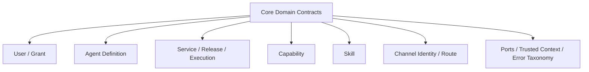

<!-- V1.11 module-split metadata -->
> **文档分档**：`Full`（模板 `design-full.md`）  
> **分档理由**：核心领域、发布语义、跨模块 Contract  
> **文档边界**：本文件是该模块唯一详细设计事实源；DB Owner 与接口 Owner 必须落在本模块，不允许在其他模块重复定义。  
> **拆分原则**：仅按可独立评审/编码/验收的一级模块拆分；不按单表/单接口继续碎片化。

# 核心领域与发布模型 模块需求与设计一体化文档

> **文档编号**: MOD-CORE-V1.11 模块分档拆分版
> **文档版本**: V1.11 模块分档拆分版
> **创建日期**: 2026-09-11
> **文档状态**: 设计基线草案（待仓库 Spec Context 绑定后进入正式评审）
> **模板**: `design-full.md`；生成流程按 `cf-task:align` 的复杂后端/架构模块路径执行。
> **上游基线**: V1.8 完整总体设计 + V6 完整 Playbook + Console V0.8 Final。


**评审边界说明**：
- 第 2 章是需求基线（What），禁止实现阶段自行改变领域语义；
- 第 3-4 章是设计基线（How），DB 与每个接口必须以本文为准；
- `Spec Compliance Matrix` 当前依据设计基线生成，因本轮未提供仓库 `spec-context.yml` 与代码目录，**不得声称已通过 cf-task:align 的 repo Spec Gate**；落码前必须在真实仓库执行 `refresh/catalog/bind`。


## 1. 文档控制

### 1.1 责任人

| 角色 | 姓名 | 职责范围 |
|---|---|---|
| 产品/架构负责人 | 待定 | 需求定义、领域边界、与总设/Playbook 一致性 |
| 开发负责人 | 待定 | 技术方案、DB/API、实现 |
| 测试负责人 | 待定 | S/E/B 场景、E2E Gate |
| 安全/运维 | 待定 | Secret、隔离、发布、监控 |

### 1.2 修订历史

| 版本 | 日期 | 作者 | 变更描述 |
|---|---|---|---|
| V1.11 模块分档拆分版 | 2026-09-11 | ChatGPT / 待项目负责人确认 | 按 cf-task:align + design-full 从最新完整总设/Playbook/交互稿重新生成；细化 DB 与全部接口 |

## 2. 需求分析

### 2.1 需求概述

| 项目 | 内容 |
|---|---|
| 模块名称 | 核心领域与发布模型 |
| 模块ID | MOD-CORE |
| 所属系统/产品线 | Fluxion 通用智能服务执行框架 |
| 需求类型 | 中大型功能 / 架构演进 |
| 业务背景 | 总设要求 Framework Core 与具体 MSS/CRM/ERP 业务解耦，同时只在真正需要的对象上保留发布边界；历史版本曾出现万能 Resource 和过重版本模型。 |
| 核心目标 | 固定跨模块不可绕过的领域语义、状态/发布边界、公共 DB/错误/revision/hash 规则，使后续模块只实现一个事实源。 |

### 2.2 痛点与价值

| 维度 | 内容 |
|---|---|
| 目标用户 | 架构师、所有后端开发者、测试负责人 |
| 当前问题 | 如果不同模块各自解释 Service/Agent/Skill/Capability/Execution、软删除、revision、发布语义，会产生双事实源与运行漂移。 |
| 业务影响 | 领域对象重叠、API 语义不一致、DB 关系难以维护、实现人员靠猜。 |
| 预期价值 | 把总设中最关键的语义变成可检查的公共 Contract 和编码约束。 |

**用户故事**

| 编号 | 用户故事 | 优先级 |
|---|---|---|
| US-CORE-01 | 作为模块开发者，我希望明确对象所有权和发布语义，以便新增代码不会形成第二套事实源。 | P0 |
| US-CORE-02 | 作为测试负责人，我希望 revision/release/snapshot 语义稳定，以便编写跨模块 E2E。 | P0 |

### 2.3 功能方案

#### 2.3.1 功能清单

| 功能ID | 功能名称 | 功能描述 | 优先级 | 来源 |
|---|---|---|---|---|
| FEAT-CORE-01 | 对象所有权 | 明确 User/Agent/Service/Skill/Capability/Execution 等所有权。 | P0 | 总体设计 P1/P3 |
| FEAT-CORE-02 | 发布边界 | 只有 Service Draft/Release；Agent/Model/Capability/ProjectPlatform direct-effect+revision。 | P0 | 总体设计 P11 |
| FEAT-CORE-03 | Execution Snapshot | 冻结一致性所需业务逻辑，不冻结实时授权/Credential。 | P0 | 总体设计 P6/P8 |
| FEAT-CORE-04 | 公共持久化规则 | tenant/软删除/revision/immutable/hash。 | P0 | 数据库基线 |
| FEAT-CORE-05 | 错误与可信上下文 | 统一 DomainError/TrustedExecutionContext。 | P0 | 总体设计 P8 |

#### 2.3.2 字段约束

| 字段/对象 | 类型 | 必填 | 约束 | 说明 |
|---|---|---|---|---|
| tenant_id | UUID | 是 | 服务端注入 | 所有业务对象租户隔离 |
| revision | BIGINT | 配置类对象是 | 单调递增 | direct-effect 乐观锁，不等于发布版本 |
| release | immutable object | 仅 Service | append-only | 正式发布边界 |
| snapshot | immutable projection | Execution 是 | 不可含 Secret | 执行一致性 |

### 2.4 范围与边界

| 类别 | 内容 |
|---|---|
| 范围（In Scope） | 领域名词、对象所有权、状态边界、Service 发布、direct-effect revision、Execution Snapshot、软删除、错误 taxonomy、公共 hash。 |
| 非范围（Out of Scope） | 具体业务 CRUD/Endpoint、具体 Adapter/Provider、MSS 专有对象。 |
| 前置假设 | 上游总设、公共 DB/API 规范、外部基础设施可用 |
| 有意妥协 / 技术债 | 无；未来扩展必须有真实旅程驱动 |

### 2.5 验收条件

#### 2.5.1 业务规则与约束

| ID | 类型 | 描述 | 验证场景 |
|---|---|---|---|
| RULE-CORE-01 | 架构 | Framework Core 不出现 MSS/customer/device/policy_check 领域表或核心 API。 | S-CORE-01 |
| RULE-CORE-02 | 发布 | 只有 Service 有 Draft/Validate/Test/Publish。 | S-CORE-02 |
| RULE-CORE-03 | 配置 | Agent/Model/Capability/ProjectPlatform 保存后新请求直接生效并 revision/audit。 | S-CORE-03 |
| RULE-CORE-04 | 快照 | Snapshot 不冻结 AgentAccessGrant/Credential/Capability emergency enabled。 | S-CORE-04 |
| RULE-CORE-05 | 数据 | Framework 可变表默认软删除并 tenant scoped。 | S-CORE-05 |

#### 2.5.2 功能验收场景

**正常场景**

| 场景ID | 功能ID | 优先级 | 测试层级 | 关键真实边界 | 归属 | 前置条件 | 操作步骤 | 预期结果 |
|---|---|---|---|---|---|---|---|---|
| S-CORE-05 | FEAT-CORE-01 | P1 | integration | 软删除后同 key 可重建 | 本模块 | 存在已软删对象 | 软删后以相同 key 新建 | 新建成功；旧记录保留且默认查询不可见 |
| S-CORE-01 | FEAT-CORE-01 | P0 | integration | module import/DB schema scan | 本模块 | 加载 Core | 检查领域/表/接口目录 | 无 MSS 专属核心对象 |
| S-CORE-02 | FEAT-CORE-02 | P0 | E2E | Service publish→Execution | 后置 → 模块 05 | Service 有 Draft | 发布 v1 后再修改 Draft | 旧 Execution 仍引用 v1，新请求可用新发布 |
| S-CORE-03 | FEAT-CORE-03 | P0 | E2E | Agent config→Runtime | 后置 → 模块 03/04 | Agent r1 | 保存 r2 | 新请求解析 r2，无 Agent publish |
| S-CORE-04 | FEAT-CORE-03 | P0 | E2E | Snapshot→dynamic auth | 后置 → 模块 05/18 | Execution 已创建 | 撤销 AgentAccessGrant 后恢复 | 恢复阶段被拒绝，不沿用旧授权 |

**异常场景**

| 场景ID | 功能ID | 测试层级 | 关键真实边界 | 归属 | 触发条件 | 系统行为 | 用户感知 |
|---|---|---|---|---|---|---|---|
| E-CORE-01 | FEAT-CORE-04 | integration | Repository→PG | 本模块 | 跨租户 FK/查询 | fail-closed/0 row | 不泄露存在性 |
| E-CORE-02 | FEAT-CORE-02 | integration | revision update | 本模块 | expected revision 过期 | REVISION_CONFLICT | 调用方刷新重试 |

**边界场景**

| 场景ID | 测试层级 | 关键真实边界 | 归属 | 字段/条件 | 边界值 | 预期行为 |
|---|---|---|---|---|---|---|
| B-CORE-01 | unit | canonical hash | 本模块 | JSON key 顺序 | 不同顺序同语义 | hash 相同 |

#### 2.5.3 非功能指标

| 指标ID | 指标名称 | 目标值 | 测量方法 |
|---|---|---|---|
| NFR-REL-01 | 可靠执行 | 不得因单 Runtime/Worker 进程退出丢失权威状态 | SIGKILL/E2E |
| NFR-SEC-01 | 可信身份 | LLM/客户端不得覆盖 tenant/actor/secret | 安全测试 |
| NFR-OBS-01 | 可追踪 | 关键路径可按 request_id/trace_id/execution_id 定位 | 集成/E2E |

## 3. 技术设计

### 3.1 方案选型

#### 3.1.1 关键决策记录

| 决策点 | 选择 | 被否决项 | 理由 | 可逆性 |
|---|---|---|---|---|
| 发布模型 | Service 唯一发布对象 | 所有对象都 Draft/Publish | 降低管理员和 Runtime 复杂度 | 难回退 |
| 状态一致性 | Snapshot + dynamic safety recheck | 冻结所有对象 | 授权/Credential 必须实时撤销 | 中 |
| 公共对象 | 独立领域模型 | 万能 Resource 表 | 避免弱类型和生命周期混乱 | 难 |

#### 3.1.2 技术栈

| 类别 | 选型 | 版本 | 选型理由 |
|---|---|---|---|
| 语言 | Python | 3.12+（仓库实际版本落码前确认） | 与 Agent/LLM 生态一致 |
| Web/API | FastAPI + Pydantic | 仓库实际版本确认 | 类型契约与异步 IO |
| ORM | SQLAlchemy 2 Async | 仓库实际版本确认 | 异步 PostgreSQL |
| 数据库 | PostgreSQL | 外部部署 | 业务 SoT |

### 3.2 架构设计



#### 3.2.1 模块职责分层

| 层级 | 职责 | 禁止事项 |
|---|---|---|
| Handler/API | 协议解析、DTO、权限入口、统一错误映射 | 业务逻辑/直接 SQL |
| Application Service | 用例编排、事务边界、领域校验 | 依赖具体 Web 框架 |
| Domain | 领域对象/规则 | 基础设施依赖 |
| Repository/Port | 持久化/外部能力抽象 | 泄露 Secret/跨领域修改 |
| Adapter | PostgreSQL/HTTP/MCP 等实现 | 改变领域语义 |

#### 3.2.2 外部依赖清单

| 外部系统/模块 | 依赖类型 | 协议/接口 | 超时/一致性 | 降级策略 |
|---|---|---|---|---|
| PostgreSQL | 公共约束 | SQLAlchemy/DDL | 事务一致性 | 不可用时控制/执行持久化失败 |
| 各领域模块 | Contract | Python interface | 编译/测试一致 | Architecture Gate |

### 3.3 数据设计

本模块**不拥有独立业务表**。这是刻意设计：权威状态由其领域所有者持久化，本模块只读取/调用 Port。禁止为了实现方便新增 shadow truth、本地 SQLite 或进程内业务事实。


公共表字段是规范，不建立 `core_resource` 万能表。各表由对应领域模块拥有。

### 3.4 接口设计

#### 3.4.1 接口清单

| 接口ID | 名称 | 形态 | 方法/签名 | 路径/用途 |
|---|---|---|---|---|
| CORE-LIB-05 | 执行冻结投影 | Library | ExecutionProjection | 数据类；本节 CORE-LIB-05 定义 |

| CORE-LIB-01 | 公共软删除过滤 | Library | def active_scope(stmt, model, tenant_id: UUID): ... |  |
| CORE-LIB-02 | revision 乐观锁 | Library | async def update_with_revision(repo, id: UUID, expected_revision: int, patch: dict) -> object |  |
| CORE-LIB-03 | Canonical JSON Hash | Library | def canonical_json_sha256(value: object) -> str |  |
| CORE-LIB-04 | ExecutionProposal 数据类 | Library | @dataclass class ExecutionProposal |  |

**CORE-LIB-04: ExecutionProposal（模块 01 定义类型；模块 05 签发和消费）**

候选 `ExecutionProposalCandidate` 仅含 agent_id/service_id/intent/input/resource_scope/evidence/risk_level，由 AGCORE-LIB-04 构造，不携带授权。
可信提案 `ExecutionProposalView` 由 EXE-LIB-02 返回，持久化事实在模块 05 execution_proposal：

| 字段 | 类型 | 说明 |
|---|---|---|
| proposal_id / conversation_id / service_id / agent_id | UUID | 持久定位及归属 |
| input / resource_scope | object | 经 Schema 校验的确认内容 |
| snapshot_id / service_release_id | UUID | 本次展示对应的不可变逻辑 |
| confirmation_digest | string | tenant/actor/conversation/agent/service/release content_hash/snapshot hash/input/scope/rendered_summary/expires_at 的 canonical SHA-256 |
| confirmation_ref | string | 服务端签名(proposal_id, confirmation_digest, expires_at)，不代表用户已经批准 |
| rendered_summary | string | 确认页面/消息实际展示内容 |
| created_at / expires_at | datetime | 服务端时间；默认有效 300 秒 |
| status | string | PENDING/CONFIRMED/EXPIRED/SUPERSEDED |

确认必须通过 EXE-LIB-03：可信入站 USER 消息关联 proposal_id，服务端从 PG 取回提案、检查本人/租户/会话及签名；不能由 LLM 回填“已确认”。同会话下一轮“确认”解析唯一 PENDING 提案，跨 Pod 不依赖内存；跨会话须重新签发提案，不能隐式搬用确认。重复已成功消费返回同一 Execution。字段变更或发布版本变更需重新展示/确认。

**CORE-LIB-05: ExecutionProjection（不可变业务投影）**

| 字段 | 类型 | 说明 |
|---|---|---|
| schema_version | integer | 固定 1；未知版本拒绝 |
| source | FORMAL/TEST | 来源；仅可信 Application 可赋值 |
| service | ServiceProjection | service_id、release_id 或 draft_revision、content_hash、primary_agent_id、完整 ServiceDraft |
| agents | map[UUID, AgentProjection] | id/revision/instructions/model_id/memory_policy/direct_capability_keys/skill_ids/service_ids |
| skills | map[UUID, SkillProjection] | skill_id/artifact_id/checksum/entrypoint/sdk_version/dependency_keys |
| models | map[UUID, ModelProjection] | model_id/revision/protocol/base_url/model_name/default_parameters/request_timeout_ms；不含 Secret 值/认证头 |
| test_mode | DRY_RUN/REAL_TEST/null | TEST 必填，FORMAL 必须 null |
| content_hash | string | 除本字段外的 canonical hash |

Owner：EXE-LIB-02/测试入口在一致读取事务中构建，execution_snapshot.snapshot_json 持久化。Worker 从 snapshot_id 加载并校验 hash 后注入 `TrustedExecutionContext.projection`；AgentExecutionContext/宿主 SkillInvocationContext 引用同一只读对象。Execution 路径 projection 必填且 source 与根对象一致，缺失报 EXECUTION_PROJECTION_REQUIRED，禁止 fallback current。Chat 的 projection=null，使用 current。

AGENT-LIB-01 显式接收 projection；Agent instructions、绑定、MemoryPolicy、Skill checksum、Model 参数均来自它。当前 Agent/Skill/Model/Capability enabled、tenant/user 状态、AgentAccessGrant、Credential、Secret 始终实时校验；绑定配置变更只影响新请求，紧急禁止使用 enabled/撤销授权完成。Secret 按当前 model_id 或 Credential 解析，不从快照获取。实际 input 经快照内 Schema 校验。

#### CORE-LIB-01: 公共软删除过滤

**入口类型**：Library

**函数签名**

```python
def active_scope(stmt, model, tenant_id: UUID): ...
```

**入参**

| 参数 | 类型 | 必填 | 说明 |
|---|---|---|---|
| stmt | SQLAlchemy Select | Y | 查询 |
| tenant_id | uuid | Y | 租户 |

**返回**

| 字段 | 类型 | 说明 |
|---|---|---|
| stmt | Select | 自动附加 tenant_id + is_deleted=false |

**处理逻辑**

```text
Repository 基类强制使用；禁止业务 Repository 自行遗漏 tenant filter。
```

#### CORE-LIB-02: revision 乐观锁

**入口类型**：Library

**函数签名**

```python
async def update_with_revision(repo, id: UUID, expected_revision: int, patch: dict) -> object
```

**入参**

| 参数 | 类型 | 必填 | 说明 |
|---|---|---|---|
| expected_revision | integer | Y | 客户端/上层看到的 revision |

**返回**

| 字段 | 类型 | 说明 |
|---|---|---|
| entity | object | revision+1 |

**异常/错误**

| 错误码 | 场景 | HTTP 状态 |
|---|---|---|
| REVISION_CONFLICT | 当前 revision 已变化 | 409 |

**处理逻辑**

```text
UPDATE ... WHERE id=? AND revision=? AND is_deleted=false SET ..., revision=revision+1；rowcount=0 区分 not found/conflict。
```

#### CORE-LIB-03: Canonical JSON Hash

**入口类型**：Library

**函数签名**

```python
def canonical_json_sha256(value: object) -> str
```

**入参**

| 参数 | 类型 | 必填 | 说明 |
|---|---|---|---|
| value | object | Y | Release/Snapshot/Manifest payload |

**返回**

| 字段 | 类型 | 说明 |
|---|---|---|
| hash | string | sha256 hex |

**处理逻辑**

```text
稳定 key 排序/编码/禁止非 JSON 数值 → UTF-8 canonical JSON → SHA-256；同语义 payload 必须稳定。
```

### 3.5 质量实现方案

#### 3.5.1 性能与容量

| 热点路径 | 负载量级 | 潜在瓶颈 | 实现方案 | 目标值 |
|---|---|---|---|---|
| tenant scoped repository | 所有请求 | 漏索引/全表扫 | 每个高频 FK/状态/时间条件按模块建组合索引 | 待压测 |
| canonical hash | 发布/导入低频 | 大 JSON CPU | 规范化一次并缓存结果，不在热循环重复 hash | 非热点 |

#### 3.5.2 可靠性

核心规则必须通过 Architecture Gate、migration/contract test 固化；不能只依赖文档约定。

#### 3.5.3 安全性

TrustedExecutionContext 由服务端创建；Core 不提供 setter 让 LLM/客户端覆盖 actor/tenant/credential。

#### 3.5.4 可观测性

日志、Metrics、Trace 统一关联 request_id/trace_id；Execution 路径附带 execution_id/step_id；错误码稳定。

#### 3.5.5 测试策略

Domain/validator 单测；Repository/Provider 真 PG/外部 Stub 集成；核心用户旅程做 E2E；安全和崩溃恢复不得只靠 mock。

## 4. 部署与运维

### 4.1 部署架构

随其所属运行角色部署；PostgreSQL/Redis/Object Store/Secret Provider/OTel Backend 均为外部依赖，不打包进应用 Compose/Helm。

### 4.2 发布与回滚

DB 变更使用向前兼容迁移；应用支持滚动回滚；若涉及不可变 Release/Artifact，只切换 current 指针，不覆盖历史。

### 4.3 监控告警

至少监控请求/调用量、错误率、延迟、外部依赖失败、关键队列/执行积压和配置加载失败；阈值由环境基线确定。

### 4.4 数据迁移

若无历史生产数据则直接按新 Schema 建表；若已有部署，使用 Alembic 等可回滚/可前滚迁移，禁止运行时隐式改表。

## 5. 风险与依赖

| 风险ID | 描述 | 影响 | 应对措施 | 验证场景 |
|---|---|---|---|---|
| RISK-CORE-01 | 模块实现绕开 Application Service 直接改他域表 | 高 | Repository 目录依赖扫描 + code review + contract test | S-CORE-01 |
| RISK-CORE-02 | Snapshot 误冻结授权/Credential | 高 | Snapshot schema denylist + 恢复 E2E | S-CORE-04 |

## 6. 需求追溯矩阵

| 功能ID | 接口ID | 验证场景 | 测试层级 | 状态 |
|---|---|---|---|---|
| FEAT-CORE-01 | CORE-LIB-01, CORE-LIB-02 | S-CORE-01 | E2E/integration | 待实现/评审 |
| FEAT-CORE-02 | CORE-LIB-02, CORE-LIB-03 | S-CORE-02, E-CORE-02 | E2E/integration | 待实现/评审 |
| FEAT-CORE-03 | CORE-LIB-03 | S-CORE-03, S-CORE-04 | E2E/integration | 待实现/评审 |
| FEAT-CORE-04 |  | E-CORE-01 | E2E/integration | 待实现/评审 |
| FEAT-CORE-05 |  | 见 §2.5 | E2E/integration | 待实现/评审 |

## Spec Compliance Matrix

| Spec/Rule | enforcement | 设计影响 | 设计落点 | 验证场景 | 状态/N/A 理由 |
|---|---|---|---|---|---|
| DESIGN/CORE#RULE-CORE-01 | design-baseline | 约束实现与验收 | §2.5 RULE-CORE-01 / §3 | S/E/B 场景 | applied；仓库 spec-context 待绑定 |
| DESIGN/CORE#RULE-CORE-02 | design-baseline | 约束实现与验收 | §2.5 RULE-CORE-02 / §3 | S/E/B 场景 | applied；仓库 spec-context 待绑定 |
| DESIGN/CORE#RULE-CORE-03 | design-baseline | 约束实现与验收 | §2.5 RULE-CORE-03 / §3 | S/E/B 场景 | applied；仓库 spec-context 待绑定 |
| DESIGN/CORE#RULE-CORE-04 | design-baseline | 约束实现与验收 | §2.5 RULE-CORE-04 / §3 | S/E/B 场景 | applied；仓库 spec-context 待绑定 |
| DESIGN/CORE#RULE-CORE-05 | design-baseline | 约束实现与验收 | §2.5 RULE-CORE-05 / §3 | S/E/B 场景 | applied；仓库 spec-context 待绑定 |

## 附录 A：接口与 DB 落码检查清单

- [ ] 每个 HTTP Endpoint 已有 DTO、鉴权、错误码、处理逻辑、测试。
- [ ] 每个 Library/CLI 接口有稳定签名和异常语义。
- [ ] 每张表字段、类型、NULL、默认值、唯一约束、索引、软删除策略已落实迁移。
- [ ] Request/Response 字段不接受客户端传入可信 tenant/actor/credential。
- [ ] 列表接口使用服务端分页，避免无界返回。
- [ ] 修改类接口有 revision/冲突语义；高风险/副作用路径满足幂等和审计。
- [ ] 仓库 Spec Context 已 refresh/catalog/bind 且 required Rules 映射到 S/E/B verifier。
