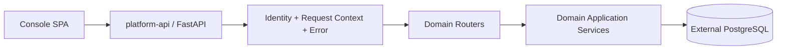

<!-- V1.11 module-split metadata -->
> **文档分档**：`Full`（模板 `design-full.md`）  
> **分档理由**：控制面聚合、跨领域 HTTP/API 边界  
> **文档边界**：本文件是该模块唯一详细设计事实源；DB Owner 与接口 Owner 必须落在本模块，不允许在其他模块重复定义。  
> **拆分原则**：仅按可独立评审/编码/验收的一级模块拆分；不按单表/单接口继续碎片化。

# Platform API 与控制面 模块需求与设计一体化文档

> **文档编号**: MOD-API-V1.11 模块分档拆分版
> **文档版本**: V1.11 模块分档拆分版
> **创建日期**: 2026-09-11
> **文档状态**: 设计基线草案（待仓库 Spec Context 绑定后进入正式评审）
> **模板**: `design-full.md`；生成流程按 `cf-task:align` 的复杂后端/架构模块路径执行。
> **上游基线**: V1.8 完整总体设计 + V6 完整 Playbook + Console V0.8 Final。


**评审边界说明**：
- 第 2 章是需求基线（What），禁止实现阶段自行改变领域语义；
- 第 3-4 章是设计基线（How），DB 与每个接口必须以本文为准；
- `Spec Compliance Matrix` 当前依据设计基线生成，因本轮未提供仓库 `spec-context.yml` 与代码目录，**不得声称已通过 cf-task:align 的 repo Spec Gate**；落码前必须在真实仓库执行 `refresh/catalog/bind`。


## 1. 文档控制

### 1.1 责任人

| 角色 | 姓名 | 职责范围 |
|---|---|---|
| 产品/架构负责人 | 待定 | 需求定义、领域边界、与总设/Playbook 一致性 |
| 开发负责人 | 待定 | 技术方案、DB/API、实现 |
| 测试负责人 | 待定 | S/E/B 场景、E2E Gate |
| 安全/运维 | 待定 | Secret、隔离、发布、监控 |

### 1.2 修订历史

| 版本 | 日期 | 作者 | 变更描述 |
|---|---|---|---|
| V1.11 模块分档拆分版 | 2026-09-11 | ChatGPT / 待项目负责人确认 | 按 cf-task:align + design-full 从最新完整总设/Playbook/交互稿重新生成；细化 DB 与全部接口 |

## 2. 需求分析

### 2.1 需求概述

| 项目 | 内容 |
|---|---|
| 模块名称 | Platform API 与控制面 |
| 模块ID | MOD-API |
| 所属系统/产品线 | Fluxion 通用智能服务执行框架 |
| 需求类型 | 中大型功能 / 架构演进 |
| 业务背景 | Console/Control Plane 需要统一 HTTP 契约、身份、错误、分页和审计入口，但不应复制各领域业务逻辑或成为 End User/Runtime 热路径。 |
| 核心目标 | 提供统一 FastAPI/Web 边界和 Control Plane 聚合，同时把每个业务 Endpoint 的所有权下放对应领域 Application Service。 |

### 2.2 痛点与价值

| 维度 | 内容 |
|---|---|
| 目标用户 | Builder/Admin；内部 Runtime/Gateway service client |
| 当前问题 | 如果 platform-api 自己实现 Agent/Service/Capability 业务逻辑，会形成第二套领域；如果 Console/Runtime 共用不可信身份参数，会破坏安全边界。 |
| 业务影响 | API 重复、越权、Runtime 依赖 Console 在线、难以分角色扩容。 |
| 预期价值 | 统一协议而不统一业务；Control Plane 可独立故障且不阻断已发布 Execution。 |

**用户故事**

| 编号 | 用户故事 | 优先级 |
|---|---|---|
| US-API-01 | 作为 Console，我希望所有 JSON API 有一致分页/Envelope/错误，以便前端统一处理。 | P0 |
| US-API-02 | 作为 Runtime，我希望 internal API 与 Console 身份边界分离，以便可信调用。 | P0 |

### 2.3 功能方案

#### 2.3.1 功能清单

| 功能ID | 功能名称 | 功能描述 | 优先级 | 来源 |
|---|---|---|---|---|
| FEAT-API-01 | API Router | 按领域注册业务路由。 | P0 | Console |
| FEAT-API-02 | Identity Middleware | Console 用户与 internal service identity。 | P0 | 安全边界 |
| FEAT-API-03 | Envelope/Error | 统一 JSON 响应与错误 taxonomy。 | P0 | 接口基线 |
| FEAT-API-04 | Pagination | 统一 page/page_size/total 约定。 | P0 | 前端规范 |
| FEAT-API-05 | Static Console | Console 静态资源与 platform-api 合并交付。 | P1 | 部署基线 |

### 2.4 范围与边界

| 类别 | 内容 |
|---|---|
| 范围（In Scope） | FastAPI app、router 装配、auth middleware、request/trace context、error handler、pagination DTO、CORS/CSRF 等控制面 Web 公共能力。 |
| 非范围（Out of Scope） | Agent/Service/Capability 领域逻辑、Runtime Chat reasoning、Worker 调度。 |
| 前置假设 | 上游总设、公共 DB/API 规范、外部基础设施可用 |
| 有意妥协 / 技术债 | 无；未来扩展必须有真实旅程驱动 |

### 2.5 验收条件

#### 2.5.1 业务规则与约束

| ID | 类型 | 描述 | 验证场景 |
|---|---|---|---|
| RULE-API-01 | 边界 | Platform API 是 Control Plane；不得成为已发布 Execution 的同步运行依赖。 | S-API-05 |
| RULE-API-02 | 身份 | tenant/actor 从认证中间件解析，Body/Query 同名字段不能覆盖。 | S-API-02 |
| RULE-API-03 | 接口 | 业务 Endpoint 由领域模块 Application Service 提供，API 层只协议适配。 | S-API-03 |
| RULE-API-04 | 部署 | Console 静态资源并入 platform-api；无独立 console-web 镜像。 | S-API-04 |
| S-API-05 | FEAT-API-02 | P1 | integration | Control Plane Down 不影响运行 | 本模块+03 | 已发布 Service 正在执行 | 停止 platform-api 进程 | 在途 Execution 不受影响；Runtime 读取已缓存/共享注册事实 |

#### 2.5.2 功能验收场景

**正常场景**

| 场景ID | 功能ID | 优先级 | 测试层级 | 关键真实边界 | 归属 | 前置条件 | 操作步骤 | 预期结果 |
|---|---|---|---|---|---|---|---|---|
| S-API-04 | FEAT-API-01 | P1 | integration | Console 随 platform-api 交付 | 本模块 | platform-api 启动 | 请求静态资源根路径 | 返回 Console SPA，无独立 console-web 镜像 |
| S-API-01 | FEAT-API-01 | P0 | integration | FastAPI Router→Domain Service | 本模块 | 应用启动 | 枚举路由 | 每个业务路由映射唯一领域 owner |
| S-API-02 | FEAT-API-02 | P0 | E2E | Auth middleware→Handler | 本模块 | 登录 Admin | 请求 Body 伪造其他 tenant_id | 服务端忽略/拒绝伪造字段 |
| S-API-03 | FEAT-API-03 | P0 | integration | DomainError→HTTP | 本模块 | Service 抛稳定 DomainError | 调用接口 | 收到稳定 code/status/request_id，不泄露堆栈 |

**异常场景**

| 场景ID | 功能ID | 测试层级 | 关键真实边界 | 归属 | 触发条件 | 系统行为 | 用户感知 |
|---|---|---|---|---|---|---|---|
| E-API-01 | FEAT-API-02 | integration | Middleware | 本模块 | 缺失/失效身份 | 401 | 前端跳转/提示登录 |
| E-API-02 | FEAT-API-03 | integration | Exception handler | 本模块 | 未知异常 | COMMON-500 + request_id | 可定位但无敏感 detail |

#### 2.5.3 非功能指标

| 指标ID | 指标名称 | 目标值 | 测量方法 |
|---|---|---|---|
| NFR-REL-01 | 可靠执行 | 不得因单 Runtime/Worker 进程退出丢失权威状态 | SIGKILL/E2E |
| NFR-SEC-01 | 可信身份 | LLM/客户端不得覆盖 tenant/actor/secret | 安全测试 |
| NFR-OBS-01 | 可追踪 | 关键路径可按 request_id/trace_id/execution_id 定位 | 集成/E2E |

## 3. 技术设计

### 3.1 方案选型

#### 3.1.1 关键决策记录

| 决策点 | 选择 | 被否决项 | 理由 | 可逆性 |
|---|---|---|---|---|
| 业务 API 所有权 | Domain-owned router + shared Web primitives | platform-api 巨石 Service | 避免重复业务规则 | 易 |
| Console 交付 | 静态资源并入 platform-api | 独立 console-web | V1 简化部署 | 易 |

#### 3.1.2 技术栈

| 类别 | 选型 | 版本 | 选型理由 |
|---|---|---|---|
| 语言 | Python | 3.12+（仓库实际版本落码前确认） | 与 Agent/LLM 生态一致 |
| Web/API | FastAPI + Pydantic | 仓库实际版本确认 | 类型契约与异步 IO |
| ORM | SQLAlchemy 2 Async | 仓库实际版本确认 | 异步 PostgreSQL |
| 数据库 | PostgreSQL | 外部部署 | 业务 SoT |

### 3.2 架构设计



#### 3.2.1 模块职责分层

| 层级 | 职责 | 禁止事项 |
|---|---|---|
| Handler/API | 协议解析、DTO、权限入口、统一错误映射 | 业务逻辑/直接 SQL |
| Application Service | 用例编排、事务边界、领域校验 | 依赖具体 Web 框架 |
| Domain | 领域对象/规则 | 基础设施依赖 |
| Repository/Port | 持久化/外部能力抽象 | 泄露 Secret/跨领域修改 |
| Adapter | PostgreSQL/HTTP/MCP 等实现 | 改变领域语义 |

#### 3.2.2 外部依赖清单

| 外部系统/模块 | 依赖类型 | 协议/接口 | 超时/一致性 | 降级策略 |
|---|---|---|---|---|
| 各领域 Application Service | 函数调用 | Python | 同进程低延迟 | 领域不可用返回稳定错误 |
| External PostgreSQL | 业务持久化 | async SQLAlchemy | 事务 | readiness 失败 |
| Console SPA | 静态资源 | HTTP | 版本同制品 | API 仍可独立健康检查 |

### 3.3 数据设计

本模块**不拥有独立业务表**。这是刻意设计：权威状态由其领域所有者持久化，本模块只读取/调用 Port。禁止为了实现方便新增 shadow truth、本地 SQLite 或进程内业务事实。


Platform API 不建立业务 shadow table。Audit 由可观测模块拥有；业务表由领域模块拥有。

### 3.4 接口设计

#### 3.4.1 接口清单

| 接口ID | 名称 | 形态 | 方法/签名 | 路径/用途 |
|---|---|---|---|---|
| WEB-LIB-01 | 统一 JSON Envelope | Library | def ok(data: T, *, request_id: str) -> ApiEnvelope[T] |  |
| WEB-LIB-02 | 错误映射 | Library | def map_domain_error(exc: DomainError, request_id: str) -> HTTPException \| Response |  |
| WEB-LIB-03 | 可信身份中间件 | Library | async def resolve_request_identity(request: Request) -> RuntimeIdentity |  |

#### WEB-LIB-01: 统一 JSON Envelope

**入口类型**：Library

**函数签名**

```python
def ok(data: T, *, request_id: str) -> ApiEnvelope[T]
```

**入参**

| 参数 | 类型 | 必填 | 说明 |
|---|---|---|---|
| data | T | Y | 业务数据 |
| request_id | string | Y | 关联 ID |

**返回**

| 字段 | 类型 | 说明 |
|---|---|---|
| envelope | ApiEnvelope | code/message/data/request_id |

**处理逻辑**

```text
统一 JSON 响应；SSE/WebSocket/File 不套 JSON Envelope，但错误 taxonomy 一致。
```

#### WEB-LIB-02: 错误映射

**入口类型**：Library

**函数签名**

```python
def map_domain_error(exc: DomainError, request_id: str) -> HTTPException | Response
```

**入参**

| 参数 | 类型 | 必填 | 说明 |
|---|---|---|---|
| exc | DomainError | Y | 稳定 error code/status/safe message |

**返回**

| 字段 | 类型 | 说明 |
|---|---|---|
| response | HTTP response | 不泄露内部堆栈/Secret |

**处理逻辑**

```text
稳定错误码 → HTTP status → 用户可读安全消息；日志保留 trace/request 关联与内部 detail ref。
```

#### WEB-LIB-03: 可信身份中间件

**入口类型**：Library

**函数签名**

```python
async def resolve_request_identity(request: Request) -> RuntimeIdentity
```

**入参**

| 参数 | 类型 | 必填 | 说明 |
|---|---|---|---|
| request | Request | Y | Console/API/Internal 请求 |

**返回**

| 字段 | 类型 | 说明 |
|---|---|---|
| identity | RuntimeIdentity | tenant/actor/service role |

**异常/错误**

| 错误码 | 场景 | HTTP 状态 |
|---|---|---|
| AUTHENTICATION_REQUIRED | 未认证 | 401 |

**处理逻辑**

```text
Console 用户 session/token 或 internal service identity → 解析租户/角色；Body/Query 中 tenant_id/user_id 不覆盖 identity。
```

### 3.5 质量实现方案

#### 3.5.1 性能与容量

| 热点路径 | 负载量级 | 潜在瓶颈 | 实现方案 | 目标值 |
|---|---|---|---|---|
| 核心读写路径 | 以真实压测为准，禁止编造 QPS | N+1/全表扫描/外部 IO | 明确索引、批量/分页、连接池、deadline；禁止循环单查 | 待基线压测 |

#### 3.5.2 可靠性

platform-api 可重启且不影响 Worker 在途任务；只在创建/管理新对象时需要 Control Plane。

#### 3.5.3 安全性

Console 用户和 internal service identity 使用不同认证 audience/scope；CSRF/CORS/secure cookie/token 按部署模式配置。

#### 3.5.4 可观测性

日志、Metrics、Trace 统一关联 request_id/trace_id；Execution 路径附带 execution_id/step_id；错误码稳定。

#### 3.5.5 测试策略

Domain/validator 单测；Repository/Provider 真 PG/外部 Stub 集成；核心用户旅程做 E2E；安全和崩溃恢复不得只靠 mock。

## 4. 部署与运维

### 4.1 部署架构

随其所属运行角色部署；PostgreSQL/Redis/Object Store/Secret Provider/OTel Backend 均为外部依赖，不打包进应用 Compose/Helm。

### 4.2 发布与回滚

DB 变更使用向前兼容迁移；应用支持滚动回滚；若涉及不可变 Release/Artifact，只切换 current 指针，不覆盖历史。

### 4.3 监控告警

至少监控请求/调用量、错误率、延迟、外部依赖失败、关键队列/执行积压和配置加载失败；阈值由环境基线确定。

### 4.4 数据迁移

若无历史生产数据则直接按新 Schema 建表；若已有部署，使用 Alembic 等可回滚/可前滚迁移，禁止运行时隐式改表。

## 5. 风险与依赖

| 风险ID | 描述 | 影响 | 应对措施 | 验证场景 |
|---|---|---|---|---|
| RISK-API-01 | 跨模块边界在实现中被绕过 | 形成双事实源/不可测试 | Architecture Gate + code review | E2E/静态检查 |

## 6. 需求追溯矩阵

| 功能ID | 接口ID | 验证场景 | 测试层级 | 状态 |
|---|---|---|---|---|
| FEAT-API-01 | WEB-LIB-01, WEB-LIB-02 | S-API-01 | E2E/integration | 待实现/评审 |
| FEAT-API-02 | WEB-LIB-02, WEB-LIB-03 | S-API-02, E-API-01 | E2E/integration | 待实现/评审 |
| FEAT-API-03 | WEB-LIB-03 | S-API-03, E-API-02 | E2E/integration | 待实现/评审 |
| FEAT-API-04 |  | 见 §2.5 | E2E/integration | 待实现/评审 |
| FEAT-API-05 |  | 见 §2.5 | E2E/integration | 待实现/评审 |

## Spec Compliance Matrix

| Spec/Rule | enforcement | 设计影响 | 设计落点 | 验证场景 | 状态/N/A 理由 |
|---|---|---|---|---|---|
| DESIGN/API#RULE-API-01 | design-baseline | 约束实现与验收 | §2.5 RULE-API-01 / §3 | S/E/B 场景 | applied；仓库 spec-context 待绑定 |
| DESIGN/API#RULE-API-02 | design-baseline | 约束实现与验收 | §2.5 RULE-API-02 / §3 | S/E/B 场景 | applied；仓库 spec-context 待绑定 |
| DESIGN/API#RULE-API-03 | design-baseline | 约束实现与验收 | §2.5 RULE-API-03 / §3 | S/E/B 场景 | applied；仓库 spec-context 待绑定 |
| DESIGN/API#RULE-API-04 | design-baseline | 约束实现与验收 | §2.5 RULE-API-04 / §3 | S/E/B 场景 | applied；仓库 spec-context 待绑定 |

## 附录 A：接口与 DB 落码检查清单

- [ ] 每个 HTTP Endpoint 已有 DTO、鉴权、错误码、处理逻辑、测试。
- [ ] 每个 Library/CLI 接口有稳定签名和异常语义。
- [ ] 每张表字段、类型、NULL、默认值、唯一约束、索引、软删除策略已落实迁移。
- [ ] Request/Response 字段不接受客户端传入可信 tenant/actor/credential。
- [ ] 列表接口使用服务端分页，避免无界返回。
- [ ] 修改类接口有 revision/冲突语义；高风险/副作用路径满足幂等和审计。
- [ ] 仓库 Spec Context 已 refresh/catalog/bind 且 required Rules 映射到 S/E/B verifier。
