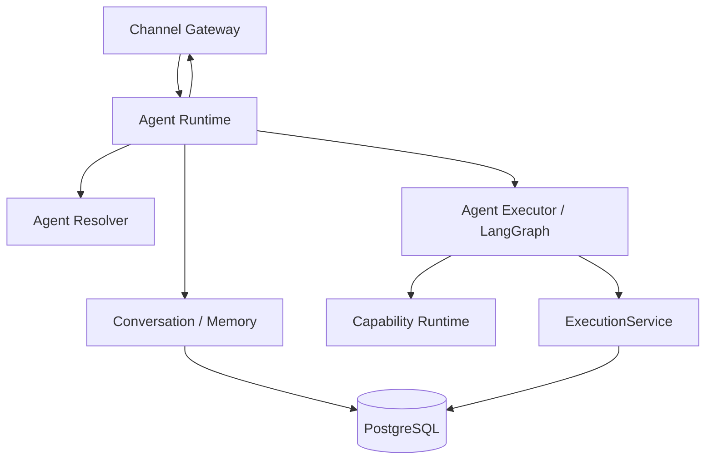
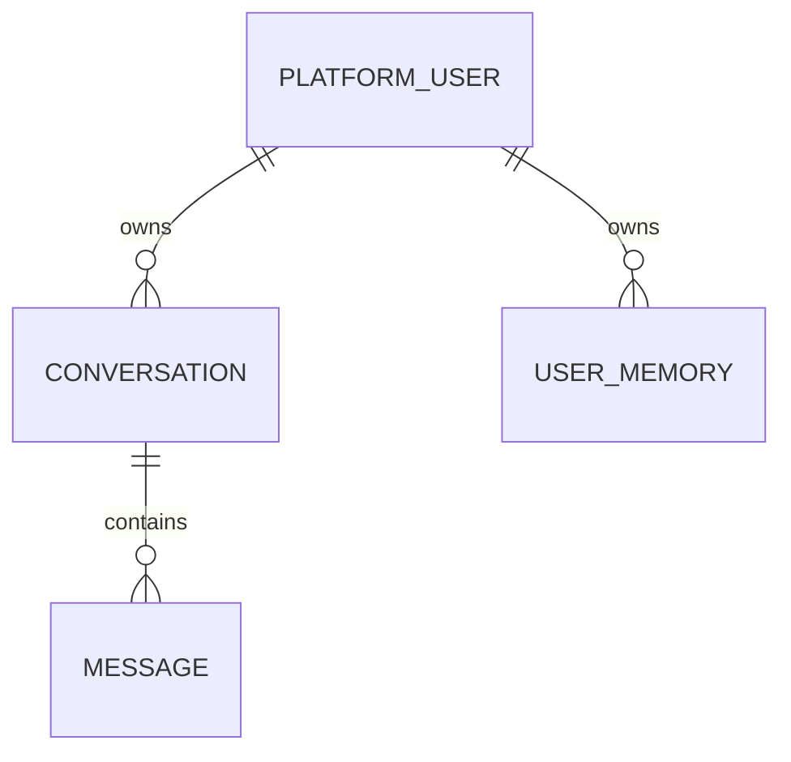

# Agent Runtime 模块需求与设计一体化文档

> **文档编号**: MOD-AR-1.0  
> **文档版本**: v1.1  
> **创建日期**: 2026-09-10  
> **文档状态**: 设计草稿（V1.7 整改对齐）  
> **设计基线**: 《通用智能服务执行框架 V1.6 总体设计说明书》+《05-变更记录/V1.6-to-V1.7-整改对齐说明》（D04）  
> **模板类型**: design-full（跨模块/架构核心模块）

**评审边界说明**：

- 需求评审：第 2 章，确认模块职责和边界；
- 设计评审：第 3-4 章，确认技术实现、数据、接口、DFX、部署；
- 本文只设计 Framework Core，不引入任何具体项目业务字段。

---

## 1. 文档控制

### 1.1 责任人

| 角色 | 姓名 | 职责范围 |
|---|---|---|
| 产品/架构负责人 | 待定 | 模块边界、需求与总体设计一致性 |
| 开发负责人 | 待定 | 技术方案与实现 |
| 测试负责人 | 待定 | 场景与 Gate |
| 安全/运维评审 | 按需 | 安全、可靠性、部署评审 |

### 1.2 修订历史

| 版本 | 日期 | 变更描述 |
|---|---|---|
| v0.1 | 2026-09-10 | 基于总体设计 V1.6 首次形成模块详细设计 |
| v1.1 | 2026-09-10 | V1.7 整改：resolve current revision 不读 published release（D04） |

---

## 2. 需求分析

### 2.1 需求概述

| 项目 | 内容 |
|---|---|
| 模块名称 | Agent Runtime |
| 模块ID | MOD-AR |
| 需求类型 | 新框架模块设计 |
| 业务背景 | 框架需要承载实时自然语言交互，但不能为每个 Agent/User 创建固定 Runtime 或保存本地业务状态。 |
| 核心目标 | 提供可水平扩展、共享执行多个 Agent Definition 的无状态实时 Agent 运行服务。 |
| 运行形态 | `agent-runtime` 独立 Deployment；Stateless Runtime Pool |

### 2.2 痛点与价值

| 维度 | 内容 |
|---|---|
| 目标用户 | End User；间接服务 Channel Gateway 与 Worker Agent Step |
| 当前问题 | 按用户/Agent 固定 Pod 会造成资源浪费、扩容复杂和本地状态迁移问题；将长任务放在实时请求中会导致连接和恢复风险。 |
| 框架影响 | 实时交互是用户主要入口，必须同时保证低耦合、身份可信和可扩缩。 |
| 预期价值 | 任意 Runtime Pod 均可执行任意已发布 Agent；长任务自动转入可靠 Execution 路径。 |

### 2.3 功能方案

#### 2.3.1 功能清单

| 功能ID | 功能名称 | 功能描述 | 优先级 | 来源 |
|---|---|---|---|---|
| FEAT-01 | Agent Definition 解析 | 按 agent_id 解析当前 revision Agent、Model、Skill、Knowledge、Capability bindings（V1.7 D04，不读 published release）。 | P0 | 总体设计 V1.7 |
| FEAT-02 | Conversation Turn | 加载 Conversation/Memory，调用 AgentExecutor，保存消息与 checkpoint。 | P0 | 总体设计 V1.6 |
| FEAT-03 | 短时 Capability | 直接调用只读、短时、低风险 Capability。 | P0 | 总体设计 V1.6 |
| FEAT-04 | Execution Proposal | 遇到写/长时/高风险动作时生成结构化 Proposal，确认后调用 ExecutionService。 | P0 | 总体设计 V1.6 |
| FEAT-05 | 流式响应 | 向 Channel Gateway 输出增量响应，不持久化连接业务事实。 | P0 | 总体设计 V1.6 |

#### 2.4 范围与边界

| 类别 | 内容 |
|---|---|
| 范围（In Scope） | 实时请求、Agent resolve、Conversation turn、Memory/Knowledge/Capability 调用、Execution Proposal、流式输出。 |
| 非范围（Out of Scope） | Worker 调度、可靠等待、Host shell、固定用户 workspace、本地 Memory SoT、K8s Pod 创建。 |
| 前置假设 | Channel Gateway 已完成身份映射或传入可信内部身份；PostgreSQL/Checkpointer 可用。 |
| 有意妥协/技术债 | V1 不建设复杂 Agent Runtime Class；GPU/特殊隔离等需求后续通过独立 Runtime Pool/Profile 扩展。 |

### 2.5 验收条件

#### 2.5.1 业务规则与约束

| ID | 类型 | 描述 | 验证场景 |
|---|---|---|---|
| RULE-01 | 系统约束 | 任意请求不得依赖前一次请求落在同一个 Pod。 | S-01 |
| RULE-02 | 系统约束 | 高风险/worker_preferred Capability 不得在 realtime mode 直接执行。 | E-01 |
| RULE-03 | 系统约束 | actor_user_id/tenant/resource_scope 只能来自 TrustedExecutionContext。 | E-02 |
| RULE-04 | 系统约束 | Agent Runtime 不直接操作 Host Shell/任意 Host 文件系统。 | E-03 |

#### 2.5.2 功能验收场景

**正常场景**

| 场景ID | 功能ID | 优先级 | 测试层级 | 关键真实边界 | 前置条件 | 操作步骤 | 预期结果 |
|---|---|---|---|---|---|---|---|
| S-01 | FEAT-02 | P0 | integration | Channel → Pod A/Pod B → PostgreSQL/Checkpointer | 已完成基础配置 | 同一 Conversation 连续两轮分别路由到不同 Pod | 上下文连续、Memory/Conversation 正确，无 Pod 粘性要求 |
| S-02 | FEAT-03 | P0 | integration | Agent Runtime → Capability Runtime → Provider | 已完成基础配置 | 调用 read-only resource.get | 实时返回结果，不创建 ServiceExecution |
| S-03 | FEAT-04 | P0 | integration | Agent Runtime → ExecutionService → PostgreSQL | 已完成基础配置 | 用户确认一个 worker_preferred Service | 创建 Execution 后实时请求结束，后台继续 |
| S-04 | FEAT-01 | P0 | integration | Agent Runtime → Current Revision Resolver → PostgreSQL | 已完成基础配置 | 请求两个不同 agent_id | 同一 Runtime 实例动态解析对应 AgentDefinition 当前 revision，不创建新 Pod |
| S-05 | FEAT-05 | P0 | integration | Agent Runtime → Internal Stream → Channel Gateway | 已完成基础配置 | Agent 生成多段增量输出 | 按统一流式事件向 Gateway 发送；断连不产生本地业务 SoT |

**异常场景**

| 场景ID | 功能ID | 测试层级 | 关键真实边界 | 触发条件 | 系统行为 | 用户感知 |
|---|---|---|---|---|---|---|
| E-01 | FEAT-03 | integration | CapabilityRuntime Policy | realtime 调用 shell.execute/high-risk capability | 返回 CAPABILITY_REQUIRES_EXECUTION，引导进入 ServiceExecution | 返回可识别错误，不泄露内部细节 |
| E-02 | FEAT-04 | integration | Trusted Context Builder | 模型输出伪造 user_id/tenant_id | 忽略模型字段，只使用服务端上下文 | 返回可识别错误，不泄露内部细节 |
| E-03 | FEAT-02 | integration | Architecture Gate | agent-runtime 源码直接 import subprocess/os.system | CI 失败 | 返回可识别错误，不泄露内部细节 |

#### 2.5.3 非功能指标

| 指标ID | 指标名称 | 目标值 | 测量方法 |
|---|---|---|---|
| NFR-REL-01 | 可靠性 | 不得丢失/破坏框架权威状态；具体 SLA 待真实部署压测后确定 | 故障注入 + integration/E2E |
| NFR-SEC-01 | 安全边界 | 不得信任 LLM 提供的身份/权限/Host 路径等安全上下文 | Architecture Gate + integration |
| NFR-OBS-01 | 可观测性 | 关键操作必须携带 request_id/trace_id 或 execution_id | 日志/Trace 断言 |

性能/QPS/延迟阈值当前没有真实压测依据，本文不虚构固定数字；上线门槛在真实 Reference Integration 跑通后补充。

---

## 3. 技术设计

### 3.1 方案选型

#### 关键决策记录

| 决策点 | 选择 | 被否决项 | 理由 | 可逆性 |
|---|---|---|---|---|
| Agent 运行模型 | 共享 Runtime Pool | Agent/User 专属 Pod | 真正无状态、易扩容 | 中 |
| Agent 框架 | LangGraph Library | LangGraph Agent Server | 避免与 Worker 形成双执行引擎 | 中 |
| 长任务 | ExecutionService + Worker | 保持 HTTP/SSE 请求占用 | 可恢复、可离线继续 | 难 |

#### 技术栈

| 类别 | 选型 | 版本 | 选型理由 |
|---|---|---|---|
| 语言 | Python | 3.12+ | 与 Core/Worker 共享 |
| Agent | LangGraph Library | 1.x | Graph/interrupt/checkpoint |
| Web | FastAPI | 0.115+ | 内部 HTTP/stream 入口 |
| Checkpoint | LangGraph PostgreSQL Checkpointer | 兼容版本 | 跨 Pod Agent state |

### 3.2 架构设计



#### 分层职责

| 层级 | 职责 |
|---|---|
| Internal API | 接收 ChannelEnvelope/Chat Request |
| Context Builder | 身份、Agent、Conversation、Memory、授权解析 |
| Agent Executor | LangGraph 推理/工具选择 |
| Capability/Knowledge | 短时外部能力与知识 |
| Execution Boundary | 高风险/可靠动作转 Execution |

### 3.3 数据设计

> **统一数据库公共字段约束**：本模块凡新增 Framework 自建表，均必须包含 `is_deleted BOOLEAN NOT NULL DEFAULT FALSE`、`create_time TIMESTAMPTZ NOT NULL DEFAULT now()`、`update_time TIMESTAMPTZ NOT NULL DEFAULT now()`；Repository 默认过滤 `is_deleted=false`，删除默认逻辑删除。第三方自管理表（如 LangGraph Checkpointer）不修改其内部 Schema。


| 数据对象/表 | 关键字段 | 约束/索引 | 说明 |
|---|---|---|---|
| conversation/message | 会话/消息 | conversation_id + created_at 索引 | Runtime 不本地持久化 |
| user_memory | user/tenant/source/content metadata | user/tenant 索引 | 长期上下文 |
| LangGraph checkpoint tables | thread/checkpoint | 由 checkpointer 管理 | 仅 Agent Graph state |


**ER 图**



### 3.4 接口设计

| 接口ID | 接口/函数 | 形态 | 说明 | 关联功能 |
|---|---|---|---|---|
| API-01 | POST /internal/v1/chat | HTTP/Stream | 执行一个 Agent turn | FEAT-01,FEAT-02,FEAT-05 |
| LIB-01 | AgentResolver.resolve(agent_id) | 函数库 | 解析当前 revision Agent 配置（V1.7 D04） | FEAT-01 |
| LIB-02 | CapabilityRuntime.invoke(..., realtime) | 函数库 | 短时能力调用 | FEAT-03 |
| LIB-03 | ExecutionService.create(proposal, context) | 函数库 | 创建可靠 Execution | FEAT-04 |

内部 Chat 请求必须包含服务端可验证的 channel/account/peer/conversation/agent 引用；终端输入正文不能承载授权身份。流式协议的最终错误事件仍包含统一 error code/request_id。

所有普通 HTTP JSON 接口必须复用统一响应 Envelope：

```json
{
  "code": "OK",
  "message": "success",
  "data": {},
  "request_id": "req-xxx",
  "timestamp": "2026-09-10T15:00:00+00:00"
}
```

SSE/WebSocket/文件流属于协议例外，但必须复用统一错误码 taxonomy 和 request/trace 关联策略。

### 3.5 质量实现方案

#### 可靠性

所有业务状态外置；Pod 被 SIGKILL 后下一次请求可在其他 Pod 恢复；模型/API 调用均有 deadline 和有界重试。

#### 安全性

TrustedExecutionContext 与 Prompt 分离；Capability binding 先于模型 Tool schema 暴露；Runtime 不读取任意 Secret 明文到 Prompt。

#### 可观测性

记录 agent_id、conversation_id、model、capability、latency、token usage（若 provider 提供）、request_id/trace_id；不记录敏感 Prompt payload 默认全文。

#### 测试策略

```text
unit
→ 纯规则/状态机/转换

integration
→ Repository / Provider / Runtime 边界

E2E
→ 真实进程/API/数据库/用户可见结果

architecture
→ 依赖方向、Stateless、统一响应、Core Purity 等硬约束
```

---

## 4. 部署与运维

### 4.1 部署架构

独立 Deployment，至少 1 副本；可按并发/CPU/LLM 活跃请求扩容；无持久卷绑定用户状态。

### 4.2 发布与回滚

- 框架代码通过镜像/包版本发布；
- Schema 变化使用 Alembic expand → migrate → switch → contract；
- 只有 `Service` 采用草稿/已发布两态，`Agent` 统一 direct-effect + revision（V1.7 D04），不把代码发布和业务定义发布混成一套版本系统；
- 运行配置可直接生效时必须保留 revision/audit；
- 回滚不得恢复已经撤销的用户权限、Credential 或安全禁用状态。

### 4.3 监控告警

active turns、LLM latency/errors、capability errors、stream disconnect、context resolve failures；阈值待定。

阈值当前统一标记为**待定**，由 Reference Integration 实测建立基线后配置。

---

## 5. 风险与依赖

### 5.1 项目依赖

| 依赖模块/团队 | 依赖内容 | 状态 | 风险等级 |
|---|---|---|---|
| PostgreSQL/Checkpointer | Conversation/Memory/Graph state | 必需 | 高 |
| Model Provider | LLM 推理 | 必需 | 高 |
| Capability/Knowledge Runtime | 工具和知识 | 必需 | 高 |
| ExecutionService | 可靠动作入口 | 必需 | 高 |

### 5.2 风险识别

| 风险ID | 类型 | 描述 | 概率 | 影响 | 应对措施 | 验证场景 |
|---|---|---|---|---|---|---|
| RISK-01 | 可靠性 | 本地缓存误成为事实源 | 中 | 高 | 缓存有界且可丢失；Multi-Pod Gate | S-01 |
| RISK-02 | 安全 | 模型通过工具参数注入身份 | 中 | 高 | TrustedExecutionContext 与业务 input 分离 | E-02 |

---

## 6. 需求追溯矩阵

| 来源 | 功能ID | 接口ID | 测试场景 | 测试层级 | 状态 |
|---|---|---|---|---|---|
| 总体设计 V1.6 | FEAT-01 | API-01, LIB-01 | S-04 | integration/E2E | 待实现 |
| 总体设计 V1.6 | FEAT-02 | API-01 | S-01, E-03 | integration/E2E | 待实现 |
| 总体设计 V1.6 | FEAT-03 | LIB-02 | S-02, E-01 | integration/E2E | 待实现 |
| 总体设计 V1.6 | FEAT-04 | LIB-03 | S-03, E-02 | integration/E2E | 待实现 |
| 总体设计 V1.6 | FEAT-05 | API-01 | S-05 | integration/E2E | 待实现 |

---

## Spec Compliance Matrix

| Spec/Rule | enforcement | 设计影响 | 设计落点 | 验证场景 | verifier | 状态 |
|---|---|---|---|---|---|---|
| framework#RULE-AR-001 | required | Runtime 无状态 | §3.2 | S-01 | `Multi-Pod E2E` | applied |
| framework#RULE-EXEC-001 | required | 高风险/长任务转 Execution | §3.4 | S-03/E-01 | `Capability policy integration` | applied |
| framework#RULE-TOOL-001 | required | Runtime 不直接 Host shell | §3.5 | E-03 | `test_sandbox_boundary.py` | applied |

---

## 附录：术语表

| 术语 | 定义 |
|---|---|
| Framework Core | 与具体业务项目解耦的框架内核 |
| Integration | 具体项目对框架 SPI/Contract 的实现和配置 |
| Capability | 稳定的“系统能做什么”合同 |
| Execution | 一次可靠业务服务执行实例 |
| SoT | Source of Truth，权威事实源 |
| SPI | Service Provider Interface，扩展接口 |
| DFX | 面向可靠性、安全性、可测试性、可运维性等质量属性的设计 |

---
