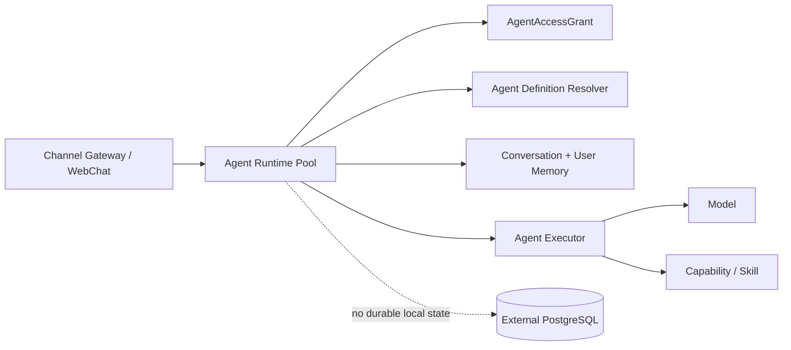

<!-- V1.11 module-split metadata -->
> **文档分档**：`Full`（模板 `design-full.md`）  
> **分档理由**：无状态运行时、上下文解析、横向扩展  
> **文档边界**：本文件是该模块唯一详细设计事实源；DB Owner 与接口 Owner 必须落在本模块，不允许在其他模块重复定义。  
> **拆分原则**：仅按可独立评审/编码/验收的一级模块拆分；不按单表/单接口继续碎片化。

# Agent Runtime 模块需求与设计一体化文档

> **文档编号**: MOD-RT-V1.13
> **文档版本**: V1.13
> **创建日期**: 2026-09-11
> **文档状态**: 设计基线草案（待仓库 Spec Context 绑定后进入正式评审）
> **模板**: `design-full.md`；生成流程按 `cf-task:align` 的复杂后端/架构模块路径执行。
> **上游基线**: V1.8 完整总体设计 + V6 完整 Playbook + Console V0.8 Final。


**评审边界说明**：
- 第 2 章是需求基线（What），禁止实现阶段自行改变领域语义；
- 第 3-4 章是设计基线（How），DB 与每个接口必须以本文为准；
- `Spec Compliance Matrix` 当前依据设计基线生成，因本轮未提供仓库 `spec-context.yml` 与代码目录，**不得声称已通过 cf-task:align 的 repo Spec Gate**；落码前必须在真实仓库执行 `refresh/catalog/bind`。


## 1. 文档控制

### 1.1 责任人

| 角色 | 姓名 | 职责范围 |
|---|---|---|
| 产品/架构负责人 | 待定 | 需求定义、领域边界、与总设/Playbook 一致性 |
| 开发负责人 | 待定 | 技术方案、DB/API、实现 |
| 测试负责人 | 待定 | S/E/B 场景、E2E Gate |
| 安全/运维 | 待定 | Secret、隔离、发布、监控 |

### 1.2 修订历史

| 版本 | 日期 | 作者 | 变更描述 |
|---|---|---|---|
| V1.11 模块分档拆分版 | 2026-09-11 | ChatGPT / 待项目负责人确认 | 按 cf-task:align + design-full 从最新完整总设/Playbook/交互稿重新生成；细化 DB 与全部接口 |
| V1.13 第三轮 Review 修复 | 2026-09-12 | Claude Code | RT-INT-01 补 proposal/file 事件与签发步骤；新增 RT-LIB-03 Chat Run 领取/恢复；AGCORE-LIB-02 按 Contract 元数据分流（模块 04）；矩阵与 verifier 修正 |
| V1.13.1 第四轮合理性修复 | 2026-09-12 | Claude Code | RT-LIB-03 改为基于模块 01 的 CORE-LIB-08 LeaseQueue（claim/renew/assert_owner）实现，本模块只保留租约参数与领取排序键；新增 §3.2.3「运行面 vs 管理面」可用性合同与降级说明（D3=B+）；RT-INT-03 产物访问判定改为以 `artifact` 表 FK 为准（B6） |

## 2. 需求分析

### 2.1 需求概述

| 项目 | 内容 |
|---|---|
| 模块名称 | Agent Runtime |
| 模块ID | MOD-RT |
| 所属系统/产品线 | Fluxion 通用智能服务执行框架 |
| 需求类型 | 中大型功能 / 架构演进 |
| 业务背景 | 实时对话需要低延迟、可横向扩展，同时不能把用户/会话/Memory/Agent 配置固化到 Pod。 |
| 核心目标 | 实现无状态实时计算池：解析可信上下文、AgentDefinition/Memory/Conversation，调用 Agent Executor 并流式返回。 |

### 2.2 痛点与价值

| 维度 | 内容 |
|---|---|
| 目标用户 | End User 经 Channel/WebChat 间接使用；Runtime 运维/开发者 |
| 当前问题 | 历史 user→agent→pod/workspace 绑定导致扩缩容和故障恢复困难；Runtime 本地状态成为业务事实会造成实例不一致。 |
| 业务影响 | Pod 重启丢用户状态、多副本行为漂移、Channel/Console 与 Runtime 强耦合。 |
| 预期价值 | 任意请求可落任意 Runtime，实例可随流量横向扩展。 |

### 2.3 功能方案

#### 2.3.1 功能清单

| 功能ID | 功能名称 | 功能描述 | 优先级 | 来源 |
|---|---|---|---|---|
| FEAT-RT-01 | Trusted Context | 从上游可信身份构建执行上下文。 | P0 | 总体设计 P8 |
| FEAT-RT-02 | Agent Resolve | 动态加载 Agent Definition/绑定。 | P0 | 总体设计 P5 |
| FEAT-RT-03 | Conversation/Memory | 加载外置会话和长期 Memory。 | P0 | Playbook U06 |
| FEAT-RT-04 | SSE Streaming | 真实流式输出与取消/背压。 | P0 | 用户旅程 |
| FEAT-RT-05 | Stateless Gate | 禁止本地业务权威状态。 | P0 | 架构 Gate |
| FEAT-RT-06 | Chat Run 领取与恢复 | 领取/恢复 conversation_run（lease_epoch fencing、CheckpointIdentity 续跑）。 | P0 | 架构 Gate B |

### 2.4 范围与边界

| 类别 | 内容 |
|---|---|
| 范围（In Scope） | internal chat ingress、request-scoped runtime context、Agent resolve、Conversation/Memory orchestration、流式响应、短 TTL revision cache。 |
| 非范围（Out of Scope） | ServiceExecution durability、Worker polling、Channel WebSocket 连接、Console CRUD。 |
| 前置假设 | 上游总设、公共 DB/API 规范、外部基础设施可用 |
| 有意妥协 / 技术债 | 无；未来扩展必须有真实旅程驱动 |

### 2.5 验收条件

#### 2.5.1 业务规则与约束

| ID | 类型 | 描述 | 验证场景 |
|---|---|---|---|
| RULE-RT-01 | 无状态 | Runtime 本地只能有 cache/连接池/临时 context/metrics，可丢弃。 | S-RT-01, S-RT-06 |
| RULE-RT-02 | 授权 | 每次请求先检查 current AgentAccessGrant。 | S-RT-02, E-RT-01 |
| RULE-RT-03 | 会话 | Conversation/Memory 从外部存储加载；/new 不清空 Memory。 | S-RT-08 |
| RULE-RT-04 | 流式 | SSE 必须真流式，不先缓冲完整模型结果。 | S-RT-03, S-RT-04 |

#### 2.5.2 功能验收场景

**正常场景**

| 场景ID | 功能ID | 优先级 | 测试层级 | 关键真实边界 | 归属 | 前置条件 | 操作步骤 | 预期结果 |
|---|---|---|---|---|---|---|---|---|
| S-RT-04 | FEAT-RT-04 | P1 | integration | SSE 真流式 | 本模块 | 模型持续输出 | 订阅 /internal/v1/chat 流 | 首 token 即下发；总时长 ≈ 生成时长，无整段缓冲后置 |
| S-RT-01 | FEAT-RT-05 | P0 | E2E | LB→Runtime×2→PG | 本模块 | 用户同一会话 | 连续两次请求落不同 Pod | 行为一致，会话连续 |
| S-RT-02 | FEAT-RT-02 | P0 | E2E | Runtime→Grant/Agent/Model | 后置 → 模块 04/18/19 | 用户有授权 | 发消息 | 解析 current Agent 并回复 |
| S-RT-03 | FEAT-RT-04 | P0 | E2E | Runtime→Model SSE | 本模块 | 模型流式可用 | 发长回复请求 | 客户端逐 delta 收到，不等待最终完成 |
| S-RT-05 | FEAT-RT-06 | P0 | E2E | Runtime×2→PG conversation_run lease（经 CORE-LIB-08） | 本模块 | Turn 已由 Runtime A 领取且处于 RUNNING | kill -9 owner Runtime A | Runtime B 在一个 lease 周期内领取同一 run，按 CheckpointIdentity 续跑；不重复写 USER/ASSISTANT 消息；被接管者的后续写入被 assert_owner 以 LEASE_LOST 拒绝 |
| S-RT-06 | FEAT-RT-06 | P0 | E2E | LB→Runtime×2→PG | 本模块 | Turn 1 已由 Runtime A 完成 | 杀掉 Runtime A 后发起 Turn 2 | 由 Runtime B 处理；User/Conversation/Memory/Skill/Capability 视图一致 |
| S-RT-07 | FEAT-RT-04 | P1 | E2E | Runtime→渠道 proposal 事件 | 后置 → 模块 10 | Agent 识别出需可靠执行的 Service 意图 | 发送需要执行的请求 | 收到含 rendered_summary/confirmed_facts/expires_at 的 proposal 事件；未签发前不产生 Execution |
| S-RT-08 | FEAT-RT-03 | P1 | integration | Runtime→Conversation/User Memory | 本模块 | 用户已有长期 Memory 条目 | /new 开新会话后发一条依赖长期记忆的消息 | 新会话仍加载同一长期 Memory；/new 只切换 Conversation，不清空 Memory |

**异常场景**

| 场景ID | 功能ID | 测试层级 | 关键真实边界 | 归属 | 触发条件 | 系统行为 | 用户感知 |
|---|---|---|---|---|---|---|---|
| E-RT-01 | FEAT-RT-02 | E2E | Runtime→Grant | 后置 → 模块 18 | 撤销授权 | 发下一条消息 | 403/渠道无权限提示，不调用模型 |
| E-RT-02 | FEAT-RT-04 | integration | SSE cancellation | 本模块 | 客户端断开 | 取消 request-scoped 模型流/工具 | 不把取消当全局 Execution cancel |

#### 2.5.3 非功能指标

| 指标ID | 指标名称 | 目标值 | 测量方法 |
|---|---|---|---|
| NFR-REL-01 | 可靠执行 | 不得因单 Runtime/Worker 进程退出丢失权威状态 | SIGKILL/E2E |
| NFR-SEC-01 | 可信身份 | LLM/客户端不得覆盖 tenant/actor/secret | 安全测试 |
| NFR-OBS-01 | 可追踪 | 关键路径可按 request_id/trace_id/execution_id 定位 | 集成/E2E |

## 3. 技术设计

### 3.1 方案选型

#### 3.1.1 关键决策记录

| 决策点 | 选择 | 被否决项 | 理由 | 可逆性 |
|---|---|---|---|---|
| 状态 | Stateless Runtime Pool | 每用户 Pod | K8S 横向扩展与故障恢复 | 难 |
| Channel | Gateway 独立 | Runtime 持 WebSocket | 分离连接状态与 reasoning | 中 |
| 配置加载 | DB current revision + 可丢 cache | 启动时固定 Agent | 配置 direct-effect | 易 |

#### 3.1.2 技术栈

| 类别 | 选型 | 版本 | 选型理由 |
|---|---|---|---|
| 语言 | Python | 3.12+（仓库实际版本落码前确认） | 与 Agent/LLM 生态一致 |
| Web/API | FastAPI + Pydantic | 仓库实际版本确认 | 类型契约与异步 IO |
| ORM | SQLAlchemy 2 Async | 仓库实际版本确认 | 异步 PostgreSQL |
| 数据库 | PostgreSQL | 外部部署 | 业务 SoT |

**运行面内部路由装配**：本进程除 Chat 外装配 CH-DATA-01..04、CH-INT-02（模块 10）、CONV/MEM Application（模块 11）、Proposal/Artifact Application（模块 05）。共用 Python PG Port，不代理到 platform-api。Console CRUD 仅在 platform-api 装配；四生产角色和 migration Owner 不变。

### 3.2 架构设计



#### 3.2.1 模块职责分层

| 层级 | 职责 | 禁止事项 |
|---|---|---|
| Handler/API | 协议解析、DTO、权限入口、统一错误映射 | 业务逻辑/直接 SQL |
| Application Service | 用例编排、事务边界、领域校验 | 依赖具体 Web 框架 |
| Domain | 领域对象/规则 | 基础设施依赖 |
| Repository/Port | 持久化/外部能力抽象 | 泄露 Secret/跨领域修改 |
| Adapter | PostgreSQL/HTTP/MCP 等实现 | 改变领域语义 |

#### 3.2.2 外部依赖清单

| 外部系统/模块 | 依赖类型 | 协议/接口 | 超时/一致性 | 降级策略 |
|---|---|---|---|---|
| Agent Core | Library | Python async | request scoped | 失败返回 Agent error |
| Conversation/Memory | Repository/Application Service | PG | 强一致关键元数据 | 不可本地替代 |
| Model Runtime | Library/HTTP | OpenAI-compatible | deadline | 统一模型错误 |
| Capability/Skill Runtime | Library | Python | deadline/策略 | 稳定错误 |

#### 3.2.3 运行面 vs 管理面（可用性合同）

本进程承载的 `CH-DATA-01..04` 与 `CH-INT-02`（模块 10）属于**运行面**：与 platform-api（**管理面**，Console CRUD 等）在进程与依赖上分离，不共享进程、不互相代理。`CH-DATA-*` 端点只读、幂等、无副作用，可安全重试；**platform-api 停机不影响这些端点**（Gate H）。

**降级说明**：agent-runtime 故障时，IM 入站与投递许可不可用（Gateway 无法读取 Bot 配置/许可/取流）；**已创建的 Execution 不受影响**，仍由 Worker 按自身租约继续推进；投递行由 Worker 保留，并在 agent-runtime 恢复后由 `WORK-LIB-06` 继续调度——`channel_delivery` 的 `RETRY_WAIT`/`UNKNOWN` 语义已覆盖该场景。

**记录备选与触发条件**：若未来要求“Gateway 在 agent-runtime 全挂时仍能读 Bot 配置/取流”，则需给 Gateway 一个**受限只读 DB 角色**（只读视图 + account scope 行级过滤），直接承载 `CH-DATA-01/03/04` 的读，写仍留在 Python 侧。该演进的触发条件是“agent-runtime 故障已成为 IM 可用性的真实瓶颈”的事故，而不是技术栈整洁偏好。**当前 V1 不改拓扑**，运行面仍由 agent-runtime 承载（D3=B+）。

### 3.3 数据设计

本模块**不拥有独立业务表**。这是刻意设计：权威状态由其领域所有者持久化，本模块只读取/调用 Port。禁止为了实现方便新增 shadow truth、本地 SQLite 或进程内业务事实。


Runtime 不拥有本地/专属业务表；读取 `agent_definition`、`agent_access_grant`、`conversation`、`user_memory` 等 owner 表。

### 3.4 接口设计

#### 3.4.1 接口清单

| 接口ID | 名称 | 形态 | 方法/签名 | 路径/用途 |
|---|---|---|---|---|
| RT-INT-01 | 实时 Chat SSE | HTTP | POST | /internal/v1/chat |
| RT-INT-02 | 停止 Chat Run | HTTP | POST | /internal/v1/runs/{run_id}/cancel |
| RT-INT-03 | Chat 产物内部取流 | HTTP | GET | /internal/v1/runs/{run_id}/artifacts/{artifact_id}/content |
| RT-LIB-01 | 构建可信执行上下文 | Library | async def build_trusted_context(identity: RuntimeIdentity, request_meta: RequestMeta) -> TrustedExecutionContext |  |
| RT-LIB-02 | 加载 Runtime Agent 投影 | Library | async def load_runtime_agent(ctx: TrustedExecutionContext, agent_id: UUID) -> RuntimeAgentView |  |
| RT-LIB-03 | Chat Run 领取与恢复 | Library | async def claim_conversation_run(ctx: TrustedExecutionContext, *, run_id: UUID \| None = None) -> ClaimedRun \| None |  |

#### RT-INT-01: 实时 Chat SSE

**入口类型**：HTTP

**契约**：`POST /internal/v1/chat`

**认证/授权**：Internal service identity；platform_user_id 只能由受信调用方注入

**请求体**

| 参数 | 类型 | 必填 | 说明 |
|---|---|---|---|
| agent_id | uuid | Y | 目标 Agent；由 Channel bot 路由或 WebChat 可信入口决定 |
| platform_user_id | uuid | Y | 由上游可信认证/身份解析注入 |
| conversation_id | uuid | N | 已有会话；空则创建 |
| message | object | Y | 文本/附件引用 |
| channel_context | object | N | channel/delivery 元信息；不含授权事实 |
| request_id | string | Y | 请求关联 |
| verified_message_id | uuid | Y | CH-DATA-02 已持久化的 USER 消息；服务端查回身份 |

**请求示例**

```json
{
  "agent_id": "<agent_id>",
  "platform_user_id": "<platform_user_id>",
  "conversation_id": "<conversation_id>",
  "message": {},
  "channel_context": {},
  "request_id": "<request_id>"
}
```

**响应 data**

| 字段 | 类型 | 说明 |
|---|---|---|
| event | SSE stream | 事件枚举：message.delta / tool.status / skill.result / file / proposal / final / error |
| message.delta | object | 模型增量文本 {seq, text}；真流式下发，不缓冲整段 |
| tool.status | object | direct Capability 工具调用状态 {call_id, capability_key, status} |
| skill.result | object | Skill 调用结果摘要 {skill_key, status, summary}；归一化数据始终在此返回，不在此外置大结果 |
| file | object | Chat 产物下发事件；字段与触发条件见下表；不涉及 Execution |
| proposal | object | 待确认执行提案事件；字段见下表；与 final 同轮下发 |
| final | object | 本轮回复终结事件 {run_id, message_id}；到达后 Run 结束 |
| error | object | 稳定错误 {code, message}；流已开始后以事件表达，不改写 HTTP 状态 |

**proposal 事件字段**

| 字段 | 类型 | 说明 |
|---|---|---|
| proposal_id | uuid | EXE-LIB-02 签发后的提案 ID；后续确认/查询的唯一句柄 |
| rendered_summary | string | 受控变量渲染后的摘要文本（渠道确认卡片正文） |
| confirmed_facts | object | 客户/范围/时间等已补全事实摘要（key/value） |
| confirmation_digest | string | 与提案输入/范围绑定的摘要；确认时校验，不匹配即拒绝 |
| expires_at | timestamptz | 确认截止时间；过期后不再接受 CONFIRM |
| available_actions | array<string> | 可执行动作：CONFIRM / CANCEL |

**file 事件字段与触发条件**

| 字段 | 类型 | 说明 |
|---|---|---|
| run_id | uuid | 源 Chat Run |
| artifact_id | uuid | 产物身份（模块 05 Artifact），不是对象存储引用 |
| name | string | 文件名 |
| content_type | string | MIME |
| size_bytes | integer | 大小 |

触发条件：仅在 Chat 侧产生可交付产物（如生成文件）时下发，仅携带句柄，字节流由 Gateway 调 RT-INT-03 取回；Chat 产物不创建 Execution，也不宣称具备后台 Execution 的 outbox 保证。

**响应示例**

```json
{
  "code": 0,
  "message": "success",
  "data": {
    "event": "<event>"
  },
  "request_id": "req_xxx"
}
```

**错误码**

| 错误码 | 场景 | HTTP 状态 |
|---|---|---|
| AGENT_ACCESS_DENIED | 无 AgentAccessGrant | 403 |
| AGENT_DISABLED | Agent 禁用 | 409 |
| CONVERSATION_ACCESS_DENIED | 会话不属于该用户/Agent | 403 |
| MODEL_ERROR | 模型调用失败 | 502 |

**处理逻辑**

```text
Internal auth → PG verified_message_id 校验/查回身份 → require_agent_access → CONV-LIB-01 → RT-LIB-03 经 CORE-LIB-08（模块 01）领取/恢复 conversation_run（排序键 message.sequence_no；到期 RUNNING 优先于新 turn；assert_owner fencing；无可领取返回 None，不 busy-loop）→ 解析 current Agent 和 Memory → AgentExecutor（Chat projection=null）→ AgentExecutor 产出 ExecutionProposalCandidate → Runtime 调 EXE-LIB-02 签发快照与提案 → 以 proposal 事件下发（与 final 同轮）→ 该事件同时以 ASSISTANT message_type=PROPOSAL 落库（CONV-LIB-03）→ checkpoint/响应消息经 CORE-LIB-08.assert_owner fencing 提交 → 结束 Run；不重复创建 USER 消息。排队请求返回 run.queued/run_id，恢复用同一 run_id；Graph 状态不放 Gateway 或 Runtime 内存作为事实源。
```

#### RT-INT-02: 停止 Chat Run

**契约**：`POST /internal/v1/runs/{run_id}/cancel`

**认证/授权**：Gateway/受信 Runtime service identity；当前本人 user/tenant/conversation

请求 `{verified_message_id, reason?}`；查回来源身份并校验 run 归属，事务置 CANCEL_REQUESTED/cancel_requested_at，终态幂等返回当前结果。返回 `{run_id,status}` 表示请求已接受。Runtime owner 在节点边界、每次外部调用前和流式等待期间（最长 1 秒 PG 检查间隔；Redis 只是 hint）检查取消，取消模型流/沙箱并提交 CANCELLED；租约过期由其他 Runtime 经 RT-LIB-03 接管后只做恢复/取消清理（与 RT-LIB-03 共用同一取消检查），不能继续被取消的业务。未知/越权 404/403；不取消其他 Conversation 或后台 Execution。

#### RT-INT-03: Chat 产物内部取流

**契约**：`GET /internal/v1/runs/{run_id}/artifacts/{artifact_id}/content`

**认证/授权**：Gateway service identity；account/peer 必须匹配源 Run 的 verified message

Runtime 发送 file event={run_id,artifact_id,name,content_type,size_bytes}，Gateway 调此端点取流并发原生文件。模块 05 Artifact Application 校验 owner_type=CONVERSATION、owner_id=run.conversation_id、workspace/tenant/actor 匹配；**产物归属一律 join `artifact` 表以 FK 为准**（`service_execution.artifact_ids`/`execution_step.artifact_ids` 数组只作重试复制来源记录，不作为访问判定依据，B6），不接受任意对象引用。返回 200 字节流，越权 403/已清理 410。实时对话断线只终止即时传输，产物仍按 Workspace 保留策略存在（保留与清理按 `01-架构与规范/11-数据保留与清理策略`），可由本人同会话后续消息再次请求；不宣称具备后台 Execution 的 outbox 保证。

#### RT-LIB-01: 构建可信执行上下文

**入口类型**：Library

**函数签名**

```python
async def build_trusted_context(identity: RuntimeIdentity, request_meta: RequestMeta) -> TrustedExecutionContext
```

**入参**

| 参数 | 类型 | 必填 | 说明 |
|---|---|---|---|
| identity | RuntimeIdentity | Y | 已认证 platform user/tenant/service identity |
| request_meta | RequestMeta | Y | request/channel/trace |

**返回**

| 字段 | 类型 | 说明 |
|---|---|---|
| ctx | TrustedExecutionContext | 服务端只读上下文 |

**处理逻辑**

```text
从认证中间件/Channel resolution 解析 tenant/user → 注入 request/trace → 不接受 LLM payload 覆盖。
```

**认证/授权**：仅 Agent Runtime 运行时角色可调用；可信 ctx 由中间件解析的 `RuntimeIdentity`（service identity + platform user/tenant）构造，调用方不得传入或覆盖 tenant/actor。

#### RT-LIB-02: 加载 Runtime Agent 投影

**入口类型**：Library

**函数签名**

```python
async def load_runtime_agent(ctx: TrustedExecutionContext, agent_id: UUID) -> RuntimeAgentView
```

**入参**

| 参数 | 类型 | 必填 | 说明 |
|---|---|---|---|
| ctx | TrustedExecutionContext | Y | 可信用户 |
| agent_id | uuid | Y | Agent |

**返回**

| 字段 | 类型 | 说明 |
|---|---|---|
| view | RuntimeAgentView | AgentDefinition+Model+Bindings+MemoryPolicy |

**异常/错误**

| 错误码 | 场景 | HTTP 状态 |
|---|---|---|
| AGENT_ACCESS_DENIED | 无授权 | 403 |

**处理逻辑**

```text
require_agent_access → resolve AgentDefinition → resolve effective capabilities/skills/services → 构造 request-scoped immutable view；可使用短 TTL revision cache，但 DB 为 SoT。
```

**认证/授权**：仅 Agent Runtime 运行时角色可调用；`ctx` 必须为 RT-LIB-01 产出的可信上下文，`agent_id` 仅在该 ctx 的 tenant/actor 可见范围内解析，越权按 AGENT_ACCESS_DENIED 拒绝。

#### RT-LIB-03: Chat Run 领取与恢复

**入口类型**：Library

**函数签名**

```python
async def claim_conversation_run(ctx: TrustedExecutionContext, *, run_id: UUID | None = None) -> ClaimedRun | None
```

**入参**

| 参数 | 类型 | 必填 | 说明 |
|---|---|---|---|
| ctx | TrustedExecutionContext | Y | 可信 tenant/actor/agent 上下文；不接受请求体覆盖 |
| run_id | uuid | N | 显式恢复目标；为空则按领取规则挑选 |

**返回**

| 字段 | 类型 | 说明 |
|---|---|---|
| run_id | uuid | conversation_run |
| conversation_id | uuid | 会话 |
| lease_epoch | bigint | 领取后的 fencing epoch |
| queued_message_id | uuid | 本次领取的 QUEUED 消息；恢复接管时为空 |
| resumed | boolean | true=恢复到期 RUNNING；false=新 turn |

无可领取时返回 `None`（调用方不得 busy-loop 轮询）。

**异常/错误**

| 错误码 | 场景 | HTTP 状态 |
|---|---|---|
| CONVERSATION_RUN_NOT_FOUND | run_id 不存在或不属于本 tenant/actor | 404 |
| LEASE_LOST | CORE-LIB-08.claim/renew/release/assert_owner 检测到 owner 或 lease_epoch 不匹配、租约已过期（已被他人接管） | 409 |
| AGENT_ACCESS_REVOKED | 领取时 current AgentAccessGrant 已撤销 | 403 |

**处理逻辑**

```text
领取/续租/释放/fencing 一律走模块 01 的 CORE-LIB-08 LeaseQueue，本模块只提供参数与职责，不实现第二套 epoch 递增或续租语义：
  table=conversation_run、owner=本 Runtime 实例标识、ttl_ms=本角色租约周期；
  filter：排序键 = source message 的 sequence_no；状态/到期谓词按“已到期 RUNNING 优先于新 turn”给出。
同一 conversation_run 同时最多一个 owner；无可领取返回 None，调用方不得 busy-loop。
领取成功后由本模块负责：构造 ctx、解析 current Agent/Memory、按 CheckpointIdentity（模块 11 §3.4）加载 checkpoint 续跑、不重复写 USER 消息、与 RT-INT-02 共用取消检查；恢复接管时 queued_message_id 为空。
持有期内所有写入（图节点状态、响应消息、checkpoint 提交）必须先经 CORE-LIB-08.assert_owner 校验 owner+lease_epoch，或先 renew 失败即视为 LEASE_LOST；LEASE_LOST 后立即停止推进，且不得以同一 epoch 重试。
```

**补充约束**：模块 03 不持有任何 conversation_run 的租约实现；`lease_epoch` 的递增只发生在 CORE-LIB-08.claim，续租不改 epoch（与模块 06 的 service_execution 共用同一实现与同一并发测试）。

**触发方式**：入站消息处理过程中调用；Runtime 启动及周期性恢复扫描（到期 RUNNING）时调用。

**认证/授权**：仅 Agent Runtime 运行时角色可调用；可信 ctx 由中间件解析，tenant/actor/agent 不接受请求体覆盖；Gateway/Console 不得直接调用。

### 3.5 质量实现方案

#### 3.5.1 性能与容量

| 热点路径 | 负载量级 | 潜在瓶颈 | 实现方案 | 目标值 |
|---|---|---|---|---|
| Chat 热路径 | 实时高频 | 多次 DB 读取/N+1 | 一次批量 resolve Agent/Bindings/Memory；revision cache 只作优化 | 用户可感知延迟待压测 |
| SSE | 长连接 | 缓冲/背压 | AsyncIterator 流式、bounded buffer、断连取消 | 真流式 |

#### 3.5.2 可靠性

SIGTERM 时停止接收新请求并给活动流短暂 drain；进程退出不能丢业务事实。SSE 中断不改变持久 Execution 终态。

#### 3.5.3 安全性

可信 tenant/actor/context 服务端解析；输入做 Schema/语义校验；Secret 仅保存引用；审计中脱敏。

#### 3.5.4 可观测性

日志、Metrics、Trace 统一关联 request_id/trace_id；Execution 路径附带 execution_id/step_id；错误码稳定。

#### 3.5.5 测试策略

Domain/validator 单测；Repository/Provider 真 PG/外部 Stub 集成；核心用户旅程做 E2E；安全和崩溃恢复不得只靠 mock。

## 4. 部署与运维

### 4.1 部署架构

随其所属运行角色部署；PostgreSQL/Redis/Object Store/Secret Provider/OTel Backend 均为外部依赖，不打包进应用 Compose/Helm。

### 4.2 发布与回滚

DB 变更使用向前兼容迁移；应用支持滚动回滚；若涉及不可变 Release/Artifact，只切换 current 指针，不覆盖历史。

### 4.3 监控告警

至少监控请求/调用量、错误率、延迟、外部依赖失败、关键队列/执行积压和配置加载失败；阈值由环境基线确定。

### 4.4 数据迁移

若无历史生产数据则直接按新 Schema 建表；若已有部署，使用 Alembic 等可回滚/可前滚迁移，禁止运行时隐式改表。

## 5. 风险与依赖

| 风险ID | 描述 | 影响 | 应对措施 | 验证场景 |
|---|---|---|---|---|
| RISK-RT-01 | 跨模块边界在实现中被绕过 | 形成双事实源/不可测试 | Architecture Gate + code review | E2E/静态检查 |

## 6. 需求追溯矩阵

| 功能ID | 接口ID | 验证场景 | 测试层级 | 状态 |
|---|---|---|---|---|
| FEAT-RT-01 | RT-INT-01, RT-LIB-01 | S-RT-02, E-RT-01 | E2E/integration | 待实现/评审 |
| FEAT-RT-02 | RT-LIB-01, RT-LIB-02 | S-RT-02, E-RT-01 | E2E/integration | 待实现/评审 |
| FEAT-RT-03 | RT-LIB-02, RT-LIB-03 | S-RT-08 | E2E/integration | 待实现/评审 |
| FEAT-RT-04 | RT-INT-01, RT-INT-02, RT-INT-03 | S-RT-03, S-RT-04, S-RT-07, E-RT-02 | E2E/integration | 待实现/评审 |
| FEAT-RT-05 | RT-LIB-03 | S-RT-01, S-RT-06 | E2E/integration | 待实现/评审 |
| FEAT-RT-06 | RT-LIB-03（基于 CORE-LIB-08） | S-RT-05, S-RT-06 | E2E/integration | 待实现/评审 |

## Spec Compliance Matrix

| Spec/Rule | enforcement | 设计影响 | 设计落点 | 验证场景 | 状态/N/A 理由 |
|---|---|---|---|---|---|
| DESIGN/RT#RULE-RT-01 | design-baseline | 约束实现与验收 | §2.5 RULE-RT-01 / §3 | S-RT-01, S-RT-06 | applied；仓库 spec-context 待绑定 |
| DESIGN/RT#RULE-RT-02 | design-baseline | 约束实现与验收 | §2.5 RULE-RT-02 / §3 | S-RT-02, E-RT-01 | applied；仓库 spec-context 待绑定 |
| DESIGN/RT#RULE-RT-03 | design-baseline | 约束实现与验收 | §2.5 RULE-RT-03 / §3 | S-RT-08 | applied；仓库 spec-context 待绑定 |
| DESIGN/RT#RULE-RT-04 | design-baseline | 约束实现与验收 | §2.5 RULE-RT-04 / §3 | S-RT-03, S-RT-04 | applied；仓库 spec-context 待绑定 |

## 附录 A：接口与 DB 落码检查清单

- [ ] 每个 HTTP Endpoint 已有 DTO、鉴权、错误码、处理逻辑、测试。
- [ ] 每个 Library/CLI 接口有稳定签名和异常语义。
- [ ] 每张表字段、类型、NULL、默认值、唯一约束、索引、软删除策略已落实迁移。
- [ ] Request/Response 字段不接受客户端传入可信 tenant/actor/credential。
- [ ] 列表接口使用服务端分页，避免无界返回。
- [ ] 修改类接口有 revision/冲突语义；高风险/副作用路径满足幂等和审计。
- [ ] 仓库 Spec Context 已 refresh/catalog/bind 且 required Rules 映射到 S/E/B verifier。
