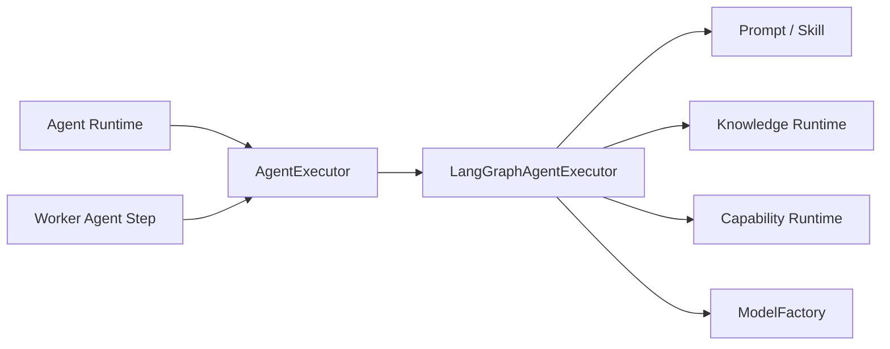

# Agent Core 与 Agent Executor 模块需求与设计一体化文档

> **文档编号**: MOD-AGENT-1.0  
> **文档版本**: v1.1  
> **创建日期**: 2026-09-10  
> **文档状态**: 设计草稿（V1.7 整改对齐）  
> **设计基线**: 《通用智能服务执行框架 V1.6 总体设计说明书》+《05-变更记录/V1.6-to-V1.7-整改对齐说明》（D04）  
> **模板类型**: design-full（跨模块/架构核心模块）

**评审边界说明**：

- 需求评审：第 2 章，确认模块职责和边界；
- 设计评审：第 3-4 章，确认技术实现、数据、接口、DFX、部署；
- 本文只设计 Framework Core，不引入任何具体项目业务字段。

---

## 1. 文档控制

### 1.1 责任人

| 角色 | 姓名 | 职责范围 |
|---|---|---|
| 产品/架构负责人 | 待定 | 模块边界、需求与总体设计一致性 |
| 开发负责人 | 待定 | 技术方案与实现 |
| 测试负责人 | 待定 | 场景与 Gate |
| 安全/运维评审 | 按需 | 安全、可靠性、部署评审 |

### 1.2 修订历史

| 版本 | 日期 | 变更描述 |
|---|---|---|
| v0.1 | 2026-09-10 | 基于总体设计 V1.6 首次形成模块详细设计 |
| v1.1 | 2026-09-10 | V1.7 整改：Agent direct-effect，Service 发布冻结 Agent 配置（D04） |

---

## 2. 需求分析

### 2.1 需求概述

| 项目 | 内容 |
|---|---|
| 模块名称 | Agent Core 与 Agent Executor |
| 模块ID | MOD-AGENT |
| 需求类型 | 新框架模块设计 |
| 业务背景 | 实时 Agent Runtime 与 Worker Agent Step 都需要使用同一套 Agent 能力，如果各自实现会形成两套 Skill/Knowledge/Tool/模型行为。 |
| 核心目标 | 定义统一 AgentExecutor 与 Agent Core，确保在线对话和后台 Agent Step 共享相同解析、Prompt、Skill、Knowledge、Capability 和 Model 机制。 |
| 运行形态 | Python Framework Library；被 agent-runtime 与 worker 复用 |

### 2.2 痛点与价值

| 维度 | 内容 |
|---|---|
| 目标用户 | Builder；Agent Runtime；Worker Engine |
| 当前问题 | 双 Agent 栈会导致 Prompt、工具授权、Memory、版本、行为和故障处理不一致。 |
| 框架影响 | AgentExecutor 是模型推理核心，错误会导致在线和后台行为漂移。 |
| 预期价值 | 同一 Agent Definition 在实时和后台语义一致，同时不把 LangGraph 的 Run/Thread 变成产品领域模型。 |

### 2.3 功能方案

#### 2.3.1 功能清单

| 功能ID | 功能名称 | 功能描述 | 优先级 | 来源 |
|---|---|---|---|---|
| FEAT-01 | AgentExecutor SPI | 定义 invoke/resume 等统一接口。 | P0 | 总体设计 V1.6 |
| FEAT-02 | Prompt/Skill 装配 | 按 Agent Definition 生成系统指令与 Skill 上下文。 | P0 | 总体设计 V1.6 |
| FEAT-03 | Knowledge/Capability 注入 | 只暴露当前有效授权的能力和知识源。 | P0 | 总体设计 V1.6 |
| FEAT-04 | Structured Output | 支持 Agent/Step 需要的结构化输出 Schema。 | P0 | 总体设计 V1.6 |

#### 2.4 范围与边界

| 类别 | 内容 |
|---|---|
| 范围（In Scope） | AgentExecutor Protocol、LangGraph 实现、Prompt 组装、Skill/Knowledge/Capability 注入、模型创建和结构化输出。 |
| 非范围（Out of Scope） | Worker lease、Service 状态机、外部业务 Adapter 实现、Channel 协议。 |
| 前置假设 | AgentDefinition 已解析；TrustedExecutionContext 已建立。 |
| 有意妥协/技术债 | V1 只实现一个 LangGraphAgentExecutor；RemoteAgentExecutor/Agent Server 等在真实规模需要时再加。 |

### 2.5 验收条件

#### 2.5.1 业务规则与约束

| ID | 类型 | 描述 | 验证场景 |
|---|---|---|---|
| RULE-01 | 系统约束 | Agent Runtime 与 Worker Agent Step 必须复用同一 AgentExecutor 实现。 | S-01 |
| RULE-02 | 系统约束 | LangGraph Thread/Run 不能直接成为 ServiceExecution 领域模型。 | E-01 |
| RULE-03 | 系统约束 | 模型只能看到 Effective Capability Set。 | S-02 |

#### 2.5.2 功能验收场景

**正常场景**

| 场景ID | 功能ID | 优先级 | 测试层级 | 关键真实边界 | 前置条件 | 操作步骤 | 预期结果 |
|---|---|---|---|---|---|---|---|
| S-01 | FEAT-01 | P0 | integration | Agent Runtime/Worker → AgentExecutor | 已完成基础配置 | 同一 AgentDefinition 分别从实时路径和 Worker Agent Step 调用 | 使用同一 Resolver/Skill/Knowledge/Capability 规则 |
| S-02 | FEAT-03 | P0 | integration | Effective Resolver → LLM tool schema | 已完成基础配置 | 用户只被授权 capability A | Agent prompt/tool schema 中不存在 capability B |
| S-03 | FEAT-02 | P0 | integration | AgentDefinition → Prompt/Skill Assembler → Model | 已完成基础配置 | 为 Agent 绑定 instructions 与 Skill artifact | Executor 按固定装配顺序生成上下文，Skill 内容不修改 AgentDefinition |

**异常场景**

| 场景ID | 功能ID | 测试层级 | 关键真实边界 | 触发条件 | 系统行为 | 用户感知 |
|---|---|---|---|---|---|---|
| E-01 | FEAT-01 | integration | Architecture Gate | Domain/Execution 表开始依赖 LangGraph run_id 作为唯一业务状态 | 设计/CI Gate 阻止 | 返回可识别错误，不泄露内部细节 |
| E-02 | FEAT-04 | integration | LLM → Structured Parser | 模型输出不符合 Schema | 有限纠错/重试；超过上限返回结构化失败 | 返回可识别错误，不泄露内部细节 |

#### 2.5.3 非功能指标

| 指标ID | 指标名称 | 目标值 | 测量方法 |
|---|---|---|---|
| NFR-REL-01 | 可靠性 | 不得丢失/破坏框架权威状态；具体 SLA 待真实部署压测后确定 | 故障注入 + integration/E2E |
| NFR-SEC-01 | 安全边界 | 不得信任 LLM 提供的身份/权限/Host 路径等安全上下文 | Architecture Gate + integration |
| NFR-OBS-01 | 可观测性 | 关键操作必须携带 request_id/trace_id 或 execution_id | 日志/Trace 断言 |

性能/QPS/延迟阈值当前没有真实压测依据，本文不虚构固定数字；上线门槛在真实 Reference Integration 跑通后补充。

---

## 3. 技术设计

### 3.1 方案选型

#### 关键决策记录

| 决策点 | 选择 | 被否决项 | 理由 | 可逆性 |
|---|---|---|---|---|
| Agent 框架 | LangGraph Library | Agent Server 作为核心 | 与自有 Worker 生命周期边界更清晰 | 中 |
| Executor 复用 | 单一 SPI | 实时/Worker 两套 | 避免行为漂移 | 难 |
| 结构化输出 | Pydantic/JSON Schema | 自由文本后处理 | 可校验、可测试 | 易 |

#### 技术栈

| 类别 | 选型 | 版本 | 选型理由 |
|---|---|---|---|
| Agent Framework | LangGraph | 1.x | Graph/interrupt/checkpoint |
| Contract | Python Protocol + Pydantic | 3.12+/2.x | 框架中立接口 |
| Model | ModelFactory | Provider 可替换 | Agent 不直接实例化 SDK |
| Knowledge | KnowledgeRuntime | SPI | 统一检索 |

### 3.2 架构设计



#### 分层职责

| 层级 | 职责 |
|---|---|
| AgentExecutor | 对上稳定协议 |
| LangGraph Adapter | Graph 运行细节 |
| Context Assembly | Instructions/Skill/Memory/Knowledge |
| Tool Binding | Effective Capability → model tools |
| Output Parser | Structured Output 校验 |

### 3.3 数据设计

> **统一数据库公共字段约束**：本模块凡新增 Framework 自建表，均必须包含 `is_deleted BOOLEAN NOT NULL DEFAULT FALSE`、`create_time TIMESTAMPTZ NOT NULL DEFAULT now()`、`update_time TIMESTAMPTZ NOT NULL DEFAULT now()`；Repository 默认过滤 `is_deleted=false`，删除默认逻辑删除。第三方自管理表（如 LangGraph Checkpointer）不修改其内部 Schema。


本模块不新增独立业务表，使用其他模块提供的 Repository/Contract；禁止为了实现方便增加本地事实源。


### 3.4 接口设计

| 接口ID | 接口/函数 | 形态 | 说明 | 关联功能 |
|---|---|---|---|---|
| LIB-01 | AgentExecutor.invoke(context,input) -> AgentResult | 函数库 | 一次 Agent 执行 | FEAT-01 |
| LIB-02 | AgentExecutor.resume(thread_id,command) -> AgentResult | 函数库 | 恢复 interrupt | FEAT-01 |
| LIB-03 | AgentContextBuilder.build(...) | 函数库 | 装配 Prompt/Skill/Knowledge/Capability | FEAT-02,FEAT-03 |

`AgentResult` 应区分普通文本/结构化结果、Capability proposal、interrupt/human-required、error；不向调用方泄漏 LangGraph 内部对象。

所有普通 HTTP JSON 接口必须复用统一响应 Envelope：

```json
{
  "code": "OK",
  "message": "success",
  "data": {},
  "request_id": "req-xxx",
  "timestamp": "2026-09-10T15:00:00+00:00"
}
```

SSE/WebSocket/文件流属于协议例外，但必须复用统一错误码 taxonomy 和 request/trace 关联策略。

### 3.5 质量实现方案

#### 可靠性

Agent Graph checkpoint 外置；模型失败有界重试；不在 Executor 内实现 Worker 长期 retry/wait。

#### 安全性

Prompt 中不注入 Credential；Tool schema 由授权后的 Capability 集合生成；系统指令与用户输入分层。

#### 可观测性

每次 invoke 记录 agent_id、model、graph node、tool call、latency、trace_id；敏感正文默认不进入日志。

#### 测试策略

```text
unit
→ 纯规则/状态机/转换

integration
→ Repository / Provider / Runtime 边界

E2E
→ 真实进程/API/数据库/用户可见结果

architecture
→ 依赖方向、Stateless、统一响应、Core Purity 等硬约束
```

---

## 4. 部署与运维

### 4.1 部署架构

不独立部署；同一 package 被 agent-runtime 和 worker 引用。

### 4.2 发布与回滚

- 框架代码通过镜像/包版本发布；
- Schema 变化使用 Alembic expand → migrate → switch → contract；
- 只有 `Service` 采用草稿/已发布两态，`Agent` 统一 direct-effect + revision（V1.7 D04），不把代码发布和业务定义发布混成一套版本系统；
- 运行配置可直接生效时必须保留 revision/audit；
- 回滚不得恢复已经撤销的用户权限、Credential 或安全禁用状态。

### 4.3 监控告警

agent invoke count/error、node latency、structured-output validation failure、tool selection failure；阈值待定。

阈值当前统一标记为**待定**，由 Reference Integration 实测建立基线后配置。

---

## 5. 风险与依赖

### 5.1 项目依赖

| 依赖模块/团队 | 依赖内容 | 状态 | 风险等级 |
|---|---|---|---|
| LangGraph | Agent Graph | 必需 | 中 |
| ModelProvider | 推理 | 必需 | 高 |
| KnowledgeRuntime | 知识检索 | 按 Agent | 中 |
| CapabilityRuntime | 工具执行 | 按 Agent | 高 |

### 5.2 风险识别

| 风险ID | 类型 | 描述 | 概率 | 影响 | 应对措施 | 验证场景 |
|---|---|---|---|---|---|---|
| RISK-01 | 架构 | LangGraph 细节泄漏到领域模型 | 中 | 高 | AgentExecutor Adapter 隔离 + Architecture Gate | E-01 |
| RISK-02 | 一致性 | 在线与后台 Agent 行为不同 | 中 | 高 | 共享 Executor + Contract test | S-01 |

---

## 6. 需求追溯矩阵

| 来源 | 功能ID | 接口ID | 测试场景 | 测试层级 | 状态 |
|---|---|---|---|---|---|
| 总体设计 V1.6 | FEAT-01 | LIB-01, LIB-02 | S-01, E-01 | integration/E2E | 待实现 |
| 总体设计 V1.6 | FEAT-02 | LIB-03 | S-03 | integration/E2E | 待实现 |
| 总体设计 V1.6 | FEAT-03 | LIB-03 | S-02 | integration/E2E | 待实现 |
| 总体设计 V1.6 | FEAT-04 | 内部契约 | E-02 | integration/E2E | 待实现 |

---

## Spec Compliance Matrix

| Spec/Rule | enforcement | 设计影响 | 设计落点 | 验证场景 | verifier | 状态 |
|---|---|---|---|---|---|---|
| framework#RULE-ARCH-001 | required | 共享 AgentExecutor，LangGraph 不污染领域模型 | §3.2 | S-01/E-01 | `Architecture review` | applied |
| framework#RULE-EXEC-001 | required | 后台 Agent Step 与实时 Agent 共用 Executor | §3.2 | S-01 | `Contract test` | applied |

---

## 附录：术语表

| 术语 | 定义 |
|---|---|
| Framework Core | 与具体业务项目解耦的框架内核 |
| Integration | 具体项目对框架 SPI/Contract 的实现和配置 |
| Capability | 稳定的“系统能做什么”合同 |
| Execution | 一次可靠业务服务执行实例 |
| SoT | Source of Truth，权威事实源 |
| SPI | Service Provider Interface，扩展接口 |
| DFX | 面向可靠性、安全性、可测试性、可运维性等质量属性的设计 |

---
