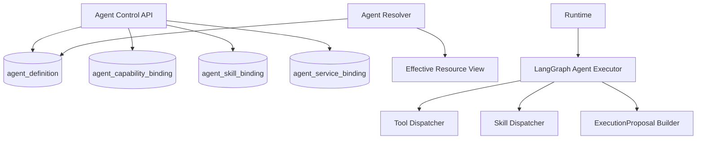
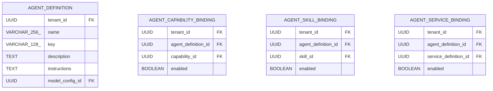

<!-- V1.11 module-split metadata -->
> **文档分档**：`Full`（模板 `design-full.md`）  
> **分档理由**：Agent Definition/Executor/Tool/Skill/Proposal 核心链路  
> **文档边界**：本文件是该模块唯一详细设计事实源；DB Owner 与接口 Owner 必须落在本模块，不允许在其他模块重复定义。  
> **拆分原则**：仅按可独立评审/编码/验收的一级模块拆分；不按单表/单接口继续碎片化。

# Agent Core 与 Agent Executor 模块需求与设计一体化文档

> **文档编号**: MOD-AGENT-V1.11 模块分档拆分版
> **文档版本**: V1.11 模块分档拆分版
> **创建日期**: 2026-09-11
> **文档状态**: 设计基线草案（待仓库 Spec Context 绑定后进入正式评审）
> **模板**: `design-full.md`；生成流程按 `cf-task:align` 的复杂后端/架构模块路径执行。
> **上游基线**: V1.8 完整总体设计 + V6 完整 Playbook + Console V0.8 Final。


**评审边界说明**：
- 第 2 章是需求基线（What），禁止实现阶段自行改变领域语义；
- 第 3-4 章是设计基线（How），DB 与每个接口必须以本文为准；
- `Spec Compliance Matrix` 当前依据设计基线生成，因本轮未提供仓库 `spec-context.yml` 与代码目录，**不得声称已通过 cf-task:align 的 repo Spec Gate**；落码前必须在真实仓库执行 `refresh/catalog/bind`。


## 1. 文档控制

### 1.1 责任人

| 角色 | 姓名 | 职责范围 |
|---|---|---|
| 产品/架构负责人 | 待定 | 需求定义、领域边界、与总设/Playbook 一致性 |
| 开发负责人 | 待定 | 技术方案、DB/API、实现 |
| 测试负责人 | 待定 | S/E/B 场景、E2E Gate |
| 安全/运维 | 待定 | Secret、隔离、发布、监控 |

### 1.2 修订历史

| 版本 | 日期 | 作者 | 变更描述 |
|---|---|---|---|
| V1.11 模块分档拆分版 | 2026-09-11 | ChatGPT / 待项目负责人确认 | 按 cf-task:align + design-full 从最新完整总设/Playbook/交互稿重新生成；细化 DB 与全部接口 |

## 2. 需求分析

### 2.1 需求概述

| 项目 | 内容 |
|---|---|
| 模块名称 | Agent Core 与 Agent Executor |
| 模块ID | MOD-AGENT |
| 所属系统/产品线 | Fluxion 通用智能服务执行框架 |
| 需求类型 | 中大型功能 / 架构演进 |
| 业务背景 | Agent 是智能决策载体，但 AgentDefinition、能力/Skill/子服务绑定必须是清晰的配置事实；LLM 不应绕过可靠执行边界。 |
| 核心目标 | 统一 AgentDefinition 管理、effective resource resolve、LangGraph AgentExecutor、Capability/Skill dispatch 和 ExecutionProposal 生成。 |

### 2.2 痛点与价值

| 维度 | 内容 |
|---|---|
| 目标用户 | Builder；Agent Runtime；Skill/Capability Runtime |
| 当前问题 | 如果 Skill 依赖直接暴露为 LLM Tool、Agent 高风险动作直接执行、Agent/Service 主关系混淆，会造成权限扩张和不可控副作用。 |
| 业务影响 | 模型可调用超出授权范围的能力、SOP/Service 关系难解释、线上行为随实现漂移。 |
| 预期价值 | Agent 只看到明确的 direct tool + bound Skill + callable Service；可靠动作通过 ExecutionService。 |

### 2.3 功能方案

#### 2.3.1 功能清单

| 功能ID | 功能名称 | 功能描述 | 优先级 | 来源 |
|---|---|---|---|---|
| FEAT-AGENT-01 | AgentDefinition CRUD | 基础配置 direct-effect revision。 | P0 | Console Agent |
| FEAT-AGENT-02 | 资源绑定 | 直接 Capability、Skill、可调用子 Service。 | P0 | 交互稿 |
| FEAT-AGENT-03 | Effective Capability | 区分 DIRECT 与 SKILL dependency。 | P0 | Skill 新模型 |
| FEAT-AGENT-04 | AgentExecutor | LangGraph reasoning/tool/skill loop。 | P0 | 总体设计 |
| FEAT-AGENT-05 | ExecutionProposal | 高风险/长任务转换可信执行候选。 | P0 | ExecutionService 边界 |

### 2.4 范围与边界

| 类别 | 内容 |
|---|---|
| 范围（In Scope） | AgentDefinition 表/CRUD、绑定表、resolve/effective analysis、AgentExecutor、Tool/Skill Dispatcher、Proposal Builder。 |
| 非范围（Out of Scope） | Model Provider 具体实现、Skill 包导入、Service 发布/Worker、Channel Bot 配置。 |
| 前置假设 | 上游总设、公共 DB/API 规范、外部基础设施可用 |
| 有意妥协 / 技术债 | 无；未来扩展必须有真实旅程驱动 |

### 2.5 验收条件

#### 2.5.1 业务规则与约束

| ID | 类型 | 描述 | 验证场景 |
|---|---|---|---|
| RULE-AGENT-01 | 模型 | V1 一个 Agent 只能引用一个 ModelConfig。 | S-AGENT-01 |
| RULE-AGENT-02 | 生效 | Agent 无 Draft/Publish；保存后新请求直接使用新 revision。 | S-AGENT-02 |
| RULE-AGENT-03 | 能力 | SkillArtifact 的 Capability 依赖不会自动成为 Agent LLM Tool。 | S-AGENT-03 |
| RULE-AGENT-04 | 服务关系 | Service.primary_agent 与 Agent.callable_service 是不同关系。 | S-AGENT-04 |
| RULE-AGENT-05 | 高风险 | 有副作用/长任务按策略生成 ExecutionProposal，不由 Agent loop 直接可靠执行。 | S-AGENT-05 |

#### 2.5.2 功能验收场景

**正常场景**

| 场景ID | 功能ID | 优先级 | 测试层级 | 关键真实边界 | 归属 | 前置条件 | 操作步骤 | 预期结果 |
|---|---|---|---|---|---|---|---|---|
| S-AGENT-01 | FEAT-AGENT-01 | P0 | E2E | Console API→DB→Runtime | 本模块 | Model enabled | 创建 Agent | 列表/详情可见，Runtime 可解析 |
| S-AGENT-02 | FEAT-AGENT-02 | P0 | E2E | Binding API→Resolver | 本模块 | Agent 已存在 | 绑定 direct capability + Skill | effective view 标记不同 origin |
| S-AGENT-03 | FEAT-AGENT-04 | P0 | E2E | AgentExecutor→Model→Capability | 后置 → 模块 03/07/19 | 用户有授权 | 请求只读 direct tool | 仅允许已绑定能力 |
| S-AGENT-04 | FEAT-AGENT-05 | P0 | E2E | Agent→ExecutionService | 后置 → 模块 05 | 请求长任务 | 模型形成服务意图 | 得到 Proposal，由 ExecutionService 再校验 |

**异常场景**

| 场景ID | 功能ID | 测试层级 | 关键真实边界 | 归属 | 触发条件 | 系统行为 | 用户感知 |
|---|---|---|---|---|---|---|---|
| E-AGENT-01 | FEAT-AGENT-03 | integration | Resolver→DB | 本模块 | Skill 依赖能力但 Agent 未 direct bind | LLM tool 集不包含该能力 | 仍可由 Skill 内部调用 |
| E-AGENT-02 | FEAT-AGENT-01 | integration | PUT→revision | 本模块 | 并发编辑旧 revision | 409 REVISION_CONFLICT | 前端刷新 |

#### 2.5.3 非功能指标

| 指标ID | 指标名称 | 目标值 | 测量方法 |
|---|---|---|---|
| NFR-REL-01 | 可靠执行 | 不得因单 Runtime/Worker 进程退出丢失权威状态 | SIGKILL/E2E |
| NFR-SEC-01 | 可信身份 | LLM/客户端不得覆盖 tenant/actor/secret | 安全测试 |
| NFR-OBS-01 | 可追踪 | 关键路径可按 request_id/trace_id/execution_id 定位 | 集成/E2E |

## 3. 技术设计

### 3.1 方案选型

#### 3.1.1 关键决策记录

| 决策点 | 选择 | 被否决项 | 理由 | 可逆性 |
|---|---|---|---|---|
| Agent 生命周期 | direct-effect revision | Agent Draft/Publish | 简化 V1 且符合交互结论 | 中 |
| 能力集合 | direct + Skill isolated dependency | 依赖并集合并成 tools | 最小权限与可解释 | 难 |
| Agent Loop | LangGraph Library | 自建图执行/Agent Server | 生态成熟且不绑 Service durability | 中 |

#### 3.1.2 技术栈

| 类别 | 选型 | 版本 | 选型理由 |
|---|---|---|---|
| 语言 | Python | 3.12+（仓库实际版本落码前确认） | 与 Agent/LLM 生态一致 |
| Web/API | FastAPI + Pydantic | 仓库实际版本确认 | 类型契约与异步 IO |
| ORM | SQLAlchemy 2 Async | 仓库实际版本确认 | 异步 PostgreSQL |
| 数据库 | PostgreSQL | 外部部署 | 业务 SoT |

### 3.2 架构设计



#### 3.2.1 模块职责分层

| 层级 | 职责 | 禁止事项 |
|---|---|---|
| Handler/API | 协议解析、DTO、权限入口、统一错误映射 | 业务逻辑/直接 SQL |
| Application Service | 用例编排、事务边界、领域校验 | 依赖具体 Web 框架 |
| Domain | 领域对象/规则 | 基础设施依赖 |
| Repository/Port | 持久化/外部能力抽象 | 泄露 Secret/跨领域修改 |
| Adapter | PostgreSQL/HTTP/MCP 等实现 | 改变领域语义 |

#### 3.2.2 外部依赖清单

| 外部系统/模块 | 依赖类型 | 协议/接口 | 超时/一致性 | 降级策略 |
|---|---|---|---|---|
| Model Config | FK/Library | DB + model client | current revision | 禁用 fail closed |
| Capability | Binding/Library | DB + executor | current safety | 禁用即不可调用 |
| Skill | Binding/Runner | DB/ObjectStore | current artifact | 无 VALID artifact 不可绑定 |
| Service | Callable binding | DB | 服务 current release | 无发布版本不可正式执行 |

### 3.3 数据设计

#### 3.3.1 表清单

| 表名 | 职责 | 所有权 |
|---|---|---|
| agent_definition | Agent 配置定义；共享 Runtime Pool 动态加载；保存后新请求直接生效。 | Agent Core 与 Agent Executor |
| agent_capability_binding | Agent 直接暴露给 LLM/Agent 的 Capability 绑定；与 Skill 内部依赖不同。 | Agent Core 与 Agent Executor |
| agent_skill_binding | Agent 可选择/执行的 Skill 绑定。Skill Artifact 依赖不在此维护。 | Agent Core 与 Agent Executor |
| agent_service_binding | Agent 允许作为子服务调用的 Service 绑定；不等于 Service.primary_agent_id。 | Agent Core 与 Agent Executor |

#### 表 `agent_definition`

**职责**：Agent 配置定义；共享 Runtime Pool 动态加载；保存后新请求直接生效。

| 字段名 | 类型 | 可空 | 默认值 | 索引 | 说明 |
|---|---|---|---|---|---|
| tenant_id | UUID | N |  | IDX | 租户 |
| name | VARCHAR(256) | N |  | IDX | 名称 |
| key | VARCHAR(128) | N |  | UK | 稳定标识，创建后不可修改 |
| description | TEXT | Y |  |  | 说明 |
| instructions | TEXT | N |  |  | 系统指令 |
| model_config_id | UUID | N |  | FK,IDX | V1 唯一模型配置 |
| memory_policy | JSONB | N | {} |  | 长期 Memory 策略 |
| enabled | BOOLEAN | N | TRUE | IDX | 是否接受新请求 |
| revision | BIGINT | N | 1 |  | direct-effect revision |
| id | UUID | N | gen_random_uuid() | PK | 主键 |
| is_deleted | BOOLEAN | N | FALSE | IDX | 软删除标记；默认查询必须过滤 FALSE |
| create_time | TIMESTAMPTZ | N | CURRENT_TIMESTAMP |  | 创建时间 |
| update_time | TIMESTAMPTZ | N | CURRENT_TIMESTAMP |  | 更新时间；不可变表除外 |

**约束**

- UNIQUE (tenant_id,key) WHERE is_deleted=false
- model_config_id 必须属于同一 tenant 且 enabled

**索引设计**

| 索引名 | 类型 | 字段 | 使用场景 |
|---|---|---|---|
| uk_agent_definition_key | UNIQUE | tenant_id,key | 按 key 解析 |
| idx_agent_definition_model | BTREE | tenant_id,model_config_id,is_deleted | 模型反查 Agent |

#### 表 `agent_capability_binding`

**职责**：Agent 直接暴露给 LLM/Agent 的 Capability 绑定；与 Skill 内部依赖不同。

| 字段名 | 类型 | 可空 | 默认值 | 索引 | 说明 |
|---|---|---|---|---|---|
| tenant_id | UUID | N |  | IDX | 租户 |
| agent_definition_id | UUID | N |  | FK,IDX | Agent |
| capability_id | UUID | N |  | FK,IDX | Capability |
| enabled | BOOLEAN | N | TRUE |  | 绑定是否有效 |
| id | UUID | N | gen_random_uuid() | PK | 主键 |
| is_deleted | BOOLEAN | N | FALSE | IDX | 软删除标记；默认查询必须过滤 FALSE |
| create_time | TIMESTAMPTZ | N | CURRENT_TIMESTAMP |  | 创建时间 |
| update_time | TIMESTAMPTZ | N | CURRENT_TIMESTAMP |  | 更新时间；不可变表除外 |

**约束**

- UNIQUE (tenant_id,agent_definition_id,capability_id) WHERE is_deleted=false

**索引设计**

| 索引名 | 类型 | 字段 | 使用场景 |
|---|---|---|---|
| uk_agent_capability_binding | UNIQUE | tenant_id,agent_definition_id,capability_id,is_deleted | 防重复 |

#### 表 `agent_skill_binding`

**职责**：Agent 可选择/执行的 Skill 绑定。Skill Artifact 依赖不在此维护。

| 字段名 | 类型 | 可空 | 默认值 | 索引 | 说明 |
|---|---|---|---|---|---|
| tenant_id | UUID | N |  | IDX | 租户 |
| agent_definition_id | UUID | N |  | FK,IDX | Agent |
| skill_id | UUID | N |  | FK,IDX | SkillDefinition |
| enabled | BOOLEAN | N | TRUE |  | 绑定是否有效 |
| id | UUID | N | gen_random_uuid() | PK | 主键 |
| is_deleted | BOOLEAN | N | FALSE | IDX | 软删除标记；默认查询必须过滤 FALSE |
| create_time | TIMESTAMPTZ | N | CURRENT_TIMESTAMP |  | 创建时间 |
| update_time | TIMESTAMPTZ | N | CURRENT_TIMESTAMP |  | 更新时间；不可变表除外 |

**约束**

- UNIQUE (tenant_id,agent_definition_id,skill_id) WHERE is_deleted=false

**索引设计**

| 索引名 | 类型 | 字段 | 使用场景 |
|---|---|---|---|
| uk_agent_skill_binding | UNIQUE | tenant_id,agent_definition_id,skill_id,is_deleted | 防重复 |

#### 表 `agent_service_binding`

**职责**：Agent 允许作为子服务调用的 Service 绑定；不等于 Service.primary_agent_id。

| 字段名 | 类型 | 可空 | 默认值 | 索引 | 说明 |
|---|---|---|---|---|---|
| tenant_id | UUID | N |  | IDX | 租户 |
| agent_definition_id | UUID | N |  | FK,IDX | 调用方 Agent |
| service_definition_id | UUID | N |  | FK,IDX | 可调用 Service |
| enabled | BOOLEAN | N | TRUE |  | 绑定是否有效 |
| id | UUID | N | gen_random_uuid() | PK | 主键 |
| is_deleted | BOOLEAN | N | FALSE | IDX | 软删除标记；默认查询必须过滤 FALSE |
| create_time | TIMESTAMPTZ | N | CURRENT_TIMESTAMP |  | 创建时间 |
| update_time | TIMESTAMPTZ | N | CURRENT_TIMESTAMP |  | 更新时间；不可变表除外 |

**约束**

- UNIQUE (tenant_id,agent_definition_id,service_definition_id) WHERE is_deleted=false

**索引设计**

| 索引名 | 类型 | 字段 | 使用场景 |
|---|---|---|---|
| uk_agent_service_binding | UNIQUE | tenant_id,agent_definition_id,service_definition_id,is_deleted | 防重复 |

#### 3.3.2 ER 图



#### 3.3.3 数据一致性与软删除规则

- 所有 Framework 自建可变表使用 `is_deleted/create_time/update_time`；查询默认过滤 `is_deleted=false`。
- FK 只引用同一租户可见对象；跨租户引用必须在 Application Service 拒绝。
- Secret/Token/Password 不落业务表明文，只保存 `secret_ref/credential_ref`。
- 不可变 Release/Snapshot/Artifact 使用 append-only；需要更新时新建记录。
- `revision` 用于 direct-effect 配置的乐观并发和审计，不等同于发布版本。

### 3.4 接口设计

#### 3.4.1 接口清单

| 接口ID | 名称 | 形态 | 方法/签名 | 路径/用途 |
|---|---|---|---|---|
| AGENT-API-01 | Agent 列表 | HTTP | GET | /api/v1/agents |
| AGENT-API-02 | 创建 Agent | HTTP | POST | /api/v1/agents |
| AGENT-API-03 | Agent 详情 | HTTP | GET | /api/v1/agents/{agent_id} |
| AGENT-API-04 | 编辑 Agent 基本配置 | HTTP | PUT | /api/v1/agents/{agent_id} |
| AGENT-API-05 | 覆盖 Agent 直接能力 | HTTP | PUT | /api/v1/agents/{agent_id}/capabilities |
| AGENT-API-06 | 覆盖 Agent Skill | HTTP | PUT | /api/v1/agents/{agent_id}/skills |
| AGENT-API-07 | 覆盖可调用子服务 | HTTP | PUT | /api/v1/agents/{agent_id}/services |
| AGENT-API-08 | 有效能力分析 | HTTP | GET | /api/v1/agents/{agent_id}/effective-capabilities |
| AGENT-LIB-01 | AgentDefinition 解析 | Library | async def resolve_agent_definition(tenant_id: UUID, agent_id: UUID) -> ResolvedAgentDefinition |  |
| AGCORE-LIB-01 | Agent Executor | Library | async def execute_agent(ctx: AgentExecutionContext, request: AgentRequest) -> AsyncIterator[AgentEvent] |  |
| AGCORE-LIB-02 | Agent Tool Dispatcher | Library | async def call_tool(ctx: AgentExecutionContext, capability_key: str, input: dict) -> CapabilityResult |  |
| AGCORE-LIB-03 | Agent Skill Dispatcher | Library | async def run_skill_from_agent(ctx: AgentExecutionContext, skill_key: str, input: dict) -> SkillResult |  |
| AGCORE-LIB-04 | Execution Proposal Builder | Library | def build_execution_proposal(ctx: AgentExecutionContext, service_id: UUID, input: dict, resource_scope: dict, evidence: ProposalEvidence) -> ExecutionProposal |  |

#### AGENT-API-01: Agent 列表

**入口类型**：HTTP

**契约**：`GET /api/v1/agents`

**认证/授权**：None

**Query 参数**

| 参数 | 类型 | 必填 | 说明 |
|---|---|---|---|
| page | integer | N | 页码，从 1 开始；默认 1 |
| page_size | integer | N | 每页条数；默认 20，最大 100 |
| keyword | string | N | name/key |
| model_id | uuid | N | 模型 |
| enabled | boolean | N | 状态 |

**请求体**：无。

**响应 data**

| 字段 | 类型 | 说明 |
|---|---|---|
| items | array<AgentSummary> | 含 model/skill_count/direct_capability_count/user_grant_count/im_access |
| total | integer | 总数 |

**响应示例**

```json
{
  "code": 0,
  "message": "success",
  "data": {
    "items": [],
    "total": 1
  },
  "request_id": "req_xxx"
}
```

**错误码**

仅使用公共错误码。

**处理逻辑**

```text
分页查 agent_definition；用聚合子查询一次性统计绑定，禁止逐行 N+1。
```

#### AGENT-API-02: 创建 Agent

**入口类型**：HTTP

**契约**：`POST /api/v1/agents`

**认证/授权**：None

**请求体**

| 参数 | 类型 | 必填 | 说明 |
|---|---|---|---|
| name | string | Y | 名称 |
| key | string | Y | 稳定 Key |
| description | string | N | 说明 |
| model_config_id | uuid | Y | V1 一个模型 |
| instructions | string | Y | 系统指令 |
| memory_policy | object | N | Memory 策略 |
| enabled | boolean | N | 默认 true |

**请求示例**

```json
{
  "name": "<name>",
  "key": "<key>",
  "description": "<description>",
  "model_config_id": "<model_config_id>",
  "instructions": "<instructions>",
  "memory_policy": {},
  "enabled": true
}
```

**响应 data**

| 字段 | 类型 | 说明 |
|---|---|---|
| id | uuid | Agent ID |
| key | string | Key |
| revision | integer | 1 |

**响应示例**

```json
{
  "code": 0,
  "message": "success",
  "data": {
    "id": "<id>",
    "key": "<key>",
    "revision": 1
  },
  "request_id": "req_xxx"
}
```

**错误码**

| 错误码 | 场景 | HTTP 状态 |
|---|---|---|
| AGENT_KEY_EXISTS | key 重复 | 409 |
| MODEL_NOT_FOUND | 模型不存在/禁用 | 400 |

**处理逻辑**

```text
Builder 鉴权 → 校验模型同租户 → INSERT agent_definition → audit；创建表单不同时维护 Capability/Skill/Channel 绑定。
```

#### AGENT-API-03: Agent 详情

**入口类型**：HTTP

**契约**：`GET /api/v1/agents/{agent_id}`

**认证/授权**：None

**请求体**：无。

**响应 data**

| 字段 | 类型 | 说明 |
|---|---|---|
| agent | object | 基本信息 |
| model | object | 模型摘要 |
| bindings | object | direct capabilities/skills/callable services 只读摘要 |
| im_access | object | WeCom 配置摘要 |
| revision | integer | revision |

**响应示例**

```json
{
  "code": 0,
  "message": "success",
  "data": {
    "agent": {},
    "model": {},
    "bindings": {},
    "im_access": {},
    "revision": 1
  },
  "request_id": "req_xxx"
}
```

**错误码**

| 错误码 | 场景 | HTTP 状态 |
|---|---|---|
| AGENT_NOT_FOUND | 不存在 | 404 |

**处理逻辑**

```text
tenant scoped agent read → 批量加载 bindings/model/channel account 摘要 → 返回。
```

#### AGENT-API-04: 编辑 Agent 基本配置

**入口类型**：HTTP

**契约**：`PUT /api/v1/agents/{agent_id}`

**认证/授权**：None

**请求体**

| 参数 | 类型 | 必填 | 说明 |
|---|---|---|---|
| name | string | Y | 名称 |
| description | string | N | 说明 |
| model_config_id | uuid | Y | 模型 |
| instructions | string | Y | 指令 |
| memory_policy | object | N | 策略 |
| enabled | boolean | Y | 状态 |
| revision | integer | Y | 乐观锁 |

**请求示例**

```json
{
  "name": "<name>",
  "description": "<description>",
  "model_config_id": "<model_config_id>",
  "instructions": "<instructions>",
  "memory_policy": {},
  "enabled": true,
  "revision": 1
}
```

**响应 data**

| 字段 | 类型 | 说明 |
|---|---|---|
| id | uuid | Agent ID |
| revision | integer | 新 revision |

**响应示例**

```json
{
  "code": 0,
  "message": "success",
  "data": {
    "id": "<id>",
    "revision": 1
  },
  "request_id": "req_xxx"
}
```

**错误码**

| 错误码 | 场景 | HTTP 状态 |
|---|---|---|
| AGENT_NOT_FOUND | 不存在 | 404 |
| REVISION_CONFLICT | 并发冲突 | 409 |
| MODEL_NOT_FOUND | 模型无效 | 400 |

**处理逻辑**

```text
锁定 current revision → 校验 model → UPDATE direct-effect + revision+1 → audit。
```

**一致性/幂等**：不提供 Agent Draft/Publish；新请求读取新 revision。

#### AGENT-API-05: 覆盖 Agent 直接能力

**入口类型**：HTTP

**契约**：`PUT /api/v1/agents/{agent_id}/capabilities`

**认证/授权**：None

**请求体**

| 参数 | 类型 | 必填 | 说明 |
|---|---|---|---|
| capability_ids | array<uuid> | Y | 直接暴露给 Agent 的能力集合 |

**请求示例**

```json
{
  "capability_ids": []
}
```

**响应 data**

| 字段 | 类型 | 说明 |
|---|---|---|
| items | array<CapabilityBindingView> | 最终集合 |

**响应示例**

```json
{
  "code": 0,
  "message": "success",
  "data": {
    "items": []
  },
  "request_id": "req_xxx"
}
```

**错误码**

| 错误码 | 场景 | HTTP 状态 |
|---|---|---|
| CAPABILITY_NOT_FOUND | 包含不存在/禁用能力 | 400 |

**处理逻辑**

```text
单事务差集更新 agent_capability_binding；Skill 内部依赖不写此表。
```

#### AGENT-API-06: 覆盖 Agent Skill

**入口类型**：HTTP

**契约**：`PUT /api/v1/agents/{agent_id}/skills`

**认证/授权**：None

**请求体**

| 参数 | 类型 | 必填 | 说明 |
|---|---|---|---|
| skill_ids | array<uuid> | Y | 目标 Skill 集合 |

**请求示例**

```json
{
  "skill_ids": []
}
```

**响应 data**

| 字段 | 类型 | 说明 |
|---|---|---|
| items | array<SkillBindingView> | 最终集合 |

**响应示例**

```json
{
  "code": 0,
  "message": "success",
  "data": {
    "items": []
  },
  "request_id": "req_xxx"
}
```

**错误码**

| 错误码 | 场景 | HTTP 状态 |
|---|---|---|
| SKILL_NOT_FOUND | Skill 不存在/无 VALID current artifact | 400 |

**处理逻辑**

```text
校验 Skill current artifact VALID + enabled → 单事务更新 agent_skill_binding。
```

#### AGENT-API-07: 覆盖可调用子服务

**入口类型**：HTTP

**契约**：`PUT /api/v1/agents/{agent_id}/services`

**认证/授权**：None

**请求体**

| 参数 | 类型 | 必填 | 说明 |
|---|---|---|---|
| service_ids | array<uuid> | Y | Agent 可调用子服务集合 |

**请求示例**

```json
{
  "service_ids": []
}
```

**响应 data**

| 字段 | 类型 | 说明 |
|---|---|---|
| items | array<ServiceBindingView> | 最终集合 |

**响应示例**

```json
{
  "code": 0,
  "message": "success",
  "data": {
    "items": []
  },
  "request_id": "req_xxx"
}
```

**错误码**

| 错误码 | 场景 | HTTP 状态 |
|---|---|---|
| SERVICE_NOT_FOUND | Service 不存在 | 400 |
| SERVICE_CYCLE_INVALID | 静态可检测的直接自调用/禁用关系 | 400 |

**处理逻辑**

```text
校验 service 同租户 → 更新 agent_service_binding；与 Service.primary_agent_id 不互相替代。
```

#### AGENT-API-08: 有效能力分析

**入口类型**：HTTP

**契约**：`GET /api/v1/agents/{agent_id}/effective-capabilities`

**认证/授权**：None

**请求体**：无。

**响应 data**

| 字段 | 类型 | 说明 |
|---|---|---|
| items | array<EffectiveCapability> | key/origin=DIRECT\|SKILL/skill_id/risk/status |
| conflicts | array<object> | 缺失/禁用依赖 |

**响应示例**

```json
{
  "code": 0,
  "message": "success",
  "data": {
    "items": [],
    "conflicts": []
  },
  "request_id": "req_xxx"
}
```

**错误码**

仅使用公共错误码。

**处理逻辑**

```text
direct binding ∪ current SkillArtifact capability snapshots → 按 key 去重并保留 origin；只读计算，不写派生表。
```

#### AGENT-LIB-01: AgentDefinition 解析

**入口类型**：Library

**函数签名**

```python
async def resolve_agent_definition(tenant_id: UUID, agent_id: UUID) -> ResolvedAgentDefinition
```

**入参**

| 参数 | 类型 | 必填 | 说明 |
|---|---|---|---|
| tenant_id | uuid | Y | 租户 |
| agent_id | uuid | Y | Agent |

**返回**

| 字段 | 类型 | 说明 |
|---|---|---|
| definition | ResolvedAgentDefinition | 模型/Prompt/绑定/current revisions |

**异常/错误**

| 错误码 | 场景 | HTTP 状态 |
|---|---|---|
| AGENT_NOT_FOUND | 不存在 | 404 |
| AGENT_DISABLED | 禁用 | 409 |

**处理逻辑**

```text
DB scoped read → 批量加载 model/direct capability/skills/services → 校验 current references → 生成不可修改 request-scoped 投影。
```

#### AGCORE-LIB-01: Agent Executor

**入口类型**：Library

**函数签名**

```python
async def execute_agent(ctx: AgentExecutionContext, request: AgentRequest) -> AsyncIterator[AgentEvent]
```

**入参**

| 参数 | 类型 | 必填 | 说明 |
|---|---|---|---|
| ctx | AgentExecutionContext | Y | resolved Agent/runtime/user context |
| request | AgentRequest | Y | 消息/任务输入 |

**返回**

| 字段 | 类型 | 说明 |
|---|---|---|
| events | AsyncIterator<AgentEvent> | delta/tool/skill/proposal/final |

**异常/错误**

| 错误码 | 场景 | HTTP 状态 |
|---|---|---|
| AGENT_MAX_ROUNDS | 超过 max_rounds | 409 |
| MODEL_ERROR | 模型错误 | 502 |

**处理逻辑**

```text
构建 LangGraph state → model loop → Tool/Skill dispatcher → 若形成可靠 Service 意图则产 ExecutionProposal，不直接执行有副作用 Worker step → structured/final response。
```

#### AGCORE-LIB-02: Agent Tool Dispatcher

**入口类型**：Library

**函数签名**

```python
async def call_tool(ctx: AgentExecutionContext, capability_key: str, input: dict) -> CapabilityResult
```

**入参**

| 参数 | 类型 | 必填 | 说明 |
|---|---|---|---|
| capability_key | string | Y | LLM 选择的 direct capability key |
| input | object | Y | 模型生成参数 |

**返回**

| 字段 | 类型 | 说明 |
|---|---|---|
| result | CapabilityResult | 统一能力结果 |

**异常/错误**

| 错误码 | 场景 | HTTP 状态 |
|---|---|---|
| CAPABILITY_NOT_EFFECTIVE | 不在 Agent 直接有效能力集 | 403 |
| CAPABILITY_CONFIRMATION_REQUIRED | 高风险需转 Execution/确认 | 409 |

**处理逻辑**

```text
检查 effective direct capability set + risk/side effect policy → input schema/semantic validate → 只读短调用可直接 CapabilityExecutor；高风险/长任务转 ExecutionProposal。
```

#### AGCORE-LIB-03: Agent Skill Dispatcher

**入口类型**：Library

**函数签名**

```python
async def run_skill_from_agent(ctx: AgentExecutionContext, skill_key: str, input: dict) -> SkillResult
```

**入参**

| 参数 | 类型 | 必填 | 说明 |
|---|---|---|---|
| skill_key | string | Y | Agent 已绑定 Skill |
| input | object | Y | Skill 输入 |

**返回**

| 字段 | 类型 | 说明 |
|---|---|---|
| result | SkillResult | Skill 输出 |

**异常/错误**

| 错误码 | 场景 | HTTP 状态 |
|---|---|---|
| SKILL_NOT_BOUND | Skill 未绑定 | 403 |
| SKILL_INVALID | 当前 Artifact 不可用 | 409 |

**处理逻辑**

```text
检查 agent_skill_binding → resolve Skill current artifact → SkillRunner.run；Skill 内部 capability 依赖不会自动变成 LLM tool。
```

#### AGCORE-LIB-04: Execution Proposal Builder

**入口类型**：Library

**函数签名**

```python
def build_execution_proposal(ctx: AgentExecutionContext, service_id: UUID, input: dict, resource_scope: dict, evidence: ProposalEvidence) -> ExecutionProposal
```

**入参**

| 参数 | 类型 | 必填 | 说明 |
|---|---|---|---|
| service_id | uuid | Y | 目标 Service |
| input | object | Y | 候选输入 |
| resource_scope | object | Y | 候选范围 |

**返回**

| 字段 | 类型 | 说明 |
|---|---|---|
| proposal | ExecutionProposal | 不可信候选，必须经 ExecutionService 再校验 |

**处理逻辑**

```text
只构造候选意图和 evidence；不得自行写 service_execution/调用 Worker。
```

### 3.5 质量实现方案

#### 3.5.1 性能与容量

| 热点路径 | 负载量级 | 潜在瓶颈 | 实现方案 | 目标值 |
|---|---|---|---|---|
| Agent list | Console 列表 | N+1 统计绑定数 | 聚合子查询/CTE 一次取 counts | 待实测 |
| Runtime resolve | 每对话请求 | 多表往返 | selectin/batch + revision cache | 不牺牲一致性 |

#### 3.5.2 可靠性

所有外部调用有 deadline；重试有界且只对可安全重试错误；业务权威状态外置；进程崩溃后能恢复或明确失败。

#### 3.5.3 安全性

可信 tenant/actor/context 服务端解析；输入做 Schema/语义校验；Secret 仅保存引用；审计中脱敏。

#### 3.5.4 可观测性

日志、Metrics、Trace 统一关联 request_id/trace_id；Execution 路径附带 execution_id/step_id；错误码稳定。

#### 3.5.5 测试策略

Domain/validator 单测；Repository/Provider 真 PG/外部 Stub 集成；核心用户旅程做 E2E；安全和崩溃恢复不得只靠 mock。

## 4. 部署与运维

### 4.1 部署架构

随其所属运行角色部署；PostgreSQL/Redis/Object Store/Secret Provider/OTel Backend 均为外部依赖，不打包进应用 Compose/Helm。

### 4.2 发布与回滚

DB 变更使用向前兼容迁移；应用支持滚动回滚；若涉及不可变 Release/Artifact，只切换 current 指针，不覆盖历史。

### 4.3 监控告警

至少监控请求/调用量、错误率、延迟、外部依赖失败、关键队列/执行积压和配置加载失败；阈值由环境基线确定。

### 4.4 数据迁移

若无历史生产数据则直接按新 Schema 建表；若已有部署，使用 Alembic 等可回滚/可前滚迁移，禁止运行时隐式改表。

## 5. 风险与依赖

| 风险ID | 描述 | 影响 | 应对措施 | 验证场景 |
|---|---|---|---|---|
| RISK-AGENT-01 | Skill 依赖误暴露为 LLM Tool | 高 | 单独 Binding 表 + effective origin test | S-AGENT-02 |
| RISK-AGENT-02 | 高风险 Capability 被 Agent 直接执行 | 高 | risk policy + Proposal gate | S-AGENT-04 |

## 6. 需求追溯矩阵

| 功能ID | 接口ID | 验证场景 | 测试层级 | 状态 |
|---|---|---|---|---|
| FEAT-AGENT-01 | AGENT-API-01, AGENT-API-02 | S-AGENT-01, E-AGENT-02 | E2E/integration | 待实现/评审 |
| FEAT-AGENT-02 | AGENT-API-02, AGENT-API-03 | S-AGENT-02 | E2E/integration | 待实现/评审 |
| FEAT-AGENT-03 | AGENT-API-03, AGENT-API-04 | E-AGENT-01 | E2E/integration | 待实现/评审 |
| FEAT-AGENT-04 | AGENT-API-04, AGENT-API-05 | S-AGENT-03 | E2E/integration | 待实现/评审 |
| FEAT-AGENT-05 | AGENT-API-05, AGENT-API-06 | S-AGENT-04 | E2E/integration | 待实现/评审 |

## Spec Compliance Matrix

| Spec/Rule | enforcement | 设计影响 | 设计落点 | 验证场景 | 状态/N/A 理由 |
|---|---|---|---|---|---|
| DESIGN/AGENT#RULE-AGENT-01 | design-baseline | 约束实现与验收 | §2.5 RULE-AGENT-01 / §3 | S/E/B 场景 | applied；仓库 spec-context 待绑定 |
| DESIGN/AGENT#RULE-AGENT-02 | design-baseline | 约束实现与验收 | §2.5 RULE-AGENT-02 / §3 | S/E/B 场景 | applied；仓库 spec-context 待绑定 |
| DESIGN/AGENT#RULE-AGENT-03 | design-baseline | 约束实现与验收 | §2.5 RULE-AGENT-03 / §3 | S/E/B 场景 | applied；仓库 spec-context 待绑定 |
| DESIGN/AGENT#RULE-AGENT-04 | design-baseline | 约束实现与验收 | §2.5 RULE-AGENT-04 / §3 | S/E/B 场景 | applied；仓库 spec-context 待绑定 |
| DESIGN/AGENT#RULE-AGENT-05 | design-baseline | 约束实现与验收 | §2.5 RULE-AGENT-05 / §3 | S/E/B 场景 | applied；仓库 spec-context 待绑定 |

## 附录 A：接口与 DB 落码检查清单

- [ ] 每个 HTTP Endpoint 已有 DTO、鉴权、错误码、处理逻辑、测试。
- [ ] 每个 Library/CLI 接口有稳定签名和异常语义。
- [ ] 每张表字段、类型、NULL、默认值、唯一约束、索引、软删除策略已落实迁移。
- [ ] Request/Response 字段不接受客户端传入可信 tenant/actor/credential。
- [ ] 列表接口使用服务端分页，避免无界返回。
- [ ] 修改类接口有 revision/冲突语义；高风险/副作用路径满足幂等和审计。
- [ ] 仓库 Spec Context 已 refresh/catalog/bind 且 required Rules 映射到 S/E/B verifier。
