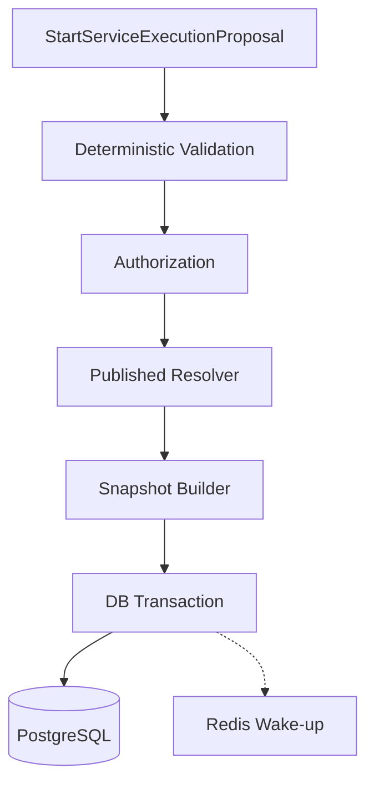
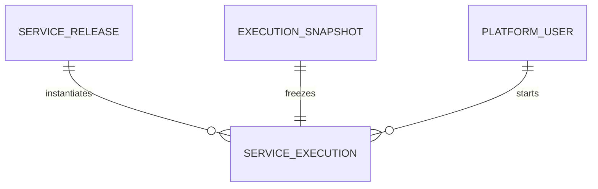

# ExecutionService 模块需求与设计一体化文档

> **文档编号**: MOD-EXEC-1.0  
> **文档版本**: v1.1  
> **创建日期**: 2026-09-10  
> **文档状态**: 设计草稿（V1.7 整改对齐）  
> **设计基线**: 《通用智能服务执行框架 V1.6 总体设计说明书》+《05-变更记录/V1.6-to-V1.7-整改对齐说明》（D01/D02）  
> **模板类型**: design-full（跨模块/架构核心模块）

**评审边界说明**：

- 需求评审：第 2 章，确认模块职责和边界；
- 设计评审：第 3-4 章，确认技术实现、数据、接口、DFX、部署；
- 本文只设计 Framework Core，不引入任何具体项目业务字段。

---

## 1. 文档控制

### 1.1 责任人

| 角色 | 姓名 | 职责范围 |
|---|---|---|
| 产品/架构负责人 | 待定 | 模块边界、需求与总体设计一致性 |
| 开发负责人 | 待定 | 技术方案与实现 |
| 测试负责人 | 待定 | 场景与 Gate |
| 安全/运维评审 | 按需 | 安全、可靠性、部署评审 |

### 1.2 修订历史

| 版本 | 日期 | 变更描述 |
|---|---|---|
| v0.3 | 2026-09-10 | 承接模块 01 后置的 S-04 后置段：新增 S-04/E-03（Published Resolver 取发布时冻结值） |
| v0.1 | 2026-09-10 | 基于总体设计 V1.6 首次形成模块详细设计 |
| v1.1 | 2026-09-10 | V1.7 整改：ResourceScopeRegistry+JSON Schema+三错误码（D01）、Human deadline 快照语义（D02）、REQ-EXEC-001/002 |

---

## 2. 需求分析

### 2.1 需求概述

| 项目 | 内容 |
|---|---|
| 模块名称 | ExecutionService |
| 模块ID | MOD-EXEC |
| 需求类型 | 新框架模块设计 |
| 业务背景 | LLM/Agent 输出不能直接触发高风险、写操作或长任务，需要一个确定性可信边界将 Proposal 转换为 ServiceExecution。 |
| 核心目标 | 统一完成身份、授权、输入、确认、幂等、发布配置解析和 Snapshot 创建，并在事务内持久化 Execution。 |
| 运行形态 | 共享 Python Application Service；不独立部署 |

### 2.2 痛点与价值

| 维度 | 内容 |
|---|---|
| 目标用户 | Agent Runtime、Platform API、未来其他可信入口 |
| 当前问题 | 如果各入口自己创建任务，会出现授权、Snapshot、幂等和风险校验不一致；若做成独立微服务又增加无必要网络跳数。 |
| 框架影响 | 这是 LLM 世界进入真实业务副作用的核心安全边界。 |
| 预期价值 | 所有可靠业务执行从同一确定性入口创建，既统一安全规则又避免独立微服务开销。 |

### 2.3 功能方案

#### 2.3.1 功能清单

| 功能ID | 功能名称 | 功能描述 | 优先级 | 来源 |
|---|---|---|---|---|
| FEAT-01 | Proposal 校验 | 校验 Service、input、resource_scope（经 ResourceScopeRegistry JSON Schema，V1.7 D01）、confirmation。 | P0 | 总体设计 V1.7 |
| FEAT-02 | 授权解析 | 验证 PlatformUser 的 Service/Capability eligibility。 | P0 | 总体设计 V1.6 |
| FEAT-03 | 幂等创建 | 重复 idempotency_key 返回同一 Execution。 | P0 | 总体设计 V1.6 |
| FEAT-04 | Snapshot | 冻结必要 Service/Agent/Skill/执行逻辑，不冻结实时安全状态。 | P0 | 总体设计 V1.6 |
| FEAT-05 | 事务创建 | 原子写 Execution + Snapshot 并触发非权威 wake-up hint。 | P0 | 总体设计 V1.6 |

#### 2.4 范围与边界

| 类别 | 内容 |
|---|---|
| 范围（In Scope） | Execution 创建前所有确定性校验、Snapshot、幂等、数据库事务。 |
| 非范围（Out of Scope） | 真正执行 Step、长期 retry/wait、外部 Auth token 刷新、LLM 二次解释原 Prompt。 |
| 前置假设 | Service 已发布；TrustedExecutionContext 由可信服务端构建。 |
| 有意妥协/技术债 | V1 不做独立 Execution Service 网络服务；如果未来跨语言/独立安全域要求出现再拆。 |

### 2.5 验收条件

#### 2.5.1 业务规则与约束

| ID | 类型 | 描述 | 验证场景 |
|---|---|---|---|
| RULE-01 | 系统约束 | 任何写/高风险/长期任务必须通过 ExecutionService 创建。 | S-01 |
| RULE-02 | 系统约束 | 重复 idempotency_key 不得创建两个 Execution。 | S-02 |
| RULE-03 | 系统约束 | Snapshot 不保存 Credential 明文和 current user authorization。 | E-01 |
| RULE-04 | 系统约束 | LLM 传入的 actor/tenant/auth 字段不得覆盖 TrustedExecutionContext；Proposal.resource_scope 为未验证候选，不得直接写入 TrustedExecutionContext（V1.7 D01）。 | E-02 |
| RULE-05 | 系统约束 | 未知 scope type 拒（SERVICE_CONFIGURATION_INVALID/500）；schema 不符拒（SCOPE_INVALID/400）；格式合法但无权拒（SCOPE_FORBIDDEN/403），且失败不创建 Execution（REQ-EXEC-001）。 | E-EXEC-003/E-EXEC-004 |
| RULE-06 | 系统约束 | Human deadline 快照语义：进入 WAITING_HUMAN 置 next_run_at=deadline（默认24h，可配不可空，V1.7 D02）。 | S-HUMAN |

#### 2.5.2 功能验收场景

**正常场景**

| 场景ID | 功能ID | 优先级 | 测试层级 | 关键真实边界 | 归属 | 前置条件 | 操作步骤 | 预期结果 |
|---|---|---|---|---|---|---|---|---|
| S-01 | FEAT-01 | P0 | integration | Agent Runtime → ExecutionService → PostgreSQL | 本模块 | 已完成基础配置 | 提交已确认的 Service Proposal | 生成 Execution + Snapshot，状态 PENDING |
| S-02 | FEAT-03 | P0 | integration | Repository unique key | 本模块 | 已完成基础配置 | 相同 idempotency_key 连续提交两次 | 返回同一 execution_id，不产生重复副作用 |
| S-03 | FEAT-05 | P0 | integration | ExecutionService → PostgreSQL Transaction → Redis Hint | 本模块 + 后置段 → 模块 14 | 已完成基础配置 | 创建新的 ServiceExecution | Execution 与 Snapshot 同事务成功；Redis wake-up 失败不回滚数据库事实 |
| S-EXEC-001 | FEAT-01 | P0 | integration | Proposal → ResourceScopeRegistry → ServiceExecution | 本模块 | 已完成基础配置 | 提交合法 ResourceScope | 创建成功；scope schema_hash 随 Snapshot 冻结 |
| S-04 | FEAT-04 | P0 | integration | Proposal → ServiceRelease → Published Resolver → Snapshot | 本模块 | Service 已发布（模块 01 LIB-01），存在 current published release | Service 发布后修改 Draft 但**不再发布**，再创建 Execution | Execution 的 Snapshot 使用**发布时冻结**的 release ref 与 skill checksum，不随后续 Draft 或 live 配置漂移 |

**异常场景**

| 场景ID | 功能ID | 测试层级 | 关键真实边界 | 归属 | 触发条件 | 系统行为 | 用户感知 |
|---|---|---|---|---|---|---|---|
| E-EXEC-003 | FEAT-01 | integration | ResourceScopeRegistry | 本模块 | scope 不符 Service 声明 schema | SCOPE_INVALID(400)，不创建 Execution | 返回可识别错误，不泄露内部细节 |
| E-EXEC-004 | FEAT-01 | integration | ServiceRelease → Registry | 本模块 | Service 引用不存在的 scope type | SERVICE_CONFIGURATION_INVALID(500)，不创建 Execution | 返回可识别错误，不泄露内部细节 |

**异常场景**

| 场景ID | 功能ID | 测试层级 | 关键真实边界 | 归属 | 触发条件 | 系统行为 | 用户感知 |
|---|---|---|---|---|---|---|---|
| E-01 | FEAT-04 | integration | Snapshot Builder | 本模块 | Snapshot Builder 尝试写 credential/token | Schema/安全测试失败 | 返回可识别错误，不泄露内部细节 |
| E-02 | FEAT-02 | integration | Trusted Context | 本模块 | Proposal input 中包含伪造 actor_user_id | 忽略/拒绝该字段，使用 context actor | 返回可识别错误，不泄露内部细节 |
| E-03 | FEAT-04 | integration | Published Resolver | 本模块 | Service 无 current published release（仅 Draft） | 拒绝创建 | 抛可识别错误，**不落 ServiceExecution / Snapshot 行** |

#### 2.5.3 非功能指标

| 指标ID | 指标名称 | 目标值 | 测量方法 |
|---|---|---|---|
| NFR-REL-01 | 可靠性 | 不得丢失/破坏框架权威状态；具体 SLA 待真实部署压测后确定 | 故障注入 + integration/E2E |
| NFR-SEC-01 | 安全边界 | 不得信任 LLM 提供的身份/权限/Host 路径等安全上下文 | Architecture Gate + integration |
| NFR-OBS-01 | 可观测性 | 关键操作必须携带 request_id/trace_id 或 execution_id | 日志/Trace 断言 |

性能/QPS/延迟阈值当前没有真实压测依据，本文不虚构固定数字；上线门槛在真实 Reference Integration 跑通后补充。

---

## 3. 技术设计

### 3.1 方案选型

#### 关键决策记录

| 决策点 | 选择 | 被否决项 | 理由 | 可逆性 |
|---|---|---|---|---|
| 部署 | 共享 Application Service | 独立微服务 | V1 无必要网络边界，两个调用者同为 Python | 易 |
| 幂等 | 数据库唯一约束 + repository lookup | 仅应用层先查 | 避免并发竞态 | 难 |
| Snapshot | 轻量冻结业务逻辑 | 复制所有配置/安全状态 | 减少版本负担且允许安全状态实时生效 | 中 |

#### 技术栈

| 类别 | 选型 | 版本 | 选型理由 |
|---|---|---|---|
| 语言 | Python | 3.12+ | 与调用端共享 |
| Schema | Pydantic v2 | 2.x | Proposal/Snapshot 强校验 |
| DB | PostgreSQL | 待定 | 事务和唯一约束 |
| Wake-up | Redis（非权威） | 待定 | 仅提示 Worker |

### 3.2 架构设计



#### 分层职责

| 层级 | 职责 |
|---|---|
| Proposal Schema | 用户意图的结构化输入 |
| Validation | Service/input/confirm/scope/idempotency |
| Resolve | 当前 Published Service/Agent/Bindings |
| Snapshot | 固定必要逻辑 |
| Repository Transaction | Execution + Snapshot 原子写 |

### 3.3 数据设计

> **统一数据库公共字段约束**：本模块凡新增 Framework 自建表，均必须包含 `is_deleted BOOLEAN NOT NULL DEFAULT FALSE`、`create_time TIMESTAMPTZ NOT NULL DEFAULT now()`、`update_time TIMESTAMPTZ NOT NULL DEFAULT now()`；Repository 默认过滤 `is_deleted=false`，删除默认逻辑删除。第三方自管理表（如 LangGraph Checkpointer）不修改其内部 Schema。


| 数据对象/表 | 关键字段 | 约束/索引 | 说明 |
|---|---|---|---|
| service_execution | id、actor、release、scope、status、idempotency_key、snapshot_id | idempotency unique；status indexes | 可靠任务根 |
| execution_snapshot | service/agent refs、skill checksum、execution_spec | 与 execution 1:1 | 轻量执行快照 |


**ER 图**



### 3.4 接口设计

| 接口ID | 接口/函数 | 形态 | 说明 | 关联功能 |
|---|---|---|---|---|
| LIB-01 | ExecutionService.create(proposal, context) | 函数库 | 创建或返回幂等 Execution | FEAT-01,FEAT-02,FEAT-03,FEAT-04,FEAT-05 |
| LIB-02 | PublishedServiceResolver.resolve(service_key) | 函数库 | 解析当前发布内容 | FEAT-04 |
| LIB-03 | ExecutionRepository.create(execution,snapshot) | 函数库 | 事务持久化 | FEAT-05 |

`StartServiceExecutionProposal` 只包含 service_key、业务 input、confirmation_ref、conversation_id、idempotency_key；actor/tenant/auth/delivery route 由 TrustedExecutionContext 提供。

所有普通 HTTP JSON 接口必须复用统一响应 Envelope：

```json
{
  "code": "OK",
  "message": "success",
  "data": {},
  "request_id": "req-xxx",
  "timestamp": "2026-09-10T15:00:00+00:00"
}
```

SSE/WebSocket/文件流属于协议例外，但必须复用统一错误码 taxonomy 和 request/trace 关联策略。

### 3.5 质量实现方案

#### 可靠性

数据库唯一约束处理并发重复；Redis wake-up 失败不回滚已成功创建的 Execution，Worker 依赖 PG polling 自愈。

#### 安全性

所有可信身份从 context；权限失败直接阻止创建；Snapshot 明确拒绝 Credential/Session。

#### 可观测性

记录 execution_created/idempotent_hit/validation_failed，关联 request_id、trace_id、service_key、execution_id。

#### 测试策略

```text
unit
→ 纯规则/状态机/转换

integration
→ Repository / Provider / Runtime 边界

E2E
→ 真实进程/API/数据库/用户可见结果

architecture
→ 依赖方向、Stateless、统一响应、Core Purity 等硬约束
```

---

## 4. 部署与运维

### 4.1 部署架构

无独立进程；由 agent-runtime/platform-api 进程内调用。共享代码但 Repository 事务语义必须一致。

### 4.2 发布与回滚

- 框架代码通过镜像/包版本发布；
- Schema 变化使用 Alembic expand → migrate → switch → contract；
- 只有 `Service` 采用草稿/已发布两态，`Agent` 统一 direct-effect + revision（V1.7 D04），不把代码发布和业务定义发布混成一套版本系统；
- 运行配置可直接生效时必须保留 revision/audit；
- 回滚不得恢复已经撤销的用户权限、Credential 或安全禁用状态。

### 4.3 监控告警

create latency、idempotent hits、validation reject、snapshot build failures、wake-up failures；阈值待定。

阈值当前统一标记为**待定**，由 Reference Integration 实测建立基线后配置。

---

## 5. 风险与依赖

### 5.1 项目依赖

| 依赖模块/团队 | 依赖内容 | 状态 | 风险等级 |
|---|---|---|---|
| Domain/Published Resolver | 发布配置 | 必需 | 高 |
| Authorization Resolver | 平台侧 eligibility | 必需 | 高 |
| PostgreSQL | 事务 SoT | 必需 | 高 |
| Redis | 可选 wake-up | 可降级 | 低 |

### 5.2 风险识别

| 风险ID | 类型 | 描述 | 概率 | 影响 | 应对措施 | 验证场景 |
|---|---|---|---|---|---|---|
| RISK-01 | 安全 | 绕过 ExecutionService 直接执行写能力 | 中 | 高 | Capability policy + Architecture Gate + Integration tests | S-01 |
| RISK-02 | 一致性 | 并发幂等竞态 | 中 | 高 | DB unique constraint + transaction | S-02 |

---

## 6. 需求追溯矩阵

| 来源 | 功能ID | 接口ID | 测试场景 | 测试层级 | 状态 |
|---|---|---|---|---|---|
| 总体设计 V1.6 | FEAT-01 | LIB-01 | S-01 | integration/E2E | 待实现 |
| 总体设计 V1.6 | FEAT-02 | LIB-01 | E-02 | integration/E2E | 待实现 |
| 总体设计 V1.6 | FEAT-03 | LIB-01 | S-02 | integration/E2E | 待实现 |
| 总体设计 V1.6 | FEAT-04 | LIB-01, LIB-02 | E-01, S-04 | integration/E2E | 待实现 |
| 总体设计 V1.6 | FEAT-04 | LIB-02 | E-03 | integration/E2E | 待实现（承接模块 01 S-04 的后置 E2E 段） |
| 总体设计 V1.6 | FEAT-05 | LIB-01, LIB-03 | S-03 | integration/E2E | 待实现 |

---

## Spec Compliance Matrix

| Spec/Rule | enforcement | 设计影响 | 设计落点 | 验证场景 | verifier | 状态 |
|---|---|---|---|---|---|---|
| framework#RULE-EXEC-001 | required | 可靠动作从 ExecutionService 创建 | §3.2/§3.4 | S-01 | `Execution integration` | applied |
| framework#RULE-DB-001 | required | Execution/Snapshot 表含公共字段 | §3.3 | S-01 | `test_database_common_fields.py` | applied |
| framework#RULE-DB-002 | required | Repository 默认过滤软删除 | §3.3 | S-02 | `test_soft_delete_queries.py` | applied |

---

## 附录：术语表

| 术语 | 定义 |
|---|---|
| Framework Core | 与具体业务项目解耦的框架内核 |
| Integration | 具体项目对框架 SPI/Contract 的实现和配置 |
| Capability | 稳定的“系统能做什么”合同 |
| Execution | 一次可靠业务服务执行实例 |
| SoT | Source of Truth，权威事实源 |
| SPI | Service Provider Interface，扩展接口 |
| DFX | 面向可靠性、安全性、可测试性、可运维性等质量属性的设计 |

---
