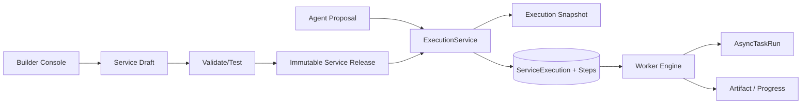

<!-- V1.11 module-split metadata -->
> **文档分档**：`Full`（模板 `design-full.md`）  
> **分档理由**：Service Release、Execution Snapshot、状态生命周期  
> **文档边界**：本文件是该模块唯一详细设计事实源；DB Owner 与接口 Owner 必须落在本模块，不允许在其他模块重复定义。  
> **拆分原则**：仅按可独立评审/编码/验收的一级模块拆分；不按单表/单接口继续碎片化。

# Service 与 Execution 模块需求与设计一体化文档

> **文档编号**: MOD-SVC-V1.11 模块分档拆分版
> **文档版本**: V1.11 模块分档拆分版
> **创建日期**: 2026-09-11
> **文档状态**: 设计基线草案（待仓库 Spec Context 绑定后进入正式评审）
> **模板**: `design-full.md`；生成流程按 `cf-task:align` 的复杂后端/架构模块路径执行。
> **上游基线**: V1.8 完整总体设计 + V6 完整 Playbook + Console V0.8 Final。


**评审边界说明**：
- 第 2 章是需求基线（What），禁止实现阶段自行改变领域语义；
- 第 3-4 章是设计基线（How），DB 与每个接口必须以本文为准；
- `Spec Compliance Matrix` 当前依据设计基线生成，因本轮未提供仓库 `spec-context.yml` 与代码目录，**不得声称已通过 cf-task:align 的 repo Spec Gate**；落码前必须在真实仓库执行 `refresh/catalog/bind`。


## 1. 文档控制

### 1.1 责任人

| 角色 | 姓名 | 职责范围 |
|---|---|---|
| 产品/架构负责人 | 待定 | 需求定义、领域边界、与总设/Playbook 一致性 |
| 开发负责人 | 待定 | 技术方案、DB/API、实现 |
| 测试负责人 | 待定 | S/E/B 场景、E2E Gate |
| 安全/运维 | 待定 | Secret、隔离、发布、监控 |

### 1.2 修订历史

| 版本 | 日期 | 作者 | 变更描述 |
|---|---|---|---|
| V1.11 模块分档拆分版 | 2026-09-11 | ChatGPT / 待项目负责人确认 | 按 cf-task:align + design-full 从最新完整总设/Playbook/交互稿重新生成；细化 DB 与全部接口 |

## 2. 需求分析

### 2.1 需求概述

| 项目 | 内容 |
|---|---|
| 模块名称 | Service 与 Execution |
| 模块ID | MOD-SVC |
| 所属系统/产品线 | Fluxion 通用智能服务执行框架 |
| 需求类型 | 中大型功能 / 架构演进 |
| 业务背景 | Service 是最终用户使用的业务服务，也是唯一正式发布对象；写操作、长任务、需要恢复的流程必须从 Agent Proposal 进入确定性 ExecutionService。 |
| 核心目标 | 完整设计 Service Draft/Release、Execution Snapshot、ServiceExecution/Step/AsyncTask/Command/Progress/Artifact 和全部管理接口。 |

### 2.2 痛点与价值

| 维度 | 内容 |
|---|---|
| 目标用户 | Builder/Admin/End User（经 Agent/Channel）/Worker |
| 当前问题 | 没有稳定发布版本与 durable execution 时，运行中配置漂移、重复副作用、异步任务丢失、/stop 无法统一。 |
| 业务影响 | 服务不可审计、故障难恢复、用户收到“tool success”而非真正业务结果。 |
| 预期价值 | 服务版本确定、任务可恢复、异步/人工/Agent/Capability 步骤统一、结果可追溯。 |

### 2.3 功能方案

#### 2.3.1 功能清单

| 功能ID | 功能名称 | 功能描述 | 优先级 | 来源 |
|---|---|---|---|---|
| FEAT-SVC-01 | Service Draft | 编辑业务目标/主 Agent/执行编排/范围/交付。 | P0 | Builder Journey |
| FEAT-SVC-02 | Validate/Test | 发布前验证与同模型测试。 | P0 | Playbook D05 |
| FEAT-SVC-03 | Publish/Release | 不可变版本与 current release。 | P0 | Playbook A01/A05 |
| FEAT-SVC-04 | Execution | 可信创建与状态根。 | P0 | 总体设计 P4/P6 |
| FEAT-SVC-05 | Step/Async | 同步/异步步骤与外部任务状态。 | P0 | 交互结论 |
| FEAT-SVC-06 | Command/Progress | cancel/retry 与时间线。 | P0 | /stop/运维 |
| FEAT-SVC-07 | Artifact | 大结果与可交付产物。 | P0 | Playbook U04 |

### 2.4 范围与边界

| 类别 | 内容 |
|---|---|
| 范围（In Scope） | ServiceDefinition/Release、ExecutionService、Snapshot、Execution/Step/AsyncTask/Command/Progress/Artifact、列表/详情/取消/重试。 |
| 非范围（Out of Scope） | Worker claim 算法细节（模块06）、Capability Provider 协议（模块07）、Channel 发送协议（模块10）。 |
| 前置假设 | 上游总设、公共 DB/API 规范、外部基础设施可用 |
| 有意妥协 / 技术债 | 无；未来扩展必须有真实旅程驱动 |

### 2.5 验收条件

#### 2.5.1 业务规则与约束

| ID | 类型 | 描述 | 验证场景 |
|---|---|---|---|
| RULE-SVC-01 | 主 Agent | Service.primary_agent_id V1 必填；一个 Agent 可主执行多个 Service。 | S-SVC-01 |
| RULE-SVC-02 | 发布 | 只有 Service 有 Draft/Validate/Test/Publish；Release immutable。 | S-SVC-02 |
| RULE-SVC-03 | 一致性 | Execution 固定 service_release_id + snapshot。 | S-SVC-03 |
| RULE-SVC-04 | 动态安全 | 恢复时重校验 User→AgentAccessGrant、Credential、Capability enabled。 | S-SVC-04 |
| RULE-SVC-05 | 异步 | Async 是 Step execution_mode/AsyncTaskRun，不是 Capability 实现类型/独立菜单。 | S-SVC-05 |
| RULE-SVC-06 | 幂等 | 有副作用 Step 与命令必须有稳定 idempotency_key。 | S-SVC-06 |

#### 2.5.2 功能验收场景

**正常场景**

| 场景ID | 功能ID | 优先级 | 测试层级 | 关键真实边界 | 归属 | 前置条件 | 操作步骤 | 预期结果 |
|---|---|---|---|---|---|---|---|---|
| S-SVC-06 | FEAT-SVC-05 | P1 | integration | 副作用 Step 幂等键 | 本模块 | 含写操作 Step 的 Execution | Step 重试 | 同 idempotency_key 不重复产生外部副作用 |
| S-SVC-01 | FEAT-SVC-01 | P0 | E2E | Console→API→PG | 本模块 | Agent 存在 | 创建 Service | primary_agent_id 保存且不可为空 |
| S-SVC-02 | FEAT-SVC-03 | P0 | E2E | Publish→Release→PG | 本模块 | Draft validate 通过 | 发布两次不同 Draft | 生成两个 immutable release，current 指向最新 |
| S-SVC-03 | FEAT-SVC-04 | P0 | E2E | Agent Proposal→ExecutionService→PG | 本模块 | 用户有授权/Service 已发布 | 确认创建任务 | 生成 snapshot/execution/steps 且幂等 |
| S-SVC-04 | FEAT-SVC-05 | P0 | E2E | Worker→Async provider→PG | 后置 → 模块 06/07 | 异步 capability | 提交→等待→轮询完成 | Timeline 显示外部 task 生命周期 |
| S-SVC-05 | FEAT-SVC-06 | P0 | E2E | Cancel API→command→Worker | 后置 → 模块 06 | Execution RUNNING | 用户 /stop | 状态进入 CANCELLING，停止后续步骤 |

**异常场景**

| 场景ID | 功能ID | 测试层级 | 关键真实边界 | 归属 | 触发条件 | 系统行为 | 用户感知 |
|---|---|---|---|---|---|---|---|
| E-SVC-01 | FEAT-SVC-03 | E2E | Validate→Publish | 本模块 | 依赖缺失/草稿 revision 变化 | Publish 409，不创建 Release | Console 显示具体校验项 |
| E-SVC-02 | FEAT-SVC-04 | E2E | Execution resume→Grant | 后置 → 模块 18 | 任务 WAITING 时撤销 Agent 授权 | 恢复 fail closed/进入人工或失败策略 | 不继续写操作 |
| E-SVC-03 | FEAT-SVC-05 | integration | AsyncTaskRun | 本模块 | provider 不支持 cancel | 平台停止后续步骤并记录外部任务不可取消 | 用户可见明确提示 |

**边界场景**

| 场景ID | 测试层级 | 关键真实边界 | 归属 | 字段/条件 | 边界值 | 预期行为 |
|---|---|---|---|---|---|---|
| B-SVC-01 | integration | idempotency | 本模块 | 重复 create_from_proposal | 相同 idempotency_key | 只创建一个 Execution |
| B-SVC-02 | integration | state machine | 本模块 | 终态再次 cancel | SUCCEEDED/FAILED/CANCELLED | 返回 409 或幂等终态，不回退状态 |

#### 2.5.3 非功能指标

| 指标ID | 指标名称 | 目标值 | 测量方法 |
|---|---|---|---|
| NFR-REL-01 | 可靠执行 | 不得因单 Runtime/Worker 进程退出丢失权威状态 | SIGKILL/E2E |
| NFR-SEC-01 | 可信身份 | LLM/客户端不得覆盖 tenant/actor/secret | 安全测试 |
| NFR-OBS-01 | 可追踪 | 关键路径可按 request_id/trace_id/execution_id 定位 | 集成/E2E |

## 3. 技术设计

### 3.1 方案选型

#### 3.1.1 关键决策记录

| 决策点 | 选择 | 被否决项 | 理由 | 可逆性 |
|---|---|---|---|---|
| 发布 | Draft + immutable Release | 所有配置全版本化 | 只对业务服务承担正式发布复杂度 | 难 |
| 可靠边界 | ExecutionService | Agent 直接 Worker | LLM 不可信，需确定性再校验 | 难 |
| 异步模型 | ExecutionStep + AsyncTaskRun | 独立 Async Task 产品/菜单 | 统一 Timeline/取消/恢复 | 中 |

#### 3.1.2 技术栈

| 类别 | 选型 | 版本 | 选型理由 |
|---|---|---|---|
| 语言 | Python | 3.12+（仓库实际版本落码前确认） | 与 Agent/LLM 生态一致 |
| Web/API | FastAPI + Pydantic | 仓库实际版本确认 | 类型契约与异步 IO |
| ORM | SQLAlchemy 2 Async | 仓库实际版本确认 | 异步 PostgreSQL |
| 数据库 | PostgreSQL | 外部部署 | 业务 SoT |

### 3.2 架构设计



#### 3.2.1 模块职责分层

| 层级 | 职责 | 禁止事项 |
|---|---|---|
| Handler/API | 协议解析、DTO、权限入口、统一错误映射 | 业务逻辑/直接 SQL |
| Application Service | 用例编排、事务边界、领域校验 | 依赖具体 Web 框架 |
| Domain | 领域对象/规则 | 基础设施依赖 |
| Repository/Port | 持久化/外部能力抽象 | 泄露 Secret/跨领域修改 |
| Adapter | PostgreSQL/HTTP/MCP 等实现 | 改变领域语义 |

#### 3.2.2 外部依赖清单

| 外部系统/模块 | 依赖类型 | 协议/接口 | 超时/一致性 | 降级策略 |
|---|---|---|---|---|
| Agent/Grant | 动态安全 | DB/Library | 恢复时 current | 无授权 fail closed |
| Worker Engine | 执行 | PG lease | durable | PG polling 自愈 |
| Capability/Skill/Model | 步骤执行 | Library | deadline | 按 step failure policy |
| Object Store | Artifact | Port | 外部 | 不可用时大结果 step 失败/重试 |
| Channel Delivery | 通知 | DeliveryRoute/Internal API | at-least-once + idem | 可重试 |

### 3.3 数据设计

#### 3.3.1 表清单

| 表名 | 职责 | 所有权 |
|---|---|---|
| execution_proposal | 待确认提案、可信确认消费与执行关联 | Service 与 Execution |

| service_definition | 面向最终用户的业务服务定义；唯一拥有 Draft/Validate/Test/Publish 产品生命周期。 | Service 与 Execution |
| service_release | 发布后的 immutable Service Version；新 Execution 固定引用。 | Service 与 Execution |
| execution_snapshot | Execution 创建时冻结的轻量运行投影；只冻结一致性所需业务逻辑，不冻结实时授权/Credential/紧急禁用。 | Service 与 Execution |
| service_execution | 一次真实 Service 执行实例，是可靠执行的根对象。 | Service 与 Execution |
| execution_step | Execution 内步骤状态；可为 Capability/Agent/Human/Delivery，execution_mode 可同步或异步。 | Service 与 Execution |
| async_task_run | 异步 Capability 的外部任务状态投影；不是 Capability Implementation 类型，也不是一级产品对象。 | Service 与 Execution |
| execution_command | 用户/Admin 对 Execution 发出的 stop/retry/resume 等命令事实，供 Worker 幂等应用。 | Service 与 Execution |
| task_progress_event | Execution 发生了什么的进度事件；与 ChannelDeliveryRoute 分离。 | Service 与 Execution |
| artifact | Execution/Step 产生的可交付或大结果元数据，内容在 Object Store。 | Service 与 Execution |

#### 表 `execution_proposal`

**职责**：不可变确认内容与一次性消费；仅 EXE-LIB-02/03 写入。

| 字段名 | 类型 | 可空 | 默认值 | 索引 | 说明 |
|---|---|---|---|---|---|
| tenant_id | UUID | N |  | IDX | 租户 |
| actor_user_id | UUID | N |  | FK | 确认人 |
| conversation_id | UUID | N |  | FK | 来源会话 |
| service_id | UUID | N |  | FK | 服务 |
| agent_id | UUID | N |  | FK | 入口 Agent |
| service_release_id | UUID | N |  | FK | 签发时已发布版本 |
| snapshot_id | UUID | N |  | FK | 冻结业务投影 |
| input_json | JSONB | N | {} |  | 校验后的输入 |
| resource_scope_json | JSONB | N | {} |  | 确认范围 |
| rendered_summary | TEXT | N |  |  | 实际展示内容 |
| confirmation_digest | VARCHAR(64) | N |  |  | 绑定身份/版本/输入/范围/截止时间 |
| expires_at | TIMESTAMPTZ | N |  | IDX | 创建后 300 秒 |
| status | VARCHAR(16) | N | PENDING |  | PENDING/CONFIRMED/EXPIRED/SUPERSEDED |
| confirmed_message_id | UUID | Y |  | FK message | 真实 USER 确认事件 |
| confirmed_at | TIMESTAMPTZ | Y |  |  | 确认事务数据库时间 |
| execution_id | UUID | Y |  | FK service_execution | 成功消费结果 |
| id | UUID | N | gen_random_uuid() | PK | 主键 |
| is_deleted | BOOLEAN | N | FALSE |  | 默认过滤 FALSE |
| create_time | TIMESTAMPTZ | N | CURRENT_TIMESTAMP |  | 创建时间 |
| update_time | TIMESTAMPTZ | N | CURRENT_TIMESTAMP |  | 更新时间 |

**约束与索引**

- UNIQUE (tenant_id,conversation_id) WHERE status='PENDING' AND is_deleted=false；签发新提案时旧 PENDING 同事务置 SUPERSEDED。
- 签发后禁止修改身份/输入/范围/snapshot/digest/expires_at，只允许状态及消费关联更新。
- CHECK: status=CONFIRMED 当且仅当 execution_id、confirmed_message_id、confirmed_at 全部非空；其他状态均为空。
- confirmed_message_id 对同 tenant 唯一（非空时）；消费与创建执行在同一事务。
- (tenant_id,actor_user_id,conversation_id,create_time) 支持跨 Pod 取回。

#### 表 `service_definition`

**职责**：面向最终用户的业务服务定义；唯一拥有 Draft/Validate/Test/Publish 产品生命周期。

| 字段名 | 类型 | 可空 | 默认值 | 索引 | 说明 |
|---|---|---|---|---|---|
| tenant_id | UUID | N |  | IDX | 租户 |
| name | VARCHAR(256) | N |  | IDX | 服务名称 |
| key | VARCHAR(160) | N |  | UK | 稳定标识 |
| description | TEXT | N |  |  | 服务说明 |
| primary_agent_id | UUID | N |  | FK,IDX | V1 必须绑定一个主执行 Agent |
| execution_type | VARCHAR(32) | N | HYBRID |  | AGENTIC/DETERMINISTIC/HYBRID |
| draft_payload | JSONB | N | {} |  | 当前草稿完整定义 |
| draft_revision | BIGINT | N | 1 |  | 草稿乐观并发 |
| current_release_id | UUID | Y |  | FK | 当前发布版本 |
| enabled | BOOLEAN | N | TRUE | IDX | 是否允许新执行 |
| id | UUID | N | gen_random_uuid() | PK | 主键 |
| is_deleted | BOOLEAN | N | FALSE | IDX | 软删除标记；默认查询必须过滤 FALSE |
| create_time | TIMESTAMPTZ | N | CURRENT_TIMESTAMP |  | 创建时间 |
| update_time | TIMESTAMPTZ | N | CURRENT_TIMESTAMP |  | 更新时间 |

**约束**

- UNIQUE (tenant_id,key) WHERE is_deleted=false
- primary_agent_id NOT NULL
- draft_payload 与 published payload 分离

**索引设计**

| 索引名 | 类型 | 字段 | 使用场景 |
|---|---|---|---|
| uk_service_definition_key | UNIQUE | tenant_id,key | 稳定引用 |
| idx_service_primary_agent | BTREE | tenant_id,primary_agent_id,is_deleted | Agent→Service |
| idx_service_status | BTREE | tenant_id,enabled,current_release_id,is_deleted | 服务列表 |

#### 表 `service_release`

**职责**：发布后的 immutable Service Version；新 Execution 固定引用。

| 字段名 | 类型 | 可空 | 默认值 | 索引 | 说明 |
|---|---|---|---|---|---|
| tenant_id | UUID | N |  | IDX | 租户 |
| service_id | UUID | N |  | FK,IDX | 所属 Service |
| release_no | VARCHAR(64) | N |  |  | v1/v2 或递增版本号 |
| content_hash | VARCHAR(128) | N |  | UK | 规范化 payload hash |
| published_payload | JSONB | N | {} |  | 完整发布定义，含主 Agent/步骤/输入输出/确认等引用 |
| published_by | UUID | N |  |  | 发布者 |
| published_at | TIMESTAMPTZ | N | CURRENT_TIMESTAMP | IDX | 发布时间 |
| id | UUID | N | gen_random_uuid() | PK | 主键 |
| is_deleted | BOOLEAN | N | FALSE | IDX | 软删除标记；默认查询必须过滤 FALSE |
| create_time | TIMESTAMPTZ | N | CURRENT_TIMESTAMP |  | 创建时间 |
| update_time | TIMESTAMPTZ | N | CURRENT_TIMESTAMP |  | 更新时间 |

**约束**

- UNIQUE (tenant_id,service_id,release_no)
- UNIQUE (tenant_id,service_id,content_hash)（同一 Service 内 payload 去重；不同 Service 允许相同 payload）
- 发布后禁止 UPDATE published_payload

**索引设计**

| 索引名 | 类型 | 字段 | 使用场景 |
|---|---|---|---|
| uk_service_release_no | UNIQUE | tenant_id,service_id,release_no | 版本 |
| idx_service_release_time | BTREE | tenant_id,service_id,published_at DESC | 版本历史 |

**不可变约束**：创建后禁止业务 UPDATE/DELETE；如需演进创建新记录并更新上层 current 指针。

#### 表 `execution_snapshot`

**职责**：签发提案/测试时冻结业务投影；无授权和 Secret。

| 字段名 | 类型 | 可空 | 默认值 | 索引 | 说明 |
|---|---|---|---|---|---|
| tenant_id | UUID | N |  | IDX | 租户 |
| service_id | UUID | N |  | FK | ServiceDefinition |
| source | VARCHAR(16) | N |  |  | FORMAL/TEST |
| service_release_id | UUID | Y |  | FK,IDX | FORMAL 必填，TEST 必须为空 |
| draft_revision | BIGINT | Y |  |  | TEST 必填，FORMAL 为空 |
| test_mode | VARCHAR(16) | Y |  |  | TEST=DRY_RUN/REAL_TEST；FORMAL 为空 |
| content_hash | VARCHAR(64) | N |  | UK | 完整投影 hash |
| snapshot_json | JSONB | N |  |  | CORE-LIB-05 ExecutionProjection，完整持久化 |
| snapshot_ref | VARCHAR(1024) | Y |  |  | 超大制品引用；identity/source/hash 仍持久化 |
| id | UUID | N | gen_random_uuid() | PK | 主键 |
| is_deleted | BOOLEAN | N | FALSE |  | 默认过滤 FALSE |
| create_time | TIMESTAMPTZ | N | CURRENT_TIMESTAMP |  | 创建时间 |
| update_time | TIMESTAMPTZ | N | CURRENT_TIMESTAMP |  | 更新时间 |

**约束与索引**

- UNIQUE (tenant_id,service_id,source,content_hash)；hash 覆盖 revision/test_mode/步骤及全部业务投影，不用 nullable release 作去重身份。
- source 与 release/draft/test_mode 按下方 executable predicate 校验；根对象必须匹配同一个 snapshot 的 source/service/version/mode。
- 禁止业务 UPDATE/DELETE。

<!-- contract:execution-source-check -->
```sql
(source = 'FORMAL' AND service_release_id IS NOT NULL AND draft_revision IS NULL AND test_mode IS NULL) OR (source = 'TEST' AND service_release_id IS NULL AND draft_revision IS NOT NULL AND test_mode IN ('DRY_RUN', 'REAL_TEST'))
```
<!-- /contract:execution-source-check -->

#### 表 `service_execution`

**职责**：一次真实 Service 执行实例，是可靠执行的根对象。

| 字段名 | 类型 | 可空 | 默认值 | 索引 | 说明 |
|---|---|---|---|---|---|
| tenant_id | UUID | N |  | IDX | 租户 |
| service_id | UUID | N |  | FK,IDX | ServiceDefinition |
| service_release_id | UUID | Y |  | FK,IDX | FORMAL 必填；TEST 必须为空 |
| actor_user_id | UUID | N |  | FK,IDX | 发起 PlatformUser |
| primary_agent_id | UUID | N |  | FK | 启动时主 Agent 引用 |
| conversation_id | UUID | Y |  | FK,IDX | 来源 Conversation |
| delivery_route_id | UUID | Y |  | FK | 主动投递路由 |
| snapshot_id | UUID | N |  | FK | ExecutionSnapshot |
| workspace_id | UUID | Y |  | FK | 受控 Workspace |
| resource_scope_json | JSONB | N | {} |  | 业务资源范围 |
| input_json | JSONB | N | {} |  | 经 Schema 校验的输入 |
| execution_mode | VARCHAR(16) | N | ASYNC |  | SYNC/ASYNC |
| status | VARCHAR(32) | N | PENDING | IDX | PENDING/RUNNING/WAITING/WAITING_HUMAN/RETRY_WAIT/CANCELLING/SUCCEEDED/FAILED/CANCELLED（终态统一 SUCCEEDED） |
| waiting_reason | VARCHAR(256) | Y |  |  | 进入 WAITING_HUMAN/RETRY_WAIT 的原因（人工等待为审批说明） |
| human_deadline | TIMESTAMPTZ | Y |  | IDX | 进入 WAITING_HUMAN 的截止时间，默认 +24h；超时置 FAILED(error_code=HUMAN_TIMEOUT) |
| requested_action | VARCHAR(16) | Y |  |  | WAITING_HUMAN 期间请求的动作：RESUME/CANCEL |
| channel_source | VARCHAR(32) | Y |  |  | 接入渠道（V1=wechat_wecom；API 发起为空） |
| retry_count | INTEGER | N | 0 |  | 业务重试次数（EXE-API-04 触发） |
| parent_execution_id | UUID | Y |  | FK,UK | 重试的直接父执行；每个父执行最多派生一个子执行 |
| execution_source | VARCHAR(16) | N | FORMAL | IDX | FORMAL/TEST；TEST 不入正式统计 |
| draft_revision | BIGINT | Y |  |  | TEST 必填，FORMAL 为空 |
| test_mode | VARCHAR(16) | Y |  |  | TEST 必填 DRY_RUN/REAL_TEST；FORMAL 为空 |
| root_execution_id | UUID | N |  | FK | 初次执行指向自身；重试沿用 |
| max_retries | INTEGER | N | 3 |  | 管理重试上限，与 claim 的 max_attempts 分离 |
| context_summary | JSONB | Y |  |  | 人工等待摘要：step_key/prompt/input_digest/evidence_refs；脱敏 |
| human_decision_at | TIMESTAMPTZ | Y |  |  | 接受决策的数据库时间 |
| lease_epoch | BIGINT | N | 0 |  | 每次 claim +1；所有状态写入校验 fencing token |
| priority | INTEGER | N | 0 |  | Worker claim 排序权重（总设 §5.2 治理 P1） |
| current_step | VARCHAR(256) | Y |  | 当前阶段（当前步骤 key；初始为空） |
| next_run_at | TIMESTAMPTZ | Y |  | IDX | 可再次 claim 时间 |
| lease_owner | VARCHAR(256) | Y |  | IDX | Worker owner |
| lease_expires_at | TIMESTAMPTZ | Y |  | IDX | lease 到期 |
| attempt | INTEGER | N | 0 |  | Execution claim/恢复计数 |
| max_attempts | INTEGER | N | 10 |  | 安全上限 |
| idempotency_key | VARCHAR(256) | N |  | UK | 提交幂等键 |
| trace_id | VARCHAR(128) | N |  | IDX | 全链路 Trace |
| cancel_requested_at | TIMESTAMPTZ | Y |  |  | 取消请求时间 |
| result_ref | VARCHAR(1024) | Y |  |  | 最终结果引用 |
| artifact_ids | UUID[] | N | {} |  | 根结果产物；重试复制，访问时校验同 root/actor |
| error_code | VARCHAR(128) | Y |  | IDX | 终态错误码 |
| error_message | TEXT | Y |  |  | 脱敏错误摘要 |
| started_at | TIMESTAMPTZ | Y |  |  | 开始时间 |
| finished_at | TIMESTAMPTZ | Y |  |  | 终止时间 |
| id | UUID | N | gen_random_uuid() | PK | 主键 |
| is_deleted | BOOLEAN | N | FALSE | IDX | 软删除标记；默认查询必须过滤 FALSE |
| create_time | TIMESTAMPTZ | N | CURRENT_TIMESTAMP |  | 创建时间 |
| update_time | TIMESTAMPTZ | N | CURRENT_TIMESTAMP |  | 更新时间 |

**约束**

- UNIQUE (tenant_id,idempotency_key)
- 终态不可回到非终态
- source/version/test_mode 按 execution-source-check（source 映射 execution_source）校验，且与 snapshot 一致。
- UNIQUE (tenant_id,parent_execution_id) WHERE parent_execution_id IS NOT NULL；每个失败节点只有一个重试子执行。
- WAITING_HUMAN：deadline 非空；在 deadline 前已被事务接受的 requested_action 优先应用，即使 Worker 稍后才运行。到期且没有有效已接受决策才 FAILED(HUMAN_TIMEOUT)；截止后新决策拒绝，已接受请求重放返回原结果。
- lease_owner/lease_expires_at 仅 Worker 管理
- 创建/恢复时动态重校验 AgentAccessGrant/Credential/Capability enabled

**索引设计**

| 索引名 | 类型 | 字段 | 使用场景 |
|---|---|---|---|
| uk_service_execution_idem | UNIQUE | tenant_id,idempotency_key | 防重复提交 |
| idx_service_execution_claim | BTREE | tenant_id,status,next_run_at,lease_expires_at,is_deleted | Worker claim |
| idx_service_execution_user | BTREE | tenant_id,actor_user_id,create_time DESC | 用户执行历史 |
| idx_service_execution_trace | BTREE | tenant_id,trace_id | 追踪 |

#### 表 `execution_step`

**职责**：Execution 内步骤状态；可为 Capability/Agent/Human/Delivery，execution_mode 可同步或异步。

| 字段名 | 类型 | 可空 | 默认值 | 索引 | 说明 |
|---|---|---|---|---|---|
| tenant_id | UUID | N |  | IDX | 租户 |
| execution_id | UUID | N |  | FK,IDX | Execution |
| step_key | VARCHAR(160) | N |  |  | 步骤稳定 key |
| sequence_no | INTEGER | N |  | IDX | 顺序 |
| step_type | VARCHAR(32) | N |  | IDX | CAPABILITY/AGENT/WAIT/HUMAN/DELIVERY |
| operation_id | UUID | N |  | IDX | 首次创建生成；重试同一逻辑步骤沿用；绑定 input hash |
| source_step_id | UUID | Y |  | FK execution_step | 重试复制的来源步骤 |
| checkpoint_ref | VARCHAR(512) | Y |  |  | 最近已提交的图恢复点 |
| execution_mode | VARCHAR(16) | N | SYNC |  | SYNC/ASYNC |
| status | VARCHAR(32) | N | PENDING | IDX | PENDING/RUNNING/WAITING/SUCCEEDED/FAILED/CANCELLED/SKIPPED |
| attempt | INTEGER | N | 0 |  | 步骤重试计数 |
| idempotency_key | VARCHAR(256) | Y |  | IDX | effect:{operation_id}；跨重试沿用，因此不做全局唯一 |
| input_json | JSONB | N | {} |  | 步骤输入快照 |
| output_json | JSONB | N | {} |  | 小结果；大结果用 result_ref |
| result_ref | VARCHAR(1024) | Y |  |  | Artifact/Object ref |
| artifact_ids | UUID[] | N | {} |  | 本步骤产物关联；复制结果同时复制 ID |
| wait_until | TIMESTAMPTZ | Y |  | IDX | 等待截止/轮询时间 |
| error_code | VARCHAR(128) | Y |  | IDX | 错误码 |
| error_detail_ref | VARCHAR(1024) | Y |  |  | 大错误详情/外部响应脱敏引用 |
| started_at | TIMESTAMPTZ | Y |  |  | 开始 |
| finished_at | TIMESTAMPTZ | Y |  |  | 结束 |
| id | UUID | N | gen_random_uuid() | PK | 主键 |
| is_deleted | BOOLEAN | N | FALSE | IDX | 软删除标记；默认查询必须过滤 FALSE |
| create_time | TIMESTAMPTZ | N | CURRENT_TIMESTAMP |  | 创建时间 |
| update_time | TIMESTAMPTZ | N | CURRENT_TIMESTAMP |  | 更新时间 |

**约束**

- UNIQUE (tenant_id,execution_id,step_key)
- 有副作用步骤必须使用稳定 idempotency_key
- 大 payload 不长期写 DB

**索引设计**

| 索引名 | 类型 | 字段 | 使用场景 |
|---|---|---|---|
| uk_execution_step_key | UNIQUE | tenant_id,execution_id,step_key | 步骤唯一 |
| idx_execution_step_timeline | BTREE | tenant_id,execution_id,sequence_no | Timeline |
| idx_execution_step_wait | BTREE | tenant_id,status,wait_until,is_deleted | WAIT 恢复 |

#### 表 `async_task_run`

**职责**：每个逻辑异步副作用的一条提交/对账/轮询事实，重试执行按 operation_id 复用。

| 字段名 | 类型 | 可空 | 默认值 | 索引 | 说明 |
|---|---|---|---|---|---|
| tenant_id | UUID | N |  | IDX | 租户 |
| execution_step_id | UUID | N |  | FK | 首次提交步骤 |
| operation_id | UUID | N |  | UK | 逻辑调用身份，跨重试共享 |
| actor_user_id | UUID | N |  | FK | 可信调用人 |
| capability_key | VARCHAR(160) | N |  |  | 契约定位 |
| provider_key | VARCHAR(256) | N |  |  | Registry 稳定 key |
| provider_type | VARCHAR(64) | N |  |  | 提供者类型 |
| provider_locator | JSONB | N |  |  | 提交时的非敏感平台/endpoint/region/operation 路由，不随 current implementation 改写 |
| project_platform_id | UUID | Y |  | FK | 动态 Credential 解析定位 |
| idempotency_key | VARCHAR(256) | N |  | UK | 调用级提交键 |
| input_hash | VARCHAR(64) | N |  |  | 防同键换参 |
| external_task_id | VARCHAR(256) | Y |  | IDX | 已确认受理后必填；提交中/未知允许空 |
| status | VARCHAR(32) | N | SUBMITTING | IDX | SUBMITTING/SUBMITTED_UNKNOWN/SUBMITTED/RUNNING/SUCCEEDED/FAILED/CANCELLED |
| last_polled_at | TIMESTAMPTZ | Y |  |  | 最近实际轮询时间 |
| next_poll_at | TIMESTAMPTZ | Y |  | IDX | 轮询或对账到期 |
| poll_attempts | INTEGER | N | 0 |  | 有界计数 |
| max_poll_attempts | INTEGER | N | 100 |  | 执行策略冻结上限 |
| reconcile_deadline | TIMESTAMPTZ | N |  |  | 未知结果对账截止时间 |
| cancel_supported | BOOLEAN | N | FALSE |  | Provider 能力 |
| result_ref | VARCHAR(1024) | Y |  |  | 结果 |
| error_code | VARCHAR(128) | Y |  |  | 错误分类 |
| submitted_at | TIMESTAMPTZ | Y |  |  | 确认受理时间 |
| completed_at | TIMESTAMPTZ | Y |  |  | 终态时间 |
| id | UUID | N | gen_random_uuid() | PK | 主键 |
| is_deleted | BOOLEAN | N | FALSE |  | 默认过滤 FALSE |
| create_time | TIMESTAMPTZ | N | CURRENT_TIMESTAMP |  | 创建时间 |
| update_time | TIMESTAMPTZ | N | CURRENT_TIMESTAMP |  | 更新时间 |

**约束与索引**

- UNIQUE (tenant_id,operation_id)；UNIQUE (tenant_id,idempotency_key)。
- SUBMITTED/RUNNING/SUCCEEDED/CANCELLED 必須 external_task_id 非空；SUBMITTING/SUBMITTED_UNKNOWN/FAILED 可空；不得伪造外部 ID。
- 外部调用前提交 SUBMITTING 行；崩溃后视为 SUBMITTED_UNKNOWN 对账，不盲目重发。
- input_hash、actor、provider_locator 签发后不可改，Secret 不持久化；Provider 路由不可恢复时明确 PROVIDER_ROUTE_UNAVAILABLE，不改用当前新路由。

#### 表 `execution_command`

**职责**：用户/Admin 对 Execution 发出的 stop/retry/resume 等命令事实，供 Worker 幂等应用。

| 字段名 | 类型 | 可空 | 默认值 | 索引 | 说明 |
|---|---|---|---|---|---|
| tenant_id | UUID | N |  | IDX | 租户 |
| execution_id | UUID | N |  | FK,IDX | Execution |
| actor_user_id | UUID | N |  | FK | 命令发起者 |
| command_type | VARCHAR(32) | N |  | IDX | CANCEL/RESUME 由 Worker 应用；RETRY 由 API 创建新执行的事务直接标 APPLIED |
| payload_json | JSONB | N | {} |  | reason/decision/target；禁止审批改参 |
| request_digest | VARCHAR(64) | N |  |  | 幂等键绑定 actor/target/参数 |
| accepted_at | TIMESTAMPTZ | N | CURRENT_TIMESTAMP |  | 接受时间 |
| result_execution_id | UUID | Y |  | FK | RETRY 同事务创建的新执行 |
| status | VARCHAR(32) | N | PENDING | IDX | PENDING/APPLIED/REJECTED |
| idempotency_key | VARCHAR(256) | N |  | UK | 命令幂等 |
| applied_at | TIMESTAMPTZ | Y |  |  | Worker 应用时间 |
| id | UUID | N | gen_random_uuid() | PK | 主键 |
| is_deleted | BOOLEAN | N | FALSE | IDX | 软删除标记；默认查询必须过滤 FALSE |
| create_time | TIMESTAMPTZ | N | CURRENT_TIMESTAMP |  | 创建时间 |
| update_time | TIMESTAMPTZ | N | CURRENT_TIMESTAMP |  | 更新时间 |

**约束**

- UNIQUE (tenant_id,idempotency_key)

**索引设计**

| 索引名 | 类型 | 字段 | 使用场景 |
|---|---|---|---|
| uk_execution_command_idem | UNIQUE | tenant_id,idempotency_key | 防重复命令 |
| idx_execution_command_pending | BTREE | tenant_id,execution_id,status,create_time | Worker 查询 |

#### 表 `task_progress_event`

**职责**：Execution 发生了什么的进度事件；与 ChannelDeliveryRoute 分离。

| 字段名 | 类型 | 可空 | 默认值 | 索引 | 说明 |
|---|---|---|---|---|---|
| tenant_id | UUID | N |  | IDX | 租户 |
| execution_id | UUID | N |  | FK,IDX | Execution |
| event_type | VARCHAR(64) | N |  | IDX | STAGE/PROGRESS/WAIT/ERROR/COMPLETE |
| stage | VARCHAR(160) | Y |  |  | 业务阶段 |
| progress | NUMERIC(5,2) | Y |  |  | 0-100；仅可解释场景使用 |
| message | TEXT | N |  |  | 用户可读/运维摘要 |
| visibility | VARCHAR(16) | N | USER | IDX | USER/ADMIN/INTERNAL |
| occurred_at | TIMESTAMPTZ | N | CURRENT_TIMESTAMP | IDX | 事件时间 |
| id | UUID | N | gen_random_uuid() | PK | 主键 |
| is_deleted | BOOLEAN | N | FALSE | IDX | 软删除标记；默认查询必须过滤 FALSE |
| create_time | TIMESTAMPTZ | N | CURRENT_TIMESTAMP |  | 创建时间 |
| update_time | TIMESTAMPTZ | N | CURRENT_TIMESTAMP |  | 更新时间 |

**索引设计**

| 索引名 | 类型 | 字段 | 使用场景 |
|---|---|---|---|
| idx_progress_execution_time | BTREE | tenant_id,execution_id,occurred_at | Timeline/投递 |

**不可变约束**：创建后禁止业务 UPDATE/DELETE；如需演进创建新记录并更新上层 current 指针。

#### 表 `artifact`

**职责**：Execution/Step 产生的可交付或大结果元数据，内容在 Object Store。

| 字段名 | 类型 | 可空 | 默认值 | 索引 | 说明 |
|---|---|---|---|---|---|
| tenant_id | UUID | N |  | IDX | 租户 |
| owner_type | VARCHAR(16) | N |  |  | EXECUTION/CONVERSATION |
| owner_id | UUID | N |  | IDX | 所属执行或会话，与 workspace 归属一致 |
| workspace_id | UUID | N |  | FK | 受控文件空间 |
| execution_id | UUID | Y |  | FK,IDX | Execution |
| execution_step_id | UUID | Y |  | FK | Step |
| artifact_type | VARCHAR(64) | N |  | IDX | REPORT/DATASET/JSON/FILE/... |
| name | VARCHAR(512) | N |  |  | 展示名 |
| object_ref | VARCHAR(1024) | N |  |  | Object Store 引用 |
| checksum | VARCHAR(128) | N |  |  | 完整性 |
| content_type | VARCHAR(256) | N |  |  | MIME |
| size_bytes | BIGINT | N | 0 |  | 大小 |
| created_by | VARCHAR(64) | N | SYSTEM |  | USER/SYSTEM/STEP |
| id | UUID | N | gen_random_uuid() | PK | 主键 |
| is_deleted | BOOLEAN | N | FALSE | IDX | 软删除标记；默认查询必须过滤 FALSE |
| create_time | TIMESTAMPTZ | N | CURRENT_TIMESTAMP |  | 创建时间 |
| update_time | TIMESTAMPTZ | N | CURRENT_TIMESTAMP |  | 更新时间 |

**索引设计**

| 索引名 | 类型 | 字段 | 使用场景 |
|---|---|---|---|
| idx_artifact_execution | BTREE | tenant_id,execution_id,create_time | 结果列表 |

**不可变约束**：创建后禁止业务 UPDATE/DELETE；如需演进创建新记录并更新上层 current 指针。


**归属约束**：owner_type=EXECUTION 时 execution_id=owner_id 且非空；CONVERSATION 时 execution_id/execution_step_id 为空，owner_id 引用同租户 Conversation。读写者必须是对应 actor 或有管理读权限。Chat 产物随对话回复经内部受权流发送，不能冒充后台执行；RESULT 的 execution_id 入口只取 EXECUTION 产物。

#### 3.3.2 ER 图


#### 3.3.3 数据一致性与软删除规则

- 所有 Framework 自建可变表使用 `is_deleted/create_time/update_time`；查询默认过滤 `is_deleted=false`。
- FK 只引用同一租户可见对象；跨租户引用必须在 Application Service 拒绝。
- Secret/Token/Password 不落业务表明文，只保存 `secret_ref/credential_ref`。
- 不可变 Release/Snapshot/Artifact 使用 append-only；需要更新时新建记录。
- `revision` 用于 direct-effect 配置的乐观并发和审计，不等同于发布版本。

### 3.4 接口设计

#### 3.4.1 接口清单

| 接口ID | 名称 | 形态 | 方法/签名 | 路径/用途 |
|---|---|---|---|---|
| SVC-API-01 | Service 列表 | HTTP | GET | /api/v1/services |
| SVC-API-02 | 创建 Service | HTTP | POST | /api/v1/services |
| SVC-API-03 | Service 详情 | HTTP | GET | /api/v1/services/{service_id} |
| SVC-API-04 | 保存 Service Draft | HTTP | PUT | /api/v1/services/{service_id}/draft |
| SVC-API-05 | 校验 Service Draft | HTTP | POST | /api/v1/services/{service_id}/validate |
| SVC-API-06 | 测试 Service Draft | HTTP | POST | /api/v1/services/{service_id}/test |
| SVC-API-07 | 发布 Service | HTTP | POST | /api/v1/services/{service_id}/publish |
| SVC-API-08 | Release 列表 | HTTP | GET | /api/v1/services/{service_id}/releases |
| SVC-API-09 | Release 详情 | HTTP | GET | /api/v1/services/{service_id}/releases/{release_id} |
| SVC-API-10 | 紧急启停 | HTTP | PATCH | /api/v1/services/{service_id}/enabled |
| EXE-API-01 | Execution 列表 | HTTP | GET | /api/v1/executions |
| EXE-API-02 | Execution 详情/Timeline | HTTP | GET | /api/v1/executions/{execution_id} |
| EXE-API-03 | 取消 Execution | HTTP | POST | /api/v1/executions/{execution_id}/cancel |
| EXE-API-04 | 重试失败 Execution | HTTP | POST | /api/v1/executions/{execution_id}/retry |
| EXE-API-05 | 人工审批决策（继续/终止） | HTTP | POST | /api/v1/executions/{execution_id}/resume |
| EXE-API-06 | Artifact 授权下载 | HTTP | GET | /api/v1/executions/{execution_id}/artifacts/{artifact_id}/download |
| EXE-LIB-02 | 签发待确认提案 | Library | issue_proposal(ctx, candidate) | PG 提案/快照 |
| EXE-LIB-03 | 消费用户确认 | Library | confirm_proposal(ctx, proposal_id, user_message_id, confirmation_ref) | 原子确认并创建 |

| EXE-LIB-01 | 从 Proposal 创建可信执行 | Library | async def create_from_proposal(ctx: TrustedExecutionContext, proposal_id: UUID) -> ServiceExecution |  |

#### SVC-API-01: Service 列表

**入口类型**：HTTP

**契约**：`GET /api/v1/services`

**认证/授权**：登录会话（中间件解析，RULE-API-02）；Builder + Admin（ADR-021）

**Query 参数**

| 参数 | 类型 | 必填 | 说明 |
|---|---|---|---|
| page | integer | N | 页码，从 1 开始；默认 1 |
| page_size | integer | N | 每页条数；默认 20，最大 100 |
| keyword | string | N | name/key |
| execution_type | string | N | AGENTIC/DETERMINISTIC/HYBRID |
| enabled | boolean | N | 状态 |
| draft_state | string | N | 是否有未发布修改 |

**请求体**：无。

**响应 data**

| 字段 | 类型 | 说明 |
|---|---|---|
| items | array<ServiceSummary> | primary_agent/current_release/draft_state/status |
| total | integer | 总数 |

**响应示例**

```json
{
  "code": 0,
  "message": "success",
  "data": {
    "items": [],
    "total": 1
  },
  "request_id": "req_xxx"
}
```

**错误码**

仅使用公共错误码。

**处理逻辑**

```text
service_definition JOIN agent/current_release；draft_state 由 draft payload hash 与 current release source hash 比较计算。
```

#### SVC-API-02: 创建 Service

**入口类型**：HTTP

**契约**：`POST /api/v1/services`

**认证/授权**：登录会话（中间件解析，RULE-API-02）；Builder + Admin（ADR-021）

**请求体**

| 参数 | 类型 | 必填 | 说明 |
|---|---|---|---|
| name | string | Y | 名称 |
| key | string | Y | 稳定 Key |
| description | string | Y | 说明 |
| primary_agent_id | uuid | Y | V1 必填 |
| execution_type | string | Y | AGENTIC/DETERMINISTIC/HYBRID |

**请求示例**

```json
{
  "name": "<name>",
  "key": "<key>",
  "description": "<description>",
  "primary_agent_id": "<primary_agent_id>",
  "execution_type": "<execution_type>"
}
```

**响应 data**

| 字段 | 类型 | 说明 |
|---|---|---|
| id | uuid | Service ID |
| draft_revision | integer | 1 |
| published | boolean | false |

**响应示例**

```json
{
  "code": 0,
  "message": "success",
  "data": {
    "id": "<id>",
    "draft_revision": 1,
    "published": true
  },
  "request_id": "req_xxx"
}
```

**错误码**

| 错误码 | 场景 | HTTP 状态 |
|---|---|---|
| SERVICE_KEY_EXISTS | key 重复 | 409 |
| PRIMARY_AGENT_REQUIRED | 主 Agent 必填 | 400 |
| AGENT_NOT_FOUND | Agent 无效 | 400 |

**处理逻辑**

```text
校验 primary agent → 生成最小 draft_payload → INSERT service_definition；不自动 publish。
```

#### SVC-API-03: Service 详情

**入口类型**：HTTP

**契约**：`GET /api/v1/services/{service_id}`

**认证/授权**：登录会话（中间件解析，RULE-API-02）；Builder + Admin（ADR-021）

**请求体**：无。

**响应 data**

| 字段 | 类型 | 说明 |
|---|---|---|
| definition | object | 基本信息 |
| draft | object | 当前 draft payload/revision |
| current_release | object | 可空 |
| validation_summary | object | 最近校验摘要 |

**响应示例**

```json
{
  "code": 0,
  "message": "success",
  "data": {
    "definition": {},
    "draft": {},
    "current_release": {},
    "validation_summary": {}
  },
  "request_id": "req_xxx"
}
```

**错误码**

| 错误码 | 场景 | HTTP 状态 |
|---|---|---|
| SERVICE_NOT_FOUND | 不存在 | 404 |

**处理逻辑**

```text
读取 definition/current release；只读详情可展示 draft 与 release 差异摘要。
```

#### SVC-API-04: 保存 Service Draft

**契约**：`PUT /api/v1/services/{service_id}/draft`

**认证/授权**：Builder + Admin；当前租户

**请求体**：`{draft_payload: ServiceDraft, draft_revision: integer}`；revision 必填，服务端 CAS +1。

**ServiceDraft JSON Schema（Owner 合同）**：

<!-- contract:service-draft-schema -->
```json
{
  "$schema": "https://json-schema.org/draft/2020-12/schema",
  "type": "object",
  "additionalProperties": false,
  "required": [
    "primary_agent_id",
    "execution_type",
    "input_schema",
    "output_schema",
    "resource_scope",
    "confirmation",
    "steps"
  ],
  "properties": {
    "primary_agent_id": {
      "type": "string",
      "format": "uuid"
    },
    "execution_type": {
      "enum": [
        "AGENTIC",
        "DETERMINISTIC",
        "HYBRID"
      ]
    },
    "input_schema": {
      "type": "object"
    },
    "output_schema": {
      "type": "object"
    },
    "resource_scope": {
      "type": [
        "object",
        "null"
      ],
      "properties": {
        "scope_type": {
          "type": "string",
          "minLength": 1
        },
        "input_schema": {
          "type": "object"
        }
      },
      "required": [
        "scope_type",
        "input_schema"
      ],
      "additionalProperties": false
    },
    "confirmation": {
      "type": "object",
      "required": [
        "required",
        "summary_template"
      ],
      "properties": {
        "required": {
          "type": "boolean"
        },
        "summary_template": {
          "type": "string"
        }
      },
      "additionalProperties": false
    },
    "steps": {
      "type": "array",
      "items": {
        "type": "object",
        "additionalProperties": false,
        "required": [
          "step_key",
          "name",
          "type",
          "failure_policy"
        ],
        "properties": {
          "step_key": {
            "type": "string",
            "pattern": "^[a-z][a-z0-9_]{0,63}$"
          },
          "name": {
            "type": "string",
            "minLength": 1,
            "maxLength": 160
          },
          "description": {
            "type": "string",
            "maxLength": 2000
          },
          "type": {
            "enum": [
              "CAPABILITY",
              "AGENT",
              "WAIT",
              "HUMAN",
              "DELIVERY"
            ]
          },
          "capability_key": {
            "type": "string",
            "minLength": 1
          },
          "agent_id": {
            "type": "string",
            "format": "uuid"
          },
          "input_mapping": {
            "type": "object",
            "additionalProperties": {
              "oneOf": [
                {
                  "type": "object",
                  "required": [
                    "source",
                    "path"
                  ],
                  "properties": {
                    "source": {
                      "const": "INPUT"
                    },
                    "path": {
                      "type": "string",
                      "pattern": "^/"
                    }
                  },
                  "additionalProperties": false
                },
                {
                  "type": "object",
                  "required": [
                    "source",
                    "step_key",
                    "path"
                  ],
                  "properties": {
                    "source": {
                      "const": "STEP"
                    },
                    "step_key": {
                      "type": "string"
                    },
                    "path": {
                      "type": "string",
                      "pattern": "^/"
                    }
                  },
                  "additionalProperties": false
                },
                {
                  "type": "object",
                  "required": [
                    "literal"
                  ],
                  "properties": {
                    "literal": {}
                  },
                  "additionalProperties": false
                }
              ]
            }
          },
          "output_var": {
            "type": "string",
            "pattern": "^[a-z][a-z0-9_]*$"
          },
          "failure_policy": {
            "enum": [
              "FAIL_FAST",
              "RETRY",
              "MANUAL",
              "SKIP_ON_ERROR"
            ]
          },
          "max_retries": {
            "type": "integer",
            "minimum": 0,
            "maximum": 10,
            "default": 2
          },
          "timeout_seconds": {
            "type": "integer",
            "minimum": 1,
            "maximum": 86400
          },
          "wait_seconds": {
            "type": "integer",
            "minimum": 1,
            "maximum": 604800
          },
          "human_prompt": {
            "type": "string",
            "minLength": 1
          },
          "human_deadline_seconds": {
            "type": "integer",
            "minimum": 60,
            "maximum": 86400,
            "default": 86400
          },
          "deliverable_template": {
            "type": "string",
            "minLength": 1
          }
        },
        "allOf": [
          {
            "if": {
              "properties": {
                "type": {
                  "const": "CAPABILITY"
                }
              }
            },
            "then": {
              "required": [
                "capability_key"
              ]
            }
          },
          {
            "if": {
              "properties": {
                "type": {
                  "const": "AGENT"
                }
              }
            },
            "then": {
              "required": [
                "agent_id"
              ]
            }
          },
          {
            "if": {
              "properties": {
                "type": {
                  "const": "WAIT"
                }
              }
            },
            "then": {
              "required": [
                "wait_seconds"
              ]
            }
          },
          {
            "if": {
              "properties": {
                "type": {
                  "const": "HUMAN"
                }
              }
            },
            "then": {
              "required": [
                "human_prompt"
              ]
            }
          },
          {
            "if": {
              "properties": {
                "type": {
                  "const": "DELIVERY"
                }
              }
            },
            "then": {
              "required": [
                "deliverable_template"
              ]
            }
          },
          {
            "if": {
              "properties": {
                "type": {
                  "const": "WAIT"
                }
              }
            },
            "then": {
              "not": {
                "required": [
                  "input_mapping"
                ]
              }
            }
          }
        ]
      }
    },
    "deliverable": {
      "type": "object",
      "properties": {
        "type": {
          "enum": [
            "SUMMARY",
            "ARTIFACT",
            "BOTH"
          ]
        },
        "template": {
          "type": "string"
        }
      },
      "required": [
        "type",
        "template"
      ],
      "additionalProperties": false
    }
  },
  "allOf": [
    {
      "if": {
        "properties": {
          "execution_type": {
            "enum": [
              "DETERMINISTIC",
              "HYBRID"
            ]
          }
        }
      },
      "then": {
        "properties": {
          "steps": {
            "minItems": 1
          }
        }
      }
    }
  ]
}
```
<!-- /contract:service-draft-schema -->

**语义校验**：step_key/output_var 各自唯一；STEP 引用只允许已出现的 step_key，path 是 JSON Pointer；没有隐式字符串插值。前端把“前一步输出/Service 输入/字面量”控件序列化为三种 input_mapping。output_var 是可选显示别名，解析时归一到 step_key，不能创建第二套输出事实。Schema 校验先于依赖/Scope/风险检查。

resource_scope 是业务输入范围的 Schema，Scope Registry 校验 scope_type 与允许字段，schema_hash 由服务器在发布/快照时计算，不接受客户端 hash。primary_agent_id 的修改进入 Draft，发布时冻结；service_definition.primary_agent_id/execution_type 是当前 Draft 的检索投影，运行使用 Release/快照。AGENTIC 无显式步骤时编译为主 Agent 的一个逻辑步骤；HYBRID/DETERMINISTIC 按给定顺序执行。

失败策略：FAIL_FAST 终止；RETRY 按同 operation_id 有界重试；MANUAL 进入 WAITING_HUMAN，RESUME 从相同失败点继续且沿用副作用身份；SKIP_ON_ERROR 显式标 SKIPPED 并继续，依赖缺失输出时必须提供 literal 默认，否则保存时拒绝。WAIT 不占用长睡眠线程，详情见 WORK-LIB-03。

**请求示例**：

<!-- contract:service-draft-example -->
```json
{
  "draft_payload": {
    "primary_agent_id": "00000000-0000-4000-8000-000000000001",
    "execution_type": "HYBRID",
    "input_schema": {
      "type": "object"
    },
    "output_schema": {
      "type": "object"
    },
    "resource_scope": null,
    "confirmation": {
      "required": true,
      "summary_template": "生成客户报告"
    },
    "steps": [
      {
        "step_key": "fetch",
        "name": "读取客户",
        "type": "CAPABILITY",
        "capability_key": "crm.list",
        "failure_policy": "RETRY",
        "max_retries": 2
      },
      {
        "step_key": "pause",
        "name": "等待下次窗口",
        "type": "WAIT",
        "wait_seconds": 60,
        "failure_policy": "FAIL_FAST"
      },
      {
        "step_key": "review",
        "name": "审批报告",
        "type": "HUMAN",
        "human_prompt": "请确认报告范围与收件人",
        "failure_policy": "FAIL_FAST"
      }
    ]
  },
  "draft_revision": 1
}
```
<!-- /contract:service-draft-example -->

**响应**：`{draft_revision: 2, draft_hash: "sha256"}`。非法结构/引用/缺条件字段统一 SERVICE_DRAFT_INVALID（422，field_errors）；并发 DRAFT_REVISION_CONFLICT（409）；不存在 SERVICE_NOT_FOUND（404）。保存只更新 Draft 及其检索字段，不能改变 current_release、enabled；禁用走 SVC-API-10。

#### SVC-API-05: 校验 Service Draft

**入口类型**：HTTP

**契约**：`POST /api/v1/services/{service_id}/validate`

**认证/授权**：登录会话（中间件解析，RULE-API-02）；Builder + Admin（ADR-021）

**请求体**：无。

**响应 data**

| 字段 | 类型 | 说明 |
|---|---|---|
| valid | boolean | 是否通过 |
| errors | array<ValidationIssue> | 错误 |
| warnings | array<ValidationIssue> | 警告 |
| dependency_snapshot | object | Agent/Capability/Skill 当前可用性摘要 |

**响应示例**

```json
{
  "code": 0,
  "message": "success",
  "data": {
    "valid": true,
    "errors": [],
    "warnings": [],
    "dependency_snapshot": {}
  },
  "request_id": "req_xxx"
}
```

**错误码**

| 错误码 | 场景 | HTTP 状态 |
|---|---|---|
| SERVICE_NOT_FOUND | 不存在 | 404 |

**处理逻辑**

```text
静态验证 Draft Schema → primary agent → step refs → capability contracts → skill current artifacts → scope schema → confirmation/idempotency 要求；只读，不发布。
```

#### SVC-API-06: 测试 Service Draft

**契约**：`POST /api/v1/services/{service_id}/test`

**认证/授权**：Builder + Admin；测试操作者和 test_user 分别审计

**请求体**：test_user_id、input、draft_revision、idempotency_key 必填；resource_scope 可选；mode=DRY_RUN（默认）/REAL_TEST。客户端不能传 execution_source、snapshot_id 或 service_release_id。

**处理逻辑**：锁 Service，检查 draft_revision 精确相等并校验草稿；生成 source=TEST 的 ExecutionProjection（完整 Draft + 当前依赖投影 + test_mode），transaction 写 snapshot/root/steps。两张表 release_id 都为 null，draft_revision/test_mode 非空。正式创建 EXE-LIB-01 不处理 TEST；此入口不走正式 Proposal/发布条件。

DRY_RUN：可信 ctx.projection.test_mode 注入 Worker→Agent→Skill 宿主→CapabilityCallContext，Capability 只能选已注册的 mock/dry Provider，缺失报 DRY_RUN_UNSUPPORTED，不 fallback 真实 Provider。REAL_TEST：仅允许部署 allow_real_test=true 且处于开发/测试环境，当前 test_user grant 与 resource_scope 校验通过；生产部署拒绝 REAL_TEST。所有派生工具调用继承 mode，不接受 Skill/LLM 覆盖。

**响应**：`{test_execution_id, execution_source: TEST, test_mode, draft_revision, snapshot_hash, status, expired: false, trace_id}`。再次读取时 expired = TEST 且执行 draft_revision != 当前 draft_revision。列表和概览默认仅 FORMAL，测试面板按 execution_source=TEST + service_id 查询。输入修订冲突 DRAFT_REVISION_CONFLICT（409），测试身份不合法 TEST_USER_ACCESS_INVALID（403），REAL_TEST_NOT_ALLOWED（403）。同 idempotency_key+请求 digest 返回同执行，换参 IDEMPOTENCY_CONFLICT（409）。

#### SVC-API-07: 发布 Service

**入口类型**：HTTP

**契约**：`POST /api/v1/services/{service_id}/publish`

**认证/授权**：登录会话（中间件解析，RULE-API-02）；仅 Admin（ADR-021）

**请求体**

| 参数 | 类型 | 必填 | 说明 |
|---|---|---|---|
| expected_draft_revision | integer | Y | 待发布草稿 revision |
| release_note | string | N | 说明 |

**请求示例**

```json
{
  "expected_draft_revision": 1,
  "release_note": "<release_note>"
}
```

**响应 data**

| 字段 | 类型 | 说明 |
|---|---|---|
| release_id | uuid | 新 Release |
| release_no | string | 版本 |
| content_hash | string | hash |
| published_at | datetime | 时间 |

**响应示例**

```json
{
  "code": 0,
  "message": "success",
  "data": {
    "release_id": "<release_id>",
    "release_no": "<release_no>",
    "content_hash": "<content_hash>",
    "published_at": "2026-09-11 10:00:00"
  },
  "request_id": "req_xxx"
}
```

**错误码**

| 错误码 | 场景 | HTTP 状态 |
|---|---|---|
| SERVICE_VALIDATION_FAILED | 校验失败 | 409 |
| DRAFT_REVISION_CONFLICT | 草稿已变化 | 409 |
| DEPENDENCY_UNAVAILABLE | 关键依赖不可用 | 409 |

**处理逻辑**

```text
锁定 service row → 校验 expected revision → 再次 validate → 规范化 draft → INSERT immutable service_release → UPDATE current_release_id → audit；运行中 execution 不漂移。
```

**一致性/幂等**：发布事务保证 release 与 current pointer 原子。

#### SVC-API-08: Release 列表

**入口类型**：HTTP

**契约**：`GET /api/v1/services/{service_id}/releases`

**认证/授权**：登录会话（中间件解析，RULE-API-02）；Builder + Admin（ADR-021）

**Query 参数**

| 参数 | 类型 | 必填 | 说明 |
|---|---|---|---|
| page | integer | N | 页码，从 1 开始；默认 1 |
| page_size | integer | N | 每页条数；默认 20，最大 100 |

**请求体**：无。

**响应 data**

| 字段 | 类型 | 说明 |
|---|---|---|
| items | array<ServiceReleaseSummary> | release_no/hash/publisher/time/current |
| total | integer | 总数 |

**响应示例**

```json
{
  "code": 0,
  "message": "success",
  "data": {
    "items": [],
    "total": 1
  },
  "request_id": "req_xxx"
}
```

**错误码**

仅使用公共错误码。

**处理逻辑**

```text
按 published_at DESC 分页。
```

#### SVC-API-09: Release 详情

**入口类型**：HTTP

**契约**：`GET /api/v1/services/{service_id}/releases/{release_id}`

**认证/授权**：登录会话（中间件解析，RULE-API-02）；Builder + Admin（ADR-021）

**请求体**：无。

**响应 data**

| 字段 | 类型 | 说明 |
|---|---|---|
| release | object | immutable published payload |
| content_hash | string | hash |

**响应示例**

```json
{
  "code": 0,
  "message": "success",
  "data": {
    "release": {},
    "content_hash": "<content_hash>"
  },
  "request_id": "req_xxx"
}
```

**错误码**

| 错误码 | 场景 | HTTP 状态 |
|---|---|---|
| SERVICE_RELEASE_NOT_FOUND | 不存在 | 404 |

**处理逻辑**

```text
只读 immutable release。
```

#### EXE-API-01: Execution 列表

**契约**：`GET /api/v1/executions`

**认证/授权**：Builder + Admin；仅当前 tenant 的管理可见范围

**Query**：page=1/page_size=20（max100）；service_id/user_id/agent_id 可选；status 为九态；execution_mode=SYNC/ASYNC；execution_source=FORMAL（默认）/TEST；delivery_status=NONE/PENDING/SENDING/RETRY_WAIT/DELIVERED/FAILED/UNKNOWN；channel_source/trace_id/from/to 可选。测试面板显式传 TEST 和 service_id，常规执行列表保持 FORMAL。

**响应**：`{items: ExecutionSummary[], total: integer}`；Summary 的所有字段见 EXE-API-02 的根 View（列表可不返回 input/context_summary）。delivery_status 以持久队列关联查询，先筛选再分页；所有 SQL 有 tenant 条件，批量关联名称，禁止 N+1。未知枚举/非法时间范围 REQUEST_SCHEMA_INVALID（422）。

#### EXE-API-02: Execution 详情与 Timeline

**契约**：`GET /api/v1/executions/{execution_id}`

**认证/授权**：Builder + Admin；当前租户的管理只读范围

**响应**：`{execution: ExecutionView,steps: ExecutionStepView[],async_tasks: AsyncTaskView[],progress_events: ProgressEvent[],artifacts: ArtifactSummary[],deliveries: DeliveryView[],commands: CommandSummary[]}`。

| ExecutionView 字段 | 类型 | 来源/派生 |
|---|---|---|
| id / service_id / agent_id / user_id | UUID | root.id/service_id/primary_agent_id/actor_user_id |
| service_name / agent_name / user_name | string | 关联摘要；对象已删除仍保留 id 与快照名 |
| service_release_id / release_no | UUID/null、integer/null | FORMAL 固定版本；TEST=null |
| conversation_id / parent_execution_id | UUID/null | 根对象关联 |
| execution_source / test_mode / draft_revision / expired | enum、enum/null、integer/null、boolean | TEST 修订与当前 Draft 比较；FORMAL expired=false |
| status / execution_mode / execution_type | enum | 九态、SYNC/ASYNC、snapshot 执行方式 |
| trace_id / channel_source / retry_count | string、string/null、integer | root 字段 |
| current_step | string/null | 当前 step_key；统一此名，取消 current_step_key 别名 |
| started_at / finished_at | datetime/null | root 字段 |
| result_ref / error_code / error_message | string/null | 根结果/脱敏错误 |
| waiting_reason / context_summary / human_deadline / requested_action | string/null、object/null、datetime/null、enum/null | 等待进入时固化；禁止 current 重渲染 |
| delivery_status | enum | 无队列 NONE；否则优先 UNKNOWN > FAILED > SENDING > RETRY_WAIT > PENDING；全成功 DELIVERED |
| available_actions | string[] | 当前状态和角色计算：Builder=[]；Admin 按 CANCEL/RETRY/RESUME 条件提供 |

ExecutionSummary 除 input/context_summary 外包含上述字段，等待字段可空，后端不省略不支持字段以免 UI 猜测。

ExecutionStepView={id,operation_id,step_key,name,type,status,attempt,started_at,finished_at,duration_ms,summary,wait_until,result_ref,error_code}，name/type 取 snapshot，duration=结束或当前时间减开始，summary 取脱敏最新进度。AsyncTaskView={operation_id,step_key,external_task_id?,status,submitted_at?,last_polled_at?,completed_at?,poll_attempts,cancel_supported,result_ref?,error_code?}，以 operation_id 关联当前重试 Step，未知外部 ID 显示“待确认”。ProgressEvent={id,time,step_key?,stage,progress?,message,visibility}。

ArtifactSummary={id,name,content_type,size_bytes,checksum,download_path}；download_path 指向当前可访问 execution 的 EXE-API-06。DeliveryView={id,channel,status,attempt,max_attempts,last_error?,delivered_at?,next_attempt_at?}。CommandSummary={id,type,status,accepted_at,applied_at?,result_execution_id?}。

**响应示例（节选字段，完整字段由上表确定）**：`{"execution":{"id":"…","status":"SUCCEEDED","current_step":"deliver","delivery_status":"UNKNOWN","available_actions":[]},"steps":[],"async_tasks":[],"progress_events":[],"artifacts":[],"deliveries":[{"id":"…","channel":"wechat_wecom","status":"UNKNOWN","attempt":1,"max_attempts":5,"last_error":"ACK_TIMEOUT","delivered_at":null,"next_attempt_at":null}],"commands":[]}`。

**处理**：tenant scoped 读取根 + 批量 steps/op tasks/events/artifact associations/deliveries/commands；按发生时间排 Timeline。artifact 仅通过本执行 artifact_ids 或其 Step 的复制结果关联，且同 root_execution_id/actor，不能凭任意 ID 跨用户查文件。不存在/无读取权限 EXECUTION_NOT_FOUND（404）。

#### EXE-API-03: 取消 Execution

**入口类型**：HTTP

**契约**：`POST /api/v1/executions/{execution_id}/cancel`

**认证/授权**：登录会话（中间件解析，RULE-API-02）；仅 Admin（ADR-021）

**请求体**

| 参数 | 类型 | 必填 | 说明 |
|---|---|---|---|
| reason | string | N | 取消原因 |
| idempotency_key | string | Y | 命令幂等键 |

**请求示例**

```json
{
  "reason": "<reason>",
  "idempotency_key": "<idempotency_key>"
}
```

**响应 data**

| 字段 | 类型 | 说明 |
|---|---|---|
| command_id | uuid | 命令 ID |
| execution_status | string | CANCELLING 或终态 |

**响应示例**

```json
{
  "code": 0,
  "message": "success",
  "data": {
    "command_id": "<command_id>",
    "execution_status": "<execution_status>"
  },
  "request_id": "req_xxx"
}
```

**错误码**

| 错误码 | 场景 | HTTP 状态 |
|---|---|---|
| EXECUTION_TERMINAL | 已终态，无需取消 | 409 |
| EXECUTION_ACCESS_DENIED | 非本人/无管理权限 | 403 |

**处理逻辑**

```text
校验权限 → INSERT execution_command(CANCEL) 幂等 → 原子标记 cancel_requested_at/status=CANCELLING（允许的状态）→ wake worker；如 async provider 支持 cancel 由 Worker 执行。
```

**一致性/幂等**：相同 idempotency_key 返回同 command。

#### EXE-API-04: 重试失败执行

**契约**：`POST /api/v1/executions/{execution_id}/retry`

**认证/授权**：仅 Admin

**请求体**：idempotency_key 必填；from_step 可选，只允许首个失败/未完成步骤，已成功/已跳过步骤不得选取，其他值 EXECUTION_RETRY_BOUNDARY_INVALID（409）。

**事务**：锁原 FAILED 执行；先查请求幂等及已有 parent_execution_id 子执行（同请求换参 409；已有子执行返回它）。检查 retry_count < max_retries 和当前授权/安全状态。新执行复制 actor、service/version、snapshot、input/scope、source/test_mode、route，root_execution_id 沿用，parent 指向原执行，retry_count +1，claim attempt 从 0 开始。原执行保持 FAILED。RETRY execution_command 在同事务写 APPLIED/result_execution_id，Worker 不再次应用 RETRY。

每个新 Step source_step_id 指向来源、operation_id 与 effect:{operation_id} 键沿用，input hash 必须相同。成功/SKIPPED 步骤复制结果不执行；失败/未知步骤按 operation_id 查询原 async_task_run，存在 handle 则恢复 status/result，SUBMITTING/UNKNOWN 则对账。禁止以新 execution_id 生成新的外部提交键；输入变化必须创建全新提案并重新确认，不属于 retry。Agent 图恢复点使用 operation_id，沿用原 checkpoint_ref。两个不同请求也不得从同一父执行创建两个孩子；要重试已失败子执行需调用子执行端点。

**响应**：`{command_id, new_execution_id, parent_execution_id, retry_count, status}`；新执行初始 PENDING，幂等返回时 status 为该执行当前状态。错误 EXECUTION_NOT_RETRYABLE/EXECUTION_RETRY_LIMIT（409）、EXECUTION_ACCESS_DENIED（403）。前端打开 new_execution_id，并展示重试来源链。

#### EXE-API-05: 人工审批决策

**契约**：`POST /api/v1/executions/{execution_id}/resume`

**认证/授权**：仅 Admin；END_USER 调同一 Application 经 CH-INT-02 校验本人

**请求体**：`{decision: RESUME|CANCEL, idempotency_key: string, comment?: string}`；additionalProperties=false，禁止 input/改参。仅表达继续原执行或终止。

**请求示例**：`{"decision":"RESUME","idempotency_key":"human-decision-01","comment":"已核对范围"}`。

**事务顺序**：锁 execution；先按 tenant+idempotency_key 查询 command，actor/target/decision/comment 摘要一致返回原结果（包括后来已超时/终态），不一致 IDEMPOTENCY_CONFLICT。首次请求要求 WAITING_HUMAN 且 requested_action 为空，锁内数据库时间必须严格小于 human_deadline。写 PENDING RESUME/CANCEL command、accepted_at、requested_action、human_decision_at、审计；不修改已持有租约，不在 API 直接推进 Step。相反决策已接受返回 HUMAN_DECISION_CONFLICT。

Worker 必须持有效 lease_epoch 才应用：先处理已接受决策，再判 timeout。RESUME：HUMAN Step SUCCEEDED；若由 failure_policy=MANUAL 进入则原失败步骤恢复重试（operation_id 不变）。清理等待标记，推进下一步骤。CANCEL：CANCELLING→按取消边界清理→CANCELLED。无已接受决策且 now>=deadline：FAILED/HUMAN_TIMEOUT。所有更新和 command APPLIED 在同一事务且校验 fencing，恰好一条终态事件。

**上下文**：进入等待时将 snapshot 中 human_prompt、step_key、input_digest、脱敏 evidence_refs 固化到 context_summary；human_deadline=进入等待时间+human_deadline_seconds，next_run_at 同值。不能后续从 current 配置重新渲染审批内容。

**响应**：`{command_id, decision, accepted_at, execution_status: WAITING_HUMAN}`；这是已接受，不假称已完成。UI 刷新到真正终态/下一步。错误 EXECUTION_NOT_WAITING_HUMAN/HUMAN_DECISION_CONFLICT/EXECUTION_HUMAN_TIMEOUT（409）、EXECUTION_ACCESS_DENIED（403）、REQUEST_SCHEMA_INVALID（422）。

#### SVC-API-10: 紧急启停

**契约**：`PATCH /api/v1/services/{service_id}/enabled`

**认证/授权**：仅 Admin

请求 `{enabled: boolean}`，响应 `{id, enabled, update_time}`。直接更新定义的即时安全开关并审计；与 Draft revision/current Release 无关，发布和保存 Draft 不得覆盖 enabled。禁用后新提案、确认创建和新测试返回 EXECUTION_SERVICE_DISABLED（409），已有 Execution 继续受其他动态安全状态控制，不因此自动取消。Console 服务列表/详情提供 Admin“紧急停用/恢复”独立动作，停用二次确认。

#### EXE-API-06: Artifact 授权下载

**契约**：`GET /api/v1/executions/{execution_id}/artifacts/{artifact_id}/download`

**认证/授权**：Builder + Admin；当前租户执行的只读权限，artifact 必须由 execution.artifact_ids/Step.artifact_ids 关联且与该执行同 root/actor

固定返回 `200` 字节流（Content-Type、Content-Disposition、Content-Length）；受权后由模块 05 调 ObjectStore.get，不返回 ObjectStore URL，也不声明一次性阅读。错误 ARTIFACT_NOT_FOUND（404）/ARTIFACT_ACCESS_DENIED（403）。

END_USER 通过 `/result <execution_id> [artifact_id]` → CH-INT-02 RESULT → 同一 Artifact Application 检查 tenant/actor 归属，创建新用户请求的 FILE DeliveryMessage，Gateway 经 CH-DATA-04 内部授权流取文件后发渠道原生附件；后台 DELIVERY 也采用该路径。过期的内部取流许可可重签，不向用户暴露 10 分钟 bearer URL。用户离线后任意时刻再次 /result 可重新取得仍保留的文件；已清理则明确 ARTIFACT_EXPIRED（410）。

V1 不支持原生文件的 Adapter 返回 CHANNEL_FILE_UNSUPPORTED，不静默改成公开链接。平台保证跨用户取流请求被拒绝；已送达渠道附件的后续转发由渠道权限管理，不声称平台能禁止转发。

#### EXE-LIB-01: 从已确认 Proposal 创建执行（事务内）

**签名**：`async def create_from_proposal(ctx: TrustedExecutionContext, proposal_id: UUID) -> ServiceExecution`

仅 EXE-LIB-03 可调用：锁住持久 proposal，检查同租户/本人/会话、已验证 USER 确认事件、digest/截止时间与 current release 未变；动态验证 user/Agent/grant/Skill/Model/Capability enabled；加载已有 snapshot，不重新解析 current 业务逻辑。以 `proposal:{proposal_id}` 为执行幂等键，事务创建 root+steps（每步 operation_id）、记录 confirmed_message_id/confirmed_at/execution_id 并将提案置 CONFIRMED；提交后 wake Worker。已 CONFIRMED 返回原执行。错误：PROPOSAL_EXPIRED/PROPOSAL_STALE/PROPOSAL_DIGEST_MISMATCH（409）、PROPOSAL_ACCESS_DENIED（403）。

#### EXE-LIB-02: 签发待确认提案

**签名**：`async def issue_proposal(ctx: TrustedExecutionContext, candidate: ExecutionProposalCandidate) -> ExecutionProposalView`

Runtime 在展示确认前调用。校验 candidate 不含身份字段，从 ctx 注入 tenant/actor/conversation；要求 Service 已发布且 enabled，校验 input/resource_scope 与引用；冻结 CORE-LIB-05 投影，生成可读摘要和 digest。单事务写 snapshot、将同会话旧 PENDING 标 SUPERSEDED、插入 execution_proposal；签名使用服务端 SecretProvider key。返回 View 给渠道展示，并以 ASSISTANT message.type=PROPOSAL 记录 proposal_id。PG 是跨 Pod 取回入口，签名和模型“同意”均不是用户确认事实。

#### EXE-LIB-03: 消费真实用户确认

**签名**：`async def confirm_proposal(ctx: TrustedExecutionContext, proposal_id: UUID, user_message_id: UUID, confirmation_ref: str) -> ServiceExecution`

仅可信 Runtime 内部调用。读取 message，要求 role=USER、conversation/actor/tenant 匹配、来源 verified channel event；明确的确认按钮或当前会话唯一 PENDING 的“确认”映射到 proposal_id，不接受 LLM 生成的 confirmation flag。锁 proposal 后先处理已成功消费重放，再验证签名/digest/到期及 release 未变；同一事务调用 EXE-LIB-01。跨会话、不同 actor、替换 input/scope/ref 均拒绝；message 不可用于消费第二个提案。操作审计同事务。

### 3.5 质量实现方案

#### 3.5.1 性能与容量

| 热点路径 | 负载量级 | 潜在瓶颈 | 实现方案 | 目标值 |
|---|---|---|---|---|
| Execution 列表 | 高历史量 | 全表扫描 | tenant+status+time/user/service 索引；必分页 | 待容量基线 |
| Worker claim | 高并发 Worker | 锁竞争 | SKIP LOCKED + 组合 claim 索引 + 小批量 | 待压测 |
| Timeline | 步骤/事件较多 | 多表 N+1 | 一次批量查询并内存 merge | 详情页待实测 |

#### 3.5.2 可靠性

Service release/snapshot append-only；Execution/Step 每次状态转移在 DB 事务内持久化；异步等待使用 next_run_at，不 busy-poll；重复副作用靠 idempotency_key。

#### 3.5.3 安全性

创建/恢复前重校验动态权限与 Credential；Snapshot 不含 Secret；Execution 详情按角色/用户隔离。

#### 3.5.4 可观测性

日志、Metrics、Trace 统一关联 request_id/trace_id；Execution 路径附带 execution_id/step_id；错误码稳定。

#### 3.5.5 测试策略

Domain/validator 单测；Repository/Provider 真 PG/外部 Stub 集成；核心用户旅程做 E2E；安全和崩溃恢复不得只靠 mock。

## 4. 部署与运维

### 4.1 部署架构

随其所属运行角色部署；PostgreSQL/Redis/Object Store/Secret Provider/OTel Backend 均为外部依赖，不打包进应用 Compose/Helm。

### 4.2 发布与回滚

DB 变更使用向前兼容迁移；应用支持滚动回滚；若涉及不可变 Release/Artifact，只切换 current 指针，不覆盖历史。

### 4.3 监控告警

至少监控请求/调用量、错误率、延迟、外部依赖失败、关键队列/执行积压和配置加载失败；阈值由环境基线确定。

### 4.4 数据迁移

若无历史生产数据则直接按新 Schema 建表；若已有部署，使用 Alembic 等可回滚/可前滚迁移，禁止运行时隐式改表。

## 5. 风险与依赖

| 风险ID | 描述 | 影响 | 应对措施 | 验证场景 |
|---|---|---|---|---|
| RISK-SVC-01 | 发布版本与 Draft 漂移 | 高 | publish 原子事务 + expected draft revision | S-SVC-02 |
| RISK-SVC-02 | Worker 重试重复创建外部任务 | 高 | Step idempotency + provider request key | B-SVC-01 |

## 6. 需求追溯矩阵

| 功能ID | 接口ID | 验证场景 | 测试层级 | 状态 |
|---|---|---|---|---|
| FEAT-SVC-01 | SVC-API-01, SVC-API-02 | S-SVC-01 | E2E/integration | 待实现/评审 |
| FEAT-SVC-02 | SVC-API-02, SVC-API-03 | 见 §2.5 | E2E/integration | 待实现/评审 |
| FEAT-SVC-03 | SVC-API-03, SVC-API-04 | S-SVC-02, E-SVC-01 | E2E/integration | 待实现/评审 |
| FEAT-SVC-04 | SVC-API-04, SVC-API-05 | S-SVC-03, E-SVC-02 | E2E/integration | 待实现/评审 |
| FEAT-SVC-05 | SVC-API-05, SVC-API-06 | S-SVC-04, E-SVC-03 | E2E/integration | 待实现/评审 |
| FEAT-SVC-06 | SVC-API-06, SVC-API-07 | S-SVC-05 | E2E/integration | 待实现/评审 |
| FEAT-SVC-07 | SVC-API-07, SVC-API-08 | 见 §2.5 | E2E/integration | 待实现/评审 |

## Spec Compliance Matrix

| Spec/Rule | enforcement | 设计影响 | 设计落点 | 验证场景 | 状态/N/A 理由 |
|---|---|---|---|---|---|
| DESIGN/SVC#RULE-SVC-01 | design-baseline | 约束实现与验收 | §2.5 RULE-SVC-01 / §3 | S/E/B 场景 | applied；仓库 spec-context 待绑定 |
| DESIGN/SVC#RULE-SVC-02 | design-baseline | 约束实现与验收 | §2.5 RULE-SVC-02 / §3 | S/E/B 场景 | applied；仓库 spec-context 待绑定 |
| DESIGN/SVC#RULE-SVC-03 | design-baseline | 约束实现与验收 | §2.5 RULE-SVC-03 / §3 | S/E/B 场景 | applied；仓库 spec-context 待绑定 |
| DESIGN/SVC#RULE-SVC-04 | design-baseline | 约束实现与验收 | §2.5 RULE-SVC-04 / §3 | S/E/B 场景 | applied；仓库 spec-context 待绑定 |
| DESIGN/SVC#RULE-SVC-05 | design-baseline | 约束实现与验收 | §2.5 RULE-SVC-05 / §3 | S/E/B 场景 | applied；仓库 spec-context 待绑定 |
| DESIGN/SVC#RULE-SVC-06 | design-baseline | 约束实现与验收 | §2.5 RULE-SVC-06 / §3 | S/E/B 场景 | applied；仓库 spec-context 待绑定 |

## 附录 A：接口与 DB 落码检查清单

- [ ] 每个 HTTP Endpoint 已有 DTO、鉴权、错误码、处理逻辑、测试。
- [ ] 每个 Library/CLI 接口有稳定签名和异常语义。
- [ ] 每张表字段、类型、NULL、默认值、唯一约束、索引、软删除策略已落实迁移。
- [ ] Request/Response 字段不接受客户端传入可信 tenant/actor/credential。
- [ ] 列表接口使用服务端分页，避免无界返回。
- [ ] 修改类接口有 revision/冲突语义；高风险/副作用路径满足幂等和审计。
- [ ] 仓库 Spec Context 已 refresh/catalog/bind 且 required Rules 映射到 S/E/B verifier。
