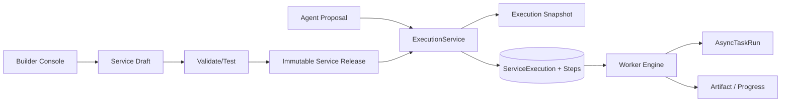

<!-- V1.11 module-split metadata -->
> **文档分档**：`Full`（模板 `design-full.md`）  
> **分档理由**：Service Release、Execution Snapshot、状态生命周期  
> **文档边界**：本文件是该模块唯一详细设计事实源；DB Owner 与接口 Owner 必须落在本模块，不允许在其他模块重复定义。  
> **拆分原则**：仅按可独立评审/编码/验收的一级模块拆分；不按单表/单接口继续碎片化。

# Service 与 Execution 模块需求与设计一体化文档

> **文档编号**: MOD-SVC-V1.11 模块分档拆分版
> **文档版本**: V1.11 模块分档拆分版
> **创建日期**: 2026-09-11
> **文档状态**: 设计基线草案（待仓库 Spec Context 绑定后进入正式评审）
> **模板**: `design-full.md`；生成流程按 `cf-task:align` 的复杂后端/架构模块路径执行。
> **上游基线**: V1.8 完整总体设计 + V6 完整 Playbook + Console V0.8 Final。


**评审边界说明**：
- 第 2 章是需求基线（What），禁止实现阶段自行改变领域语义；
- 第 3-4 章是设计基线（How），DB 与每个接口必须以本文为准；
- `Spec Compliance Matrix` 当前依据设计基线生成，因本轮未提供仓库 `spec-context.yml` 与代码目录，**不得声称已通过 cf-task:align 的 repo Spec Gate**；落码前必须在真实仓库执行 `refresh/catalog/bind`。


## 1. 文档控制

### 1.1 责任人

| 角色 | 姓名 | 职责范围 |
|---|---|---|
| 产品/架构负责人 | 待定 | 需求定义、领域边界、与总设/Playbook 一致性 |
| 开发负责人 | 待定 | 技术方案、DB/API、实现 |
| 测试负责人 | 待定 | S/E/B 场景、E2E Gate |
| 安全/运维 | 待定 | Secret、隔离、发布、监控 |

### 1.2 修订历史

| 版本 | 日期 | 作者 | 变更描述 |
|---|---|---|---|
| V1.11 模块分档拆分版 | 2026-09-11 | ChatGPT / 待项目负责人确认 | 按 cf-task:align + design-full 从最新完整总设/Playbook/交互稿重新生成；细化 DB 与全部接口 |

## 2. 需求分析

### 2.1 需求概述

| 项目 | 内容 |
|---|---|
| 模块名称 | Service 与 Execution |
| 模块ID | MOD-SVC |
| 所属系统/产品线 | Fluxion 通用智能服务执行框架 |
| 需求类型 | 中大型功能 / 架构演进 |
| 业务背景 | Service 是最终用户使用的业务服务，也是唯一正式发布对象；写操作、长任务、需要恢复的流程必须从 Agent Proposal 进入确定性 ExecutionService。 |
| 核心目标 | 完整设计 Service Draft/Release、Execution Snapshot、ServiceExecution/Step/AsyncTask/Command/Progress/Artifact 和全部管理接口。 |

### 2.2 痛点与价值

| 维度 | 内容 |
|---|---|
| 目标用户 | Builder/Admin/End User（经 Agent/Channel）/Worker |
| 当前问题 | 没有稳定发布版本与 durable execution 时，运行中配置漂移、重复副作用、异步任务丢失、/stop 无法统一。 |
| 业务影响 | 服务不可审计、故障难恢复、用户收到“tool success”而非真正业务结果。 |
| 预期价值 | 服务版本确定、任务可恢复、异步/人工/Agent/Capability 步骤统一、结果可追溯。 |

### 2.3 功能方案

#### 2.3.1 功能清单

| 功能ID | 功能名称 | 功能描述 | 优先级 | 来源 |
|---|---|---|---|---|
| FEAT-SVC-01 | Service Draft | 编辑业务目标/主 Agent/执行编排/范围/交付。 | P0 | Builder Journey |
| FEAT-SVC-02 | Validate/Test | 发布前验证与同模型测试。 | P0 | Playbook D05 |
| FEAT-SVC-03 | Publish/Release | 不可变版本与 current release。 | P0 | Playbook A01/A05 |
| FEAT-SVC-04 | Execution | 可信创建与状态根。 | P0 | 总体设计 P4/P6 |
| FEAT-SVC-05 | Step/Async | 同步/异步步骤与外部任务状态。 | P0 | 交互结论 |
| FEAT-SVC-06 | Command/Progress | cancel/retry 与时间线。 | P0 | /stop/运维 |
| FEAT-SVC-07 | Artifact | 大结果与可交付产物。 | P0 | Playbook U04 |

### 2.4 范围与边界

| 类别 | 内容 |
|---|---|
| 范围（In Scope） | ServiceDefinition/Release、ExecutionService、Snapshot、Execution/Step/AsyncTask/Command/Progress/Artifact、列表/详情/取消/重试。 |
| 非范围（Out of Scope） | Worker claim 算法细节（模块06）、Capability Provider 协议（模块07）、Channel 发送协议（模块10）。 |
| 前置假设 | 上游总设、公共 DB/API 规范、外部基础设施可用 |
| 有意妥协 / 技术债 | 无；未来扩展必须有真实旅程驱动 |

### 2.5 验收条件

#### 2.5.1 业务规则与约束

| ID | 类型 | 描述 | 验证场景 |
|---|---|---|---|
| RULE-SVC-01 | 主 Agent | Service.primary_agent_id V1 必填；一个 Agent 可主执行多个 Service。 | S-SVC-01 |
| RULE-SVC-02 | 发布 | 只有 Service 有 Draft/Validate/Test/Publish；Release immutable。 | S-SVC-02 |
| RULE-SVC-03 | 一致性 | Execution 固定 service_release_id + snapshot。 | S-SVC-03 |
| RULE-SVC-04 | 动态安全 | 恢复时重校验 User→AgentAccessGrant、Credential、Capability enabled。 | S-SVC-04 |
| RULE-SVC-05 | 异步 | Async 是 Step execution_mode/AsyncTaskRun，不是 Capability 实现类型/独立菜单。 | S-SVC-05 |
| RULE-SVC-06 | 幂等 | 有副作用 Step 与命令必须有稳定 idempotency_key。 | S-SVC-06 |

#### 2.5.2 功能验收场景

**正常场景**

| 场景ID | 功能ID | 优先级 | 测试层级 | 关键真实边界 | 归属 | 前置条件 | 操作步骤 | 预期结果 |
|---|---|---|---|---|---|---|---|---|
| S-SVC-01 | FEAT-SVC-01 | P0 | E2E | Console→API→PG | 本模块 | Agent 存在 | 创建 Service | primary_agent_id 保存且不可为空 |
| S-SVC-02 | FEAT-SVC-03 | P0 | E2E | Publish→Release→PG | 本模块 | Draft validate 通过 | 发布两次不同 Draft | 生成两个 immutable release，current 指向最新 |
| S-SVC-03 | FEAT-SVC-04 | P0 | E2E | Agent Proposal→ExecutionService→PG | 本模块 | 用户有授权/Service 已发布 | 确认创建任务 | 生成 snapshot/execution/steps 且幂等 |
| S-SVC-04 | FEAT-SVC-05 | P0 | E2E | Worker→Async provider→PG | 后置 → 模块 06/07 | 异步 capability | 提交→等待→轮询完成 | Timeline 显示外部 task 生命周期 |
| S-SVC-05 | FEAT-SVC-06 | P0 | E2E | Cancel API→command→Worker | 后置 → 模块 06 | Execution RUNNING | 用户 /stop | 状态进入 CANCELLING，停止后续步骤 |

**异常场景**

| 场景ID | 功能ID | 测试层级 | 关键真实边界 | 归属 | 触发条件 | 系统行为 | 用户感知 |
|---|---|---|---|---|---|---|---|
| E-SVC-01 | FEAT-SVC-03 | E2E | Validate→Publish | 本模块 | 依赖缺失/草稿 revision 变化 | Publish 409，不创建 Release | Console 显示具体校验项 |
| E-SVC-02 | FEAT-SVC-04 | E2E | Execution resume→Grant | 后置 → 模块 18 | 任务 WAITING 时撤销 Agent 授权 | 恢复 fail closed/进入人工或失败策略 | 不继续写操作 |
| E-SVC-03 | FEAT-SVC-05 | integration | AsyncTaskRun | 本模块 | provider 不支持 cancel | 平台停止后续步骤并记录外部任务不可取消 | 用户可见明确提示 |

**边界场景**

| 场景ID | 测试层级 | 关键真实边界 | 归属 | 字段/条件 | 边界值 | 预期行为 |
|---|---|---|---|---|---|---|
| B-SVC-01 | integration | idempotency | 本模块 | 重复 create_from_proposal | 相同 idempotency_key | 只创建一个 Execution |
| B-SVC-02 | integration | state machine | 本模块 | 终态再次 cancel | SUCCEEDED/FAILED/CANCELLED | 返回 409 或幂等终态，不回退状态 |

#### 2.5.3 非功能指标

| 指标ID | 指标名称 | 目标值 | 测量方法 |
|---|---|---|---|
| NFR-REL-01 | 可靠执行 | 不得因单 Runtime/Worker 进程退出丢失权威状态 | SIGKILL/E2E |
| NFR-SEC-01 | 可信身份 | LLM/客户端不得覆盖 tenant/actor/secret | 安全测试 |
| NFR-OBS-01 | 可追踪 | 关键路径可按 request_id/trace_id/execution_id 定位 | 集成/E2E |

## 3. 技术设计

### 3.1 方案选型

#### 3.1.1 关键决策记录

| 决策点 | 选择 | 被否决项 | 理由 | 可逆性 |
|---|---|---|---|---|
| 发布 | Draft + immutable Release | 所有配置全版本化 | 只对业务服务承担正式发布复杂度 | 难 |
| 可靠边界 | ExecutionService | Agent 直接 Worker | LLM 不可信，需确定性再校验 | 难 |
| 异步模型 | ExecutionStep + AsyncTaskRun | 独立 Async Task 产品/菜单 | 统一 Timeline/取消/恢复 | 中 |

#### 3.1.2 技术栈

| 类别 | 选型 | 版本 | 选型理由 |
|---|---|---|---|
| 语言 | Python | 3.12+（仓库实际版本落码前确认） | 与 Agent/LLM 生态一致 |
| Web/API | FastAPI + Pydantic | 仓库实际版本确认 | 类型契约与异步 IO |
| ORM | SQLAlchemy 2 Async | 仓库实际版本确认 | 异步 PostgreSQL |
| 数据库 | PostgreSQL | 外部部署 | 业务 SoT |

### 3.2 架构设计



#### 3.2.1 模块职责分层

| 层级 | 职责 | 禁止事项 |
|---|---|---|
| Handler/API | 协议解析、DTO、权限入口、统一错误映射 | 业务逻辑/直接 SQL |
| Application Service | 用例编排、事务边界、领域校验 | 依赖具体 Web 框架 |
| Domain | 领域对象/规则 | 基础设施依赖 |
| Repository/Port | 持久化/外部能力抽象 | 泄露 Secret/跨领域修改 |
| Adapter | PostgreSQL/HTTP/MCP 等实现 | 改变领域语义 |

#### 3.2.2 外部依赖清单

| 外部系统/模块 | 依赖类型 | 协议/接口 | 超时/一致性 | 降级策略 |
|---|---|---|---|---|
| Agent/Grant | 动态安全 | DB/Library | 恢复时 current | 无授权 fail closed |
| Worker Engine | 执行 | PG lease | durable | PG polling 自愈 |
| Capability/Skill/Model | 步骤执行 | Library | deadline | 按 step failure policy |
| Object Store | Artifact | Port | 外部 | 不可用时大结果 step 失败/重试 |
| Channel Delivery | 通知 | DeliveryRoute/Internal API | at-least-once + idem | 可重试 |

### 3.3 数据设计

#### 3.3.1 表清单

| 表名 | 职责 | 所有权 |
|---|---|---|
| service_definition | 面向最终用户的业务服务定义；唯一拥有 Draft/Validate/Test/Publish 产品生命周期。 | Service 与 Execution |
| service_release | 发布后的 immutable Service Version；新 Execution 固定引用。 | Service 与 Execution |
| execution_snapshot | Execution 创建时冻结的轻量运行投影；只冻结一致性所需业务逻辑，不冻结实时授权/Credential/紧急禁用。 | Service 与 Execution |
| service_execution | 一次真实 Service 执行实例，是可靠执行的根对象。 | Service 与 Execution |
| execution_step | Execution 内步骤状态；可为 Capability/Agent/Human/Delivery，execution_mode 可同步或异步。 | Service 与 Execution |
| async_task_run | 异步 Capability 的外部任务状态投影；不是 Capability Implementation 类型，也不是一级产品对象。 | Service 与 Execution |
| execution_command | 用户/Admin 对 Execution 发出的 stop/retry/resume 等命令事实，供 Worker 幂等应用。 | Service 与 Execution |
| task_progress_event | Execution 发生了什么的进度事件；与 ChannelDeliveryRoute 分离。 | Service 与 Execution |
| artifact | Execution/Step 产生的可交付或大结果元数据，内容在 Object Store。 | Service 与 Execution |

#### 表 `service_definition`

**职责**：面向最终用户的业务服务定义；唯一拥有 Draft/Validate/Test/Publish 产品生命周期。

| 字段名 | 类型 | 可空 | 默认值 | 索引 | 说明 |
|---|---|---|---|---|---|
| tenant_id | UUID | N |  | IDX | 租户 |
| name | VARCHAR(256) | N |  | IDX | 服务名称 |
| key | VARCHAR(160) | N |  | UK | 稳定标识 |
| description | TEXT | N |  |  | 服务说明 |
| primary_agent_id | UUID | N |  | FK,IDX | V1 必须绑定一个主执行 Agent |
| execution_type | VARCHAR(32) | N | HYBRID |  | AGENTIC/DETERMINISTIC/HYBRID |
| draft_payload | JSONB | N | {} |  | 当前草稿完整定义 |
| draft_revision | BIGINT | N | 1 |  | 草稿乐观并发 |
| current_release_id | UUID | Y |  | FK | 当前发布版本 |
| enabled | BOOLEAN | N | TRUE | IDX | 是否允许新执行 |
| id | UUID | N | gen_random_uuid() | PK | 主键 |
| is_deleted | BOOLEAN | N | FALSE | IDX | 软删除标记；默认查询必须过滤 FALSE |
| create_time | TIMESTAMPTZ | N | CURRENT_TIMESTAMP |  | 创建时间 |
| update_time | TIMESTAMPTZ | N | CURRENT_TIMESTAMP |  | 更新时间；不可变表除外 |

**约束**

- UNIQUE (tenant_id,key) WHERE is_deleted=false
- primary_agent_id NOT NULL
- draft_payload 与 published payload 分离

**索引设计**

| 索引名 | 类型 | 字段 | 使用场景 |
|---|---|---|---|
| uk_service_definition_key | UNIQUE | tenant_id,key | 稳定引用 |
| idx_service_primary_agent | BTREE | tenant_id,primary_agent_id,is_deleted | Agent→Service |
| idx_service_status | BTREE | tenant_id,enabled,current_release_id,is_deleted | 服务列表 |

#### 表 `service_release`

**职责**：发布后的 immutable Service Version；新 Execution 固定引用。

| 字段名 | 类型 | 可空 | 默认值 | 索引 | 说明 |
|---|---|---|---|---|---|
| tenant_id | UUID | N |  | IDX | 租户 |
| service_id | UUID | N |  | FK,IDX | 所属 Service |
| release_no | VARCHAR(64) | N |  |  | v1/v2 或递增版本号 |
| content_hash | VARCHAR(128) | N |  | UK | 规范化 payload hash |
| published_payload | JSONB | N | {} |  | 完整发布定义，含主 Agent/步骤/输入输出/确认等引用 |
| published_by | UUID | N |  |  | 发布者 |
| published_at | TIMESTAMPTZ | N | CURRENT_TIMESTAMP | IDX | 发布时间 |
| id | UUID | N | gen_random_uuid() | PK | 主键 |
| is_deleted | BOOLEAN | N | FALSE | IDX | 软删除标记；默认查询必须过滤 FALSE |
| create_time | TIMESTAMPTZ | N | CURRENT_TIMESTAMP |  | 创建时间 |

**约束**

- UNIQUE (tenant_id,service_id,release_no)
- UNIQUE (tenant_id,content_hash)
- 发布后禁止 UPDATE published_payload

**索引设计**

| 索引名 | 类型 | 字段 | 使用场景 |
|---|---|---|---|
| uk_service_release_no | UNIQUE | tenant_id,service_id,release_no | 版本 |
| idx_service_release_time | BTREE | tenant_id,service_id,published_at DESC | 版本历史 |

**不可变约束**：创建后禁止业务 UPDATE/DELETE；如需演进创建新记录并更新上层 current 指针。

#### 表 `execution_snapshot`

**职责**：Execution 创建时冻结的轻量运行投影；只冻结一致性所需业务逻辑，不冻结实时授权/Credential/紧急禁用。

| 字段名 | 类型 | 可空 | 默认值 | 索引 | 说明 |
|---|---|---|---|---|---|
| tenant_id | UUID | N |  | IDX | 租户 |
| service_release_id | UUID | N |  | FK,IDX | 服务发布版本 |
| content_hash | VARCHAR(128) | N |  | UK | 快照 hash |
| snapshot_json | JSONB | N | {} |  | 冻结的步骤/合同引用/提示词等 |
| snapshot_ref | VARCHAR(1024) | Y |  |  | 超大快照可外置 Object Store |
| id | UUID | N | gen_random_uuid() | PK | 主键 |
| is_deleted | BOOLEAN | N | FALSE | IDX | 软删除标记；默认查询必须过滤 FALSE |
| create_time | TIMESTAMPTZ | N | CURRENT_TIMESTAMP |  | 创建时间 |

**约束**

- 禁止包含明文 Secret/Credential
- UNIQUE (tenant_id,content_hash)

**索引设计**

| 索引名 | 类型 | 字段 | 使用场景 |
|---|---|---|---|
| uk_execution_snapshot_hash | UNIQUE | tenant_id,content_hash | 去重/一致性 |

**不可变约束**：创建后禁止业务 UPDATE/DELETE；如需演进创建新记录并更新上层 current 指针。

#### 表 `service_execution`

**职责**：一次真实 Service 执行实例，是可靠执行的根对象。

| 字段名 | 类型 | 可空 | 默认值 | 索引 | 说明 |
|---|---|---|---|---|---|
| tenant_id | UUID | N |  | IDX | 租户 |
| service_id | UUID | N |  | FK,IDX | ServiceDefinition |
| service_release_id | UUID | N |  | FK,IDX | 固定 Release |
| actor_user_id | UUID | N |  | FK,IDX | 发起 PlatformUser |
| primary_agent_id | UUID | N |  | FK | 启动时主 Agent 引用 |
| conversation_id | UUID | Y |  | FK,IDX | 来源 Conversation |
| delivery_route_id | UUID | Y |  | FK | 主动投递路由 |
| snapshot_id | UUID | N |  | FK | ExecutionSnapshot |
| workspace_id | UUID | Y |  | FK | 受控 Workspace |
| resource_scope_json | JSONB | N | {} |  | 业务资源范围 |
| input_json | JSONB | N | {} |  | 经 Schema 校验的输入 |
| execution_mode | VARCHAR(16) | N | ASYNC |  | SYNC/ASYNC |
| status | VARCHAR(32) | N | PENDING | IDX | PENDING/RUNNING/WAITING/CANCELLING/SUCCEEDED/FAILED/CANCELLED |
| current_step | INTEGER | N | 0 |  | 当前步骤序号 |
| next_run_at | TIMESTAMPTZ | Y |  | IDX | 可再次 claim 时间 |
| lease_owner | VARCHAR(256) | Y |  | IDX | Worker owner |
| lease_expires_at | TIMESTAMPTZ | Y |  | IDX | lease 到期 |
| attempt | INTEGER | N | 0 |  | Execution claim/恢复计数 |
| max_attempts | INTEGER | N | 10 |  | 安全上限 |
| idempotency_key | VARCHAR(256) | N |  | UK | 提交幂等键 |
| trace_id | VARCHAR(128) | N |  | IDX | 全链路 Trace |
| cancel_requested_at | TIMESTAMPTZ | Y |  |  | 取消请求时间 |
| result_ref | VARCHAR(1024) | Y |  |  | 最终结果/Artifact ref |
| error_code | VARCHAR(128) | Y |  | IDX | 终态错误码 |
| error_message | TEXT | Y |  |  | 脱敏错误摘要 |
| started_at | TIMESTAMPTZ | Y |  |  | 开始时间 |
| finished_at | TIMESTAMPTZ | Y |  |  | 终止时间 |
| id | UUID | N | gen_random_uuid() | PK | 主键 |
| is_deleted | BOOLEAN | N | FALSE | IDX | 软删除标记；默认查询必须过滤 FALSE |
| create_time | TIMESTAMPTZ | N | CURRENT_TIMESTAMP |  | 创建时间 |
| update_time | TIMESTAMPTZ | N | CURRENT_TIMESTAMP |  | 更新时间；不可变表除外 |

**约束**

- UNIQUE (tenant_id,idempotency_key)
- 终态不可回到非终态
- lease_owner/lease_expires_at 仅 Worker 管理
- 创建/恢复时动态重校验 AgentAccessGrant/Credential/Capability enabled

**索引设计**

| 索引名 | 类型 | 字段 | 使用场景 |
|---|---|---|---|
| uk_service_execution_idem | UNIQUE | tenant_id,idempotency_key | 防重复提交 |
| idx_service_execution_claim | BTREE | tenant_id,status,next_run_at,lease_expires_at,is_deleted | Worker claim |
| idx_service_execution_user | BTREE | tenant_id,actor_user_id,create_time DESC | 用户执行历史 |
| idx_service_execution_trace | BTREE | tenant_id,trace_id | 追踪 |

#### 表 `execution_step`

**职责**：Execution 内步骤状态；可为 Capability/Agent/Human/Delivery，execution_mode 可同步或异步。

| 字段名 | 类型 | 可空 | 默认值 | 索引 | 说明 |
|---|---|---|---|---|---|
| tenant_id | UUID | N |  | IDX | 租户 |
| execution_id | UUID | N |  | FK,IDX | Execution |
| step_key | VARCHAR(160) | N |  |  | 步骤稳定 key |
| sequence_no | INTEGER | N |  | IDX | 顺序 |
| step_type | VARCHAR(32) | N |  | IDX | CAPABILITY/AGENT/HUMAN/DELIVERY |
| execution_mode | VARCHAR(16) | N | SYNC |  | SYNC/ASYNC |
| status | VARCHAR(32) | N | PENDING | IDX | PENDING/RUNNING/WAITING/SUCCEEDED/FAILED/CANCELLED/SKIPPED |
| attempt | INTEGER | N | 0 |  | 步骤重试计数 |
| idempotency_key | VARCHAR(256) | Y |  | UK | 有副作用步骤幂等键 |
| input_json | JSONB | N | {} |  | 步骤输入快照 |
| output_json | JSONB | N | {} |  | 小结果；大结果用 result_ref |
| result_ref | VARCHAR(1024) | Y |  |  | Artifact/Object ref |
| wait_until | TIMESTAMPTZ | Y |  | IDX | 等待截止/轮询时间 |
| error_code | VARCHAR(128) | Y |  | IDX | 错误码 |
| error_detail_ref | VARCHAR(1024) | Y |  |  | 大错误详情/外部响应脱敏引用 |
| started_at | TIMESTAMPTZ | Y |  |  | 开始 |
| finished_at | TIMESTAMPTZ | Y |  |  | 结束 |
| id | UUID | N | gen_random_uuid() | PK | 主键 |
| is_deleted | BOOLEAN | N | FALSE | IDX | 软删除标记；默认查询必须过滤 FALSE |
| create_time | TIMESTAMPTZ | N | CURRENT_TIMESTAMP |  | 创建时间 |
| update_time | TIMESTAMPTZ | N | CURRENT_TIMESTAMP |  | 更新时间；不可变表除外 |

**约束**

- UNIQUE (tenant_id,execution_id,step_key)
- 有副作用步骤必须使用稳定 idempotency_key
- 大 payload 不长期写 DB

**索引设计**

| 索引名 | 类型 | 字段 | 使用场景 |
|---|---|---|---|
| uk_execution_step_key | UNIQUE | tenant_id,execution_id,step_key | 步骤唯一 |
| idx_execution_step_timeline | BTREE | tenant_id,execution_id,sequence_no | Timeline |
| idx_execution_step_wait | BTREE | tenant_id,status,wait_until,is_deleted | WAIT 恢复 |

#### 表 `async_task_run`

**职责**：异步 Capability 的外部任务状态投影；不是 Capability Implementation 类型，也不是一级产品对象。

| 字段名 | 类型 | 可空 | 默认值 | 索引 | 说明 |
|---|---|---|---|---|---|
| tenant_id | UUID | N |  | IDX | 租户 |
| execution_step_id | UUID | N |  | FK,UK | 所属 Step |
| provider_type | VARCHAR(64) | N |  |  | 外部任务提供者 |
| external_task_id | VARCHAR(256) | N |  | IDX | 外部 task ID |
| status | VARCHAR(32) | N | SUBMITTED | IDX | SUBMITTED/RUNNING/SUCCEEDED/FAILED/CANCELLED |
| next_poll_at | TIMESTAMPTZ | Y |  | IDX | 下一次轮询 |
| poll_attempts | INTEGER | N | 0 |  | 轮询次数 |
| cancel_supported | BOOLEAN | N | FALSE |  | 是否支持取消 |
| result_ref | VARCHAR(1024) | Y |  |  | 最终结果引用 |
| error_code | VARCHAR(128) | Y |  |  | 错误码 |
| submitted_at | TIMESTAMPTZ | N | CURRENT_TIMESTAMP |  | 提交时间 |
| completed_at | TIMESTAMPTZ | Y |  |  | 完成时间 |
| id | UUID | N | gen_random_uuid() | PK | 主键 |
| is_deleted | BOOLEAN | N | FALSE | IDX | 软删除标记；默认查询必须过滤 FALSE |
| create_time | TIMESTAMPTZ | N | CURRENT_TIMESTAMP |  | 创建时间 |
| update_time | TIMESTAMPTZ | N | CURRENT_TIMESTAMP |  | 更新时间；不可变表除外 |

**约束**

- UNIQUE (tenant_id,execution_step_id)
- 外部 task ID 不由 LLM 直接提供；必须来自 Provider 返回

**索引设计**

| 索引名 | 类型 | 字段 | 使用场景 |
|---|---|---|---|
| uk_async_task_step | UNIQUE | tenant_id,execution_step_id | 1 Step 0/1 async run |
| idx_async_task_poll | BTREE | tenant_id,status,next_poll_at,is_deleted | Worker polling |

#### 表 `execution_command`

**职责**：用户/Admin 对 Execution 发出的 stop/retry/resume 等命令事实，供 Worker 幂等应用。

| 字段名 | 类型 | 可空 | 默认值 | 索引 | 说明 |
|---|---|---|---|---|---|
| tenant_id | UUID | N |  | IDX | 租户 |
| execution_id | UUID | N |  | FK,IDX | Execution |
| actor_user_id | UUID | N |  | FK | 命令发起者 |
| command_type | VARCHAR(32) | N |  | IDX | CANCEL/RETRY/RESUME |
| payload_json | JSONB | N | {} |  | 命令参数 |
| status | VARCHAR(32) | N | PENDING | IDX | PENDING/APPLIED/REJECTED |
| idempotency_key | VARCHAR(256) | N |  | UK | 命令幂等 |
| applied_at | TIMESTAMPTZ | Y |  |  | Worker 应用时间 |
| id | UUID | N | gen_random_uuid() | PK | 主键 |
| is_deleted | BOOLEAN | N | FALSE | IDX | 软删除标记；默认查询必须过滤 FALSE |
| create_time | TIMESTAMPTZ | N | CURRENT_TIMESTAMP |  | 创建时间 |
| update_time | TIMESTAMPTZ | N | CURRENT_TIMESTAMP |  | 更新时间；不可变表除外 |

**约束**

- UNIQUE (tenant_id,idempotency_key)

**索引设计**

| 索引名 | 类型 | 字段 | 使用场景 |
|---|---|---|---|
| uk_execution_command_idem | UNIQUE | tenant_id,idempotency_key | 防重复命令 |
| idx_execution_command_pending | BTREE | tenant_id,execution_id,status,create_time | Worker 查询 |

#### 表 `task_progress_event`

**职责**：Execution 发生了什么的进度事件；与 ChannelDeliveryRoute 分离。

| 字段名 | 类型 | 可空 | 默认值 | 索引 | 说明 |
|---|---|---|---|---|---|
| tenant_id | UUID | N |  | IDX | 租户 |
| execution_id | UUID | N |  | FK,IDX | Execution |
| event_type | VARCHAR(64) | N |  | IDX | STAGE/PROGRESS/WAIT/ERROR/COMPLETE |
| stage | VARCHAR(160) | Y |  |  | 业务阶段 |
| progress | NUMERIC(5,2) | Y |  |  | 0-100；仅可解释场景使用 |
| message | TEXT | N |  |  | 用户可读/运维摘要 |
| visibility | VARCHAR(16) | N | USER | IDX | USER/ADMIN/INTERNAL |
| occurred_at | TIMESTAMPTZ | N | CURRENT_TIMESTAMP | IDX | 事件时间 |
| id | UUID | N | gen_random_uuid() | PK | 主键 |
| is_deleted | BOOLEAN | N | FALSE | IDX | 软删除标记；默认查询必须过滤 FALSE |
| create_time | TIMESTAMPTZ | N | CURRENT_TIMESTAMP |  | 创建时间 |

**索引设计**

| 索引名 | 类型 | 字段 | 使用场景 |
|---|---|---|---|
| idx_progress_execution_time | BTREE | tenant_id,execution_id,occurred_at | Timeline/投递 |

**不可变约束**：创建后禁止业务 UPDATE/DELETE；如需演进创建新记录并更新上层 current 指针。

#### 表 `artifact`

**职责**：Execution/Step 产生的可交付或大结果元数据，内容在 Object Store。

| 字段名 | 类型 | 可空 | 默认值 | 索引 | 说明 |
|---|---|---|---|---|---|
| tenant_id | UUID | N |  | IDX | 租户 |
| execution_id | UUID | Y |  | FK,IDX | Execution |
| execution_step_id | UUID | Y |  | FK | Step |
| artifact_type | VARCHAR(64) | N |  | IDX | REPORT/DATASET/JSON/FILE/... |
| name | VARCHAR(512) | N |  |  | 展示名 |
| object_ref | VARCHAR(1024) | N |  |  | Object Store 引用 |
| checksum | VARCHAR(128) | N |  |  | 完整性 |
| content_type | VARCHAR(256) | N |  |  | MIME |
| size_bytes | BIGINT | N | 0 |  | 大小 |
| created_by | VARCHAR(64) | N | SYSTEM |  | USER/SYSTEM/STEP |
| id | UUID | N | gen_random_uuid() | PK | 主键 |
| is_deleted | BOOLEAN | N | FALSE | IDX | 软删除标记；默认查询必须过滤 FALSE |
| create_time | TIMESTAMPTZ | N | CURRENT_TIMESTAMP |  | 创建时间 |

**索引设计**

| 索引名 | 类型 | 字段 | 使用场景 |
|---|---|---|---|
| idx_artifact_execution | BTREE | tenant_id,execution_id,create_time | 结果列表 |

**不可变约束**：创建后禁止业务 UPDATE/DELETE；如需演进创建新记录并更新上层 current 指针。

#### 3.3.2 ER 图

```mermaid
erDiagram
    SERVICE_DEFINITION {
      UUID tenant_id FK
      VARCHAR_256_ name
      VARCHAR_160_ key
      TEXT description
      UUID primary_agent_id FK
      VARCHAR_32_ execution_type
    }
    SERVICE_RELEASE {
      UUID tenant_id FK
      UUID service_id FK
      VARCHAR_64_ release_no
      VARCHAR_128_ content_hash
      JSONB published_payload
      UUID published_by
    }
    EXECUTION_SNAPSHOT {
      UUID tenant_id FK
      UUID service_release_id FK
      VARCHAR_128_ content_hash
      JSONB snapshot_json
      VARCHAR_1024_ snapshot_ref
    }
    SERVICE_EXECUTION {
      UUID tenant_id FK
      UUID service_id FK
      UUID service_release_id FK
      UUID actor_user_id FK
      UUID primary_agent_id FK
      UUID conversation_id FK
    }
    EXECUTION_STEP {
      UUID tenant_id FK
      UUID execution_id FK
      VARCHAR_160_ step_key
      INTEGER sequence_no
      VARCHAR_32_ step_type
      VARCHAR_16_ execution_mode
    }
    ASYNC_TASK_RUN {
      UUID tenant_id FK
      UUID execution_step_id FK
      VARCHAR_64_ provider_type
      VARCHAR_256_ external_task_id FK
      VARCHAR_32_ status
      TIMESTAMPTZ next_poll_at
    }
    EXECUTION_COMMAND {
      UUID tenant_id FK
      UUID execution_id FK
      UUID actor_user_id FK
      VARCHAR_32_ command_type
      JSONB payload_json
      VARCHAR_32_ status
    }
    TASK_PROGRESS_EVENT {
      UUID tenant_id FK
      UUID execution_id FK
      VARCHAR_64_ event_type
      VARCHAR_160_ stage
      NUMERIC_5_2_ progress
      TEXT message
    }
    ARTIFACT {
      UUID tenant_id FK
      UUID execution_id FK
      UUID execution_step_id FK
      VARCHAR_64_ artifact_type
      VARCHAR_512_ name
      VARCHAR_1024_ object_ref
    }
```



#### 3.3.3 数据一致性与软删除规则

- 所有 Framework 自建可变表使用 `is_deleted/create_time/update_time`；查询默认过滤 `is_deleted=false`。
- FK 只引用同一租户可见对象；跨租户引用必须在 Application Service 拒绝。
- Secret/Token/Password 不落业务表明文，只保存 `secret_ref/credential_ref`。
- 不可变 Release/Snapshot/Artifact 使用 append-only；需要更新时新建记录。
- `revision` 用于 direct-effect 配置的乐观并发和审计，不等同于发布版本。

### 3.4 接口设计

#### 3.4.1 接口清单

| 接口ID | 名称 | 形态 | 方法/签名 | 路径/用途 |
|---|---|---|---|---|
| SVC-API-01 | Service 列表 | HTTP | GET | /api/v1/services |
| SVC-API-02 | 创建 Service | HTTP | POST | /api/v1/services |
| SVC-API-03 | Service 详情 | HTTP | GET | /api/v1/services/{service_id} |
| SVC-API-04 | 保存 Service Draft | HTTP | PUT | /api/v1/services/{service_id}/draft |
| SVC-API-05 | 校验 Service Draft | HTTP | POST | /api/v1/services/{service_id}/validate |
| SVC-API-06 | 测试 Service Draft | HTTP | POST | /api/v1/services/{service_id}/test |
| SVC-API-07 | 发布 Service | HTTP | POST | /api/v1/services/{service_id}/publish |
| SVC-API-08 | Release 列表 | HTTP | GET | /api/v1/services/{service_id}/releases |
| SVC-API-09 | Release 详情 | HTTP | GET | /api/v1/services/{service_id}/releases/{release_id} |
| EXE-API-01 | Execution 列表 | HTTP | GET | /api/v1/executions |
| EXE-API-02 | Execution 详情/Timeline | HTTP | GET | /api/v1/executions/{execution_id} |
| EXE-API-03 | 取消 Execution | HTTP | POST | /api/v1/executions/{execution_id}/cancel |
| EXE-API-04 | 重试失败 Execution | HTTP | POST | /api/v1/executions/{execution_id}/retry |
| EXE-LIB-01 | 从 Proposal 创建可信执行 | Library | async def create_from_proposal(ctx: TrustedExecutionContext, proposal: ExecutionProposal, *, idempotency_key: str) -> ServiceExecution |  |

#### SVC-API-01: Service 列表

**入口类型**：HTTP

**契约**：`GET /api/v1/services`

**认证/授权**：None

**Query 参数**

| 参数 | 类型 | 必填 | 说明 |
|---|---|---|---|
| page | integer | N | 页码，从 1 开始；默认 1 |
| page_size | integer | N | 每页条数；默认 20，最大 100 |
| keyword | string | N | name/key |
| execution_type | string | N | AGENTIC/DETERMINISTIC/HYBRID |
| enabled | boolean | N | 状态 |
| draft_state | string | N | 是否有未发布修改 |

**请求体**：无。

**响应 data**

| 字段 | 类型 | 说明 |
|---|---|---|
| items | array<ServiceSummary> | primary_agent/current_release/draft_state/status |
| total | integer | 总数 |

**响应示例**

```json
{
  "code": 0,
  "message": "success",
  "data": {
    "items": [],
    "total": 1
  },
  "request_id": "req_xxx"
}
```

**错误码**

仅使用公共错误码。

**处理逻辑**

```text
service_definition JOIN agent/current_release；draft_state 由 draft payload hash 与 current release source hash 比较计算。
```

#### SVC-API-02: 创建 Service

**入口类型**：HTTP

**契约**：`POST /api/v1/services`

**认证/授权**：None

**请求体**

| 参数 | 类型 | 必填 | 说明 |
|---|---|---|---|
| name | string | Y | 名称 |
| key | string | Y | 稳定 Key |
| description | string | Y | 说明 |
| primary_agent_id | uuid | Y | V1 必填 |
| execution_type | string | Y | AGENTIC/DETERMINISTIC/HYBRID |

**请求示例**

```json
{
  "name": "<name>",
  "key": "<key>",
  "description": "<description>",
  "primary_agent_id": "<primary_agent_id>",
  "execution_type": "<execution_type>"
}
```

**响应 data**

| 字段 | 类型 | 说明 |
|---|---|---|
| id | uuid | Service ID |
| draft_revision | integer | 1 |
| published | boolean | false |

**响应示例**

```json
{
  "code": 0,
  "message": "success",
  "data": {
    "id": "<id>",
    "draft_revision": 1,
    "published": true
  },
  "request_id": "req_xxx"
}
```

**错误码**

| 错误码 | 场景 | HTTP 状态 |
|---|---|---|
| SERVICE_KEY_EXISTS | key 重复 | 409 |
| PRIMARY_AGENT_REQUIRED | 主 Agent 必填 | 400 |
| AGENT_NOT_FOUND | Agent 无效 | 400 |

**处理逻辑**

```text
校验 primary agent → 生成最小 draft_payload → INSERT service_definition；不自动 publish。
```

#### SVC-API-03: Service 详情

**入口类型**：HTTP

**契约**：`GET /api/v1/services/{service_id}`

**认证/授权**：None

**请求体**：无。

**响应 data**

| 字段 | 类型 | 说明 |
|---|---|---|
| definition | object | 基本信息 |
| draft | object | 当前 draft payload/revision |
| current_release | object | 可空 |
| validation_summary | object | 最近校验摘要 |

**响应示例**

```json
{
  "code": 0,
  "message": "success",
  "data": {
    "definition": {},
    "draft": {},
    "current_release": {},
    "validation_summary": {}
  },
  "request_id": "req_xxx"
}
```

**错误码**

| 错误码 | 场景 | HTTP 状态 |
|---|---|---|
| SERVICE_NOT_FOUND | 不存在 | 404 |

**处理逻辑**

```text
读取 definition/current release；只读详情可展示 draft 与 release 差异摘要。
```

#### SVC-API-04: 保存 Service Draft

**入口类型**：HTTP

**契约**：`PUT /api/v1/services/{service_id}/draft`

**认证/授权**：None

**请求体**

| 参数 | 类型 | 必填 | 说明 |
|---|---|---|---|
| draft_payload | object | Y | 完整草稿：steps/scope/input/deliverable/confirmation 等 |
| draft_revision | integer | Y | 乐观锁 |

**请求示例**

```json
{
  "draft_payload": {},
  "draft_revision": 1
}
```

**响应 data**

| 字段 | 类型 | 说明 |
|---|---|---|
| draft_revision | integer | 新 revision |
| draft_hash | string | 规范化 hash |

**响应示例**

```json
{
  "code": 0,
  "message": "success",
  "data": {
    "draft_revision": 1,
    "draft_hash": "<draft_hash>"
  },
  "request_id": "req_xxx"
}
```

**错误码**

| 错误码 | 场景 | HTTP 状态 |
|---|---|---|
| SERVICE_NOT_FOUND | 不存在 | 404 |
| DRAFT_REVISION_CONFLICT | 并发冲突 | 409 |
| DRAFT_SCHEMA_INVALID | 草稿结构非法 | 400 |

**处理逻辑**

```text
校验 payload 内 primary_agent/steps/resource scope schema 结构 → UPDATE draft_payload/revision → audit；不改变 current_release。
```

#### SVC-API-05: 校验 Service Draft

**入口类型**：HTTP

**契约**：`POST /api/v1/services/{service_id}/validate`

**认证/授权**：None

**请求体**：无。

**响应 data**

| 字段 | 类型 | 说明 |
|---|---|---|
| valid | boolean | 是否通过 |
| errors | array<ValidationIssue> | 错误 |
| warnings | array<ValidationIssue> | 警告 |
| dependency_snapshot | object | Agent/Capability/Skill 当前可用性摘要 |

**响应示例**

```json
{
  "code": 0,
  "message": "success",
  "data": {
    "valid": true,
    "errors": [],
    "warnings": [],
    "dependency_snapshot": {}
  },
  "request_id": "req_xxx"
}
```

**错误码**

| 错误码 | 场景 | HTTP 状态 |
|---|---|---|
| SERVICE_NOT_FOUND | 不存在 | 404 |

**处理逻辑**

```text
静态验证 Draft Schema → primary agent → step refs → capability contracts → skill current artifacts → scope schema → confirmation/idempotency 要求；只读，不发布。
```

#### SVC-API-06: 测试 Service Draft

**入口类型**：HTTP

**契约**：`POST /api/v1/services/{service_id}/test`

**认证/授权**：None

**请求体**

| 参数 | 类型 | 必填 | 说明 |
|---|---|---|---|
| test_user_id | uuid | Y | 测试用户 |
| input | object | Y | 测试输入 |
| resource_scope | object | N | 测试范围 |
| mode | string | N | DRY_RUN/REAL_TEST；默认 DRY_RUN |

**请求示例**

```json
{
  "test_user_id": "<test_user_id>",
  "input": {},
  "resource_scope": {},
  "mode": "<mode>"
}
```

**响应 data**

| 字段 | 类型 | 说明 |
|---|---|---|
| test_execution_id | uuid | 测试执行 ID |
| status | string | 状态 |
| trace_id | string | Trace |

**响应示例**

```json
{
  "code": 0,
  "message": "success",
  "data": {
    "test_execution_id": "<test_execution_id>",
    "status": "<status>",
    "trace_id": "<trace_id>"
  },
  "request_id": "req_xxx"
}
```

**错误码**

| 错误码 | 场景 | HTTP 状态 |
|---|---|---|
| SERVICE_VALIDATION_FAILED | Draft 未通过验证 | 409 |
| TEST_USER_ACCESS_INVALID | 测试用户/范围无效 | 403 |

**处理逻辑**

```text
构造 test-only Execution Proposal → 复用 ExecutionService/Worker 模型；REAL_TEST 必须限制测试环境和范围；不发布给正式用户。
```

#### SVC-API-07: 发布 Service

**入口类型**：HTTP

**契约**：`POST /api/v1/services/{service_id}/publish`

**认证/授权**：None

**请求体**

| 参数 | 类型 | 必填 | 说明 |
|---|---|---|---|
| expected_draft_revision | integer | Y | 待发布草稿 revision |
| release_note | string | N | 说明 |

**请求示例**

```json
{
  "expected_draft_revision": 1,
  "release_note": "<release_note>"
}
```

**响应 data**

| 字段 | 类型 | 说明 |
|---|---|---|
| release_id | uuid | 新 Release |
| release_no | string | 版本 |
| content_hash | string | hash |
| published_at | datetime | 时间 |

**响应示例**

```json
{
  "code": 0,
  "message": "success",
  "data": {
    "release_id": "<release_id>",
    "release_no": "<release_no>",
    "content_hash": "<content_hash>",
    "published_at": "2026-09-11 10:00:00"
  },
  "request_id": "req_xxx"
}
```

**错误码**

| 错误码 | 场景 | HTTP 状态 |
|---|---|---|
| SERVICE_VALIDATION_FAILED | 校验失败 | 409 |
| DRAFT_REVISION_CONFLICT | 草稿已变化 | 409 |
| DEPENDENCY_UNAVAILABLE | 关键依赖不可用 | 409 |

**处理逻辑**

```text
锁定 service row → 校验 expected revision → 再次 validate → 规范化 draft → INSERT immutable service_release → UPDATE current_release_id → audit；运行中 execution 不漂移。
```

**一致性/幂等**：发布事务保证 release 与 current pointer 原子。

#### SVC-API-08: Release 列表

**入口类型**：HTTP

**契约**：`GET /api/v1/services/{service_id}/releases`

**认证/授权**：None

**Query 参数**

| 参数 | 类型 | 必填 | 说明 |
|---|---|---|---|
| page | integer | N | 页码，从 1 开始；默认 1 |
| page_size | integer | N | 每页条数；默认 20，最大 100 |

**请求体**：无。

**响应 data**

| 字段 | 类型 | 说明 |
|---|---|---|
| items | array<ServiceReleaseSummary> | release_no/hash/publisher/time/current |
| total | integer | 总数 |

**响应示例**

```json
{
  "code": 0,
  "message": "success",
  "data": {
    "items": [],
    "total": 1
  },
  "request_id": "req_xxx"
}
```

**错误码**

仅使用公共错误码。

**处理逻辑**

```text
按 published_at DESC 分页。
```

#### SVC-API-09: Release 详情

**入口类型**：HTTP

**契约**：`GET /api/v1/services/{service_id}/releases/{release_id}`

**认证/授权**：None

**请求体**：无。

**响应 data**

| 字段 | 类型 | 说明 |
|---|---|---|
| release | object | immutable published payload |
| content_hash | string | hash |

**响应示例**

```json
{
  "code": 0,
  "message": "success",
  "data": {
    "release": {},
    "content_hash": "<content_hash>"
  },
  "request_id": "req_xxx"
}
```

**错误码**

| 错误码 | 场景 | HTTP 状态 |
|---|---|---|
| SERVICE_RELEASE_NOT_FOUND | 不存在 | 404 |

**处理逻辑**

```text
只读 immutable release。
```

#### EXE-API-01: Execution 列表

**入口类型**：HTTP

**契约**：`GET /api/v1/executions`

**认证/授权**：None

**Query 参数**

| 参数 | 类型 | 必填 | 说明 |
|---|---|---|---|
| page | integer | N | 页码，从 1 开始；默认 1 |
| page_size | integer | N | 每页条数；默认 20，最大 100 |
| service_id | uuid | N | 服务 |
| user_id | uuid | N | 发起用户 |
| status | string | N | 状态 |
| execution_mode | string | N | SYNC/ASYNC |
| from | datetime | N | 开始时间 |
| to | datetime | N | 结束时间 |

**请求体**：无。

**响应 data**

| 字段 | 类型 | 说明 |
|---|---|---|
| items | array<ExecutionSummary> | id/service/release/user/channel/mode/stage/status/times |
| total | integer | 总数 |

**响应示例**

```json
{
  "code": 0,
  "message": "success",
  "data": {
    "items": [],
    "total": 1
  },
  "request_id": "req_xxx"
}
```

**错误码**

仅使用公共错误码。

**处理逻辑**

```text
Admin/Builder 权限范围 → 命中 service_execution 组合索引/时间窗口 → 批量关联摘要。
```

#### EXE-API-02: Execution 详情/Timeline

**入口类型**：HTTP

**契约**：`GET /api/v1/executions/{execution_id}`

**认证/授权**：None

**请求体**：无。

**响应 data**

| 字段 | 类型 | 说明 |
|---|---|---|
| execution | object | 根状态 |
| steps | array<ExecutionStepView> | 步骤 |
| async_tasks | array<AsyncTaskView> | 步骤异步任务 |
| progress_events | array<ProgressEvent> | 时间线 |
| artifacts | array<ArtifactSummary> | 结果 |
| commands | array<CommandSummary> | stop/retry |

**响应示例**

```json
{
  "code": 0,
  "message": "success",
  "data": {
    "execution": {},
    "steps": [],
    "async_tasks": [],
    "progress_events": [],
    "artifacts": [],
    "commands": []
  },
  "request_id": "req_xxx"
}
```

**错误码**

| 错误码 | 场景 | HTTP 状态 |
|---|---|---|
| EXECUTION_NOT_FOUND | 不存在/无权限 | 404 |

**处理逻辑**

```text
tenant scoped execution → 一次批量加载 steps/tasks/events/artifacts/commands → 按 timeline 排序。
```

#### EXE-API-03: 取消 Execution

**入口类型**：HTTP

**契约**：`POST /api/v1/executions/{execution_id}/cancel`

**认证/授权**：None

**请求体**

| 参数 | 类型 | 必填 | 说明 |
|---|---|---|---|
| reason | string | N | 取消原因 |
| idempotency_key | string | Y | 命令幂等键 |

**请求示例**

```json
{
  "reason": "<reason>",
  "idempotency_key": "<idempotency_key>"
}
```

**响应 data**

| 字段 | 类型 | 说明 |
|---|---|---|
| command_id | uuid | 命令 ID |
| execution_status | string | CANCELLING 或终态 |

**响应示例**

```json
{
  "code": 0,
  "message": "success",
  "data": {
    "command_id": "<command_id>",
    "execution_status": "<execution_status>"
  },
  "request_id": "req_xxx"
}
```

**错误码**

| 错误码 | 场景 | HTTP 状态 |
|---|---|---|
| EXECUTION_TERMINAL | 已终态，无需取消 | 409 |
| EXECUTION_ACCESS_DENIED | 非本人/无管理权限 | 403 |

**处理逻辑**

```text
校验权限 → INSERT execution_command(CANCEL) 幂等 → 原子标记 cancel_requested_at/status=CANCELLING（允许的状态）→ wake worker；如 async provider 支持 cancel 由 Worker 执行。
```

**一致性/幂等**：相同 idempotency_key 返回同 command。

#### EXE-API-04: 重试失败 Execution

**入口类型**：HTTP

**契约**：`POST /api/v1/executions/{execution_id}/retry`

**认证/授权**：None

**请求体**

| 参数 | 类型 | 必填 | 说明 |
|---|---|---|---|
| from_step | string | N | 默认从可安全重试点 |
| idempotency_key | string | Y | 幂等键 |

**请求示例**

```json
{
  "from_step": "<from_step>",
  "idempotency_key": "<idempotency_key>"
}
```

**响应 data**

| 字段 | 类型 | 说明 |
|---|---|---|
| command_id | uuid | 命令 |
| status | string | PENDING |

**响应示例**

```json
{
  "code": 0,
  "message": "success",
  "data": {
    "command_id": "<command_id>",
    "status": "<status>"
  },
  "request_id": "req_xxx"
}
```

**错误码**

| 错误码 | 场景 | HTTP 状态 |
|---|---|---|
| EXECUTION_NOT_RETRYABLE | 状态/步骤不可重试 | 409 |
| EXECUTION_ACCESS_DENIED | 无权限 | 403 |

**处理逻辑**

```text
仅 Admin/Builder 或策略允许用户 → 校验失败终态/重试边界 → INSERT RETRY command → Worker 应用时重新检查动态授权/Credential/Capability enabled。
```

#### EXE-LIB-01: 从 Proposal 创建可信执行

**入口类型**：Library

**函数签名**

```python
async def create_from_proposal(ctx: TrustedExecutionContext, proposal: ExecutionProposal, *, idempotency_key: str) -> ServiceExecution
```

**入参**

| 参数 | 类型 | 必填 | 说明 |
|---|---|---|---|
| ctx | TrustedExecutionContext | Y | 可信身份 |
| proposal | ExecutionProposal | Y | Agent/入口提出的执行意图 |
| idempotency_key | string | Y | 提交幂等 |

**返回**

| 字段 | 类型 | 说明 |
|---|---|---|
| execution | ServiceExecution | 持久化执行根 |

**异常/错误**

| 错误码 | 场景 | HTTP 状态 |
|---|---|---|
| AGENT_ACCESS_DENIED | 无 Agent 授权 | 403 |
| SERVICE_RELEASE_REQUIRED | 无发布版本 | 409 |
| RESOURCE_SCOPE_INVALID | 范围无效 | 400 |
| CONFIRMATION_REQUIRED | 需用户确认 | 409 |

**处理逻辑**

```text
重新解析 user/agent grant → service current release → input/scope schema → confirmation/risk → 创建 execution_snapshot → transaction INSERT execution/root+steps → wake worker。
```

**补充约束**：LLM proposal 不是可信执行指令；本函数是确定性可信边界。

### 3.5 质量实现方案

#### 3.5.1 性能与容量

| 热点路径 | 负载量级 | 潜在瓶颈 | 实现方案 | 目标值 |
|---|---|---|---|---|
| Execution 列表 | 高历史量 | 全表扫描 | tenant+status+time/user/service 索引；必分页 | 待容量基线 |
| Worker claim | 高并发 Worker | 锁竞争 | SKIP LOCKED + 组合 claim 索引 + 小批量 | 待压测 |
| Timeline | 步骤/事件较多 | 多表 N+1 | 一次批量查询并内存 merge | 详情页待实测 |

#### 3.5.2 可靠性

Service release/snapshot append-only；Execution/Step 每次状态转移在 DB 事务内持久化；异步等待使用 next_run_at，不 busy-poll；重复副作用靠 idempotency_key。

#### 3.5.3 安全性

创建/恢复前重校验动态权限与 Credential；Snapshot 不含 Secret；Execution 详情按角色/用户隔离。

#### 3.5.4 可观测性

日志、Metrics、Trace 统一关联 request_id/trace_id；Execution 路径附带 execution_id/step_id；错误码稳定。

#### 3.5.5 测试策略

Domain/validator 单测；Repository/Provider 真 PG/外部 Stub 集成；核心用户旅程做 E2E；安全和崩溃恢复不得只靠 mock。

## 4. 部署与运维

### 4.1 部署架构

随其所属运行角色部署；PostgreSQL/Redis/Object Store/Secret Provider/OTel Backend 均为外部依赖，不打包进应用 Compose/Helm。

### 4.2 发布与回滚

DB 变更使用向前兼容迁移；应用支持滚动回滚；若涉及不可变 Release/Artifact，只切换 current 指针，不覆盖历史。

### 4.3 监控告警

至少监控请求/调用量、错误率、延迟、外部依赖失败、关键队列/执行积压和配置加载失败；阈值由环境基线确定。

### 4.4 数据迁移

若无历史生产数据则直接按新 Schema 建表；若已有部署，使用 Alembic 等可回滚/可前滚迁移，禁止运行时隐式改表。

## 5. 风险与依赖

| 风险ID | 描述 | 影响 | 应对措施 | 验证场景 |
|---|---|---|---|---|
| RISK-SVC-01 | 发布版本与 Draft 漂移 | 高 | publish 原子事务 + expected draft revision | S-SVC-02 |
| RISK-SVC-02 | Worker 重试重复创建外部任务 | 高 | Step idempotency + provider request key | B-SVC-01 |

## 6. 需求追溯矩阵

| 功能ID | 接口ID | 验证场景 | 测试层级 | 状态 |
|---|---|---|---|---|
| FEAT-SVC-01 | SVC-API-01, SVC-API-02 | S-SVC-01 | E2E/integration | 待实现/评审 |
| FEAT-SVC-02 | SVC-API-02, SVC-API-03 | 见 §2.5 | E2E/integration | 待实现/评审 |
| FEAT-SVC-03 | SVC-API-03, SVC-API-04 | S-SVC-02, E-SVC-01 | E2E/integration | 待实现/评审 |
| FEAT-SVC-04 | SVC-API-04, SVC-API-05 | S-SVC-03, E-SVC-02 | E2E/integration | 待实现/评审 |
| FEAT-SVC-05 | SVC-API-05, SVC-API-06 | S-SVC-04, E-SVC-03 | E2E/integration | 待实现/评审 |
| FEAT-SVC-06 | SVC-API-06, SVC-API-07 | S-SVC-05 | E2E/integration | 待实现/评审 |
| FEAT-SVC-07 | SVC-API-07, SVC-API-08 | 见 §2.5 | E2E/integration | 待实现/评审 |

## Spec Compliance Matrix

| Spec/Rule | enforcement | 设计影响 | 设计落点 | 验证场景 | 状态/N/A 理由 |
|---|---|---|---|---|---|
| DESIGN/SVC#RULE-SVC-01 | design-baseline | 约束实现与验收 | §2.5 RULE-SVC-01 / §3 | S/E/B 场景 | applied；仓库 spec-context 待绑定 |
| DESIGN/SVC#RULE-SVC-02 | design-baseline | 约束实现与验收 | §2.5 RULE-SVC-02 / §3 | S/E/B 场景 | applied；仓库 spec-context 待绑定 |
| DESIGN/SVC#RULE-SVC-03 | design-baseline | 约束实现与验收 | §2.5 RULE-SVC-03 / §3 | S/E/B 场景 | applied；仓库 spec-context 待绑定 |
| DESIGN/SVC#RULE-SVC-04 | design-baseline | 约束实现与验收 | §2.5 RULE-SVC-04 / §3 | S/E/B 场景 | applied；仓库 spec-context 待绑定 |
| DESIGN/SVC#RULE-SVC-05 | design-baseline | 约束实现与验收 | §2.5 RULE-SVC-05 / §3 | S/E/B 场景 | applied；仓库 spec-context 待绑定 |
| DESIGN/SVC#RULE-SVC-06 | design-baseline | 约束实现与验收 | §2.5 RULE-SVC-06 / §3 | S/E/B 场景 | applied；仓库 spec-context 待绑定 |

## 附录 A：接口与 DB 落码检查清单

- [ ] 每个 HTTP Endpoint 已有 DTO、鉴权、错误码、处理逻辑、测试。
- [ ] 每个 Library/CLI 接口有稳定签名和异常语义。
- [ ] 每张表字段、类型、NULL、默认值、唯一约束、索引、软删除策略已落实迁移。
- [ ] Request/Response 字段不接受客户端传入可信 tenant/actor/credential。
- [ ] 列表接口使用服务端分页，避免无界返回。
- [ ] 修改类接口有 revision/冲突语义；高风险/副作用路径满足幂等和审计。
- [ ] 仓库 Spec Context 已 refresh/catalog/bind 且 required Rules 映射到 S/E/B verifier。
