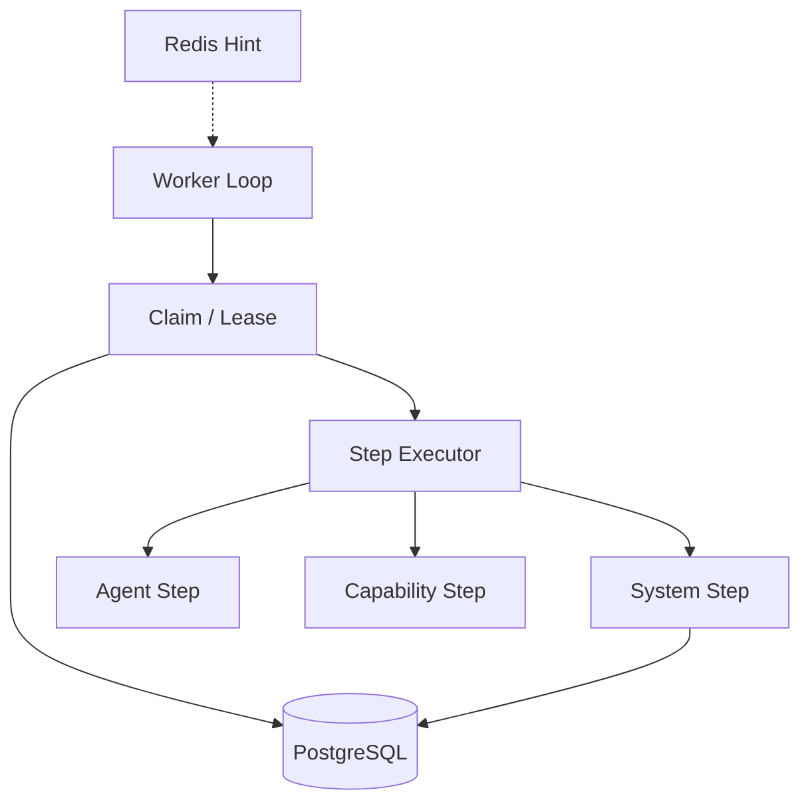
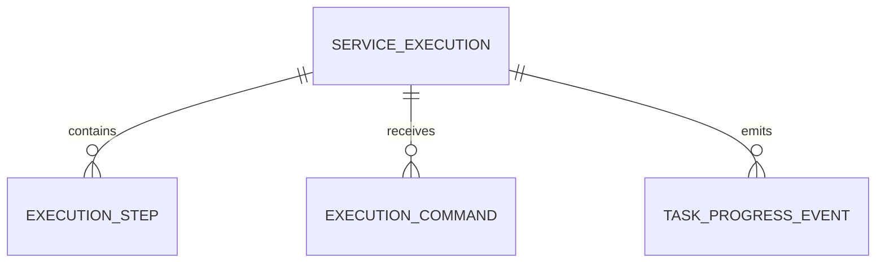

# Worker Engine 模块需求与设计一体化文档

> **文档编号**: MOD-WORKER-1.0  
> **文档版本**: v1.1  
> **创建日期**: 2026-09-10  
> **文档状态**: 设计草稿（V1.7 整改对齐）  
> **设计基线**: 《通用智能服务执行框架 V1.6 总体设计说明书》+《05-变更记录/V1.6-to-V1.7-整改对齐说明》（D02/D03）  
> **模板类型**: design-full（跨模块/架构核心模块）

**评审边界说明**：

- 需求评审：第 2 章，确认模块职责和边界；
- 设计评审：第 3-4 章，确认技术实现、数据、接口、DFX、部署；
- 本文只设计 Framework Core，不引入任何具体项目业务字段。

---

## 1. 文档控制

### 1.1 责任人

| 角色 | 姓名 | 职责范围 |
|---|---|---|
| 产品/架构负责人 | 待定 | 模块边界、需求与总体设计一致性 |
| 开发负责人 | 待定 | 技术方案与实现 |
| 测试负责人 | 待定 | 场景与 Gate |
| 安全/运维评审 | 按需 | 安全、可靠性、部署评审 |

### 1.2 修订历史

| 版本 | 日期 | 变更描述 |
|---|---|---|
| v0.3 | 2026-09-10 | 承接模块 01 后置的 S-03 后置段：新增 S-06/E-03（执行期重新解析 Auth/Authorization） |
| v0.1 | 2026-09-10 | 基于总体设计 V1.6 首次形成模块详细设计 |
| v1.1 | 2026-09-10 | V1.7 整改：Human RESUME/CANCEL+HUMAN_TIMEOUT=USER_INACTION（D02）、Delivery Owner max5/base30s（D03）、治理拆 P0/P1、REQ-EXEC-002/003 |

---

## 2. 需求分析

### 2.1 需求概述

| 项目 | 内容 |
|---|---|
| 模块名称 | Worker Engine |
| 模块ID | MOD-WORKER |
| 需求类型 | 新框架模块设计 |
| 业务背景 | 企业 ServiceExecution 可能跨分钟/小时，包含异步外部任务、等待、重试、人工确认、主动投递，不能依赖实时请求或单 Pod 内存。 |
| 核心目标 | 以 PostgreSQL 为权威队列/状态源实现可恢复、幂等、可横向扩展的可靠执行引擎。 |
| 运行形态 | `worker` 独立 Deployment；可水平扩容 |

### 2.2 痛点与价值

| 维度 | 内容 |
|---|---|
| 目标用户 | Framework Runtime；Admin 通过 Execution 查询/命令间接使用 |
| 当前问题 | 仅有 LangGraph Checkpointer 无法提供未来唤醒/claim/lease；内存队列/本地 scheduler 会在崩溃后丢任务。 |
| 框架影响 | Worker 决定生产长任务是否真正可靠。 |
| 预期价值 | 任务可跨进程、跨 Pod、跨时间继续，并且故障恢复不重复关键副作用。 |

### 2.3 功能方案

#### 2.3.1 功能清单

| 功能ID | 功能名称 | 功能描述 | 优先级 | 来源 |
|---|---|---|---|---|
| FEAT-01 | Claim/Lease | 使用 PostgreSQL SKIP LOCKED claim 可运行 Execution。 | P0 | 总体设计 V1.6 |
| FEAT-02 | Heartbeat/Reclaim | 续租并回收 lease 已过期的 RUNNING Execution。 | P0 | 总体设计 V1.6 |
| FEAT-03 | Step 执行 | 统一 AgentStep、CapabilityStep、SystemStep。 | P0 | 总体设计 V1.6 |
| FEAT-04 | Wait/Retry/Timer | 持久化 next_run_at，等待时释放 Worker。 | P0 | 总体设计 V1.6 |
| FEAT-05 | Command/Cancel/Human | 消费持久化 ExecutionCommand；Human V1 仅 RESUME/CANCEL，deadline 必填默认24h，超时 FAILED/HUMAN_TIMEOUT=USER_INACTION（V1.7 D02）。 | P0 | 总体设计 V1.7 |
| FEAT-06 | Resource Governance | P0：global/capability 并发 + step timeout；P1：per-tenant 公平/resource-class 配额/优先级/高级限流（V1.7 收口，Browser/Shell 保留基础独立并发限制）。 | P0/P1 | 总体设计 V1.7 |

#### 2.4 范围与边界

| 类别 | 内容 |
|---|---|
| 范围（In Scope） | Execution 生命周期、claim/lease/retry/wait/recovery、Step Executor、命令、资源治理、Delivery trigger。 |
| 非范围（Out of Scope） | 直接解析原用户 Prompt、替代 AgentExecutor、将 Redis 作为队列唯一事实源、业务项目专属调度逻辑。 |
| 前置假设 | PostgreSQL 可事务写；所有外部副作用 Capability 具备框架层幂等策略或明确不可重试语义。 |
| 有意妥协/技术债 | V1 使用 PG Worker；达到复杂跨日编排/大规模 join/补偿阈值后再评估 Temporal 等成熟引擎。 |

### 2.5 验收条件

#### 2.5.1 业务规则与约束

| ID | 类型 | 描述 | 验证场景 |
|---|---|---|---|
| RULE-01 | 系统约束 | claim 候选必须包括 PENDING、到期 WAITING/RETRY_WAIT 和 lease 过期 RUNNING。 | S-01 |
| RULE-02 | 系统约束 | 长 Wait 不得占住 coroutine/HTTP 请求，必须写 next_run_at 并释放 Worker。 | S-02 |
| RULE-03 | 系统约束 | Redis 不可用时 Worker 仍能通过 PostgreSQL polling 继续。 | S-03 |
| RULE-04 | 系统约束 | 每个关键副作用具备 idempotency key 或明确禁止自动重试。 | E-01 |
| RULE-05 | 系统约束 | Human V1 仅 RESUME/CANCEL；deadline 必填默认24h（可配不可空）；进入 WAITING_HUMAN 置 next_run_at=deadline；超时→FAILED/HUMAN_TIMEOUT（=USER_INACTION，失败率单独统计）；超时后命令幂等拒绝（REQ-EXEC-002）。 | S-HUMAN-001/002/E-HUMAN-001 |
| RULE-06 | 系统约束 | Worker 为 Delivery 唯一重试 Owner：max_retries=5、base=30s、指数退避+jitter（可按 channel 覆盖，Pydantic 范围+跨字段校验）；同通知共用 dedupe_key；at-least-once+去重；终败写 DELIVERY_DEAD_LETTER，Execution 与 Delivery 状态分开展示（REQ-EXEC-003）。Gateway 单次 best-effort，禁业务重试/历史重放。 | S-DELIVERY-001/E-DELIVERY-001/002 |

#### 2.5.2 功能验收场景

**正常场景**

| 场景ID | 功能ID | 优先级 | 测试层级 | 关键真实边界 | 归属 | 前置条件 | 操作步骤 | 预期结果 |
|---|---|---|---|---|---|---|---|---|
| S-01 | FEAT-02 | P0 | integration | Worker A SIGKILL → PostgreSQL Lease → Worker B | 本模块 | 已完成基础配置 | Worker A claim 后崩溃，等待 lease 过期 | Worker B reclaim 同一 Execution 并继续 |
| S-02 | FEAT-04 | P0 | integration | Worker → PostgreSQL → Time → Worker | 本模块 | 已完成基础配置 | 外部任务返回 PENDING，设置 next_run_at | Worker 释放资源，时间到后重新 claim |
| S-03 | FEAT-04 | P0 | integration | Redis Down → PostgreSQL Polling | 本模块 + 后置段 → 模块 14 | 已完成基础配置 | 停止 Redis 后创建/等待任务 | 通知延迟可能增加但任务最终继续 |
| S-04 | FEAT-01 | P0 | integration | Worker A/B → PostgreSQL SKIP LOCKED | 本模块 | 已完成基础配置 | 两个 Worker 并发 claim 同一批 due Execution | 同一 Execution 同时只被一个 Worker 获得 lease |
| S-05 | FEAT-06 | P0 | integration | Scheduler → Resource Governance → Step Executor | 本模块 | 已完成基础配置 | 同一 tenant/capability 同时超过配置并发上限 | 超限 Execution 保持可调度状态但不超配执行，其他资源类不被永久阻塞 |
| S-HUMAN-001 | FEAT-05 | P0 | integration | WAITING_HUMAN → ExecutionCommand | 本模块 | 已完成基础配置 | RESUME | 回 RUNNING |
| S-HUMAN-002 | FEAT-05 | P0 | integration | WAITING_HUMAN → ExecutionCommand | 本模块 | 已完成基础配置 | CANCEL | 经 CANCELLING 到 CANCELLED |
| S-DELIVERY-001 | FEAT-03 | P0 | integration | Worker → Gateway → Route | 本模块 | 已完成基础配置 | 首次投递 RETRYABLE_FAILURE | 写 RETRY_WAIT + next_run_at，复用同一 dedupe_key 重试 |
| S-06 | FEAT-03 | P0 | integration | Worker → Auth/Authorization Resolver → Capability | 本模块 | 模块 09 Auth Runtime 已落地；Execution 已创建 | Execution 创建后撤销用户权限，Worker 恢复任务并调用 Capability | Worker 按**当前** Auth/Authorization 重新解析，**不沿用 Snapshot 中的旧授权**（§3.5 规则的可验证化） |

**异常场景**

| 场景ID | 功能ID | 测试层级 | 关键真实边界 | 归属 | 触发条件 | 系统行为 | 用户感知 |
|---|---|---|---|---|---|---|---|
| E-01 | FEAT-03 | integration | Capability Adapter → Idempotency | 本模块 | 外部 submit 成功后 Worker 在持久化 external_task_id 前崩溃 | 恢复时使用相同 idempotency_key 防止重复创建，或进入人工确认状态 | 返回可识别错误，不泄露内部细节 |
| E-02 | FEAT-05 | integration | ExecutionCommand | 本模块 | 收到重复 Cancel/Retry 命令 | 命令幂等，状态机拒绝非法迁移 | 返回可识别错误，不泄露内部细节 |
| E-03 | FEAT-03 | integration | Worker → Auth Resolver | 本模块 | 权限已撤销 | Capability 调用被拒 | Execution 按策略失败或进入等待人工，**不自动提权、不换更高权限账号** |
| E-HUMAN-001 | FEAT-05 | integration | Timer → WAITING_HUMAN | 本模块 | 超过 deadline | FAILED/HUMAN_TIMEOUT（USER_INACTION），超时后命令拒绝 | Console 单独归类，不计业务失败率 |
| E-DELIVERY-001 | FEAT-03 | integration | Worker Retry | 本模块 | 连续 5 次 retryable failure | 写 DELIVERY_DEAD_LETTER，Execution 成功与 Delivery 失败分开展示 | 返回可识别错误，不泄露内部细节 |
| E-DELIVERY-002 | FEAT-03 | integration | Gateway restart | 本模块 | Gateway 重启/重连 | 不自行重放历史 DeliveryCommand，重试时机只由 Worker 决定 | 返回可识别错误，不泄露内部细节 |

#### 2.5.3 非功能指标

| 指标ID | 指标名称 | 目标值 | 测量方法 |
|---|---|---|---|
| NFR-REL-01 | 可靠性 | 不得丢失/破坏框架权威状态；具体 SLA 待真实部署压测后确定 | 故障注入 + integration/E2E |
| NFR-SEC-01 | 安全边界 | 不得信任 LLM 提供的身份/权限/Host 路径等安全上下文 | Architecture Gate + integration |
| NFR-OBS-01 | 可观测性 | 关键操作必须携带 request_id/trace_id 或 execution_id | 日志/Trace 断言 |

性能/QPS/延迟阈值当前没有真实压测依据，本文不虚构固定数字；上线门槛在真实 Reference Integration 跑通后补充。

---

## 3. 技术设计

### 3.1 方案选型

#### 关键决策记录

| 决策点 | 选择 | 被否决项 | 理由 | 可逆性 |
|---|---|---|---|---|
| 可靠引擎 | PostgreSQL claim/lease Worker | 内存队列/仅 Redis | PG 已是 SoT，恢复语义可控 | 中 |
| claim | FOR UPDATE SKIP LOCKED | 全表锁/抢占内存 | 支持多 Worker 并发 | 难 |
| 等待 | next_run_at | sleep 30min | 释放 Worker 资源且可恢复 | 难 |

#### 技术栈

| 类别 | 选型 | 版本 | 选型理由 |
|---|---|---|---|
| 语言 | Python | 3.12+ | 共享 Framework Core |
| 数据库 | PostgreSQL | 待定 | 执行状态/claim/lease SoT |
| 协调 | Redis | 待定 | wake-up/cancel fast path；非权威 |
| Agent Step | Shared AgentExecutor | LangGraph 1.x | 复用在线 Agent 栈 |

### 3.2 架构设计



#### 分层职责

| 层级 | 职责 |
|---|---|
| Scheduler Loop | 查询 due execution / wake-up |
| Claim/Lease | 多实例互斥和故障恢复 |
| State Machine | 状态迁移合法性 |
| Step Executor | Agent/Capability/System 执行 |
| Repository | step/result/wait/command 原子持久化 |

### 3.3 数据设计

> **统一数据库公共字段约束**：本模块凡新增 Framework 自建表，均必须包含 `is_deleted BOOLEAN NOT NULL DEFAULT FALSE`、`create_time TIMESTAMPTZ NOT NULL DEFAULT now()`、`update_time TIMESTAMPTZ NOT NULL DEFAULT now()`；Repository 默认过滤 `is_deleted=false`，删除默认逻辑删除。第三方自管理表（如 LangGraph Checkpointer）不修改其内部 Schema。


| 数据对象/表 | 关键字段 | 约束/索引 | 说明 |
|---|---|---|---|
| service_execution | status、next_run_at、lease_owner、lease_expires_at、attempt | (status,next_run_at)、(status,lease_expires_at) | Worker 调度根 |
| execution_step | step_key、type、status、attempt、external_task_id | execution_id/status | 步骤事实 |
| execution_command | command_type、actor、status | execution_id/status | 取消/重试/人工命令 |
| task_progress_event | event_type、stage、progress、occurred_at | execution_id/time | 进度事件 |


**ER 图**



### 3.4 接口设计

| 接口ID | 接口/函数 | 形态 | 说明 | 关联功能 |
|---|---|---|---|---|
| LIB-01 | WorkerEngine.run_forever() | 函数库/进程 | 主循环 | FEAT-01,FEAT-02 |
| LIB-02 | ExecutionRepository.claim_due(worker_id,lease) | 函数库 | claim due/reclaim | FEAT-01,FEAT-02 |
| LIB-03 | StepExecutor.execute(step,context) | 函数库 | 执行一个步骤 | FEAT-03 |
| LIB-04 | ExecutionCommandHandler.apply(command) | 函数库 | 处理命令 | FEAT-05 |

Repository claim 必须把可运行状态和过期 RUNNING 放进一个事务性选择逻辑，避免出现永久 orphan RUNNING。

所有普通 HTTP JSON 接口必须复用统一响应 Envelope：

```json
{
  "code": "OK",
  "message": "success",
  "data": {},
  "request_id": "req-xxx",
  "timestamp": "2026-09-10T15:00:00+00:00"
}
```

SSE/WebSocket/文件流属于协议例外，但必须复用统一错误码 taxonomy 和 request/trace 关联策略。

### 3.5 质量实现方案

#### 可靠性

SIGKILL、DB reconnect、Redis down、duplicate delivery、duplicate submit 都必须做故障注入；状态更新和 side-effect bookkeeping 尽量采用 outbox/idempotency 等可恢复模式。

#### 安全性

Worker 每次调用 Capability 重新解析当前 Auth/Authorization；不能只信创建时 Snapshot；高风险 Step 做策略检查。

#### 可观测性

queue lag、claim latency、running count、lease reclaim、retry count、state transitions、step latency、dead/stuck execution。

#### 测试策略

```text
unit
→ 纯规则/状态机/转换

integration
→ Repository / Provider / Runtime 边界

E2E
→ 真实进程/API/数据库/用户可见结果

architecture
→ 依赖方向、Stateless、统一响应、Core Purity 等硬约束
```

---

## 4. 部署与运维

### 4.1 部署架构

独立 Deployment；最少 1 副本；按 pending/due/running 指标扩容；Phase 1 不优先 scale-to-zero。

### 4.2 发布与回滚

- 框架代码通过镜像/包版本发布；
- Schema 变化使用 Alembic expand → migrate → switch → contract；
- 只有 `Service` 采用草稿/已发布两态，`Agent` 统一 direct-effect + revision（V1.7 D04），不把代码发布和业务定义发布混成一套版本系统；
- 运行配置可直接生效时必须保留 revision/audit；
- 回滚不得恢复已经撤销的用户权限、Credential 或安全禁用状态。

### 4.3 监控告警

queue lag、expired lease count、retry rate、stuck RUNNING、command backlog、step error；阈值待定。

阈值当前统一标记为**待定**，由 Reference Integration 实测建立基线后配置。

---

## 5. 风险与依赖

### 5.1 项目依赖

| 依赖模块/团队 | 依赖内容 | 状态 | 风险等级 |
|---|---|---|---|
| PostgreSQL | 执行 SoT/调度 | 必需 | 高 |
| Redis | wake-up/cancel fast path | 可降级 | 低 |
| CapabilityRuntime | 业务步骤 | 必需 | 高 |
| AgentExecutor | Agent Step | 按 Service | 高 |

### 5.2 风险识别

| 风险ID | 类型 | 描述 | 概率 | 影响 | 应对措施 | 验证场景 |
|---|---|---|---|---|---|---|
| RISK-01 | 可靠性 | crash 后 RUNNING 永久孤儿 | 中 | 高 | expired RUNNING reclaim + SIGKILL Gate | S-01 |
| RISK-02 | 副作用 | 恢复时重复外部 submit | 中 | 高 | 三层幂等：Execution/Step/External Side Effect | E-01 |

---

## 6. 需求追溯矩阵

| 来源 | 功能ID | 接口ID | 测试场景 | 测试层级 | 状态 |
|---|---|---|---|---|---|
| 总体设计 V1.6 | FEAT-01 | LIB-01, LIB-02 | S-04 | integration/E2E | 待实现 |
| 总体设计 V1.6 | FEAT-02 | LIB-01, LIB-02 | S-01 | integration/E2E | 待实现 |
| 总体设计 V1.6 | FEAT-03 | LIB-03 | E-01, S-06, E-03 | integration/E2E | 待实现（S-06/E-03 承接模块 01 S-03 的后置 E2E 段） |
| 总体设计 V1.6 | FEAT-04 | 内部契约 | S-02, S-03 | integration/E2E | 待实现 |
| 总体设计 V1.6 | FEAT-05 | LIB-04 | E-02 | integration/E2E | 待实现 |
| 总体设计 V1.6 | FEAT-06 | 内部契约 | S-05 | integration/E2E | 待实现 |

---

## Spec Compliance Matrix

| Spec/Rule | enforcement | 设计影响 | 设计落点 | 验证场景 | verifier | 状态 |
|---|---|---|---|---|---|---|
| framework#RULE-EXEC-001 | required | Worker 为可靠执行主人 | §3.2 | S-01/S-02/E-01 | `SIGKILL E2E` | applied |
| framework#RULE-DB-001 | required | Worker 表含公共字段 | §3.3 | S-04 | `test_database_common_fields.py` | applied |
| framework#RULE-DB-002 | required | claim 忽略软删除任务 | §3.3 | S-04 | `repository integration` | applied |

---

## 附录：术语表

| 术语 | 定义 |
|---|---|
| Framework Core | 与具体业务项目解耦的框架内核 |
| Integration | 具体项目对框架 SPI/Contract 的实现和配置 |
| Capability | 稳定的“系统能做什么”合同 |
| Execution | 一次可靠业务服务执行实例 |
| SoT | Source of Truth，权威事实源 |
| SPI | Service Provider Interface，扩展接口 |
| DFX | 面向可靠性、安全性、可测试性、可运维性等质量属性的设计 |

---
