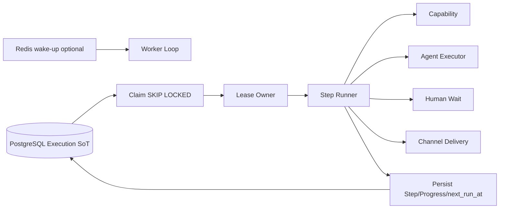

<!-- V1.11 module-split metadata -->
> **文档分档**：`Full`（模板 `design-full.md`）  
> **分档理由**：lease/retry/recovery/cancel 可靠执行  
> **文档边界**：本文件是该模块唯一详细设计事实源；DB Owner 与接口 Owner 必须落在本模块，不允许在其他模块重复定义。  
> **拆分原则**：仅按可独立评审/编码/验收的一级模块拆分；不按单表/单接口继续碎片化。

# Worker Engine 模块需求与设计一体化文档

> **文档编号**: MOD-WORK-V1.11 模块分档拆分版
> **文档版本**: V1.11 模块分档拆分版
> **创建日期**: 2026-09-11
> **文档状态**: 设计基线草案（待仓库 Spec Context 绑定后进入正式评审）
> **模板**: `design-full.md`；生成流程按 `cf-task:align` 的复杂后端/架构模块路径执行。
> **上游基线**: V1.8 完整总体设计 + V6 完整 Playbook + Console V0.8 Final。


**评审边界说明**：
- 第 2 章是需求基线（What），禁止实现阶段自行改变领域语义；
- 第 3-4 章是设计基线（How），DB 与每个接口必须以本文为准；
- `Spec Compliance Matrix` 当前依据设计基线生成，因本轮未提供仓库 `spec-context.yml` 与代码目录，**不得声称已通过 cf-task:align 的 repo Spec Gate**；落码前必须在真实仓库执行 `refresh/catalog/bind`。


## 1. 文档控制

### 1.1 责任人

| 角色 | 姓名 | 职责范围 |
|---|---|---|
| 产品/架构负责人 | 待定 | 需求定义、领域边界、与总设/Playbook 一致性 |
| 开发负责人 | 待定 | 技术方案、DB/API、实现 |
| 测试负责人 | 待定 | S/E/B 场景、E2E Gate |
| 安全/运维 | 待定 | Secret、隔离、发布、监控 |

### 1.2 修订历史

| 版本 | 日期 | 作者 | 变更描述 |
|---|---|---|---|
| V1.11 模块分档拆分版 | 2026-09-11 | ChatGPT / 待项目负责人确认 | 按 cf-task:align + design-full 从最新完整总设/Playbook/交互稿重新生成；细化 DB 与全部接口 |

## 2. 需求分析

### 2.1 需求概述

| 项目 | 内容 |
|---|---|
| 模块名称 | Worker Engine |
| 模块ID | MOD-WORK |
| 所属系统/产品线 | Fluxion 通用智能服务执行框架 |
| 需求类型 | 中大型功能 / 架构演进 |
| 业务背景 | 长任务、等待、重试、恢复、人工检查点不能依赖 Agent Runtime 进程生命周期；Redis/本地 scheduler 也不能作为唯一事实源。 |
| 核心目标 | 实现基于 PostgreSQL SoT 的 claim/lease/step progression/retry/wait/recovery/cancel 引擎，Worker 独立横向扩展。 |

### 2.2 痛点与价值

| 维度 | 内容 |
|---|---|
| 目标用户 | Worker/运维/Execution Service；Admin 通过 Execution Timeline 间接观察 |
| 当前问题 | 历史 durable 框架/本地 scheduler 在崩溃、queue、event loop、timeout 场景暴露不确定性；错误运行角色还可能意外消费任务。 |
| 业务影响 | 任务丢失、重复执行、split-brain、扩缩容困难。 |
| 预期价值 | Worker 可随负载扩展；任意 Worker 崩溃后任务能由其他 Worker 恢复。 |

### 2.3 功能方案

#### 2.3.1 功能清单

| 功能ID | 功能名称 | 功能描述 | 优先级 | 来源 |
|---|---|---|---|---|
| FEAT-WORK-01 | Claim/Lease | PG SKIP LOCKED 抢占与租约。 | P0 | 总体设计 |
| FEAT-WORK-02 | Step Runner | Capability/Agent/Human/Delivery 统一推进。 | P0 | Service Execution |
| FEAT-WORK-03 | Wait/Retry | next_run_at + bounded backoff。 | P0 | 长任务 |
| FEAT-WORK-04 | Recovery | lease 过期恢复与 SIGKILL Gate。 | P0 | 可靠性 |
| FEAT-WORK-05 | Cancel/Command | 应用 ExecutionCommand/外部任务 cancel。 | P0 | /stop |

### 2.4 范围与边界

| 类别 | 内容 |
|---|---|
| 范围（In Scope） | Worker 进程循环、DB claim/lease、step executor dispatch、retry/wait/recovery/command、PG polling + Redis wakeup 优化。 |
| 非范围（Out of Scope） | Service CRUD、Agent realtime chat、Channel WebSocket、业务 Provider 细节。 |
| 前置假设 | 上游总设、公共 DB/API 规范、外部基础设施可用 |
| 有意妥协 / 技术债 | 无；未来扩展必须有真实旅程驱动 |

### 2.5 验收条件

#### 2.5.1 业务规则与约束

| ID | 类型 | 描述 | 验证场景 |
|---|---|---|---|
| RULE-WORK-01 | 角色 | 只有 worker 运行角色消费后台 Execution；API/Runtime 不得 recovery claim。 | S-WORK-01 |
| RULE-WORK-02 | SoT | PostgreSQL 是执行状态/调度 SoT；Redis 只 wake-up/cache/cancel hint。 | S-WORK-02 |
| RULE-WORK-03 | 租约 | 失去 lease 的 Worker 必须停止本地推进。 | S-WORK-03 |
| RULE-WORK-04 | 重试 | 所有 retry 有界且考虑幂等/副作用。 | S-WORK-04 |
| RULE-WORK-05 | 恢复 | SIGKILL Worker 后，其他 Worker 在 lease 过期后恢复同一 Execution。 | S-WORK-05 |

#### 2.5.2 功能验收场景

**正常场景**

| 场景ID | 功能ID | 优先级 | 测试层级 | 关键真实边界 | 归属 | 前置条件 | 操作步骤 | 预期结果 |
|---|---|---|---|---|---|---|---|---|
| S-WORK-01 | FEAT-WORK-01 | P0 | integration | Worker×2→PostgreSQL | 本模块 | 同一批 due tasks | 两个 Worker 并发 claim | 同一 Execution 同时仅一个 owner |
| S-WORK-02 | FEAT-WORK-04 | P0 | E2E | K8S kill→PG→Worker2 | 本模块 | Execution RUNNING | SIGKILL owner | lease 过期后 Worker2 恢复且不重复完成步骤 |
| S-WORK-03 | FEAT-WORK-03 | P0 | E2E | PG next_run_at | 本模块 | 异步 task WAITING | 等待到 next_poll_at | Worker 之后再次 claim，不 busy loop |
| S-WORK-04 | FEAT-WORK-05 | P0 | E2E | command→worker→provider | 本模块 | CANCEL command PENDING | Worker claim | 应用取消并终止后续步骤 |

**异常场景**

| 场景ID | 功能ID | 测试层级 | 关键真实边界 | 归属 | 触发条件 | 系统行为 | 用户感知 |
|---|---|---|---|---|---|---|---|
| E-WORK-01 | FEAT-WORK-01 | integration | Lease conditional update | 本模块 | Worker lease 已被抢走 | renew/advance 返回 LEASE_LOST | 停止执行 |
| E-WORK-02 | FEAT-WORK-03 | integration | Retry policy | 本模块 | 非可重试/超上限错误 | 直接按 failure policy 终止/人工 | 不无限 retry |

#### 2.5.3 非功能指标

| 指标ID | 指标名称 | 目标值 | 测量方法 |
|---|---|---|---|
| NFR-REL-01 | 可靠执行 | 不得因单 Runtime/Worker 进程退出丢失权威状态 | SIGKILL/E2E |
| NFR-SEC-01 | 可信身份 | LLM/客户端不得覆盖 tenant/actor/secret | 安全测试 |
| NFR-OBS-01 | 可追踪 | 关键路径可按 request_id/trace_id/execution_id 定位 | 集成/E2E |

## 3. 技术设计

### 3.1 方案选型

#### 3.1.1 关键决策记录

| 决策点 | 选择 | 被否决项 | 理由 | 可逆性 |
|---|---|---|---|---|
| 调度 SoT | PostgreSQL lease/next_run_at | Redis queue/local scheduler only | 可恢复、可审计 | 难 |
| 唤醒 | Redis best-effort + PG polling | 强依赖消息总线 | V1 基础设施从简 | 易 |
| 执行粒度 | 一步一持久化边界 | 整个流程进程内跑完 | 崩溃恢复与幂等 | 中 |

#### 3.1.2 技术栈

| 类别 | 选型 | 版本 | 选型理由 |
|---|---|---|---|
| 语言 | Python | 3.12+（仓库实际版本落码前确认） | 与 Agent/LLM 生态一致 |
| Web/API | FastAPI + Pydantic | 仓库实际版本确认 | 类型契约与异步 IO |
| ORM | SQLAlchemy 2 Async | 仓库实际版本确认 | 异步 PostgreSQL |
| 数据库 | PostgreSQL | 外部部署 | 业务 SoT |

### 3.2 架构设计



#### 3.2.1 模块职责分层

| 层级 | 职责 | 禁止事项 |
|---|---|---|
| Handler/API | 协议解析、DTO、权限入口、统一错误映射 | 业务逻辑/直接 SQL |
| Application Service | 用例编排、事务边界、领域校验 | 依赖具体 Web 框架 |
| Domain | 领域对象/规则 | 基础设施依赖 |
| Repository/Port | 持久化/外部能力抽象 | 泄露 Secret/跨领域修改 |
| Adapter | PostgreSQL/HTTP/MCP 等实现 | 改变领域语义 |

#### 3.2.2 外部依赖清单

| 外部系统/模块 | 依赖类型 | 协议/接口 | 超时/一致性 | 降级策略 |
|---|---|---|---|---|
| PostgreSQL | Execution SoT | SQL | 强一致 | 不可用则暂停 claim，不丢任务 |
| Redis | 可选 wake-up | PubSub/list/cache | best-effort | 退回 PG polling |
| Step Executors | 函数调用 | Python | 各自 deadline | 按失败策略持久化 |

### 3.3 数据设计

本模块**不拥有独立业务表**。这是刻意设计：权威状态由其领域所有者持久化，本模块只读取/调用 Port。禁止为了实现方便新增 shadow truth、本地 SQLite 或进程内业务事实。


Worker 不新建独立 queue 表；直接操作 Service/Execution 模块拥有的 `service_execution/execution_step/async_task_run/execution_command`。任何新调度状态必须先评审是否应回归这些 owner 表。

### 3.4 接口设计

#### 3.4.1 接口清单

| 接口ID | 名称 | 形态 | 方法/签名 | 路径/用途 |
|---|---|---|---|---|
| WORK-LIB-01 | Claim 可运行 Execution | Library | async def claim_due_executions(worker_id: str, limit: int, now: datetime) -> list[ClaimedExecution] |  |
| WORK-LIB-02 | 续租 Execution | Library | async def renew_lease(execution_id: UUID, worker_id: str, expected_lease_until: datetime) -> bool |  |
| WORK-LIB-03 | 推进一个步骤 | Library | async def advance_execution(claim: ClaimedExecution) -> AdvanceResult |  |
| WORK-LIB-04 | 应用 ExecutionCommand | Library | async def apply_pending_commands(execution_id: UUID, worker_id: str) -> list[AppliedCommand] |  |
| WORK-LIB-05 | 异步任务轮询/取消 | Library | async def progress_async_task(step: ExecutionStep, run: AsyncTaskRun, now: datetime) -> AsyncProgressResult |  |

#### WORK-LIB-01: Claim 可运行 Execution

**入口类型**：Library

**函数签名**

```python
async def claim_due_executions(worker_id: str, limit: int, now: datetime) -> list[ClaimedExecution]
```

**入参**

| 参数 | 类型 | 必填 | 说明 |
|---|---|---|---|
| worker_id | string | Y | 当前 Worker instance |
| limit | integer | Y | 批量大小 |
| now | datetime | Y | 数据库/统一时钟 |

**返回**

| 字段 | 类型 | 说明 |
|---|---|---|
| items | array<ClaimedExecution> | 已获得 lease 的 Execution |

**处理逻辑**

```text
PostgreSQL transaction + SELECT ... FOR UPDATE SKIP LOCKED，筛 status in PENDING/RUNNING/WAITING 且 next_run_at<=now 且 lease expired → 设置 lease_owner/expires_at → commit。
```

**补充约束**：Redis 仅 wake-up；即使 Redis 丢失，PG polling 仍能 claim。

#### WORK-LIB-02: 续租 Execution

**入口类型**：Library

**函数签名**

```python
async def renew_lease(execution_id: UUID, worker_id: str, expected_lease_until: datetime) -> bool
```

**入参**

| 参数 | 类型 | 必填 | 说明 |
|---|---|---|---|
| execution_id | uuid | Y | Execution |
| worker_id | string | Y | owner |

**返回**

| 字段 | 类型 | 说明 |
|---|---|---|
| renewed | boolean | 是否成功 |

**异常/错误**

| 错误码 | 场景 | HTTP 状态 |
|---|---|---|
| LEASE_LOST | lease 已被其他 Worker 获取 | 409 |

**处理逻辑**

```text
条件 UPDATE WHERE id=? AND lease_owner=? AND lease_expires_at=expected；失败立即停止本地继续执行，避免 split brain。
```

#### WORK-LIB-03: 推进一个步骤

**入口类型**：Library

**函数签名**

```python
async def advance_execution(claim: ClaimedExecution) -> AdvanceResult
```

**入参**

| 参数 | 类型 | 必填 | 说明 |
|---|---|---|---|
| claim | ClaimedExecution | Y | 含 snapshot/current step |

**返回**

| 字段 | 类型 | 说明 |
|---|---|---|
| result | AdvanceResult | SUCCEEDED/WAITING/RETRY/FAILED/CANCELLED |

**处理逻辑**

```text
读取 immutable snapshot + current dynamic safety state → cancel check → load step → step executor(Capability/Agent/Human/Delivery) → transaction persist step/root/progress → release/renew lease。
```

#### WORK-LIB-04: 应用 ExecutionCommand

**入口类型**：Library

**函数签名**

```python
async def apply_pending_commands(execution_id: UUID, worker_id: str) -> list[AppliedCommand]
```

**入参**

| 参数 | 类型 | 必填 | 说明 |
|---|---|---|---|
| execution_id | uuid | Y | Execution |

**返回**

| 字段 | 类型 | 说明 |
|---|---|---|
| commands | array<AppliedCommand> | 已幂等应用 |

**处理逻辑**

```text
读取 PENDING commands → 验证状态机 → CANCEL/RETRY/RESUME → 更新 command.status=APPLIED 或 REJECTED；相同 idempotency_key 不重复副作用。
```

#### WORK-LIB-05: 异步任务轮询/取消

**入口类型**：Library

**函数签名**

```python
async def progress_async_task(step: ExecutionStep, run: AsyncTaskRun, now: datetime) -> AsyncProgressResult
```

**入参**

| 参数 | 类型 | 必填 | 说明 |
|---|---|---|---|
| run | AsyncTaskRun | Y | 外部任务状态 |

**返回**

| 字段 | 类型 | 说明 |
|---|---|---|
| result | AsyncProgressResult | WAIT/SUCCESS/FAIL/CANCEL |

**处理逻辑**

```text
若 cancel requested 且 cancel_supported → provider.cancel；否则 provider.status → backoff 设置 next_poll_at；成功保存 result_ref；不得 busy loop。
```

### 3.5 质量实现方案

#### 3.5.1 性能与容量

| 热点路径 | 负载量级 | 潜在瓶颈 | 实现方案 | 目标值 |
|---|---|---|---|---|
| Claim | 执行量增长 | DB 锁/扫描 | claim 组合索引 + SKIP LOCKED + 小批量 + jitter | 按实测调批量 |
| Poll | 大量 WAITING | 频繁扫描 | next_run_at 索引 + 自适应 polling + wake-up | 避免秒级全表扫描 |

#### 3.5.2 可靠性

必须提供 SIGKILL、lease expiry、Redis down、Provider timeout、重复 wakeup 的 E2E 故障注入；这是 release gate。

#### 3.5.3 安全性

可信 tenant/actor/context 服务端解析；输入做 Schema/语义校验；Secret 仅保存引用；审计中脱敏。

#### 3.5.4 可观测性

日志、Metrics、Trace 统一关联 request_id/trace_id；Execution 路径附带 execution_id/step_id；错误码稳定。

#### 3.5.5 测试策略

Domain/validator 单测；Repository/Provider 真 PG/外部 Stub 集成；核心用户旅程做 E2E；安全和崩溃恢复不得只靠 mock。

## 4. 部署与运维

### 4.1 部署架构

随其所属运行角色部署；PostgreSQL/Redis/Object Store/Secret Provider/OTel Backend 均为外部依赖，不打包进应用 Compose/Helm。

### 4.2 发布与回滚

DB 变更使用向前兼容迁移；应用支持滚动回滚；若涉及不可变 Release/Artifact，只切换 current 指针，不覆盖历史。

### 4.3 监控告警

至少监控请求/调用量、错误率、延迟、外部依赖失败、关键队列/执行积压和配置加载失败；阈值由环境基线确定。

### 4.4 数据迁移

若无历史生产数据则直接按新 Schema 建表；若已有部署，使用 Alembic 等可回滚/可前滚迁移，禁止运行时隐式改表。

## 5. 风险与依赖

| 风险ID | 描述 | 影响 | 应对措施 | 验证场景 |
|---|---|---|---|---|
| RISK-WORK-01 | split-brain 导致重复副作用 | 高 | lease 条件更新 + step idempotency | S-WORK-01/E-WORK-01 |
| RISK-WORK-02 | Redis 故障导致任务永久不跑 | 高 | PG polling 自愈测试 | S-WORK-03 |

## 6. 需求追溯矩阵

| 功能ID | 接口ID | 验证场景 | 测试层级 | 状态 |
|---|---|---|---|---|
| FEAT-WORK-01 | WORK-LIB-01, WORK-LIB-02 | S-WORK-01, E-WORK-01 | E2E/integration | 待实现/评审 |
| FEAT-WORK-02 | WORK-LIB-02, WORK-LIB-03 | 见 §2.5 | E2E/integration | 待实现/评审 |
| FEAT-WORK-03 | WORK-LIB-03, WORK-LIB-04 | S-WORK-03, E-WORK-02 | E2E/integration | 待实现/评审 |
| FEAT-WORK-04 | WORK-LIB-04, WORK-LIB-05 | S-WORK-02 | E2E/integration | 待实现/评审 |
| FEAT-WORK-05 | WORK-LIB-05 | S-WORK-04 | E2E/integration | 待实现/评审 |

## Spec Compliance Matrix

| Spec/Rule | enforcement | 设计影响 | 设计落点 | 验证场景 | 状态/N/A 理由 |
|---|---|---|---|---|---|
| DESIGN/WORK#RULE-WORK-01 | design-baseline | 约束实现与验收 | §2.5 RULE-WORK-01 / §3 | S/E/B 场景 | applied；仓库 spec-context 待绑定 |
| DESIGN/WORK#RULE-WORK-02 | design-baseline | 约束实现与验收 | §2.5 RULE-WORK-02 / §3 | S/E/B 场景 | applied；仓库 spec-context 待绑定 |
| DESIGN/WORK#RULE-WORK-03 | design-baseline | 约束实现与验收 | §2.5 RULE-WORK-03 / §3 | S/E/B 场景 | applied；仓库 spec-context 待绑定 |
| DESIGN/WORK#RULE-WORK-04 | design-baseline | 约束实现与验收 | §2.5 RULE-WORK-04 / §3 | S/E/B 场景 | applied；仓库 spec-context 待绑定 |
| DESIGN/WORK#RULE-WORK-05 | design-baseline | 约束实现与验收 | §2.5 RULE-WORK-05 / §3 | S/E/B 场景 | applied；仓库 spec-context 待绑定 |

## 附录 A：接口与 DB 落码检查清单

- [ ] 每个 HTTP Endpoint 已有 DTO、鉴权、错误码、处理逻辑、测试。
- [ ] 每个 Library/CLI 接口有稳定签名和异常语义。
- [ ] 每张表字段、类型、NULL、默认值、唯一约束、索引、软删除策略已落实迁移。
- [ ] Request/Response 字段不接受客户端传入可信 tenant/actor/credential。
- [ ] 列表接口使用服务端分页，避免无界返回。
- [ ] 修改类接口有 revision/冲突语义；高风险/副作用路径满足幂等和审计。
- [ ] 仓库 Spec Context 已 refresh/catalog/bind 且 required Rules 映射到 S/E/B verifier。
