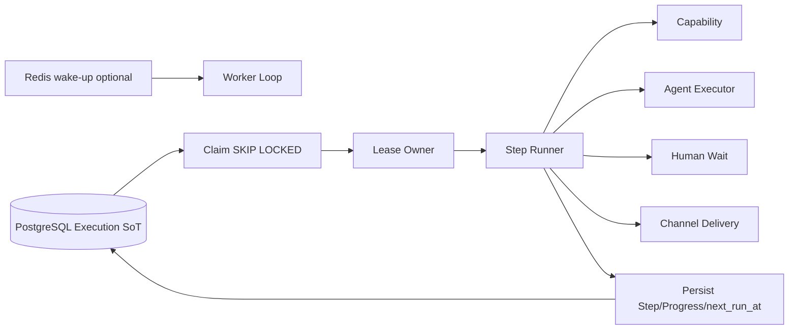

<!-- V1.11 module-split metadata -->
> **文档分档**：`Full`（模板 `design-full.md`）  
> **分档理由**：lease/retry/recovery/cancel 可靠执行  
> **文档边界**：本文件是该模块唯一详细设计事实源；DB Owner 与接口 Owner 必须落在本模块，不允许在其他模块重复定义。  
> **拆分原则**：仅按可独立评审/编码/验收的一级模块拆分；不按单表/单接口继续碎片化。

# Worker Engine 模块需求与设计一体化文档

> **文档编号**: MOD-WORK-V1.13
> **文档版本**: V1.13
> **创建日期**: 2026-09-11
> **文档状态**: 设计基线草案（待仓库 Spec Context 绑定后进入正式评审）
> **模板**: `design-full.md`；生成流程按 `cf-task:align` 的复杂后端/架构模块路径执行。
> **上游基线**: V1.8 完整总体设计 + V6 完整 Playbook + Console V0.8 Final。


**评审边界说明**：
- 第 2 章是需求基线（What），禁止实现阶段自行改变领域语义；
- 第 3-4 章是设计基线（How），DB 与每个接口必须以本文为准；
- `Spec Compliance Matrix` 当前依据设计基线生成，因本轮未提供仓库 `spec-context.yml` 与代码目录，**不得声称已通过 cf-task:align 的 repo Spec Gate**；落码前必须在真实仓库执行 `refresh/catalog/bind`。


## 1. 文档控制

### 1.1 责任人

| 角色 | 姓名 | 职责范围 |
|---|---|---|
| 产品/架构负责人 | 待定 | 需求定义、领域边界、与总设/Playbook 一致性 |
| 开发负责人 | 待定 | 技术方案、DB/API、实现 |
| 测试负责人 | 待定 | S/E/B 场景、E2E Gate |
| 安全/运维 | 待定 | Secret、隔离、发布、监控 |

### 1.2 修订历史

| 版本 | 日期 | 作者 | 变更描述 |
|---|---|---|---|
| V1.11 模块分档拆分版 | 2026-09-11 | ChatGPT / 待项目负责人确认 | 按 cf-task:align + design-full 从最新完整总设/Playbook/交互稿重新生成；细化 DB 与全部接口 |
| V1.14 最简重设 | 2026-09-12 | Claude Code | N-1：`worker_slot_lease` 槽位行表改为单行计数器 `worker_slot_counter(resource_class PK, used, slot_limit)`（原子 UPDATE 抢占 + maintenance 对账，删 slot_no 分配/过期回收/抢占重试）；S-WORK-13 同步 |
| V1.13.1 第四轮合理性修复 | 2026-09-12 | Claude Code | B4：`browser`/`external-scan`/`large-report` 槽位改为集群级 PG 信号量（新增协调表 `worker_slot_lease` + S-WORK-13），其余 class 保持进程内计数；Q-02：租约默认值自洽（TTL=900000/心跳 300000）+ 启动自检拒绝启动 + RULE-WORK-08 失联语义改为可验收三行为；Y-02：RULE-WORK-04 增副作用合取条件与 `CREDENTIAL_INVALID` 处置、SYNC 分支补 `effect:{operation_id}`；B1：claim/renew/fencing 改为基于 `CORE-LIB-08 LeaseQueue`；B3：保留与清理按《11-数据保留与清理策略》 |
| V1.13 第三轮 Review 修复 | 2026-09-12 | Claude Code | 补齐 ASYNC 首次提交分支（SUBMITTING→submit→WAITING，幂等键 `effect:{operation_id}`）；WAITING_HUMAN 唤醒条件改为 pending-command/deadline（修复会被反复领取与决策 409 的缺陷）；新增 RULE-WORK-08 租约参数与心跳调用时机、RULE-WORK-09 投递触发；RULE-WORK-04 补错误分类与三层计数口径；WORK-LIB-06 补 human_wait/progress_stage 调度；新增 S-WORK-07..12 与 E-WORK-03；矩阵与 verifier 修正 |
| V1.14.1 第五轮 Review 裁决修复 | 2026-09-13 | Claude Code | D8：提案唯一谓词补 `superseded_at IS NULL`；D9：Step 显式 `execution_mode`/`reconcile_timeout_seconds`/`max_poll_attempts` 与能力 `async_submittable` 合取校验（ADR-062）；D10：`execution_source` 三态与 `CAPABILITY_TEST` 执行身份、产物统一走 `EXE-API-06`（ADR-063）；D11：投递按 `message_key` 取有效尝试聚合（ADR-066）；D12：`EXE-API-03` 承载全部运行态取消、`EXE-API-05` 收窄为 WAITING_HUMAN（ADR-065）；D13：Builder 可见范围统一为并集；D14：新增 `AUTH-API-01`/`SVC-API-11`；D16：集群槽位按持久占用对账（ADR-068、`slot_resource_class`）；新增场景 S-SVC-13..17、E-SVC-06..08 |

## 2. 需求分析

### 2.1 需求概述

| 项目 | 内容 |
|---|---|
| 模块名称 | Worker Engine |
| 模块ID | MOD-WORK |
| 所属系统/产品线 | Fluxion 通用智能服务执行框架 |
| 需求类型 | 中大型功能 / 架构演进 |
| 业务背景 | 长任务、等待、重试、恢复、人工检查点不能依赖 Agent Runtime 进程生命周期；Redis/本地 scheduler 也不能作为唯一事实源。 |
| 核心目标 | 实现基于 PostgreSQL SoT 的 claim/lease/step progression/retry/wait/recovery/cancel 引擎，Worker 独立横向扩展。 |

### 2.2 痛点与价值

| 维度 | 内容 |
|---|---|
| 目标用户 | Worker/运维/Execution Service；Admin 通过 Execution Timeline 间接观察 |
| 当前问题 | 历史 durable 框架/本地 scheduler 在崩溃、queue、event loop、timeout 场景暴露不确定性；错误运行角色还可能意外消费任务。 |
| 业务影响 | 任务丢失、重复执行、split-brain、扩缩容困难。 |
| 预期价值 | Worker 可随负载扩展；任意 Worker 崩溃后任务能由其他 Worker 恢复。 |

### 2.3 功能方案

#### 2.3.1 功能清单

| 功能ID | 功能名称 | 功能描述 | 优先级 | 来源 |
|---|---|---|---|---|
| FEAT-WORK-01 | Claim/Lease | PG SKIP LOCKED 抢占与租约。 | P0 | 总体设计 |
| FEAT-WORK-02 | Step Runner | Capability/Agent/Human/Delivery 统一推进。 | P0 | Service Execution |
| FEAT-WORK-03 | Wait/Retry | next_run_at + bounded backoff。 | P0 | 长任务 |
| FEAT-WORK-04 | Recovery | lease 过期恢复与 SIGKILL Gate。 | P0 | 可靠性 |
| FEAT-WORK-05 | Cancel/Command | 应用 ExecutionCommand/外部任务 cancel。 | P0 | /stop |
| FEAT-WORK-06 | 投递调度 | 结果/失败/人工等待/阶段进度的持久投递与有限重试（outbox）。 | P0 | Playbook U04 / ADR-040 |

### 2.4 范围与边界

| 类别 | 内容 |
|---|---|
| 范围（In Scope） | Worker 进程循环、DB claim/lease、step executor dispatch、retry/wait/recovery/command、PG polling + Redis wakeup 优化。 |
| 非范围（Out of Scope） | Service CRUD、Agent realtime chat、Channel WebSocket、业务 Provider 细节。 |
| 前置假设 | 上游总设、公共 DB/API 规范、外部基础设施可用 |
| 有意妥协 / 技术债 | 无；未来扩展必须有真实旅程驱动 |

### 2.5 验收条件

#### 2.5.1 业务规则与约束

| ID | 类型 | 描述 | 验证场景 |
|---|---|---|---|
| RULE-WORK-01 | 角色 | 只有 worker 运行角色消费后台 Execution；API/Runtime 不得 recovery claim。 | S-WORK-01 |
| RULE-WORK-02 | SoT | PostgreSQL 是执行状态/调度 SoT；Redis 只 wake-up/cache/cancel hint。 | S-WORK-02 |
| RULE-WORK-03 | 租约 | 失去 lease 的 Worker 必须停止本地推进。 | S-WORK-03, E-WORK-01 |
| RULE-WORK-04 | 重试 | 所有 retry 有界且考虑幂等/副作用。**错误分类**（取值空间 = 《10-错误码与错误分类基线》§1 的 7 类）是重试判定的唯一依据：`RETRYABLE_TECHNICAL`（可重试，指数退避）、`AUTH_EXPIRED`（刷新后重试一次，仍失败按 FATAL）、`CREDENTIAL_INVALID`（**不可重试**：拒绝并通知用户重新配置，不自动恢复；按 `failure_policy` 终止或转人工）、`BUSINESS_REJECTED` / `SEMANTIC_INVALID`（不可重试，按 `failure_policy` 终止或转人工）、`USER_ACTION_REQUIRED`（直接进入人工检查点）、`FATAL`（终止）。**副作用合取条件**：自动重试还必须满足 `idempotency_semantics=NATURAL`，或 `KEYED` 且重试沿用同一 `effect:{operation_id}`；`idempotency_semantics=NONE` 且 `side_effect ∈ {write,destructive}` 时**禁止自动重试**，直接按 `failure_policy` 收敛或转人工。计数口径：`step.attempt` 管本步骤重试、`execution.attempt` 管 claim/恢复、`async_task_run.poll_attempts` 管轮询；任一达上限只影响其自身层级并给出稳定 error_code。 | S-WORK-04, E-WORK-02 |
| RULE-WORK-05 | 恢复 | SIGKILL Worker 后，其他 Worker 在 lease 过期后恢复同一 Execution。 | S-WORK-05 |
| RULE-WORK-06 | 资源治理 | Worker 必须实施 Resource Governance：global 并发上限与 step_timeout_ms（总设 §5.2 P0 部分）；**per-capability 并发默认单 Worker 进程内计数**，但 `Resource Class ∈ {browser, external-scan, large-report}` 的槽位必须用 **PG 信号量**（集群级，见下）——这类能力是对下游有真实压力/外部副作用的一类，进程内计数会让实际并发 = 上限 × Worker 数；Resource Class 槽位准入与 priority 排序属总设 P1 部分、提前纳入本模块实现并标注排期口径；claim 顺序按 priority DESC, next_run_at ASC。 | S-WORK-01, S-WORK-09, S-WORK-13 |
| RULE-WORK-07 | 人工等待 | WAITING_HUMAN 依赖现有 timer 轮询扫描 human_deadline（复用 claim 轮询，不引入独立 Scheduler）；超时置 FAILED(error_code=HUMAN_TIMEOUT/USER_INACTION)，HUMAN_TIMEOUT 在失败原因统计中单列；EXE-API-05 的 RESUME/CANCEL 释放等待后回到调度队列。唤醒条件只认“有待处理决策”或“deadline 已到”，不读 `requested_action`。 | S-WORK-06, S-WORK-10 |
| RULE-WORK-08 | 租约参数 | 启动自检 `WORKER_LEASE_TTL_MS >= max(WORKER_STEP_TIMEOUT_MS)`，不满足**拒绝启动**；长步骤按 `WORKER_HEARTBEAT_INTERVAL_MS` 续租。**失联后的可验收行为**：① 本实例后续一切状态写入在提交边界被 fencing 拒绝（`LEASE_LOST`），不得落任何状态；② 对支持取消的步骤发起 **best-effort** cancel；③ 不可取消的外部任务以 `operation_id` 幂等兜底，由新 owner 对账。**不承诺**"立即中断进行中的同步外部调用"（同步 await 无法被同进程安全打断）。 | S-WORK-11, E-WORK-01 |
| RULE-WORK-09 | 投递触发 | 只有 `visibility=USER` 且 `event_type IN (STAGE,WAIT,ERROR,COMPLETE)` 的进度事件、以及 `completed`/`failed`/`human_wait` 终态与等待事件产生投递；投递行由 Worker 与业务状态**同事务预建**，幂等键为 `event_id`。 | S-WORK-12 |

**资源治理配置（环境变量，启动加载）**：

| 配置 | 默认 | 说明 |
|---|---|---|
| WORKER_GLOBAL_CONCURRENCY | 8 | 单 Worker 进程并发 Execution 上限 |
| WORKER_PER_CAPABILITY_CONCURRENCY | 4 | 同一 capability_definition 并发调用上限 |
| WORKER_RESOURCE_CLASS_SLOTS | default-io=8,llm-heavy=4,browser=2,external-scan=2,large-report=1 | 按 Resource Class 槽位准入；`browser`/`external-scan`/`large-report` 为**集群级 PG 计数器**（单行 `used/limit`，原子 UPDATE 抢占），其余为进程内计数 |
| WORKER_STEP_TIMEOUT_MS | default-io=300000,llm-heavy=600000,browser=900000 | Step 级超时；超时按 RULE-WORK-04 有界重试 |
| WORKER_LEASE_TTL_MS | 900000 | **租约有效期**。启动自检必须满足 `TTL >= max(WORKER_STEP_TIMEOUT_MS)`，不满足则**拒绝启动**（fail-closed）并把两个值写入启动日志；不允许"仅告警继续"。默认值即按 browser 的 900000ms 取值，与默认 step timeout 自洽 |
| WORKER_HEARTBEAT_INTERVAL_MS | 300000（= TTL/3） | 长步骤心跳间隔；超过一个心跳周期未成功续租即视为失联，本实例立即停止推进（但见 RULE-WORK-08 对"停止副作用"的可实现边界） |
| WORKER_CLAIM_BATCH | 8 | 单轮 claim 批量 |
| WORKER_POLL_INTERVAL_MS | 1000 | PG polling 兜底周期（Redis 仅唤醒，不影响正确性） |

**集群级槽位（PG 计数器，ADR-056 V1.14 修订，对账口径见 ADR-068）**：`browser` / `external-scan` / `large-report` 三类槽位以 **单行计数器**实现——`worker_slot_counter(resource_class PK, used, slot_limit, CHECK used<=slot_limit)`，部署时预置 3 行（limit 取自 `WORKER_RESOURCE_CLASS_SLOTS`）。分发前同事务原子抢占：`UPDATE worker_slot_counter SET used=used+1 WHERE resource_class=:rc AND used<slot_limit RETURNING used`；`rowcount=0` 即无槽位，本轮跳过并按 `next_run_at` 退避（不忙轮询）。**占用生命周期 = 从抢占到该步骤的持久占用结束**：

- **SYNC 步骤**：步骤终态同事务 `used=used-1` 释放；
- **ASYNC 步骤**：提交成功后会释放 **lease**（`06:380` 置 root=WAITING），但**不释放槽位**——外部任务仍在跑，占用必须持续到步骤终态（`SUCCEEDED`/`FAILED`/`CANCELLED`，含对账收敛）才 `used=used-1`。lease 是调度所有权，槽位是下游压力配额，**两者语义不同、释放时机不同**（D16 修复：原设计只在“步骤终态”释放、却按“租约有效的 RUNNING 步骤”对账，异步提交后 lease 已释放，对账会把仍在占用外部容量的步骤算成 0）。

**maintenance 对账口径（ADR-068）**：`used := 该 class 下“持久占用未结束”的步骤数`，即同时计入：

1. 仍持有有效租约的 **RUNNING** 步骤（`lease_owner` 存活 + `lease_expires_at > now`）；
2. **未终态的 ASYNC 步骤**：`execution_step.execution_mode='ASYNC'` 且 `slot_resource_class = :rc` 且步骤状态非终态（覆盖 SUBMITTING / SUBMITTED_UNKNOWN / SUBMITTED / RUNNING / 轮询等待中——这些步骤**没有有效租约**）。

判定依据是 `execution_step.slot_resource_class`（抢占时同事务写入的持久占用标记），不是租约与状态的组合推导；对账只读 owner 表，不引入第二事实源。告警改为 `worker_slot_in_use{resource_class}`/`worker_slot_wait_ms`，**`used` 持续大于“实际持久占用数”即告警**（泄漏方向仍安全：只会少用）。其余 Resource Class 保持进程内计数。

#### 2.5.2 功能验收场景

**正常场景**

| 场景ID | 功能ID | 优先级 | 测试层级 | 关键真实边界 | 归属 | 前置条件 | 操作步骤 | 预期结果 |
|---|---|---|---|---|---|---|---|---|
| S-WORK-05 | FEAT-WORK-03 | P1 | integration | SIGKILL 后恢复 | 本模块 | Worker A 持有 lease | kill -9 A，等待 lease 过期 | Worker B claim 同一 Execution 并继续推进 |
| S-WORK-06 | FEAT-WORK-02 | P1 | integration | 人工超时扫描 | 本模块 | Execution 处于 WAITING_HUMAN 且 deadline 已过 | 轮询扫描到达 | 置 FAILED(HUMAN_TIMEOUT)；此后 RESUME/CANCEL 幂等拒绝 |
| S-WORK-01 | FEAT-WORK-01 | P0 | integration | Worker×2→PostgreSQL | 本模块 | 同一批 due tasks | 两个 Worker 并发 claim | 同一 Execution 同时仅一个 owner |
| S-WORK-02 | FEAT-WORK-04 | P0 | E2E | K8S kill→PG→Worker2 | 本模块 | Execution RUNNING | SIGKILL owner | lease 过期后 Worker2 恢复且不重复完成步骤 |
| S-WORK-03 | FEAT-WORK-03 | P0 | E2E | PG next_run_at | 本模块 | 异步 task WAITING | 等待到 next_poll_at | Worker 之后再次 claim，不 busy loop |
| S-WORK-04 | FEAT-WORK-05 | P0 | E2E | command→worker→provider | 本模块 | CANCEL command PENDING | Worker claim | 应用取消并终止后续步骤 |
| S-WORK-07 | FEAT-WORK-01 | P0 | E2E | Redis 停机→PG polling | 本模块 | 存在 due 的 WAITING/RETRY_WAIT 执行 | 停止 Redis 后等待一个 poll 周期 | 执行仍被领取并推进（正确性不丢，仅延迟变大）；取消命令仍生效（Gate F） |
| S-WORK-08 | FEAT-WORK-03 | P0 | E2E | 外部超时 + 重复 wakeup | 本模块 | 外部提交超时/结果未知 | 并发触发多次 wakeup 与轮询 | 只产生一次外部副作用；未知结果只对账不重发；最终收敛为确定状态 |
| S-WORK-09 | FEAT-WORK-01 | P1 | integration | 并发上限与 step timeout | 本模块 | 提交超过 global/per-capability 上限的批次 | 并发投放 | 不超上限执行；单步超过 `WORKER_STEP_TIMEOUT_MS` 被中止并按错误分类处理 |
| S-WORK-10 | FEAT-WORK-02 | P1 | integration | WAITING_HUMAN 不 busy loop | 本模块 | 执行处于 WAITING_HUMAN、无决策且未到期 | 连续多轮轮询 | 领取数为 0（不反复领取）；接受 RESUME 后**恰好领取一次**并收敛（不出现 409） |
| S-WORK-11 | FEAT-WORK-01 | P1 | E2E | 长步骤跨 TTL | 本模块 | 单步耗时 > `WORKER_LEASE_TTL_MS` | 该步骤执行期间另一 Worker 尝试 claim；随后杀掉心跳 | 执行期间第二个 Worker 不领取；失联后恰好一个 TTL 周期内由其他 Worker 恢复，且不重复副作用 |
| S-WORK-12 | FEAT-WORK-06 | P1 | integration | 进度投递幂等 | 本模块 + 10 | 一个执行产生 2 条 `visibility=USER` 的 STAGE 事件与若干 PROGRESS 事件 | 用户离开后观察投递 | 恰好 2 条 `progress_stage` 投递（PROGRESS 级不投递）；重放同一 progress event 不新增投递行 |

**异常场景**

| 场景ID | 功能ID | 测试层级 | 关键真实边界 | 归属 | 触发条件 | 系统行为 | 用户感知 |
|---|---|---|---|---|---|---|---|
| E-WORK-01 | FEAT-WORK-01 | integration | Lease conditional update | 本模块 | Worker lease 已被抢走 | renew/advance 返回 LEASE_LOST | 停止执行 |
| E-WORK-02 | FEAT-WORK-03 | integration | Retry policy | 本模块 | 非可重试/超上限错误 | 直接按 failure policy 终止/人工 | 不无限 retry |
| S-WORK-13 | FEAT-WORK-01 | P1 | integration | 集群级槽位 | 本模块 | `external-scan` 槽位=2，两个 Worker 共提交 5 个该 class 的 Step（含 ASYNC 步骤） | 并发执行；ASYNC 步骤提交成功后清空/篡改计数器再触发 maintenance 对账 | 任一时刻最多 2 个在跑；**ASYNC 步骤提交后释放 lease 期间 `used` 不下降**（对账按持久占用计算，D16）；槽位 owner 被 SIGKILL 后计数泄漏（`used` 偏大），对账后恢复满额且**仍不超上限**；泄漏期间只会少用、不会超用 |
| E-WORK-03 | FEAT-WORK-03 | integration | 错误分类 | 本模块 | 分别抛出 `AUTH_EXPIRED`、`BUSINESS_REJECTED`、`RETRYABLE_TECHNICAL` | Worker 按 RULE-WORK-04 分类判定 | 三类的重试次数与最终状态唯一确定：AUTH_EXPIRED 刷新后重试一次、BUSINESS_REJECTED 不重试且按 failure_policy 收敛、RETRYABLE_TECHNICAL 有界退避后收敛；无 `while True` |

#### 2.5.3 非功能指标

| 指标ID | 指标名称 | 目标值 | 测量方法 |
|---|---|---|---|
| NFR-REL-01 | 可靠执行 | 不得因单 Runtime/Worker 进程退出丢失权威状态 | SIGKILL/E2E |
| NFR-SEC-01 | 可信身份 | LLM/客户端不得覆盖 tenant/actor/secret | 安全测试 |
| NFR-OBS-01 | 可追踪 | 关键路径可按 request_id/trace_id/execution_id 定位 | 集成/E2E |

## 3. 技术设计

### 3.1 方案选型

#### 3.1.1 关键决策记录

| 决策点 | 选择 | 被否决项 | 理由 | 可逆性 |
|---|---|---|---|---|
| 调度 SoT | PostgreSQL lease/next_run_at | Redis queue/local scheduler only | 可恢复、可审计 | 难 |
| 唤醒 | Redis best-effort + PG polling | 强依赖消息总线 | V1 基础设施从简 | 易 |
| 执行粒度 | 一步一持久化边界 | 整个流程进程内跑完 | 崩溃恢复与幂等 | 中 |

#### 3.1.2 技术栈

| 类别 | 选型 | 版本 | 选型理由 |
|---|---|---|---|
| 语言 | Python | 3.12+（仓库实际版本落码前确认） | 与 Agent/LLM 生态一致 |
| Web/API | FastAPI + Pydantic | 仓库实际版本确认 | 类型契约与异步 IO |
| ORM | SQLAlchemy 2 Async | 仓库实际版本确认 | 异步 PostgreSQL |
| 数据库 | PostgreSQL | 外部部署 | 业务 SoT |

### 3.2 架构设计



#### 3.2.1 模块职责分层

| 层级 | 职责 | 禁止事项 |
|---|---|---|
| Handler/API | 协议解析、DTO、权限入口、统一错误映射 | 业务逻辑/直接 SQL |
| Application Service | 用例编排、事务边界、领域校验 | 依赖具体 Web 框架 |
| Domain | 领域对象/规则 | 基础设施依赖 |
| Repository/Port | 持久化/外部能力抽象 | 泄露 Secret/跨领域修改 |
| Adapter | PostgreSQL/HTTP/MCP 等实现 | 改变领域语义 |

#### 3.2.2 外部依赖清单

| 外部系统/模块 | 依赖类型 | 协议/接口 | 超时/一致性 | 降级策略 |
|---|---|---|---|---|
| PostgreSQL | Execution SoT | SQL | 强一致 | 不可用则暂停 claim，不丢任务 |
| Redis | 可选 wake-up | PubSub/list/cache | best-effort | 退回 PG polling |
| Step Executors | 函数调用 | Python | 各自 deadline | 按失败策略持久化 |

### 3.3 数据设计

本模块**不拥有业务事实表，仅拥有计数器协调表 worker_slot_counter（ADR-056 V1.14，可清空重建）**。这是刻意设计：权威状态由其领域所有者持久化，本模块只读取/调用 Port。禁止为了实现方便新增 shadow truth、本地 SQLite 或进程内业务事实。

Worker 不新建独立 queue 表；直接操作 Service/Execution 模块拥有的 `service_execution/execution_step/async_task_run/execution_command`。任何新调度状态必须先评审是否应回归这些 owner 表。

**唯一的例外（计数器协调表，非业务事实）**：集群级 Resource Class 槽位需要跨 Worker 计数，因此本模块拥有 `worker_slot_counter`（ADR-056 V1.14）——它是**单行计数器协调表**，不承载任何业务事实，也不与领域 Owner 的表产生第二事实源；行数恒为 3（每 class 一行），可随时清空重建（重建后由 maintenance 对账回填 `used`）。

#### 表 `worker_slot_counter`

**职责**：集群级 Resource Class 槽位计数器（协调表，非业务事实）。

| 字段名 | 类型 | 可空 | 默认值 | 索引 | 说明 |
|---|---|---|---|---|---|
| resource_class | VARCHAR(32) | N |  | PK | browser/external-scan/large-report（预置 3 行）；**主键即业务键，不用代理 `id`** |
| used | INTEGER | N | 0 |  | 当前占用数 |
| slot_limit | INTEGER | N |  |  | 上限（取自 `WORKER_RESOURCE_CLASS_SLOTS`） |
| create_time | TIMESTAMPTZ | N | CURRENT_TIMESTAMP |  | 创建时间 |
| update_time | TIMESTAMPTZ | N | CURRENT_TIMESTAMP |  | 更新时间 |

**公共字段豁免（本表是全库唯一例外）**：协调表不是业务事实表，因此**不带** `id`、`is_deleted`、`tenant_id` —— 集群级上限由所有租户共享，且行永久存在、可整体清空重建（重建后由 maintenance 对账回填 `used`）。若本表被加上 `tenant_id`/`is_deleted`，原子抢占 `UPDATE ... WHERE resource_class=:rc` 就可能命中错误行或留下孤儿计数，集群并发上限随之失效。该豁免由 `tests/architecture/test_database_common_fields.py` 的 `COORDINATION_TABLES` 正反两向守卫（既豁免公共字段检查，也断言不得新增业务列、PK 必须是 `resource_class`）。

- CHECK (used >= 0 AND used <= slot_limit)。
- 抢占：同事务 `UPDATE ... SET used=used+1 WHERE resource_class=:rc AND used<slot_limit RETURNING used`；`rowcount=0` 即无槽位，跳过本步骤并退避，不重试抢占（≤1 次判断，无 slot_no 分配竞争）。抢占成功的同一事务在 `execution_step.slot_resource_class` 写入本 class（持久占用标记，供对账使用）。
- 释放：**步骤持久占用结束**时同事务 `UPDATE ... SET used=used-1 WHERE resource_class=:rc AND used>0`。SYNC 步骤=终态；ASYNC 步骤=终态（含对账收敛为 `SUCCEEDED`/`FAILED`/`CANCELLED`），**提交成功后释放 lease 不释放槽位**。崩溃泄漏由 maintenance 对账修复（见上），`worker_slot_in_use`/`worker_slot_wait_ms` 监控泄漏（`used` 持续大于实际持久占用数即告警）。

### 3.4 接口设计

#### 3.4.1 接口清单

| 接口ID | 名称 | 形态 | 方法/签名 | 路径/用途 |
|---|---|---|---|---|
| WORK-LIB-01 | Claim 可运行 Execution | Library | async def claim_due_executions(worker_id: str, limit: int, now: datetime) -> list[ClaimedExecution] |  |
| WORK-LIB-02 | 续租 Execution | Library | async def renew_lease(tx, target_id: UUID, owner: str, expected_epoch: int, ttl_ms: int) -> bool（CORE-LIB-08 薄包装） |  |
| WORK-LIB-03 | 推进一个步骤 | Library | async def advance_execution(claim: ClaimedExecution) -> AdvanceResult |  |
| WORK-LIB-04 | 应用 ExecutionCommand | Library | async def apply_pending_commands(execution_id: UUID, worker_id: str) -> list[AppliedCommand] |  |
| WORK-LIB-05 | 异步任务轮询/取消 | Library | async def progress_async_task(step: ExecutionStep, run: AsyncTaskRun, now: datetime) -> AsyncProgressResult |  |
| WORK-LIB-06 | 投递 outbox 调度 | Library | async def advance_delivery(delivery_id: UUID, worker_id: str) -> DeliveryOutcome | 跨 Execution 终态独立推进 |

#### WORK-LIB-01: Claim 可运行 Execution

**入口类型**：Library

**认证/授权**：仅 Worker 运行角色可调用；`owner` 取本实例标识且须与租约 `lease_owner` 一致，失配按 `LEASE_LOST` 拒绝（CORE-LIB-08 约束，见模块 01）。

**函数签名**

```python
async def claim_due_executions(worker_id: str, limit: int, now: datetime) -> list[ClaimedExecution]
```

**入参**

| 参数 | 类型 | 必填 | 说明 |
|---|---|---|---|
| worker_id | string | Y | 当前 Worker instance |
| limit | integer | Y | 批量大小 |
| now | datetime | Y | 数据库/统一时钟 |

**返回**

| 字段 | 类型 | 说明 |
|---|---|---|
| items | array<ClaimedExecution> | 已获得 lease 的 Execution |

**领取合同**：本模块的续租/释放/fencing **基于 `CORE-LIB-08` 实现**（唯一续租/fencing 原语，见模块 01），不自行实现第二套续租语义；领取 SQL 在本模块内（下述谓词 + 排序即本模块 claim 条件，领取时 `lease_epoch + 1`，epoch 语义与该原语一致）。所有分支先排除其他 Worker 的有效租约；下面谓词是条件事实源。SQL 测试以 0/1 表示 boolean，生产 PG 映射到 FALSE/TRUE；`has_pending_command` 是同 tenant/execution 的 PENDING `CANCEL`/`RESUME` 的 EXISTS 投影（覆盖 WAITING/RETRY_WAIT 与 **WAITING_HUMAN** 三种状态），不是持久第二事实。`WAITING_HUMAN` 的唤醒**只认“有待处理决策”或“deadline 已到”**，不读 `requested_action`（该列仅在决策被接受后写入，见模块 05），因此未决策未到期的等待行不会被反复领取。

<!-- contract:worker-eligibility -->
```sql
is_deleted = 0
AND (lease_expires_at IS NULL OR lease_expires_at <= :now)
AND (
  status IN ('PENDING', 'RUNNING', 'CANCELLING')
  OR (status IN ('WAITING', 'RETRY_WAIT') AND next_run_at IS NOT NULL AND next_run_at <= :now)
  OR (status IN ('WAITING', 'RETRY_WAIT') AND has_pending_command = 1)
  OR (status = 'WAITING_HUMAN' AND (has_pending_command = 1 OR human_deadline <= :now))
)
```
<!-- /contract:worker-eligibility -->

事务：SELECT ... FOR UPDATE SKIP LOCKED，按 priority DESC,next_run_at ASC NULLS FIRST,create_time ASC；领取后 lease_epoch +1、lease_owner=本实例、lease_expires_at=now+lease_seconds。PENDING/RUNNING/WAITING/RETRY_WAIT 变 RUNNING；CANCELLING/WAITING_HUMAN 保留状态。提交后其他实例仍必须经过统一 lease 条件，不能仅依靠行锁。

命令优先表示持租约后的 apply_pending_commands 优先于业务 dispatch，不能在领取之前越过租约应用命令。已有有效 owner 在安全边界读命令；新 Worker 等其释放/过期。所有 Step/root/事件/命令写入比较 owner+lease_epoch 且未到期，失败 LEASE_LOST 并停止副作用。renew 不改变 epoch；失联 owner 不得提交旧结果。

NULL：无 lease 可领取，RUNNING 且 lease=NULL 视为恢复；WAITING/RETRY_WAIT 的 next_run_at 必须非空，违规行报警而非 busy-loop。Redis 仅唤醒；完全停止 Redis 仍按 PG polling 推进。

#### WORK-LIB-02: 续租 Execution

**入口类型**：Library

**认证/授权**：仅 Worker 运行角色可调用；`owner` 取本实例标识且须与租约 `lease_owner` 一致，失配按 `LEASE_LOST` 拒绝（CORE-LIB-08 约束，见模块 01）。

**函数签名**

```python
async def renew_lease(tx, target_id: UUID, owner: str, expected_epoch: int, ttl_ms: int) -> bool
```

**入参**

| 参数 | 类型 | 必填 | 说明 |
|---|---|---|---|
| tx | AsyncSession | Y | 调用方事务；与 CORE-LIB-08 同源 |
| target_id | uuid | Y | Execution |
| owner | string | Y | 本实例标识（Worker ID），须与租约 owner 一致 |
| expected_epoch | integer | Y | 调用方持有的 lease_epoch；不符即 LEASE_LOST |
| ttl_ms | integer | Y | 续租时长；到期时间=now+ttl_ms |

**返回**

| 字段 | 类型 | 说明 |
|---|---|---|
| renewed | boolean | 是否成功 |

**异常/错误**

| 错误码 | 场景 | HTTP 状态 |
|---|---|---|
| LEASE_LOST | lease 已被其他 Worker 获取 | 409 |

**处理逻辑**

```text
条件 UPDATE WHERE id=:id AND lease_owner=:owner AND lease_epoch=:expected_epoch AND lease_expires_at>:now（CORE-LIB-08 epoch fencing，不比较时间戳）；失败 LEASE_LOST，停止推进。状态/进度写入也校验同一 epoch。
```

**调用时机（ADR-042，本轮补齐）**：

| 时机 | 说明 |
|---|---|
| 长步骤执行期间 | 每 `WORKER_HEARTBEAT_INTERVAL_MS`（默认 TTL/3）续租一次；**当一个步骤的预期耗时可能超过 TTL 时必须开启心跳**，否则该步骤不得在无续租的情况下执行 |
| Step 边界 | 完成一个 Step、释放/重新获取租约前，校验并（必要时）续租，保证跨步骤推进期间不丢租约 |
| 配置约束 | `WORKER_LEASE_TTL_MS >= max(WORKER_STEP_TIMEOUT_MS)`；若部署把 TTL 配小，则心跳是**强制**的（不依赖配置自证） |
| 失联判定 | 超过一个心跳周期未成功续租即视为失联：本实例立即停止副作用并放弃推进；其他 Worker 在 `lease_expires_at` 到期后可 reclaim |

#### WORK-LIB-03: 推进一个步骤

**入口类型**：Library

**认证/授权**：仅 Worker 运行角色可调用；`owner` 取本实例标识且须与租约 `lease_owner` 一致，失配按 `LEASE_LOST` 拒绝（CORE-LIB-08 约束，见模块 01）。

**函数签名**

```python
async def advance_execution(claim: ClaimedExecution) -> AdvanceResult
```

**入参**

| 参数 | 类型 | 必填 | 说明 |
|---|---|---|---|
| claim | ClaimedExecution | Y | 含 snapshot/current step |

**返回**

| 字段 | 类型 | 说明 |
|---|---|---|
| result | AdvanceResult | SUCCEEDED/WAITING/RETRY/FAILED/CANCELLED |

**处理逻辑**

```text
读取并校验 CORE-LIB-05 projection → 当前安全校验 → 持租约优先应用命令 → dispatch CAPABILITY/AGENT/WAIT/HUMAN/DELIVERY → fencing transaction 写 Step/root/progress → 释放/续租。
WAIT：首次进入以数据库时间+snapshot.wait_seconds 写 step.wait_until、root.next_run_at，均在释放 lease 的事务中；恢复只比较已存截止时间，禁止重新起算。未到期 WAITING，到期 Step SUCCEEDED 后前进。
HUMAN：固化 context_summary（六要素）/human_deadline/next_run_at，**并在同一事务预建 `channel_delivery(event_type='human_wait', event_id=execution:human_wait:<step_key>:<entered_at>)`**（ADR-040），进入 WAITING_HUMAN 后释放 lease；处理顺序和决策竞争按 EXE-API-05。
HUMAN_POLICY（与模块 05 ADR-055 正交）：`always` 由编译期在该步骤前插入 HUMAN 检查点；`on_uncertainty` 仅语义不确定/业务拒绝/达自动恢复上限可转 `WAITING_HUMAN`，技术故障不得转人工；`never` 命中转人工条件时按 `failure_policy` 收敛。
DELIVERY：同业务事务写持久 channel_delivery（payload/dedupe），Step SUCCEEDED 表示已排队而非已送达；业务根可 SUCCEEDED，delivery_status 独立投影。投递失败不重跑已完成业务步骤，WORK-LIB-06 持续调度 outbox，即使根已终态。
CAPABILITY（SYNC，`execution_mode=SYNC`）：注入 projection/source/test_mode → 调 `CAP-LIB-01 invoke_capability`，并传入与 ASYNC 同源的副作用幂等键 **`effect:{operation_id}`**（Provider 支持幂等头时透传）；DRY_RUN 不允许真实外部调用。
CAPABILITY（ASYNC，`execution_mode=ASYNC`）——**首次提交分支（本轮补齐）**：
```text
1) 以 operation_id 查 async_task_run：
   - 不存在 → 在同一事务插入 SUBMITTING 行（operation_id / capability_key / provider_locator /
     idempotency_key = effect:{operation_id} / input_hash / **reconcile_deadline = now + 步骤策略
     reconcile_timeout_seconds（默认 86400）** / max_poll_attempts），把 step 置 RUNNING 后提交，再发起外部提交
   - 已存在且非终态 → 不重复提交，直接转第 2 步
2) 调 CAP-LIB-03 submit_async(ctx, capability_key, input, idempotency_key=effect:{operation_id})
   该调用内部先校验解析到的 implementation `async_submittable=true`（ADR-062）；为 false 时返回
   CAPABILITY_ASYNC_NOT_INVOKABLE(422)，**不静默降级为同步调用**（Draft 阶段已由 SVC-API-05 拦截，
   此处是运行期兜底：能力被改配或实现被替换后仍必须确定失败）
3) 成功：同事务回写 external_task_id/status=SUBMITTED|RUNNING/next_poll_at → root 置 WAITING（next_run_at=next_poll_at）并释放 lease
4) 结果未知（超时/连接断开，无法证明是否受理）：status=SUBMITTED_UNKNOWN，next_poll_at=now+backoff，
   **不重发**；由 WORK-LIB-05 走 CAP-LIB-03 reconcile 对账
5) 明确失败且未受理：按 RULE-WORK-04 的错误分类决定 RETRY_WAIT / FAILED / 转人工
例外：Skill 直调路径不得提交 ASYNC（ADR-034），本分支只接受 Service Step 中声明为 ASYNC 的步骤；
     违反返回 CAPABILITY_ASYNC_NOT_ALLOWED(422)，不得静默降级为 SYNC 调用。
```
AGENT：注入 projection/source/test_mode，按 operation_id/step_key 恢复 checkpoint；Chat 路径不经过本模块。

```

#### WORK-LIB-04: 应用 ExecutionCommand

**入口类型**：Library

**认证/授权**：仅 Worker 运行角色可调用；`owner` 取本实例标识且须与租约 `lease_owner` 一致，失配按 `LEASE_LOST` 拒绝（CORE-LIB-08 约束，见模块 01）。

**函数签名**

```python
async def apply_pending_commands(execution_id: UUID, worker_id: str) -> list[AppliedCommand]
```

**入参**

| 参数 | 类型 | 必填 | 说明 |
|---|---|---|---|
| execution_id | uuid | Y | Execution |

**返回**

| 字段 | 类型 | 说明 |
|---|---|---|
| commands | array<AppliedCommand> | 已幂等应用 |

**处理逻辑**

```text
验证当前 owner+lease_epoch → 读取 PENDING CANCEL/RESUME → 按 EXE-API-03/05 应用，持久 APPLIED/REJECTED 与 root/step 变化在同一事务；RETRY 由 EXE-API-04 同事务完成，不进入本循环。先执行在 deadline 前已接受的人工决策，再检查超时。
```

#### WORK-LIB-05: 异步任务轮询/取消

**入口类型**：Library

**认证/授权**：仅 Worker 运行角色可调用；`owner` 取本实例标识且须与租约 `lease_owner` 一致，失配按 `LEASE_LOST` 拒绝（CORE-LIB-08 约束，见模块 01）。

**函数签名**

```python
async def progress_async_task(step: ExecutionStep, run: AsyncTaskRun, now: datetime) -> AsyncProgressResult
```

**入参**

| 参数 | 类型 | 必填 | 说明 |
|---|---|---|---|
| run | AsyncTaskRun | Y | 外部任务状态 |

**返回**

| 字段 | 类型 | 说明 |
|---|---|---|
| result | AsyncProgressResult | WAIT/SUCCESS/FAIL/CANCEL |

**处理逻辑**

```text
以 operation_id 读取唯一 async_task_run，构造可信 ctx + 持久 handle；SUBMITTING/SUBMITTED_UNKNOWN 只走 CAP-LIB-03 reconcile，不再次 submit。其他状态按 cancel_requested 调 cancel(ctx,handle) 或 status(ctx,handle)/result(ctx,handle)，回写时校验 lease_epoch；按 max_poll_attempts/reconcile_deadline 有界退避，不 busy-loop。
```

#### WORK-LIB-06: 持久投递调度

**认证/授权**：仅 Worker 运行角色可调用；`owner` 取本实例标识且须与租约 `lease_owner` 一致，失配按 `LEASE_LOST` 拒绝（CORE-LIB-08 约束，见模块 01）。

**签名**：`async def advance_delivery(delivery_id: UUID, worker_id: str) -> DeliveryOutcome`

独立扫描模块 10 channel_delivery 的 PENDING、到期 RETRY_WAIT 和过期 SENDING（用于未知结果对账），不要求 execution 仍非终态。claim/attempt/fencing/outcome 的唯一规则为 CH-INT-01/CH-DATA-03；执行前校验路由/租户/文件归属和安全开关。单次发送由 Gateway 完成，有限重试仅由本循环调度；UNKNOWN 不盲目重发。

**调度的事件类型（ADR-040 / D13）**：`completed`（执行成功）、`failed`（终态失败，含 `HUMAN_TIMEOUT`）、`human_wait`（进入人工等待）、`progress_stage`（用户可见的阶段推进）。`progress_stage` **只由 `task_progress_event` 中 `event_type IN ('STAGE','WAIT','ERROR','COMPLETE')` 且 `visibility='USER'` 的行产生**，`event_id = task_progress_event.id`（幂等：重放不新增投递行）；`PROGRESS` 级与 `ADMIN/INTERNAL` 可见性只进 Timeline，不产生投递。本循环是投递重试的**唯一 owner**，Gateway 单次 best-effort。

### 3.5 质量实现方案

#### 3.5.1 性能与容量

| 热点路径 | 负载量级 | 潜在瓶颈 | 实现方案 | 目标值 |
|---|---|---|---|---|
| Claim | 执行量增长 | DB 锁/扫描 | claim 组合索引 + SKIP LOCKED + 小批量 + jitter | 按实测调批量 |
| Poll | 大量 WAITING | 频繁扫描 | next_run_at 索引 + 自适应 polling + wake-up | 避免秒级全表扫描 |

#### 3.5.2 可靠性

必须提供 SIGKILL、lease expiry、Redis down、Provider timeout、重复 wakeup 的 E2E 故障注入；这是 release gate。

#### 3.5.3 安全性

可信 tenant/actor/context 服务端解析；输入做 Schema/语义校验；Secret 仅保存引用；审计中脱敏。

#### 3.5.4 可观测性

日志、Metrics、Trace 统一关联 request_id/trace_id；Execution 路径附带 execution_id/step_id；错误码稳定。

#### 3.5.5 测试策略

Domain/validator 单测；Repository/Provider 真 PG/外部 Stub 集成；核心用户旅程做 E2E；安全和崩溃恢复不得只靠 mock。

## 4. 部署与运维

### 4.1 部署架构

随其所属运行角色部署；PostgreSQL/Redis/Object Store/Secret Provider/OTel Backend 均为外部依赖，不打包进应用 Compose/Helm。

### 4.2 发布与回滚

DB 变更使用向前兼容迁移；应用支持滚动回滚；若涉及不可变 Release/Artifact，只切换 current 指针，不覆盖历史。

### 4.3 监控告警

至少监控请求/调用量、错误率、延迟、外部依赖失败、关键队列/执行积压和配置加载失败；阈值由环境基线确定。

### 4.4 数据迁移

若无历史生产数据则直接按新 Schema 建表；若已有部署，使用 Alembic 等可回滚/可前滚迁移，禁止运行时隐式改表。

## 5. 风险与依赖

| 风险ID | 描述 | 影响 | 应对措施 | 验证场景 |
|---|---|---|---|---|
| RISK-WORK-01 | split-brain 导致重复副作用 | 高 | lease 条件更新 + step idempotency | S-WORK-01/E-WORK-01 |
| RISK-WORK-02 | Redis 故障导致任务永久不跑 | 高 | PG polling 自愈测试 | S-WORK-03 |

## 6. 需求追溯矩阵

| 功能ID | 接口ID | 验证场景 | 测试层级 | 状态 |
|---|---|---|---|---|
| FEAT-WORK-01 | WORK-LIB-01, WORK-LIB-02 | S-WORK-01, S-WORK-07, S-WORK-09, S-WORK-11, E-WORK-01 | E2E/integration | 待实现/评审 |
| FEAT-WORK-02 | WORK-LIB-03, CH-INT-02（模块 10） | S-WORK-05, S-WORK-10, B-SVC-03 | E2E/integration | 待实现/评审 |
| FEAT-WORK-03 | WORK-LIB-03, WORK-LIB-05 | S-WORK-03, S-WORK-08, E-WORK-02, E-WORK-03 | E2E/integration | 待实现/评审 |
| FEAT-WORK-04 | WORK-LIB-01, WORK-LIB-02 | S-WORK-02, S-WORK-05 | E2E/integration | 待实现/评审 |
| FEAT-WORK-05 | WORK-LIB-04, WORK-LIB-05 | S-WORK-04, S-WORK-06 | E2E/integration | 待实现/评审 |
| FEAT-WORK-06 | WORK-LIB-06, CH-INT-01（模块 10）, CH-DATA-03（模块 10） | S-WORK-12 | E2E/integration | 待实现/评审 |

## Spec Compliance Matrix

| Spec/Rule | enforcement | 设计影响 | 设计落点 | 验证场景 | 状态/N/A 理由 |
|---|---|---|---|---|---|
| DESIGN/WORK#RULE-WORK-01 | design-baseline | 约束实现与验收 | §2.5 RULE-WORK-01 / §3 | S-WORK-01, S-WORK-07 | applied；仓库 spec-context 待绑定 |
| DESIGN/WORK#RULE-WORK-02 | design-baseline | 约束实现与验收 | §2.5 RULE-WORK-02 / §3 | S-WORK-02, S-WORK-07 | applied；仓库 spec-context 待绑定 |
| DESIGN/WORK#RULE-WORK-03 | design-baseline | 约束实现与验收 | §2.5 RULE-WORK-03 / §3 | E-WORK-01, S-WORK-11 | applied；仓库 spec-context 待绑定 |
| DESIGN/WORK#RULE-WORK-04 | design-baseline | 约束实现与验收 | §2.5 RULE-WORK-04 / §3 | E-WORK-02, E-WORK-03 | applied；仓库 spec-context 待绑定 |
| DESIGN/WORK#RULE-WORK-05 | design-baseline | 约束实现与验收 | §2.5 RULE-WORK-05 / §3 | S-WORK-02, S-WORK-05 | applied；仓库 spec-context 待绑定 |
| DESIGN/WORK#RULE-WORK-06 | design-baseline | 约束实现与验收 | §2.5 RULE-WORK-06 / §3.1 配置表 | S-WORK-01, S-WORK-09 | applied；仓库 spec-context 待绑定 |
| DESIGN/WORK#RULE-WORK-07 | design-baseline | 约束实现与验收 | §2.5 RULE-WORK-07 / §3.4 WORK-LIB-01 | S-WORK-06, S-WORK-10 | applied；仓库 spec-context 待绑定 |
| DESIGN/WORK#RULE-WORK-08 | design-baseline | 约束实现与验收 | §2.5 RULE-WORK-08 / §3.4 WORK-LIB-02 | S-WORK-11, E-WORK-01 | applied；仓库 spec-context 待绑定 |
| DESIGN/WORK#RULE-WORK-09 | design-baseline | 约束实现与验收 | §2.5 RULE-WORK-09 / §3.4 WORK-LIB-06 | S-WORK-12 | applied；仓库 spec-context 待绑定 |

## 附录 A：接口与 DB 落码检查清单

- [ ] 每个 HTTP Endpoint 已有 DTO、鉴权、错误码、处理逻辑、测试。
- [ ] 每个 Library/CLI 接口有稳定签名和异常语义。
- [ ] 每张表字段、类型、NULL、默认值、唯一约束、索引、软删除策略已落实迁移。
- [ ] Request/Response 字段不接受客户端传入可信 tenant/actor/credential。
- [ ] 列表接口使用服务端分页，避免无界返回。
- [ ] 修改类接口有 revision/冲突语义；高风险/副作用路径满足幂等和审计。
- [ ] 仓库 Spec Context 已 refresh/catalog/bind 且 required Rules 映射到 S/E/B verifier。
