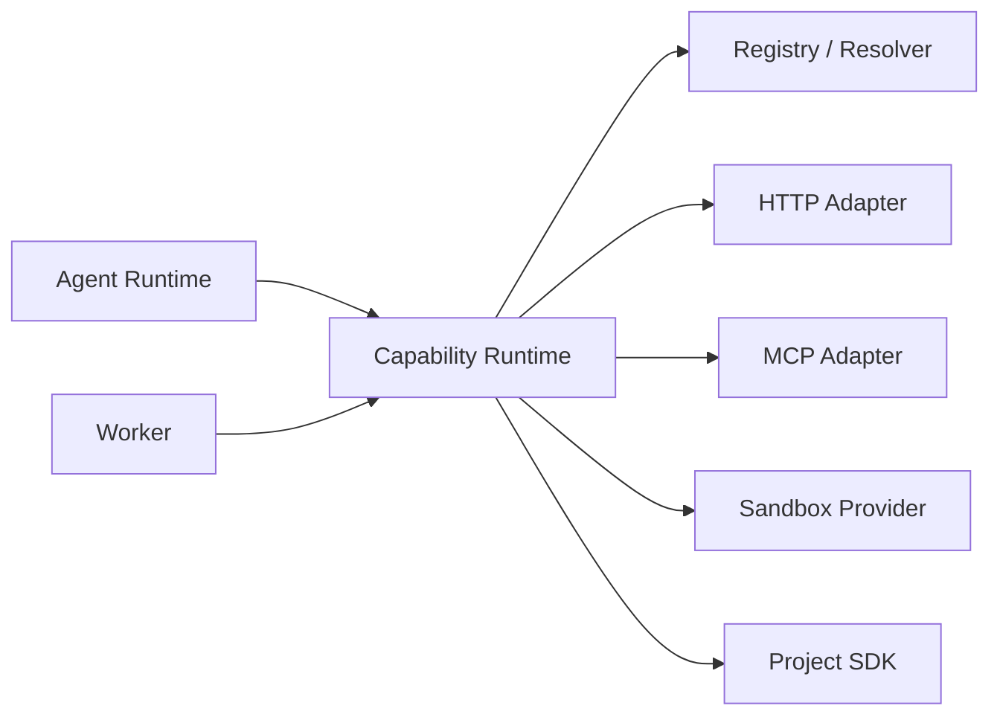
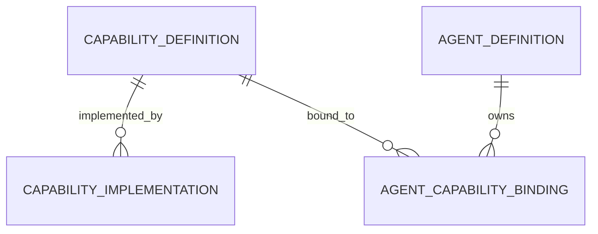

# Capability Runtime 模块需求与设计一体化文档

> **文档编号**: MOD-CAP-1.0  
> **文档版本**: v1.1  
> **创建日期**: 2026-09-10  
> **文档状态**: 设计草稿（V1.7 整改对齐）  
> **设计基线**: 《通用智能服务执行框架 V1.6 总体设计说明书》+《05-变更记录/V1.6-to-V1.7-整改对齐说明》（D01/D03）  
> **模板类型**: design-full（跨模块/架构核心模块）

**评审边界说明**：

- 需求评审：第 2 章，确认模块职责和边界；
- 设计评审：第 3-4 章，确认技术实现、数据、接口、DFX、部署；
- 本文只设计 Framework Core，不引入任何具体项目业务字段。

---

## 1. 文档控制

### 1.1 责任人

| 角色 | 姓名 | 职责范围 |
|---|---|---|
| 产品/架构负责人 | 待定 | 模块边界、需求与总体设计一致性 |
| 开发负责人 | 待定 | 技术方案与实现 |
| 测试负责人 | 待定 | 场景与 Gate |
| 安全/运维评审 | 按需 | 安全、可靠性、部署评审 |

### 1.2 修订历史

| 版本 | 日期 | 变更描述 |
|---|---|---|
| v0.1 | 2026-09-10 | 基于总体设计 V1.6 首次形成模块详细设计 |
| v1.1 | 2026-09-10 | V1.7 整改：回滚口径同步 D04；风险路由口径不变（D01/D03 见 05/06/10） |

---

## 2. 需求分析

### 2.1 需求概述

| 项目 | 内容 |
|---|---|
| 模块名称 | Capability Runtime |
| 模块ID | MOD-CAP |
| 需求类型 | 新框架模块设计 |
| 业务背景 | 框架需要统一承载 HTTP/API、MCP、Sandbox、Browser、项目 SDK 等执行能力，避免每个 Agent/Service 直接依赖协议和项目实现。 |
| 核心目标 | 以稳定 Capability Contract、统一 Registry/Resolver/Provider 执行所有业务能力并统一授权、风险、超时、重试、审计。 |
| 运行形态 | Python Framework Library；被 Agent Runtime 与 Worker 共用 |

### 2.2 痛点与价值

| 维度 | 内容 |
|---|---|
| 目标用户 | Builder/Integration Developer；Agent Runtime；Worker |
| 当前问题 | Tool/MCP/API 各有一套注册与授权会形成多套生态；业务 Service 直接绑定 URL/SDK 导致难以替换实现。 |
| 框架影响 | Capability 是 Framework 与外部业务系统最主要的执行接口。 |
| 预期价值 | Service/Agent 依赖“能做什么”，Provider 决定“怎么做”，实现可替换。 |

### 2.3 功能方案

#### 2.3.1 功能清单

| 功能ID | 功能名称 | 功能描述 | 优先级 | 来源 |
|---|---|---|---|---|
| FEAT-01 | Capability Registry | 注册稳定 Contract 与当前 Provider。 | P0 | 总体设计 V1.6 |
| FEAT-02 | Effective Resolver | 按 Agent/User/Tenant/Policy 计算可用 Capability 集合。 | P0 | 总体设计 V1.6 |
| FEAT-03 | 统一 Invoke | 统一调用 Provider、输入/输出校验、timeout、error mapping。 | P0 | 总体设计 V1.6 |
| FEAT-04 | 风险执行路由 | 高风险/worker_preferred 在 realtime 路径拒绝，要求 Execution。 | P0 | 总体设计 V1.6 |
| FEAT-05 | Async Capability | 统一 submit/status/result/cancel 语义。 | P0 | 总体设计 V1.6 |

#### 2.4 范围与边界

| 类别 | 内容 |
|---|---|
| 范围（In Scope） | Contract、Registry、授权解析、Provider SPI、风险路由、统一错误、Async Adapter。 |
| 非范围（Out of Scope） | 业务 Provider 的项目逻辑、完整 Workflow、独立 Tool Center。 |
| 前置假设 | Integration 负责注册项目 Capability；TrustedExecutionContext 已包含 actor/tenant/resource scope。 |
| 有意妥协/技术债 | V1 不做动态 Marketplace；Provider 通过部署时装配/Registry 注册。 |

### 2.5 验收条件

#### 2.5.1 业务规则与约束

| ID | 类型 | 描述 | 验证场景 |
|---|---|---|---|
| RULE-01 | 系统约束 | Agent Runtime 与 Worker 必须复用同一 Capability Registry/Resolver。 | S-01 |
| RULE-02 | 系统约束 | 未在 effective_capability_set 中的能力必须拒绝。 | E-01 |
| RULE-03 | 系统约束 | high/worker_preferred Capability 在 realtime mode 直接拒绝。 | S-02 |
| RULE-04 | 系统约束 | MCP/Sandbox/HTTP Provider 不得绕过统一授权和风险策略。 | E-02 |

#### 2.5.2 功能验收场景

**正常场景**

| 场景ID | 功能ID | 优先级 | 测试层级 | 关键真实边界 | 前置条件 | 操作步骤 | 预期结果 |
|---|---|---|---|---|---|---|---|
| S-01 | FEAT-03 | P0 | integration | Agent Runtime/Worker → CapabilityRuntime → Provider | 已完成基础配置 | 同一 resource.get 从实时和 Worker 路径调用 | 使用同一 Contract、Provider、Auth、错误语义 |
| S-02 | FEAT-04 | P0 | integration | Capability Policy | 已完成基础配置 | realtime 请求调用 worker_preferred 能力 | 返回 requires execution，不执行 Provider |
| S-03 | FEAT-01 | P0 | integration | Integration Loader → Capability Registry | 已完成基础配置 | 注册 Contract 与 Provider 后按 capability name resolve | 返回唯一有效 Provider；冲突注册 fail-fast |
| S-04 | FEAT-05 | P0 | integration | Capability Runtime → Async Provider → Worker | 已完成基础配置 | 调用 Async Capability 并依次执行 submit/status/result | external_task_ref 持久化，WAITING 后可恢复继续查询 |

**异常场景**

| 场景ID | 功能ID | 测试层级 | 关键真实边界 | 触发条件 | 系统行为 | 用户感知 |
|---|---|---|---|---|---|---|
| E-01 | FEAT-02 | integration | Effective Resolver | Agent 尝试调用未授权 capability | CAPABILITY_FORBIDDEN，Provider 不被调用 | 返回可识别错误，不泄露内部细节 |
| E-02 | FEAT-03 | integration | Provider Adapter | 某 MCP Provider 试图跳过 AuthContext/timeout | Contract test/architecture review 失败 | 返回可识别错误，不泄露内部细节 |

#### 2.5.3 非功能指标

| 指标ID | 指标名称 | 目标值 | 测量方法 |
|---|---|---|---|
| NFR-REL-01 | 可靠性 | 不得丢失/破坏框架权威状态；具体 SLA 待真实部署压测后确定 | 故障注入 + integration/E2E |
| NFR-SEC-01 | 安全边界 | 不得信任 LLM 提供的身份/权限/Host 路径等安全上下文 | Architecture Gate + integration |
| NFR-OBS-01 | 可观测性 | 关键操作必须携带 request_id/trace_id 或 execution_id | 日志/Trace 断言 |

性能/QPS/延迟阈值当前没有真实压测依据，本文不虚构固定数字；上线门槛在真实 Reference Integration 跑通后补充。

---

## 3. 技术设计

### 3.1 方案选型

#### 关键决策记录

| 决策点 | 选择 | 被否决项 | 理由 | 可逆性 |
|---|---|---|---|---|
| 产品模型 | Capability 统一业务能力 | Tool/MCP/API 多一级模型 | 减少概念和治理重复 | 难 |
| Provider 装配 | 部署时 Registry | 动态插件市场 | V1 简化安全/生命周期 | 易 |
| 风险路由 | Contract metadata | 按名字硬编码 shell/write | 适用于任意项目能力 | 中 |

#### 技术栈

| 类别 | 选型 | 版本 | 选型理由 |
|---|---|---|---|
| 语言 | Python | 3.12+ | 共享 Runtime |
| Contract | Pydantic v2 | 2.x | Schema/结果校验 |
| HTTP | httpx | 0.28+ | 异步 Provider |
| 扩展 | Protocol/SPI | Python | Provider 可替换 |

### 3.2 架构设计



#### 分层职责

| 层级 | 职责 |
|---|---|
| Contract | name/schema/risk/side_effect/idempotency |
| Registry | name → provider |
| Effective Resolver | Agent/User/Tenant/Policy 交集 |
| Runtime | 校验、模式判定、执行 |
| Provider | HTTP/MCP/Sandbox/SDK 具体实现 |

### 3.3 数据设计

> **统一数据库公共字段约束**：本模块凡新增 Framework 自建表，均必须包含 `is_deleted BOOLEAN NOT NULL DEFAULT FALSE`、`create_time TIMESTAMPTZ NOT NULL DEFAULT now()`、`update_time TIMESTAMPTZ NOT NULL DEFAULT now()`；Repository 默认过滤 `is_deleted=false`，删除默认逻辑删除。第三方自管理表（如 LangGraph Checkpointer）不修改其内部 Schema。


| 数据对象/表 | 关键字段 | 约束/索引 | 说明 |
|---|---|---|---|
| capability_definition | name、input/output schema、risk、side_effect、enabled | name unique | 稳定合同 |
| capability_implementation | capability_id、type、config_ref、revision、enabled | capability/type 索引 | 当前实现配置 |
| agent_capability_binding | agent_id、capability_id | 组合唯一 | Agent 可见能力 |


**ER 图**



### 3.4 接口设计

| 接口ID | 接口/函数 | 形态 | 说明 | 关联功能 |
|---|---|---|---|---|
| LIB-01 | CapabilityRuntime.invoke(name,input,context,mode) | 函数库 | 统一执行 | FEAT-03,FEAT-04 |
| LIB-02 | CapabilityRegistry.register(contract,provider) | 函数库 | 注册 | FEAT-01 |
| LIB-03 | CapabilityResolver.resolve(context,agent) | 函数库 | 计算有效能力 | FEAT-02 |
| SPI-01 | CapabilityProvider.invoke(...) -> CapabilityResult | SPI | 实现能力 | FEAT-03 |

Provider 只接收已经校验的 Contract/Input/TrustedExecutionContext；业务错误统一映射为 framework error code，不把各系统原始堆栈直接透出。

所有普通 HTTP JSON 接口必须复用统一响应 Envelope：

```json
{
  "code": "OK",
  "message": "success",
  "data": {},
  "request_id": "req-xxx",
  "timestamp": "2026-09-10T15:00:00+00:00"
}
```

SSE/WebSocket/文件流属于协议例外，但必须复用统一错误码 taxonomy 和 request/trace 关联策略。

### 3.5 质量实现方案

#### 可靠性

所有 Provider 有 timeout；retry 只对可重试错误且受 idempotency 约束；Provider 配置修改可直接生效。

#### 安全性

授权在 Provider 前完成；AuthContext 从 AuthRuntime 获取；高风险 realtime 拦截；日志不记录 Secret。

#### 可观测性

按 capability/provider/error_class 统计 call count、latency、retry、timeout、deny；trace span 覆盖外部调用。

#### 测试策略

```text
unit
→ 纯规则/状态机/转换

integration
→ Repository / Provider / Runtime 边界

E2E
→ 真实进程/API/数据库/用户可见结果

architecture
→ 依赖方向、Stateless、统一响应、Core Purity 等硬约束
```

---

## 4. 部署与运维

### 4.1 部署架构

不独立部署；Agent Runtime/Worker 进程内共享 package 和 Registry 解析逻辑。

### 4.2 发布与回滚

- 框架代码通过镜像/包版本发布；
- Schema 变化使用 Alembic expand → migrate → switch → contract；
- 只有 `Service` 采用草稿/已发布两态，`Agent` 统一 direct-effect + revision（V1.7 D04），不把代码发布和业务定义发布混成一套版本系统；
- 运行配置可直接生效时必须保留 revision/audit；
- 回滚不得恢复已经撤销的用户权限、Credential 或安全禁用状态。

### 4.3 监控告警

provider latency/errors/timeout、forbidden count、requires-execution count；阈值待定。

阈值当前统一标记为**待定**，由 Reference Integration 实测建立基线后配置。

---

## 5. 风险与依赖

### 5.1 项目依赖

| 依赖模块/团队 | 依赖内容 | 状态 | 风险等级 |
|---|---|---|---|
| AuthRuntime | 外部调用身份 | 按 Provider | 高 |
| Integration | Capability Provider | 扩展 | 中 |
| PostgreSQL | Definition/Implementation 配置 | 必需 | 中 |
| Sandbox/HTTP/MCP | 具体 Provider | 按功能 | 中 |

### 5.2 风险识别

| 风险ID | 类型 | 描述 | 概率 | 影响 | 应对措施 | 验证场景 |
|---|---|---|---|---|---|---|
| RISK-01 | 安全 | Provider 绕过统一治理 | 中 | 高 | Provider Contract tests + Registry 单入口 | E-02 |
| RISK-02 | 复杂度 | Capability 又被拆成 Tool/MCP 等多套菜单 | 中 | 高 | Console 只管理 Capability，Implementation 表示技术形态 | S-01 |

---

## 6. 需求追溯矩阵

| 来源 | 功能ID | 接口ID | 测试场景 | 测试层级 | 状态 |
|---|---|---|---|---|---|
| 总体设计 V1.6 | FEAT-01 | LIB-02 | S-03 | integration/E2E | 待实现 |
| 总体设计 V1.6 | FEAT-02 | LIB-03 | E-01 | integration/E2E | 待实现 |
| 总体设计 V1.6 | FEAT-03 | LIB-01, SPI-01 | S-01, E-02 | integration/E2E | 待实现 |
| 总体设计 V1.6 | FEAT-04 | LIB-01 | S-02 | integration/E2E | 待实现 |
| 总体设计 V1.6 | FEAT-05 | 内部契约 | S-04 | integration/E2E | 待实现 |

---

## Spec Compliance Matrix

| Spec/Rule | enforcement | 设计影响 | 设计落点 | 验证场景 | verifier | 状态 |
|---|---|---|---|---|---|---|
| framework#RULE-EXEC-001 | required | 风险路由在统一 Runtime | §3.4 | S-02/E-01 | `Capability policy integration` | applied |
| framework#RULE-TOOL-001 | required | Sandbox/MCP/HTTP 均是 Capability Provider | §3.2 | S-01 | `test_sandbox_boundary.py` | applied |
| framework#RULE-DB-001 | required | Capability 表含公共字段 | §3.3 | S-03 | `test_database_common_fields.py` | applied |

---

## 附录：术语表

| 术语 | 定义 |
|---|---|
| Framework Core | 与具体业务项目解耦的框架内核 |
| Integration | 具体项目对框架 SPI/Contract 的实现和配置 |
| Capability | 稳定的“系统能做什么”合同 |
| Execution | 一次可靠业务服务执行实例 |
| SoT | Source of Truth，权威事实源 |
| SPI | Service Provider Interface，扩展接口 |
| DFX | 面向可靠性、安全性、可测试性、可运维性等质量属性的设计 |

---
