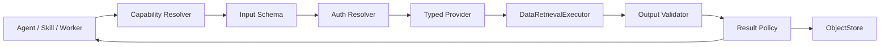
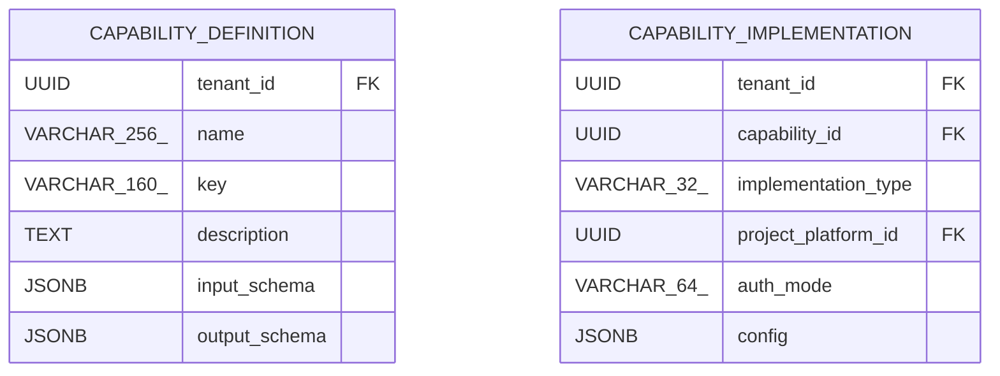

<!-- V1.11 module-split metadata -->
> **文档分档**：`Full`（模板 `design-full.md`）  
> **分档理由**：Capability Contract、多实现类型、自动分页/大结果  
> **文档边界**：本文件是该模块唯一详细设计事实源；DB Owner 与接口 Owner 必须落在本模块，不允许在其他模块重复定义。  
> **拆分原则**：仅按可独立评审/编码/验收的一级模块拆分；不按单表/单接口继续碎片化。

# Capability Runtime 模块需求与设计一体化文档

> **文档编号**: MOD-CAP-V1.11 模块分档拆分版
> **文档版本**: V1.11 模块分档拆分版
> **创建日期**: 2026-09-11
> **文档状态**: 设计基线草案（待仓库 Spec Context 绑定后进入正式评审）
> **模板**: `design-full.md`；生成流程按 `cf-task:align` 的复杂后端/架构模块路径执行。
> **上游基线**: V1.8 完整总体设计 + V6 完整 Playbook + Console V0.8 Final。


**评审边界说明**：
- 第 2 章是需求基线（What），禁止实现阶段自行改变领域语义；
- 第 3-4 章是设计基线（How），DB 与每个接口必须以本文为准；
- `Spec Compliance Matrix` 当前依据设计基线生成，因本轮未提供仓库 `spec-context.yml` 与代码目录，**不得声称已通过 cf-task:align 的 repo Spec Gate**；落码前必须在真实仓库执行 `refresh/catalog/bind`。


## 1. 文档控制

### 1.1 责任人

| 角色 | 姓名 | 职责范围 |
|---|---|---|
| 产品/架构负责人 | 待定 | 需求定义、领域边界、与总设/Playbook 一致性 |
| 开发负责人 | 待定 | 技术方案、DB/API、实现 |
| 测试负责人 | 待定 | S/E/B 场景、E2E Gate |
| 安全/运维 | 待定 | Secret、隔离、发布、监控 |

### 1.2 修订历史

| 版本 | 日期 | 作者 | 变更描述 |
|---|---|---|---|
| V1.11 模块分档拆分版 | 2026-09-11 | ChatGPT / 待项目负责人确认 | 按 cf-task:align + design-full 从最新完整总设/Playbook/交互稿重新生成；细化 DB 与全部接口 |

## 2. 需求分析

### 2.1 需求概述

| 项目 | 内容 |
|---|---|
| 模块名称 | Capability Runtime |
| 模块ID | MOD-CAP |
| 所属系统/产品线 | Fluxion 通用智能服务执行框架 |
| 需求类型 | 中大型功能 / 架构演进 |
| 业务背景 | 企业能力来自平台注册服务、HTTP、MCP、Sandbox；传统 Skill 重复处理认证、分页、超时、重试，且列表 API 单页限制导致脚本大量 for-loop。 |
| 核心目标 | 通过稳定 Contract + typed Implementation 统一调用、认证、自动分页、结果治理和错误语义。 |

### 2.2 痛点与价值

| 维度 | 内容 |
|---|---|
| 目标用户 | Builder、Skill Developer、Agent/Worker Runtime |
| 当前问题 | 协议/认证/分页散落 Skill 和 Tool，接口升级需批量修改 SOP；LLM 处理大结果浪费 token。 |
| 业务影响 | 维护高、错误处理不一致、分页死循环/漏数据、大结果挤爆 Context。 |
| 预期价值 | Skill/Agent/Worker 一次逻辑调用即可复用可靠底层能力。 |

### 2.3 功能方案

#### 2.3.1 功能清单

| 功能ID | 功能名称 | 功能描述 | 优先级 | 来源 |
|---|---|---|---|---|
| FEAT-CAP-01 | Contract | I/O Schema/risk/side effect/idempotency。 | P0 | 总体设计 |
| FEAT-CAP-02 | Typed Implementation | PLATFORM_SERVICE/HTTP/MCP/SANDBOX。 | P0 | 交互结论 |
| FEAT-CAP-03 | Auth/Discovery | 用户平台认证/共享 Secret/服务发现。 | P0 | ProjectPlatform |
| FEAT-CAP-04 | Invoke | 统一校验/deadline/retry/error。 | P0 | Runtime |
| FEAT-CAP-05 | DataRetrievalPolicy | Page/Offset/Cursor 自动分页与硬上限。 | P0 | 最新讨论 |
| FEAT-CAP-06 | Large Result | summary/artifact 化。 | P0 | Token/内存保护 |
| FEAT-CAP-07 | Control Test | Console 测试能力。 | P0 | Builder Journey |

### 2.4 范围与边界

| 类别 | 内容 |
|---|---|
| 范围（In Scope） | CapabilityDefinition/Implementation、Resolver/Executor/Provider、Auth resolve、分页、安全停止、结果策略、测试接口。 |
| 非范围（Out of Scope） | Skill Python 业务转换、Service Workflow、ProjectPlatform 用户 CRUD、异步任务产品模型。 |
| 前置假设 | 上游总设、公共 DB/API 规范、外部基础设施可用 |
| 有意妥协 / 技术债 | 无；未来扩展必须有真实旅程驱动 |

### 2.5 验收条件

#### 2.5.1 业务规则与约束

| ID | 类型 | 描述 | 验证场景 |
|---|---|---|---|
| RULE-CAP-01 | 实现类型 | V1 仅 PLATFORM_SERVICE/HTTP/MCP/SANDBOX。 | S-CAP-01 |
| RULE-CAP-02 | 平台 | 只有 PLATFORM_SERVICE 必须关联 ProjectPlatform。 | S-CAP-02 |
| RULE-CAP-03 | 异步 | Async 是执行语义，不是第五种 implementation type。 | S-CAP-03 |
| RULE-CAP-04 | 分页 | Skill/LLM 不维护 page for-loop；Executor 内完成。 | S-CAP-04 |
| RULE-CAP-05 | 终止 | 无 total/has_more/cursor 时 PAGE/OFFSET 至少支持 items==[] fallback，并总有 max_*。 | S-CAP-05 |
| RULE-CAP-06 | 大结果 | 默认禁止把 10000+ 原始行完整送 LLM。 | S-CAP-06 |

#### 2.5.2 功能验收场景

**正常场景**

| 场景ID | 功能ID | 优先级 | 测试层级 | 关键真实边界 | 归属 | 前置条件 | 操作步骤 | 预期结果 |
|---|---|---|---|---|---|---|---|---|
| S-CAP-01 | FEAT-CAP-02 | P0 | E2E | API→PG→Provider | 本模块 | 创建四类能力 | 测试 invoke | 按 typed config 调用且 Contract 一致 |
| S-CAP-02 | FEAT-CAP-03 | P0 | E2E | UserCredential→Registry→Service | 后置 → 模块 09 | Platform Service + 测试用户 | invoke | 按 User×ProjectPlatform 认证 |
| S-CAP-03 | FEAT-CAP-05 | P0 | E2E | Executor→100+ downstream calls | 本模块 | 10000 rows/100 page | Skill 一次 call | Executor 自动取完/按 policy artifact |
| S-CAP-04 | FEAT-CAP-05 | P0 | integration | 无 total page API | 本模块 | 最后满页后一页[] | 分页 | empty-list 终止，记录 termination_reason |
| S-CAP-05 | FEAT-CAP-06 | P0 | E2E | Capability→ObjectStore | 后置 → 模块 14 | 结果超过 inline threshold | invoke | 返回 summary + artifact_ref |

**异常场景**

| 场景ID | 功能ID | 测试层级 | 关键真实边界 | 归属 | 触发条件 | 系统行为 | 用户感知 |
|---|---|---|---|---|---|---|---|
| E-CAP-01 | FEAT-CAP-05 | integration | duplicate fingerprint | 本模块 | API 忽略 page 重复返回 | CAPABILITY_PAGINATION_LOOP | 不无限循环 |
| E-CAP-02 | FEAT-CAP-05 | integration | hard limits | 本模块 | 达到 max_pages/items/duration | CAPABILITY_PAGINATION_LIMIT | 调用方缩小查询 |
| E-CAP-03 | FEAT-CAP-04 | integration | output validator | 本模块 | Provider 返回脏结构 | CAPABILITY_OUTPUT_INVALID | 不把脏数据给 LLM |

#### 2.5.3 非功能指标

| 指标ID | 指标名称 | 目标值 | 测量方法 |
|---|---|---|---|
| NFR-REL-01 | 可靠执行 | 不得因单 Runtime/Worker 进程退出丢失权威状态 | SIGKILL/E2E |
| NFR-SEC-01 | 可信身份 | LLM/客户端不得覆盖 tenant/actor/secret | 安全测试 |
| NFR-OBS-01 | 可追踪 | 关键路径可按 request_id/trace_id/execution_id 定位 | 集成/E2E |

## 3. 技术设计

### 3.1 方案选型

#### 3.1.1 关键决策记录

| 决策点 | 选择 | 被否决项 | 理由 | 可逆性 |
|---|---|---|---|---|
| 能力模型 | Contract + typed Implementation | 每协议一套 Tool | 统一治理/替换 | 难 |
| 分页位置 | Capability Executor | Skill for-loop | 基础设施复用且可保护 | 难 |
| 大结果 | Artifact/Summary | 完整 JSON 进 LLM | 成本与稳定性 | 易 |

#### 3.1.2 技术栈

| 类别 | 选型 | 版本 | 选型理由 |
|---|---|---|---|
| 语言 | Python | 3.12+（仓库实际版本落码前确认） | 与 Agent/LLM 生态一致 |
| Web/API | FastAPI + Pydantic | 仓库实际版本确认 | 类型契约与异步 IO |
| ORM | SQLAlchemy 2 Async | 仓库实际版本确认 | 异步 PostgreSQL |
| 数据库 | PostgreSQL | 外部部署 | 业务 SoT |

### 3.2 架构设计



#### 3.2.1 模块职责分层

| 层级 | 职责 | 禁止事项 |
|---|---|---|
| Handler/API | 协议解析、DTO、权限入口、统一错误映射 | 业务逻辑/直接 SQL |
| Application Service | 用例编排、事务边界、领域校验 | 依赖具体 Web 框架 |
| Domain | 领域对象/规则 | 基础设施依赖 |
| Repository/Port | 持久化/外部能力抽象 | 泄露 Secret/跨领域修改 |
| Adapter | PostgreSQL/HTTP/MCP 等实现 | 改变领域语义 |

#### 3.2.2 外部依赖清单

| 外部系统/模块 | 依赖类型 | 协议/接口 | 超时/一致性 | 降级策略 |
|---|---|---|---|---|
| ProjectPlatform/Auth | PLATFORM_SERVICE | Library/DB | 实时 Credential | 缺失 fail closed |
| Service Registry | PLATFORM_SERVICE | 平台服务名 | deadline | 不可用返回 provider error |
| MCP/HTTP | Provider | 网络 | bounded retry | 统一错误 |
| Sandbox | Provider | Sandbox SPI | 隔离 | 策略拒绝 |
| ObjectStore | 大结果 | Port | 流式 | 失败 step error |

### 3.3 数据设计

#### 3.3.1 表清单

| 表名 | 职责 | 所有权 |
|---|---|---|
| capability_definition | 稳定 Capability Contract，描述系统能做什么，不绑定具体传输协议。 | Capability Runtime |
| capability_implementation | Capability 的可替换实现。V1 类型固定 PLATFORM_SERVICE/HTTP/MCP/SANDBOX。 | Capability Runtime |

#### 表 `capability_definition`

**职责**：稳定 Capability Contract，描述系统能做什么，不绑定具体传输协议。

| 字段名 | 类型 | 可空 | 默认值 | 索引 | 说明 |
|---|---|---|---|---|---|
| tenant_id | UUID | N |  | IDX | 租户 |
| name | VARCHAR(256) | N |  | IDX | 名称 |
| key | VARCHAR(160) | N |  | UK | 稳定标识 |
| description | TEXT | N |  |  | 业务语义 |
| input_schema | JSONB | N | {} |  | 输入 JSON Schema |
| output_schema | JSONB | N | {} |  | 输出 JSON Schema |
| risk_level | VARCHAR(16) | N | LOW | IDX | LOW/MEDIUM/HIGH |
| side_effect | BOOLEAN | N | FALSE |  | 是否有副作用 |
| idempotency_semantics | VARCHAR(64) | N | NONE |  | NONE/KEYED/NATURAL |
| enabled | BOOLEAN | N | TRUE | IDX | 全局紧急禁用 |
| revision | BIGINT | N | 1 |  | direct-effect revision |
| id | UUID | N | gen_random_uuid() | PK | 主键 |
| is_deleted | BOOLEAN | N | FALSE | IDX | 软删除标记；默认查询必须过滤 FALSE |
| create_time | TIMESTAMPTZ | N | CURRENT_TIMESTAMP |  | 创建时间 |
| update_time | TIMESTAMPTZ | N | CURRENT_TIMESTAMP |  | 更新时间；不可变表除外 |

**约束**

- UNIQUE (tenant_id,key) WHERE is_deleted=false
- input_schema/output_schema 必须合法

**索引设计**

| 索引名 | 类型 | 字段 | 使用场景 |
|---|---|---|---|
| uk_capability_definition_key | UNIQUE | tenant_id,key | Runtime 按 key resolve |
| idx_capability_definition_status | BTREE | tenant_id,enabled,risk_level,is_deleted | Catalog/安全过滤 |

#### 表 `capability_implementation`

**职责**：Capability 的可替换实现。V1 类型固定 PLATFORM_SERVICE/HTTP/MCP/SANDBOX。

| 字段名 | 类型 | 可空 | 默认值 | 索引 | 说明 |
|---|---|---|---|---|---|
| tenant_id | UUID | N |  | IDX | 租户 |
| capability_id | UUID | N |  | FK,IDX | 所属 Contract |
| implementation_type | VARCHAR(32) | N |  | IDX | PLATFORM_SERVICE/HTTP/MCP/SANDBOX |
| project_platform_id | UUID | Y |  | FK,IDX | 仅 PLATFORM_SERVICE 必填 |
| auth_mode | VARCHAR(64) | N | NONE |  | USER_PLATFORM/SHARED_SECRET/NONE |
| config | JSONB | N | {} |  | 按 type 的 discriminated config |
| shared_secret_ref | VARCHAR(512) | Y |  |  | HTTP/MCP 等共享 Secret 引用 |
| execution_policy | JSONB | N | {} |  | deadline/retry/large result 策略 |
| data_retrieval_policy | JSONB | Y |  |  | Page/Offset/Cursor typed policy |
| enabled | BOOLEAN | N | TRUE | IDX | 实现可用 |
| revision | BIGINT | N | 1 |  | 版本 |
| id | UUID | N | gen_random_uuid() | PK | 主键 |
| is_deleted | BOOLEAN | N | FALSE | IDX | 软删除标记；默认查询必须过滤 FALSE |
| create_time | TIMESTAMPTZ | N | CURRENT_TIMESTAMP |  | 创建时间 |
| update_time | TIMESTAMPTZ | N | CURRENT_TIMESTAMP |  | 更新时间；不可变表除外 |

**约束**

- CHECK: implementation_type=PLATFORM_SERVICE <=> project_platform_id IS NOT NULL
- PLATFORM_SERVICE 必须 auth_mode=USER_PLATFORM 或明确的项目 Provider 策略
- 同一 Capability V1 只允许一个 active implementation；未来多实现路由再扩展

**索引设计**

| 索引名 | 类型 | 字段 | 使用场景 |
|---|---|---|---|
| idx_capability_impl_active | BTREE | tenant_id,capability_id,enabled,is_deleted | Runtime resolve |
| idx_capability_impl_platform | BTREE | tenant_id,project_platform_id,is_deleted | 项目平台反查能力 |

#### 3.3.2 ER 图



#### 3.3.3 数据一致性与软删除规则

- 所有 Framework 自建可变表使用 `is_deleted/create_time/update_time`；查询默认过滤 `is_deleted=false`。
- FK 只引用同一租户可见对象；跨租户引用必须在 Application Service 拒绝。
- Secret/Token/Password 不落业务表明文，只保存 `secret_ref/credential_ref`。
- 不可变 Release/Snapshot/Artifact 使用 append-only；需要更新时新建记录。
- `revision` 用于 direct-effect 配置的乐观并发和审计，不等同于发布版本。

### 3.4 接口设计

#### 3.4.1 接口清单

| 接口ID | 名称 | 形态 | 方法/签名 | 路径/用途 |
|---|---|---|---|---|
| CAP-API-01 | Capability 列表 | HTTP | GET | /api/v1/capabilities |
| CAP-API-02 | 新增 Capability | HTTP | POST | /api/v1/capabilities |
| CAP-API-03 | Capability 详情 | HTTP | GET | /api/v1/capabilities/{capability_id} |
| CAP-API-04 | 编辑 Capability | HTTP | PUT | /api/v1/capabilities/{capability_id} |
| CAP-API-05 | 测试 Capability | HTTP | POST | /api/v1/capabilities/{capability_id}/test |
| CAP-API-06 | 读取 Capability Contract | HTTP | GET | /api/v1/capabilities/{capability_id}/contract |
| CAP-LIB-01 | 统一 Capability 调用 | Library | async def invoke_capability(ctx: TrustedExecutionContext, capability_key: str, input: dict, *, call_policy: CapabilityCallPolicy \| None = None) -> CapabilityResult |  |
| CAP-LIB-02 | 自动分页执行 | Library | async def retrieve_all(ctx: CapabilityCallContext, provider: Provider, policy: DataRetrievalPolicy, first_request: dict) -> RetrievalResult |  |

#### CAP-API-01: Capability 列表

**入口类型**：HTTP

**契约**：`GET /api/v1/capabilities`

**认证/授权**：None

**Query 参数**

| 参数 | 类型 | 必填 | 说明 |
|---|---|---|---|
| page | integer | N | 页码，从 1 开始；默认 1 |
| page_size | integer | N | 每页条数；默认 20，最大 100 |
| keyword | string | N | name/key |
| implementation_type | string | N | PLATFORM_SERVICE/HTTP/MCP/SANDBOX |
| risk_level | string | N | LOW/MEDIUM/HIGH |
| enabled | boolean | N | 状态 |

**请求体**：无。

**响应 data**

| 字段 | 类型 | 说明 |
|---|---|---|
| items | array<CapabilitySummary> | 含 implementation_type/project_platform/risk/idempotency/status |
| total | integer | 总数 |

**响应示例**

```json
{
  "code": 0,
  "message": "success",
  "data": {
    "items": [],
    "total": 1
  },
  "request_id": "req_xxx"
}
```

**错误码**

仅使用公共错误码。

**处理逻辑**

```text
查询 definition LEFT JOIN active implementation/project_platform；服务端分页，禁止 N+1。
```

#### CAP-API-02: 新增 Capability

**入口类型**：HTTP

**契约**：`POST /api/v1/capabilities`

**认证/授权**：None

**请求体**

| 参数 | 类型 | 必填 | 说明 |
|---|---|---|---|
| name | string | Y | 名称 |
| key | string | Y | 稳定 Key |
| description | string | Y | 业务语义 |
| input_schema | object | Y | JSON Schema |
| output_schema | object | Y | JSON Schema |
| risk_level | string | Y | LOW/MEDIUM/HIGH |
| side_effect | boolean | Y | 是否副作用 |
| idempotency_semantics | string | Y | NONE/KEYED/NATURAL |
| implementation | object | Y | typed implementation config |

**请求示例**

```json
{
  "name": "<name>",
  "key": "<key>",
  "description": "<description>",
  "input_schema": {},
  "output_schema": {},
  "risk_level": "<risk_level>",
  "side_effect": true,
  "idempotency_semantics": "<idempotency_semantics>",
  "implementation": {}
}
```

**响应 data**

| 字段 | 类型 | 说明 |
|---|---|---|
| id | uuid | Capability ID |
| implementation_id | uuid | Implementation ID |
| revision | integer | 1 |

**响应示例**

```json
{
  "code": 0,
  "message": "success",
  "data": {
    "id": "<id>",
    "implementation_id": "<implementation_id>",
    "revision": 1
  },
  "request_id": "req_xxx"
}
```

**错误码**

| 错误码 | 场景 | HTTP 状态 |
|---|---|---|
| CAPABILITY_KEY_EXISTS | key 重复 | 409 |
| CAPABILITY_SCHEMA_INVALID | I/O schema 非法 | 400 |
| CAPABILITY_IMPLEMENTATION_INVALID | 实现配置不满足类型约束 | 400 |

**处理逻辑**

```text
校验 Contract → discriminated union 校验 implementation → 校验 PLATFORM_SERVICE↔ProjectPlatform → transaction INSERT definition+implementation → audit。
```

#### CAP-API-03: Capability 详情

**入口类型**：HTTP

**契约**：`GET /api/v1/capabilities/{capability_id}`

**认证/授权**：None

**请求体**：无。

**响应 data**

| 字段 | 类型 | 说明 |
|---|---|---|
| definition | object | Contract |
| implementation | object | 脱敏实现配置 |
| project_platform | object | 仅 Platform Service |
| used_by_agents | integer | 直接绑定数 |
| used_by_skills | integer | Artifact 依赖数 |
| revision | integer | revision |

**响应示例**

```json
{
  "code": 0,
  "message": "success",
  "data": {
    "definition": {},
    "implementation": {},
    "project_platform": {},
    "used_by_agents": 1,
    "used_by_skills": 1,
    "revision": 1
  },
  "request_id": "req_xxx"
}
```

**错误码**

| 错误码 | 场景 | HTTP 状态 |
|---|---|---|
| CAPABILITY_NOT_FOUND | 不存在 | 404 |

**处理逻辑**

```text
tenant scoped definition → active implementation → 聚合反向依赖；shared_secret_ref 仅返回 configured 标记。
```

#### CAP-API-04: 编辑 Capability

**入口类型**：HTTP

**契约**：`PUT /api/v1/capabilities/{capability_id}`

**认证/授权**：None

**请求体**

| 参数 | 类型 | 必填 | 说明 |
|---|---|---|---|
| name | string | Y | 名称 |
| description | string | Y | 说明 |
| input_schema | object | Y | Schema |
| output_schema | object | Y | Schema |
| risk_level | string | Y | 风险 |
| side_effect | boolean | Y | 副作用 |
| idempotency_semantics | string | Y | 幂等语义 |
| implementation | object | Y | typed config |
| enabled | boolean | Y | 状态 |
| revision | integer | Y | 乐观锁 |

**请求示例**

```json
{
  "name": "<name>",
  "description": "<description>",
  "input_schema": {},
  "output_schema": {},
  "risk_level": "<risk_level>",
  "side_effect": true,
  "idempotency_semantics": "<idempotency_semantics>",
  "implementation": {},
  "enabled": true,
  "revision": 1
}
```

**响应 data**

| 字段 | 类型 | 说明 |
|---|---|---|
| id | uuid | ID |
| revision | integer | 新 revision |

**响应示例**

```json
{
  "code": 0,
  "message": "success",
  "data": {
    "id": "<id>",
    "revision": 1
  },
  "request_id": "req_xxx"
}
```

**错误码**

| 错误码 | 场景 | HTTP 状态 |
|---|---|---|
| CAPABILITY_NOT_FOUND | 不存在 | 404 |
| REVISION_CONFLICT | 冲突 | 409 |
| CAPABILITY_SCHEMA_BREAKING | Contract 破坏性变更且存在已发布 Service/Skill Artifact 引用 | 409 |

**处理逻辑**

```text
加载反向引用 → 校验 revision → 对破坏性 Schema 变更 fail-closed，要求新 Capability key 或显式迁移 → 更新 definition/implementation → audit。
```

#### CAP-API-05: 测试 Capability

**入口类型**：HTTP

**契约**：`POST /api/v1/capabilities/{capability_id}/test`

**认证/授权**：None

**请求体**

| 参数 | 类型 | 必填 | 说明 |
|---|---|---|---|
| input | object | Y | 按 input_schema |
| test_user_id | uuid | N | Platform Service 需要测试用户，Builder 只能选择有权限范围内测试用户 |
| result_mode | string | N | INLINE/SUMMARY/ARTIFACT；默认实现策略 |

**请求示例**

```json
{
  "input": {},
  "test_user_id": "<test_user_id>",
  "result_mode": "<result_mode>"
}
```

**响应 data**

| 字段 | 类型 | 说明 |
|---|---|---|
| ok | boolean | 成功 |
| output | object | 小结果；可能为空 |
| artifact_ref | string | 大结果 |
| stats | object | downstream_calls/pages/items/latency/retries |
| trace_id | string | 追踪 |

**响应示例**

```json
{
  "code": 0,
  "message": "success",
  "data": {
    "ok": true,
    "output": {},
    "artifact_ref": "<artifact_ref>",
    "stats": {},
    "trace_id": "<trace_id>"
  },
  "request_id": "req_xxx"
}
```

**错误码**

| 错误码 | 场景 | HTTP 状态 |
|---|---|---|
| CAPABILITY_INPUT_INVALID | 输入 schema 失败 | 400 |
| USER_PLATFORM_CREDENTIAL_MISSING | 测试用户平台认证缺失 | 409 |
| CAPABILITY_TIMEOUT | 超时 | 504 |
| CAPABILITY_PAGINATION_LIMIT | 达到分页安全上限 | 409 |
| CAPABILITY_OUTPUT_INVALID | 输出不符合 schema | 502 |

**处理逻辑**

```text
构造受控 TestExecutionContext → 调统一 CapabilityExecutor.invoke → 不绕过认证/分页/timeout → 返回脱敏 stats。
```

#### CAP-API-06: 读取 Capability Contract

**入口类型**：HTTP

**契约**：`GET /api/v1/capabilities/{capability_id}/contract`

**认证/授权**：None

**请求体**：无。

**响应 data**

| 字段 | 类型 | 说明 |
|---|---|---|
| key | string | key |
| description | string | 说明 |
| input_schema | object | 输入 |
| output_schema | object | 输出 |
| risk_level | string | 风险 |
| side_effect | boolean | 副作用 |
| idempotency_semantics | string | 幂等语义 |

**响应示例**

```json
{
  "code": 0,
  "message": "success",
  "data": {
    "key": "<key>",
    "description": "<description>",
    "input_schema": {},
    "output_schema": {},
    "risk_level": "<risk_level>",
    "side_effect": true,
    "idempotency_semantics": "<idempotency_semantics>"
  },
  "request_id": "req_xxx"
}
```

**错误码**

| 错误码 | 场景 | HTTP 状态 |
|---|---|---|
| CAPABILITY_NOT_FOUND | 不存在 | 404 |

**处理逻辑**

```text
只读 Contract，不返回 Implementation Secret/内部 URL 的敏感信息。
```

#### CAP-LIB-01: 统一 Capability 调用

**入口类型**：Library

**函数签名**

```python
async def invoke_capability(ctx: TrustedExecutionContext, capability_key: str, input: dict, *, call_policy: CapabilityCallPolicy | None = None) -> CapabilityResult
```

**入参**

| 参数 | 类型 | 必填 | 说明 |
|---|---|---|---|
| ctx | TrustedExecutionContext | Y | 可信身份/Execution 上下文 |
| capability_key | string | Y | 稳定 key |
| input | object | Y | 输入 |
| call_policy | CapabilityCallPolicy | N | 受控 deadline/result mode |

**返回**

| 字段 | 类型 | 说明 |
|---|---|---|
| result | CapabilityResult | inline/summary/artifact_ref/stats |

**异常/错误**

| 错误码 | 场景 | HTTP 状态 |
|---|---|---|
| CAPABILITY_DISABLED | 禁用 | 409 |
| CAPABILITY_INPUT_INVALID | 输入无效 | 400 |
| CAPABILITY_PROVIDER_ERROR | Provider 失败 | 502 |

**处理逻辑**

```text
effective access → load contract/impl → input validate → auth resolve → provider invoke → DataRetrievalExecutor → output validate → result policy → telemetry/audit。
```

**补充约束**：Skill/Agent/Worker/Dev Gateway 必须全部复用此语义。

#### CAP-LIB-02: 自动分页执行

**入口类型**：Library

**函数签名**

```python
async def retrieve_all(ctx: CapabilityCallContext, provider: Provider, policy: DataRetrievalPolicy, first_request: dict) -> RetrievalResult
```

**入参**

| 参数 | 类型 | 必填 | 说明 |
|---|---|---|---|
| policy | DataRetrievalPolicy | Y | PAGE/OFFSET/CURSOR typed policy |

**返回**

| 字段 | 类型 | 说明 |
|---|---|---|
| items | array\|artifact | 聚合结果 |
| stats | RetrievalStats | pages/items/duration/termination_reason |

**异常/错误**

| 错误码 | 场景 | HTTP 状态 |
|---|---|---|
| CAPABILITY_PAGINATION_LOOP | 重复页/游标循环 | 409 |
| CAPABILITY_PAGINATION_LIMIT | max_pages/items/duration | 409 |

**处理逻辑**

```text
优先显式 has_more/total/next_cursor → 可选 short-page → fixed empty-list fallback（PAGE/OFFSET）→ 每轮 hard limits + duplicate fingerprint。
```

**补充约束**：`len(items)<page_size` 只有明确配置 short_page_terminates=true 才可作为结束。

### 3.5 质量实现方案

#### 3.5.1 性能与容量

| 热点路径 | 负载量级 | 潜在瓶颈 | 实现方案 | 目标值 |
|---|---|---|---|---|
| 自动分页 | 10000+ rows | 内存/请求次数 | 每页流处理/可提前 artifact；硬上限；避免 LLM 逐页 | 实际 API 上限 |
| 列表/Contract resolve | 高频 | DB 查询 | key unique index + request/revision cache | 待压测 |

#### 3.5.2 可靠性

每个 downstream request 有 deadline；retry 只对安全错误；分页有 loop/limit 保护；Provider raw error 脱敏。

#### 3.5.3 安全性

可信 tenant/actor/context 服务端解析；输入做 Schema/语义校验；Secret 仅保存引用；审计中脱敏。

#### 3.5.4 可观测性

日志、Metrics、Trace 统一关联 request_id/trace_id；Execution 路径附带 execution_id/step_id；错误码稳定。

#### 3.5.5 测试策略

Domain/validator 单测；Repository/Provider 真 PG/外部 Stub 集成；核心用户旅程做 E2E；安全和崩溃恢复不得只靠 mock。

## 4. 部署与运维

### 4.1 部署架构

随其所属运行角色部署；PostgreSQL/Redis/Object Store/Secret Provider/OTel Backend 均为外部依赖，不打包进应用 Compose/Helm。

### 4.2 发布与回滚

DB 变更使用向前兼容迁移；应用支持滚动回滚；若涉及不可变 Release/Artifact，只切换 current 指针，不覆盖历史。

### 4.3 监控告警

至少监控请求/调用量、错误率、延迟、外部依赖失败、关键队列/执行积压和配置加载失败；阈值由环境基线确定。

### 4.4 数据迁移

若无历史生产数据则直接按新 Schema 建表；若已有部署，使用 Alembic 等可回滚/可前滚迁移，禁止运行时隐式改表。

## 5. 风险与依赖

| 风险ID | 描述 | 影响 | 应对措施 | 验证场景 |
|---|---|---|---|---|
| RISK-CAP-01 | 分页终止条件误判导致漏数据 | 高 | 显式协议优先 + short-page opt-in + empty fallback | S-CAP-04 |
| RISK-CAP-02 | 共享认证误用于 Platform Service | 高 | DB CHECK + typed validator | S-CAP-02 |

## 6. 需求追溯矩阵

| 功能ID | 接口ID | 验证场景 | 测试层级 | 状态 |
|---|---|---|---|---|
| FEAT-CAP-01 | CAP-API-01, CAP-API-02 | 见 §2.5 | E2E/integration | 待实现/评审 |
| FEAT-CAP-02 | CAP-API-02, CAP-API-03 | S-CAP-01 | E2E/integration | 待实现/评审 |
| FEAT-CAP-03 | CAP-API-03, CAP-API-04 | S-CAP-02 | E2E/integration | 待实现/评审 |
| FEAT-CAP-04 | CAP-API-04, CAP-API-05 | E-CAP-03 | E2E/integration | 待实现/评审 |
| FEAT-CAP-05 | CAP-API-05, CAP-API-06 | S-CAP-03, S-CAP-04, E-CAP-01, E-CAP-02 | E2E/integration | 待实现/评审 |
| FEAT-CAP-06 | CAP-API-06, CAP-LIB-01 | S-CAP-05 | E2E/integration | 待实现/评审 |
| FEAT-CAP-07 | CAP-LIB-01, CAP-LIB-02 | 见 §2.5 | E2E/integration | 待实现/评审 |

## Spec Compliance Matrix

| Spec/Rule | enforcement | 设计影响 | 设计落点 | 验证场景 | 状态/N/A 理由 |
|---|---|---|---|---|---|
| DESIGN/CAP#RULE-CAP-01 | design-baseline | 约束实现与验收 | §2.5 RULE-CAP-01 / §3 | S/E/B 场景 | applied；仓库 spec-context 待绑定 |
| DESIGN/CAP#RULE-CAP-02 | design-baseline | 约束实现与验收 | §2.5 RULE-CAP-02 / §3 | S/E/B 场景 | applied；仓库 spec-context 待绑定 |
| DESIGN/CAP#RULE-CAP-03 | design-baseline | 约束实现与验收 | §2.5 RULE-CAP-03 / §3 | S/E/B 场景 | applied；仓库 spec-context 待绑定 |
| DESIGN/CAP#RULE-CAP-04 | design-baseline | 约束实现与验收 | §2.5 RULE-CAP-04 / §3 | S/E/B 场景 | applied；仓库 spec-context 待绑定 |
| DESIGN/CAP#RULE-CAP-05 | design-baseline | 约束实现与验收 | §2.5 RULE-CAP-05 / §3 | S/E/B 场景 | applied；仓库 spec-context 待绑定 |
| DESIGN/CAP#RULE-CAP-06 | design-baseline | 约束实现与验收 | §2.5 RULE-CAP-06 / §3 | S/E/B 场景 | applied；仓库 spec-context 待绑定 |

## 附录 A：接口与 DB 落码检查清单

- [ ] 每个 HTTP Endpoint 已有 DTO、鉴权、错误码、处理逻辑、测试。
- [ ] 每个 Library/CLI 接口有稳定签名和异常语义。
- [ ] 每张表字段、类型、NULL、默认值、唯一约束、索引、软删除策略已落实迁移。
- [ ] Request/Response 字段不接受客户端传入可信 tenant/actor/credential。
- [ ] 列表接口使用服务端分页，避免无界返回。
- [ ] 修改类接口有 revision/冲突语义；高风险/副作用路径满足幂等和审计。
- [ ] 仓库 Spec Context 已 refresh/catalog/bind 且 required Rules 映射到 S/E/B verifier。
