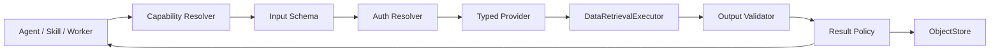
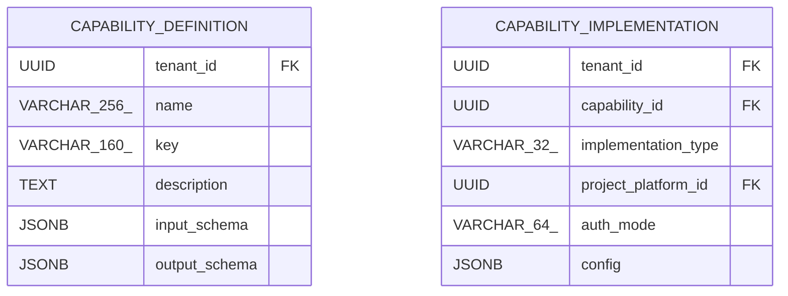

<!-- V1.11 module-split metadata -->
> **文档分档**：`Full`（模板 `design-full.md`）  
> **分档理由**：Capability Contract、多实现类型、自动分页/大结果  
> **文档边界**：本文件是该模块唯一详细设计事实源；DB Owner 与接口 Owner 必须落在本模块，不允许在其他模块重复定义。  
> **拆分原则**：仅按可独立评审/编码/验收的一级模块拆分；不按单表/单接口继续碎片化。

# Capability Runtime 模块需求与设计一体化文档

> **文档编号**: MOD-CAP-V1.13
> **文档版本**: V1.13
> **创建日期**: 2026-09-11
> **文档状态**: 设计基线草案（待仓库 Spec Context 绑定后进入正式评审）
> **模板**: `design-full.md`；生成流程按 `cf-task:align` 的复杂后端/架构模块路径执行。
> **上游基线**: V1.8 完整总体设计 + V6 完整 Playbook + Console V0.8 Final。


**评审边界说明**：
- 第 2 章是需求基线（What），禁止实现阶段自行改变领域语义；
- 第 3-4 章是设计基线（How），DB 与每个接口必须以本文为准；
- `Spec Compliance Matrix` 当前依据设计基线生成，因本轮未提供仓库 `spec-context.yml` 与代码目录，**不得声称已通过 cf-task:align 的 repo Spec Gate**；落码前必须在真实仓库执行 `refresh/catalog/bind`。


## 1. 文档控制

### 1.1 责任人

| 角色 | 姓名 | 职责范围 |
|---|---|---|
| 产品/架构负责人 | 待定 | 需求定义、领域边界、与总设/Playbook 一致性 |
| 开发负责人 | 待定 | 技术方案、DB/API、实现 |
| 测试负责人 | 待定 | S/E/B 场景、E2E Gate |
| 安全/运维 | 待定 | Secret、隔离、发布、监控 |

### 1.2 修订历史

| 版本 | 日期 | 作者 | 变更描述 |
|---|---|---|---|
| V1.11 模块分档拆分版 | 2026-09-11 | ChatGPT / 待项目负责人确认 | 按 cf-task:align + design-full 从最新完整总设/Playbook/交互稿重新生成；细化 DB 与全部接口 |
| V1.13 第三轮 Review 修复 | 2026-09-12 | Claude Code | Capability Contract 补 execution_characteristic/authorization_requirement/error_semantics 与 side_effect 四值枚举；新增 implementation 判别式 Schema；artifact_id 收敛；内置工具注册幂等；Skill 入口契约与 call 返回形态冻结 |
| V1.13.1 第四轮合理性修复 | 2026-09-12 | Claude Code | D1：判定元数据收敛为 `invocation_policy(DIRECT/EXECUTION_ONLY)`，删除 `execution_characteristic`/`authorization_requirement`/`error_semantics` 三列与全部 DTO/示例/索引引用，凭据来源唯一由 `implementation.auth_mode` 表达（config 内 `auth_mode` 键删除）；重写 `contract:direct-invocation-predicate` 为唯一事实源并加「write/destructive 或 HIGH 不得 DIRECT」兜底 CHECK；B10：PLATFORM_SERVICE config 必填寻址字段 `service_key`+`path`+`method`；B15(a)：CAP-API-05 `result_mode` 默认值分路径冻结（Skill 直调固定 `INLINE`，新增 `CAPABILITY_RESULT_MODE_NOT_ALLOWED`）；内置 6 工具默认元数据与 S-CAP-07 同步新字段 |

## 2. 需求分析

### 2.1 需求概述

| 项目 | 内容 |
|---|---|
| 模块名称 | Capability Runtime |
| 模块ID | MOD-CAP |
| 所属系统/产品线 | Fluxion 通用智能服务执行框架 |
| 需求类型 | 中大型功能 / 架构演进 |
| 业务背景 | 企业能力来自平台注册服务、HTTP、MCP、Sandbox；传统 Skill 重复处理认证、分页、超时、重试，且列表 API 单页限制导致脚本大量 for-loop。 |
| 核心目标 | 通过稳定 Contract + typed Implementation 统一调用、认证、自动分页、结果治理和错误语义。 |

### 2.2 痛点与价值

| 维度 | 内容 |
|---|---|
| 目标用户 | Builder、Skill Developer、Agent/Worker Runtime |
| 当前问题 | 协议/认证/分页散落 Skill 和 Tool，接口升级需批量修改 SOP；LLM 处理大结果浪费 token。 |
| 业务影响 | 维护高、错误处理不一致、分页死循环/漏数据、大结果挤爆 Context。 |
| 预期价值 | Skill/Agent/Worker 一次逻辑调用即可复用可靠底层能力。 |

### 2.3 功能方案

#### 2.3.1 功能清单

| 功能ID | 功能名称 | 功能描述 | 优先级 | 来源 |
|---|---|---|---|---|
| FEAT-CAP-01 | Contract | I/O Schema/risk/side effect/idempotency。 | P0 | 总体设计 |
| FEAT-CAP-02 | Typed Implementation | PLATFORM_SERVICE/HTTP/MCP/SANDBOX。 | P0 | 交互结论 |
| FEAT-CAP-03 | Auth/Discovery | 用户平台认证/共享 Secret/服务发现。 | P0 | ProjectPlatform |
| FEAT-CAP-04 | Invoke | 统一校验/deadline/retry/error。 | P0 | Runtime |
| FEAT-CAP-05 | DataRetrievalPolicy | Page/Offset/Cursor 自动分页与硬上限。 | P0 | 最新讨论 |
| FEAT-CAP-06 | Large Result | summary/artifact 化。 | P0 | Token/内存保护 |
| FEAT-CAP-07 | Control Test | Console 测试能力。 | P0 | Builder Journey |

### 2.4 范围与边界

| 类别 | 内容 |
|---|---|
| 范围（In Scope） | CapabilityDefinition/Implementation、Resolver/Executor/Provider、Auth resolve、分页、安全停止、结果策略、测试接口。 |
| 非范围（Out of Scope） | Skill Python 业务转换、Service Workflow、ProjectPlatform 用户 CRUD、异步任务产品模型。 |
| 非范围（Out of Scope，V2 后置） | Browser Adapter（总设 §5.4 的特殊资源型 Capability/Executor：Browser Pool/Profile lease/并发与清理）——V1 不实现，Capability 实现类型固定为 Platform Service/HTTP/MCP/Sandbox；V2 按真实场景引入，SPI 不变。 |
| 前置假设 | 上游总设、公共 DB/API 规范、外部基础设施可用 |
| 有意妥协 / 技术债 | 无；未来扩展必须有真实旅程驱动 |

### 2.5 验收条件

#### 2.5.1 业务规则与约束

| ID | 类型 | 描述 | 验证场景 |
|---|---|---|---|
| RULE-CAP-01 | 实现类型 | V1 仅 PLATFORM_SERVICE/HTTP/MCP/SANDBOX。 | S-CAP-01 |
| RULE-CAP-02 | 平台 | 只有 PLATFORM_SERVICE 必须关联 ProjectPlatform。 | S-CAP-02 |
| RULE-CAP-03 | 异步 | Async 是执行语义，不是第五种 implementation type。 | S-CAP-08 |
| RULE-CAP-04 | 分页 | Skill/LLM 不维护 page for-loop；Executor 内完成。 | S-CAP-03 |
| RULE-CAP-05 | 终止 | 无 total/has_more/cursor 时 PAGE/OFFSET 至少支持 items==[] fallback，并总有 max_*。 | S-CAP-04, E-CAP-01, E-CAP-02 |
| RULE-CAP-06 | 大结果 | 默认禁止把 10000+ 原始行完整送 LLM。 | S-CAP-06 |
| RULE-CAP-07 | 分流元数据 | Contract 必须声明 side_effect(none/read/write/destructive)、risk_level(LOW/MEDIUM/HIGH)、invocation_policy(DIRECT/EXECUTION_ONLY)；直调判定只比较 `CAP-API-06` 返回的派生字段 `direct_invocation`（谓词唯一事实源为 `contract:direct-invocation-predicate`）；write/destructive、HIGH 或 EXECUTION_ONLY 一律不得直调。凭据来源只由 `capability_implementation.auth_mode` 声明。 | S-CAP-07 |

#### 2.5.2 功能验收场景

**正常场景**

| 场景ID | 功能ID | 优先级 | 测试层级 | 关键真实边界 | 归属 | 前置条件 | 操作步骤 | 预期结果 |
|---|---|---|---|---|---|---|---|---|
| S-CAP-06 | FEAT-CAP-06 | P1 | integration | 大结果不进 LLM | 本模块 | 能力返回 10000+ 行 | Agent 调用该能力 | LLM 仅收 summary/artifact_id，原始行外置 |
| S-CAP-01 | FEAT-CAP-02 | P0 | E2E | API→PG→Provider | 本模块 | 创建四类能力 | 测试 invoke | 按 typed config 调用且 Contract 一致 |
| S-CAP-02 | FEAT-CAP-03 | P0 | E2E | UserCredential→Registry→Service | 后置 → 模块 09 | Platform Service + 测试用户 | invoke | 按 User×ProjectPlatform 认证 |
| S-CAP-03 | FEAT-CAP-05 | P0 | E2E | Executor→100+ downstream calls | 本模块 | 10000 rows/100 page | Skill 一次 call | Executor 自动取完/按 policy artifact |
| S-CAP-04 | FEAT-CAP-05 | P0 | integration | 无 total page API | 本模块 | 最后满页后一页[] | 分页 | empty-list 终止，记录 termination_reason |
| S-CAP-05 | FEAT-CAP-06 | P0 | E2E | Capability→ObjectStore | 后置 → 模块 14 | 结果超过 inline threshold | invoke | 返回 summary + artifact_id (+stats)，不返回 object_ref |
| S-CAP-07 | FEAT-CAP-01 | P0 | integration | Contract 元数据→Agent 直调分流 | 本模块 | 一个 `read` + `invocation_policy=EXECUTION_ONLY`（只读但长跑）的 Capability；`shell.execute` 默认 `destructive`/HIGH/`EXECUTION_ONLY` | Agent 意图命中后尝试直调 | 不直调：只读但 `EXECUTION_ONLY` 仍产出 ExecutionProposal 而非直接执行；Agent 直调路径返回 CAPABILITY_CONFIRMATION_REQUIRED(409)；CAP-API-06 返回 `invocation_policy`/`risk_level`/`side_effect` 且 `direct_invocation=REQUIRES_EXECUTION` |
| S-CAP-08 | FEAT-CAP-04 | P1 | integration | async 执行语义 vs 实现类型 | 本模块 | 实现声明 async 执行语义，Skill 也尝试直调同一 Capability | Service Step 以 execution_mode=ASYNC 提交；Skill 路径调同一 Capability | 仅 Step 路径提交成功（CAP-LIB-03，同 operation_id 幂等）；Skill 直调得确定错误；async 不出现在 implementation_type 枚举 |

**异常场景**

| 场景ID | 功能ID | 测试层级 | 关键真实边界 | 归属 | 触发条件 | 系统行为 | 用户感知 |
|---|---|---|---|---|---|---|---|
| E-CAP-01 | FEAT-CAP-05 | integration | duplicate fingerprint | 本模块 | API 忽略 page 重复返回 | CAPABILITY_PAGINATION_LOOP | 不无限循环 |
| E-CAP-02 | FEAT-CAP-05 | integration | hard limits | 本模块 | 达到 max_pages/items/duration | CAPABILITY_PAGINATION_LIMIT | 调用方缩小查询 |
| E-CAP-03 | FEAT-CAP-04 | integration | output validator | 本模块 | Provider 返回脏结构 | CAPABILITY_OUTPUT_INVALID | 不把脏数据给 LLM |

#### 2.5.3 非功能指标

| 指标ID | 指标名称 | 目标值 | 测量方法 |
|---|---|---|---|
| NFR-REL-01 | 可靠执行 | 不得因单 Runtime/Worker 进程退出丢失权威状态 | SIGKILL/E2E |
| NFR-SEC-01 | 可信身份 | LLM/客户端不得覆盖 tenant/actor/secret | 安全测试 |
| NFR-OBS-01 | 可追踪 | 关键路径可按 request_id/trace_id/execution_id 定位 | 集成/E2E |

## 3. 技术设计

### 3.1 方案选型

#### 3.1.1 关键决策记录

| 决策点 | 选择 | 被否决项 | 理由 | 可逆性 |
|---|---|---|---|---|
| 能力模型 | Contract + typed Implementation | 每协议一套 Tool | 统一治理/替换 | 难 |
| 分页位置 | Capability Executor | Skill for-loop | 基础设施复用且可保护 | 难 |
| 大结果 | Artifact/Summary | 完整 JSON 进 LLM | 成本与稳定性 | 易 |

#### 3.1.2 技术栈

| 类别 | 选型 | 版本 | 选型理由 |
|---|---|---|---|
| 语言 | Python | 3.12+（仓库实际版本落码前确认） | 与 Agent/LLM 生态一致 |
| Web/API | FastAPI + Pydantic | 仓库实际版本确认 | 类型契约与异步 IO |
| ORM | SQLAlchemy 2 Async | 仓库实际版本确认 | 异步 PostgreSQL |
| 数据库 | PostgreSQL | 外部部署 | 业务 SoT |

### 3.2 架构设计



#### 3.2.1 模块职责分层

| 层级 | 职责 | 禁止事项 |
|---|---|---|
| Handler/API | 协议解析、DTO、权限入口、统一错误映射 | 业务逻辑/直接 SQL |
| Application Service | 用例编排、事务边界、领域校验 | 依赖具体 Web 框架 |
| Domain | 领域对象/规则 | 基础设施依赖 |
| Repository/Port | 持久化/外部能力抽象 | 泄露 Secret/跨领域修改 |
| Adapter | PostgreSQL/HTTP/MCP 等实现 | 改变领域语义 |

#### 3.2.2 外部依赖清单

| 外部系统/模块 | 依赖类型 | 协议/接口 | 超时/一致性 | 降级策略 |
|---|---|---|---|---|
| ProjectPlatform/Auth | PLATFORM_SERVICE | Library/DB | 实时 Credential | 缺失 fail closed |
| Service Registry | PLATFORM_SERVICE | 平台服务名 | deadline | 不可用返回 provider error |
| MCP/HTTP | Provider | 网络 | bounded retry | 统一错误 |
| Sandbox | Provider | Sandbox SPI | 隔离 | 策略拒绝 |
| ObjectStore | 大结果 | Port | 流式 | 失败 step error |

### 3.3 数据设计

#### 3.3.1 表清单

| 表名 | 职责 | 所有权 |
|---|---|---|
| capability_definition | 稳定 Capability Contract，描述系统能做什么，不绑定具体传输协议。 | Capability Runtime |
| capability_implementation | Capability 的可替换实现。V1 类型固定 PLATFORM_SERVICE/HTTP/MCP/SANDBOX。 | Capability Runtime |

#### 表 `capability_definition`

**职责**：稳定 Capability Contract，描述系统能做什么，不绑定具体传输协议。

| 字段名 | 类型 | 可空 | 默认值 | 索引 | 说明 |
|---|---|---|---|---|---|
| tenant_id | UUID | N |  | IDX | 租户 |
| name | VARCHAR(256) | N |  | IDX | 名称 |
| key | VARCHAR(160) | N |  | UK | 稳定标识 |
| description | TEXT | N |  |  | 业务语义 |
| input_schema | JSONB | N | {} |  | 输入 JSON Schema |
| output_schema | JSONB | N | {} |  | 输出 JSON Schema |
| risk_level | VARCHAR(16) | N | LOW | IDX | LOW/MEDIUM/HIGH |
| side_effect | VARCHAR(16) | N | none |  | 副作用四值枚举 none/read/write/destructive（总设 §5.1）；high/destructive → 强制 Human Checkpoint |
| invocation_policy | VARCHAR(16) | N | DIRECT | IDX | 直调分流的**唯一结论元数据**：DIRECT=可被 Agent/Skill 短时直调；EXECUTION_ONLY=必须经 Execution/Worker 可靠执行（只读但长跑、需人工检查点、外部副作用等一律归此列）。内置高风险工具（shell.execute 等）默认 EXECUTION_ONLY |
| idempotency_semantics | VARCHAR(64) | N | NONE |  | NONE=重复调用会产生额外副作用，**禁止自动重试**；KEYED=调用方提供稳定幂等键（本平台固定用 `effect:{operation_id}`）后重复调用安全，可自动重试；NATURAL=天然幂等（如只读查询），可自动重试。消费方为模块 06 RULE-WORK-04 的自动重试合取条件 |
| enabled | BOOLEAN | N | TRUE | IDX | 全局紧急禁用 |
| revision | BIGINT | N | 1 |  | direct-effect revision |
| id | UUID | N | gen_random_uuid() | PK | 主键 |
| is_deleted | BOOLEAN | N | FALSE | IDX | 软删除标记；默认查询必须过滤 FALSE |
| create_time | TIMESTAMPTZ | N | CURRENT_TIMESTAMP |  | 创建时间 |
| update_time | TIMESTAMPTZ | N | CURRENT_TIMESTAMP |  | 更新时间 |

**约束**

- UNIQUE (tenant_id,key) WHERE is_deleted=false
- input_schema/output_schema 必须合法
- CHECK: side_effect IN ('none','read','write','destructive')
- CHECK: risk_level IN ('LOW','MEDIUM','HIGH')
- CHECK: invocation_policy IN ('DIRECT','EXECUTION_ONLY')
- CHECK: invocation_policy='EXECUTION_ONLY' OR (side_effect IN ('none','read') AND risk_level IN ('LOW','MEDIUM'))——安全兜底：`write`/`destructive` 或 `HIGH` 一律不得为 `DIRECT`

**同名不同表说明**：`capability_definition.execution_policy`（VARCHAR 枚举，直调结论）与 `capability_implementation.execution_policy`（JSONB，deadline/retry 策略）同名但不同表、不同语义；CAP-API-02/04 中前者是顶层字段、后者只在 `implementation.` 之下，落码与前端控件绑定不得混用。

**直调分流判定（唯一事实源）**：判定结果是 Contract 元数据的纯函数，只在本模块定义一次；其他模块与调用方（模块 04 的 Agent Tool、Skill 宿主、模块 06 的 Worker、Dev Gateway）**只比较 CAP-API-06 返回的 `direct_invocation`**，不得各自复刻下列谓词。

<!-- contract:direct-invocation-predicate -->
```text
direct_invocation = ALLOWED
  当且仅当 side_effect IN ('none','read')
       AND risk_level IN ('LOW','MEDIUM')
       AND invocation_policy = 'DIRECT'

否则 direct_invocation = REQUIRES_EXECUTION
  —— 命中 write/destructive、HIGH、EXECUTION_ONLY
  —— 该谓词是 Contract 元数据的纯函数，与调用方身份/凭据无关（凭据缺失是调用期错误，
     不是分流结论）；凭据来源由 capability_implementation.auth_mode 单独声明。
  —— Agent 直调路径返回 CAPABILITY_CONFIRMATION_REQUIRED(409)，并转 ExecutionProposal；
     在 Execution 内仍受 Service confirmation_rules 与人工检查点约束。
```
<!-- /contract:direct-invocation-predicate -->

**索引设计**

| 索引名 | 类型 | 字段 | 使用场景 |
|---|---|---|---|
| uk_capability_definition_key | UNIQUE | tenant_id,key | Runtime 按 key resolve |
| idx_capability_definition_status | BTREE | tenant_id,enabled,risk_level,invocation_policy,is_deleted | Catalog/安全过滤/直调分流筛选 |

#### 表 `capability_implementation`

**职责**：Capability 的可替换实现。V1 类型固定 PLATFORM_SERVICE/HTTP/MCP/SANDBOX。

| 字段名 | 类型 | 可空 | 默认值 | 索引 | 说明 |
|---|---|---|---|---|---|
| tenant_id | UUID | N |  | IDX | 租户 |
| capability_id | UUID | N |  | FK,IDX | 所属 Contract |
| implementation_type | VARCHAR(32) | N |  | IDX | PLATFORM_SERVICE/HTTP/MCP/SANDBOX |
| project_platform_id | UUID | Y |  | FK,IDX | 仅 PLATFORM_SERVICE 必填 |
| auth_mode | VARCHAR(64) | N | NONE |  | **凭据来源的唯一事实源**：USER_PLATFORM=需 User×ProjectPlatform 凭据；SHARED_SECRET=需共享 Secret；NONE=登录用户即可。definition 侧不再重复声明授权/凭据要求 |
| config | JSONB | N | {} |  | 按 type 的 discriminated config；只放「实现身份/映射」字段，见 contract:capability-implementation-schema；**不得包含 `auth_mode` 键** |
| shared_secret_ref | VARCHAR(512) | Y |  |  | HTTP/MCP 等共享 Secret 引用 |
| execution_policy | JSONB | N | {} |  | deadline/retry/backoff；超时与重试唯一归属，不进 config |
| data_retrieval_policy | JSONB | Y |  |  | Page/Offset/Cursor typed policy |
| enabled | BOOLEAN | N | TRUE | IDX | 实现可用 |
| revision | BIGINT | N | 1 |  | 版本 |
| id | UUID | N | gen_random_uuid() | PK | 主键 |
| is_deleted | BOOLEAN | N | FALSE | IDX | 软删除标记；默认查询必须过滤 FALSE |
| create_time | TIMESTAMPTZ | N | CURRENT_TIMESTAMP |  | 创建时间 |
| update_time | TIMESTAMPTZ | N | CURRENT_TIMESTAMP |  | 更新时间 |

**约束**

- CHECK: implementation_type=PLATFORM_SERVICE <=> project_platform_id IS NOT NULL
- PLATFORM_SERVICE 必须 auth_mode=USER_PLATFORM 或明确的项目 Provider 策略
- 同一 Capability V1 只允许一个 active implementation；未来多实现路由再扩展

**索引设计**

| 索引名 | 类型 | 字段 | 使用场景 |
|---|---|---|---|
| idx_capability_impl_active | BTREE | tenant_id,capability_id,enabled,is_deleted | Runtime resolve |
| idx_capability_impl_platform | BTREE | tenant_id,project_platform_id,is_deleted | 项目平台反查能力 |

**三列归属（T-21 裁决）**：`config` 只承载下表中「实现身份/映射」字段；**超时与重试不放 config**，一律进 implementation 的 `execution_policy`（`deadline_ms` 必填、`max_retries` 默认 0、`backoff_ms`）；`data_retrieval_policy` 沿用既有 Data Retrieval Policy 字段，仅列表类 Capability 需要。三列的字段名即 CAP-API-02/04 的 `implementation.*` 字段名与前端控件名（D14），前端控件集合以本 contract 块为唯一事实源。

**凭据来源单点声明（D1 收敛）**：`auth_mode` **只以 `capability_implementation.auth_mode` 列为事实源**，不得在 `config` 内重复声明同名键；definition 侧不再声明授权/凭据要求。CAP-API-02/04 的 `implementation.auth_mode` 必须与列取值一致，`config.auth_mode` 一律拒绝（`CAPABILITY_IMPLEMENTATION_INVALID`）。

<!-- contract:capability-implementation-schema -->
```json
{
  "$schema": "https://json-schema.org/draft/2020-12/schema",
  "title": "capability-implementation-schema",
  "description": "四类 implementation 的判别式 Schema；判据=implementation_type，字段名即 CAP-API-02/04 的 implementation.* 与前端控件名。",
  "type": "object",
  "oneOf": [
    {
      "title": "PLATFORM_SERVICE",
      "type": "object",
      "additionalProperties": false,
      "required": ["implementation_type", "config", "execution_policy"],
      "properties": {
        "implementation_type": { "const": "PLATFORM_SERVICE" },
        "config": {
          "type": "object",
          "additionalProperties": false,
          "required": ["project_platform_id", "service_key", "path", "method"],
          "properties": {
            "project_platform_id": { "type": "string", "format": "uuid", "description": "必填；实现身份" },
            "service_key": { "type": "string", "minLength": 1, "description": "必填；平台服务名（注册发现寻址键，对齐交互稿「平台服务名」控件）" },
            "path": { "type": "string", "minLength": 1, "description": "必填；接口路径（对齐交互稿「接口路径」控件）" },
            "method": { "enum": ["GET", "POST", "PUT", "PATCH", "DELETE"], "description": "必填；请求方法（对齐交互稿「请求方法」控件）" },
            "request_mapping": { "type": "object", "description": "Contract input → 平台请求字段映射" },
            "response_mapping": { "type": "object", "description": "平台响应 → Contract output 字段映射" }
          }
        },
        "execution_policy": { "$ref": "#/$defs/execution_policy" },
        "data_retrieval_policy": { "$ref": "#/$defs/data_retrieval_policy" }
      }
    },
    {
      "title": "HTTP",
      "type": "object",
      "additionalProperties": false,
      "required": ["implementation_type", "config", "execution_policy"],
      "properties": {
        "implementation_type": { "const": "HTTP" },
        "config": {
          "type": "object",
          "additionalProperties": false,
          "required": ["method", "base_url", "path"],
          "properties": {
            "method": { "enum": ["GET", "POST", "PUT", "PATCH", "DELETE"] },
            "base_url": { "type": "string", "format": "uri" },
            "path": { "type": "string" },
            "query_mapping": { "type": "object", "description": "input → query 字段映射" },
            "body_mapping": { "type": "object", "description": "input → body 字段映射" },
            "header_keys": {
              "type": "array",
              "items": { "type": "string" },
              "description": "引用 Secret 的 header 键名；值在调用时经 Secret Provider 解析，配置中不放明文"
            },
            "response_mapping": { "type": "object", "description": "响应 → Contract output 字段映射" }
          }
        },
        "execution_policy": { "$ref": "#/$defs/execution_policy" },
        "data_retrieval_policy": { "$ref": "#/$defs/data_retrieval_policy" }
      }
    },
    {
      "title": "MCP",
      "type": "object",
      "additionalProperties": false,
      "required": ["implementation_type", "config", "execution_policy"],
      "properties": {
        "implementation_type": { "const": "MCP" },
        "config": {
          "type": "object",
          "additionalProperties": false,
          "required": ["server_key", "tool_name"],
          "properties": {
            "server_key": { "type": "string", "minLength": 1, "description": "MCP server 注册键" },
            "tool_name": { "type": "string", "minLength": 1 },
            "input_mapping": { "type": "object" },
            "response_mapping": { "type": "object" }
          }
        },
        "execution_policy": { "$ref": "#/$defs/execution_policy" },
        "data_retrieval_policy": { "$ref": "#/$defs/data_retrieval_policy" }
      }
    },
    {
      "title": "SANDBOX",
      "type": "object",
      "additionalProperties": false,
      "required": ["implementation_type", "config", "execution_policy"],
      "properties": {
        "implementation_type": { "const": "SANDBOX" },
        "config": {
          "type": "object",
          "additionalProperties": false,
          "required": ["capability_key", "entrypoint"],
          "properties": {
            "capability_key": { "type": "string", "minLength": 1, "description": "Sandbox 能力键；内置工具为 filesystem.read/write/edit/glob/grep 与 shell.execute" },
            "entrypoint": { "type": "string", "minLength": 1 },
            "argv": { "type": "array", "items": { "type": "string" } },
            "env_allowlist": { "type": "array", "items": { "type": "string" }, "description": "允许透传的环境变量名白名单；不含 Secret" },
            "network_policy": { "enum": ["DENY", "ALLOWLIST"], "default": "DENY" },
            "max_output_bytes": { "type": "integer", "minimum": 1 }
          }
        },
        "execution_policy": { "$ref": "#/$defs/execution_policy" },
        "data_retrieval_policy": { "$ref": "#/$defs/data_retrieval_policy" }
      }
    }
  ],
  "$defs": {
    "execution_policy": {
      "type": "object",
      "additionalProperties": false,
      "required": ["deadline_ms"],
      "description": "**implementation 层**的超时/重试策略（与 capability_definition.execution_policy 的同名枚举无关）；只在 implementation.* 之下出现",
      "properties": {
        "deadline_ms": { "type": "integer", "minimum": 1, "description": "必填；本实现的硬截止" },
        "max_retries": { "type": "integer", "minimum": 0, "default": 0, "description": "Provider 层重试上限：同一次 invoke 内部的立即重试；与 Worker 层的步骤重试（模块 06 RULE-WORK-04 按错误分类判定）互不替代" },
        "backoff_ms": { "type": "integer", "minimum": 0, "description": "Provider 层立即重试的退避基数；仅在该次调用被判定为可重试（错误分类 + 幂等合取条件）时生效" }
      }
    },
    "data_retrieval_policy": {
      "type": "object",
      "additionalProperties": false,
      "description": "沿用既有 Data Retrieval Policy 字段；仅列表类 Capability 需要",
      "required": ["pagination_type"],
      "properties": {
        "pagination_type": { "enum": ["PAGE", "OFFSET", "CURSOR"] },
        "request_mapping": { "type": "object", "description": "page_param/page_size_param/start_page/page_size/cursor_param" },
        "response_mapping": { "type": "object", "description": "items_path/total_path/has_more_path/next_cursor_path" },
        "termination": { "type": "object", "description": "empty_items/short_page/use_total；short_page 默认 true，可显式关闭" },
        "limits": { "type": "object", "description": "max_pages/max_items/max_duration_ms/duplicate_page_detection" }
      }
    }
  }
}
```
<!-- /contract:capability-implementation-schema -->

#### 3.3.2 ER 图



#### 3.3.3 数据一致性与软删除规则

- 所有 Framework 自建可变表使用 `is_deleted/create_time/update_time`；查询默认过滤 `is_deleted=false`。
- FK 只引用同一租户可见对象；跨租户引用必须在 Application Service 拒绝。
- Secret/Token/Password 不落业务表明文，只保存 `secret_ref/credential_ref`。
- 不可变 Release/Snapshot/Artifact 使用 append-only；需要更新时新建记录。
- `revision` 用于 direct-effect 配置的乐观并发和审计，不等同于发布版本。

### 3.4 接口设计

#### 3.4.1 接口清单

| 接口ID | 名称 | 形态 | 方法/签名 | 路径/用途 |
|---|---|---|---|---|
| CAP-API-01 | Capability 列表 | HTTP | GET | /api/v1/capabilities |
| CAP-API-02 | 新增 Capability | HTTP | POST | /api/v1/capabilities |
| CAP-API-03 | Capability 详情 | HTTP | GET | /api/v1/capabilities/{capability_id} |
| CAP-API-04 | 编辑 Capability | HTTP | PUT | /api/v1/capabilities/{capability_id} |
| CAP-API-05 | 测试 Capability | HTTP | POST | /api/v1/capabilities/{capability_id}/test |
| CAP-API-06 | 读取 Capability Contract | HTTP | GET | /api/v1/capabilities/{capability_id}/contract |
| CAP-LIB-01 | 统一 Capability 调用 | Library | async def invoke_capability(ctx: TrustedExecutionContext, capability_key: str, input: dict, *, call_policy: CapabilityCallPolicy \| None = None) -> CapabilityResult |  |
| CAP-LIB-02 | 自动分页执行 | Library | async def retrieve_all(ctx: CapabilityCallContext, provider: Provider, policy: DataRetrievalPolicy, first_request: dict) -> RetrievalResult | 分页聚合；仅由 CAP-LIB-01 内部调用，Skill/Agent 不直接使用 |
| CAP-LIB-03 | 异步任务提交 | Library | async def submit_async(ctx: CapabilityCallContext, capability_key: str, input: JsonObject, *, idempotency_key: str) -> AsyncTaskHandle |  |
| CAP-LIB-04 | 异步任务状态/结果/取消 | Library | async def status_async(ctx, handle) / result_async(ctx, handle) / cancel_async(ctx, handle) |  |
| CAP-LIB-05 | 内置 Sandbox 工具注册 | Library | def register_builtin_sandbox_tools() -> None |  |

**异步 Provider 类型（CORE-LIB-05 上下文与模块 05 持久行共同承接）**

CapabilityCallContext={trusted tenant_id/actor_user_id/execution_id/operation_id/projection/test_mode/deadline}；AsyncTaskHandle={operation_id,capability_key,provider_key,provider_type,provider_locator,project_platform_id,external_task_id?,idempotency_key,input_hash}。Worker 从 async_task_run 行和 execution 的可信关联重建，验证 tenant/actor 一致，Secret 通过当前 Credential 每次解析；handle 不允许携带身份覆盖字段。provider_locator 固定本任务提交路由，不冻结全局 Implementation；后来新任务可用 current implementation，旧任务使用原路由。

#### CAP-LIB-03: 异步提交与未知结果对账

**认证/授权**：`ctx` 必须是宿主从 `async_task_run` 行与 Execution 可信关联重建的 CapabilityCallContext；tenant/actor 一致性校验通过才可提交，Secret 每次按当前 Credential 解析；handle 不得携带身份覆盖字段。调用方仅为 Worker（Service Step 声明 `execution_mode=ASYNC`），Skill 路径不得调用。

**签名**：`async def submit_async(ctx: CapabilityCallContext, capability_key: str, input: JsonObject, *, idempotency_key: str) -> AsyncTaskHandle`

外部提交前事务插入 SUBMITTING（operation_id/input_hash/provider_locator/actor/key 全部持久，external_task_id=null）。同 operation_id 已有行则恢复，不创建新任务。提交确认后写 external_task_id/status=SUBMITTED；明确未受理可按策略有界重试同 key，响应丢失/进程崩溃置 SUBMITTED_UNKNOWN。

`async def reconcile_async(ctx: CapabilityCallContext, handle: AsyncTaskHandle) -> ReconcileResult`：用 Provider.query_by_idempotency_key(ctx, locator, key) 对账，返回 FOUND(handle)/NOT_ACCEPTED/UNKNOWN。只有可证明未受理，或 Provider 明确保证同 key 提交去重时才能重试 submit；无此能力按 next_poll_at 等待有限对账，到 reconcile_deadline/max_poll_attempts 后 FAILED(SUBMISSION_UNCONFIRMED)，上下文/用户提示外部状态仍未知。无需伪造外部 task ID。

#### CAP-LIB-04: 异步状态/结果/取消

**认证/授权**：`ctx` 与 CAP-LIB-03 同源（可信重建 + tenant/actor 一致校验）；调用前验证当前用户/grant/平台/Capability enabled，再取当前认证并保持 `provider_locator`；调用方仅为 Worker。

**签名**：`status_async(ctx: CapabilityCallContext, handle: AsyncTaskHandle) -> AsyncStatus`、`result_async(ctx, handle) -> CapabilityResult`、`cancel_async(ctx, handle) -> CancelOutcome`（均 async）。必须 external_task_id 非空；状态是 SUBMITTED/RUNNING/SUCCEEDED/FAILED/CANCELLED/UNKNOWN，取消返回 CONFIRMED/UNSUPPORTED/UNKNOWN，不能用 bool 假称已取消。当前用户/grant/平台/Capability enabled 验证后取当前认证，定位保持 provider_locator；被停用时仍允许受限清理 cancel，不能继续新副作用。无路由明确 PROVIDER_ROUTE_UNAVAILABLE，禁止替换新 provider 猜测任务。

**测试模式**：ctx.test_mode=DRY_RUN 强制已注册 dry/mock Provider，子 Skill/Agent 调用继承；未注册报 DRY_RUN_UNSUPPORTED。result/submit/status 不允许真实调用降级。

**Built-in Sandbox Capability（总设 §2.4/P14 承接）**：6 个内置工具复用 Capability 授权/风险/审计/Worker 路径，不新增 Tool 平台：`filesystem.read`、`filesystem.write`、`filesystem.edit`、`filesystem.glob`、`filesystem.grep`、`shell.execute`。

**注册归属与幂等（CAP-LIB-05）**：进程启动时由本模块经领域 Application 调用 `register_builtin_sandbox_tools()`，**以 stable key upsert**——只 INSERT 缺失行，不重建、不删除。

**注册幂等与冲突策略**：

- upsert 只补齐缺失行；**不得覆盖管理员管理的字段**：`enabled`、`risk_level`、`side_effect`、definition 的 `execution_policy`（直调结论），以及 implementation 的 `execution_policy`（超时/重试）。已存在的行原样保留。
- 与模块 12 Integration Seed 同名（同 tenant+key）时 **Seed 优先**：本次 upsert 记冲突并 fail-fast（启动失败，不静默跳过），冲突明细写日志与指标。
- 注册失败（DB 不可用/约束冲突）时进程 `readiness=degraded` 并暴露指标 `capability_builtin_registration_failed`；已注册的 Capability 目录仍可读。
- 默认 `enabled=false`，由管理员在 Console 显式启用后再配置风险等级/超时/Sandbox policy。

**内置工具默认元数据**（首次 INSERT 的默认值，管理员可覆盖）：

| 工具 | side_effect | risk_level | execution_policy |
|---|---|---|---|
| filesystem.read | read | LOW | DIRECT |
| filesystem.glob | read | LOW | DIRECT |
| filesystem.grep | read | LOW | DIRECT |
| filesystem.write | write | MEDIUM | EXECUTION_ONLY |
| filesystem.edit | write | MEDIUM | EXECUTION_ONLY |
| shell.execute | destructive | HIGH | EXECUTION_ONLY |

Sandbox 隔离不可用等失败码由模块 13 承接；失败分类不在此声明，由运行时 Provider 错误按《01-架构与规范/10-错误码与错误分类基线》归类（模块 06 RULE-WORK-04 消费）。默认 `idempotency_semantics=NONE`（`shell.execute` 为 `NONE`）。

#### CAP-API-01: Capability 列表

**入口类型**：HTTP

**契约**：`GET /api/v1/capabilities`

**认证/授权**：登录会话（中间件解析，RULE-API-02）；Builder + Admin（ADR-021）

**Query 参数**

| 参数 | 类型 | 必填 | 说明 |
|---|---|---|---|
| page | integer | N | 页码，从 1 开始；默认 1 |
| page_size | integer | N | 每页条数；默认 20，最大 100 |
| keyword | string | N | name/key |
| implementation_type | string | N | PLATFORM_SERVICE/HTTP/MCP/SANDBOX |
| risk_level | string | N | LOW/MEDIUM/HIGH |
| invocation_policy | string | N | DIRECT/EXECUTION_ONLY |
| enabled | boolean | N | 状态 |

**请求体**：无。

**响应 data**

| 字段 | 类型 | 说明 |
|---|---|---|
| items | array<CapabilitySummary> | 含 implementation_type/project_platform/risk/idempotency/status |
| total | integer | 总数 |

**响应示例**

```json
{
  "code": 0,
  "message": "success",
  "data": {
    "items": [],
    "total": 1
  },
  "request_id": "req_xxx"
}
```

**错误码**

仅使用公共错误码。

**处理逻辑**

```text
查询 definition LEFT JOIN active implementation/project_platform；服务端分页，禁止 N+1。
```

#### CAP-API-02: 新增 Capability

**入口类型**：HTTP

**契约**：`POST /api/v1/capabilities`

**认证/授权**：登录会话（中间件解析，RULE-API-02）；Builder + Admin（ADR-021）

**请求体**

| 参数 | 类型 | 必填 | 说明 |
|---|---|---|---|
| name | string | Y | 名称 |
| key | string | Y | 稳定 Key |
| description | string | Y | 业务语义 |
| input_schema | object | Y | JSON Schema |
| output_schema | object | Y | JSON Schema |
| risk_level | string | Y | LOW/MEDIUM/HIGH |
| side_effect | string | Y | none/read/write/destructive（四值枚举，总设 §5.1） |
| execution_policy | string | N | DIRECT/EXECUTION_ONLY；默认 DIRECT。write/destructive 或 HIGH 时服务端强制 EXECUTION_ONLY（非法组合 400） |
| idempotency_semantics | string | Y | NONE/KEYED/NATURAL |
| implementation | object | Y | 判别式 typed implementation，Schema 见 §3.3 的 contract:capability-implementation-schema（implementation_type + config + execution_policy + 可选 data_retrieval_policy）；凭据来源只由 `implementation.auth_mode` 声明 |

**请求示例**

```json
{
  "name": "<name>",
  "key": "<key>",
  "description": "<description>",
  "input_schema": {},
  "output_schema": {},
  "risk_level": "<risk_level>",
  "side_effect": "read",
  "invocation_policy": "DIRECT",
  "idempotency_semantics": "<idempotency_semantics>",
  "implementation": {}
}
```

**响应 data**

| 字段 | 类型 | 说明 |
|---|---|---|
| id | uuid | Capability ID |
| implementation_id | uuid | Implementation ID |
| revision | integer | 1 |

**响应示例**

```json
{
  "code": 0,
  "message": "success",
  "data": {
    "id": "<id>",
    "implementation_id": "<implementation_id>",
    "revision": 1
  },
  "request_id": "req_xxx"
}
```

**错误码**

| 错误码 | 场景 | HTTP 状态 |
|---|---|---|
| CAPABILITY_KEY_EXISTS | key 重复 | 409 |
| CAPABILITY_SCHEMA_INVALID | I/O schema 非法 | 400 |
| CAPABILITY_CONTRACT_INVALID | side_effect/risk_level/invocation_policy 枚举非法，或 `invocation_policy=DIRECT` 与 `write`/`destructive`/`HIGH` 组合 | 400 |
| CAPABILITY_IMPLEMENTATION_INVALID | 实现配置不满足类型约束，或 `config` 含 `auth_mode` 重复声明 | 400 |

**处理逻辑**

```text
校验 Contract（side_effect 四值 + risk_level + invocation_policy 枚举 + 「write/destructive 或 HIGH 不得 DIRECT」安全兜底，与 DB CHECK 同源）→ 按 capability-implementation-schema 判别式校验 implementation（deadline_ms 必须在 implementation.execution_policy，不得混入 config；PLATFORM_SERVICE 必须含 service_key/path/method 寻址字段；config 不得含 auth_mode）→ 校验 PLATFORM_SERVICE↔ProjectPlatform → transaction INSERT definition+implementation → audit。
```

#### CAP-API-03: Capability 详情

**入口类型**：HTTP

**契约**：`GET /api/v1/capabilities/{capability_id}`

**认证/授权**：登录会话（中间件解析，RULE-API-02）；Builder + Admin（ADR-021）

**请求体**：无。

**响应 data**

| 字段 | 类型 | 说明 |
|---|---|---|
| definition | object | Contract；字段同 CAP-API-06 响应（含 risk_level、side_effect 四值枚举、execution_policy），无授权/凭据与错误语义字段 |
| implementation | object | 脱敏实现配置；结构按 §3.3 的 contract:capability-implementation-schema（implementation_type/config/execution_policy/data_retrieval_policy），含凭据来源 `auth_mode`（唯一声明处） |
| project_platform | object | 仅 Platform Service |
| used_by_agents | integer | 直接绑定数 |
| used_by_skills | integer | Artifact 依赖数 |
| revision | integer | revision |

**响应示例**

```json
{
  "code": 0,
  "message": "success",
  "data": {
    "definition": {},
    "implementation": {},
    "project_platform": {},
    "used_by_agents": 1,
    "used_by_skills": 1,
    "revision": 1
  },
  "request_id": "req_xxx"
}
```

**错误码**

| 错误码 | 场景 | HTTP 状态 |
|---|---|---|
| CAPABILITY_NOT_FOUND | 不存在 | 404 |

**处理逻辑**

```text
tenant scoped definition → active implementation → 聚合反向依赖；shared_secret_ref 仅返回 configured 标记。
```

#### CAP-API-04: 编辑 Capability

**入口类型**：HTTP

**契约**：`PUT /api/v1/capabilities/{capability_id}`

**认证/授权**：登录会话（中间件解析，RULE-API-02）；Builder + Admin（ADR-021）

**请求体**

| 参数 | 类型 | 必填 | 说明 |
|---|---|---|---|
| name | string | Y | 名称 |
| description | string | Y | 说明 |
| input_schema | object | Y | Schema |
| output_schema | object | Y | Schema |
| risk_level | string | Y | 风险 |
| side_effect | string | Y | none/read/write/destructive |
| execution_policy | string | N | DIRECT/EXECUTION_ONLY；默认 DIRECT。write/destructive 或 HIGH 时服务端强制 EXECUTION_ONLY（非法组合 400） |
| idempotency_semantics | string | Y | 幂等语义 |
| implementation | object | Y | 判别式 typed implementation，Schema 见 §3.3 的 contract:capability-implementation-schema；凭据来源只由 `implementation.auth_mode` 声明 |
| enabled | boolean | Y | 状态 |
| revision | integer | Y | 乐观锁 |

**请求示例**

```json
{
  "name": "<name>",
  "description": "<description>",
  "input_schema": {},
  "output_schema": {},
  "risk_level": "<risk_level>",
  "side_effect": "read",
  "invocation_policy": "DIRECT",
  "idempotency_semantics": "<idempotency_semantics>",
  "implementation": {},
  "enabled": true,
  "revision": 1
}
```

**响应 data**

| 字段 | 类型 | 说明 |
|---|---|---|
| id | uuid | ID |
| revision | integer | 新 revision |

**响应示例**

```json
{
  "code": 0,
  "message": "success",
  "data": {
    "id": "<id>",
    "revision": 1
  },
  "request_id": "req_xxx"
}
```

**错误码**

| 错误码 | 场景 | HTTP 状态 |
|---|---|---|
| CAPABILITY_NOT_FOUND | 不存在 | 404 |
| CAPABILITY_CONTRACT_INVALID | side_effect/risk_level/invocation_policy 枚举非法，或 `invocation_policy=DIRECT` 与 `write`/`destructive`/`HIGH` 组合 | 400 |
| REVISION_CONFLICT | 冲突 | 409 |
| CAPABILITY_SCHEMA_BREAKING | Contract 破坏性变更且存在已发布 Service/Skill Artifact 引用 | 409 |

**处理逻辑**

```text
加载反向引用 → 校验 revision → 对破坏性 Schema 变更 fail-closed，要求新 Capability key 或显式迁移 → 更新 definition/implementation → audit。
```

#### CAP-API-05: 测试 Capability

**入口类型**：HTTP

**契约**：`POST /api/v1/capabilities/{capability_id}/test`

**认证/授权**：登录会话（中间件解析，RULE-API-02）；Builder + Admin（ADR-021）

**请求体**

| 参数 | 类型 | 必填 | 说明 |
|---|---|---|---|
| input | object | Y | 按 input_schema |
| test_user_id | uuid | N | Platform Service 需要测试用户，Builder 只能选择有权限范围内测试用户 |
| result_mode | string | N | INLINE/SUMMARY/ARTIFACT；**默认值分路径冻结（B15a）**：Skill 直调路径（SDK/宿主）固定 `INLINE`（ADR-034 禁用大结果外置）；Provider 级默认 `SUMMARY` 只对非 Skill 调用（Agent Tool / Worker Step）生效；调用方显式传入时以传入值为准，但 Skill 路径传非 `INLINE` 一律 `CAPABILITY_RESULT_MODE_NOT_ALLOWED`(422) |

**请求示例**

```json
{
  "input": {},
  "test_user_id": "<test_user_id>",
  "result_mode": "<result_mode>"
}
```

**响应 data**

| 字段 | 类型 | 说明 |
|---|---|---|
| ok | boolean | 成功 |
| output | object | 归一化输出或大结果外置时的 summary；可能为空 |
| artifact_id | uuid | 大结果外置时的产物身份（= 模块 05 `artifact.id` 主键）；外置时返回 summary + artifact_id (+stats) |
| stats | object | downstream_calls/pages/items/latency/retries |
| trace_id | string | 追踪 |

**响应示例**

```json
{
  "code": 0,
  "message": "success",
  "data": {
    "ok": true,
    "output": {},
    "artifact_id": "<artifact_id>",
    "stats": {},
    "trace_id": "<trace_id>"
  },
  "request_id": "req_xxx"
}
```

**错误码**

| 错误码 | 场景 | HTTP 状态 |
|---|---|---|
| CAPABILITY_INPUT_INVALID | 输入 schema 失败 | 400 |
| USER_PLATFORM_CREDENTIAL_MISSING | 测试用户平台认证缺失 | 409 |
| CAPABILITY_TIMEOUT | 超时 | 504 |
| CAPABILITY_PAGINATION_LIMIT | 达到分页安全上限 | 409 |
| CAPABILITY_OUTPUT_INVALID | 输出不符合 schema | 502 |
| CAPABILITY_RESULT_MODE_NOT_ALLOWED | Skill 直调路径传入非 `INLINE` 的 result_mode | 422 |

**处理逻辑**

```text
构造受控 TestExecutionContext → 调统一 CapabilityExecutor.invoke → 不绕过认证/分页/timeout → 返回脱敏 stats。result_mode 解析：Skill 直调路径强制 INLINE（非 INLINE 直接 422），非 Skill 路径缺省 SUMMARY。
```

#### CAP-API-06: 读取 Capability Contract

**入口类型**：HTTP

**契约**：`GET /api/v1/capabilities/{capability_id}/contract`

**认证/授权**：登录会话（中间件解析，RULE-API-02）；Builder + Admin（ADR-021）

**请求体**：无。

**响应 data**

| 字段 | 类型 | 说明 |
|---|---|---|
| key | string | key |
| description | string | 说明 |
| input_schema | object | 输入 |
| output_schema | object | 输出 |
| risk_level | string | LOW/MEDIUM/HIGH |
| side_effect | string | none/read/write/destructive |
| execution_policy | string | DIRECT/EXECUTION_ONLY（直调结论的声明值） |
| direct_invocation | string | **派生结论（唯一判定入口）**：`ALLOWED` / `REQUIRES_EXECUTION`，按 `contract:direct-invocation-predicate` 计算。调用方（Agent Tool、Skill 宿主、Worker、Dev Gateway）**只比较本字段**，不自行复刻谓词 |
| idempotency_semantics | string | 幂等语义 |

**响应示例**

```json
{
  "code": 0,
  "message": "success",
  "data": {
    "key": "<key>",
    "description": "<description>",
    "input_schema": {},
    "output_schema": {},
    "risk_level": "<risk_level>",
    "side_effect": "read",
    "invocation_policy": "DIRECT",
    "direct_invocation": "ALLOWED",
    "idempotency_semantics": "<idempotency_semantics>"
  },
  "request_id": "req_xxx"
}
```

**错误码**

| 错误码 | 场景 | HTTP 状态 |
|---|---|---|
| CAPABILITY_NOT_FOUND | 不存在 | 404 |

**处理逻辑**

```text
只读 Contract，不返回 Implementation Secret/内部 URL 的敏感信息。该响应是 Agent 直调分流（RULE-CAP-07）的唯一事实源；Worker 的可重试性判定依据运行时 Provider 错误按《01-架构与规范/10-错误码与错误分类基线》分类（模块 06 RULE-WORK-04），不由 Contract 声明。
```

#### CAP-LIB-01: 统一 Capability 调用

**入口类型**：Library

**认证/授权**：无客户端可传身份；`ctx` 必须是宿主签发的 TrustedExecutionContext（tenant/actor/execution_id/projection/test_mode 服务端解析），Secret 由 Auth Resolver 按 `capability_implementation.auth_mode` 解析后注入，调用方不得覆盖。调用方为 Skill Host、Agent Runtime、Worker 与 Dev Gateway。

**函数签名**

```python
async def invoke_capability(ctx: TrustedExecutionContext, capability_key: str, input: dict, *, call_policy: CapabilityCallPolicy | None = None) -> CapabilityResult
```

**入参**

| 参数 | 类型 | 必填 | 说明 |
|---|---|---|---|
| ctx | TrustedExecutionContext | Y | 可信身份/Execution 上下文 |
| capability_key | string | Y | 稳定 key |
| input | object | Y | 输入 |
| call_policy | CapabilityCallPolicy | N | 受控 deadline / result mode；**Skill 调用路径固定 `INLINE`**（B15a：非 INLINE 一律 `CAPABILITY_RESULT_MODE_NOT_ALLOWED`(422)；超阈值由宿主按 `data_retrieval_policy.limits` 截断，不外置），非 Skill 调用（Agent Tool / Worker Step）缺省 `SUMMARY`，result mode 不构成 Skill 的取数方式 |

**返回**

| 字段 | 类型 | 说明 |
|---|---|---|
| result | CapabilityResult | inline 归一化输出 + 可选 summary/artifact_id + stats；大结果外置时返回 summary + artifact_id (+stats)。`artifact_id` = 模块 05 `artifact.id` 主键，**永不返回 `object_ref`**（那是模块 14 的对象存储引用，不进 CapabilityResult/SDK/Dev Gateway/Console 响应） |

**异常/错误**

| 错误码 | 场景 | HTTP 状态 |
|---|---|---|
| CAPABILITY_DISABLED | 禁用 | 409 |
| CAPABILITY_INPUT_INVALID | 输入无效 | 400 |
| CAPABILITY_PROVIDER_ERROR | Provider 失败 | 502 |
| CAPABILITY_CONFIRMATION_REQUIRED | Agent 直调路径命中需可靠执行的判定（见 `contract:direct-invocation-predicate`） | 409 |

**处理逻辑**

```text
effective access → load contract/impl → input validate → auth resolve → provider invoke → DataRetrievalExecutor → output validate → result policy → telemetry/audit。
```

**补充约束**：Skill/Agent/Worker/Dev Gateway 必须全部复用此语义。Skill 直调路径的结果形态与错误语义由模块 17 的 SDK-LIB-01 冻结（恒为归一化数据，禁大结果外置）。

**调用侧判定（RULE-CAP-07）**：调用方不得用 Capability 名称硬编码路由，也不得自行组合元数据——**只比较 CAP-API-06 返回的派生字段 `direct_invocation`**（谓词唯一事实源为本文档 `contract:direct-invocation-predicate`）：`REQUIRES_EXECUTION` 时在 **Agent 直调路径**返回 `CAPABILITY_CONFIRMATION_REQUIRED`(409) 并转 ExecutionProposal（与模块 04 的 `AGCORE-LIB-02` 分流一致）；`ALLOWED` 才可直接调用。凭据按 `capability_implementation.auth_mode` 解析（`USER_PLATFORM`→User×ProjectPlatform 凭据，`SHARED_SECRET`→共享 Secret，`NONE`→无凭据）。原 `ADMIN_ONLY` 的**调用门槛**不再由 Contract 表达，由调用方的 effective-access/grant 判定与（EXECUTION_ONLY 能力在）Execution 内的 Service 授权/人工检查点承接。失败按运行时 Provider 错误分类返回（《01-架构与规范/10》为唯一注册表），Worker 依分类判定可重试性。

#### CAP-LIB-02: 自动分页执行

**入口类型**：Library

**认证/授权**：仅由 CAP-LIB-01 内部调用，不单独鉴权；`ctx` 沿用调用方的 CapabilityCallContext，`test_mode` 原样传播（DRY_RUN 强制 mock Provider）。

**函数签名**

```python
async def retrieve_all(ctx: CapabilityCallContext, provider: Provider, policy: DataRetrievalPolicy, first_request: dict) -> RetrievalResult
```

**入参**

| 参数 | 类型 | 必填 | 说明 |
|---|---|---|---|
| policy | DataRetrievalPolicy | Y | PAGE/OFFSET/CURSOR typed policy |

**返回**

| 字段 | 类型 | 说明 |
|---|---|---|
| items | array\|artifact | 聚合结果 |
| stats | RetrievalStats | pages/items/duration/termination_reason |

**异常/错误**

| 错误码 | 场景 | HTTP 状态 |
|---|---|---|
| CAPABILITY_PAGINATION_LOOP | 重复页/游标循环 | 409 |
| CAPABILITY_PAGINATION_LIMIT | max_pages/items/duration | 409 |

**处理逻辑**

```text
优先显式 has_more/total/next_cursor → 可选 short-page → fixed empty-list fallback（PAGE/OFFSET）→ 每轮 hard limits + duplicate fingerprint。
```

**补充约束**：`len(items)<page_size` 只有明确配置 short_page_terminates=true 才可作为结束。本接口只由 CAP-LIB-01 内部调用，不构成绕过调用侧判定的入口：进到这里之前，Skill/Agent 路径仍须按 CAP-API-06 的派生字段 `direct_invocation` 判定是否允许直调（RULE-CAP-07）。

### 3.5 质量实现方案

#### 3.5.1 性能与容量

| 热点路径 | 负载量级 | 潜在瓶颈 | 实现方案 | 目标值 |
|---|---|---|---|---|
| 自动分页 | 10000+ rows | 内存/请求次数 | 每页流处理/可提前 artifact；硬上限；避免 LLM 逐页 | 实际 API 上限 |
| 列表/Contract resolve | 高频 | DB 查询 | key unique index + request/revision cache | 待压测 |

#### 3.5.2 可靠性

每个 downstream request 有 deadline；retry 只对安全错误；分页有 loop/limit 保护；Provider raw error 脱敏。

#### 3.5.3 安全性

可信 tenant/actor/context 服务端解析；输入做 Schema/语义校验；Secret 仅保存引用；审计中脱敏。

#### 3.5.4 可观测性

日志、Metrics、Trace 统一关联 request_id/trace_id；Execution 路径附带 execution_id/step_id；错误码稳定。

#### 3.5.5 测试策略

Domain/validator 单测；Repository/Provider 真 PG/外部 Stub 集成；核心用户旅程做 E2E；安全和崩溃恢复不得只靠 mock。

## 4. 部署与运维

### 4.1 部署架构

随其所属运行角色部署；PostgreSQL/Redis/Object Store/Secret Provider/OTel Backend 均为外部依赖，不打包进应用 Compose/Helm。

### 4.2 发布与回滚

DB 变更使用向前兼容迁移；应用支持滚动回滚；若涉及不可变 Release/Artifact，只切换 current 指针，不覆盖历史。

### 4.3 监控告警

至少监控请求/调用量、错误率、延迟、外部依赖失败、关键队列/执行积压和配置加载失败；阈值由环境基线确定。

### 4.4 数据迁移

若无历史生产数据则直接按新 Schema 建表；若已有部署，使用 Alembic 等可回滚/可前滚迁移，禁止运行时隐式改表。

## 5. 风险与依赖

| 风险ID | 描述 | 影响 | 应对措施 | 验证场景 |
|---|---|---|---|---|
| RISK-CAP-01 | 分页终止条件误判导致漏数据 | 高 | 显式协议优先 + short-page opt-in + empty fallback | S-CAP-04 |
| RISK-CAP-02 | 共享认证误用于 Platform Service | 高 | DB CHECK + typed validator | S-CAP-02 |

## 6. 需求追溯矩阵

| 功能ID | 接口ID | 验证场景 | 测试层级 | 状态 |
|---|---|---|---|---|
| FEAT-CAP-01 | CAP-API-01, CAP-API-02, CAP-API-03, CAP-API-04, CAP-API-06 | S-CAP-01, S-CAP-07 | E2E/integration | 待实现/评审 |
| FEAT-CAP-02 | CAP-API-02, CAP-API-04, CAP-LIB-01, CAP-LIB-05 | S-CAP-01 | E2E/integration | 待实现/评审 |
| FEAT-CAP-03 | CAP-API-01, CAP-API-02, CAP-API-03, CAP-API-04, CAP-LIB-01 | S-CAP-02 | E2E/integration | 待实现/评审 |
| FEAT-CAP-04 | CAP-LIB-01, CAP-LIB-03, CAP-LIB-04 | S-CAP-08, E-CAP-03 | E2E/integration | 待实现/评审 |
| FEAT-CAP-05 | CAP-LIB-02 | S-CAP-03, S-CAP-04, E-CAP-01, E-CAP-02 | E2E/integration | 待实现/评审 |
| FEAT-CAP-06 | CAP-API-05, CAP-LIB-01 | S-CAP-05, S-CAP-06 | E2E/integration | 待实现/评审 |
| FEAT-CAP-07 | CAP-API-05 | S-CAP-05 | E2E/integration | 待实现/评审 |

## Spec Compliance Matrix

| Spec/Rule | enforcement | 设计影响 | 设计落点 | 验证场景 | 状态/N/A 理由 |
|---|---|---|---|---|---|
| DESIGN/CAP#RULE-CAP-01 | design-baseline | 约束实现与验收 | §2.5 RULE-CAP-01 / §3 | S-CAP-01 | applied；仓库 spec-context 待绑定 |
| DESIGN/CAP#RULE-CAP-02 | design-baseline | 约束实现与验收 | §2.5 RULE-CAP-02 / §3 | S-CAP-02 | applied；仓库 spec-context 待绑定 |
| DESIGN/CAP#RULE-CAP-03 | design-baseline | 约束实现与验收 | §2.5 RULE-CAP-03 / §3 | S-CAP-08 | applied；仓库 spec-context 待绑定 |
| DESIGN/CAP#RULE-CAP-04 | design-baseline | 约束实现与验收 | §2.5 RULE-CAP-04 / §3 | S-CAP-03 | applied；仓库 spec-context 待绑定 |
| DESIGN/CAP#RULE-CAP-05 | design-baseline | 约束实现与验收 | §2.5 RULE-CAP-05 / §3 | S-CAP-04, E-CAP-01, E-CAP-02 | applied；仓库 spec-context 待绑定 |
| DESIGN/CAP#RULE-CAP-06 | design-baseline | 约束实现与验收 | §2.5 RULE-CAP-06 / §3 | S-CAP-06 | applied；仓库 spec-context 待绑定 |
| DESIGN/CAP#RULE-CAP-07 | design-baseline | 约束实现与验收 | §2.5 RULE-CAP-07 / §3.3 / §3.4 CAP-LIB-01 | S-CAP-07 | applied；仓库 spec-context 待绑定 |

## 附录 A：接口与 DB 落码检查清单

- [ ] 每个 HTTP Endpoint 已有 DTO、鉴权、错误码、处理逻辑、测试。
- [ ] 每个 Library/CLI 接口有稳定签名和异常语义。
- [ ] 每张表字段、类型、NULL、默认值、唯一约束、索引、软删除策略已落实迁移。
- [ ] Request/Response 字段不接受客户端传入可信 tenant/actor/credential。
- [ ] 列表接口使用服务端分页，避免无界返回。
- [ ] 修改类接口有 revision/冲突语义；高风险/副作用路径满足幂等和审计。
- [ ] 仓库 Spec Context 已 refresh/catalog/bind 且 required Rules 映射到 S/E/B verifier。
