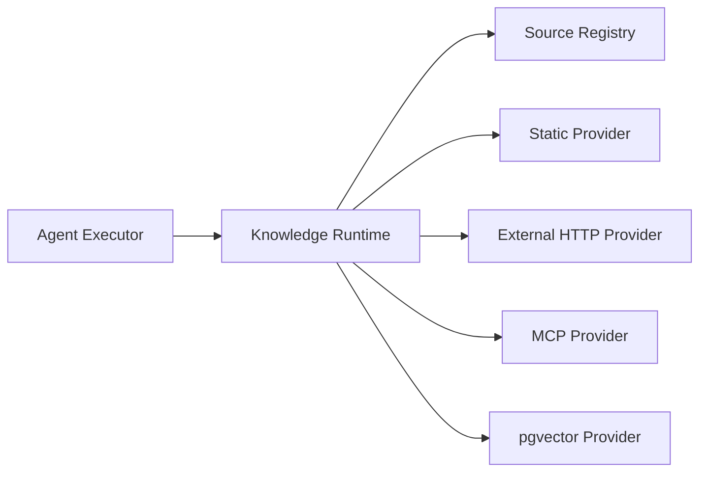

# Knowledge Runtime 模块需求与设计一体化文档

> **文档编号**: MOD-KNOW-1.0  
> **文档版本**: v1.1  
> **创建日期**: 2026-09-10  
> **文档状态**: 设计草稿（V1.7 整改对齐）  
> **设计基线**: 《通用智能服务执行框架 V1.6 总体设计说明书》+《05-变更记录/V1.6-to-V1.7-整改对齐说明》（D07）  
> **模板类型**: design-full（跨模块/架构核心模块）

**评审边界说明**：

- 需求评审：第 2 章，确认模块职责和边界；
- 设计评审：第 3-4 章，确认技术实现、数据、接口、DFX、部署；
- 本文只设计 Framework Core，不引入任何具体项目业务字段。

---

## 1. 文档控制

### 1.1 责任人

| 角色 | 姓名 | 职责范围 |
|---|---|---|
| 产品/架构负责人 | 待定 | 模块边界、需求与总体设计一致性 |
| 开发负责人 | 待定 | 技术方案与实现 |
| 测试负责人 | 待定 | 场景与 Gate |
| 安全/运维评审 | 按需 | 安全、可靠性、部署评审 |

### 1.2 修订历史

| 版本 | 日期 | 变更描述 |
|---|---|---|
| v0.1 | 2026-09-10 | 基于总体设计 V1.6 首次形成模块详细设计 |
| v1.1 | 2026-09-10 | V1.7 整改：不建 knowledge_retrieval_event 表；durable 证据写 step.output，realtime 只写 Trace（D07） |
| v1.2 | 2026-09-10 | 补「归属」列；后置 E2E 段登记承接方 |
| v1.3 | 2026-09-10 | S-02 的 ExecutionStep Evidence 后置段由模块 06 新增的 S-07 承接 |

---

## 2. 需求分析

### 2.1 需求概述

| 项目 | 内容 |
|---|---|
| 模块名称 | Knowledge Runtime |
| 模块ID | MOD-KNOW |
| 需求类型 | 新框架模块设计 |
| 业务背景 | 不同项目可能需要本地文档、外部知识库、RAG 服务、pgvector 或 MCP Knowledge；如果 Agent 直接绑定具体实现会限制开源复用。 |
| 核心目标 | 提供统一知识检索 Contract/Provider，让 Agent Definition 只绑定逻辑 Knowledge Source。 |
| 运行形态 | Python Framework Library；被 Agent Core 使用，Worker Agent Step 复用 |

### 2.2 痛点与价值

| 维度 | 内容 |
|---|---|
| 目标用户 | Builder、Integration Developer、Agent Runtime/Worker Agent Step |
| 当前问题 | 把知识库实现写死为 pgvector 或某外部产品会导致架构耦合；实时变化知识又不适合整体做版本冻结。 |
| 框架影响 | Knowledge 直接影响 Agent 判断，需要可追溯证据但不能把整个外部 KB 复制进 Execution。 |
| 预期价值 | 可以替换/增加外部知识库而不修改 Agent Runtime/Worker，且保留检索证据。 |

### 2.3 功能方案

#### 2.3.1 功能清单

| 功能ID | 功能名称 | 功能描述 | 优先级 | 来源 |
|---|---|---|---|---|
| FEAT-01 | Knowledge Source | 配置逻辑知识源与 Provider type/config ref。 | P0 | 总体设计 V1.6 |
| FEAT-02 | Provider SPI | 统一 search/get 接口。 | P0 | 总体设计 V1.6 |
| FEAT-03 | 多源检索 | 按 Agent binding 查询多个 Source 并归一化结果。 | P0 | 总体设计 V1.6 |
| FEAT-04 | Evidence | V1.7 D07：不建新表；durable Step 证据写 `execution_step.output.knowledge_evidence[]`，realtime 只写 OTel Trace。 | P0 | 总体设计 V1.7 |

#### 2.4 范围与边界

| 类别 | 内容 |
|---|---|
| 范围（In Scope） | Knowledge Runtime、Source、Provider、检索结果归一化、证据记录。 |
| 非范围（Out of Scope） | 通用知识库管理产品、Embedding pipeline 全平台、强制向量数据库。 |
| 前置假设 | 外部知识库可通过 API/MCP/Provider 访问；静态文件在 Object Store。 |
| 有意妥协/技术债 | V1 先实现 Static/External HTTP Provider；pgvector 只在真实语义检索需求出现时加入。 |

### 2.5 验收条件

#### 2.5.1 业务规则与约束

| ID | 类型 | 描述 | 验证场景 |
|---|---|---|---|
| RULE-01 | 系统约束 | Agent Definition 绑定逻辑 Knowledge Source，不绑定具体数据库连接。 | S-01 |
| RULE-02 | 系统约束 | 实时外部知识不强制整体版本化；durable Step 证据写 execution_step.output，realtime 只写 Trace，不建 knowledge_retrieval_event 表（V1.7 D07）。 | S-02 |
| RULE-03 | 系统约束 | Knowledge 不能替代业务权威 Capability 查询。 | E-01 |

#### 2.5.2 功能验收场景

**正常场景**

| 场景ID | 功能ID | 优先级 | 测试层级 | 关键真实边界 | 归属 | 前置条件 | 操作步骤 | 预期结果 |
|---|---|---|---|---|---|---|---|---|
| S-01 | FEAT-02 | P0 | integration | AgentExecutor → KnowledgeRuntime → Provider | 本模块 | 已完成基础配置 | 把 provider 从 fake/http 替换为另一实现 | Agent Runtime/Worker 不修改 |
| S-02 | FEAT-04 | P0 | integration | KnowledgeRuntime → ExecutionStep Evidence | 本模块 + 后置段 → 模块 06 | 已完成基础配置 | Agent Step 查询实时 KB | 保存文档引用、时间和可用 revision/hash，不复制整个 KB |
| S-03 | FEAT-01 | P0 | integration | Control Plane → Knowledge Source Store → Agent Resolver | 本模块 + 后置段 → 模块 02 | 已完成基础配置 | 新增外部 Knowledge Source 并绑定 Agent | 保存后 revision 增加，后续 Agent resolve 可获得逻辑 Source；不暴露底层数据库连接给 Agent |

**异常场景**

| 场景ID | 功能ID | 测试层级 | 关键真实边界 | 归属 | 触发条件 | 系统行为 | 用户感知 |
|---|---|---|---|---|---|---|---|
| E-01 | FEAT-03 | integration | Agent Core | 本模块 | Memory/Knowledge 中有“资源状态”但外部业务数据已变化 | 需要权威数据时强制通过 Capability 获取，Knowledge 仅作参考 | 返回可识别错误，不泄露内部细节 |
| E-02 | FEAT-02 | integration | Provider timeout | 本模块 | 外部 KB 超时 | 有界失败/降级；不无限重试，不阻塞 Worker 永久 | 返回可识别错误，不泄露内部细节 |

#### 2.5.3 非功能指标

| 指标ID | 指标名称 | 目标值 | 测量方法 |
|---|---|---|---|
| NFR-REL-01 | 可靠性 | 不得丢失/破坏框架权威状态；具体 SLA 待真实部署压测后确定 | 故障注入 + integration/E2E |
| NFR-SEC-01 | 安全边界 | 不得信任 LLM 提供的身份/权限/Host 路径等安全上下文 | Architecture Gate + integration |
| NFR-OBS-01 | 可观测性 | 关键操作必须携带 request_id/trace_id 或 execution_id | 日志/Trace 断言 |

性能/QPS/延迟阈值当前没有真实压测依据，本文不虚构固定数字；上线门槛在真实 Reference Integration 跑通后补充。

---

## 3. 技术设计

### 3.1 方案选型

#### 关键决策记录

| 决策点 | 选择 | 被否决项 | 理由 | 可逆性 |
|---|---|---|---|---|
| 抽象 | KnowledgeProvider SPI | 固定 pgvector | 适配外部 KB 与静态知识 | 中 |
| 一致性 | retrieval evidence | 冻结完整知识库 | 成本可控且可解释 | 中 |
| V1 存储 | PG metadata + Object Store | 独立向量数据库必选 | 降低依赖 | 易 |

#### 技术栈

| 类别 | 选型 | 版本 | 选型理由 |
|---|---|---|---|
| 语言 | Python | 3.12+ | Agent Core 共享 |
| Contract | Pydantic/Protocol | 2.x | 统一 hit/document |
| 静态内容 | Object Store | S3 compatible | 不可变 artifact |
| 语义索引 | pgvector | 按需 | 只有真实需求才启用 |

### 3.2 架构设计



#### 分层职责

| 层级 | 职责 |
|---|---|
| Knowledge Source | 逻辑命名与配置 |
| Runtime | 多源检索/排序/限制 |
| Provider | 外部实现 |
| Evidence | 记录实际检索依据 |

### 3.3 数据设计

> **统一数据库公共字段约束**：本模块凡新增 Framework 自建表，均必须包含 `is_deleted BOOLEAN NOT NULL DEFAULT FALSE`、`create_time TIMESTAMPTZ NOT NULL DEFAULT now()`、`update_time TIMESTAMPTZ NOT NULL DEFAULT now()`；Repository 默认过滤 `is_deleted=false`，删除默认逻辑删除。第三方自管理表（如 LangGraph Checkpointer）不修改其内部 Schema。


| 数据对象/表 | 关键字段 | 约束/索引 | 说明 |
|---|---|---|---|
| knowledge_source | id、name、provider_type、config_ref、revision、enabled | name/tenant 唯一策略 | 逻辑知识源 |
| （V1.7 D07：不建表）检索证据 | durable 写 `execution_step.output.knowledge_evidence[]`；realtime 写 OTel Trace | — | 不建 `knowledge_retrieval_event` 表 |


### 3.4 接口设计

| 接口ID | 接口/函数 | 形态 | 说明 | 关联功能 |
|---|---|---|---|---|
| SPI-01 | KnowledgeProvider.search(query,sources,context) | SPI | 检索 | FEAT-02,FEAT-03 |
| SPI-02 | KnowledgeProvider.get(document_ref,context) | SPI | 获取文档 | FEAT-02 |
| LIB-01 | KnowledgeRuntime.search(...) | 函数库 | 统一入口 | FEAT-03,FEAT-04 |

KnowledgeHit 至少包含 source_id、document_ref、score/metadata、可选 content、source_revision/content_hash；不得要求所有 Provider 都有版本号。

所有普通 HTTP JSON 接口必须复用统一响应 Envelope：

```json
{
  "code": "OK",
  "message": "success",
  "data": {},
  "request_id": "req-xxx",
  "timestamp": "2026-09-10T15:00:00+00:00"
}
```

SSE/WebSocket/文件流属于协议例外，但必须复用统一错误码 taxonomy 和 request/trace 关联策略。

### 3.5 质量实现方案

#### 可靠性

Provider deadline；单源失败可按策略继续其他源；静态 Artifact 用 checksum；外部源错误分类。

#### 安全性

按 Agent binding/tenant 过滤 Source；敏感知识的 AuthContext 通过 Provider 获取；检索结果进入 Prompt 前执行大小/类型限制。

#### 可观测性

query count、provider latency/error、hit count、source_id、retrieval evidence；避免默认记录完整敏感内容。

#### 测试策略

```text
unit
→ 纯规则/状态机/转换

integration
→ Repository / Provider / Runtime 边界

E2E
→ 真实进程/API/数据库/用户可见结果

architecture
→ 依赖方向、Stateless、统一响应、Core Purity 等硬约束
```

---

## 4. 部署与运维

### 4.1 部署架构

不独立部署；Provider 可以访问外部 KB 服务。

### 4.2 发布与回滚

- 框架代码通过镜像/包版本发布；
- Schema 变化使用 Alembic expand → migrate → switch → contract；
- 只有 `Service` 采用草稿/已发布两态，`Agent` 统一 direct-effect + revision（V1.7 D04），不把代码发布和业务定义发布混成一套版本系统；
- 运行配置可直接生效时必须保留 revision/audit；
- 回滚不得恢复已经撤销的用户权限、Credential 或安全禁用状态。

### 4.3 监控告警

provider availability、latency、empty-hit rate、evidence write failure；阈值待定。

阈值当前统一标记为**待定**，由 Reference Integration 实测建立基线后配置。

---

## 5. 风险与依赖

### 5.1 项目依赖

| 依赖模块/团队 | 依赖内容 | 状态 | 风险等级 |
|---|---|---|---|
| Object Store | 静态知识 | 按需 | 中 |
| External KB | 项目知识 | 按需 | 高 |
| AuthRuntime | 受保护知识源认证 | 按需 | 高 |
| AgentExecutor | 检索调用方 | 必需 | 中 |

### 5.2 风险识别

| 风险ID | 类型 | 描述 | 概率 | 影响 | 应对措施 | 验证场景 |
|---|---|---|---|---|---|---|
| RISK-01 | 架构 | 外部 KB 技术绑死 Core | 中 | 高 | Provider SPI + replaceability Gate | S-01 |
| RISK-02 | 正确性 | 知识被当成业务实时事实 | 中 | 高 | Knowledge/Capability 语义分离 | E-01 |

---

## 6. 需求追溯矩阵

| 来源 | 功能ID | 接口ID | 测试场景 | 测试层级 | 状态 |
|---|---|---|---|---|---|
| 总体设计 V1.6 | FEAT-01 | 内部契约 | S-03 | integration/E2E | 待实现 |
| 总体设计 V1.6 | FEAT-02 | SPI-01, SPI-02 | S-01, E-02 | integration/E2E | 待实现 |
| 总体设计 V1.6 | FEAT-03 | SPI-01, LIB-01 | E-01 | integration/E2E | 待实现 |
| 总体设计 V1.6 | FEAT-04 | LIB-01 | S-02 | integration/E2E | 待实现 |

> **后置 E2E 承接方登记**（依据 design-full 模板 §2.5.2「归属」列规则：标 `后置` 的场景必须写出承接方）：
>
> | 本模块场景 | 后置段 | 承接方 | 承接场景 |
> |---|---|---|---|
> | S-02 | ExecutionStep Evidence 落库（step.output） | `06-Worker Engine.md` | `S-07`（知识证据写入 `execution_step.output.knowledge_evidence[]`，不新建表） |
> | S-03 | Control Plane 写入 Knowledge Source | `02-Platform API 与控制面.md` | `02-S-04`（Console/API → Repository → Runtime Config） |


---

## Spec Compliance Matrix

| Spec/Rule | enforcement | 设计影响 | 设计落点 | 验证场景 | verifier | 状态 |
|---|---|---|---|---|---|---|
| framework#RULE-ARCH-001 | required | KnowledgeProvider 与 Core 解耦 | §3.2 | S-01 | `Provider replaceability integration` | applied |
| framework#RULE-DB-001 | required | Knowledge Source 表含公共字段 | §3.3 | S-03 | `test_database_common_fields.py` | applied |

---

## 附录：术语表

| 术语 | 定义 |
|---|---|
| Framework Core | 与具体业务项目解耦的框架内核 |
| Integration | 具体项目对框架 SPI/Contract 的实现和配置 |
| Capability | 稳定的“系统能做什么”合同 |
| Execution | 一次可靠业务服务执行实例 |
| SoT | Source of Truth，权威事实源 |
| SPI | Service Provider Interface，扩展接口 |
| DFX | 面向可靠性、安全性、可测试性、可运维性等质量属性的设计 |

---