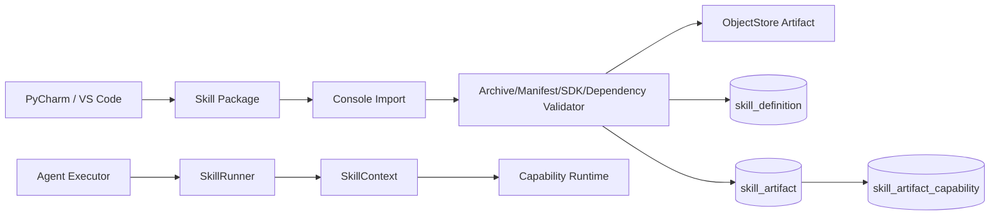
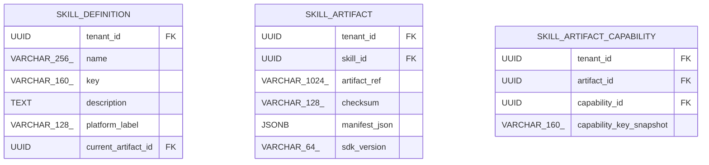

<!-- V1.11 module-split metadata -->
> **文档分档**：`Full`（模板 `design-full.md`）  
> **分档理由**：制品导入、校验、不可变 Artifact、运行边界  
> **文档边界**：本文件是该模块唯一详细设计事实源；DB Owner 与接口 Owner 必须落在本模块，不允许在其他模块重复定义。  
> **拆分原则**：仅按可独立评审/编码/验收的一级模块拆分；不按单表/单接口继续碎片化。

# Skill Runtime 模块需求与设计一体化文档

> **文档编号**: MOD-SKILL-V1.11 模块分档拆分版
> **文档版本**: V1.11 模块分档拆分版
> **创建日期**: 2026-09-11
> **文档状态**: 设计基线草案（待仓库 Spec Context 绑定后进入正式评审）
> **模板**: `design-full.md`；生成流程按 `cf-task:align` 的复杂后端/架构模块路径执行。
> **上游基线**: V1.8 完整总体设计 + V6 完整 Playbook + Console V0.8 Final。


**评审边界说明**：
- 第 2 章是需求基线（What），禁止实现阶段自行改变领域语义；
- 第 3-4 章是设计基线（How），DB 与每个接口必须以本文为准；
- `Spec Compliance Matrix` 当前依据设计基线生成，因本轮未提供仓库 `spec-context.yml` 与代码目录，**不得声称已通过 cf-task:align 的 repo Spec Gate**；落码前必须在真实仓库执行 `refresh/catalog/bind`。


## 1. 文档控制

### 1.1 责任人

| 角色 | 姓名 | 职责范围 |
|---|---|---|
| 产品/架构负责人 | 待定 | 需求定义、领域边界、与总设/Playbook 一致性 |
| 开发负责人 | 待定 | 技术方案、DB/API、实现 |
| 测试负责人 | 待定 | S/E/B 场景、E2E Gate |
| 安全/运维 | 待定 | Secret、隔离、发布、监控 |

### 1.2 修订历史

| 版本 | 日期 | 作者 | 变更描述 |
|---|---|---|---|
| V1.11 模块分档拆分版 | 2026-09-11 | ChatGPT / 待项目负责人确认 | 按 cf-task:align + design-full 从最新完整总设/Playbook/交互稿重新生成；细化 DB 与全部接口 |

## 2. 需求分析

### 2.1 需求概述

| 项目 | 内容 |
|---|---|
| 模块名称 | Skill Runtime |
| 模块ID | MOD-SKILL |
| 所属系统/产品线 | Fluxion 通用智能服务执行框架 |
| 需求类型 | 中大型功能 / 架构演进 |
| 业务背景 | 最新结论把 Skill 恢复为传统 Python SOP/方法代码资产：开发者在 IDE 中开发，Console 只导入/校验/查看，能力依赖来自 skill.yaml。 |
| 核心目标 | 设计 SkillDefinition/immutable Artifact/import validation/dependency snapshot/生产 SkillRunner，保持开发体验简单且运行安全。 |

### 2.2 痛点与价值

| 维度 | 内容 |
|---|---|
| 目标用户 | SOP/Skill Developer、Builder、Agent Runtime |
| 当前问题 | Console 低代码编排和人工能力绑定会制造第二套事实源；旧 Skill 直接保存认证/分页/URL 又难治理。 |
| 业务影响 | SOP 开发门槛高、代码与 Console 配置漂移、凭据泄露、能力依赖不可复现。 |
| 预期价值 | 开发者继续写普通 Python，平台托管通用基础设施；Artifact 可追踪、可冻结、可验证。 |

### 2.3 功能方案

#### 2.3.1 功能清单

| 功能ID | 功能名称 | 功能描述 | 优先级 | 来源 |
|---|---|---|---|---|
| FEAT-SKILL-01 | Skill Import | 上传本地 zip/tar.gz。 | P0 | 最新讨论 |
| FEAT-SKILL-02 | Immutable Artifact | checksum/manifest/sdk/entrypoint。 | P0 | 发布一致性 |
| FEAT-SKILL-03 | Manifest Dependency | skill.yaml capabilities[] 自动解析。 | P0 | 单一事实源 |
| FEAT-SKILL-04 | Read-only Detail | 依赖/Agent/文件/校验只读。 | P0 | Console 结论 |
| FEAT-SKILL-05 | SkillRunner | 生产受控 Python 执行与 SkillContext 注入。 | P0 | Runtime |
| FEAT-SKILL-06 | Version Import | 导入新 Artifact 切 current，旧版本保留。 | P0 | 版本追踪 |

### 2.4 范围与边界

| 类别 | 内容 |
|---|---|
| 范围（In Scope） | SkillDefinition/Artifact/dependency snapshot、导入/校验、Artifact 历史、只读反向查询、生产 runner。 |
| 非范围（Out of Scope） | Console 在线写 Python/拖拽编排/人工 bind Capability、Credential/分页实现、Service durable workflow。 |
| 前置假设 | 上游总设、公共 DB/API 规范、外部基础设施可用 |
| 有意妥协 / 技术债 | 无；未来扩展必须有真实旅程驱动 |

### 2.5 验收条件

#### 2.5.1 业务规则与约束

| ID | 类型 | 描述 | 验证场景 |
|---|---|---|---|
| RULE-SKILL-01 | 开发 | Skill 在线下 IDE 开发；Console 不提供代码编辑/执行编排。 | S-SKILL-01 |
| RULE-SKILL-02 | 依赖 | Capability dependencies 唯一事实源是 skill.yaml；导入后只读。 | S-SKILL-02 |
| RULE-SKILL-03 | Artifact | 每次导入新内容创建 immutable SkillArtifact。 | S-SKILL-03 |
| RULE-SKILL-04 | Secret | Skill 包不得携带生产用户名/密码/token。 | S-SKILL-04 |
| RULE-SKILL-05 | 调用 | 外部平台能力必须优先通过 ctx.capability.call。 | S-SKILL-05 |
| RULE-SKILL-06 | 平台标签 | platform_label 只是文本分类，不是 ProjectPlatform FK。 | S-SKILL-06 |

#### 2.5.2 功能验收场景

**正常场景**

| 场景ID | 功能ID | 优先级 | 测试层级 | 关键真实边界 | 归属 | 前置条件 | 操作步骤 | 预期结果 |
|---|---|---|---|---|---|---|---|---|
| S-SKILL-05 | FEAT-SKILL-04 | P1 | integration | Skill 经 ctx.capability.call | 本模块 | 已导入 Skill 调外部能力 | 运行 Skill | 调用走 Capability Runtime；无直连外部平台代码路径 |
| S-SKILL-06 | FEAT-SKILL-04 | P1 | integration | platform_label 仅文本 | 本模块 | 导入含 platform_label 的 Skill | 查询 /skills 分组 | 按 label 文本分组展示；DB 无 ProjectPlatform FK |
| S-SKILL-01 | FEAT-SKILL-01 | P0 | E2E | Upload→SafeExtract→ObjectStore→PG | 本模块 | 合法包 | 导入 | 生成 Definition/Artifact/依赖快照，详情可读 |
| S-SKILL-02 | FEAT-SKILL-03 | P0 | integration | manifest→cap registry | 本模块 | skill.yaml 列 3 capabilities | 导入 | 3 条 artifact dependency，只读 |
| S-SKILL-03 | FEAT-SKILL-06 | P0 | E2E | Import v2→current pointer | 本模块 | 已有 v1 | 导入合法 v2 | current=v2，v1 checksum 仍可查询 |
| S-SKILL-04 | FEAT-SKILL-05 | P0 | E2E | Agent→SkillRunner→Capability | 后置 → 模块 04/07 | Agent 绑定 Skill | 执行 | Python 数据处理 + ctx.capability.call 正常 |

**异常场景**

| 场景ID | 功能ID | 测试层级 | 关键真实边界 | 归属 | 触发条件 | 系统行为 | 用户感知 |
|---|---|---|---|---|---|---|---|
| E-SKILL-01 | FEAT-SKILL-01 | integration | SafeExtractor | 本模块 | zip path traversal/symlink escape | 导入失败 ARCHIVE_PATH_TRAVERSAL | 不落 ObjectStore/current |
| E-SKILL-02 | FEAT-SKILL-03 | integration | manifest validation | 本模块 | 依赖 capability 缺失/禁用 | 校验 INVALID/不切 current | 报告指出依赖 |
| E-SKILL-03 | FEAT-SKILL-04 | E2E | Console | 本模块 | 打开 Skill 详情 | 无绑定/编辑能力按钮 | 纯展示 |

#### 2.5.3 非功能指标

| 指标ID | 指标名称 | 目标值 | 测量方法 |
|---|---|---|---|
| NFR-REL-01 | 可靠执行 | 不得因单 Runtime/Worker 进程退出丢失权威状态 | SIGKILL/E2E |
| NFR-SEC-01 | 可信身份 | LLM/客户端不得覆盖 tenant/actor/secret | 安全测试 |
| NFR-OBS-01 | 可追踪 | 关键路径可按 request_id/trace_id/execution_id 定位 | 集成/E2E |

## 3. 技术设计

### 3.1 方案选型

#### 3.1.1 关键决策记录

| 决策点 | 选择 | 被否决项 | 理由 | 可逆性 |
|---|---|---|---|---|
| 开发模式 | IDE Python + SDK | Console 编排器 | 降低 SOP 开发门槛 | 难 |
| 依赖 SoT | skill.yaml | Console binding + code 双维护 | 单一事实源 | 难 |
| 版本 | Definition + immutable Artifact | 覆盖文件 | 可复现/Service snapshot | 中 |

#### 3.1.2 技术栈

| 类别 | 选型 | 版本 | 选型理由 |
|---|---|---|---|
| 语言 | Python | 3.12+（仓库实际版本落码前确认） | 与 Agent/LLM 生态一致 |
| Web/API | FastAPI + Pydantic | 仓库实际版本确认 | 类型契约与异步 IO |
| ORM | SQLAlchemy 2 Async | 仓库实际版本确认 | 异步 PostgreSQL |
| 数据库 | PostgreSQL | 外部部署 | 业务 SoT |

### 3.2 架构设计



#### 3.2.1 模块职责分层

| 层级 | 职责 | 禁止事项 |
|---|---|---|
| Handler/API | 协议解析、DTO、权限入口、统一错误映射 | 业务逻辑/直接 SQL |
| Application Service | 用例编排、事务边界、领域校验 | 依赖具体 Web 框架 |
| Domain | 领域对象/规则 | 基础设施依赖 |
| Repository/Port | 持久化/外部能力抽象 | 泄露 Secret/跨领域修改 |
| Adapter | PostgreSQL/HTTP/MCP 等实现 | 改变领域语义 |

#### 3.2.2 外部依赖清单

| 外部系统/模块 | 依赖类型 | 协议/接口 | 超时/一致性 | 降级策略 |
|---|---|---|---|---|
| ObjectStore | Artifact | Port | append-only | 不可用则导入失败 |
| Capability Registry | 依赖校验/运行 | Library/DB | current enabled | 缺失不切 current |
| Sandbox/Runner | Python 运行 | Sandbox SPI | 隔离 | 策略拒绝 |
| Skill SDK | Public API | Python package | version compatibility | 不兼容校验失败 |

### 3.3 数据设计

#### 3.3.1 表清单

| 表名 | 职责 | 所有权 |
|---|---|---|
| skill_import_preview | 上传暂存/确认消费 | Skill Runtime |

| skill_definition | Skill 逻辑身份；代码在线下 IDE 开发，Console 只导入不可变 Artifact。 | Skill Runtime |
| skill_artifact | 每次导入产生不可变 Skill 包制品及校验结果。 | Skill Runtime |
| skill_artifact_capability | 由 skill.yaml capabilities[] 自动解析出的 Artifact→Capability 依赖快照；Console 不可人工编辑。 | Skill Runtime |

#### 表 `skill_import_preview`

**职责**：暂存预览与确认提交的单一事实，非正式 Skill/Artifact。

| 字段名 | 类型 | 可空 | 默认值 | 索引 | 说明 |
|---|---|---|---|---|---|
| tenant_id | UUID | N |  | IDX | 租户 |
| actor_user_id | UUID | N |  | FK | 上传者，commit 必须匹配 |
| skill_id | UUID | Y |  | FK | 新版本目标；首次为空 |
| expected_revision | BIGINT | Y |  |  | 目标 Skill 的预览版本 |
| expected_key | VARCHAR(160) | N |  |  | manifest key |
| token_hash | VARCHAR(64) | N |  | UK | 不落原始 token |
| staging_ref | VARCHAR(1024) | N |  |  | 暂存区，不是 SkillArtifact |
| checksum | VARCHAR(64) | N |  |  | 包完整校验值 |
| manifest_json | JSONB | N |  |  | 解析结果 |
| validation_report | JSONB | N |  |  | 已脱敏完整报告 |
| expires_at | TIMESTAMPTZ | N |  | IDX | 创建后 30 分钟 |
| status | VARCHAR(16) | N | PENDING |  | PENDING/COMMITTED/EXPIRED |
| committed_skill_id | UUID | Y |  | FK | 首次导入结果 |
| committed_artifact_id | UUID | Y |  | FK | 提交幂等结果 |
| id | UUID | N | gen_random_uuid() | PK | 主键 |
| is_deleted | BOOLEAN | N | FALSE |  | 默认过滤 FALSE |
| create_time | TIMESTAMPTZ | N | CURRENT_TIMESTAMP |  | 创建时间 |
| update_time | TIMESTAMPTZ | N | CURRENT_TIMESTAMP |  | 更新时间 |

**约束与索引**

- UNIQUE (tenant_id,token_hash)；后台 TTL 清理未提交暂存包，保留必要脱敏审计。
- COMMITTED 必须有结果两个 ID；重复 commit 返回相同 ID；已过期未提交返回 SKILL_PREVIEW_EXPIRED。
- commit 锁 preview 和目标 Skill，expected_revision CAS 防并发切换；暂存包 digest 不可改。

#### 表 `skill_definition`

**职责**：Skill 逻辑身份；代码在线下 IDE 开发，Console 只导入不可变 Artifact。

| 字段名 | 类型 | 可空 | 默认值 | 索引 | 说明 |
|---|---|---|---|---|---|
| tenant_id | UUID | N |  | IDX | 租户 |
| name | VARCHAR(256) | N |  | IDX | 来自 manifest |
| key | VARCHAR(160) | N |  | UK | 稳定 key |
| description | TEXT | N |  |  | 说明 |
| platform_label | VARCHAR(128) | Y |  | IDX | 文本分类标签，不是 ProjectPlatform FK |
| current_artifact_id | UUID | Y |  | FK | 当前 Artifact 指针 |
| enabled | BOOLEAN | N | TRUE | IDX | 是否可被新 Agent run 使用 |
| revision | BIGINT | N | 1 |  | Definition revision |
| id | UUID | N | gen_random_uuid() | PK | 主键 |
| is_deleted | BOOLEAN | N | FALSE | IDX | 软删除标记；默认查询必须过滤 FALSE |
| create_time | TIMESTAMPTZ | N | CURRENT_TIMESTAMP |  | 创建时间 |
| update_time | TIMESTAMPTZ | N | CURRENT_TIMESTAMP |  | 更新时间 |

**约束**

- UNIQUE (tenant_id,key) WHERE is_deleted=false
- platform_label 纯文本分类，不参与认证/路由

**索引设计**

| 索引名 | 类型 | 字段 | 使用场景 |
|---|---|---|---|
| uk_skill_definition_key | UNIQUE | tenant_id,key | 导入/绑定 |
| idx_skill_platform_label | BTREE | tenant_id,platform_label,is_deleted | /skills 分组与筛选 |

#### 表 `skill_artifact`

**职责**：每次导入产生不可变 Skill 包制品及校验结果。

| 字段名 | 类型 | 可空 | 默认值 | 索引 | 说明 |
|---|---|---|---|---|---|
| tenant_id | UUID | N |  | IDX | 租户 |
| skill_id | UUID | N |  | FK,IDX | 所属 SkillDefinition |
| artifact_ref | VARCHAR(1024) | N |  |  | Object Store URI/ref |
| checksum | VARCHAR(128) | N |  | UK | SHA-256 checksum |
| manifest_json | JSONB | N | {} |  | skill.yaml 规范化内容 |
| sdk_version | VARCHAR(64) | N |  | IDX | 要求的 SDK 版本 |
| entrypoint | VARCHAR(512) | N |  |  | 包内 Python 入口 |
| validation_status | VARCHAR(32) | N | PENDING | IDX | PENDING/VALID/INVALID |
| validation_report | JSONB | N | {} |  | manifest/sdk/dependency/supply-chain 结果 |
| created_by | UUID | N |  |  | 导入者 |
| id | UUID | N | gen_random_uuid() | PK | 主键 |
| is_deleted | BOOLEAN | N | FALSE | IDX | 软删除标记；默认查询必须过滤 FALSE |
| create_time | TIMESTAMPTZ | N | CURRENT_TIMESTAMP |  | 创建时间 |
| update_time | TIMESTAMPTZ | N | CURRENT_TIMESTAMP |  | 更新时间 |

**约束**

- UNIQUE (tenant_id,skill_id,checksum)（同一 Skill 内去重；同内容可重新导入为新版本记录或回滚指向旧 Artifact）
- 禁止 UPDATE artifact 内容；validation_report 若需复核可追加 validation event 或仅更新状态（实现需选择并保持审计）

**索引设计**

| 索引名 | 类型 | 字段 | 使用场景 |
|---|---|---|---|
| uk_skill_artifact_checksum | UNIQUE | tenant_id,skill_id,checksum | 去重与发布冻结 |
| idx_skill_artifact_skill | BTREE | tenant_id,skill_id,create_time DESC | 版本列表 |

**不可变约束**：创建后禁止业务 UPDATE/DELETE；如需演进创建新记录并更新上层 current 指针。

#### 表 `skill_artifact_capability`

**职责**：由 skill.yaml capabilities[] 自动解析出的 Artifact→Capability 依赖快照；Console 不可人工编辑。

| 字段名 | 类型 | 可空 | 默认值 | 索引 | 说明 |
|---|---|---|---|---|---|
| tenant_id | UUID | N |  | IDX | 租户 |
| artifact_id | UUID | N |  | FK,IDX | SkillArtifact |
| capability_id | UUID | N |  | FK,IDX | Resolved Capability |
| capability_key_snapshot | VARCHAR(160) | N |  |  | 导入时 key 快照 |
| id | UUID | N | gen_random_uuid() | PK | 主键 |
| is_deleted | BOOLEAN | N | FALSE | IDX | 软删除标记；默认查询必须过滤 FALSE |
| create_time | TIMESTAMPTZ | N | CURRENT_TIMESTAMP |  | 创建时间 |
| update_time | TIMESTAMPTZ | N | CURRENT_TIMESTAMP |  | 更新时间 |

**约束**

- UNIQUE (tenant_id,artifact_id,capability_id)
- 仅导入器写入，不暴露 CRUD

**索引设计**

| 索引名 | 类型 | 字段 | 使用场景 |
|---|---|---|---|
| uk_skill_artifact_cap | UNIQUE | tenant_id,artifact_id,capability_id | 依赖快照 |
| idx_skill_artifact_cap_reverse | BTREE | tenant_id,capability_id | 能力被哪些 Skill 使用 |

**不可变约束**：创建后禁止业务 UPDATE/DELETE；如需演进创建新记录并更新上层 current 指针。

#### 3.3.2 ER 图



#### 3.3.3 数据一致性与软删除规则

- 所有 Framework 自建可变表使用 `is_deleted/create_time/update_time`；查询默认过滤 `is_deleted=false`。
- FK 只引用同一租户可见对象；跨租户引用必须在 Application Service 拒绝。
- Secret/Token/Password 不落业务表明文，只保存 `secret_ref/credential_ref`。
- 不可变 Release/Snapshot/Artifact 使用 append-only；需要更新时新建记录。
- `revision` 用于 direct-effect 配置的乐观并发和审计，不等同于发布版本。

### 3.4 接口设计

#### 3.4.1 接口清单

| 接口ID | 名称 | 形态 | 方法/签名 | 路径/用途 |
|---|---|---|---|---|
| SKILL-API-01 | Skill 列表 | HTTP | GET | /api/v1/skills |
| SKILL-API-02 | 首次导入 Skill | HTTP | POST | /api/v1/skills/import |
| SKILL-API-03 | Skill 详情 | HTTP | GET | /api/v1/skills/{skill_id} |
| SKILL-API-04 | 导入 Skill 新版本 | HTTP | POST | /api/v1/skills/{skill_id}/artifacts |
| SKILL-API-05 | Artifact 历史 | HTTP | GET | /api/v1/skills/{skill_id}/artifacts |
| SKILL-API-06 | Skill 能力依赖 | HTTP | GET | /api/v1/skills/{skill_id}/capabilities |
| SKILL-API-07 | Skill 使用 Agent | HTTP | GET | /api/v1/skills/{skill_id}/agents |
| SKILL-API-08 | Skill 校验结果 | HTTP | GET | /api/v1/skills/{skill_id}/validation |
| SKILL-LIB-01 | 生产 Skill 执行 | Library | async def run_skill(ctx: SkillInvocationContext, skill_id: UUID, input: JsonObject) -> SkillResult |  |

#### SKILL-API-01: Skill 列表

**入口类型**：HTTP

**契约**：`GET /api/v1/skills`

**认证/授权**：登录会话（中间件解析，RULE-API-02）；Builder + Admin（ADR-021）

**Query 参数**

| 参数 | 类型 | 必填 | 说明 |
|---|---|---|---|
| page | integer | N | 页码，从 1 开始；默认 1 |
| page_size | integer | N | 每页条数；默认 20，最大 100 |
| keyword | string | N | name/key |
| platform_label | string | N | 文本分类 |
| validation_status | string | N | current artifact 校验状态 |
| enabled | boolean | N | 状态 |

**请求体**：无。

**响应 data**

| 字段 | 类型 | 说明 |
|---|---|---|
| items | array<SkillSummary> | current artifact/sdk/entrypoint/dependency_count/agent_count |
| total | integer | 总数 |

**响应示例**

```json
{
  "code": 0,
  "message": "success",
  "data": {
    "items": [],
    "total": 1
  },
  "request_id": "req_xxx"
}
```

**错误码**

仅使用公共错误码。

**处理逻辑**

```text
skill_definition JOIN current artifact；聚合 dependency/agent count；Console 只读能力依赖。
```

#### SKILL-API-02: 首次导入 Skill

**契约**：`POST /api/v1/skills/import`

**认证/授权**：Builder + Admin；预览/提交同 tenant/actor

**请求体**：preview 使用 multipart（mode=preview、artifact 文件、可选 expected_key）；commit 使用 application/json（mode=commit、preview_token），禁止提交 artifact/任意替换包。两模式 Schema 如下，artifact 的字符串是测试中的文件逻辑标识，真实传输为 binary multipart。

<!-- contract:skill-import-schema -->
```json
{
  "$schema": "https://json-schema.org/draft/2020-12/schema",
  "oneOf": [
    {
      "type": "object",
      "additionalProperties": false,
      "required": [
        "mode",
        "artifact"
      ],
      "properties": {
        "mode": {
          "const": "preview"
        },
        "artifact": {
          "type": "string",
          "minLength": 1,
          "description": "multipart binary 文件的逻辑字段"
        },
        "expected_key": {
          "type": "string"
        }
      }
    },
    {
      "type": "object",
      "additionalProperties": false,
      "required": [
        "mode",
        "preview_token"
      ],
      "properties": {
        "mode": {
          "const": "commit"
        },
        "preview_token": {
          "type": "string",
          "minLength": 32
        }
      }
    }
  ]
}
```
<!-- /contract:skill-import-schema -->

**处理**：preview SafeExtractor→Manifest/SDK/entrypoint/依赖存在及 enabled/Secret/供应链校验→写 skill_import_preview 和 staging 对象，生成高熵 token（仅 hash 落库），不写正式 SkillDefinition/SkillArtifact，不切 current。invalid 也返回脱敏报告但无可 commit token。取消只丢弃 token，30 分钟后暂存清理；不存在立即物理“零文件”的承诺。

commit：验证 tenant/actor、token 与 TTL，锁预览和目标，复查暂存 checksum、当前依赖/权限/SDK兼容、expected_revision；首次导入要求 key 尚不存在，新版本要求 manifest key 与目标 skill 匹配。先把同 checksum 内容放不可变 ObjectStore（失败无正式记录；未引用对象后续 GC），再单 PG 事务写 Definition/Artifact/dependencies/current 指针并置 COMMITTED/结果 ID，审计同事务。同 token 已提交先返回原结果，不因后来 TTL 过期再报错；同 checksum 已存在合法 Artifact 时复用它而不写重复制品。

**响应判别**：preview=`{mode:"preview",valid,manifest,validation_report,preview_token:string|null,expires_at,checksum}`；无正式 IDs。commit=`{mode:"commit",skill_id,artifact_id,checksum,revision,current:true}`。错误 SKILL_PREVIEW_EXPIRED（410）、SKILL_PREVIEW_ACCESS_DENIED（403）、SKILL_PREVIEW_CHANGED/SKILL_REVISION_CONFLICT/SKILL_KEY_EXISTS/SKILL_DEPENDENCY_CHANGED（409）、SKILL_ARCHIVE_INVALID（400）。

**示例**：preview 逻辑请求 `{"mode":"preview","artifact":"report.zip"}`；commit `{"mode":"commit","preview_token":"0123456789abcdef0123456789abcdef"}`。前端拿 preview_token 后确认才调用 commit，取消不发 commit。

#### SKILL-API-03: Skill 详情

**入口类型**：HTTP

**契约**：`GET /api/v1/skills/{skill_id}`

**认证/授权**：登录会话（中间件解析，RULE-API-02）；Builder + Admin（ADR-021）

**请求体**：无。

**响应 data**

| 字段 | 类型 | 说明 |
|---|---|---|
| definition | object | name/key/description/platform_label/enabled |
| current_artifact | object | checksum/sdk/entrypoint/import_time |
| dependency_count | integer | 依赖能力数 |
| agent_count | integer | 使用 Agent 数 |
| validation_status | string | 校验 |

**响应示例**

```json
{
  "code": 0,
  "message": "success",
  "data": {
    "definition": {},
    "current_artifact": {},
    "dependency_count": 1,
    "agent_count": 1,
    "validation_status": "<validation_status>"
  },
  "request_id": "req_xxx"
}
```

**错误码**

| 错误码 | 场景 | HTTP 状态 |
|---|---|---|
| SKILL_NOT_FOUND | 不存在 | 404 |

**处理逻辑**

```text
只读详情；不提供在线编辑脚本/人工能力绑定。
```

#### SKILL-API-04: 导入 Skill 新版本

**契约**：`POST /api/v1/skills/{skill_id}/artifacts`

**认证/授权**：Builder + Admin；目标 Skill 当前租户且有编辑权限

请求、分阶段响应、错误与 SKILL-API-02 的 skill-import-schema 完全一致：preview multipart 必填 mode/artifact，commit JSON 必填 mode/preview_token 且禁止 artifact。预览时记录 skill_id/current revision，提交校验 target 与 expected_revision，manifest key 不符 SKILL_KEY_MISMATCH（409）。两阶段都调用 SKILL-API-02 的共用 Application，禁止另写直切 current 流程；preview 响应不包含正式 artifact_id/current=true。

#### SKILL-API-05: Artifact 历史

**入口类型**：HTTP

**契约**：`GET /api/v1/skills/{skill_id}/artifacts`

**认证/授权**：登录会话（中间件解析，RULE-API-02）；Builder + Admin（ADR-021）

**Query 参数**

| 参数 | 类型 | 必填 | 说明 |
|---|---|---|---|
| page | integer | N | 页码，从 1 开始；默认 1 |
| page_size | integer | N | 每页条数；默认 20，最大 100 |

**请求体**：无。

**响应 data**

| 字段 | 类型 | 说明 |
|---|---|---|
| items | array<SkillArtifactSummary> | artifact/checksum/sdk/validation/importer/time/current |
| total | integer | 总数 |

**响应示例**

```json
{
  "code": 0,
  "message": "success",
  "data": {
    "items": [],
    "total": 1
  },
  "request_id": "req_xxx"
}
```

**错误码**

| 错误码 | 场景 | HTTP 状态 |
|---|---|---|
| SKILL_NOT_FOUND | 不存在 | 404 |

**处理逻辑**

```text
按 create_time DESC 分页。
```

#### SKILL-API-06: Skill 能力依赖

**入口类型**：HTTP

**契约**：`GET /api/v1/skills/{skill_id}/capabilities`

**认证/授权**：登录会话（中间件解析，RULE-API-02）；Builder + Admin（ADR-021）

**请求体**：无。

**响应 data**

| 字段 | 类型 | 说明 |
|---|---|---|
| items | array<SkillCapabilityDependency> | current Artifact 的 capability key/name/type/platform/status |

**响应示例**

```json
{
  "code": 0,
  "message": "success",
  "data": {
    "items": []
  },
  "request_id": "req_xxx"
}
```

**错误码**

| 错误码 | 场景 | HTTP 状态 |
|---|---|---|
| SKILL_CURRENT_ARTIFACT_MISSING | 无 current artifact | 409 |

**处理逻辑**

```text
current_artifact_id → skill_artifact_capability JOIN definition/implementation；只读，禁止 PUT/POST。
```

#### SKILL-API-07: Skill 使用 Agent

**入口类型**：HTTP

**契约**：`GET /api/v1/skills/{skill_id}/agents`

**认证/授权**：登录会话（中间件解析，RULE-API-02）；Builder + Admin（ADR-021）

**Query 参数**

| 参数 | 类型 | 必填 | 说明 |
|---|---|---|---|
| page | integer | N | 页码，从 1 开始；默认 1 |
| page_size | integer | N | 每页条数；默认 20，最大 100 |

**请求体**：无。

**响应 data**

| 字段 | 类型 | 说明 |
|---|---|---|
| items | array<AgentSummary> | 通过 agent_skill_binding 反查 |
| total | integer | 总数 |

**响应示例**

```json
{
  "code": 0,
  "message": "success",
  "data": {
    "items": [],
    "total": 1
  },
  "request_id": "req_xxx"
}
```

**错误码**

仅使用公共错误码。

**处理逻辑**

```text
反查 agent_skill_binding；只读。
```

#### SKILL-API-08: Skill 校验结果

**入口类型**：HTTP

**契约**：`GET /api/v1/skills/{skill_id}/validation`

**认证/授权**：登录会话（中间件解析，RULE-API-02）；Builder + Admin（ADR-021）

**请求体**：无。

**响应 data**

| 字段 | 类型 | 说明 |
|---|---|---|
| artifact_id | uuid | current artifact |
| status | string | VALID/INVALID |
| checks | array<ValidationCheck> | manifest/sdk/entrypoint/capability/archive/supply-chain |
| validated_at | datetime | 时间 |

**响应示例**

```json
{
  "code": 0,
  "message": "success",
  "data": {
    "artifact_id": "<artifact_id>",
    "status": "<status>",
    "checks": [],
    "validated_at": "2026-09-11 10:00:00"
  },
  "request_id": "req_xxx"
}
```

**错误码**

仅使用公共错误码。

**处理逻辑**

```text
返回 current artifact validation_report；不得在详情页触发修改。
```

#### SKILL-LIB-01: 生产 Skill 执行

**入口类型**：Library

**函数签名**

```python
async def run_skill(ctx: SkillInvocationContext, skill_id: UUID, input: JsonObject) -> SkillResult
```

**入参**

| 参数 | 类型 | 必填 | 说明 |
|---|---|---|---|
| ctx | SkillInvocationContext | Y | 宿主内部可信 identity/projection/workspace/operation/test_mode；不把 Secret 暴露 SDK |
| skill_id | uuid | Y | SkillDefinition |
| input | object | Y | Skill 输入 |

**返回**

| 字段 | 类型 | 说明 |
|---|---|---|
| result | SkillResult | Python 返回的结构化结果/Artifact |

**异常/错误**

| 错误码 | 场景 | HTTP 状态 |
|---|---|---|
| SKILL_DISABLED | 禁用 | 409 |
| SKILL_ARTIFACT_INVALID | current Artifact 不可用 | 409 |
| SKILL_RUNTIME_ERROR | Skill 执行异常 | 500 |

**处理逻辑**

```text
ctx.execution_id 非空时严格使用 ctx.projection.skills[skill_id] 的 artifact/checksum/entrypoint；缺失 EXECUTION_PROJECTION_REQUIRED，禁止 current fallback。Chat 用 current。校验 SDK/runtime/依赖和当前 enabled → Workspace → LinuxNamespaceExecutor 启动隔离子进程 import entrypoint，宿主绝不 import 业务 Skill → 经私有 IPC 服务同步 SDK 请求 → 校验结果/提交 Artifact/telemetry。SkillInvocationContext 留在宿主，子进程只收到安全 SDK Context。
```

**补充约束**：Console 不提供执行编排器；Python if/for/数据转换属于 Skill 自身。

### 3.5 质量实现方案

#### 3.5.1 性能与容量

| 热点路径 | 负载量级 | 潜在瓶颈 | 实现方案 | 目标值 |
|---|---|---|---|---|
| Skill import | 低频 | 大压缩包/校验 | 流式 hash + extraction limits + 后台可选扫描 | 包大小上限由部署配置 |
| Runtime artifact load | 高频 Skill 调用 | 重复下载/import | 按 checksum 安全缓存；缓存可丢 | 保持 artifact immutable |

#### 3.5.2 可靠性

所有外部调用有 deadline；重试有界且只对可安全重试错误；业务权威状态外置；进程崩溃后能恢复或明确失败。

#### 3.5.3 安全性

上传包必须 path traversal/zip bomb/symlink/entrypoint/依赖扫描；Skill 运行在受控 Runner/Sandbox，禁止读取 Runtime 内部 Secret/host FS。

#### 3.5.4 可观测性

日志、Metrics、Trace 统一关联 request_id/trace_id；Execution 路径附带 execution_id/step_id；错误码稳定。

#### 3.5.5 测试策略

Domain/validator 单测；Repository/Provider 真 PG/外部 Stub 集成；核心用户旅程做 E2E；安全和崩溃恢复不得只靠 mock。

## 4. 部署与运维

### 4.1 部署架构

随其所属运行角色部署；PostgreSQL/Redis/Object Store/Secret Provider/OTel Backend 均为外部依赖，不打包进应用 Compose/Helm。

### 4.2 发布与回滚

DB 变更使用向前兼容迁移；应用支持滚动回滚；若涉及不可变 Release/Artifact，只切换 current 指针，不覆盖历史。

### 4.3 监控告警

至少监控请求/调用量、错误率、延迟、外部依赖失败、关键队列/执行积压和配置加载失败；阈值由环境基线确定。

### 4.4 数据迁移

若无历史生产数据则直接按新 Schema 建表；若已有部署，使用 Alembic 等可回滚/可前滚迁移，禁止运行时隐式改表。

## 5. 风险与依赖

| 风险ID | 描述 | 影响 | 应对措施 | 验证场景 |
|---|---|---|---|---|
| RISK-SKILL-01 | 恶意/不可信可执行 Skill 供应链 | 高 | 审核/校验/checksum/Sandbox/审计 | S-SKILL-01 |
| RISK-SKILL-02 | SDK 私有模块泄漏导致 Skill 强耦合 Runtime | 中 | import lint + Public API contract test | S-SKILL-04 |

## 6. 需求追溯矩阵

| 功能ID | 接口ID | 验证场景 | 测试层级 | 状态 |
|---|---|---|---|---|
| FEAT-SKILL-01 | SKILL-API-01, SKILL-API-02 | S-SKILL-01, E-SKILL-01 | E2E/integration | 待实现/评审 |
| FEAT-SKILL-02 | SKILL-API-02, SKILL-API-03 | 见 §2.5 | E2E/integration | 待实现/评审 |
| FEAT-SKILL-03 | SKILL-API-03, SKILL-API-04 | S-SKILL-02, E-SKILL-02 | E2E/integration | 待实现/评审 |
| FEAT-SKILL-04 | SKILL-API-04, SKILL-API-05 | E-SKILL-03 | E2E/integration | 待实现/评审 |
| FEAT-SKILL-05 | SKILL-API-05, SKILL-API-06 | S-SKILL-04 | E2E/integration | 待实现/评审 |
| FEAT-SKILL-06 | SKILL-API-06, SKILL-API-07 | S-SKILL-03 | E2E/integration | 待实现/评审 |

## Spec Compliance Matrix

| Spec/Rule | enforcement | 设计影响 | 设计落点 | 验证场景 | 状态/N/A 理由 |
|---|---|---|---|---|---|
| DESIGN/SKILL#RULE-SKILL-01 | design-baseline | 约束实现与验收 | §2.5 RULE-SKILL-01 / §3 | S/E/B 场景 | applied；仓库 spec-context 待绑定 |
| DESIGN/SKILL#RULE-SKILL-02 | design-baseline | 约束实现与验收 | §2.5 RULE-SKILL-02 / §3 | S/E/B 场景 | applied；仓库 spec-context 待绑定 |
| DESIGN/SKILL#RULE-SKILL-03 | design-baseline | 约束实现与验收 | §2.5 RULE-SKILL-03 / §3 | S/E/B 场景 | applied；仓库 spec-context 待绑定 |
| DESIGN/SKILL#RULE-SKILL-04 | design-baseline | 约束实现与验收 | §2.5 RULE-SKILL-04 / §3 | S/E/B 场景 | applied；仓库 spec-context 待绑定 |
| DESIGN/SKILL#RULE-SKILL-05 | design-baseline | 约束实现与验收 | §2.5 RULE-SKILL-05 / §3 | S/E/B 场景 | applied；仓库 spec-context 待绑定 |
| DESIGN/SKILL#RULE-SKILL-06 | design-baseline | 约束实现与验收 | §2.5 RULE-SKILL-06 / §3 | S/E/B 场景 | applied；仓库 spec-context 待绑定 |

## 附录 A：接口与 DB 落码检查清单

- [ ] 每个 HTTP Endpoint 已有 DTO、鉴权、错误码、处理逻辑、测试。
- [ ] 每个 Library/CLI 接口有稳定签名和异常语义。
- [ ] 每张表字段、类型、NULL、默认值、唯一约束、索引、软删除策略已落实迁移。
- [ ] Request/Response 字段不接受客户端传入可信 tenant/actor/credential。
- [ ] 列表接口使用服务端分页，避免无界返回。
- [ ] 修改类接口有 revision/冲突语义；高风险/副作用路径满足幂等和审计。
- [ ] 仓库 Spec Context 已 refresh/catalog/bind 且 required Rules 映射到 S/E/B verifier。
