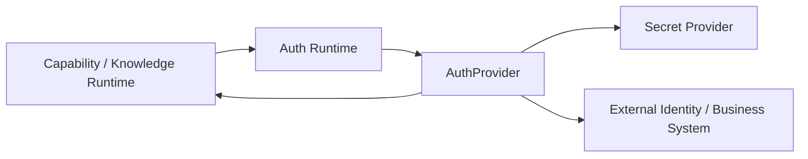

# Auth Runtime 与 AuthProvider 模块需求与设计一体化文档

> **文档编号**: MOD-AUTH-1.0  
> **文档版本**: v1.1  
> **创建日期**: 2026-09-10  
> **文档状态**: 设计草稿（V1.7 整改对齐）  
> **设计基线**: 《通用智能服务执行框架 V1.6 总体设计说明书》+《05-变更记录/V1.6-to-V1.7-整改对齐说明》（P3-03 故障注入）  
> **模板类型**: design-full（跨模块/架构核心模块）

**评审边界说明**：

- 需求评审：第 2 章，确认模块职责和边界；
- 设计评审：第 3-4 章，确认技术实现、数据、接口、DFX、部署；
- 本文只设计 Framework Core，不引入任何具体项目业务字段。

---

## 1. 文档控制

### 1.1 责任人

| 角色 | 姓名 | 职责范围 |
|---|---|---|
| 产品/架构负责人 | 待定 | 模块边界、需求与总体设计一致性 |
| 开发负责人 | 待定 | 技术方案与实现 |
| 测试负责人 | 待定 | 场景与 Gate |
| 安全/运维评审 | 按需 | 安全、可靠性、部署评审 |

### 1.2 修订历史

| 版本 | 日期 | 变更描述 |
|---|---|---|
| v0.1 | 2026-09-10 | 基于总体设计 V1.6 首次形成模块详细设计 |
| v1.1 | 2026-09-10 | V1.7 整改：补 E-AUTH-03~07 故障注入（session/refresh/SecretDown/ControlDown fail-closed） |

---

## 2. 需求分析

### 2.1 需求概述

| 项目 | 内容 |
|---|---|
| 模块名称 | Auth Runtime 与 AuthProvider |
| 模块ID | MOD-AUTH |
| 需求类型 | 新框架模块设计 |
| 业务背景 | 不同接入项目可能使用 OAuth2、JWT Exchange、API Key、Service Account、Session 登录或无认证，Framework 不能把 MSS 的静默登录模型固化为唯一方案。 |
| 核心目标 | 统一把 TrustedExecutionContext 转换为外部系统调用所需的短生命周期认证上下文，并让外部系统继续做最终 RBAC/ACL。 |
| 运行形态 | Python Framework Library；被 Capability/Knowledge Provider 使用 |

### 2.2 痛点与价值

| 维度 | 内容 |
|---|---|
| 目标用户 | Integration Developer；Capability Runtime；Knowledge Runtime |
| 当前问题 | 业务认证逻辑散落在 Tool/Skill/Adapter 会导致凭据泄露、重复登录和权限绕过。 |
| 框架影响 | Auth 是框架最高安全风险边界之一。 |
| 预期价值 | 认证可替换、Credential 不进 Prompt/日志/Pod SoT，业务权限继续由外部系统最终判定。 |

### 2.3 功能方案

#### 2.3.1 功能清单

| 功能ID | 功能名称 | 功能描述 | 优先级 | 来源 |
|---|---|---|---|---|
| FEAT-01 | AuthProvider SPI | resolve_identity/get_credential/refresh/revoke。 | P0 | 总体设计 V1.6 |
| FEAT-02 | Auth Profile | 用户/tenant 与 provider 的配置和 secret ref。 | P0 | 总体设计 V1.6 |
| FEAT-03 | Session Broker | 对需要 session/token 缓存的 Provider 管理加密 metadata 与过期。 | P0 | 总体设计 V1.6 |
| FEAT-04 | 实时授权 | 每次外部调用重新解析当前 auth/security 状态。 | P0 | 总体设计 V1.6 |

#### 2.4 范围与边界

| 类别 | 内容 |
|---|---|
| 范围（In Scope） | 认证 Provider 接口、Credential Ref、Session metadata、刷新/撤销、错误分类。 |
| 非范围（Out of Scope） | 复制外部系统完整 RBAC、把 Credential 明文存 PG、让 LLM 自己登录。 |
| 前置假设 | Secret Provider 可按 ref 安全获取 Credential；外部系统仍验证权限。 |
| 有意妥协/技术债 | V1 不做通用企业 IdP 产品；只提供 SPI 和常见 Provider 示例。 |

### 2.5 验收条件

#### 2.5.1 业务规则与约束

| ID | 类型 | 描述 | 验证场景 |
|---|---|---|---|
| RULE-01 | 系统约束 | Credential 明文不得进入数据库普通字段、Prompt、ExecutionSnapshot 或日志。 | E-01 |
| RULE-02 | 系统约束 | actor identity 只能来自 TrustedExecutionContext。 | S-01 |
| RULE-03 | 系统约束 | 外部 401/403 不得由 LLM/重试策略绕过。 | E-02 |
| RULE-04 | 系统约束 | Runtime 不依赖 Console 进程在线才能获取 AuthContext。 | S-02 |

#### 2.5.2 功能验收场景

**正常场景**

| 场景ID | 功能ID | 优先级 | 测试层级 | 关键真实边界 | 归属 | 前置条件 | 操作步骤 | 预期结果 |
|---|---|---|---|---|---|---|---|---|
| S-01 | FEAT-01 | P0 | integration | CapabilityRuntime → AuthProvider → Secret/External System | 本模块 + 后置段 → 模块 07 | 已完成基础配置 | 调用需要认证的 Capability | 根据 actor/tenant 获取当前 credential/token，不暴露给 LLM |
| S-02 | FEAT-03 | P0 | integration | Control Plane Down → AuthRuntime | 本模块 | 已完成基础配置 | 停止 platform-api 后 Worker 恢复任务 | 可从共享存储/SecretProvider 解析 AuthContext |

**异常场景**

| 场景ID | 功能ID | 测试层级 | 关键真实边界 | 归属 | 触发条件 | 系统行为 | 用户感知 |
|---|---|---|---|---|---|---|---|
| E-01 | FEAT-02 | integration | Logging/Snapshot Gate | 本模块 | token/password 被写入日志或 snapshot | 安全测试失败/脱敏 | 返回可识别错误，不泄露内部细节 |
| E-02 | FEAT-04 | integration | External System 403 | 本模块 | 用户当前权限已被撤销 | Capability 失败并按业务授权失败终止/等待人工，不自动换更高权限账号 | 返回可识别错误，不泄露内部细节 |
| E-AUTH-03 | FEAT-03 | integration | Session expired | 本模块 | session 过期 | refresh 成功后继续 | 返回可识别错误，不泄露内部细节 |
| E-AUTH-04 | FEAT-03 | integration | Refresh timeout | 本模块 | refresh 超时 | fail-closed，不绕过 | 返回可识别错误，不泄露内部细节 |
| E-AUTH-05 | FEAT-03 | integration | Refresh 401 | 本模块 | refresh 被拒 | AUTH_FAILED，不提权重试 | 返回可识别错误，不泄露内部细节 |
| E-AUTH-06 | FEAT-02 | integration | SecretProvider down | 本模块 | Secret 不可用 | fail-closed | 返回可识别错误，不泄露内部细节 |
| E-AUTH-07 | FEAT-04 | E2E | platform-api down | 本模块 | Control 面下线后 Worker 恢复 | 仍可从共享存储/Secret 解析 AuthContext | 返回可识别错误，不泄露内部细节 |

#### 2.5.3 非功能指标

| 指标ID | 指标名称 | 目标值 | 测量方法 |
|---|---|---|---|
| NFR-REL-01 | 可靠性 | 不得丢失/破坏框架权威状态；具体 SLA 待真实部署压测后确定 | 故障注入 + integration/E2E |
| NFR-SEC-01 | 安全边界 | 不得信任 LLM 提供的身份/权限/Host 路径等安全上下文 | Architecture Gate + integration |
| NFR-OBS-01 | 可观测性 | 关键操作必须携带 request_id/trace_id 或 execution_id | 日志/Trace 断言 |

性能/QPS/延迟阈值当前没有真实压测依据，本文不虚构固定数字；上线门槛在真实 Reference Integration 跑通后补充。

---

## 3. 技术设计

### 3.1 方案选型

#### 关键决策记录

| 决策点 | 选择 | 被否决项 | 理由 | 可逆性 |
|---|---|---|---|---|
| 认证抽象 | AuthProvider | 固定 SessionBroker | 适配任意项目认证 | 难 |
| 权限事实 | 外部系统最终判断 | Framework 复制业务 RBAC | 避免双轨权限 | 难 |
| Secret | SecretProvider ref | PG 明文 | 最小泄露面 | 难 |

#### 技术栈

| 类别 | 选型 | 版本 | 选型理由 |
|---|---|---|---|
| 语言 | Python | 3.12+ | Provider SPI |
| Secret | SecretProvider | 部署相关 | 不固化某产品 |
| Session metadata | PostgreSQL/Encrypted Store | 待定 | 可恢复 |
| 缓存 | Redis/内存有界 | 可选 | 仅非权威优化 |

### 3.2 架构设计



#### 分层职责

| 层级 | 职责 |
|---|---|
| Auth Runtime | 根据 provider key 调度 |
| AuthProvider | 协议/项目实现 |
| SecretProvider | 明文 Secret 最小获取面 |
| Session Store | token/session metadata 与过期 |

### 3.3 数据设计

> **统一数据库公共字段约束**：本模块凡新增 Framework 自建表，均必须包含 `is_deleted BOOLEAN NOT NULL DEFAULT FALSE`、`create_time TIMESTAMPTZ NOT NULL DEFAULT now()`、`update_time TIMESTAMPTZ NOT NULL DEFAULT now()`；Repository 默认过滤 `is_deleted=false`，删除默认逻辑删除。第三方自管理表（如 LangGraph Checkpointer）不修改其内部 Schema。


| 数据对象/表 | 关键字段 | 约束/索引 | 说明 |
|---|---|---|---|
| external_auth_profile | platform_user_id、provider_key、auth_type、credential_ref、session_ref、expires_at、status | UNIQUE(user,provider) | 用户外部认证配置 |


### 3.4 接口设计

| 接口ID | 接口/函数 | 形态 | 说明 | 关联功能 |
|---|---|---|---|---|
| SPI-01 | resolve_identity(context) -> ExternalIdentity | SPI | 身份映射 | FEAT-01 |
| SPI-02 | get_invocation_credential(context) | SPI | 获取调用凭据 | FEAT-01,FEAT-04 |
| SPI-03 | refresh(context) | SPI | 刷新 | FEAT-03 |
| SPI-04 | revoke(context) | SPI | 撤销 | FEAT-03 |

返回值必须是短生命周期 InvocationCredential/opaque handle；Provider 不允许把明文 Credential 回填到 Agent input/result。

所有普通 HTTP JSON 接口必须复用统一响应 Envelope：

```json
{
  "code": "OK",
  "message": "success",
  "data": {},
  "request_id": "req-xxx",
  "timestamp": "2026-09-10T15:00:00+00:00"
}
```

SSE/WebSocket/文件流属于协议例外，但必须复用统一错误码 taxonomy 和 request/trace 关联策略。

### 3.5 质量实现方案

#### 可靠性

token refresh 做 single-flight/乐观锁避免并发刷新风暴；外部认证调用有 deadline；expired metadata 可恢复刷新。

#### 安全性

Secret 最小权限、审计读取；禁止 service-account 悄悄替代真实 user identity；安全状态实时检查。

#### 可观测性

auth provider latency、refresh count/failure、401/403、credential resolve failure；日志只记录 provider/profile ref。

#### 测试策略

```text
unit
→ 纯规则/状态机/转换

integration
→ Repository / Provider / Runtime 边界

E2E
→ 真实进程/API/数据库/用户可见结果

architecture
→ 依赖方向、Stateless、统一响应、Core Purity 等硬约束
```

---

## 4. 部署与运维

### 4.1 部署架构

不独立部署；Runtime/Worker 通过共享存储和 SecretProvider 使用，不依赖 Console online。

### 4.2 发布与回滚

- 框架代码通过镜像/包版本发布；
- Schema 变化使用 Alembic expand → migrate → switch → contract；
- 只有 `Service` 采用草稿/已发布两态，`Agent` 统一 direct-effect + revision（V1.7 D04），不把代码发布和业务定义发布混成一套版本系统；
- 运行配置可直接生效时必须保留 revision/audit；
- 回滚不得恢复已经撤销的用户权限、Credential 或安全禁用状态。

### 4.3 监控告警

refresh failure、401/403 rate、session expired count、SecretProvider errors；阈值待定。

阈值当前统一标记为**待定**，由 Reference Integration 实测建立基线后配置。

---

## 5. 风险与依赖

### 5.1 项目依赖

| 依赖模块/团队 | 依赖内容 | 状态 | 风险等级 |
|---|---|---|---|
| Secret Provider | Credential | 必需 | 高 |
| External Auth System | 登录/刷新 | 按 Provider | 高 |
| PostgreSQL | AuthProfile/metadata | 必需 | 高 |
| CapabilityRuntime | 调用方 | 必需 | 中 |

### 5.2 风险识别

| 风险ID | 类型 | 描述 | 概率 | 影响 | 应对措施 | 验证场景 |
|---|---|---|---|---|---|---|
| RISK-01 | 安全 | 凭据进入 Prompt/日志/Snapshot | 中 | 高 | 类型隔离、redaction、安全 Gate | E-01 |
| RISK-02 | 权限 | 401/403 后错误提升权限 | 中 | 高 | 明确禁止 fallback 到更高权限身份 | E-02 |

---

## 6. 需求追溯矩阵

| 来源 | 功能ID | 接口ID | 测试场景 | 测试层级 | 状态 |
|---|---|---|---|---|---|
| 总体设计 V1.6 | FEAT-01 | SPI-01, SPI-02 | S-01 | integration/E2E | 待实现 |
| 总体设计 V1.6 | FEAT-02 | 内部契约 | E-01 | integration/E2E | 待实现 |
| 总体设计 V1.6 | FEAT-03 | SPI-03, SPI-04 | S-02 | integration/E2E | 待实现 |
| 总体设计 V1.6 | FEAT-04 | SPI-02 | E-02 | integration/E2E | 待实现 |

---

## Spec Compliance Matrix

| Spec/Rule | enforcement | 设计影响 | 设计落点 | 验证场景 | verifier | 状态 |
|---|---|---|---|---|---|---|
| framework#RULE-ARCH-001 | required | AuthProvider 可替换 | §3.2 | S-01/S-02 | `AuthProvider integration` | applied |
| framework#RULE-DB-001 | required | AuthProfile 表含公共字段 | §3.3 | S-01 | `test_database_common_fields.py` | applied |

---

## 附录：术语表

| 术语 | 定义 |
|---|---|
| Framework Core | 与具体业务项目解耦的框架内核 |
| Integration | 具体项目对框架 SPI/Contract 的实现和配置 |
| Capability | 稳定的“系统能做什么”合同 |
| Execution | 一次可靠业务服务执行实例 |
| SoT | Source of Truth，权威事实源 |
| SPI | Service Provider Interface，扩展接口 |
| DFX | 面向可靠性、安全性、可测试性、可运维性等质量属性的设计 |

---
