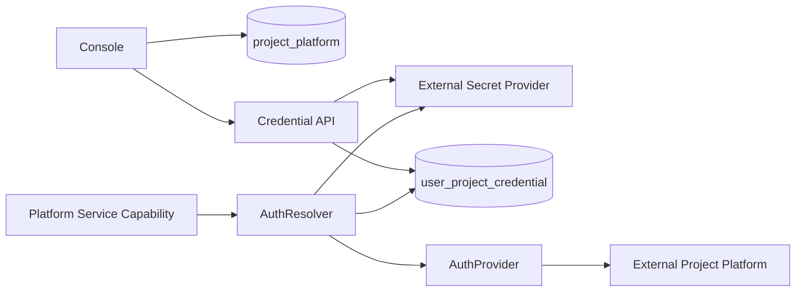
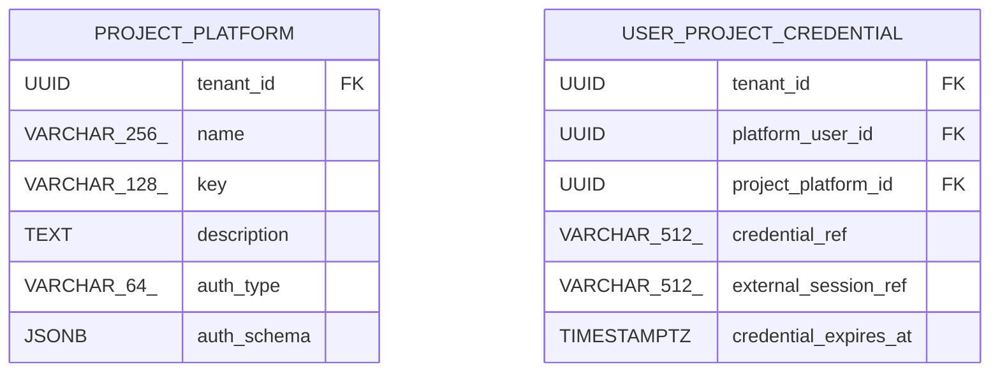

<!-- V1.11 module-split metadata -->
> **文档分档**：`Full`（模板 `design-full.md`）  
> **分档理由**：ProjectPlatform、用户凭据、Secret/Auth Resolver  
> **文档边界**：本文件是该模块唯一详细设计事实源；DB Owner 与接口 Owner 必须落在本模块，不允许在其他模块重复定义。  
> **拆分原则**：仅按可独立评审/编码/验收的一级模块拆分；不按单表/单接口继续碎片化。

# Auth 与项目平台 模块需求与设计一体化文档

> **文档编号**: MOD-AUTH-V1.13
> **文档版本**: V1.13
> **创建日期**: 2026-09-11
> **文档状态**: 设计基线草案（待仓库 Spec Context 绑定后进入正式评审）
> **模板**: `design-full.md`；生成流程按 `cf-task:align` 的复杂后端/架构模块路径执行。
> **上游基线**: V1.8 完整总体设计 + V6 完整 Playbook + Console V0.8 Final。


**评审边界说明**：
- 第 2 章是需求基线（What），禁止实现阶段自行改变领域语义；
- 第 3-4 章是设计基线（How），DB 与每个接口必须以本文为准；
- `Spec Compliance Matrix` 当前依据设计基线生成，因本轮未提供仓库 `spec-context.yml` 与代码目录，**不得声称已通过 cf-task:align 的 repo Spec Gate**；落码前必须在真实仓库执行 `refresh/catalog/bind`。


## 1. 文档控制

### 1.1 责任人

| 角色 | 姓名 | 职责范围 |
|---|---|---|
| 产品/架构负责人 | 待定 | 需求定义、领域边界、与总设/Playbook 一致性 |
| 开发负责人 | 待定 | 技术方案、DB/API、实现 |
| 测试负责人 | 待定 | S/E/B 场景、E2E Gate |
| 安全/运维 | 待定 | Secret、隔离、发布、监控 |

### 1.2 修订历史

| 版本 | 日期 | 作者 | 变更描述 |
|---|---|---|---|
| V1.11 模块分档拆分版 | 2026-09-11 | ChatGPT / 待项目负责人确认 | 按 cf-task:align + design-full 从最新完整总设/Playbook/交互稿重新生成；细化 DB 与全部接口 |
| V1.13 第三轮 Review 修复 | 2026-09-12 | Claude Code | 新增 AUTH-LIB-02/03（内部服务 token、Developer token）；Console 身份映射与 configured/session 字段补齐；Builder 安全只读 DTO 字段级冻结；auth_type↔ProviderKey 冻结；用户授权 revision_token 移除；Skill 入口校验与审核后置声明 |
| V1.13.1 第四轮合理性修复 | 2026-09-12 | Claude Code | D2 字段级授权：PLAT-API-02/04 由「仅 Admin」改为「Builder + Admin（敏感字段仅 Admin）」，`auth_type`/`auth_schema` 仅 Admin 可写、非 Admin 携带即 403 `FIELD_ADMIN_ONLY` 并原子拒绝；明确认证模板由 Admin 维护、Builder 只读 `auth_type`/`configured`（同步 §3.2.3 与 PLAT-API-01/03 投影）；PLAT-API-05 维持仅 Admin 并写明理由 |

## 2. 需求分析

### 2.1 需求概述

| 项目 | 内容 |
|---|---|
| 模块名称 | Auth 与项目平台 |
| 模块ID | MOD-AUTH |
| 所属系统/产品线 | Fluxion 通用智能服务执行框架 |
| 需求类型 | 中大型功能 / 架构演进 |
| 业务背景 | ProjectPlatform 是 MSS/CRM/ERP 业务平台对象，承担用户认证模板；ProjectIntegration 是代码装配机制，两者已正式拆分。 |
| 核心目标 | 设计 ProjectPlatform、User×ProjectPlatform 唯一 Credential、Secret/AuthProvider resolve、全部管理/验证接口。 |

### 2.2 痛点与价值

| 维度 | 内容 |
|---|---|
| 目标用户 | Admin/Builder、Capability Runtime、Integration Developer |
| 当前问题 | 若平台对象与代码 Integration 混用，认证、部署和 Console CRUD 混乱；若 Skill 自带账号则多用户权限无法复用。 |
| 业务影响 | 凭据泄露、共享账号越权、每个 Skill 重复登录、项目扩展不可维护。 |
| 预期价值 | 用户认证统一外置且按真实用户复用；Platform Service 能透明获得当前用户 AuthContext。 |

### 2.3 功能方案

#### 2.3.1 功能清单

| 功能ID | 功能名称 | 功能描述 | 优先级 | 来源 |
|---|---|---|---|---|
| FEAT-AUTH-01 | ProjectPlatform CRUD | 业务平台和 auth schema。 | P0 | Console 项目平台 |
| FEAT-AUTH-02 | User Credential | User×Platform 唯一认证。 | P0 | 用户详情 |
| FEAT-AUTH-03 | Secret Storage | 敏感值外部 Secret Provider。 | P0 | 安全 |
| FEAT-AUTH-04 | Credential Verify | AuthProvider 真实验证。 | P0 | 可用性 |
| FEAT-AUTH-05 | Runtime Resolve | Platform Service request-scoped AuthContext。 | P0 | Capability |
| FEAT-AUTH-06 | Internal Service Token | `/internal/*` 服务间身份令牌签发与校验（audience + scope 绑定）。 | P0 | 第三轮 Review T-12 |
| FEAT-AUTH-07 | Developer Token | 开发/测试环境 Developer token 与测试用户白名单（不进生产）。 | P1 | 第三轮 Review T-37 |

### 2.4 范围与边界

| 类别 | 内容 |
|---|---|
| 范围（In Scope） | ProjectPlatform、UserProjectCredential、auth_schema、Secret ref、AuthProvider resolve/verify。 |
| 非范围（Out of Scope） | ProjectIntegration manifest、Channel identity、AgentAccessGrant、HTTP/MCP 共享认证（归 Capability Implementation）。Console 登录（`POST /api/v1/auth/login`、`POST /api/v1/auth/logout`）不属于本设计范围，V1 依赖既有实现，只冻结契约语义与角色映射（见 §3.2.3）。 |
| 显式边界（凭据治理 V1） | 用户平台凭据只有「删除（CRED-API-04）+ 只读状态展示（CRED-API-01）」；**没有“停用”**：`status` 是系统维护的验证状态（UNVERIFIED/VALID/INVALID/EXPIRED），不是可写开关。 |
| 前置假设 | 上游总设、公共 DB/API 规范、外部基础设施可用 |
| 有意妥协 / 技术债 | 无；未来扩展必须有真实旅程驱动 |

### 2.5 验收条件

#### 2.5.1 业务规则与约束

| ID | 类型 | 描述 | 验证场景 |
|---|---|---|---|
| RULE-AUTH-01 | 分层 | ProjectPlatform 与 ProjectIntegration 不共表/不共 CRUD。 | S-AUTH-01 |
| RULE-AUTH-02 | 唯一 | 同一 User×ProjectPlatform V1 最多一套 Credential。 | S-AUTH-02 |
| RULE-AUTH-03 | Secret | DB/日志/Skill 不保存明文 Secret。 | S-AUTH-03 |
| RULE-AUTH-04 | 类型 | 只有 PLATFORM_SERVICE 使用用户 ProjectPlatform Credential。 | S-AUTH-04 |
| RULE-AUTH-05 | 动态 | Execution 恢复时使用 current Credential/权限，不冻结旧认证。 | S-AUTH-05 |

#### 2.5.2 功能验收场景

**正常场景**

| 场景ID | 功能ID | 优先级 | 测试层级 | 关键真实边界 | 归属 | 前置条件 | 操作步骤 | 预期结果 |
|---|---|---|---|---|---|---|---|---|
| S-AUTH-05 | FEAT-AUTH-04 | P1 | integration | 恢复使用当前凭据 | 本模块 | Execution 等待期间凭据被更换 | Worker 恢复执行 | 使用 current Credential，不使用冻结旧认证 |
| S-AUTH-01 | FEAT-AUTH-01 | P0 | E2E | Console→API→PG | 本模块 | Admin | 创建 MSS 平台/auth schema | 项目平台列表可见 |
| S-AUTH-02 | FEAT-AUTH-02 | P0 | E2E | User tab→SecretProvider→PG | 本模块 | 用户/平台存在 | 保存账号 | DB 只有 credential_ref，Secret Provider 有值 |
| S-AUTH-03 | FEAT-AUTH-04 | P0 | E2E | Credential→AuthProvider→external | 本模块 | 已保存 credential | Verify | status VALID/INVALID 可追踪 |
| S-AUTH-04 | FEAT-AUTH-05 | P0 | E2E | Capability→AuthResolver | 后置 → 模块 07 | Platform Service 调用 | invoke | 当前用户 AuthContext 注入下游 |
| S-AUTH-06 | FEAT-AUTH-06 | P1 | integration | Gateway→Agent Runtime 内部调用 | 后置 → 模块 10/03 | CHANNEL_GATEWAY 已签发 audience=agent-runtime 的 token | 经 CH-DATA-02 注入真实 tenant/actor | 只接受 token 内的 tenant/channel_account_id/account_key；请求体 tenant/user 不能覆盖 |

**异常场景**

| 场景ID | 功能ID | 测试层级 | 关键真实边界 | 归属 | 触发条件 | 系统行为 | 用户感知 |
|---|---|---|---|---|---|---|---|
| E-AUTH-01 | FEAT-AUTH-02 | integration | Unique constraint | 本模块 | 重复 user×platform 保存 | 更新同一记录/revision | 不创建第二套账号 |
| E-AUTH-02 | FEAT-AUTH-05 | E2E | Auth resolve | 本模块 | Credential 删除/过期 | fail closed | 不降级共享账号 |
| E-AUTH-03 | FEAT-AUTH-06 | integration | 服务间 token 校验 | 本模块 | 伪造/过期/audience 不符/超 scope 的 token 调 CH-DATA-02 或 CH-INT-02 | 401 INTERNAL_TOKEN_MISSING/INVALID/EXPIRED，或 403 INTERNAL_AUDIENCE_MISMATCH/INTERNAL_SCOPE_DENIED | 不注入任何身份，不执行 |
| E-AUTH-04 | FEAT-AUTH-07 | integration | Developer token Provider | 本模块 | 生产部署携带 Developer token，或模拟用户不在 allowlist | 生产未注册 Provider → DEV_TOKEN_INVALID(401)；白名单外 → TEST_USER_NOT_ALLOWED(403) | 联调入口不可用，不产生测试身份 |
| E-AUTH-05 | FEAT-AUTH-02 | E2E | Console 登录角色 | 本模块 | Builder 登录 Console 调 CRED-API-01 | 403；写 audit_log | 凭据只读状态不可见，操作者被审计归因 |

#### 2.5.3 非功能指标

| 指标ID | 指标名称 | 目标值 | 测量方法 |
|---|---|---|---|
| NFR-REL-01 | 可靠执行 | 不得因单 Runtime/Worker 进程退出丢失权威状态 | SIGKILL/E2E |
| NFR-SEC-01 | 可信身份 | LLM/客户端不得覆盖 tenant/actor/secret | 安全测试 |
| NFR-OBS-01 | 可追踪 | 关键路径可按 request_id/trace_id/execution_id 定位 | 集成/E2E |

## 3. 技术设计

### 3.1 方案选型

#### 3.1.1 关键决策记录

| 决策点 | 选择 | 被否决项 | 理由 | 可逆性 |
|---|---|---|---|---|
| 平台对象 | ProjectPlatform DB 产品对象 | 复用 ProjectIntegration | 运行/部署与业务认证职责不同 | 难 |
| Credential | User×Platform 唯一 | User×Agent×Protocol | 减少重复且符合业务身份 | 中 |
| Secret | 外部 SecretProvider ref | DB 加密明文 | 缩小数据泄露面 | 中 |

#### 3.1.2 技术栈

| 类别 | 选型 | 版本 | 选型理由 |
|---|---|---|---|
| 语言 | Python | 3.12+（仓库实际版本落码前确认） | 与 Agent/LLM 生态一致 |
| Web/API | FastAPI + Pydantic | 仓库实际版本确认 | 类型契约与异步 IO |
| ORM | SQLAlchemy 2 Async | 仓库实际版本确认 | 异步 PostgreSQL |
| 数据库 | PostgreSQL | 外部部署 | 业务 SoT |

### 3.2 架构设计



#### 3.2.1 模块职责分层

| 层级 | 职责 | 禁止事项 |
|---|---|---|
| Handler/API | 协议解析、DTO、权限入口、统一错误映射 | 业务逻辑/直接 SQL |
| Application Service | 用例编排、事务边界、领域校验 | 依赖具体 Web 框架 |
| Domain | 领域对象/规则 | 基础设施依赖 |
| Repository/Port | 持久化/外部能力抽象 | 泄露 Secret/跨领域修改 |
| Adapter | PostgreSQL/HTTP/MCP 等实现 | 改变领域语义 |

#### 3.2.2 外部依赖清单

| 外部系统/模块 | 依赖类型 | 协议/接口 | 超时/一致性 | 降级策略 |
|---|---|---|---|---|
| Secret Provider | Secret SoT | Port | 强安全边界 | 不可用 fail closed |
| AuthProvider | 认证适配 | SPI | deadline | 验证/解析失败 |
| External business platform | 最终认证/权限 | 项目协议 | 外部 | 由其最终判定业务权限 |
| Console 登录（既有实现） | 身份信任根 | `POST /api/v1/auth/login` 与 `POST /api/v1/auth/logout`（`apps/platform_api/routes/auth.py`），Bearer 12h + bootstrap CLI | 不可用则 Console 全站不可登录 | 本设计不实现，只冻结契约语义与角色映射（§3.2.3） |

#### 3.2.3 Console 身份与 PlatformUser 的关系

Console 登录入口 `POST /api/v1/auth/login`（及 `POST /api/v1/auth/logout`）**不属于本设计范围**：V1 依赖既有实现（`apps/platform_api/routes/auth.py` 的 login/logout + Bearer 12h + bootstrap CLI）。本设计只冻结以下三点契约，其余细节以既有实现为准：

1. **登录契约**：登录成功返回 `{token, username, role}`，`role ∈ {ADMIN, BUILDER}`；`END_USER` 不可登录 Console（只经 IM 使用）。token 过期返回 401，与 `WEB-LIB-03` 一致。
2. **角色映射**：`role` 与 `platform_user.role` 一一对应——`ADMIN` ↔ `role=ADMIN`、`BUILDER` ↔ `role=BUILDER`。本模块所有接口「认证/授权」列中的 Admin/Builder 即指该登录角色。写权限按**字段级授权**（D2，ADR-021 修正）：`PLAT-API-02/04` 为 **Builder + Admin**——项目平台的认证模板字段列表（`auth_type`/`auth_schema`）由 **Admin 维护**，**Builder 只能读取 `auth_type` 与 `configured`**（供能力定义选择平台），非 Admin 请求中出现 `auth_type`/`auth_schema` 一律 403 `FIELD_ADMIN_ONLY`；`PLAT-API-05` 与 `CRED-API-01..04` 仍为**整接口仅 Admin**（凭据写与认证验证属敏感面），与模块 10 的 IM Bot 密钥写接口仅 Admin 一致。
3. **操作者归属**：所有需要操作者身份的事实（`agent_access_grant.granted_by`、`audit_log.actor_user_id`）取该登录用户对应的唯一 `platform_user.id`；登录用户必须能在本租户定位到唯一 `platform_user` 行（同一 `user_key`），否则拒绝写操作并记录告警。

### 3.3 数据设计

#### 3.3.1 表清单

| 表名 | 职责 | 所有权 |
|---|---|---|
| project_platform | MSS/CRM/ERP 等业务平台产品对象；承载用户认证模板并被 PLATFORM_SERVICE Capability 引用。与 ProjectIntegration 分离。 | Auth 与项目平台 |
| user_project_credential | 同一 PlatformUser × ProjectPlatform 的唯一用户认证投影；敏感值在 Secret Provider。 | Auth 与项目平台 |

#### 表 `project_platform`

**职责**：MSS/CRM/ERP 等业务平台产品对象；承载用户认证模板并被 PLATFORM_SERVICE Capability 引用。与 ProjectIntegration 分离。

| 字段名 | 类型 | 可空 | 默认值 | 索引 | 说明 |
|---|---|---|---|---|---|
| tenant_id | UUID | N |  | IDX | 租户 |
| name | VARCHAR(256) | N |  | IDX | 平台名称 |
| key | VARCHAR(128) | N |  | UK | 稳定标识 |
| description | TEXT | Y |  |  | 说明 |
| auth_type | VARCHAR(64) | N | UNCONFIGURED |  | UNCONFIGURED（唯一保留值）或模块 12 `ProviderKind=AUTH` 已注册 Provider 的 `key`（大小写敏感稳定 key，租户无关） |
| auth_schema | JSONB | N | {} |  | 用户需填写字段的 JSON Schema；不含 Secret 值 |
| enabled | BOOLEAN | N | TRUE | IDX | 新解析是否允许 |
| revision | BIGINT | N | 1 |  | direct-effect revision |
| id | UUID | N | gen_random_uuid() | PK | 主键 |
| is_deleted | BOOLEAN | N | FALSE | IDX | 软删除标记；默认查询必须过滤 FALSE |
| create_time | TIMESTAMPTZ | N | CURRENT_TIMESTAMP |  | 创建时间 |
| update_time | TIMESTAMPTZ | N | CURRENT_TIMESTAMP |  | 更新时间 |

**约束**

- UNIQUE (tenant_id,key) WHERE is_deleted=false
- auth_type=UNCONFIGURED 当且仅当 configured=false（派生 DTO）；此时 auth_schema={}，不能保存/验证凭据或运行 PLATFORM_SERVICE。其他类型必须已注册且模板校验通过。
- `auth_type` 的取值空间就是模块 12 Registry 中 `ProviderKind=AUTH` 已注册 Provider 的 `key`（大小写敏感的稳定 key，租户无关）；`UNCONFIGURED` 是唯一保留值。选择未注册的 `auth_type` 一律拒绝保存 `AUTH_PROVIDER_NOT_REGISTERED`(422)，不做隐式映射或大小写归一。
- `auth_type`/`auth_schema` 是 **Admin 维护的认证模板字段**（D2 字段级授权）：非 Admin 请求中出现其中任一字段（即使值为 `null` 或 `{}`）一律 403 `FIELD_ADMIN_ONLY` 且不修改任何字段（原子拒绝）。Builder 只读 `auth_type` 与 `configured`（见 §3.2.3）。

**索引设计**

| 索引名 | 类型 | 字段 | 使用场景 |
|---|---|---|---|
| uk_project_platform_key | UNIQUE | tenant_id,key | 按 key 引用 |
| idx_project_platform_status | BTREE | tenant_id,enabled,is_deleted | 控制面列表 |

#### 表 `user_project_credential`

**职责**：同一 PlatformUser × ProjectPlatform 的唯一用户认证投影；敏感值在 Secret Provider。

| 字段名 | 类型 | 可空 | 默认值 | 索引 | 说明 |
|---|---|---|---|---|---|
| tenant_id | UUID | N |  | IDX | 租户 |
| platform_user_id | UUID | N |  | FK,IDX | 用户 |
| project_platform_id | UUID | N |  | FK,IDX | 项目平台 |
| credential_ref | VARCHAR(512) | N |  |  | Secret Provider 引用 |
| external_session_ref | VARCHAR(512) | Y |  |  | 可选外部 Session 引用 |
| credential_expires_at | TIMESTAMPTZ | Y |  | IDX | 长期凭据有效期；空表示由 Provider 验证 |
| session_expires_at | TIMESTAMPTZ | Y |  | IDX | 短期 Session 有效期，过期触发刷新 |
| session_generation | BIGINT | N | 0 |  | 刷新/撤销的 CAS 代次 |
| refresh_owner | UUID | Y |  |  | 同凭据刷新租约 |
| refresh_lease_expires_at | TIMESTAMPTZ | Y |  |  | 刷新到期；其他请求有限退避等待 |
| status | VARCHAR(32) | N | UNVERIFIED | IDX | 长期凭据 UNVERIFIED/VALID/INVALID/EXPIRED；Session 过期不改本状态 |
| verified_at | TIMESTAMPTZ | Y |  |  | 最近验证时间 |
| metadata | JSONB | N | {} |  | 非敏感元信息 |
| revision | BIGINT | N | 1 |  | 乐观并发 |
| id | UUID | N | gen_random_uuid() | PK | 主键 |
| is_deleted | BOOLEAN | N | FALSE | IDX | 软删除标记；默认查询必须过滤 FALSE |
| create_time | TIMESTAMPTZ | N | CURRENT_TIMESTAMP |  | 创建时间 |
| update_time | TIMESTAMPTZ | N | CURRENT_TIMESTAMP |  | 更新时间 |

**约束**

- UNIQUE (tenant_id,platform_user_id,project_platform_id) WHERE is_deleted=false
- 明文用户名/密码/token 不得进入 metadata/log

**索引设计**

| 索引名 | 类型 | 字段 | 使用场景 |
|---|---|---|---|
| uk_user_project_credential | UNIQUE(partial) | tenant_id,platform_user_id,project_platform_id | WHERE is_deleted=false |
| idx_user_project_credential_expiry | BTREE | tenant_id,status,credential_expires_at,is_deleted | 过期扫描/验证 |

#### 3.3.2 ER 图



#### 3.3.3 数据一致性与软删除规则

- 所有 Framework 自建可变表使用 `is_deleted/create_time/update_time`；查询默认过滤 `is_deleted=false`。
- FK 只引用同一租户可见对象；跨租户引用必须在 Application Service 拒绝。
- Secret/Token/Password 不落业务表明文，只保存 `secret_ref/credential_ref`。
- 不可变 Release/Snapshot/Artifact 使用 append-only；需要更新时新建记录。
- `revision` 用于 direct-effect 配置的乐观并发和审计，不等同于发布版本。

### 3.4 接口设计

#### 3.4.1 接口清单

| 接口ID | 名称 | 形态 | 方法/签名 | 路径/用途 |
|---|---|---|---|---|
| PLAT-API-01 | 项目平台列表 | HTTP | GET | /api/v1/project-platforms |
| PLAT-API-02 | 新增项目平台 | HTTP | POST | /api/v1/project-platforms |
| PLAT-API-03 | 项目平台详情 | HTTP | GET | /api/v1/project-platforms/{platform_id} |
| PLAT-API-04 | 编辑项目平台 | HTTP | PUT | /api/v1/project-platforms/{platform_id} |
| PLAT-API-05 | 验证认证 Schema | HTTP | POST | /api/v1/project-platforms/{platform_id}/validate-auth-schema |
| CRED-API-01 | 用户平台认证列表 | HTTP | GET | /api/v1/users/{user_id}/platform-credentials |
| CRED-API-02 | 保存用户平台认证 | HTTP | PUT | /api/v1/users/{user_id}/platform-credentials/{platform_id} |
| CRED-API-03 | 验证用户平台认证 | HTTP | POST | /api/v1/users/{user_id}/platform-credentials/{platform_id}/verify |
| CRED-API-04 | 删除用户平台认证 | HTTP | DELETE | /api/v1/users/{user_id}/platform-credentials/{platform_id} |
| AUTH-LIB-01 | 运行时用户认证解析 | Library | async def resolve_user_platform_auth(ctx: TrustedExecutionContext, project_platform_id: UUID) -> AuthContext |  |
| AUTH-LIB-02 | InternalServiceToken 签发与校验 | Library | def issue_internal_service_token(service_role, *, audience, tenant_id, scope, ttl_seconds=300) -> str；async def verify_internal_service_token(token, *, expected_audience) -> InternalServiceIdentity | 服务间身份（模块 10/03 的 `/internal/*` 统一引用） |
| AUTH-LIB-03 | Developer Token 与测试用户白名单 | Library | async def verify_developer_token(token: str, *, expected_tenant: UUID) -> DeveloperIdentity | 仅 dev/test 环境（模块 17 Dev Gateway 联调） |

#### PLAT-API-01: 项目平台列表

**入口类型**：HTTP

**契约**：`GET /api/v1/project-platforms`

**认证/授权**：登录会话（中间件解析，RULE-API-02）；Builder + Admin；Builder 仅安全只读 DTO（ADR-021）

**Query 参数**

| 参数 | 类型 | 必填 | 说明 |
|---|---|---|---|
| page | integer | N | 页码，从 1 开始；默认 1 |
| page_size | integer | N | 每页条数；默认 20，最大 100 |
| keyword | string | N | name/key |
| enabled | boolean | N | 状态 |

**请求体**：无。

**安全投影**：Builder 使用安全只读 DTO，字段级清单见下表；**不含 `auth_schema`**（平台认证模板与凭据表单字段仅 Admin 可见），但**保留 `auth_type`**（Builder 定义 PLATFORM_SERVICE 能力时必须知道目标平台用哪种认证方式，且它是模块 12 已注册 Provider 的机器 key，本身不含任何凭据）。description 在 Builder 视图保留。内部地址、额外认证头、Secret ref/值、用户凭据仅 Admin 管理 DTO 可见。**认证模板字段列表由 Admin 维护**，Builder 侧只读 `auth_type` 与 `configured`（`PLAT-API-01/03` 一致）；写入为字段级授权（`PLAT-API-02/04`：Builder + Admin，`auth_type`/`auth_schema` 仅 Admin），验证接口 `PLAT-API-05` 仍仅 Admin。

**响应 data**

| 字段 | 类型 | 说明 |
|---|---|---|
| items | array<ProjectPlatformSummary> | 字段：id/key/name/enabled/revision/configured/capability_count（平台服务能力数）；按调用者角色投影，见下表 |
| total | integer | 总数 |

**响应字段角色投影（`ProjectPlatformSummary`）**

| 字段 | 类型 | Admin | Builder（安全只读 DTO） |
|---|---|---|---|
| id | uuid | ✓ | ✓ |
| key | string | ✓ | ✓ |
| name | string | ✓ | ✓ |
| description | string | ✓ | ✓ |
| auth_type | string | ✓ | ✓（`UNCONFIGURED` 或已注册 Provider key；不含凭据、不含模板） |
| auth_schema | object | ✓ | ✗ |
| enabled | boolean | ✓ | ✓ |
| revision | integer | ✓ | ✓ |
| configured | boolean | ✓ | ✓ |
| capability_count | integer | ✓ | ✓ |

`configured` 是派生字段（`auth_type != UNCONFIGURED`），Builder 侧以此判断平台是否已配置认证（前端 FE-08 依赖）。

**响应示例**

```json
{
  "code": 0,
  "message": "success",
  "data": {
    "items": [],
    "total": 1
  },
  "request_id": "req_xxx"
}
```

**错误码**

仅使用公共错误码。

**处理逻辑**

```text
Builder/Admin tenant scoped 查询 + capability implementation 聚合。
```

#### PLAT-API-02: 新增项目平台

**入口类型**：HTTP

**契约**：`POST /api/v1/project-platforms`

**认证/授权**：登录会话（中间件解析，RULE-API-02）；**Builder + Admin（敏感字段仅 Admin）**——其中 `auth_type`/`auth_schema`（认证模板）仅 Admin 可写（ADR-021 字段级授权）

**请求体**

| 参数 | 类型 | 必填 | 说明 |
|---|---|---|---|
| name | string | Y | 名称 |
| key | string | Y | 稳定 Key |
| description | string | N | 说明 |
| auth_type | string/null | N | **仅 Admin 可写**；非 Admin 请求中出现（含 `null`）一律 403 `FIELD_ADMIN_ONLY` 且不修改任何字段。Admin 侧：缺省或 null 均规范化为 UNCONFIGURED；非 UNCONFIGURED 时必须是模块 12 `ProviderKind=AUTH` 已注册 Provider 的 `key` |
| auth_schema | object | N | **仅 Admin 可写**；非 Admin 请求中出现（含 `{}`）一律 403 `FIELD_ADMIN_ONLY` 且不修改任何字段。Admin 侧：UNCONFIGURED 只允许 {}；已配置时必须符合注册 Provider 模板 |
| enabled | boolean | N | 默认 true |

**请求示例**

```json
{
  "name": "<name>",
  "key": "<key>",
  "description": "<description>",
  "auth_type": null,
  "auth_schema": {},
  "enabled": true
}
```

**响应 data**

| 字段 | 类型 | 说明 |
|---|---|---|
| id | uuid | 平台 ID |
| key | string | Key |
| revision | integer | 1 |

**响应示例**

```json
{
  "code": 0,
  "message": "success",
  "data": {
    "id": "<id>",
    "key": "<key>",
    "revision": 1
  },
  "request_id": "req_xxx"
}
```

**错误码**

| 错误码 | 场景 | HTTP 状态 |
|---|---|---|
| PROJECT_PLATFORM_KEY_EXISTS | key 重复 | 409 |
| AUTH_SCHEMA_INVALID | Schema 非法或包含不允许的 secret 默认值 | 400 |
| AUTH_PROVIDER_NOT_REGISTERED | auth_type 不是已注册 Provider 的 key 且非 UNCONFIGURED | 422 |
| FIELD_ADMIN_ONLY | 非 Admin 请求中出现 `auth_type` 或 `auth_schema`（含 `null`/`{}`） | 403 |

**处理逻辑**

```text
字段级授权：非 Admin 请求中出现 auth_type 或 auth_schema（含 null/{}）→ 立即 403 FIELD_ADMIN_ONLY（原子拒绝：不得写入任何字段，也不得部分成功）。
Admin：将缺省/null auth_type 规范化为 UNCONFIGURED；此时 auth_schema 必须 {}。其他类型必须是模块 12 ProviderKind=AUTH 已注册 Provider 的 key（大小写敏感稳定 key，租户无关），否则拒绝保存 AUTH_PROVIDER_NOT_REGISTERED（422）；通过后校验该 Provider 模板并保存。
Builder（未携带敏感字段）：以 auth_type=UNCONFIGURED、auth_schema={}、configured=false 创建平台资产，认证模板由 Admin 后续补齐。
返回 id/key/revision/configured=(auth_type!=UNCONFIGURED)。enabled 是资产开关，不代表已配置认证。UNCONFIGURED 时保存 Credential、认证验证、PLATFORM_SERVICE 测试/运行均 AUTH_PLATFORM_UNCONFIGURED（409），不能隐式调用 USERNAME_PASSWORD。
```

#### PLAT-API-03: 项目平台详情

**入口类型**：HTTP

**契约**：`GET /api/v1/project-platforms/{platform_id}`

**认证/授权**：登录会话（中间件解析，RULE-API-02）；Builder + Admin；Builder 仅安全只读 DTO（ADR-021）

**请求体**：无。

**安全投影**：Builder 仅安全只读 DTO（ADR-021），字段级清单见响应字段表的「角色投影」列；不含 auth_schema——**认证模板字段列表（`auth_schema`）仅 Admin 可见**，`description` 保留 Builder 可见；Builder 保留 `auth_type`（模块 12 已注册 Provider 的机器 key，不含凭据与模板），与 PLAT-API-01 的安全投影一致，供 Builder 定义 PLATFORM_SERVICE 能力时选择平台。内部地址、额外认证头、Secret ref/值、用户凭据仅 Admin 管理 DTO 可见；认证模板写入与验证仍仅 Admin（`PLAT-API-02/04` 的 `auth_type`/`auth_schema` 字段级、`PLAT-API-05` 整接口）。

**响应 data**

| 字段 | 类型 | 说明 | 角色投影 |
|---|---|---|---|
| id | uuid | ID | Admin + Builder |
| name | string | 名称 | Admin + Builder |
| key | string | Key | Admin + Builder |
| description | string | 说明 | Admin + Builder |
| auth_type | string | 类型（UNCONFIGURED 或模块 12 已注册 AUTH Provider key；不含凭据、不含模板） | Admin + Builder |
| auth_schema | object | 认证字段定义（凭据表单模板） | Admin |
| enabled | boolean | 状态 | Admin + Builder |
| revision | integer | revision | Admin + Builder |
| configured | boolean | 派生：auth_type != UNCONFIGURED | Admin + Builder |
| capability_count | integer | Platform Service 数 | Admin + Builder |

**响应示例**

```json
{
  "code": 0,
  "message": "success",
  "data": {
    "id": "<id>",
    "name": "<name>",
    "key": "<key>",
    "auth_type": "<auth_type>",
    "auth_schema": {},
    "enabled": true,
    "revision": 1,
    "configured": true,
    "capability_count": 1
  },
  "request_id": "req_xxx"
}
```

**错误码**

| 错误码 | 场景 | HTTP 状态 |
|---|---|---|
| PROJECT_PLATFORM_NOT_FOUND | 不存在 | 404 |

**处理逻辑**

```text
读取平台 + 聚合能力数；不返回任何用户 Credential。
```

#### PLAT-API-04: 编辑项目平台

**入口类型**：HTTP

**契约**：`PUT /api/v1/project-platforms/{platform_id}`

**认证/授权**：登录会话（中间件解析，RULE-API-02）；**Builder + Admin（敏感字段仅 Admin）**——其中 `auth_type`/`auth_schema`（认证模板）仅 Admin 可写（ADR-021 字段级授权）

**请求体**

| 参数 | 类型 | 必填 | 说明 |
|---|---|---|---|
| name | string | Y | 名称 |
| description | string | N | 说明 |
| auth_type | string/null | **仅 Admin：Y；非 Admin：必须缺省** | **仅 Admin 可写**；非 Admin 请求中出现（含 `null`）一律 403 `FIELD_ADMIN_ONLY` 且不改任何字段。Admin 侧：必须为 UNCONFIGURED 或模块 12 已注册 AUTH Provider 的 key；显式 null 等价于 UNCONFIGURED（清空认证配置） |
| auth_schema | object | **仅 Admin：Y；非 Admin：必须缺省** | **仅 Admin 可写**；非 Admin 请求中出现（含 `{}`）一律 403 `FIELD_ADMIN_ONLY` 且不改任何字段。Admin 侧：认证字段定义；清空认证配置时必须 {} |
| enabled | boolean | Y | 状态 |
| revision | integer | Y | 乐观锁 |

**请求示例**

```json
{
  "name": "<name>",
  "description": "<description>",
  "auth_type": null,
  "auth_schema": {},
  "enabled": true,
  "revision": 1
}
```

**响应 data**

| 字段 | 类型 | 说明 |
|---|---|---|
| id | uuid | ID |
| revision | integer | 新 revision |

**响应示例**

```json
{
  "code": 0,
  "message": "success",
  "data": {
    "id": "<id>",
    "revision": 1
  },
  "request_id": "req_xxx"
}
```

**错误码**

| 错误码 | 场景 | HTTP 状态 |
|---|---|---|
| PROJECT_PLATFORM_NOT_FOUND | 不存在 | 404 |
| REVISION_CONFLICT | 冲突 | 409 |
| AUTH_SCHEMA_INCOMPATIBLE | 认证 schema 变更与现有 credential 不兼容；需要迁移策略 | 409 |
| AUTH_PROVIDER_NOT_REGISTERED | auth_type 不是已注册 Provider 的 key 且非 UNCONFIGURED/null | 422 |
| FIELD_ADMIN_ONLY | 非 Admin 请求中出现 `auth_type` 或 `auth_schema`（含 `null`/`{}`） | 403 |

**处理逻辑**

```text
字段级授权：非 Admin 请求中出现 auth_type 或 auth_schema（含 null/{}）→ 立即 403 FIELD_ADMIN_ONLY（原子拒绝：整次请求不修改任何字段，同请求内的 name/description/enabled 变更也不生效）。
Builder（未携带敏感字段）：只能修改 name/description/enabled（+revision），认证模板保持 current 不变。
Admin：读取 current → 校验 revision/schema → 若 schema 字段破坏性变更，要求显式 force/migration（V1 默认拒绝）→ UPDATE → audit（details.changed_fields 记字段级 before/after）。
auth_type 取值空间 = 模块 12 ProviderKind=AUTH 已注册 Provider 的 key（大小写敏感稳定 key，租户无关）；非注册 key → AUTH_PROVIDER_NOT_REGISTERED（422）。
显式 auth_type: null 或 UNCONFIGURED 表示清空认证配置：规范化写入 auth_type=UNCONFIGURED + auth_schema={} + configured=false（不删除平台对象与用户凭据记录）；清空后保存凭据、验证、PLATFORM_SERVICE 运行一律 AUTH_PLATFORM_UNCONFIGURED（409）。
```

#### PLAT-API-05: 验证认证 Schema

**入口类型**：HTTP

**契约**：`POST /api/v1/project-platforms/{platform_id}/validate-auth-schema`

**认证/授权**：登录会话（中间件解析，RULE-API-02）；**仅 Admin（ADR-021）**——D2 二选一结论：本接口虽为纯校验（不落库），但校验对象是 Admin 维护的认证模板（`auth_schema` 即凭据表单字段列表），属敏感面，与 `PLAT-API-02/04` 的 `auth_schema` 字段级 Admin-only 保持一致；不放给 Builder。

**请求体**

| 参数 | 类型 | 必填 | 说明 |
|---|---|---|---|
| auth_schema | object | Y | 待验证 JSON Schema |

**请求示例**

```json
{
  "auth_schema": {}
}
```

**响应 data**

| 字段 | 类型 | 说明 |
|---|---|---|
| valid | boolean | 是否合法 |
| errors | array<object> | 路径/错误 |

**响应示例**

```json
{
  "code": 0,
  "message": "success",
  "data": {
    "valid": true,
    "errors": []
  },
  "request_id": "req_xxx"
}
```

**错误码**

| 错误码 | 场景 | HTTP 状态 |
|---|---|---|
| AUTH_SCHEMA_INVALID | Schema 不合法 | 400 |

**处理逻辑**

```text
纯校验，不持久化；检查支持字段类型、required、禁止明文 default secret。
```

#### CRED-API-01: 用户平台认证列表

**入口类型**：HTTP

**契约**：`GET /api/v1/users/{user_id}/platform-credentials`

**认证/授权**：登录会话（中间件解析，RULE-API-02）；仅 Admin（ADR-021）

**请求体**：无。

**响应 data**

| 字段 | 类型 | 说明 |
|---|---|---|
| items | array<UserPlatformCredentialView> | platform/status/credential_expires_at/session_expires_at/verified_at/configured_fields_masked |

**响应示例**

```json
{
  "code": 0,
  "message": "success",
  "data": {
    "items": []
  },
  "request_id": "req_xxx"
}
```

**错误码**

| 错误码 | 场景 | HTTP 状态 |
|---|---|---|
| USER_NOT_FOUND | 用户不存在 | 404 |

**处理逻辑**

```text
仅 Admin（Console 无 END_USER，不存在“本人受控访问”分支）→ tenant scoped 校验 user 存在 → JOIN project_platform + user_project_credential → 只返回只读状态（status/credential_expires_at/session_expires_at/verified_at，两者分开展示）与字段是否已配置；不提供“停用”控件，Secret 绝不返回明文。
```

#### CRED-API-02: 保存用户平台认证

**入口类型**：HTTP

**契约**：`PUT /api/v1/users/{user_id}/platform-credentials/{platform_id}`

**认证/授权**：登录会话（中间件解析，RULE-API-02）；仅 Admin（ADR-021；Console 无 END_USER，未来本人自助端点需独立授权）

**请求体**

| 参数 | 类型 | 必填 | 说明 |
|---|---|---|---|
| values | object | Y | 按 project_platform.auth_schema 填写的实际值；敏感值仅本次请求 |
| revision | integer | N | 已有记录时乐观锁 |

**请求示例**

```json
{
  "values": {},
  "revision": 1
}
```

**响应 data**

| 字段 | 类型 | 说明 |
|---|---|---|
| status | string | UNVERIFIED/VALID |
| revision | integer | 新 revision |
| credential_configured | boolean | 已保存 |

**响应示例**

```json
{
  "code": 0,
  "message": "success",
  "data": {
    "status": "<status>",
    "revision": 1,
    "credential_configured": true
  },
  "request_id": "req_xxx"
}
```

**错误码**

| 错误码 | 场景 | HTTP 状态 |
|---|---|---|
| PROJECT_PLATFORM_NOT_FOUND | 平台不存在/禁用 | 404 |
| AUTH_PLATFORM_UNCONFIGURED | 平台 auth_type=UNCONFIGURED，不得保存凭据 | 409 |
| CREDENTIAL_SCHEMA_INVALID | 字段不满足 auth_schema | 400 |
| REVISION_CONFLICT | 并发冲突 | 409 |
| SECRET_WRITE_FAILED | Secret 写入失败 | 502 |

**处理逻辑**

```text
解析平台 auth_schema → 校验 values → SecretProvider.put/rotate → transaction upsert user_project_credential(ref only) → audit（只记录字段名/状态）→ 返回。
```

#### CRED-API-03: 验证用户平台认证

**入口类型**：HTTP

**契约**：`POST /api/v1/users/{user_id}/platform-credentials/{platform_id}/verify`

**认证/授权**：登录会话（中间件解析，RULE-API-02）；仅 Admin（ADR-021）

**请求体**：无。

**响应 data**

| 字段 | 类型 | 说明 |
|---|---|---|
| valid | boolean | 验证结果 |
| status | string | VALID/INVALID/EXPIRED |
| verified_at | datetime | 验证时间 |
| message | string | 脱敏结果 |

**响应示例**

```json
{
  "code": 0,
  "message": "success",
  "data": {
    "valid": true,
    "status": "<status>",
    "verified_at": "2026-09-11 10:00:00",
    "message": "<message>"
  },
  "request_id": "req_xxx"
}
```

**错误码**

| 错误码 | 场景 | HTTP 状态 |
|---|---|---|
| CREDENTIAL_NOT_CONFIGURED | 未配置 | 404 |
| AUTH_PLATFORM_UNCONFIGURED | 平台 auth_type=UNCONFIGURED，不得验证 | 409 |
| AUTH_PROVIDER_FAILED | 认证 Provider/外部系统不可用 | 502 |

**处理逻辑**

```text
resolve Secret → AuthProvider.verify → 更新 status/verified_at/expiry → audit；失败不返回外部原始敏感响应。
```

#### CRED-API-04: 删除用户平台认证

**入口类型**：HTTP

**契约**：`DELETE /api/v1/users/{user_id}/platform-credentials/{platform_id}`

**认证/授权**：登录会话（中间件解析，RULE-API-02）；仅 Admin（ADR-021）

**请求体**：无。

**响应 data**

| 字段 | 类型 | 说明 |
|---|---|---|
| deleted | boolean | 是否删除/撤销 |

**响应示例**

```json
{
  "code": 0,
  "message": "success",
  "data": {
    "deleted": true
  },
  "request_id": "req_xxx"
}
```

**错误码**

| 错误码 | 场景 | HTTP 状态 |
|---|---|---|
| CREDENTIAL_NOT_CONFIGURED | 不存在 | 404 |

**处理逻辑**

```text
先在 DB 标记软删除/失效 → 经 INFRA-LIB-07 `delete_secret` 清理 Secret 引用（幂等；`SECRET_NOT_FOUND` 视为成功）；Secret 删除失败记录告警并重试清理，不恢复已撤销业务授权；同事务写 `audit_log`（`details.changed_fields` + 脱敏，见模块 15）。`attempt_token` 不在本模块定义，复用 AUTH-LIB-02 scope（见模块 10 CH-DATA-03）。
```

#### AUTH-LIB-01: 运行时用户认证解析

**契约**：`Library resolve_user_platform_auth(ctx, project_platform_id)`

**认证/授权**：可信 actor/tenant；当前 user/platform/Credential 有效

返回 request-scoped AuthContext，不含可泄露到日志/LLM 的值。

1. 检查 platform 已配置且 enabled；读取 current Credential。INVALID/EXPIRED 或 credential_expires_at<=now 拒绝 USER_PLATFORM_CREDENTIAL_INVALID；UNVERIFIED 先调用 Provider.verify，失败拒绝。仅 session_expires_at 到期不能使长期 Credential 失效。
2. Session 可用则 AuthProvider.materialize(ctx, credential_material, session)；SESSION_EXPIRED 转步骤 3，CREDENTIAL_INVALID 标记长期无效并拒绝。
3. 对该 tenant+credential 用 PG CAS 获取短刷新租约，不持数据库事务做网络调用。Provider.refresh_or_login(ctx, credential_material, previous_session) 支持 refresh 或重新登录，返回 SessionRef/session_expires_at；没有永久 refresh endpoint 的 Provider 走 login，不要求用户重填有效凭据。
4. 回写时比较 credential.revision/session_generation/refresh_owner 且当前未撤销，session_generation+1，释放刷新租约；轮换/撤销使 generation 增长，旧刷新结果不得覆盖。其他实例在调用 deadline 内有界退避等待，超时 AUTH_REFRESH_BUSY（503）；刷新进程崩溃后租约到期可恢复。
5. materialize 新 Session 后调用外部系统，仍失败按 AUTH_SESSION_UNAVAILABLE（502）分类，不无限刷新。Secret 只在宿主请求内存；grant 和安全状态仍动态。

**Provider SPI**：`verify(ctx, credential)->CredentialValidity`；`materialize(ctx, credential, session)->AuthContext`；`refresh_or_login(ctx, credential, previous_session)->SessionMaterial`；`invalidate(ctx, session)->None`。外部撤销返回 CREDENTIAL_INVALID；临时失败返回 RETRYABLE/AUTH_SESSION_UNAVAILABLE。每个方法有 deadline；invalidate 失败仅记录待清理，不能撤销本地已撤销事实。

**验证**：credential 有效而 session 到期实际刷新；两个 Worker 同时恢复只接受一个 generation；刷新期间 Credential 撤销/轮换，旧结果无法写回。

#### AUTH-LIB-02: InternalServiceToken 签发与校验

**入口类型**：Library

**函数签名**

```python
def issue_internal_service_token(service_role: ServiceRole, *, audience: str, tenant_id: UUID | None, scope: dict, ttl_seconds: int = 300) -> str
async def verify_internal_service_token(token: str, *, expected_audience: str) -> InternalServiceIdentity
```

**入参**

| 参数 | 类型 | 必填 | 说明 |
|---|---|---|---|
| service_role | ServiceRole | Y | 签发方运行角色：CHANNEL_GATEWAY/AGENT_RUNTIME/WORKER/PLATFORM_API |
| audience | string | Y | 被调方角色名，取值表：agent-runtime/channel-gateway/worker/platform-api |
| tenant_id | UUID/null | N | 绑定租户；无租户上下文的部署期调用为 null |
| scope | dict | Y | 资源范围：tenant_id、channel_account_id（Gateway 场景）、account_key |
| ttl_seconds | integer | N | 默认 300 |
| token | string | Y | 校验入参：待校验 token |
| expected_audience | string | Y | 校验入参：本次调用的被调方角色名 |

**返回**

| 字段 | 类型 | 说明 |
|---|---|---|
| token | string | 签发返回：JWT 字符串 |
| service_role | ServiceRole | 校验返回 InternalServiceIdentity.service_role |
| tenant_id | UUID/null | 校验返回：来自 token |
| scope | dict | 校验返回：来自 token |

**异常/错误**

| 错误码 | 场景 | HTTP 状态 |
|---|---|---|
| INTERNAL_TOKEN_MISSING | 未携带 token | 401 |
| INTERNAL_TOKEN_INVALID | 验签/格式/kid 未知 | 401 |
| INTERNAL_TOKEN_EXPIRED | exp/nbf 越界 | 401 |
| INTERNAL_AUDIENCE_MISMATCH | audience != expected_audience | 403 |
| INTERNAL_SCOPE_DENIED | token scope 与请求目标资源不一致 | 403 |

**处理逻辑**

```text
签发：调用方以自己的运行角色用 SecretProvider（secret_ref = internal/service-token/<env>）的当前 kid 私钥签发 JWT；payload 含 iss(service_role)/aud/tenant_id/scope/exp/nbf/kid，TTL 默认 300s。
校验：kid 定位密钥 → 验签 → 校验 exp/nbf → 校验 audience == expected_audience → 校验 scope 与请求目标一致 → 返回 InternalServiceIdentity{service_role, tenant_id, scope}。
身份字段一律来自 token，禁止请求体覆盖 tenant/actor/channel_account_id/account_key。校验方必须按 scope 限制可访问资源（如 CH-DATA-02 只能解析本 account 的信封）。
密钥支持轮换（kid）；运行角色被撤销时移除其密钥，其已签发 token 立即失效（不引入独立吊销黑名单）。
```

**认证/授权**：仅服务间调用；不暴露为 `/api/v1` 路径。

**统一引用**：模块 10 的 `CH-DATA-01..04` / `CH-INT-01/02` 与模块 03 的 `RT-INT-01..03` 一律使用本接口校验（本模块为唯一 Owner），这些接口不得各自重定义 token 合同。

#### AUTH-LIB-03: Developer Token 与测试用户白名单

**入口类型**：Library

**函数签名**

```python
async def verify_developer_token(token: str, *, expected_tenant: UUID) -> DeveloperIdentity
```

**Token 生命周期（与 AUTH-LIB-02 同型）**：签发由部署期配置完成（dev 环境 Secret + 白名单配置，**不建表**，白名单为 09 的受控配置项，Owner=本模块）；`ttl_seconds` 默认 86400（开发会话），支持 `kid` 轮换（密钥轮换后旧 token 立即失效）；生产环境该 Provider 不注册 → 任何 token 一律 401 `DEV_TOKEN_INVALID`。

**入参**

| 参数 | 类型 | 必填 | 说明 |
|---|---|---|---|
| token | string | Y | 开发/测试环境 Developer token |
| expected_tenant | UUID | Y | 期望租户，必须与 token 内 tenant 一致 |

**返回**

| 字段 | 类型 | 说明 |
|---|---|---|
| developer_id | string | Developer 标识 |
| tenant_id | UUID | 绑定租户 |
| allowed_test_user_ids | array<uuid> | 允许模拟的测试用户白名单 |

**异常/错误**

| 错误码 | 场景 | HTTP 状态 |
|---|---|---|
| DEV_TOKEN_INVALID | token 缺失/无效/跨租户，或生产未注册该 Provider | 401 |
| TEST_USER_NOT_ALLOWED | 目标测试用户不在 allowlist | 403 |

**处理逻辑**

```text
签发由部署期配置完成（dev 环境 Secret + 白名单表/配置），不进生产环境部署。
校验：Provider 注册性 → 验签 → tenant 与 expected_tenant 一致 → 返回 DeveloperIdentity；调用方必须以 allowed_test_user_ids 限制可模拟的 platform_user。
```

**认证/授权**：仅开发/测试环境启用；生产部署该 Provider 不注册，生产请求一律 `DEV_TOKEN_INVALID`(401)。

### 3.5 质量实现方案

#### 3.5.1 性能与容量

| 热点路径 | 负载量级 | 潜在瓶颈 | 实现方案 | 目标值 |
|---|---|---|---|---|
| Runtime auth resolve | 每 Platform Service 调用 | 频繁 Secret/Session 查询 | 短生命周期安全 cache/session ref；过期实时校验 | 不牺牲撤销语义 |
| 用户认证列表 | Console 低频 | JOIN | User×Platform unique/index | 低频 |

#### 3.5.2 可靠性

所有外部调用有 deadline；重试有界且只对可安全重试错误；业务权威状态外置；进程崩溃后能恢复或明确失败。

#### 3.5.3 安全性

Credential 明文仅存在请求内存与 SecretProvider 短 lease；日志/audit 只记录字段名、状态、ref，禁止 value。

#### 3.5.4 可观测性

日志、Metrics、Trace 统一关联 request_id/trace_id；Execution 路径附带 execution_id/step_id；错误码稳定。

#### 3.5.5 测试策略

Domain/validator 单测；Repository/Provider 真 PG/外部 Stub 集成；核心用户旅程做 E2E；安全和崩溃恢复不得只靠 mock。

## 4. 部署与运维

### 4.1 部署架构

随其所属运行角色部署；PostgreSQL/Redis/Object Store/Secret Provider/OTel Backend 均为外部依赖，不打包进应用 Compose/Helm。

### 4.2 发布与回滚

DB 变更使用向前兼容迁移；应用支持滚动回滚；若涉及不可变 Release/Artifact，只切换 current 指针，不覆盖历史。

### 4.3 监控告警

至少监控请求/调用量、错误率、延迟、外部依赖失败、关键队列/执行积压和配置加载失败；阈值由环境基线确定。

### 4.4 数据迁移

若无历史生产数据则直接按新 Schema 建表；若已有部署，使用 Alembic 等可回滚/可前滚迁移，禁止运行时隐式改表。

## 5. 风险与依赖

| 风险ID | 描述 | 影响 | 应对措施 | 验证场景 |
|---|---|---|---|---|
| RISK-AUTH-01 | Secret rotate DB/Provider 两边不一致 | 高 | 写 Secret→事务更新 ref→补偿清理旧 ref | S-AUTH-02 |
| RISK-AUTH-02 | 无用户凭据时错误降级共享账号 | 高 | auth_mode typed + fail closed test | E-AUTH-02 |

## 6. 需求追溯矩阵

| 功能ID | 接口ID | 验证场景 | 测试层级 | 状态 |
|---|---|---|---|---|
| FEAT-AUTH-01 | PLAT-API-01, PLAT-API-02, PLAT-API-03, PLAT-API-04 | S-AUTH-01 | E2E/integration | 待实现/评审 |
| FEAT-AUTH-02 | CRED-API-01, CRED-API-02, CRED-API-04 | S-AUTH-02, E-AUTH-01, E-AUTH-05 | E2E/integration | 待实现/评审 |
| FEAT-AUTH-03 | CRED-API-02, CRED-API-04 | S-AUTH-02 | E2E/integration | 待实现/评审 |
| FEAT-AUTH-04 | CRED-API-03, PLAT-API-05 | S-AUTH-03 | E2E/integration | 待实现/评审 |
| FEAT-AUTH-05 | AUTH-LIB-01 | S-AUTH-04, S-AUTH-05, E-AUTH-02 | E2E/integration | 待实现/评审 |
| FEAT-AUTH-06 | AUTH-LIB-02 | S-AUTH-06, E-AUTH-03 | integration | 待实现/评审 |
| FEAT-AUTH-07 | AUTH-LIB-03 | E-AUTH-04 | integration | 待实现/评审 |

## Spec Compliance Matrix

| Spec/Rule | enforcement | 设计影响 | 设计落点 | 验证场景 | 状态/N/A 理由 |
|---|---|---|---|---|---|
| DESIGN/AUTH#RULE-AUTH-01 | design-baseline | 约束实现与验收 | §2.5 RULE-AUTH-01 / §3 | S-AUTH-01 | applied；仓库 spec-context 待绑定 |
| DESIGN/AUTH#RULE-AUTH-02 | design-baseline | 约束实现与验收 | §2.5 RULE-AUTH-02 / §3 | S-AUTH-02, E-AUTH-01 | applied；仓库 spec-context 待绑定 |
| DESIGN/AUTH#RULE-AUTH-03 | design-baseline | 约束实现与验收 | §2.5 RULE-AUTH-03 / §3 | S-AUTH-02 | applied；仓库 spec-context 待绑定 |
| DESIGN/AUTH#RULE-AUTH-04 | design-baseline | 约束实现与验收 | §2.5 RULE-AUTH-04 / §3 | S-AUTH-04 | applied；仓库 spec-context 待绑定 |
| DESIGN/AUTH#RULE-AUTH-05 | design-baseline | 约束实现与验收 | §2.5 RULE-AUTH-05 / §3 | S-AUTH-05 | applied；仓库 spec-context 待绑定 |

## 附录 A：接口与 DB 落码检查清单

- [ ] 每个 HTTP Endpoint 已有 DTO、鉴权、错误码、处理逻辑、测试。
- [ ] 每个 Library/CLI 接口有稳定签名和异常语义。
- [ ] 每张表字段、类型、NULL、默认值、唯一约束、索引、软删除策略已落实迁移。
- [ ] Request/Response 字段不接受客户端传入可信 tenant/actor/credential。
- [ ] 列表接口使用服务端分页，避免无界返回。
- [ ] 修改类接口有 revision/冲突语义；高风险/副作用路径满足幂等和审计。
- [ ] 仓库 Spec Context 已 refresh/catalog/bind 且 required Rules 映射到 S/E/B verifier。
