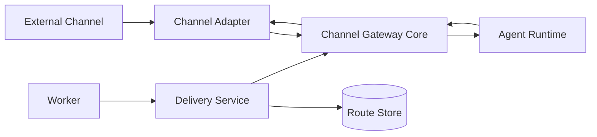
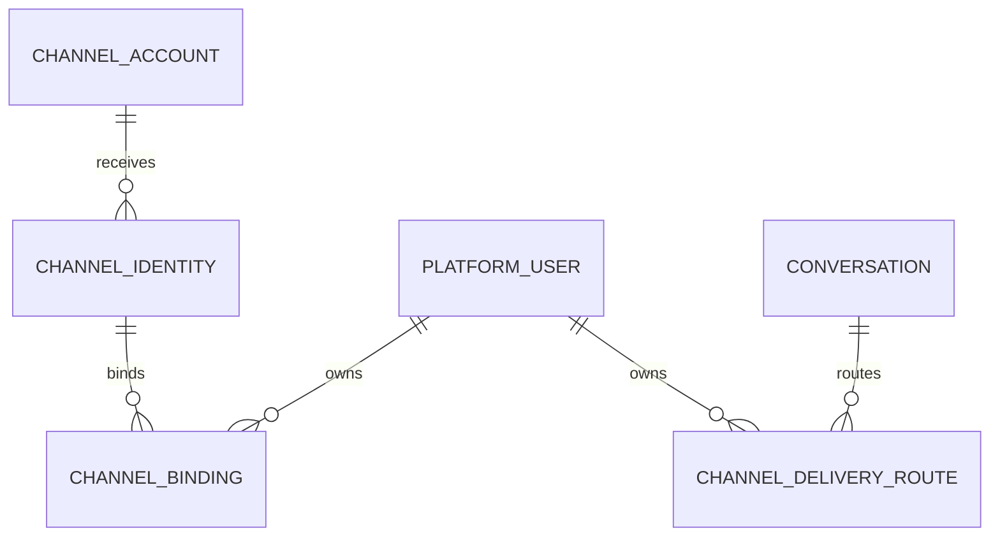

# Channel Gateway 模块需求与设计一体化文档

> **文档编号**: MOD-CHANNEL-1.0  
> **文档版本**: v1.1  
> **创建日期**: 2026-09-10  
> **文档状态**: 设计草稿（V1.7 整改对齐）  
> **设计基线**: 《通用智能服务执行框架 V1.6 总体设计说明书》+《05-变更记录/V1.6-to-V1.7-整改对齐说明》（D03/D05）  
> **模板类型**: design-full（跨模块/架构核心模块）

**评审边界说明**：

- 需求评审：第 2 章，确认模块职责和边界；
- 设计评审：第 3-4 章，确认技术实现、数据、接口、DFX、部署；
- 本文只设计 Framework Core，不引入任何具体项目业务字段。

---

## 1. 文档控制

### 1.1 责任人

| 角色 | 姓名 | 职责范围 |
|---|---|---|
| 产品/架构负责人 | 待定 | 模块边界、需求与总体设计一致性 |
| 开发负责人 | 待定 | 技术方案与实现 |
| 测试负责人 | 待定 | 场景与 Gate |
| 安全/运维评审 | 按需 | 安全、可靠性、部署评审 |

### 1.2 修订历史

| 版本 | 日期 | 变更描述 |
|---|---|---|
| v0.1 | 2026-09-10 | 基于总体设计 V1.6 首次形成模块详细设计 |
| v1.1 | 2026-09-10 | V1.7 整改：Gateway 单次投递禁业务重试（D03）、单镜像+CHANNELS（D05）、owner lease 30s/10s + restart E2E |

---

## 2. 需求分析

### 2.1 需求概述

| 项目 | 内容 |
|---|---|
| 模块名称 | Channel Gateway |
| 模块ID | MOD-CHANNEL |
| 需求类型 | 新框架模块设计 |
| 业务背景 | 框架需要统一接入 WeCom、WebChat、Mattermost、Feishu 等不同 Channel，且长连接生命周期与 Python Agent/Worker 的运行模型不同。 |
| 核心目标 | 以统一 ChannelEnvelope/DeliveryCommand 和 ChannelAdapter SPI 隔离各种消息协议，并保持连接有状态、业务无状态。 |
| 运行形态 | `channel-gateway` 独立 Node.js/TypeScript Deployment |

### 2.2 痛点与价值

| 维度 | 内容 |
|---|---|
| 目标用户 | End User；Channel Adapter Developer；Agent Runtime；Worker Delivery |
| 当前问题 | 每个 Channel 单独写一套 Agent/Conversation/Delivery 会导致重复系统；把长连接塞进 platform-api/agent-runtime 会耦合扩缩与滚动升级。 |
| 框架影响 | Channel 是所有用户流量入口和后台主动通知出口。 |
| 预期价值 | 新增 WebChat/IM 只增加 Adapter，不改变 Agent/Memory/Execution。 |

### 2.3 功能方案

#### 2.3.1 功能清单

| 功能ID | 功能名称 | 功能描述 | 优先级 | 来源 |
|---|---|---|---|---|
| FEAT-01 | Adapter SPI | 连接/接收/回复/主动投递/健康检查。 | P0 | 总体设计 V1.6 |
| FEAT-02 | Inbound Normalize | 原始消息转换为 ChannelEnvelope。 | P0 | 总体设计 V1.6 |
| FEAT-03 | Identity Routing | channel/account/peer 映射 PlatformUser/Agent/Conversation。 | P0 | 总体设计 V1.6 |
| FEAT-04 | Realtime Reply | 把 Agent stream 转为 Channel 协议。 | P0 | 总体设计 V1.6 |
| FEAT-05 | Background Delivery | V1.7 D03：Gateway 仅单次 best-effort 发送并返回 SUCCESS/RETRYABLE/NON_RETRYABLE，重试时机只由 Worker 决定，禁历史重放。 | P0 | 总体设计 V1.7 |
| FEAT-06 | 连接治理 | heartbeat、reconnect、connection ownership（Redis lease `channel-owner:{channel}:{account_id}` TTL30s/renew10s，benchmark 校准）、dedupe；V1 单镜像+CHANNELS（V1.7 D05）。 | P0 | 总体设计 V1.7 |

#### 2.4 范围与边界

| 类别 | 内容 |
|---|---|
| 范围（In Scope） | 多 Channel Adapter、连接管理、消息归一化、路由、去重、流式回复、主动投递。 |
| 非范围（Out of Scope） | LLM、Memory SoT、业务授权、ServiceExecution、Capability。 |
| 前置假设 | Channel 原生 peer/account/message id 可稳定获得；业务路由事实写 PostgreSQL。 |
| 有意妥协/技术债 | V1 首个 Reference Adapter 为 WeCom；不要求第一阶段实现所有 IM。 |

### 2.5 验收条件

#### 2.5.1 业务规则与约束

| ID | 类型 | 描述 | 验证场景 |
|---|---|---|---|
| RULE-01 | 系统约束 | Gateway 允许连接有状态，但 User/Conversation/Execution/DeliveryRoute 不能以本地内存为 SoT。 | S-01 |
| RULE-02 | 系统约束 | 所有入站必须统一为 ChannelEnvelope。 | S-02 |
| RULE-03 | 系统约束 | Worker 不直接调用具体 WeCom/Slack SDK，只发 DeliveryCommand；Gateway 不做业务级重试（V1.7 D03）。 | E-01 |
| RULE-04 | 系统约束 | 原始 Channel ID 保留大小写和原值，不做不必要规范化。 | S-03 |
| RULE-05 | 系统约束 | V1 单一 channel-gateway 镜像 + CHANNELS/--channels 加载多 Adapter；按 Channel 拆 Deployment 仅作未来 ADR（V1.7 D05）。 | S-04 |

#### 2.5.2 功能验收场景

**正常场景**

| 场景ID | 功能ID | 优先级 | 测试层级 | 关键真实边界 | 前置条件 | 操作步骤 | 预期结果 |
|---|---|---|---|---|---|---|---|
| S-01 | FEAT-06 | P0 | integration | Gateway A restart → Route Store → Gateway B | 已完成基础配置 | 用户已发消息后 Gateway 重启 | 业务 Conversation/Execution 不丢，重连后继续接收/投递 |
| S-02 | FEAT-02 | P0 | integration | Adapter → ChannelEnvelope → Agent Runtime | 已完成基础配置 | 两个不同 Channel 发送同一语义消息 | Agent Runtime 收到统一 Contract |
| S-03 | FEAT-05 | P0 | integration | Worker → DeliveryRoute → Gateway → Adapter | 已完成基础配置 | 后台任务完成后用户已离开实时连接 | 按 route 主动发送或记录可恢复投递失败 |
| S-04 | FEAT-01 | P0 | integration | ChannelAdapter → Gateway Contract Test | 已完成基础配置 | 注册一个 Demo ChannelAdapter 并启动/停止/发送测试消息 | 通过统一 Adapter SPI，无需修改 Gateway Core |
| S-05 | FEAT-03 | P0 | integration | ChannelEnvelope → Binding Resolver → Agent Route | 已完成基础配置 | 已绑定用户发送消息 | 通过 channel/account/peer 解析 PlatformUser 与目标 Agent/Conversation |
| S-06 | FEAT-04 | P0 | integration | Agent Stream → Gateway → Channel Adapter | 已完成基础配置 | Agent 返回增量消息 | Gateway 转换为目标 Channel 支持的回复协议；不修改业务正文语义 |

**异常场景**

| 场景ID | 功能ID | 测试层级 | 关键真实边界 | 触发条件 | 系统行为 | 用户感知 |
|---|---|---|---|---|---|---|
| E-01 | FEAT-05 | integration | Architecture Gate | Worker 直接 import WeCom SDK | Core Purity/依赖 Gate 失败 | 返回可识别错误，不泄露内部细节 |
| E-02 | FEAT-06 | integration | Channel Disconnect | 连接断开 | 重连；业务结果仍保存在 SoT，不丢失 | 返回可识别错误，不泄露内部细节 |

#### 2.5.3 非功能指标

| 指标ID | 指标名称 | 目标值 | 测量方法 |
|---|---|---|---|
| NFR-REL-01 | 可靠性 | 不得丢失/破坏框架权威状态；具体 SLA 待真实部署压测后确定 | 故障注入 + integration/E2E |
| NFR-SEC-01 | 安全边界 | 不得信任 LLM 提供的身份/权限/Host 路径等安全上下文 | Architecture Gate + integration |
| NFR-OBS-01 | 可观测性 | 关键操作必须携带 request_id/trace_id 或 execution_id | 日志/Trace 断言 |

性能/QPS/延迟阈值当前没有真实压测依据，本文不虚构固定数字；上线门槛在真实 Reference Integration 跑通后补充。

---

## 3. 技术设计

### 3.1 方案选型

#### 关键决策记录

| 决策点 | 选择 | 被否决项 | 理由 | 可逆性 |
|---|---|---|---|---|
| 部署 | 独立 Channel Gateway | 并入 agent-runtime | 长连接生命周期/语言/扩缩不同 | 中 |
| 抽象 | 统一 ChannelAdapter | 每 Channel 一套服务 | 降低重复逻辑 | 中 |
| 状态 | Connection Stateful / Business Stateless | Gateway 保存业务消息状态 | 支持水平扩容/重启 | 难 |

#### 技术栈

| 类别 | 选型 | 版本 | 选型理由 |
|---|---|---|---|
| 语言 | Node.js/TypeScript | Node 22+/TS 5.7 | IM SDK/长连接生态 |
| Web | Fastify | 5.x | 轻量内部服务 |
| WeCom | @wecom/aibot-node-sdk | 按 Reference Integration | 首个 Adapter |
| 协议 | HTTP/WS/SSE 按 Adapter | 按需 | 统一 Envelope 到内部 |

### 3.2 架构设计



#### 分层职责

| 层级 | 职责 |
|---|---|
| Adapter | 协议/SDK |
| Connection Manager | heartbeat/reconnect/ownership |
| Normalizer | ChannelEnvelope |
| Router | identity/agent/conversation 路由 |
| Delivery | DeliveryCommand → Adapter |

### 3.3 数据设计

> **统一数据库公共字段约束**：本模块凡新增 Framework 自建表，均必须包含 `is_deleted BOOLEAN NOT NULL DEFAULT FALSE`、`create_time TIMESTAMPTZ NOT NULL DEFAULT now()`、`update_time TIMESTAMPTZ NOT NULL DEFAULT now()`；Repository 默认过滤 `is_deleted=false`，删除默认逻辑删除。第三方自管理表（如 LangGraph Checkpointer）不修改其内部 Schema。


| 数据对象/表 | 关键字段 | 约束/索引 | 说明 |
|---|---|---|---|
| channel_account | channel、account_key、config_ref、default_agent_id、enabled | channel/account unique | Channel 端点 |
| channel_identity | account_id、peer_type、peer_id | UNIQUE(account,peer_type,peer_id) | 外部身份 |
| channel_binding | platform_user_id、channel_identity_id、status | identity active unique | 身份映射 |
| channel_delivery_route | user、conversation、channel、account_id、peer_id、status | conversation/channel 索引 | 主动投递路由 |


**ER 图**



### 3.4 接口设计

| 接口ID | 接口/函数 | 形态 | 说明 | 关联功能 |
|---|---|---|---|---|
| INT-01 | ChannelEnvelope → Agent Runtime | 内部 HTTP/stream | 统一入站 | FEAT-02,FEAT-03 |
| INT-02 | Agent Stream → Channel Gateway | 内部 stream | 实时响应 | FEAT-04 |
| INT-03 | DeliveryCommand → Channel Gateway | 内部 API/queue abstraction | 后台投递 | FEAT-05 |
| SPI-01 | ChannelAdapter.send/stream/health | SPI | Channel 实现 | FEAT-01,FEAT-06 |

ChannelEnvelope 字段固定 channel/account_id/peer_type/peer_id/message_id/conversation_ref/content_type/content/received_at。平台用户 ID 由服务端 Binding Resolver 注入，不能信任消息正文。

所有普通 HTTP JSON 接口必须复用统一响应 Envelope：

```json
{
  "code": "OK",
  "message": "success",
  "data": {},
  "request_id": "req-xxx",
  "timestamp": "2026-09-10T15:00:00+00:00"
}
```

SSE/WebSocket/文件流属于协议例外，但必须复用统一错误码 taxonomy 和 request/trace 关联策略。

### 3.5 质量实现方案

#### 可靠性

消息按 channel+account+message_id 去重；连接重连不丢业务状态；主动投递失败持久化并有限重试。

#### 安全性

Adapter 校验来源/签名；绑定码一次性；Gateway 不持有业务 Credential；内部 Agent Runtime 接口只暴露内网/服务身份。

#### 可观测性

connection state、heartbeat、reconnect、inbound/outbound count、dedupe、delivery latency/failure、adapter health。

#### 测试策略

```text
unit
→ 纯规则/状态机/转换

integration
→ Repository / Provider / Runtime 边界

E2E
→ 真实进程/API/数据库/用户可见结果

architecture
→ 依赖方向、Stateless、统一响应、Core Purity 等硬约束
```

---

## 4. 部署与运维

### 4.1 部署架构

独立 Deployment；可一个镜像按 CHANNELS 配置加载不同 Adapter；未来可按 Channel 拆 Deployment 而不改代码边界。

### 4.2 发布与回滚

- 框架代码通过镜像/包版本发布；
- Schema 变化使用 Alembic expand → migrate → switch → contract；
- 只有 `Service` 采用草稿/已发布两态，`Agent` 统一 direct-effect + revision（V1.7 D04），不把代码发布和业务定义发布混成一套版本系统；
- 运行配置可直接生效时必须保留 revision/audit；
- 回滚不得恢复已经撤销的用户权限、Credential 或安全禁用状态。

### 4.3 监控告警

connected accounts、reconnect rate、delivery failures/backlog、inbound error；阈值待定。

阈值当前统一标记为**待定**，由 Reference Integration 实测建立基线后配置。

---

## 5. 风险与依赖

### 5.1 项目依赖

| 依赖模块/团队 | 依赖内容 | 状态 | 风险等级 |
|---|---|---|---|
| PostgreSQL | Binding/DeliveryRoute SoT | 必需 | 高 |
| Agent Runtime | 实时交互 | 必需 | 高 |
| Channel SDK/API | 协议接入 | 按 Adapter | 高 |
| Worker | DeliveryCommand | 必需 | 中 |

### 5.2 风险识别

| 风险ID | 类型 | 描述 | 概率 | 影响 | 应对措施 | 验证场景 |
|---|---|---|---|---|---|---|
| RISK-01 | 可靠性 | 连接状态被误当业务状态 | 中 | 高 | 业务 SoT 外置 + restart E2E | S-01 |
| RISK-02 | 扩展 | 新增 WebChat 又建设第二套 Chat Runtime | 中 | 高 | WebChat 只能作为 ChannelAdapter 接入 | S-02 |

---

## 6. 需求追溯矩阵

| 来源 | 功能ID | 接口ID | 测试场景 | 测试层级 | 状态 |
|---|---|---|---|---|---|
| 总体设计 V1.6 | FEAT-01 | SPI-01 | S-04 | integration/E2E | 待实现 |
| 总体设计 V1.6 | FEAT-02 | INT-01 | S-02 | integration/E2E | 待实现 |
| 总体设计 V1.6 | FEAT-03 | INT-01 | S-05 | integration/E2E | 待实现 |
| 总体设计 V1.6 | FEAT-04 | INT-02 | S-06 | integration/E2E | 待实现 |
| 总体设计 V1.6 | FEAT-05 | INT-03 | S-03, E-01 | integration/E2E | 待实现 |
| 总体设计 V1.6 | FEAT-06 | SPI-01 | S-01, E-02 | integration/E2E | 待实现 |

---

## Spec Compliance Matrix

| Spec/Rule | enforcement | 设计影响 | 设计落点 | 验证场景 | verifier | 状态 |
|---|---|---|---|---|---|---|
| framework#RULE-ARCH-001 | required | Channel Adapter 不污染 Worker/Core | §3.2 | S-02/E-01 | `Core purity/contract` | applied |
| framework#RULE-BE-002 | required | Gateway 日志字段与后端统一 | §3.5 | S-01 | `Gateway integration` | applied |
| framework#RULE-DB-001 | required | Channel/Route 表含公共字段 | §3.3 | S-03 | `test_database_common_fields.py` | applied |

---

## 附录：术语表

| 术语 | 定义 |
|---|---|
| Framework Core | 与具体业务项目解耦的框架内核 |
| Integration | 具体项目对框架 SPI/Contract 的实现和配置 |
| Capability | 稳定的“系统能做什么”合同 |
| Execution | 一次可靠业务服务执行实例 |
| SoT | Source of Truth，权威事实源 |
| SPI | Service Provider Interface，扩展接口 |
| DFX | 面向可靠性、安全性、可测试性、可运维性等质量属性的设计 |

---
