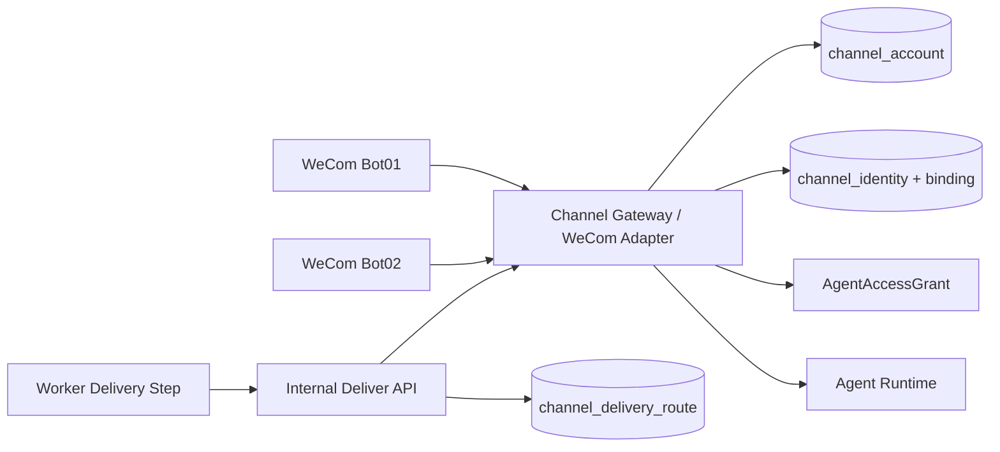
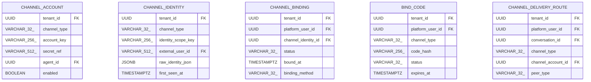

<!-- V1.11 module-split metadata -->
> **文档分档**：`Full`（模板 `design-full.md`）  
> **分档理由**：WeCom WebSocket、身份绑定、路由、主动投递  
> **文档边界**：本文件是该模块唯一详细设计事实源；DB Owner 与接口 Owner 必须落在本模块，不允许在其他模块重复定义。  
> **拆分原则**：仅按可独立评审/编码/验收的一级模块拆分；不按单表/单接口继续碎片化。

# Channel Gateway 模块需求与设计一体化文档

> **文档编号**: MOD-CHAN-V1.13
> **文档版本**: V1.13
> **创建日期**: 2026-09-11
> **文档状态**: 设计基线草案（待仓库 Spec Context 绑定后进入正式评审）
> **模板**: `design-full.md`；生成流程按 `cf-task:align` 的复杂后端/架构模块路径执行。
> **上游基线**: V1.8 完整总体设计 + V6 完整 Playbook + Console V0.8 Final。


**评审边界说明**：
- 第 2 章是需求基线（What），禁止实现阶段自行改变领域语义；
- 第 3-4 章是设计基线（How），DB 与每个接口必须以本文为准；
- `Spec Compliance Matrix` 当前依据设计基线生成，因本轮未提供仓库 `spec-context.yml` 与代码目录，**不得声称已通过 cf-task:align 的 repo Spec Gate**；落码前必须在真实仓库执行 `refresh/catalog/bind`。


## 1. 文档控制

### 1.1 责任人

| 角色 | 姓名 | 职责范围 |
|---|---|---|
| 产品/架构负责人 | 待定 | 需求定义、领域边界、与总设/Playbook 一致性 |
| 开发负责人 | 待定 | 技术方案、DB/API、实现 |
| 测试负责人 | 待定 | S/E/B 场景、E2E Gate |
| 安全/运维 | 待定 | Secret、隔离、发布、监控 |

### 1.2 修订历史

| 版本 | 日期 | 作者 | 变更描述 |
|---|---|---|---|
| V1.11 模块分档拆分版 | 2026-09-11 | ChatGPT / 待项目负责人确认 | 按 cf-task:align + design-full 从最新完整总设/Playbook/交互稿重新生成；细化 DB 与全部接口 |
| V1.13.1 第四轮合理性修复 | 2026-09-12 | Claude Code | 新增 `CH-LIB-02 enqueue_delivery(tx, …)`（显式接收调用方事务）；支持 `EXE-API-07` 重新投递的 `event_id` 规则（`:redeliver:<n>`）与场景 `S-CHAN-10`；新增 `S-WORK-13` 对应的槽位协调表登记 |
| V1.13 第三轮 Review 修复 | 2026-09-12 | Claude Code | 场景行归位与表格修复；新增 human_wait/progress_stage 投递与 RULE-CHAN-09；命令集对齐与 MEM-INT-01 去重；Bot Secret lease 与连接状态数据源；删除 Console 会话接口；message_type 补 PROPOSAL 与 CONV-LIB-03 |

## 2. 需求分析

### 2.1 需求概述

| 项目 | 内容 |
|---|---|
| 模块名称 | Channel Gateway |
| 模块ID | MOD-CHAN |
| 所属系统/产品线 | Fluxion 通用智能服务执行框架 |
| 需求类型 | 中大型功能 / 架构演进 |
| 业务背景 | WeCom Bot WebSocket 已验证支持入站、流式回复、主动推送；最新设计把身份、Bot 路由、User→Agent 授权完全拆开。 |
| 核心目标 | 实现可横向运行的通用 Channel Gateway + WeCom Adapter：多 Bot 连接、身份绑定、Agent 路由、消息去重、流式回复与后台投递。 |

### 2.2 痛点与价值

| 维度 | 内容 |
|---|---|
| 目标用户 | End User（WeCom）/Admin/Agent Runtime/Worker |
| 当前问题 | 把 WebSocket 放 Agent Runtime 会导致连接与 reasoning 耦合；/bind 如果同时承担 Agent 绑定会让用户换 Bot 反复绑定；主动推送没有持久 DeliveryRoute 会丢目标。 |
| 业务影响 | 扩缩容困难、身份/授权混淆、后台任务完成无法可靠通知。 |
| 预期价值 | 一个 Gateway 服务管理多 Bot；用户身份跨渠道复用；Agent Runtime 保持无状态。 |

### 2.3 功能方案

#### 2.3.1 功能清单

| 功能ID | 功能名称 | 功能描述 | 优先级 | 来源 |
|---|---|---|---|---|
| FEAT-CHAN-01 | ChannelAccount | Agent 下配置一个 WeCom Bot。 | P0 | 交互稿 IM 接入 |
| FEAT-CHAN-02 | Connection Manager | 一个 Gateway 管理多个 Bot WebSocket。 | P0 | 已验证能力 |
| FEAT-CHAN-03 | Identity/Bind | ChannelIdentity + BindCode + Binding。 | P0 | /bind |
| FEAT-CHAN-04 | Route/Auth | bot→Agent；identity→User；User→Agent grant。 | P0 | 三分离 |
| FEAT-CHAN-05 | DeliveryRoute | 后台主动推送。 | P0 | Progress |
| FEAT-CHAN-06 | Adapter SPI | 未来 WebChat/Mattermost 等。 | P1 | 总设扩展 |
| FEAT-CHAN-07 | IM 命令转发 | 用户命令经 CH-INT-02 转发到 agent-runtime 领域 Application（九条动作）；/bind 本模块本地处理。 | P0 | IM 命令 |

### 2.4 范围与边界

| 类别 | 内容 |
|---|---|
| 范围（In Scope） | ChannelAccount/Identity/Binding/BindCode/DeliveryRoute、WeCom connection manager、ChannelEnvelope、/bind 命令、消息 dedupe/stream/delivery。 |
| 非范围（Out of Scope） | Agent reasoning、业务授权复制、Execution/Memory SoT、同一 Bot 多 Agent 路由。 |
| 前置假设 | 上游总设、公共 DB/API 规范、外部基础设施可用 |
| 有意妥协 / 技术债 | 无；未来扩展必须有真实旅程驱动 |

### 2.5 验收条件

#### 2.5.1 业务规则与约束

| ID | 类型 | 描述 | 验证场景 |
|---|---|---|---|
| RULE-CHAN-01 | Bot | V1 一个 bot_id 只服务一个 Agent；一个 Agent 最多一个 active WeCom Bot。 | S-CHAN-01 |
| RULE-CHAN-02 | Gateway | 一个 Gateway 进程可维护多个 Bot WebSocket。 | S-CHAN-02 |
| RULE-CHAN-03 | 绑定 | /bind 只做 ChannelIdentity→PlatformUser，不含 Agent/Bot/Service。 | S-CHAN-03 |
| RULE-CHAN-04 | 授权 | 消息入站必须在 identity resolve 后检查 current AgentAccessGrant。 | S-CHAN-04 |
| RULE-CHAN-05 | 路由 | ChannelDeliveryRoute 是业务持久事实；connection ownership 可本地/Redis 协调。 | S-CHAN-05 |
| RULE-CHAN-06 | IM 命令 | Gateway 统一解析 IM 命令并转发，不含业务语义：/bind 由本模块本地处理（只做 ChannelIdentity→PlatformUser，RULE-CHAN-03）；其余命令移交 CH-INT-02 的九条动作 SKILLS/NEW/STOP/RESUME/CANCEL/MEMORY_LIST/MEMORY_CLEAR/RESULT/CONFIRM（Playbook 的 4 条用户可见命令是这九条的子集）；/stop → CH-INT-02 按显式目标或当前 Chat Run/Execution 解析；全部命令由 agent-runtime 的领域 Application 处理，禁止调用 Console 端点。`/memory remember` 不走命令集，由普通消息经 Agent 的 Memory 工具（MEM-LIB-02）写入。 | S-CHAN-03, S-CHAN-08 |
| RULE-CHAN-08 | 扩容 | V1 单副本部署（多副本前的 Gate：Redis 协调 Bot 连接归属、错实例投递经内部转发、Redis 不可用时退化为单接管）；单进程多 Bot 连接已支持。 | S-CHAN-02, E-CHAN-03 |
| RULE-CHAN-09 | 人工等待通知 | 进入 WAITING_HUMAN 时平台**自动**经该 Execution 的 DeliveryRoute 推送**恰好一条** `human_wait` 通知（event_id=`execution_id:human_wait:<step_key>:<entered_at_epoch>`）。文案按以下优先级**合并为同一条消息**：Service 编排的承载提示（若存在）优先，其中缺失的六要素由平台默认文案补齐；无编排时全部用平台默认文案。六要素：发生了什么 / 影响哪一步 / 系统已经做了什么 / 为什么需要我处理 / 有哪些选择 / 不同选择意味着什么。**禁止为同一次进入等待发送两条通知**（编排文案是覆盖，不是追加）。 | S-CHAN-09 |

#### 2.5.2 功能验收场景

**正常场景**

| 场景ID | 功能ID | 优先级 | 测试层级 | 关键真实边界 | 归属 | 前置条件 | 操作步骤 | 预期结果 |
|---|---|---|---|---|---|---|---|---|
| S-CHAN-01 | FEAT-CHAN-01 | P0 | E2E | Console→API→Secret→Gateway | 本模块 | Agent 无 Bot | 配置 bot01 | Gateway 建连，bot01 路由 Agent01 |
| S-CHAN-02 | FEAT-CHAN-02 | P0 | E2E | 2 bots→1 Gateway | 本模块 | bot01/bot02 已配置 | 同时收消息 | 分别路由 Agent01/Agent02 |
| S-CHAN-03 | FEAT-CHAN-03 | P0 | E2E | WeCom /bind→DB | 本模块 | 外部身份未绑定 | 发送 /bind CODE | Identity 绑定 PlatformUser；不改变 Agent grant |
| S-CHAN-04 | FEAT-CHAN-04 | P0 | E2E | Gateway→Grant→Runtime | 后置 → 模块 18/03 | 身份已绑定且有 grant | 发普通消息 | 路由 Agent 并流式回复 |
| S-CHAN-05 | FEAT-CHAN-05 | P0 | E2E | Worker→delivery API→WebSocket | 本模块 | 用户离开后任务完成 | 主动投递 | 按持久 Route 发送到正确 peer |
| S-CHAN-08 | FEAT-CHAN-05 | P1 | E2E | /stop 目标解析与多候选 | 本模块 | 用户存在多个非终态 Chat Run/Execution | 发送 /stop（无显式 target）| 返回 COMMAND_TARGET_AMBIGUOUS(409) 不猜测；带显式 target 时停止对应目标 |
| S-CHAN-10 | FEAT-CHAN-05 | P1 | integration | 管理员重新投递 | 本模块 + 05 | 执行 SUCCEEDED 且最近一次投递为 FAILED | Admin 调 `EXE-API-07` → 平台预建 `event_id=<原>:redeliver:1` 的 PENDING 行 → WORK-LIB-06 调度发送 | 新建一条投递尝试（不覆盖原行、不改 `dedupe_key` 语义）；同 `idempotency_key` 重复请求返回原 `delivery_id`、不新增行；`delivery_status` 由 FAILED 变为 DELIVERED 或新的 FAILED |
| S-CHAN-09 | FEAT-CHAN-05 | P0 | E2E | Worker→delivery(DELIVERY)→WebSocket | 本模块 | END_USER 发起服务执行并进入 WAITING_HUMAN | 等待平台 human_wait 推送（该 Service 未编排承载提示的 DELIVERY 步骤）→ 本人在 IM 回复决策 | 本人在 deadline 内收到含六要素的 human_wait 文本消息（TEXT、已冻结文案、event_id=execution_id:human_wait:<step_key>:<entered_at_epoch>），投递给该 Execution actor_user_id 的 DeliveryRoute；决策后经 CH-INT-02 RESUME/CANCEL 流转状态且不被静默超时 |

**异常场景**

| 场景ID | 功能ID | 测试层级 | 关键真实边界 | 归属 | 触发条件 | 系统行为 | 用户感知 |
|---|---|---|---|---|---|---|---|
| E-CHAN-01 | FEAT-CHAN-03 | E2E | BindCode DB | 本模块 | code 过期/已用/作废 | 绑定失败并给可理解提示 | 不创建 binding |
| E-CHAN-02 | FEAT-CHAN-04 | E2E | Grant check | 后置 → 模块 18 | 身份已绑定但无 Agent grant | 发消息 | 返回无权限，不进 Runtime |
| E-CHAN-03 | FEAT-CHAN-02 | integration | WebSocket reconnect | 本模块 | 连接断开 | 指数退避重连并更新 health | 业务身份/route 不丢 |

**边界场景**

| 场景ID | 测试层级 | 关键真实边界 | 归属 | 字段/条件 | 边界值 | 预期行为 |
|---|---|---|---|---|---|---|
| B-CHAN-01 | integration | unique constraints | 本模块 | 同 bot_id 配置两个 Agent | 冲突 | 409 BOT_ID_EXISTS |
| B-CHAN-02 | integration | identity scope | 本模块 | 同用户跨 Bot external id 是否稳定 | 以真实 WeCom 实测决定 scope | 模型支持同 User 绑定多个 Identity，不复制 Agent grant |

#### 2.5.3 非功能指标

| 指标ID | 指标名称 | 目标值 | 测量方法 |
|---|---|---|---|
| NFR-REL-01 | 可靠执行 | 不得因单 Runtime/Worker 进程退出丢失权威状态 | SIGKILL/E2E |
| NFR-SEC-01 | 可信身份 | LLM/客户端不得覆盖 tenant/actor/secret | 安全测试 |
| NFR-OBS-01 | 可追踪 | 关键路径可按 request_id/trace_id/execution_id 定位 | 集成/E2E |

## 3. 技术设计

### 3.1 方案选型

#### 3.1.1 关键决策记录

| 决策点 | 选择 | 被否决项 | 理由 | 可逆性 |
|---|---|---|---|---|
| 连接位置 | 独立 Channel Gateway | Agent Runtime 持 WebSocket | 无状态 Runtime 与连接状态分离 | 中 |
| V1 Bot 路由 | 1 Bot→1 Agent | 同 Bot 多 Agent Router | 先满足明确旅程 | 未来可扩展 |
| 身份绑定 | ChannelIdentity→User | BindCode 绑定 Agent | 跨 Bot/跨渠道复用身份 | 难 |

#### 3.1.2 技术栈

| 类别 | 选型 | 版本 | 选型理由 |
|---|---|---|---|
| 语言 | TypeScript（Node.js） | Node 20+ / TS 5.7 | 总设部署基线：channel-gateway 是四个生产镜像中唯一 Node 角色，需接入企微官方 IM SDK（@wecom/aibot-node-sdk） |
| Web/API | Fastify | 仓库实际版本确认 | 轻量异步 HTTP，承接企微回调验签 |
| 数据库访问 | 无直连业务库 | — | Gateway（Node）不直连 PostgreSQL：运行数据经 agent-runtime 的 CH-DATA-01..04/CH-INT-02 受信内部 REST 获取；agent-runtime 装配 Python Channel/Conversation/Execution Application 与 PG Repository，不经过 platform-api。Console 管理 CRUD 仍由 platform-api 装配同一 Owner。DB migration 唯一 Owner=Python Alembic，不新增生产角色 |
| 数据库 | PostgreSQL | 外部部署 | 业务 SoT |

> 示例代码为伪代码，实现语言为 TypeScript。

### 3.2 架构设计



#### 3.2.1 模块职责分层

| 层级 | 职责 | 禁止事项 |
|---|---|---|
| Handler/API | 协议解析、DTO、权限入口、统一错误映射 | 业务逻辑/直接 SQL |
| Application Service | 用例编排、事务边界、领域校验 | 依赖具体 Web 框架 |
| Domain | 领域对象/规则 | 基础设施依赖 |
| Repository/Port | 持久化/外部能力抽象 | 泄露 Secret/跨领域修改 |
| Adapter | PostgreSQL/HTTP/MCP 等实现 | 改变领域语义 |

#### 3.2.2 外部依赖清单

| 外部系统/模块 | 依赖类型 | 协议/接口 | 超时/一致性 | 降级策略 |
|---|---|---|---|---|
| AgentAccessGrant | 消息授权 | CH-DATA-02 → agent-runtime/PG | current | 无权不进 Runtime |
| Agent Runtime | 实时对话 | internal SSE/stream | deadline/断连 | 返回渠道错误/重试 |
| Secret Provider | Bot Secret | Port | 安全 | 不可用无法建连 |
| PostgreSQL | 身份/Route SoT | agent-runtime 的 Channel Repository；Worker 复用 Python Port | 强一致 | 不以 Gateway 内存替代 |

### 3.3 数据设计

#### 3.3.1 表清单

| 表名 | 职责 | 所有权 |
|---|---|---|
| channel_account | 具体渠道账号/端点。V1 WeCom 一个 bot_id 只绑定一个 Agent；一个 Agent 最多一个 active WeCom Bot。 | Channel Gateway |
| channel_identity | 外部渠道身份事实，只回答“是谁”，不携带 Agent 权限。 | Channel Gateway |
| channel_binding | ChannelIdentity 与 PlatformUser 的显式绑定关系；可撤销；绑定码只创建此关系。 | Channel Gateway |
| bind_code | 一次性身份绑定码；只建立 ChannelIdentity→PlatformUser，不含 Agent/Bot/Service。 | Channel Gateway |
| channel_delivery_route | 后台任务/结果应该投递到哪里；与 ProgressEvent 分离。 | Channel Gateway |
| channel_delivery | 投递状态事实：每次对外投递的 attempt/结果/错误，供重试与排障。 | Channel Gateway |

#### 表 `channel_delivery`

**职责**：Worker 唯一持久投递队列；Gateway 单次 Adapter.send，不自行循环重试。

| 字段名 | 类型 | 可空 | 默认值 | 索引 | 说明 |
|---|---|---|---|---|---|
| tenant_id | UUID | N |  | IDX | 租户 |
| execution_id | UUID | N |  | FK | 来源执行 |
| step_id | UUID | Y |  | FK | 非步骤通知为空 |
| delivery_route_id | UUID | N |  | FK | 持久路由；创建 Execution 时从可信 ctx 固定写入，投递只按该持久路由，不按会话临时解析 |
| event_type | VARCHAR(32) | N |  | IDX | completed/failed/human_wait/progress_stage |
| event_id | VARCHAR(256) | N |  |  | 事件/用户取件命令唯一身份；同一事件重复入队返回同一行。规则见下 |
| channel | VARCHAR(32) | N |  |  | 渠道类型 |
| payload_json | JSONB | N |  |  | 不可变 DeliveryMessage，TEXT 或 FILE artifact_id；不保存短期 URL |
| status | VARCHAR(16) | N | PENDING | IDX | PENDING/SENDING/RETRY_WAIT/DELIVERED/FAILED/UNKNOWN |
| attempt | INTEGER | N | 0 |  | 实际进入 SENDING 次数；包括未知结果 |
| max_attempts | INTEGER | N | 5 |  | 发送次数上限 |
| next_attempt_at | TIMESTAMPTZ | Y |  | IDX | 已确认未发送的失败退避 |
| lease_owner | VARCHAR(256) | Y |  |  | 发送 attempt 的 Worker |
| lease_expires_at | TIMESTAMPTZ | Y |  |  | 发送租约 |
| lease_epoch | BIGINT | N | 0 |  | attempt fencing token |
| dispatch_started_epoch | BIGINT | Y |  |  | 已交给 Gateway 的 attempt；重放不二次发送 |
| remote_idempotency | BOOLEAN | N | FALSE |  | Adapter 经验证支持远端同键去重时才为 true |
| dedupe_key | VARCHAR(128) | N |  | UK | dlv: + canonical(tenant,execution,step_id,route_id,event_id) SHA-256 十六进制，共 68 字符 |
| provider_message_id | VARCHAR(512) | Y |  |  | 渠道已确认的发送 ID |
| last_error | TEXT | Y |  |  | 脱敏错误 |
| delivered_at | TIMESTAMPTZ | Y |  |  | 收到成功 ACK 后时间 |
| id | UUID | N | gen_random_uuid() | PK | 主键 |
| is_deleted | BOOLEAN | N | FALSE |  | 默认过滤 FALSE |
| create_time | TIMESTAMPTZ | N | CURRENT_TIMESTAMP |  | 创建时间 |
| update_time | TIMESTAMPTZ | N | CURRENT_TIMESTAMP |  | 更新时间 |

**约束与索引**

- UNIQUE (tenant_id,dedupe_key)；(tenant_id,status,next_attempt_at,lease_expires_at) 调度索引。
- 同 key 的 payload/route 不可改，重复入队返回同一行，换参 DELIVERY_IDEMPOTENCY_CONFLICT。
- 对同一行只允许一个有效 attempt lease；owner/epoch 校验全部结果写入；状态路径详见 CH-INT-01。
- 业务 Execution 终态不删除待投递行，重试不得重跑业务步骤。
- `event_type` 四值：`completed`/`failed`（执行终态）、`human_wait`（进入人工等待）、`progress_stage`（STAGE 级阶段进度；V1 不推 PROGRESS 级）。
- `event_id` 规则：完成/失败 = `execution_id:completed` 或 `execution_id:failed`；人工等待 = `execution_id:human_wait:<step_key>:<entered_at_epoch>`（同一步持续等待不重复通知，重新进入等待产生新 epoch 才形成新事件）；阶段进度 = `progress_event.id`（保证同一进度事件不重复投递）；**管理员重新投递**（`EXE-API-07`）= `<原 event_id>:redeliver:<n>`（n 为该执行重新投递的序号，从 1 递增）——这是**有意产生新 dedupe_key** 的动作，因此不会被 UNIQUE 拦下；同一 `idempotency_key` 的重复请求由模块 05 幂等返回原 `delivery_id`，不新增行。`event_id` 参与 dedupe_key 的 canonical 计算。
- `human_wait` 与 `progress_stage` 两类行由 **Worker 在写状态的事务内预建**（模块 06 负责调度与事件生成），Gateway 只按 CH-INT-01 的 attempt_token 单次发送，不自行决定是否通知。

#### 表 `channel_account`

**职责**：具体渠道账号/端点。V1 WeCom 一个 bot_id 只绑定一个 Agent；一个 Agent 最多一个 active WeCom Bot。

| 字段名 | 类型 | 可空 | 默认值 | 索引 | 说明 |
|---|---|---|---|---|---|
| tenant_id | UUID | N |  | IDX | 租户 |
| channel_type | VARCHAR(32) | N |  | IDX | WECOM；未来 WEBCHAT/... |
| account_key | VARCHAR(256) | N |  | IDX | WeCom bot_id；保持原始大小写 |
| secret_ref | VARCHAR(512) | N |  |  | Bot Secret 引用；不落明文。只由 CH-DATA-01 在受权 scope 内解析为短时 SecretLease 下发，任何接口都不直接返回它 |
| agent_id | UUID | N |  | FK,IDX | 路由目标 Agent |
| enabled | BOOLEAN | N | TRUE | IDX | 是否连接/接收 |
| connection_metadata | JSONB | N | {} |  | corp/app 等非敏感信息 + 连接健康快照 `{state, last_connected_at, updated_at}` |
| last_connected_at | TIMESTAMPTZ | Y |  |  | 最近一次成功建连（连接健康快照冗余列，仅作查询便利） |
| revision | BIGINT | N | 1 |  | 配置 revision |
| id | UUID | N | gen_random_uuid() | PK | 主键 |
| is_deleted | BOOLEAN | N | FALSE | IDX | 软删除标记；默认查询必须过滤 FALSE |
| create_time | TIMESTAMPTZ | N | CURRENT_TIMESTAMP |  | 创建时间 |
| update_time | TIMESTAMPTZ | N | CURRENT_TIMESTAMP |  | 更新时间 |

**约束**

- UNIQUE (tenant_id,channel_type,account_key) WHERE is_deleted=false
- WECOM: UNIQUE (tenant_id,agent_id,channel_type) WHERE enabled=true AND is_deleted=false
- **连接健康数据源**：Gateway 每 30s 将各 account 的连接健康写入 `connection_metadata = {state: CONNECTED|DISCONNECTED, last_connected_at, updated_at}`；这是 `connection_state` 的唯一事实源，其他进程不另行推断。platform-api 读取时若 `updated_at` 距当前超过 90s（3 个上报周期）则降级返回 `UNKNOWN`；Gateway 重启后尚未建连的 account 一律为 `UNKNOWN`，**不得伪造 CONNECTED**。`state` 不再有独立的 Redis/内存权威来源。

**索引设计**

| 索引名 | 类型 | 字段 | 使用场景 |
|---|---|---|---|
| uk_channel_account_key | UNIQUE(partial) | tenant_id,channel_type,account_key | WHERE is_deleted=false |
| idx_channel_account_agent | BTREE | tenant_id,agent_id,channel_type,enabled,is_deleted | Agent IM 配置 |

#### 表 `channel_identity`

**职责**：外部渠道身份事实，只回答“是谁”，不携带 Agent 权限。

| 字段名 | 类型 | 可空 | 默认值 | 索引 | 说明 |
|---|---|---|---|---|---|
| tenant_id | UUID | N |  | IDX | 租户 |
| channel_type | VARCHAR(32) | N |  | IDX | WECOM/... |
| identity_scope_key | VARCHAR(256) | N |  | IDX | corp/account scope；由 Adapter 决定 |
| external_user_id | VARCHAR(512) | N |  | IDX | 原始外部用户 ID，不随意 lowercase |
| raw_identity_json | JSONB | N | {} |  | 非敏感原始元数据 |
| first_seen_at | TIMESTAMPTZ | N | CURRENT_TIMESTAMP |  | 首次看到 |
| id | UUID | N | gen_random_uuid() | PK | 主键 |
| is_deleted | BOOLEAN | N | FALSE | IDX | 软删除标记；默认查询必须过滤 FALSE |
| create_time | TIMESTAMPTZ | N | CURRENT_TIMESTAMP |  | 创建时间 |
| update_time | TIMESTAMPTZ | N | CURRENT_TIMESTAMP |  | 更新时间 |

**约束**

- UNIQUE (tenant_id,channel_type,identity_scope_key,external_user_id) WHERE is_deleted=false

**索引设计**

| 索引名 | 类型 | 字段 | 使用场景 |
|---|---|---|---|
| uk_channel_identity_external | UNIQUE(partial) | tenant_id,channel_type,identity_scope_key,external_user_id | WHERE is_deleted=false |

#### 表 `channel_binding`

**职责**：ChannelIdentity 与 PlatformUser 的显式绑定关系；可撤销；绑定码只创建此关系。

| 字段名 | 类型 | 可空 | 默认值 | 索引 | 说明 |
|---|---|---|---|---|---|
| tenant_id | UUID | N |  | IDX | 租户 |
| platform_user_id | UUID | N |  | FK,IDX | 平台用户 |
| channel_identity_id | UUID | N |  | FK,IDX | 外部身份 |
| status | VARCHAR(32) | N | ACTIVE | IDX | ACTIVE/REVOKED |
| bound_at | TIMESTAMPTZ | N | CURRENT_TIMESTAMP |  | 绑定时间 |
| binding_method | VARCHAR(32) | N | BIND_CODE |  | BIND_CODE/ADMIN |
| revoked_at | TIMESTAMPTZ | Y |  |  | 撤销时间 |
| id | UUID | N | gen_random_uuid() | PK | 主键 |
| is_deleted | BOOLEAN | N | FALSE | IDX | 软删除标记；默认查询必须过滤 FALSE |
| create_time | TIMESTAMPTZ | N | CURRENT_TIMESTAMP |  | 创建时间 |
| update_time | TIMESTAMPTZ | N | CURRENT_TIMESTAMP |  | 更新时间 |

**约束**

- 一个 ChannelIdentity 同时最多绑定一个 PlatformUser；UNIQUE active(channel_identity_id)
- 同一 PlatformUser 可绑定多个外部身份

**索引设计**

| 索引名 | 类型 | 字段 | 使用场景 |
|---|---|---|---|
| uk_channel_binding_identity | UNIQUE(partial) | tenant_id,channel_identity_id | WHERE is_deleted=false AND status=ACTIVE（同一身份同时最多一个 ACTIVE 绑定；历史绑定不占唯一位） |
| idx_channel_binding_user | BTREE | tenant_id,platform_user_id,status,is_deleted | 用户详情 IM 身份 |

#### 表 `bind_code`

**职责**：一次性身份绑定码；只建立 ChannelIdentity→PlatformUser，不含 Agent/Bot/Service。

| 字段名 | 类型 | 可空 | 默认值 | 索引 | 说明 |
|---|---|---|---|---|---|
| tenant_id | UUID | N |  | IDX | 租户 |
| platform_user_id | UUID | N |  | FK,IDX | 目标用户 |
| channel_type | VARCHAR(32) | N |  | IDX | 渠道 |
| code_hash | VARCHAR(256) | N |  | UK | 绑定码哈希；不保存可恢复明文 |
| status | VARCHAR(32) | N | PENDING | IDX | PENDING/USED/EXPIRED/REVOKED |
| expires_at | TIMESTAMPTZ | N |  | IDX | 过期时间 |
| used_at | TIMESTAMPTZ | Y |  |  | 使用时间 |
| used_identity_id | UUID | Y |  | FK | 成功绑定身份 |
| created_by | UUID | N |  |  | 生成者 |
| id | UUID | N | gen_random_uuid() | PK | 主键 |
| is_deleted | BOOLEAN | N | FALSE | IDX | 软删除标记；默认查询必须过滤 FALSE |
| create_time | TIMESTAMPTZ | N | CURRENT_TIMESTAMP |  | 创建时间 |
| update_time | TIMESTAMPTZ | N | CURRENT_TIMESTAMP |  | 更新时间 |

**约束**

- 同一 user+channel_type 同时最多一个 PENDING 有效码；新建码使旧码 REVOKED
- code_hash 不可逆
- payload 不得含 agent_id/bot_id/service_id

**索引设计**

| 索引名 | 类型 | 字段 | 使用场景 |
|---|---|---|---|
| uk_bind_code_hash | UNIQUE | tenant_id,code_hash | /bind 校验 |
| idx_bind_code_user_current | BTREE | tenant_id,platform_user_id,channel_type,status,expires_at | 当前码 |

#### 表 `channel_delivery_route`

**职责**：后台任务/结果应该投递到哪里；与 ProgressEvent 分离。

| 字段名 | 类型 | 可空 | 默认值 | 索引 | 说明 |
|---|---|---|---|---|---|
| tenant_id | UUID | N |  | IDX | 租户 |
| platform_user_id | UUID | N |  | FK,IDX | 用户 |
| conversation_id | UUID | Y |  | FK,IDX | 会话 |
| channel_type | VARCHAR(32) | N |  | IDX | 渠道 |
| channel_account_id | UUID | N |  | FK,IDX | 具体 Bot/Account |
| peer_type | VARCHAR(32) | N |  |  | USER/CHAT/GROUP |
| peer_id | VARCHAR(512) | N |  | IDX | userid/chatid 等原始标识 |
| status | VARCHAR(32) | N | ACTIVE |  | ACTIVE/STALE |
| last_active_at | TIMESTAMPTZ | N | CURRENT_TIMESTAMP | IDX | 活跃时间 |
| id | UUID | N | gen_random_uuid() | PK | 主键 |
| is_deleted | BOOLEAN | N | FALSE | IDX | 软删除标记；默认查询必须过滤 FALSE |
| create_time | TIMESTAMPTZ | N | CURRENT_TIMESTAMP |  | 创建时间 |
| update_time | TIMESTAMPTZ | N | CURRENT_TIMESTAMP |  | 更新时间 |

**约束**

- 不得把本表作为授权事实；投递前可检查 Channel Account enabled

**索引设计**

| 索引名 | 类型 | 字段 | 使用场景 |
|---|---|---|---|
| idx_delivery_route_user | BTREE | tenant_id,platform_user_id,last_active_at DESC | 选择最近路由 |
| idx_delivery_route_conversation | BTREE | tenant_id,conversation_id | Execution 回投 |

#### 3.3.2 ER 图



#### 3.3.3 数据一致性与软删除规则

- 所有 Framework 自建可变表使用 `is_deleted/create_time/update_time`；查询默认过滤 `is_deleted=false`。
- FK 只引用同一租户可见对象；跨租户引用必须在 Application Service 拒绝。
- Secret/Token/Password 不落业务表明文，只保存 `secret_ref/credential_ref`。
- 不可变 Release/Snapshot/Artifact 使用 append-only；需要更新时新建记录。
- `revision` 用于 direct-effect 配置的乐观并发和审计，不等同于发布版本。

### 3.4 接口设计

#### 3.4.1 接口清单

| 接口ID | 名称 | 形态 | 方法/签名 | 路径/用途 |
|---|---|---|---|---|
| CH-API-01 | 读取 Agent WeCom 接入 | HTTP | GET | /api/v1/agents/{agent_id}/channel/wecom |
| CH-API-02 | 保存 Agent WeCom 接入 | HTTP | PUT | /api/v1/agents/{agent_id}/channel/wecom |
| CH-API-03 | 用户 IM 身份列表 | HTTP | GET | /api/v1/users/{user_id}/channel-identities |
| CH-API-04 | 解除 IM 身份 | HTTP | DELETE | /api/v1/users/{user_id}/channel-identities/{identity_id} |
| CH-API-05 | 生成绑定码 | HTTP | POST | /api/v1/users/{user_id}/bind-codes |
| CH-API-06 | 读取当前绑定码状态 | HTTP | GET | /api/v1/users/{user_id}/bind-codes/current |
| CH-API-07 | 作废绑定码 | HTTP | POST | /api/v1/users/{user_id}/bind-codes/{bind_code_id}/revoke |
| CH-DATA-01 | Gateway 配置读取（含短时 SecretLease） | HTTP | GET | /internal/v1/channel-accounts |
| CH-DATA-02 | 可信入站解析 | HTTP | POST | /internal/v1/channels/resolve-envelope |
| CH-DATA-03 | 发送许可登记 | HTTP | POST | /internal/v1/channel-deliveries/{delivery_id}/dispatch |
| CH-DATA-04 | 附件内部取流 | HTTP | GET | /internal/v1/channel-deliveries/{delivery_id}/artifact |
| CH-INT-01 | 后台主动投递 | HTTP | POST | /internal/v1/channels/deliver |
| CH-INT-02 | IM 用户命令内部转发 | HTTP | POST | /internal/v1/commands |
| CH-LIB-01 | 统一入站 Envelope 处理 | Library | async def handle_channel_envelope(envelope: ChannelEnvelope) -> None |  |
| CH-LIB-02 | 预建投递行（调用方事务） | Library | async def enqueue_delivery(tx: AsyncSession, *, delivery_route_id: UUID, event_type: str, event_id: str, payload: DeliveryPayload) -> UUID | 供模块 05/06 在同一事务写 channel_delivery |

#### CH-API-01: 读取 Agent WeCom 接入

**入口类型**：HTTP

**契约**：`GET /api/v1/agents/{agent_id}/channel/wecom`

**认证/授权**：登录会话（中间件解析，RULE-API-02）；Builder + Admin（ADR-021）

**请求体**：无。

**响应 data**

| 字段 | 类型 | 说明 |
|---|---|---|
| configured | boolean | 是否配置 |
| bot_id | string | 原始 bot_id/account_key |
| secret_configured | boolean | Secret 是否存在 |
| enabled | boolean | 状态 |
| connection_state | string | CONNECTED/DISCONNECTED/UNKNOWN；来自 `channel_account.connection_metadata` 连接健康快照 |
| last_connected_at | datetime | 最近连接；同一快照的 `last_connected_at` |
| revision | integer | revision |

**响应示例**

```json
{
  "code": 0,
  "message": "success",
  "data": {
    "configured": true,
    "bot_id": "<bot_id>",
    "secret_configured": true,
    "enabled": true,
    "connection_state": "<connection_state>",
    "last_connected_at": "2026-09-11 10:00:00",
    "revision": 1
  },
  "request_id": "req_xxx"
}
```

**错误码**

| 错误码 | 场景 | HTTP 状态 |
|---|---|---|
| AGENT_NOT_FOUND | Agent 不存在 | 404 |

**处理逻辑**

```text
Agent scoped read channel_account(WECOM) → 连接状态只读 connection_metadata 连接健康快照（state/last_connected_at/updated_at）：
  - state=CONNECTED 且 updated_at 距当前 <= 90s → 返回 CONNECTED 并带 last_connected_at；
  - updated_at > 90s（Gateway 停止上报或已重启未建连）或快照缺失 → 降级返回 UNKNOWN；
  - 已明确断开 → DISCONNECTED。
不得由 platform-api 根据 enabled/secret 存在性推断为 CONNECTED。Secret 不返回。
```

#### CH-API-02: 保存 Agent WeCom 接入

**入口类型**：HTTP

**契约**：`PUT /api/v1/agents/{agent_id}/channel/wecom`

**认证/授权**：登录会话（中间件解析，RULE-API-02）；**仅 Admin**（ADR-021）。本接口写入 Bot Secret（密钥），属敏感写操作，Builder 不授予；只读接入信息仍走 CH-API-01（Builder + Admin）。

**请求体**

| 参数 | 类型 | 必填 | 说明 |
|---|---|---|---|
| bot_id | string | Y | 企微 Bot ID；原样保存 |
| secret | string | N | 新建必填，编辑为空表示不替换 |
| enabled | boolean | Y | 启用 |
| revision | integer | N | 已有配置时乐观锁 |

**请求示例**

```json
{
  "bot_id": "<bot_id>",
  "secret": "<secret>",
  "enabled": true,
  "revision": 1
}
```

**响应 data**

| 字段 | 类型 | 说明 |
|---|---|---|
| channel_account_id | uuid | Account ID |
| bot_id | string | Bot ID |
| revision | integer | 新 revision |

**响应示例**

```json
{
  "code": 0,
  "message": "success",
  "data": {
    "channel_account_id": "<channel_account_id>",
    "bot_id": "<bot_id>",
    "revision": 1
  },
  "request_id": "req_xxx"
}
```

**错误码**

| 错误码 | 场景 | HTTP 状态 |
|---|---|---|
| BOT_ID_EXISTS | bot_id 已绑定其他 Agent | 409 |
| AGENT_WECOM_EXISTS | Agent 已有另一 active WeCom Bot | 409 |
| REVISION_CONFLICT | 冲突 | 409 |
| SECRET_WRITE_FAILED | Secret 写入失败 | 502 |

**处理逻辑**

```text
校验 Agent → 唯一性 → SecretProvider.put/rotate → upsert channel_account → 触发 Gateway config refresh/reconnect（异步）→ audit。
```

**一致性/幂等**：V1 bot_id:Agent=1:1 active；一个 Gateway 可维护多个 account。

#### CH-API-03: 用户 IM 身份列表

**入口类型**：HTTP

**契约**：`GET /api/v1/users/{user_id}/channel-identities`

**认证/授权**：Admin

**请求体**：无。

**响应 data**

| 字段 | 类型 | 说明 |
|---|---|---|
| items | array<BoundChannelIdentity> | channel/external_user_id/scope/bound_at/status |

**响应示例**

```json
{
  "code": 0,
  "message": "success",
  "data": {
    "items": []
  },
  "request_id": "req_xxx"
}
```

**错误码**

| 错误码 | 场景 | HTTP 状态 |
|---|---|---|
| USER_NOT_FOUND | 用户不存在 | 404 |

**处理逻辑**

```text
channel_binding JOIN channel_identity；只展示脱敏/必要外部标识。
```

#### CH-API-04: 解除 IM 身份

**入口类型**：HTTP

**契约**：`DELETE /api/v1/users/{user_id}/channel-identities/{identity_id}`

**认证/授权**：Admin

**请求体**：无。

**响应 data**

| 字段 | 类型 | 说明 |
|---|---|---|
| revoked | boolean | 解除结果 |

**响应示例**

```json
{
  "code": 0,
  "message": "success",
  "data": {
    "revoked": true
  },
  "request_id": "req_xxx"
}
```

**错误码**

| 错误码 | 场景 | HTTP 状态 |
|---|---|---|
| CHANNEL_IDENTITY_NOT_BOUND | 未绑定该用户 | 404 |

**处理逻辑**

```text
校验 binding 所属 user → status=REVOKED/revoked_at → audit；不删除 AgentAccessGrant。
```

#### CH-API-05: 生成绑定码

**入口类型**：HTTP

**契约**：`POST /api/v1/users/{user_id}/bind-codes`

**认证/授权**：Admin

**请求体**

| 参数 | 类型 | 必填 | 说明 |
|---|---|---|---|
| channel_type | string | Y | WECOM |
| ttl_seconds | integer | N | 服务端限制范围，默认由配置给定 |

**请求示例**

```json
{
  "channel_type": "<channel_type>",
  "ttl_seconds": 1
}
```

**响应 data**

| 字段 | 类型 | 说明 |
|---|---|---|
| bind_code_id | uuid | 记录 ID |
| code | string | 仅本次响应返回明文 |
| expires_at | datetime | 失效时间 |
| command | string | /bind CODE |

**响应示例**

```json
{
  "code": 0,
  "message": "success",
  "data": {
    "bind_code_id": "<bind_code_id>",
    "code": "<code>",
    "expires_at": "2026-09-11 10:00:00",
    "command": "<command>"
  },
  "request_id": "req_xxx"
}
```

**错误码**

| 错误码 | 场景 | HTTP 状态 |
|---|---|---|
| USER_NOT_FOUND | 用户不存在/禁用 | 404 |
| BIND_CODE_RATE_LIMIT | 频繁生成 | 429 |

**处理逻辑**

```text
transaction：撤销同 user+channel 未使用 PENDING → 生成高熵随机 code → 仅存 hash → INSERT bind_code → 返回一次性明文/command → audit 不记录 code。
```

**补充约束**：绑定码不包含 agent_id/bot_id/service_id。

#### CH-API-06: 读取当前绑定码状态

**入口类型**：HTTP

**契约**：`GET /api/v1/users/{user_id}/bind-codes/current`

**认证/授权**：Admin

**Query 参数**

| 参数 | 类型 | 必填 | 说明 |
|---|---|---|---|
| channel_type | string | Y | WECOM |

**请求体**：无。

**响应 data**

| 字段 | 类型 | 说明 |
|---|---|---|
| exists | boolean | 是否存在有效 PENDING |
| bind_code_id | uuid | 记录 ID |
| expires_at | datetime | 过期 |
| status | string | PENDING/EXPIRED/REVOKED；不返回明文 code |

**响应示例**

```json
{
  "code": 0,
  "message": "success",
  "data": {
    "exists": true,
    "bind_code_id": "<bind_code_id>",
    "expires_at": "2026-09-11 10:00:00",
    "status": "<status>"
  },
  "request_id": "req_xxx"
}
```

**错误码**

仅使用公共错误码。

**处理逻辑**

```text
查询 latest PENDING；若 expires_at 已过则原子标 EXPIRED。
```

#### CH-API-07: 作废绑定码

**入口类型**：HTTP

**契约**：`POST /api/v1/users/{user_id}/bind-codes/{bind_code_id}/revoke`

**认证/授权**：Admin

**请求体**：无。

**响应 data**

| 字段 | 类型 | 说明 |
|---|---|---|
| status | string | REVOKED |

**响应示例**

```json
{
  "code": 0,
  "message": "success",
  "data": {
    "status": "<status>"
  },
  "request_id": "req_xxx"
}
```

**错误码**

| 错误码 | 场景 | HTTP 状态 |
|---|---|---|
| BIND_CODE_NOT_FOUND | 不存在 | 404 |
| BIND_CODE_ALREADY_USED | 已 USED 不可作废 | 409 |

**处理逻辑**

```text
校验 user ownership → PENDING→REVOKED → audit。
```

#### CH-INT-02: IM 用户命令

**契约**：`POST /internal/v1/commands`

**认证/授权**：service identity（AUTH-LIB-02 JWT，aud=agent-runtime）；签发/校验/scope 由模块 09 AUTH-LIB-02 提供，本模块不重定义。真实 tenant/actor 由 CH-DATA-02 VerifiedEnvelope 注入，请求正文不得含任意 user_id。命令动作归属见模块 11：`/internal/v1/commands` 的 Owner 是本模块 CH-INT-02；MEMORY_LIST/MEMORY_CLEAR 调模块 11 的 MEM-LIB-02。

**部署**：agent-runtime HTTP router；各动作调用相同 Python 领域 Application，不依赖 platform-api。

**请求体**：`{request_id, verified_message_id, command, agent_id, conversation_id, target?, payload?}`；command 为 SKILLS/NEW/STOP/RESUME/CANCEL/MEMORY_LIST/MEMORY_CLEAR/RESULT/CONFIRM。target 明确 run_id、execution_id、proposal_id 或 artifact_id，不能含任意 user_id。VerifiedEnvelope 通过 PG message 查回 tenant/actor/account/peer；正文提供的身份字段拒绝。

**幂等**：写命令的 key=SHA256(tenant_id,channel_account_id,external_message_id)，digest=SHA256(command,actor,agent,conversation,target,payload)。该请求身份包含持久 message 对应的 verified transport ID；唯一约束及结果在模块 11 channel_command_receipt。重放同请求同摘要返回原结果，换参 IDEMPOTENCY_CONFLICT（409）；不同渠道消息 ID 是新的操作，因此连续 /new、clear 不同 key 各生效。只读 SKILLS/MEMORY_LIST 返回新鲜数据，不使用旧结果缓存。RESULT 每个新请求可产生新的用户取件 delivery，重放不重复创建。

**路由与结果**：
- SKILLS：按当前 Agent 的有效 Skill 绑定查询 `{groups:[{platform_label,skills:[id,key,name]}]}`。
- NEW：CONV-LIB-02 同事务切换当前会话，返回 `{conversation_id, previous_conversation_id}`。
- STOP：显式 target 优先；无 target 时先停止本会话非终态 Chat Run（RT-INT-02），否则取消本会话唯一非终态 Execution；多个候选 COMMAND_TARGET_AMBIGUOUS（409）并返回本人候选摘要，禁止猜测。无目标 COMMAND_TARGET_NOT_FOUND（404）。
- RESUME/CANCEL：同 EXE-API-05 Application，校验本人执行和等待状态，不接受改参。
- MEMORY_LIST/MEMORY_CLEAR：MEM-LIB-02，key 可选，省略 clear 表示全部本人记忆；不改变授权。
- RESULT：EXE-API-06 的 Artifact Application，必须本人且 artifact 属于 execution，返回 `{delivery_id,status}`；投递原生 FILE，无公开签名链接。
- CONFIRM：EXE-LIB-03，verified_message_id 必须是实际 USER 确认事件；只在当前会话取回匹配提案。

所有动作按 verified tenant/actor/agent/conversation 校验，跨用户 COMMAND_ACCESS_DENIED（403）。返回统一 Envelope，`data={command,request_id,result}`；result 为上述按 command 判别的 DTO。

#### CH-INT-01: 后台单次投递

**契约**：`POST /internal/v1/channels/deliver`

**认证/授权**：service identity（AUTH-LIB-02 JWT，aud=channel-gateway）；token 的签发/校验/audience/scope 由模块 09 AUTH-LIB-02 提供，本模块不重定义。Gateway 服务独占该端点。`human_wait` 的投递对象固定为该 Execution 的 `actor_user_id` 对应 DeliveryRoute（即 EXE-LIB-01/02 创建时从可信 ctx 固定写入的 `delivery_route_id`），**不得改投**；attempt_token 绑定 tenant/delivery_id/lease_epoch/过期时间，由 Python Channel Application 签发，不能由请求临时指定 route/message/user。

**请求体**：`{delivery_id, attempt_token}`。

**处理**：Gateway 调 CH-DATA-03 验证 token 并取已冻结 payload/路由/epoch；只接受 SENDING 的当前有效 token。TEXT 调 Adapter.send；FILE 经 CH-DATA-04 受权取流并调用 Adapter.send_file。一个请求只发一次，SDK 自动发送重试关闭（重连可恢复连接，但不自动重放业务消息）。结果返回 Worker，由 Worker 按相同 epoch 写 PG；过期 token/epoch 返回 DELIVERY_LEASE_LOST（409）。

`human_wait` 与 `progress_stage` 均由 **Worker 在写状态的事务内预建 `channel_delivery` 行**（模块 06 负责调度与事件生成；`human_wait` 随 WAITING_HUMAN 的状态写入、`progress_stage` 随 STAGE 级进度写入），与业务状态同事务提交，因此不会出现“状态已变但没人通知”的窗口。Gateway 只按 `attempt_token` 单次发送，不自行决定是否通知、不补发。两类事件均按 **TEXT** 发送（V1 不做交互卡片；决策由用户回复命令经 CH-INT-02 回传），且内容为**已冻结文本**——payload 在预建时定稿，Gateway 不做模板渲染、不做 LLM 生成。V1 只推 STAGE 级进度与完成/失败，不推 PROGRESS 级。

**响应**：`{delivery_id,lease_epoch,outcome,provider_message_id?,error_code?}`；outcome=DELIVERED（远端 ACK）/NOT_SENT（可证明没发送）/UNKNOWN（写出后 ACK 丢失/超时）。重复相同 attempt_token 的调用先查发送账本；已记录 outcome 返回原值，发送中或 Gateway 重启后无法证明是否已发则 UNKNOWN，不再执行 send。

**状态迁移表（由 Worker Channel Application 执行）**：

| 原状态/事件 | 新状态 | 行为 |
|---|---|---|
| PENDING 或到期 RETRY_WAIT + 无有效 lease | SENDING | attempt+1、lease_epoch+1、设置 owner/expiry；超上限转 FAILED |
| SENDING + DELIVERED | DELIVERED | 写 provider_message_id/delivered_at，释放 lease |
| SENDING + NOT_SENT + attempt<max_attempts | RETRY_WAIT | 退避写 next_attempt_at，释放 lease |
| SENDING + NOT_SENT + 次数耗尽 | FAILED | 明确失败，保留 result，释放 lease |
| SENDING + UNKNOWN 或发送 lease 到期 | UNKNOWN | 结果未知，禁止自动盲目重发 |
| UNKNOWN + 支持远端幂等/对账且证明已送达 | DELIVERED | 保存 ACK |
| UNKNOWN + 支持远端幂等且允许同键重发 | RETRY_WAIT | 仍用同 dedupe_key；次数有界 |

V1 默认 remote_idempotency=false：UNKNOWN 保留诊断并停止自动重发，用户可 /result 主动取件；不能宣称仅靠本地唯一键保证端到端 exactly-once。连接建立前已证明未发的失败可自动重试。Gateway 重启后不把 UNKNOWN 改回 PENDING。DELIVERED/FAILED/UNKNOWN 都不是业务执行失败，UI 单独显示。

发送账本与 delivery 同行：CH-DATA-03 首次验证 token 时原子写 `dispatch_started_epoch`；若相同 epoch 再请求且 outcome 未写，返回 UNKNOWN。该列初始空，每次新 epoch 首次设置，防重放调用再次 send；结果回写失联按 UNKNOWN 处理。Gateway 无需保存权威内存表。

#### CH-DATA-01: Gateway 配置读取（含短时 SecretLease）

**入口类型**：HTTP

**契约**：`GET /internal/v1/channel-accounts`；agent-runtime 承载。

**认证/授权**：service identity（AUTH-LIB-02 JWT，aud=agent-runtime）；校验由模块 09 AUTH-LIB-02 提供，本模块不重定义。请求方必须持有覆盖目标 account 的 scope，超出授予的 account 范围返回 `CHANNEL_ACCOUNT_SCOPE_DENIED`(403)。

**请求体**：无。按 revision/分页增量读取，Gateway 只缓存可丢配置，重新启动可从 PG 读回；管理写入 platform-api 停机不影响本端点。

**响应 data**：`{items:[{id, agent_id, channel_type, account_key, enabled, revision, secret_lease: {lease_id, value_masked: false, ttl_seconds, expires_at}}]}`

**Secret 解析通路**：本端点**不返回裸 `secret_ref`**，而是在受权 scope 内返回**短时 SecretLease**。Secret 值由 agent-runtime 经 `INFRA-LIB-04 resolve_secret` 以 service identity + account scope 解析后下发，`ttl_seconds ≤ 300s`；**不返回其他领域 Secret**（同租户其他 account、其他用途 Secret 都不含在内）。Gateway 侧只持有 lease 内存态，不落盘、不写日志。

**生命周期**：Gateway 重启后仅凭 `CH-DATA-01` + 已下发的 lease 完成建连（不依赖本地持久缓存）；lease 过期则重新拉取本端点；若解析失败（Secret 不可用/scope 不足），该 account 标记为 `DISCONNECTED` 并暴露健康状态——`channel_account.connection_metadata.state = DISCONNECTED`，使 `CH-API-01` 的 `connection_state` 对 Console 可见。

**错误码**

| 错误码 | 场景 | HTTP 状态 |
|---|---|---|
| CHANNEL_SECRET_UNAVAILABLE | Secret Provider 不可用或 Secret 缺失/已撤销 | 503 |
| CHANNEL_ACCOUNT_SCOPE_DENIED | 请求方 scope 不覆盖目标 account | 403 |

#### CH-DATA-02: 验证入站并持久化身份/会话/USER 消息

**契约**：`POST /internal/v1/channels/resolve-envelope`；agent-runtime 承载，Gateway 传经过 Adapter 验签的 account/peer/external_message_id/content/received_at。

**认证/授权**：service identity（AUTH-LIB-02 JWT，aud=agent-runtime）；签发/校验由模块 09 AUTH-LIB-02 提供，本模块不重定义。service identity 的 scope 限定 account：正文提供的 tenant/user 等身份字段一律拒绝，不参与解析。

按 Bot 路由 → identity/binding（未绑定只允许 /bind）→ 当前 user/grant → CONV-LIB-01；在会话映射锁内生成 message.id、conversation 内递增 sequence_no，保存 verified account/peer/message 来源，重复 external_message_id 返回同消息。响应 VerifiedEnvelope `{tenant_id,platform_user_id,agent_id,conversation_id,verified_message_id,request_id}`；Runtime 不再次创建相同 USER 消息。未授权返回 403，未绑定返回 409 指引；/bind 事务由 Python Channel Application 完成，不经 Console。

#### CH-DATA-03: 领取投递许可和登记发送

**契约**：`POST /internal/v1/channel-deliveries/{delivery_id}/dispatch`；agent-runtime 承载。

**认证/授权**：service identity（AUTH-LIB-02 JWT，aud=agent-runtime）+ 有效 attempt_token；token 的签发/校验/audience/scope 由模块 09 AUTH-LIB-02 提供，本模块不重定义。不授予 attempt_token 的调用方一律拒绝；请求不能临时指定 route/payload。

Python Channel Application 原子校验 SENDING/current epoch/租约、ChannelAccount enabled、路由归属与 payload；首次登记 dispatch_started_epoch 后返回 `{delivery_id,lease_epoch,route,remote_idempotency,payload}`。同 epoch 已登记时返回持久 outcome 或 UNKNOWN，不再次许可。Worker 的 outbox claim/result 使用同模块 Python Port 直接 PG，不依赖此 HTTP，也不调用管理面。

#### CH-DATA-04: 渠道内部 Artifact 字节流

**契约**：`GET /internal/v1/channel-deliveries/{delivery_id}/artifact`；agent-runtime 承载。

**认证/授权**：service identity（AUTH-LIB-02 JWT，aud=agent-runtime）+ 有效 attempt_token；token 的签发/校验/audience/scope 由模块 09 AUTH-LIB-02 提供，本模块不重定义。越权/归属不符 403，不存在或已清理 404/410。

从 delivery payload 解析 artifact_id，验证 artifact.execution 与 delivery.execution、route.user 与 execution.actor 同租户匹配，再经模块 05 Artifact Application 读取 ObjectStore；返回文件字节流和安全文件名，不向渠道提供对象 URL。只允许本次发送使用；用户再次 RESULT 新建独立许可。归属错误 403，不存在/已清理 404/410。

#### CH-LIB-02: 预建投递行（调用方事务）

**入口类型**：Library

**函数签名**

```python
async def enqueue_delivery(tx: AsyncSession, *, delivery_route_id: UUID, event_type: str, event_id: str, payload: DeliveryPayload) -> UUID
```

**认证/授权**：进程内 Library；调用方仅限模块 05（EXE-LIB-01/03）与模块 06（WORK-LIB-03/06 的 HUMAN/COMPLETE/DELIVERY/进度分支）。**必须传入调用方已开启的事务**（`tx` 为必填位置参数）：本函数不自开事务、不自行提交，从而保证"业务状态与投递行同一事务落库"，消除"状态已变但没人通知"的窗口。

**入参**：`delivery_route_id`（必填；`human_wait`/`failed`/`completed` 由 Execution 的固定路由给出）、`event_type ∈ {completed, failed, human_wait, progress_stage}`、`event_id`（幂等键，规则见 `channel_delivery` 约束段）、`payload`（已冻结文本或 FILE 引用，**不含** Secret）。

**返回**：新建或命中的 `channel_delivery.id`（同 `event_id` 重复入队返回既有行 ID，不新增）。

**异常/错误**

| 错误码 | 场景 | HTTP 状态 |
|---|---|---|
| DELIVERY_ROUTE_INVALID | 路由不存在/已失效/不属于该 actor | 409 |
| DELIVERY_EVENT_INVALID | event_type 或 event_id 规则不合法 | 422 |

**处理逻辑**

```text
校验路由归属与安全开关 → 按 (tenant_id, dedupe_key=SHA256(tenant,execution,step,route,event_id)) upsert →
写 PENDING 行（attempt=0 / lease_epoch=0 / payload 冻结）→ 返回 id；不发送（发送由 CH-INT-01 与 WORK-LIB-06 负责）。
```

#### CH-LIB-01: 统一入站 Envelope 处理

**入口类型**：Library

**函数签名**

```python
async def handle_channel_envelope(envelope: ChannelEnvelope) -> None
```

**认证/授权**：进程内 Library，不暴露网络端点；调用方只能是 Gateway 的 WeCom Adapter（经 Adapter 验签后的 ChannelEnvelope）。入站身份必须由 CH-DATA-02 解析为 VerifiedEnvelope 后才可用于路由与授权，envelope 携带的身份字段不得直接作为租户/用户事实；LLM 不得选择目标 Agent。

**入参**

| 参数 | 类型 | 必填 | 说明 |
|---|---|---|---|
| envelope | ChannelEnvelope | Y | channel/account/external identity/message id/payload |

**异常/错误**

| 错误码 | 场景 | HTTP 状态 |
|---|---|---|
| CHANNEL_MESSAGE_DUPLICATE | 重复消息，ack 后丢弃 | 200 |
| CHANNEL_IDENTITY_UNBOUND | 未绑定，返回 /bind 指引 | 409 |
| AGENT_ACCESS_DENIED | 身份已绑定但无 AgentAccessGrant | 403 |

**处理逻辑**

```text
Adapter 验签/协议解析 → CH-DATA-02（agent-runtime/PG 持久身份/会话/消息）→ 命令走 CH-INT-02，普通消息走 RT-INT-01（verified_message_id）→ Adapter stream reply；全链不经过 platform-api。
```

**补充约束**：顺序必须是身份、路由、授权三分离；不得让 LLM 选择目标 Agent。

### 3.5 质量实现方案

#### 3.5.1 性能与容量

| 热点路径 | 负载量级 | 潜在瓶颈 | 实现方案 | 目标值 |
|---|---|---|---|---|
| WebSocket connections | 多 Bot 长连接 | FD/heartbeat/reconnect | 单进程可维护多连接，V1 单副本；完成 RULE-CHAN-08 多副本 Gate 后才按连接数扩容 | 实测容量 |
| Message dedupe | 高消息量 | 重复事件 | external_message_id + short cache/DB 约束策略 | 渠道特性实测 |

#### 3.5.2 可靠性

所有外部调用有 deadline；重试有界且只对可安全重试错误；业务权威状态外置；进程崩溃后能恢复或明确失败。

#### 3.5.3 安全性

Bot Secret 仅 SecretProvider；外部 user id 原样保存但属于受保护标识；/bind code hash-only；Internal deliver 仅 service auth。

#### 3.5.4 可观测性

日志、Metrics、Trace 统一关联 request_id/trace_id；Execution 路径附带 execution_id/step_id；错误码稳定。

#### 3.5.5 测试策略

Domain/validator 单测；Repository/Provider 真 PG/外部 Stub 集成；核心用户旅程做 E2E；安全和崩溃恢复不得只靠 mock。

## 4. 部署与运维

### 4.1 部署架构

随其所属运行角色部署；PostgreSQL/Redis/Object Store/Secret Provider/OTel Backend 均为外部依赖，不打包进应用 Compose/Helm。

### 4.2 发布与回滚

DB 变更使用向前兼容迁移；应用支持滚动回滚；若涉及不可变 Release/Artifact，只切换 current 指针，不覆盖历史。

### 4.3 监控告警

至少监控请求/调用量、错误率、延迟、外部依赖失败、关键队列/执行积压和配置加载失败；阈值由环境基线确定。

### 4.4 数据迁移

若无历史生产数据则直接按新 Schema 建表；若已有部署，使用 Alembic 等可回滚/可前滚迁移，禁止运行时隐式改表。

## 5. 风险与依赖

| 风险ID | 描述 | 影响 | 应对措施 | 验证场景 |
|---|---|---|---|---|
| RISK-CHAN-01 | WeCom 用户 ID 在不同 Bot 下 scope 语义误判 | 中 | 专项实测；identity_scope_key 可配置；多 Identity→同 User | B-CHAN-02 |
| RISK-CHAN-02 | Gateway 多副本同一 Bot 重复持连接 | 高 | connection ownership/leader strategy + health Gate | S-CHAN-02 |

## 6. 需求追溯矩阵

| 功能ID | 接口ID | 验证场景 | 测试层级 | 状态 |
|---|---|---|---|---|
| FEAT-CHAN-01 | CH-API-01, CH-API-02 | S-CHAN-01, B-CHAN-01 | E2E/integration | 待实现/评审 |
| FEAT-CHAN-02 | CH-DATA-01 | S-CHAN-02, E-CHAN-03 | E2E/integration | 待实现/评审 |
| FEAT-CHAN-03 | CH-API-03, CH-API-04, CH-API-05, CH-API-06, CH-API-07 | S-CHAN-03, E-CHAN-01 | E2E/integration | 待实现/评审 |
| FEAT-CHAN-04 | CH-DATA-02, CH-DATA-03 | S-CHAN-04, E-CHAN-02 | E2E/integration | 待实现/评审 |
| FEAT-CHAN-05 | CH-INT-01, CH-DATA-03, CH-DATA-04, CH-LIB-02 | S-CHAN-05, S-CHAN-08, S-CHAN-09 | E2E/integration | 待实现/评审 |
| FEAT-CHAN-06 | CH-LIB-01 | B-CHAN-02, E-CHAN-03 | integration | 待实现/评审 |
| FEAT-CHAN-07 | CH-INT-02 | S-CHAN-03, S-CHAN-08 | E2E/integration | 待实现/评审 |

## Spec Compliance Matrix

| Spec/Rule | enforcement | 设计影响 | 设计落点 | 验证场景 | 状态/N/A 理由 |
|---|---|---|---|---|---|
| DESIGN/CHAN#RULE-CHAN-01 | design-baseline | 约束实现与验收 | §2.5 RULE-CHAN-01 / §3 | S-CHAN-01, B-CHAN-01 | applied；仓库 spec-context 待绑定 |
| DESIGN/CHAN#RULE-CHAN-02 | design-baseline | 约束实现与验收 | §2.5 RULE-CHAN-02 / §3 | S-CHAN-02 | applied；仓库 spec-context 待绑定 |
| DESIGN/CHAN#RULE-CHAN-03 | design-baseline | 约束实现与验收 | §2.5 RULE-CHAN-03 / §3 | S-CHAN-03, E-CHAN-01 | applied；仓库 spec-context 待绑定 |
| DESIGN/CHAN#RULE-CHAN-04 | design-baseline | 约束实现与验收 | §2.5 RULE-CHAN-04 / §3 | S-CHAN-04, E-CHAN-02 | applied；仓库 spec-context 待绑定 |
| DESIGN/CHAN#RULE-CHAN-05 | design-baseline | 约束实现与验收 | §2.5 RULE-CHAN-05 / §3 | S-CHAN-05, S-CHAN-08 | applied；仓库 spec-context 待绑定 |
| DESIGN/CHAN#RULE-CHAN-06 | design-baseline | 约束实现与验收 | §2.5 RULE-CHAN-06 / §3.4 CH-INT-02 | S-CHAN-03, S-CHAN-08 | applied；仓库 spec-context 待绑定 |
| DESIGN/CHAN#RULE-CHAN-08 | design-baseline | 约束实现与验收 | §2.5 RULE-CHAN-08 / §3.5.1 | S-CHAN-02, E-CHAN-03 | applied；仓库 spec-context 待绑定 |
| DESIGN/CHAN#RULE-CHAN-09 | design-baseline | 约束实现与验收 | §2.5 RULE-CHAN-09 / §3.4 CH-INT-01 | S-CHAN-09 | applied；仓库 spec-context 待绑定 |

## 附录 A：接口与 DB 落码检查清单

- [ ] 每个 HTTP Endpoint 已有 DTO、鉴权、错误码、处理逻辑、测试。
- [ ] 每个 Library/CLI 接口有稳定签名和异常语义。
- [ ] 每张表字段、类型、NULL、默认值、唯一约束、索引、软删除策略已落实迁移。
- [ ] Request/Response 字段不接受客户端传入可信 tenant/actor/credential。
- [ ] 列表接口使用服务端分页，避免无界返回。
- [ ] 修改类接口有 revision/冲突语义；高风险/副作用路径满足幂等和审计。
- [ ] 仓库 Spec Context 已 refresh/catalog/bind 且 required Rules 映射到 S/E/B verifier。
