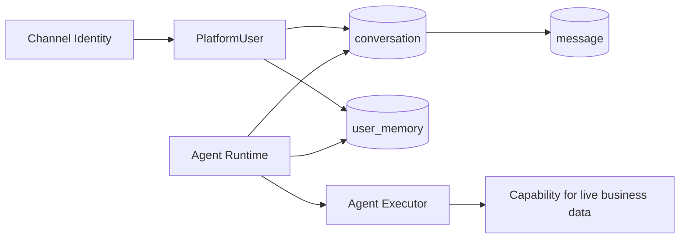
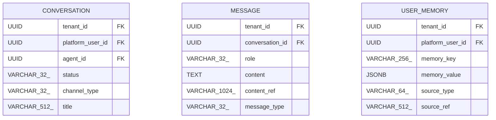

<!-- V1.11 module-split metadata -->
> **文档分档**：`Full`（模板 `design-full.md`）  
> **分档理由**：会话/消息/长期 Memory 持久化与隔离  
> **文档边界**：本文件是该模块唯一详细设计事实源；DB Owner 与接口 Owner 必须落在本模块，不允许在其他模块重复定义。  
> **拆分原则**：仅按可独立评审/编码/验收的一级模块拆分；不按单表/单接口继续碎片化。

# Conversation 与 User Memory 模块需求与设计一体化文档

> **文档编号**: MOD-MEM-V1.13
> **文档版本**: V1.13
> **创建日期**: 2026-09-11
> **文档状态**: 设计基线草案（待仓库 Spec Context 绑定后进入正式评审）
> **模板**: `design-full.md`；生成流程按 `cf-task:align` 的复杂后端/架构模块路径执行。
> **上游基线**: V1.8 完整总体设计 + V6 完整 Playbook + Console V0.8 Final。


**评审边界说明**：
- 第 2 章是需求基线（What），禁止实现阶段自行改变领域语义；
- 第 3-4 章是设计基线（How），DB 与每个接口必须以本文为准；
- `Spec Compliance Matrix` 当前依据设计基线生成，因本轮未提供仓库 `spec-context.yml` 与代码目录，**不得声称已通过 cf-task:align 的 repo Spec Gate**；落码前必须在真实仓库执行 `refresh/catalog/bind`。


## 1. 文档控制

### 1.1 责任人

| 角色 | 姓名 | 职责范围 |
|---|---|---|
| 产品/架构负责人 | 待定 | 需求定义、领域边界、与总设/Playbook 一致性 |
| 开发负责人 | 待定 | 技术方案、DB/API、实现 |
| 测试负责人 | 待定 | S/E/B 场景、E2E Gate |
| 安全/运维 | 待定 | Secret、隔离、发布、监控 |

### 1.2 修订历史

| 版本 | 日期 | 作者 | 变更描述 |
|---|---|---|---|
| V1.11 模块分档拆分版 | 2026-09-11 | ChatGPT / 待项目负责人确认 | 按 cf-task:align + design-full 从最新完整总设/Playbook/交互稿重新生成；细化 DB 与全部接口 |
| V1.13 第三轮 Review 修复 | 2026-09-12 | Claude Code | 场景行归位与表格修复；新增 human_wait/progress_stage 投递与 RULE-CHAN-09；命令集对齐与 MEM-INT-01 去重；Bot Secret lease 与连接状态数据源；删除 Console 会话接口；message_type 补 PROPOSAL 与 CONV-LIB-03 |
| V1.13.1 第四轮合理性修复 | 2026-09-12 | Claude Code | conversation_run 的租约规则改为引用模块 01 的 CORE-LIB-08（claim/renew/assert_owner），本模块只保留 sequence_no 领取排序与“到期 RUNNING 优先于新 turn”，并声明不再维护第二套 epoch 递增/续租语义；conversation_run、channel_command_receipt、message 各补保留期与清理触发者的责任声明（指向 `01-架构与规范/11-数据保留与清理策略`） |

## 2. 需求分析

### 2.1 需求概述

| 项目 | 内容 |
|---|---|
| 模块名称 | Conversation 与 User Memory |
| 模块ID | MOD-MEM |
| 所属系统/产品线 | Fluxion 通用智能服务执行框架 |
| 需求类型 | 中大型功能 / 架构演进 |
| 业务背景 | 用户希望跨会话、跨 Web/企业微信保持稳定使用上下文，但 Memory 不能替代业务平台实时权威数据。 |
| 核心目标 | 设计 Conversation/Message/UserMemory SoT、/new 语义、跨渠道身份复用和 Runtime 加载/受控写入接口。 |

### 2.2 痛点与价值

| 维度 | 内容 |
|---|---|
| 目标用户 | End User、Agent Runtime、Admin（治理） |
| 当前问题 | 把 Memory/Session 放 Runtime 本地会随 Pod 丢失；把任务/设备/权限写入 Memory 会产生陈旧业务事实。 |
| 业务影响 | 用户体验不连续、跨渠道上下文错乱、错误业务决策。 |
| 预期价值 | 长期用户偏好跨会话可复用，同时实时业务事实始终通过 Capability 查询。 |

### 2.3 功能方案

#### 2.3.1 功能清单

| 功能ID | 功能名称 | 功能描述 | 优先级 | 来源 |
|---|---|---|---|---|
| FEAT-MEM-01 | Conversation | 用户×Agent 会话生命周期。 | P0 | Playbook U06 |
| FEAT-MEM-02 | Message | 消息持久化/大内容引用。 | P0 | 对话 |
| FEAT-MEM-03 | UserMemory | tenant+user 长期受控上下文。 | P0 | Playbook U06 |
| FEAT-MEM-04 | /new | 新 Conversation，不清 Memory。 | P0 | IM 命令 |
| FEAT-MEM-05 | Memory Governance | 查看/更新/撤销与来源追踪。 | P0 | 隐私治理 |

### 2.4 范围与边界

| 类别 | 内容 |
|---|---|
| 范围（In Scope） | Conversation/Message/UserMemory DB、Runtime load/append、/new 语义、Memory policy/来源/撤销。 |
| 非范围（Out of Scope） | 业务平台实时数据、Execution Task State、向量语义 Memory 高级平台（后续）；**Console 不提供会话管理能力**——总设 §6.6 IA 无会话菜单，故不提供 `CONV-API-01..04`，会话生命周期由 `/new`（CONV-LIB-02）与 Runtime 内部驱动，不再有独立的会话 CRUD 页面或端点。 |
| 前置假设 | 上游总设、公共 DB/API 规范、外部基础设施可用 |
| 有意妥协 / 技术债 | 无；未来扩展必须有真实旅程驱动 |

### 2.5 验收条件

#### 2.5.1 业务规则与约束

| ID | 类型 | 描述 | 验证场景 |
|---|---|---|---|
| RULE-MEM-01 | 边界 | UserMemory≠Conversation≠TaskState≠BusinessData。 | S-MEM-01 |
| RULE-MEM-02 | 跨渠道 | 同一 PlatformUser 切换渠道仍读取同一 UserMemory。 | S-MEM-02 |
| RULE-MEM-03 | 新会话 | /new 只创建新 Conversation，不清理 UserMemory/Grant。 | S-MEM-03 |
| RULE-MEM-04 | 权威数据 | Memory 不存当前设备、实时权限、任务状态等业务权威事实。 | S-MEM-04 |
| RULE-MEM-05 | 隔离 | 所有 Memory 按 tenant+user 隔离并带来源。 | S-MEM-05 |

#### 2.5.2 功能验收场景

**正常场景**

| 场景ID | 功能ID | 优先级 | 测试层级 | 关键真实边界 | 归属 | 前置条件 | 操作步骤 | 预期结果 |
|---|---|---|---|---|---|---|---|---|
| S-MEM-05 | FEAT-MEM-01 | P1 | integration | Memory 租户用户隔离 | 本模块 | 两用户各写 Memory | 按用户读取 | 仅见本人 Memory；记录含来源 source_type/source_ref |
| S-MEM-01 | FEAT-MEM-03 | P0 | E2E | Runtime→PG | 本模块 | 用户偏好已写 | 新会话请求 | Runtime 注入同一偏好 |
| S-MEM-02 | FEAT-MEM-03 | P0 | E2E | WeCom/WebChat→same user→PG | 后置 → 模块 10 | 两渠道映射同一用户 | 分别发消息 | 读取一致 UserMemory |
| S-MEM-03 | FEAT-MEM-04 | P0 | E2E | /new→Conversation | 本模块 | 已有会话+Memory | 执行 /new | 新 conversation_id，Memory 保留 |
| S-MEM-04 | FEAT-MEM-05 | P0 | E2E | Admin API→PG→Runtime | 本模块 | Memory ACTIVE | 撤销 | 下一请求不再注入 |
| S-MEM-06 | FEAT-MEM-02 | P1 | E2E | Memory 写入/清理全链 | 本模块 | 用户在会话中 | "记住偏好 X" → /new → 读取 → /memory clear → 再读取 | 写入经 MemoryPolicy；新会话注入；清理后不再注入 |

**异常场景**

| 场景ID | 功能ID | 测试层级 | 关键真实边界 | 归属 | 触发条件 | 系统行为 | 用户感知 |
|---|---|---|---|---|---|---|---|
| E-MEM-01 | FEAT-MEM-03 | integration | Memory policy validator | 本模块 | 写入实时设备/任务状态类禁用 category | MEMORY_CONTENT_FORBIDDEN | 提示改走 Capability |
| E-MEM-02 | FEAT-MEM-01 | integration | Conversation ownership | 本模块 | 用户访问他人 conversation_id | 404/403 fail closed | 不泄露存在性 |

#### 2.5.3 非功能指标

| 指标ID | 指标名称 | 目标值 | 测量方法 |
|---|---|---|---|
| NFR-REL-01 | 可靠执行 | 不得因单 Runtime/Worker 进程退出丢失权威状态 | SIGKILL/E2E |
| NFR-SEC-01 | 可信身份 | LLM/客户端不得覆盖 tenant/actor/secret | 安全测试 |
| NFR-OBS-01 | 可追踪 | 关键路径可按 request_id/trace_id/execution_id 定位 | 集成/E2E |

## 3. 技术设计

### 3.1 方案选型

#### 3.1.1 关键决策记录

| 决策点 | 选择 | 被否决项 | 理由 | 可逆性 |
|---|---|---|---|---|
| Memory SoT | PostgreSQL 外置 | Runtime 本地 MEMORY.md/SQLite | 多副本一致 | 难 |
| V1 复杂度 | 结构化长期 Memory | 一开始全量向量记忆/自动画像 | 先满足真实旅程 | 易 |
| 业务数据 | 每次 Capability 查询 | 复制到 Memory | 避免陈旧 truth | 难 |

#### 3.1.2 技术栈

| 类别 | 选型 | 版本 | 选型理由 |
|---|---|---|---|
| 语言 | Python | 3.12+（仓库实际版本落码前确认） | 与 Agent/LLM 生态一致 |
| Web/API | FastAPI + Pydantic | 仓库实际版本确认 | 类型契约与异步 IO |
| ORM | SQLAlchemy 2 Async | 仓库实际版本确认 | 异步 PostgreSQL |
| 数据库 | PostgreSQL | 外部部署 | 业务 SoT |

### 3.2 架构设计



#### 3.2.1 模块职责分层

| 层级 | 职责 | 禁止事项 |
|---|---|---|
| Handler/API | 协议解析、DTO、权限入口、统一错误映射 | 业务逻辑/直接 SQL |
| Application Service | 用例编排、事务边界、领域校验 | 依赖具体 Web 框架 |
| Domain | 领域对象/规则 | 基础设施依赖 |
| Repository/Port | 持久化/外部能力抽象 | 泄露 Secret/跨领域修改 |
| Adapter | PostgreSQL/HTTP/MCP 等实现 | 改变领域语义 |

#### 3.2.2 外部依赖清单

| 外部系统/模块 | 依赖类型 | 协议/接口 | 超时/一致性 | 降级策略 |
|---|---|---|---|---|
| PlatformUser/Grant | 身份/授权 | DB/Library | current | 无权 fail closed |
| Agent Runtime | 读写会话 | Library | 实时 | PG 不可用则对话不能持久 |
| ObjectStore | 大消息/附件 | Port | 外部 | 失败返回附件错误 |

### 3.3 数据设计

#### 3.3.1 表清单

| 表名 | 职责 | 所有权 |
|---|---|---|
| conversation_run | Chat turn 调度/取消/恢复事实 | Conversation 与 User Memory |
| channel_command_receipt | 真实入站命令的幂等结果 | Conversation 与 User Memory |
| conversation | 当前会话事实；/new 创建新会话但不清空 User Memory/授权。 | Conversation 与 User Memory |
| message | Conversation 内消息记录，用于上下文/审计；不等于长期 Memory。 | Conversation 与 User Memory |
| user_memory | 跨 Conversation/Channel 的受控长期用户上下文；不得保存业务平台实时权威数据。 | Conversation 与 User Memory |

#### 表 `conversation`

**职责**：当前会话事实；/new 创建新会话但不清空 User Memory/授权。

| 字段名 | 类型 | 可空 | 默认值 | 索引 | 说明 |
|---|---|---|---|---|---|
| tenant_id | UUID | N |  | IDX | 租户 |
| platform_user_id | UUID | N |  | FK,IDX | 用户 |
| agent_id | UUID | N |  | FK,IDX | Agent |
| status | VARCHAR(32) | N | ACTIVE | IDX | ACTIVE/CLOSED |
| channel_type | VARCHAR(32) | N |  | IDX | 入口渠道 |
| origin_scope_key | VARCHAR(64) | N |  | UK | hash(channel_type,account_id,peer_type,peer_id)；不把同用户不同群会话合并 |
| next_message_sequence | BIGINT | N | 1 |  | 在映射锁内分配顺序 |
| title | VARCHAR(512) | Y |  |  | 可选标题 |
| last_message_at | TIMESTAMPTZ | Y |  | IDX | 最后消息 |
| id | UUID | N | gen_random_uuid() | PK | 主键 |
| is_deleted | BOOLEAN | N | FALSE | IDX | 软删除标记；默认查询必须过滤 FALSE |
| create_time | TIMESTAMPTZ | N | CURRENT_TIMESTAMP |  | 创建时间 |
| update_time | TIMESTAMPTZ | N | CURRENT_TIMESTAMP |  | 更新时间 |

**索引设计**

| 索引名 | 类型 | 字段 | 使用场景 |
|---|---|---|---|
| uk_conversation_active | UNIQUE(partial) | tenant_id,platform_user_id,agent_id,origin_scope_key | WHERE status='ACTIVE' AND is_deleted=false |
| idx_conversation_user_agent | BTREE | tenant_id,platform_user_id,agent_id,last_message_at DESC | 会话历史 |

#### 表 `message`

**职责**：Conversation 内消息记录，用于上下文/审计；不等于长期 Memory。

| 字段名 | 类型 | 可空 | 默认值 | 索引 | 说明 |
|---|---|---|---|---|---|
| tenant_id | UUID | N |  | IDX | 租户 |
| conversation_id | UUID | N |  | FK,IDX | 会话 |
| role | VARCHAR(32) | N |  | IDX | USER/ASSISTANT/SYSTEM/TOOL |
| content | TEXT | Y |  |  | 小文本内容 |
| content_ref | VARCHAR(1024) | Y |  |  | 大内容/附件引用 |
| message_type | VARCHAR(32) | N | TEXT |  | TEXT/TOOL/FILE/EVENT/PROPOSAL；PROPOSAL 承载 EXE-LIB-02 签发的待确认提案（content 存 proposal_id 与摘要文本，content_ref 可指向提案快照） |
| external_message_id | VARCHAR(512) | Y |  | IDX | 渠道 transport ID |
| verified_channel_account_id | UUID | Y |  | FK | USER 入站身份来源；系统生成消息为空 |
| actor_user_id | UUID | Y |  | FK | 受信解析的 USER 作者 |
| sequence_no | BIGINT | N |  | UK | conversation 内顺序 |
| processing_status | VARCHAR(16) | N | QUEUED |  | QUEUED/PROCESSING/PROCESSED；仅调度元数据可更新 |
| trace_id | VARCHAR(128) | Y |  | IDX | 关联 Trace |
| id | UUID | N | gen_random_uuid() | PK | 主键 |
| is_deleted | BOOLEAN | N | FALSE | IDX | 软删除标记；默认查询必须过滤 FALSE |
| create_time | TIMESTAMPTZ | N | CURRENT_TIMESTAMP |  | 创建时间 |
| update_time | TIMESTAMPTZ | N | CURRENT_TIMESTAMP |  | 更新时间 |

**约束**

- content/content_ref 至少一个有效
- UNIQUE (tenant_id,verified_channel_account_id,external_message_id) WHERE external_message_id IS NOT NULL；UNIQUE (tenant_id,conversation_id,sequence_no)。消息正文/来源不可变，processing_status 是唯一允许更新的调度元数据。
- 会话历史（message）的保留与清理按 `01-架构与规范/11-数据保留与清理策略` 执行；本模块不自行决定保留期限与清理触发者。

**索引设计**

| 索引名 | 类型 | 字段 | 使用场景 |
|---|---|---|---|
| idx_message_conversation | BTREE | tenant_id,conversation_id,create_time | 按序加载 |
| idx_message_external | BTREE | tenant_id,external_message_id | 去重/追踪 |

**不可变约束**：消息正文和身份/来源不可变；只允许受信处理器更新 processing_status，不得改写历史 USER 内容。

#### 表 `conversation_run`

**职责**：持久 Chat turn 取消/排队/跨实例恢复；不替代 ServiceExecution。

| 字段名 | 类型 | 可空 | 默认值 | 索引 | 说明 |
|---|---|---|---|---|---|
| tenant_id | UUID | N |  | IDX | 租户 |
| conversation_id | UUID | N |  | FK | 会话 |
| actor_user_id | UUID | N |  | FK | 运行用户 |
| source_message_id | UUID | N |  | UK | 入站消息 |
| status | VARCHAR(24) | N | QUEUED |  | QUEUED/RUNNING/CANCEL_REQUESTED/SUCCEEDED/FAILED/CANCELLED |
| lease_owner | VARCHAR(256) | Y |  |  | Runtime 实例 |
| lease_expires_at | TIMESTAMPTZ | Y |  |  | 恢复到期 |
| lease_epoch | BIGINT | N | 0 |  | 所有图推进/结果写入 fencing |
| cancel_requested_at | TIMESTAMPTZ | Y |  |  | 取消事实 |
| checkpoint_ref | VARCHAR(512) | Y |  |  | 已提交图状态 |
| id | UUID | N | gen_random_uuid() | PK | 主键 |
| is_deleted | BOOLEAN | N | FALSE |  | 默认过滤 FALSE |
| create_time | TIMESTAMPTZ | N | CURRENT_TIMESTAMP |  | 创建时间 |
| update_time | TIMESTAMPTZ | N | CURRENT_TIMESTAMP |  | 更新时间 |

**约束与索引**

- UNIQUE (tenant_id,source_message_id)；UNIQUE (tenant_id,conversation_id) WHERE status IN ('RUNNING','CANCEL_REQUESTED') AND is_deleted=false。
- 租约规则一律引用 **CORE-LIB-08 LeaseQueue**（模块 01）：claim/renew/release 与 owner+lease_epoch fencing 使用该共享实现与统一 epoch 语义；本表只提供列映射（`lease_owner/lease_expires_at/lease_epoch`）、领取排序键（source message 的 `sequence_no`）与“已到期 RUNNING 优先于新 turn”的谓词。`conversation_run` **不再维护第二套 epoch 递增/续租语义**。
- 领取前无有效 lease；Run graph 状态、结果与 checkpoint 写入前必须先经 CORE-LIB-08.assert_owner 校验 owner+lease_epoch，失配 LEASE_LOST 并立即停止推进。
- QUEUED 按 message.sequence_no 领取，恢复到期 RUNNING 优先于新 turn。
- 保留与清理按 `01-架构与规范/11-数据保留与清理策略` 执行；本模块不自行决定 conversation_run 的保留期限与清理触发者。

#### 表 `channel_command_receipt`

**职责**：入站写命令的事务幂等结果；由 Python 领域 Application 共用 PG 事务写。

| 字段名 | 类型 | 可空 | 默认值 | 索引 | 说明 |
|---|---|---|---|---|---|
| tenant_id | UUID | N |  | IDX | 租户 |
| message_id | UUID | N |  | FK,UK | verified transport 消息 |
| actor_user_id | UUID | N |  | FK | 操作用户 |
| command | VARCHAR(32) | N |  |  | CH-INT-02 判别 |
| idempotency_key | VARCHAR(64) | N |  | UK | 渠道消息身份 hash |
| request_digest | VARCHAR(64) | N |  |  | 绑定目标和参数 |
| result_json | JSONB | N |  |  | 已提交的结果 DTO |
| id | UUID | N | gen_random_uuid() | PK | 主键 |
| is_deleted | BOOLEAN | N | FALSE |  | 默认过滤 FALSE |
| create_time | TIMESTAMPTZ | N | CURRENT_TIMESTAMP |  | 创建时间 |
| update_time | TIMESTAMPTZ | N | CURRENT_TIMESTAMP |  | 更新时间 |

**约束与索引**

- UNIQUE (tenant_id,idempotency_key)；UNIQUE (tenant_id,message_id)。
- 请求结果与 NEW/MEMORY_CLEAR/RESULT/CONFIRM/STOP 的持久操作在同一事务，失败事务不留成功 receipt；同键不同 digest 拒绝。
- 保留与清理按 `01-架构与规范/11-数据保留与清理策略` 执行；本模块不自行决定 receipt 的保留期限与清理触发者（幂等窗口与其一致）。

#### 表 `user_memory`

**职责**：跨 Conversation/Channel 的受控长期用户上下文；不得保存业务平台实时权威数据。

| 字段名 | 类型 | 可空 | 默认值 | 索引 | 说明 |
|---|---|---|---|---|---|
| tenant_id | UUID | N |  | IDX | 租户 |
| platform_user_id | UUID | N |  | FK,IDX | 用户 |
| memory_key | VARCHAR(256) | N |  | IDX | 稳定 key/category |
| memory_value | JSONB | N | {} |  | 受控内容 |
| source_type | VARCHAR(64) | N |  |  | EXPLICIT/DERIVED/ADMIN |
| source_ref | VARCHAR(512) | Y |  |  | 来源 conversation/message |
| status | VARCHAR(32) | N | ACTIVE | IDX | ACTIVE/REVOKED |
| confidence | NUMERIC(5,4) | Y |  |  | 仅推断型使用 |
| revision | BIGINT | N | 1 |  | 并发版本 |
| id | UUID | N | gen_random_uuid() | PK | 主键 |
| is_deleted | BOOLEAN | N | FALSE | IDX | 软删除标记；默认查询必须过滤 FALSE |
| create_time | TIMESTAMPTZ | N | CURRENT_TIMESTAMP |  | 创建时间 |
| update_time | TIMESTAMPTZ | N | CURRENT_TIMESTAMP |  | 更新时间 |

**约束**

- UNIQUE (tenant_id,platform_user_id,memory_key) WHERE is_deleted=false
- 不得写入实时客户设备/任务状态/权限等业务权威事实

**索引设计**

| 索引名 | 类型 | 字段 | 使用场景 |
|---|---|---|---|
| uk_user_memory_key | UNIQUE(partial) | tenant_id,platform_user_id,memory_key | WHERE is_deleted=false（软删历史不占唯一位） |
| idx_user_memory_status | BTREE | tenant_id,platform_user_id,status,is_deleted | Context 加载 |

#### 3.3.2 ER 图



#### 3.3.3 数据一致性与软删除规则

- 所有 Framework 自建可变表使用 `is_deleted/create_time/update_time`；查询默认过滤 `is_deleted=false`。
- FK 只引用同一租户可见对象；跨租户引用必须在 Application Service 拒绝。
- Secret/Token/Password 不落业务表明文，只保存 `secret_ref/credential_ref`。
- 不可变 Release/Snapshot/Artifact 使用 append-only；需要更新时新建记录。
- `revision` 用于 direct-effect 配置的乐观并发和审计，不等同于发布版本。

### 3.4 接口设计

#### 3.4.1 接口清单

| 接口ID | 名称 | 形态 | 方法/签名 | 路径/用途 |
|---|---|---|---|---|
| MEM-API-01 | 用户 Memory 列表 | HTTP | GET | /api/v1/users/{user_id}/memory |
| MEM-API-02 | 写入/更新受控 Memory | HTTP | PUT | /api/v1/users/{user_id}/memory/{memory_key} |
| MEM-API-03 | 撤销 Memory | HTTP | DELETE | /api/v1/users/{user_id}/memory/{memory_key} |
| CONV-LIB-01 | 解析或创建 Conversation | Library | async def resolve_conversation(ctx: TrustedExecutionContext, agent_id: UUID, conversation_id: UUID \| None, channel_meta: ChannelMeta \| None) -> Conversation |  |
| CONV-LIB-02 | 原子切换会话 | Library | start_new_conversation(ctx, scope, message_id) | NEW |
| CONV-LIB-03 | 追加入站/出站消息 | Library | async def append_message(ctx: TrustedExecutionContext, conversation_id: UUID, *, role: str, message_type: str, content: str, content_ref: str \| None = None, external_message_id: str \| None = None) -> MessageView | 消息追加（提案/通知/助手消息） |
| MEM-LIB-01 | 加载长期 Memory | Library | async def load_user_memory(tenant_id: UUID, user_id: UUID, policy: MemoryPolicy) -> list[MemoryItem] |  |
| MEM-LIB-02 | 本人 Memory 操作 | Library | manage_memory(ctx, request) | LIST/CLEAR/REMEMBER；由 CH-INT-02 的 MEMORY_LIST/MEMORY_CLEAR 动作调用 |

**当前会话与 Checkpoint 合同**

CONV-LIB-01 以 (tenant,user,agent,origin_scope_key) 的 PG transaction advisory lock 串行解析当前 ACTIVE；无行时在同一锁内创建，并用 partial unique 防重复。此锁保护首次创建与 /new，不只锁可能不存在的 conversation 行。入站消息在该事务内绑定确定 conversation_id/sequence_no；提交即释放锁，不持锁执行 LLM/网络。

同会话 Chat turn 按 sequence_no 排队；conversation_run 同时最多一个非终态 run，运行 owner 的领取/续租/释放与 lease_epoch fencing 统一经 CORE-LIB-08（模块 01）实现，本模块不另写一套。后续消息只排队，不能并发推进同一图。/new 与入站解析用同一映射锁：旧 conversation=CLOSED，旧 Chat Run 标 CANCEL_REQUESTED，新建 ACTIVE；关闭前已绑定的消息仍归旧会话，未开始的旧消息标 PROCESSED 并告知会话已关闭，不挪到新会话。已创建 Execution 和投递路由保持，关闭不取消它们。

CheckpointIdentity：Chat thread_id=`chat:{conversation_id}`，namespace=`agent:{agent_id}:graph:1`；Worker thread_id=`execution:{root_execution_id}:operation:{operation_id}`，namespace=`agent:{agent_id}:step:{step_key}:graph:1`。operation_id 首次生成且相同逻辑步骤 retry 沿用；同 Agent 在两个步骤有不同 operation_id。checkpoint_ref 存 execution_step/conversation_run，checkpoint metadata 必须匹配 snapshot hash、operation、step、agent，错配 CHECKPOINT_MISMATCH 拒绝。图节点完成持久 checkpoint；Worker Step 终态只在最终 checkpoint 已确认持久后提交（可恢复重放必须复用副作用 key）；checkpoint 不能覆盖 Execution 调度真相。

**Runtime 受控 Memory 写入**

AGCORE-LIB-05 调 MEM-LIB-02；`memory.remember` 不是任意业务 Capability。需要本人的 verified USER source_message_id 和显式“记住/请记住”或 `/memory remember` 意图，Runtime 决定可用工具，LLM 不能把其他消息标为授权。memory_key 必须在 Agent MemoryPolicy.allowed_keys 中；max_value_bytes 默认 4096、max_items 默认 100，超限 MEMORY_POLICY_DENIED。拒绝业务权限/实时客户设备状态等权威事实。MemoryPolicy 字段随 Agent 投影，普通 Chat 用 current。

来源落 `source_type=EXPLICIT`、source_ref=message.id；agent_tool 是触发方式，不是新枚举值。upsert 采用 expected_revision：已有键版本冲突 409，初次 expected_revision=null；相同 source_message_id+memory_key 防重，来源与写入结果写审计。END_USER `/memory list|clear` 由 CH-INT-02 调同一服务只处理本人；清理设置 REVOKED 后新 turn 不注入，Runtime 不缓存跨 turn 的旧 Memory。

#### MEM-API-01: 用户 Memory 列表

**入口类型**：HTTP

**契约**：`GET /api/v1/users/{user_id}/memory`

**认证/授权**：Admin；未来用户自助页面可复用受限 DTO

**Query 参数**

| 参数 | 类型 | 必填 | 说明 |
|---|---|---|---|
| page | integer | N | 页码，从 1 开始；默认 1 |
| page_size | integer | N | 每页条数；默认 20，最大 100 |
| status | string | N | ACTIVE/REVOKED |

**请求体**：无。

**响应 data**

| 字段 | 类型 | 说明 |
|---|---|---|
| items | array<UserMemoryView> | key/value/source/status/times |
| total | integer | 总数 |

**响应示例**

```json
{
  "code": 0,
  "message": "success",
  "data": {
    "items": [],
    "total": 1
  },
  "request_id": "req_xxx"
}
```

**错误码**

仅使用公共错误码。

**处理逻辑**

```text
tenant/user scoped query；敏感推断按 policy 过滤。
```

#### MEM-API-02: 写入/更新受控 Memory

**入口类型**：HTTP

**契约**：`PUT /api/v1/users/{user_id}/memory/{memory_key}`

**认证/授权**：登录会话（中间件解析，RULE-API-02）；仅 Admin（ADR-021；Runtime 受控写入走内部 Contract，非本端点）

**用途声明**：本接口是 Admin 治理入口（ADR-037），**V1 Console 不提供写表单**（FE-09 仅只读 + 单条删除）；保留用于排障与批量治理，调用方为 Admin 会话或运维脚本。

**请求体**

| 参数 | 类型 | 必填 | 说明 |
|---|---|---|---|
| memory_value | object | Y | 结构化长期上下文 |
| source_type | string | Y | EXPLICIT/DERIVED/ADMIN |
| source_ref | string | N | 来源 |
| revision | integer | N | 已有时乐观锁 |

**请求示例**

```json
{
  "memory_value": {},
  "source_type": "<source_type>",
  "source_ref": "<source_ref>",
  "revision": 1
}
```

**响应 data**

| 字段 | 类型 | 说明 |
|---|---|---|
| memory_key | string | key |
| revision | integer | 新 revision |

**响应示例**

```json
{
  "code": 0,
  "message": "success",
  "data": {
    "memory_key": "<memory_key>",
    "revision": 1
  },
  "request_id": "req_xxx"
}
```

**错误码**

| 错误码 | 场景 | HTTP 状态 |
|---|---|---|
| MEMORY_CONTENT_FORBIDDEN | 试图写实时业务权威数据/禁止类型 | 400 |
| REVISION_CONFLICT | 冲突 | 409 |

**处理逻辑**

```text
policy validator → upsert user_memory → audit；Derived 写入需满足 MemoryPolicy。
```

#### MEM-API-03: 撤销 Memory

**入口类型**：HTTP

**契约**：`DELETE /api/v1/users/{user_id}/memory/{memory_key}`

**认证/授权**：登录会话（中间件解析，RULE-API-02）；仅 Admin（ADR-021）

**请求体**：无。

**响应 data**

| 字段 | 类型 | 说明 |
|---|---|---|
| status | string | REVOKED |

**响应示例**

```json
{
  "code": 0,
  "message": "success",
  "data": {
    "status": "<status>"
  },
  "request_id": "req_xxx"
}
```

**错误码**

仅使用公共错误码。

**处理逻辑**

```text
soft revoke/status → audit；后续 Runtime 不再注入。
```

#### CONV-LIB-01: 解析或创建 Conversation

**入口类型**：Library

**函数签名**

```python
async def resolve_conversation(ctx: TrustedExecutionContext, agent_id: UUID, conversation_id: UUID | None, channel_meta: ChannelMeta | None) -> Conversation
```

**认证/授权**：进程内 Library，不暴露网络端点；调用方为 agent-runtime 的受信组件（CH-DATA-02 入站解析、RT-INT-01、CONV-LIB-02），必须传入平台签发的 `TrustedExecutionContext`；tenant/user/agent 取自 ctx 与已解析的 VerifiedEnvelope，正文提供的身份字段拒绝。

**入参**

| 参数 | 类型 | 必填 | 说明 |
|---|---|---|---|
| ctx | TrustedExecutionContext | Y | 用户 |
| agent_id | uuid | Y | Agent |
| conversation_id | uuid | N | 已有会话 |

**返回**

| 字段 | 类型 | 说明 |
|---|---|---|
| conversation | Conversation | 会话 |

**异常/错误**

| 错误码 | 场景 | HTTP 状态 |
|---|---|---|
| CONVERSATION_ACCESS_DENIED | 归属不匹配 | 403 |

**处理逻辑**

```text
require_agent_access → 明确 id 时校验 tenant/user/agent/origin_scope 且 ACTIVE；无 id 时取映射 advisory lock → 查唯一 ACTIVE → 不存在才创建 → 分配消息顺序。CLOSED 会话不接受新 turn（CONVERSATION_CLOSED 409）。
```

#### CONV-LIB-02: 原子新会话

**签名**：`async def start_new_conversation(ctx: TrustedExecutionContext, scope: ChannelScope, message_id: UUID) -> ConversationSwitchResult`

**认证/授权**：进程内 Library，不暴露网络端点；唯一调用方是 CH-INT-02 的 NEW 动作（`/new`），必须传入平台签发的 `TrustedExecutionContext` 与已验证的入站 message_id；tenant/user 取自 ctx，不能由请求参数覆盖。

按当前会话合同取得映射 advisory lock；幂等 receipt 已存在则返回原 result。事务关闭旧会话/标旧 Run 取消/新建 ACTIVE/写 receipt，返回新旧 ID。不得清除长期 Memory、授权或取消后台 Execution。

#### CONV-LIB-03: 追加入站/出站消息

**入口类型**：Library

**函数签名**

```python
async def append_message(
    ctx: TrustedExecutionContext,
    conversation_id: UUID,
    *,
    role: str,
    message_type: str,
    content: str,
    content_ref: str | None = None,
    external_message_id: str | None = None,
) -> MessageView
```

**认证/授权**：进程内 Library，不暴露网络端点；调用方必须是 agent-runtime 内的受信服务端组件（EXE-LIB-02、Worker/Channel Application、Runtime 图节点），且必须传入平台签发的 `TrustedExecutionContext` 作为身份来源。tenant/actor 取自 ctx，正文提供的身份字段一律拒绝；渠道侧入站仍必须经 CH-DATA-02 完成验签与身份解析后再调用本 Library，LLM/客户端不能直接构造调用。

**入参**

| 参数 | 类型 | 必填 | 说明 |
|---|---|---|---|
| ctx | TrustedExecutionContext | Y | 受信身份（tenant/actor 唯一来源） |
| conversation_id | uuid | Y | 目标会话 |
| role | string | Y | USER/ASSISTANT/SYSTEM/TOOL |
| message_type | string | Y | TEXT/TOOL/FILE/EVENT/PROPOSAL |
| content | string | Y | 消息文本；PROPOSAL 时存 proposal_id 与摘要文本 |
| content_ref | string | N | 大内容/附件引用；PROPOSAL 时可指向提案快照 |
| external_message_id | string | N | 幂等键（渠道 transport ID 或调用方生成的事件键） |

**返回**

| 字段 | 类型 | 说明 |
|---|---|---|
| message | MessageView | 已持久化消息（id/conversation_id/role/message_type/sequence_no/create_time） |

**异常/错误**

| 错误码 | 场景 | HTTP 状态 |
|---|---|---|
| CONVERSATION_NOT_FOUND | 会话不存在或不属于 ctx 的 tenant/user | 404 |
| CONVERSATION_CLOSED | 会话非 ACTIVE，不接受新消息 | 409 |
| MESSAGE_CONTENT_INVALID | content 与 content_ref 同时为空 | 400 |
| MESSAGE_TYPE_INVALID | message_type 不在枚举内 | 400 |

**处理逻辑**

```text
校验 ctx 与 conversation 归属/状态 → 幂等检查：external_message_id 非空时按
UNIQUE (tenant_id,verified_channel_account_id,external_message_id) 命中则直接返回原消息
→ 在同一事务内分配 conversation.next_message_sequence、INSERT message、更新 last_message_at
→ 返回 MessageView。正文与身份/来源不可变；本 Library 不改写历史消息，只允许后续更新 processing_status。
```

**调用方**：EXE-LIB-02（签发待确认提案时以 `message_type=PROPOSAL` 追加 ASSISTANT 消息）、Worker/Channel（`human_wait` 与 completed/failed 结果通知的出站落库）、Runtime（助手消息）。幂等键 `external_message_id`：同键返回原消息，不新建行。

#### MEM-LIB-02: 本人记忆操作

**签名**：`async def manage_memory(ctx: TrustedExecutionContext, request: MemoryRequest) -> MemoryResult`

**认证/授权**：进程内 Library，不暴露网络端点；由 CH-INT-02 的 MEMORY_LIST/MEMORY_CLEAR 动作调用本 Library（`/internal/v1/commands` 的 Owner 是模块 10 的 CH-INT-02，本模块不设独立的 IM 记忆命令端点）。其余调用方为 agent-runtime 的受信组件（如 AGCORE-LIB-05），必须传入平台签发的 `TrustedExecutionContext`；tenant/user 取自 ctx，拒绝 payload 中的 user_id。

MemoryRequest 判别：LIST（可选 key）返回 `{items:[key,value,source_type,revision]}`；CLEAR（可选 key）返回 `{revoked_count}`；REMEMBER（key/value/source_message_id/expected_revision）返回 `{key,revision,status:ACTIVE}`。ctx 决定 tenant/user，拒绝 payload.user_id。REMEMBER 校验真实来源、Agent MemoryPolicy、来源枚举及并发版本；CLEAR 采用入站消息幂等事务，Admin 管理接口另用 Admin actor 审计。错误 MEMORY_POLICY_DENIED（403）、MEMORY_REVISION_CONFLICT（409）、MEMORY_SOURCE_INVALID（403）。

#### MEM-LIB-01: 加载长期 Memory

**入口类型**：Library

**函数签名**

```python
async def load_user_memory(tenant_id: UUID, user_id: UUID, policy: MemoryPolicy) -> list[MemoryItem]
```

**认证/授权**：进程内 Library，不暴露网络端点；调用方为 agent-runtime 的受信组件（AgentExecutor/ContextResolver），tenant_id/user_id 只能来自平台已解析的 `TrustedExecutionContext` 与 Agent 投影，不得取自消息正文或 LLM 输出。

**入参**

| 参数 | 类型 | 必填 | 说明 |
|---|---|---|---|
| tenant_id | uuid | Y | 租户 |
| user_id | uuid | Y | 用户 |
| policy | MemoryPolicy | Y | Agent 策略 |

**返回**

| 字段 | 类型 | 说明 |
|---|---|---|
| items | array<MemoryItem> | ACTIVE、策略允许的长期记忆 |

**处理逻辑**

```text
索引查询 ACTIVE memory → 按 policy/category 限制 → 返回；不读取业务平台实时事实。
```

### 3.5 质量实现方案

#### 3.5.1 性能与容量

| 热点路径 | 负载量级 | 潜在瓶颈 | 实现方案 | 目标值 |
|---|---|---|---|---|
| Conversation context load | 每请求 | 消息历史过大 | 只加载策略窗口/summary；历史分页 | 上下文 token 受模型限制 |
| Message history | 数据增长 | 大表扫描 | conversation_id+create_time 索引/归档策略 | 按容量演进 |

#### 3.5.2 可靠性

所有外部调用有 deadline；重试有界且只对可安全重试错误；业务权威状态外置；进程崩溃后能恢复或明确失败。

#### 3.5.3 安全性

用户只能读取自身 Conversation/Memory（Admin 有治理权限）；Memory 变更可审计；隐私删除/清理策略必须与软删除/法务要求一致。

#### 3.5.4 可观测性

日志、Metrics、Trace 统一关联 request_id/trace_id；Execution 路径附带 execution_id/step_id；错误码稳定。

#### 3.5.5 测试策略

Domain/validator 单测；Repository/Provider 真 PG/外部 Stub 集成；核心用户旅程做 E2E；安全和崩溃恢复不得只靠 mock。

## 4. 部署与运维

### 4.1 部署架构

随其所属运行角色部署；PostgreSQL/Redis/Object Store/Secret Provider/OTel Backend 均为外部依赖，不打包进应用 Compose/Helm。

### 4.2 发布与回滚

DB 变更使用向前兼容迁移；应用支持滚动回滚；若涉及不可变 Release/Artifact，只切换 current 指针，不覆盖历史。

### 4.3 监控告警

至少监控请求/调用量、错误率、延迟、外部依赖失败、关键队列/执行积压和配置加载失败；阈值由环境基线确定。

### 4.4 数据迁移

若无历史生产数据则直接按新 Schema 建表；若已有部署，使用 Alembic 等可回滚/可前滚迁移，禁止运行时隐式改表。

## 5. 风险与依赖

| 风险ID | 描述 | 影响 | 应对措施 | 验证场景 |
|---|---|---|---|---|
| RISK-MEM-01 | 跨模块边界在实现中被绕过 | 形成双事实源/不可测试 | Architecture Gate + code review | E2E/静态检查 |

## 6. 需求追溯矩阵

| 功能ID | 接口ID | 验证场景 | 测试层级 | 状态 |
|---|---|---|---|---|
| FEAT-MEM-01 | CONV-LIB-01, CONV-LIB-02 | S-MEM-05, E-MEM-02 | E2E/integration | 待实现/评审 |
| FEAT-MEM-02 | CONV-LIB-03 | S-MEM-06 | E2E/integration | 待实现/评审 |
| FEAT-MEM-03 | MEM-LIB-01, MEM-LIB-02 | S-MEM-01, S-MEM-02, E-MEM-01 | E2E/integration | 待实现/评审 |
| FEAT-MEM-04 | CONV-LIB-02 | S-MEM-03 | E2E/integration | 待实现/评审 |
| FEAT-MEM-05 | MEM-API-01, MEM-API-02, MEM-API-03 | S-MEM-04, S-MEM-06 | E2E/integration | 待实现/评审 |

## Spec Compliance Matrix

| Spec/Rule | enforcement | 设计影响 | 设计落点 | 验证场景 | 状态/N/A 理由 |
|---|---|---|---|---|---|
| DESIGN/MEM#RULE-MEM-01 | design-baseline | 约束实现与验收 | §2.5 RULE-MEM-01 / §3 | S-MEM-01 | applied；仓库 spec-context 待绑定 |
| DESIGN/MEM#RULE-MEM-02 | design-baseline | 约束实现与验收 | §2.5 RULE-MEM-02 / §3 | S-MEM-02 | applied；仓库 spec-context 待绑定 |
| DESIGN/MEM#RULE-MEM-03 | design-baseline | 约束实现与验收 | §2.5 RULE-MEM-03 / §3.4 CONV-LIB-02 | S-MEM-03 | applied；仓库 spec-context 待绑定 |
| DESIGN/MEM#RULE-MEM-04 | design-baseline | 约束实现与验收 | §2.5 RULE-MEM-04 / §3.4 MEM-LIB-02 | S-MEM-04, E-MEM-01 | applied；仓库 spec-context 待绑定 |
| DESIGN/MEM#RULE-MEM-05 | design-baseline | 约束实现与验收 | §2.5 RULE-MEM-05 / §3.3.3 | S-MEM-05, S-MEM-06 | applied；仓库 spec-context 待绑定 |

## 附录 A：接口与 DB 落码检查清单

- [ ] 每个 HTTP Endpoint 已有 DTO、鉴权、错误码、处理逻辑、测试。
- [ ] 每个 Library/CLI 接口有稳定签名和异常语义。
- [ ] 每张表字段、类型、NULL、默认值、唯一约束、索引、软删除策略已落实迁移。
- [ ] Request/Response 字段不接受客户端传入可信 tenant/actor/credential。
- [ ] 列表接口使用服务端分页，避免无界返回。
- [ ] 修改类接口有 revision/冲突语义；高风险/副作用路径满足幂等和审计。
- [ ] 仓库 Spec Context 已 refresh/catalog/bind 且 required Rules 映射到 S/E/B verifier。
