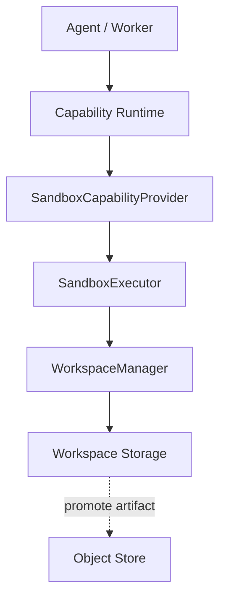
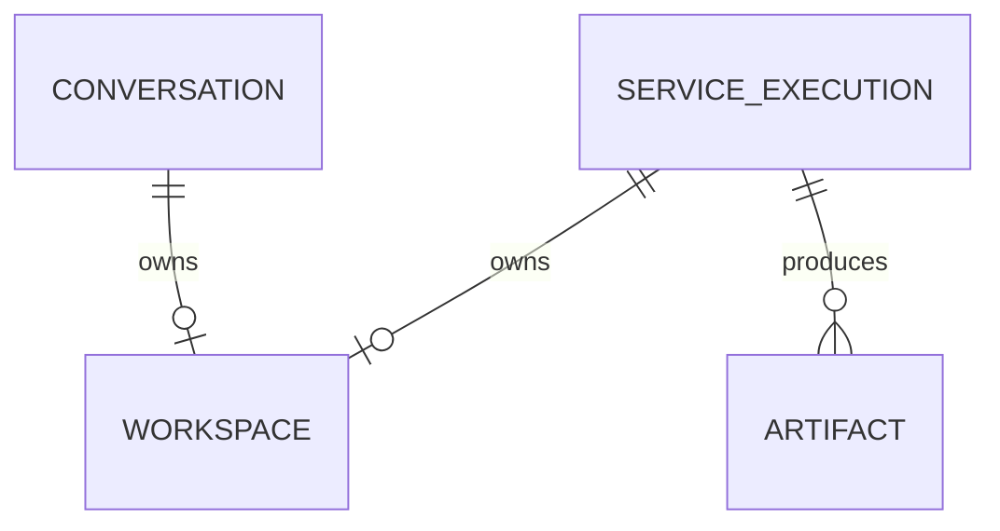

# Workspace 与 Sandbox 模块需求与设计一体化文档

> **文档编号**: MOD-WS-1.0  
> **文档版本**: v1.1  
> **创建日期**: 2026-09-10  
> **文档状态**: 设计草稿（V1.7 整改对齐）  
> **设计基线**: 《通用智能服务执行框架 V1.6 总体设计说明书》+《05-变更记录/V1.6-to-V1.7-整改对齐说明》（G24 生产可执行门）  
> **模板类型**: design-full（跨模块/架构核心模块）

**评审边界说明**：

- 需求评审：第 2 章，确认模块职责和边界；
- 设计评审：第 3-4 章，确认技术实现、数据、接口、DFX、部署；
- 本文只设计 Framework Core，不引入任何具体项目业务字段。

---

## 1. 文档控制

### 1.1 责任人

| 角色 | 姓名 | 职责范围 |
|---|---|---|
| 产品/架构负责人 | 待定 | 模块边界、需求与总体设计一致性 |
| 开发负责人 | 待定 | 技术方案与实现 |
| 测试负责人 | 待定 | 场景与 Gate |
| 安全/运维评审 | 按需 | 安全、可靠性、部署评审 |

### 1.2 修订历史

| 版本 | 日期 | 变更描述 |
|---|---|---|
| v0.1 | 2026-09-10 | 基于总体设计 V1.6 首次形成模块详细设计 |
| v1.1 | 2026-09-10 | V1.7 整改：生产可执行门 ALLOW=scan通过+隔离沙箱+无内嵌凭据（G24） |
| v1.2 | 2026-09-10 | 补「归属」列；后置 E2E 段登记承接方 |

---

## 2. 需求分析

### 2.1 需求概述

| 项目 | 内容 |
|---|---|
| 模块名称 | Workspace 与 Sandbox |
| 模块ID | MOD-WS |
| 需求类型 | 新框架模块设计 |
| 业务背景 | 通用 Agent 需要文件读写、glob、grep、shell 等工具，但直接操作 Runtime Pod 本地文件系统会破坏无状态和安全边界。 |
| 核心目标 | 把文件/进程能力统一建模为 Sandbox-backed Capability，并以 Workspace 提供受控、可替换的执行上下文。 |
| 运行形态 | Framework Workspace Library + Sandbox Adapter；V1 不新增独立服务 |

### 2.2 痛点与价值

| 维度 | 内容 |
|---|---|
| 目标用户 | Agent/Service Builder；Agent Runtime；Worker；运维/安全 |
| 当前问题 | Host shell/任意路径访问可能越权、泄漏宿主信息；每用户固定 workspace 又会恢复有状态 Pod 模式。 |
| 框架影响 | Shell/Filesystem 是高危通用能力，必须从第一版建立明确隔离边界。 |
| 预期价值 | 保留 OpenClaw 类工具能力，同时保持 Runtime 无状态和 Provider 可替换。 |

### 2.3 功能方案

#### 2.3.1 功能清单

| 功能ID | 功能名称 | 功能描述 | 优先级 | 来源 |
|---|---|---|---|---|
| FEAT-01 | Workspace Contract | Conversation/Execution 创建和解析逻辑 Workspace。 | P0 | 总体设计 V1.6 |
| FEAT-02 | Filesystem Capabilities | read/write/edit/glob/grep。 | P0 | 总体设计 V1.6 |
| FEAT-03 | Shell Capability | shell.execute，默认高风险、worker_preferred。 | P0 | 总体设计 V1.6 |
| FEAT-04 | Sandbox Executor SPI | Local Dev 与 Container/K8s/VM Production 可替换。 | P0 | 总体设计 V1.6 |
| FEAT-05 | Path/Resource Policy | 相对路径、tenant、allowlist、timeout、输出限制、TTL 清理。 | P0 | 总体设计 V1.6 |

#### 2.4 范围与边界

| 类别 | 内容 |
|---|---|
| 范围（In Scope） | Workspace metadata、SandboxExecutor、内置 Capability、路径/命令/资源策略、Artifact 晋升。 |
| 非范围（Out of Scope） | 完整远程 IDE、永久用户 Home、通用容器平台、默认生产允许任意代码执行。 |
| 前置假设 | 生产 Sandbox 可由部署方提供隔离实现；临时文件最终需要持久化时转 Artifact。 |
| 有意妥协/技术债 | 骨架 LocalSandboxExecutor 仅 Dev/Trusted；Production isolated executor 需要在正式启用 shell 前实现。 |

### 2.5 验收条件

#### 2.5.1 业务规则与约束

| ID | 类型 | 描述 | 验证场景 |
|---|---|---|---|
| RULE-01 | 系统约束 | workspace_id 必须来自 TrustedExecutionContext，LLM 不得选择 Host root。 | S-01/E-01 |
| RULE-02 | 系统约束 | 绝对路径、.. traversal、symlink escape 必须拒绝。 | E-01 |
| RULE-03 | 系统约束 | shell 默认关闭；启用时 executable allowlist + argv + timeout。 | E-02 |
| RULE-04 | 系统约束 | 高风险 shell realtime 调用必须转 Worker。 | S-02 |
| RULE-05 | 系统约束 | 生产启用可执行 Skill/Shell 的 Gate：artifact_scan==PASSED 且 isolated_sandbox==ENABLED 且 embedded_credential==FALSE，否则 PRODUCTION_ENABLE_REJECTED（V1.7 G24，可执行门禁非文档建议）。 | E-03 |

#### 2.5.2 功能验收场景

**正常场景**

| 场景ID | 功能ID | 优先级 | 测试层级 | 关键真实边界 | 归属 | 前置条件 | 操作步骤 | 预期结果 |
|---|---|---|---|---|---|---|---|---|
| S-01 | FEAT-02 | P0 | integration | TrustedContext → WorkspaceManager → SandboxExecutor | 本模块 | 已完成基础配置 | 在 execution workspace 写/读相对路径 reports/result.md | 只能访问该 Workspace root 内文件 |
| S-02 | FEAT-03 | P0 | integration | CapabilityRuntime → ExecutionService/Worker → Sandbox | 本模块 + 后置段 → 模块 07 / 05 | 已完成基础配置 | Agent 请求 shell.execute | realtime 被拒，Worker mode 执行已授权命令 |
| S-03 | FEAT-01 | P0 | integration | Execution/Conversation → WorkspaceManager → PostgreSQL Metadata | 本模块 + 后置段 → 模块 05 / 12 | 已完成基础配置 | 分别为 Conversation 和 Execution 创建 Workspace | owner_type/owner_id 正确持久化，可跨进程按 workspace_id 解析 |
| S-04 | FEAT-04 | P0 | integration | SandboxProvider → SandboxExecutor SPI | 本模块 | 已完成基础配置 | 将 LocalSandboxExecutor 替换为 fake isolated executor | Agent/Worker/Capability Contract 无需修改 |

**异常场景**

| 场景ID | 功能ID | 测试层级 | 关键真实边界 | 归属 | 触发条件 | 系统行为 | 用户感知 |
|---|---|---|---|---|---|---|---|
| E-01 | FEAT-05 | integration | Path Guard | 本模块 | 输入 /etc/passwd 或 ../escape 或 symlink 越界 | SANDBOX_PATH_INVALID/ESCAPE，拒绝访问 | 返回可识别错误，不泄露内部细节 |
| E-02 | FEAT-03 | integration | Sandbox Policy | 本模块 | shell 未启用或 executable 不在 allowlist | 拒绝执行 | 返回可识别错误，不泄露内部细节 |

#### 2.5.3 非功能指标

| 指标ID | 指标名称 | 目标值 | 测量方法 |
|---|---|---|---|
| NFR-REL-01 | 可靠性 | 不得丢失/破坏框架权威状态；具体 SLA 待真实部署压测后确定 | 故障注入 + integration/E2E |
| NFR-SEC-01 | 安全边界 | 不得信任 LLM 提供的身份/权限/Host 路径等安全上下文 | Architecture Gate + integration |
| NFR-OBS-01 | 可观测性 | 关键操作必须携带 request_id/trace_id 或 execution_id | 日志/Trace 断言 |

性能/QPS/延迟阈值当前没有真实压测依据，本文不虚构固定数字；上线门槛在真实 Reference Integration 跑通后补充。

---

## 3. 技术设计

### 3.1 方案选型

#### 关键决策记录

| 决策点 | 选择 | 被否决项 | 理由 | 可逆性 |
|---|---|---|---|---|
| 工具建模 | Sandbox-backed Capability | 独立 Tool Runtime | 复用现有治理 | 难 |
| Workspace 所属 | Conversation/Execution | User/Pod | 避免粘性状态 | 难 |
| 本地实现 | Dev only | 宣称生产安全 Sandbox | 明确安全边界 | 易 |

#### 技术栈

| 类别 | 选型 | 版本 | 选型理由 |
|---|---|---|---|
| 语言 | Python | 3.12+ | Capability Provider |
| Dev Executor | LocalSandboxExecutor | V1 | 仅受信开发 |
| Prod Executor | Container/K8s/Namespace/VM | 待实现 | 真正隔离 |
| 存储 | Workspace Store + Object Store | 按实现 | 临时/Artifact 分层 |

### 3.2 架构设计



#### 分层职责

| 层级 | 职责 |
|---|---|
| Capability Contract | filesystem.* / shell.execute |
| Sandbox Provider | 将 Capability 转 operation |
| WorkspaceManager | workspace metadata/owner/TTL |
| SandboxExecutor | 实际隔离执行 |
| Storage | 临时 workspace 与正式 Artifact |

### 3.3 数据设计

> **统一数据库公共字段约束**：本模块凡新增 Framework 自建表，均必须包含 `is_deleted BOOLEAN NOT NULL DEFAULT FALSE`、`create_time TIMESTAMPTZ NOT NULL DEFAULT now()`、`update_time TIMESTAMPTZ NOT NULL DEFAULT now()`；Repository 默认过滤 `is_deleted=false`，删除默认逻辑删除。第三方自管理表（如 LangGraph Checkpointer）不修改其内部 Schema。


| 数据对象/表 | 关键字段 | 约束/索引 | 说明 |
|---|---|---|---|
| workspace | id、tenant_id、owner_type、owner_id、storage_backend、root_ref、status、expires_at | owner 索引；status/expiry 索引 | 逻辑工作空间 |
| artifact | execution_id、step_id、type、object_ref、checksum | execution/step 索引 | 正式交付物 |


**ER 图**



### 3.4 接口设计

| 接口ID | 接口/函数 | 形态 | 说明 | 关联功能 |
|---|---|---|---|---|
| SPI-01 | WorkspaceManager.create/get/release | SPI | Workspace 生命周期 | FEAT-01 |
| SPI-02 | SandboxExecutor.execute(workspace_id,operation,args,context) | SPI | 隔离执行 | FEAT-04 |
| LIB-01 | SandboxCapabilityProvider.invoke(...) | 函数库 | Capability Provider | FEAT-02,FEAT-03 |

文件路径必须是 Workspace-relative。shell 输入首选 `argv: string[]`，禁止 `shell=True` 拼接字符串。SandboxResult 默认限制 stdout/stderr 大小。

所有普通 HTTP JSON 接口必须复用统一响应 Envelope：

```json
{
  "code": "OK",
  "message": "success",
  "data": {},
  "request_id": "req-xxx",
  "timestamp": "2026-09-10T15:00:00+00:00"
}
```

SSE/WebSocket/文件流属于协议例外，但必须复用统一错误码 taxonomy 和 request/trace 关联策略。

### 3.5 质量实现方案

#### 可靠性

Workspace metadata 外置；TTL 清理幂等；临时 Workspace 删除前确保正式 Artifact 已持久化；Worker crash 后可重新解析 workspace。

#### 安全性

tenant/owner 隔离、path traversal/symlink guard、allowlist、timeout、resource quota、网络 egress 策略；LocalExecutor 不作为生产安全隔离。

#### 可观测性

operation、workspace_id、execution_id、duration、exit_code、bytes；不默认记录文件内容/stdout/stderr。

#### 测试策略

```text
unit
→ 纯规则/状态机/转换

integration
→ Repository / Provider / Runtime 边界

E2E
→ 真实进程/API/数据库/用户可见结果

architecture
→ 依赖方向、Stateless、统一响应、Core Purity 等硬约束
```

---

## 4. 部署与运维

### 4.1 部署架构

V1 无独立服务。Production isolated executor 可实现为短生命周期 Container/K8s Job/Pod 等，但属于 Executor 资源，不新增常驻第五服务。

### 4.2 发布与回滚

- 框架代码通过镜像/包版本发布；
- Schema 变化使用 Alembic expand → migrate → switch → contract；
- 只有 `Service` 采用草稿/已发布两态，`Agent` 统一 direct-effect + revision（V1.7 D04），不把代码发布和业务定义发布混成一套版本系统；
- 运行配置可直接生效时必须保留 revision/audit；
- 回滚不得恢复已经撤销的用户权限、Credential 或安全禁用状态。

### 4.3 监控告警

workspace count/expiry cleanup、sandbox failures/timeouts、forbidden operations、resource exhaustion；阈值待定。

阈值当前统一标记为**待定**，由 Reference Integration 实测建立基线后配置。

---

## 5. 风险与依赖

### 5.1 项目依赖

| 依赖模块/团队 | 依赖内容 | 状态 | 风险等级 |
|---|---|---|---|
| CapabilityRuntime | 统一调用/授权 | 必需 | 高 |
| PostgreSQL | Workspace metadata | 生产必需 | 高 |
| Object Store | Artifact | 按交付物 | 中 |
| Container/K8s runtime | 生产隔离 | 启用 shell 时必需 | 高 |

### 5.2 风险识别

| 风险ID | 类型 | 描述 | 概率 | 影响 | 应对措施 | 验证场景 |
|---|---|---|---|---|---|---|
| RISK-01 | 安全 | Sandbox 逃逸/Host 文件泄漏 | 中 | 高 | 生产真隔离 + 路径/资源策略 + 安全测试 | E-01 |
| RISK-02 | 架构 | Workspace 演化成每用户固定 Pod | 中 | 高 | owner_type 仅 conversation/execution + Stateless Gate | S-01 |

---

## 6. 需求追溯矩阵

| 来源 | 功能ID | 接口ID | 测试场景 | 测试层级 | 状态 |
|---|---|---|---|---|---|
| 总体设计 V1.6 | FEAT-01 | SPI-01 | S-03 | integration/E2E | 待实现 |
| 总体设计 V1.6 | FEAT-02 | LIB-01 | S-01 | integration/E2E | 待实现 |
| 总体设计 V1.6 | FEAT-03 | LIB-01 | S-02, E-02 | integration/E2E | 待实现 |
| 总体设计 V1.6 | FEAT-04 | SPI-02 | S-04 | integration/E2E | 待实现 |
| 总体设计 V1.6 | FEAT-05 | 内部契约 | E-01 | integration/E2E | 待实现 |

> **后置 E2E 承接方登记**（依据 design-full 模板 §2.5.2「归属」列规则：标 `后置` 的场景必须写出承接方）：
>
> | 本模块场景 | 后置段 | 承接方 | 承接场景 |
> |---|---|---|---|
> | S-02 | CapabilityRuntime 派发 + Worker 执行 | `07-Capability Runtime.md` + `06-Worker Engine.md` | `07-S-02`（返回 requires execution，不执行 Provider）、`06-S-01`（Worker claim 执行） |
> | S-03 | Execution / Conversation 作为 owner 落库 | `05-ExecutionService.md` + `12-Conversation 与 User Memory.md` | `05-S-01`（生成 Execution）、`12-S-04`（ConversationRepository 持久化） |


---

## Spec Compliance Matrix

| Spec/Rule | enforcement | 设计影响 | 设计落点 | 验证场景 | verifier | 状态 |
|---|---|---|---|---|---|---|
| framework#RULE-TOOL-001 | required | Tool=Sandbox-backed Capability | §3.1/§3.2 | S-02/E-01/E-02 | `test_sandbox_boundary.py` | applied |
| framework#RULE-DB-001 | required | Workspace/Artifact 表含公共字段 | §3.3 | S-03 | `test_database_common_fields.py` | applied |

---

## 附录：术语表

| 术语 | 定义 |
|---|---|
| Framework Core | 与具体业务项目解耦的框架内核 |
| Integration | 具体项目对框架 SPI/Contract 的实现和配置 |
| Capability | 稳定的“系统能做什么”合同 |
| Execution | 一次可靠业务服务执行实例 |
| SoT | Source of Truth，权威事实源 |
| SPI | Service Provider Interface，扩展接口 |
| DFX | 面向可靠性、安全性、可测试性、可运维性等质量属性的设计 |

---