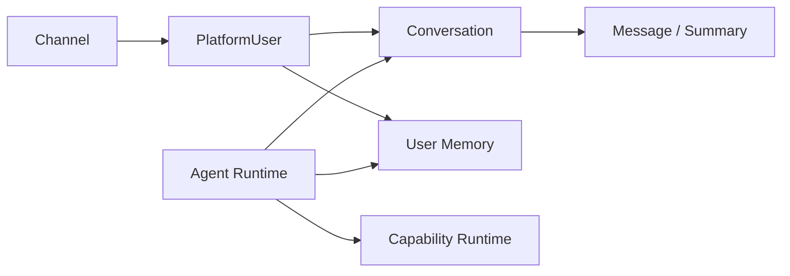
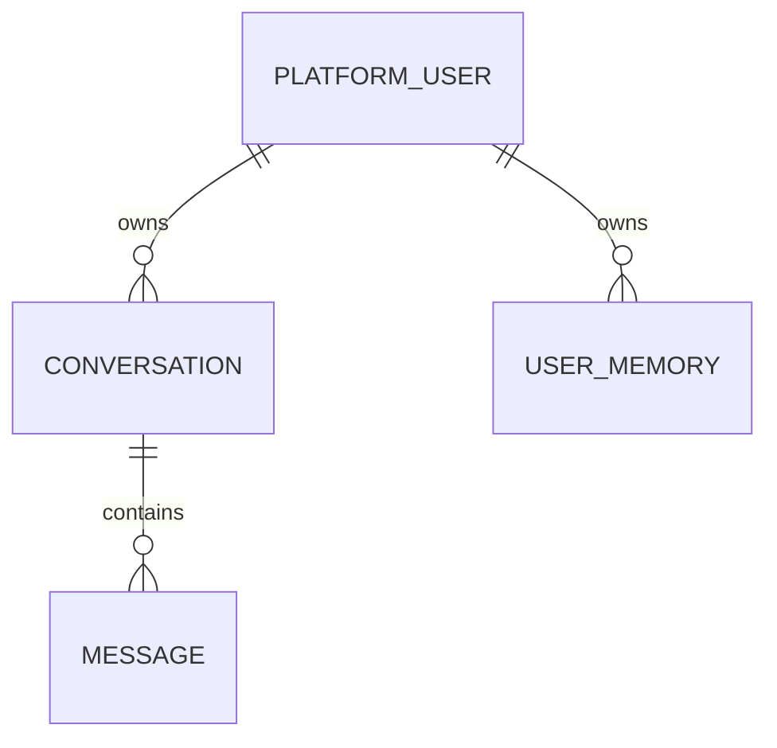

# Conversation 与 User Memory 模块需求与设计一体化文档

> **文档编号**: MOD-MEM-1.0  
> **文档版本**: v1.1  
> **创建日期**: 2026-09-10  
> **文档状态**: 设计草稿（V1.7 整改对齐）  
> **设计基线**: 《通用智能服务执行框架 V1.6 总体设计说明书》+《05-变更记录/V1.6-to-V1.7-整改对齐说明》（D02/D06 无 user_agent_binding）  
> **模板类型**: design-full（跨模块/架构核心模块）

**评审边界说明**：

- 需求评审：第 2 章，确认模块职责和边界；
- 设计评审：第 3-4 章，确认技术实现、数据、接口、DFX、部署；
- 本文只设计 Framework Core，不引入任何具体项目业务字段。

---

## 1. 文档控制

### 1.1 责任人

| 角色 | 姓名 | 职责范围 |
|---|---|---|
| 产品/架构负责人 | 待定 | 模块边界、需求与总体设计一致性 |
| 开发负责人 | 待定 | 技术方案与实现 |
| 测试负责人 | 待定 | 场景与 Gate |
| 安全/运维评审 | 按需 | 安全、可靠性、部署评审 |

### 1.2 修订历史

| 版本 | 日期 | 变更描述 |
|---|---|---|
| v0.1 | 2026-09-10 | 基于总体设计 V1.6 首次形成模块详细设计 |
| v1.1 | 2026-09-10 | V1.7 整改：回滚口径同步 D04；确认无 user_agent_binding（D06） |

---

## 2. 需求分析

### 2.1 需求概述

| 项目 | 内容 |
|---|---|
| 模块名称 | Conversation 与 User Memory |
| 模块ID | MOD-MEM |
| 需求类型 | 新框架模块设计 |
| 业务背景 | Agent 需要当前会话上下文和跨会话长期用户偏好，但不能把业务实时事实混入 Memory，也不能依赖本地文件/Pod。 |
| 核心目标 | 明确 Conversation、Message、Conversation Summary、User Memory、Execution State、Business Data 的边界和持久化策略。 |
| 运行形态 | Python Framework Library + PostgreSQL Repository；Agent Runtime 使用 |

### 2.2 痛点与价值

| 维度 | 内容 |
|---|---|
| 目标用户 | End User、Agent Runtime、Admin（查看/清理 Memory） |
| 当前问题 | 把 summary 当长期记忆、把设备/权限/任务结果写成 Memory 会导致陈旧事实；本地 MEMORY.md 无法多 Pod 共享。 |
| 框架影响 | Memory 错误会直接影响 Agent 长期行为和隐私。 |
| 预期价值 | 跨会话/跨 Channel 连续体验，同时保持事实可靠性和可控数据治理。 |

### 2.3 功能方案

#### 2.3.1 功能清单

| 功能ID | 功能名称 | 功能描述 | 优先级 | 来源 |
|---|---|---|---|---|
| FEAT-01 | Conversation | 保存会话与消息，支持多 Channel 统一 user scope。 | P0 | 总体设计 V1.6 |
| FEAT-02 | Conversation Summary | 压缩上下文长度，不自动晋升为长期 User Memory。 | P0 | 总体设计 V1.6 |
| FEAT-03 | User Memory | 稳定偏好、输出格式、明确记忆上下文，带 provenance。 | P0 | 总体设计 V1.6 |
| FEAT-04 | Memory 控制 | 查看、清理、controlled write、tenant/user 隔离。 | P0 | 总体设计 V1.6 |

#### 2.4 范围与边界

| 类别 | 内容 |
|---|---|
| 范围（In Scope） | Conversation/Message/summary/UserMemory 的模型、读取、写入策略、来源和数据治理。 |
| 非范围（Out of Scope） | 业务系统权威数据、完整用户画像平台、默认向量数据库、Execution 状态。 |
| 前置假设 | PlatformUser 已完成身份绑定；业务权威事实通过 Capability 查询。 |
| 有意妥协/技术债 | V1 先使用 PostgreSQL；只有检索规模/语义检索真实需要时启用 pgvector。 |

### 2.5 验收条件

#### 2.5.1 业务规则与约束

| ID | 类型 | 描述 | 验证场景 |
|---|---|---|---|
| RULE-01 | 系统约束 | User Memory 不能保存当前权限、实时资源列表、任务状态等业务权威事实。 | E-01 |
| RULE-02 | 系统约束 | Conversation Summary 不自动等于 User Memory。 | S-01 |
| RULE-03 | 系统约束 | Memory key 以 tenant+PlatformUser 为核心，不绑定某个 Channel。 | S-02 |
| RULE-04 | 系统约束 | Memory write 必须记录 source/provenance/timestamps。 | S-03 |

#### 2.5.2 功能验收场景

**正常场景**

| 场景ID | 功能ID | 优先级 | 测试层级 | 关键真实边界 | 归属 | 前置条件 | 操作步骤 | 预期结果 |
|---|---|---|---|---|---|---|---|---|
| S-01 | FEAT-02 | P0 | integration | Conversation → Summary → Context Builder | 本模块 | 已完成基础配置 | 长会话触发 summary | 后续上下文使用 summary，但长期 Memory 表无自动写入 |
| S-02 | FEAT-03 | P0 | integration | Channel A/B → PlatformUser → UserMemory | 本模块 | 已完成基础配置 | 同一用户换 Channel/新 Conversation | 读取同一用户长期偏好 |
| S-03 | FEAT-04 | P0 | integration | Memory Writer → PostgreSQL | 本模块 | 已完成基础配置 | 用户明确要求记住输出格式 | 写入 Memory 并带 source/ref/time |
| S-04 | FEAT-01 | P0 | integration | Channel → ConversationRepository → PostgreSQL | 本模块 | 已完成基础配置 | 创建 Conversation 并追加两条 Message | 消息按 conversation_id/create_time 有序读取，跨 Pod 可见 |

**异常场景**

| 场景ID | 功能ID | 测试层级 | 关键真实边界 | 归属 | 触发条件 | 系统行为 | 用户感知 |
|---|---|---|---|---|---|---|---|
| E-01 | FEAT-03 | integration | Memory Policy | 本模块 | Agent 尝试把外部系统“当前有20个资源”写长期 Memory 并下次直接使用 | 不作为权威事实；需要时重新 Capability 查询 | 返回可识别错误，不泄露内部细节 |
| E-02 | FEAT-04 | integration | Tenant Isolation | 本模块 | tenant A 查询 tenant B memory | 拒绝/查无数据 | 返回可识别错误，不泄露内部细节 |

#### 2.5.3 非功能指标

| 指标ID | 指标名称 | 目标值 | 测量方法 |
|---|---|---|---|
| NFR-REL-01 | 可靠性 | 不得丢失/破坏框架权威状态；具体 SLA 待真实部署压测后确定 | 故障注入 + integration/E2E |
| NFR-SEC-01 | 安全边界 | 不得信任 LLM 提供的身份/权限/Host 路径等安全上下文 | Architecture Gate + integration |
| NFR-OBS-01 | 可观测性 | 关键操作必须携带 request_id/trace_id 或 execution_id | 日志/Trace 断言 |

性能/QPS/延迟阈值当前没有真实压测依据，本文不虚构固定数字；上线门槛在真实 Reference Integration 跑通后补充。

---

## 3. 技术设计

### 3.1 方案选型

#### 关键决策记录

| 决策点 | 选择 | 被否决项 | 理由 | 可逆性 |
|---|---|---|---|---|
| V1 存储 | PostgreSQL | 默认独立向量库 | 减少依赖 | 易 |
| 作用域 | tenant + PlatformUser | channel/Pod | 支持跨 Channel | 难 |
| Summary | Conversation context | 自动长期学习 | 降低错误记忆 | 中 |

#### 技术栈

| 类别 | 选型 | 版本 | 选型理由 |
|---|---|---|---|
| 语言 | Python | 3.12+ | Agent Core 共享 |
| 数据库 | PostgreSQL | 待定 | 跨 Pod SoT |
| 语义检索 | pgvector | 按需 | 真实需求后启用 |
| Schema | Pydantic/SQLAlchemy | 2.x | 边界明确 |

### 3.2 架构设计



#### 分层职责

| 层级 | 职责 |
|---|---|
| Conversation | 当前交互 |
| Summary | 当前会话压缩 |
| User Memory | 长期稳定上下文 |
| Capability | 业务权威实时事实 |
| Execution | 当前任务状态，独立管理 |

### 3.3 数据设计

> **统一数据库公共字段约束**：本模块凡新增 Framework 自建表，均必须包含 `is_deleted BOOLEAN NOT NULL DEFAULT FALSE`、`create_time TIMESTAMPTZ NOT NULL DEFAULT now()`、`update_time TIMESTAMPTZ NOT NULL DEFAULT now()`；Repository 默认过滤 `is_deleted=false`，删除默认逻辑删除。第三方自管理表（如 LangGraph Checkpointer）不修改其内部 Schema。


| 数据对象/表 | 关键字段 | 约束/索引 | 说明 |
|---|---|---|---|
| conversation | id、platform_user_id、channel、status、timestamps | user/time 索引 | 会话根 |
| message | conversation_id、role、content_ref、channel_message_ref、created_at | conversation/time | 消息 |
| user_memory | platform_user_id、memory_type、source、source_ref、content/metadata、updated_at | tenant/user/type | 长期记忆 |


**ER 图**



### 3.4 接口设计

| 接口ID | 接口/函数 | 形态 | 说明 | 关联功能 |
|---|---|---|---|---|
| LIB-01 | ConversationRepository.append_message(...) | 函数库 | 消息持久化 | FEAT-01 |
| LIB-02 | MemoryRuntime.load(user,context) | 函数库 | 加载长期 Memory | FEAT-03 |
| LIB-03 | MemoryWriter.write(candidate,source) | 函数库 | 受控写入 | FEAT-03,FEAT-04 |
| API-01 | GET/DELETE /api/v1/users/{id}/memories | HTTP | 管理员/用户管理 Memory | FEAT-04 |

Memory API 不暴露其他 tenant；删除 Memory 不删除 Execution/Audit；敏感字段按部署项目政策脱敏。

所有普通 HTTP JSON 接口必须复用统一响应 Envelope：

```json
{
  "code": "OK",
  "message": "success",
  "data": {},
  "request_id": "req-xxx",
  "timestamp": "2026-09-10T15:00:00+00:00"
}
```

SSE/WebSocket/文件流属于协议例外，但必须复用统一错误码 taxonomy 和 request/trace 关联策略。

### 3.5 质量实现方案

#### 可靠性

消息/Memory 写入外置；重复 Channel message 有 dedupe ref；Summary 失败不影响原消息 SoT。

#### 安全性

tenant/user 隔离；Credential/Session 不进入 Memory；Memory 清理与业务审计生命周期分离。

#### 可观测性

memory read/write/delete、summary latency/failure、context size、source type；内容默认不进入日志。

#### 测试策略

```text
unit
→ 纯规则/状态机/转换

integration
→ Repository / Provider / Runtime 边界

E2E
→ 真实进程/API/数据库/用户可见结果

architecture
→ 依赖方向、Stateless、统一响应、Core Purity 等硬约束
```

---

## 4. 部署与运维

### 4.1 部署架构

无独立服务；Agent Runtime 调用 Repository/Runtime。

### 4.2 发布与回滚

- 框架代码通过镜像/包版本发布；
- Schema 变化使用 Alembic expand → migrate → switch → contract；
- 只有 `Service` 采用草稿/已发布两态，`Agent` 统一 direct-effect + revision（V1.7 D04），不把代码发布和业务定义发布混成一套版本系统；
- 运行配置可直接生效时必须保留 revision/audit；
- 回滚不得恢复已经撤销的用户权限、Credential 或安全禁用状态。

### 4.3 监控告警

memory query errors、summary failures、context size、DB latency；阈值待定。

阈值当前统一标记为**待定**，由 Reference Integration 实测建立基线后配置。

---

## 5. 风险与依赖

### 5.1 项目依赖

| 依赖模块/团队 | 依赖内容 | 状态 | 风险等级 |
|---|---|---|---|
| PostgreSQL | Conversation/Memory SoT | 必需 | 高 |
| Channel Binding | PlatformUser 统一身份 | 必需 | 中 |
| Agent Core | 消费上下文 | 必需 | 中 |
| CapabilityRuntime | 实时业务事实 | 必需 | 中 |

### 5.2 风险识别

| 风险ID | 类型 | 描述 | 概率 | 影响 | 应对措施 | 验证场景 |
|---|---|---|---|---|---|---|
| RISK-01 | 正确性 | Memory 保存陈旧业务事实 | 中 | 高 | Memory Policy + Capability authority rule | E-01 |
| RISK-02 | 隐私 | 跨 tenant Memory 泄漏 | 中 | 高 | Repository tenant scope + integration test | E-02 |

---

## 6. 需求追溯矩阵

| 来源 | 功能ID | 接口ID | 测试场景 | 测试层级 | 状态 |
|---|---|---|---|---|---|
| 总体设计 V1.6 | FEAT-01 | LIB-01 | S-04 | integration/E2E | 待实现 |
| 总体设计 V1.6 | FEAT-02 | 内部契约 | S-01 | integration/E2E | 待实现 |
| 总体设计 V1.6 | FEAT-03 | LIB-02, LIB-03 | S-02, E-01 | integration/E2E | 待实现 |
| 总体设计 V1.6 | FEAT-04 | LIB-03, API-01 | S-03, E-02 | integration/E2E | 待实现 |

---

## Spec Compliance Matrix

| Spec/Rule | enforcement | 设计影响 | 设计落点 | 验证场景 | verifier | 状态 |
|---|---|---|---|---|---|---|
| framework#RULE-AR-001 | required | Conversation/Memory 外置 | §3.2 | S-02/S-04 | `Multi-Pod integration` | applied |
| framework#RULE-DB-001 | required | Conversation/Memory 表含公共字段 | §3.3 | S-04 | `test_database_common_fields.py` | applied |
| framework#RULE-DB-002 | required | Memory/Conversation 查询忽略软删除 | §3.3 | E-02 | `repository integration` | applied |

---

## 附录：术语表

| 术语 | 定义 |
|---|---|
| Framework Core | 与具体业务项目解耦的框架内核 |
| Integration | 具体项目对框架 SPI/Contract 的实现和配置 |
| Capability | 稳定的“系统能做什么”合同 |
| Execution | 一次可靠业务服务执行实例 |
| SoT | Source of Truth，权威事实源 |
| SPI | Service Provider Interface，扩展接口 |
| DFX | 面向可靠性、安全性、可测试性、可运维性等质量属性的设计 |

---
