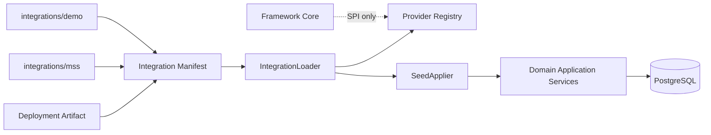

<!-- V1.11 module-split metadata -->
> **文档分档**：`Full`（模板 `design-full.md`）  
> **分档理由**：跨系统集成、Provider Registry、Manifest/Seed  
> **文档边界**：本文件是该模块唯一详细设计事实源；DB Owner 与接口 Owner 必须落在本模块，不允许在其他模块重复定义。  
> **拆分原则**：仅按可独立评审/编码/验收的一级模块拆分；不按单表/单接口继续碎片化。

# Project Integration 与 Registry 模块需求与设计一体化文档

> **文档编号**: MOD-INT-V1.11 模块分档拆分版
> **文档版本**: V1.11 模块分档拆分版
> **创建日期**: 2026-09-11
> **文档状态**: 设计基线草案（待仓库 Spec Context 绑定后进入正式评审）
> **模板**: `design-full.md`；生成流程按 `cf-task:align` 的复杂后端/架构模块路径执行。
> **上游基线**: V1.8 完整总体设计 + V6 完整 Playbook + Console V0.8 Final。


**评审边界说明**：
- 第 2 章是需求基线（What），禁止实现阶段自行改变领域语义；
- 第 3-4 章是设计基线（How），DB 与每个接口必须以本文为准；
- `Spec Compliance Matrix` 当前依据设计基线生成，因本轮未提供仓库 `spec-context.yml` 与代码目录，**不得声称已通过 cf-task:align 的 repo Spec Gate**；落码前必须在真实仓库执行 `refresh/catalog/bind`。


## 1. 文档控制

### 1.1 责任人

| 角色 | 姓名 | 职责范围 |
|---|---|---|
| 产品/架构负责人 | 待定 | 需求定义、领域边界、与总设/Playbook 一致性 |
| 开发负责人 | 待定 | 技术方案、DB/API、实现 |
| 测试负责人 | 待定 | S/E/B 场景、E2E Gate |
| 安全/运维 | 待定 | Secret、隔离、发布、监控 |

### 1.2 修订历史

| 版本 | 日期 | 作者 | 变更描述 |
|---|---|---|---|
| V1.11 模块分档拆分版 | 2026-09-11 | ChatGPT / 待项目负责人确认 | 按 cf-task:align + design-full 从最新完整总设/Playbook/交互稿重新生成；细化 DB 与全部接口 |

## 2. 需求分析

### 2.1 需求概述

| 项目 | 内容 |
|---|---|
| 模块名称 | Project Integration 与 Registry |
| 模块ID | MOD-INT |
| 所属系统/产品线 | Fluxion 通用智能服务执行框架 |
| 需求类型 | 中大型功能 / 架构演进 |
| 业务背景 | Framework Core 必须通用，但具体项目需要代码级 Capability/Auth/Knowledge/Channel Provider 与 seed；该机制不能和 Console 的 ProjectPlatform 混为一谈。 |
| 核心目标 | 通过部署制品 Manifest + Loader + Registry + SeedApplier 装配项目扩展，保持 Core 物理依赖边界和启动可验证性。 |

### 2.2 痛点与价值

| 维度 | 内容 |
|---|---|
| 目标用户 | Integration Developer、运维、Runtime/Worker |
| 当前问题 | 动态插件/万能 Resource 会引入复杂生命周期；若 Runtime 依赖 Console 在线解析 Integration，控制面故障会拖垮执行面。 |
| 业务影响 | Provider 冲突、启动不确定、业务语义污染 Core。 |
| 预期价值 | 项目可以扩展而不 fork Core；装配内容可审计、可 health、可 Gate。 |

### 2.3 功能方案

#### 2.3.1 功能清单

| 功能ID | 功能名称 | 功能描述 | 优先级 | 来源 |
|---|---|---|---|---|
| FEAT-INT-01 | Manifest | YAML→Pydantic→canonical JSON hash。 | P0 | 总设 |
| FEAT-INT-02 | Loader | 启动期加载 Integration package/providers。 | P0 | 扩展 SPI |
| FEAT-INT-03 | Registry | Provider key 冲突 fail-fast。 | P0 | 安全 |
| FEAT-INT-04 | Seed | ProjectPlatform/Capability/Agent/Service 初始定义幂等装配。 | P0 | 项目接入 |
| FEAT-INT-05 | Core Purity Gate | MSS + 非 MSS Demo 同时通过。 | P0 | 通用性证明 |

### 2.4 范围与边界

| 类别 | 内容 |
|---|---|
| 范围（In Scope） | Integration manifest schema、loader/registry/provider SPI、seed apply、health/启动日志、依赖规则。 |
| 非范围（Out of Scope） | ProjectPlatform CRUD/用户认证数据、动态 Marketplace、在线安装插件、IntegrationRegistration DB 表。 |
| 前置假设 | 上游总设、公共 DB/API 规范、外部基础设施可用 |
| 有意妥协 / 技术债 | 无；未来扩展必须有真实旅程驱动 |

### 2.5 验收条件

#### 2.5.1 业务规则与约束

| ID | 类型 | 描述 | 验证场景 |
|---|---|---|---|
| RULE-INT-01 | 非持久化 | IntegrationRegistration 是运行时投影，权威来源是部署 Manifest，不落业务 DB。 | S-INT-01 |
| RULE-INT-02 | 分层 | ProjectIntegration 与 ProjectPlatform 分离。 | S-INT-02 |
| RULE-INT-03 | 冲突 | Provider key 冲突启动 fail-fast，不允许静默覆盖。 | S-INT-03 |
| RULE-INT-04 | Core 纯净 | Core 不 import integrations/mss；Integration 依赖 Core SPI 单向。 | S-INT-04 |
| RULE-INT-05 | Seed | Seed 只能经领域 Application Service，禁止直接写表。 | S-INT-05 |

#### 2.5.2 功能验收场景

**正常场景**

| 场景ID | 功能ID | 优先级 | 测试层级 | 关键真实边界 | 归属 | 前置条件 | 操作步骤 | 预期结果 |
|---|---|---|---|---|---|---|---|---|
| S-INT-05 | FEAT-INT-02 | P1 | integration | Seed 走 Application Service | 本模块 | 初始化集成数据 | 执行 Seed | 经领域服务写入；直接 SQL 写表被架构测试禁止 |
| S-INT-01 | FEAT-INT-01 | P0 | integration | Manifest→Pydantic→hash | 本模块 | 合法 manifest | 加载 | hash 稳定且内容注册 |
| S-INT-02 | FEAT-INT-02 | P0 | E2E | Process startup→Registry | 本模块 | MSS integration 安装 | 启动 Runtime/Worker | provider 可解析，Control Plane 离线不影响已装配 |
| S-INT-03 | FEAT-INT-04 | P0 | integration | Seed→Domain services→PG | 本模块 | 首次启动 | apply seed | stable key 创建对象；二次运行幂等 skipped/updated |
| S-INT-04 | FEAT-INT-05 | P0 | E2E | Architecture Gate | 本模块 | MSS+Demo Integration | 运行 Core tests | Core 无 MSS import/identifier 污染 |

**异常场景**

| 场景ID | 功能ID | 测试层级 | 关键真实边界 | 归属 | 触发条件 | 系统行为 | 用户感知 |
|---|---|---|---|---|---|---|---|
| E-INT-01 | FEAT-INT-03 | integration | Registry | 本模块 | 两个 Provider 声明同 key | 启动失败 PROVIDER_KEY_CONFLICT | health not ready |
| E-INT-02 | FEAT-INT-01 | integration | Manifest validator | 本模块 | 未知字段/entrypoint | manifest invalid | 拒绝装配 |

#### 2.5.3 非功能指标

| 指标ID | 指标名称 | 目标值 | 测量方法 |
|---|---|---|---|
| NFR-REL-01 | 可靠执行 | 不得因单 Runtime/Worker 进程退出丢失权威状态 | SIGKILL/E2E |
| NFR-SEC-01 | 可信身份 | LLM/客户端不得覆盖 tenant/actor/secret | 安全测试 |
| NFR-OBS-01 | 可追踪 | 关键路径可按 request_id/trace_id/execution_id 定位 | 集成/E2E |

## 3. 技术设计

### 3.1 方案选型

#### 3.1.1 关键决策记录

| 决策点 | 选择 | 被否决项 | 理由 | 可逆性 |
|---|---|---|---|---|
| 扩展模式 | 静态部署 Manifest/SPI | 动态插件 Marketplace | V1 简化、安全、可测试 | 未来可扩展 |
| Registration | 内存投影 + health/log | DB CRUD 表 | 部署事实不伪装业务配置 | 难 |
| Seed | 调用领域 Service | 直接 SQL | 复用校验/审计/约束 | 中 |

#### 3.1.2 技术栈

| 类别 | 选型 | 版本 | 选型理由 |
|---|---|---|---|
| 语言 | Python | 3.12+（仓库实际版本落码前确认） | 与 Agent/LLM 生态一致 |
| Web/API | FastAPI + Pydantic | 仓库实际版本确认 | 类型契约与异步 IO |
| ORM | SQLAlchemy 2 Async | 仓库实际版本确认 | 异步 PostgreSQL |
| 数据库 | PostgreSQL | 外部部署 | 业务 SoT |

### 3.2 架构设计



#### 3.2.1 模块职责分层

| 层级 | 职责 | 禁止事项 |
|---|---|---|
| Handler/API | 协议解析、DTO、权限入口、统一错误映射 | 业务逻辑/直接 SQL |
| Application Service | 用例编排、事务边界、领域校验 | 依赖具体 Web 框架 |
| Domain | 领域对象/规则 | 基础设施依赖 |
| Repository/Port | 持久化/外部能力抽象 | 泄露 Secret/跨领域修改 |
| Adapter | PostgreSQL/HTTP/MCP 等实现 | 改变领域语义 |

#### 3.2.2 外部依赖清单

| 外部系统/模块 | 依赖类型 | 协议/接口 | 超时/一致性 | 降级策略 |
|---|---|---|---|---|
| Deployment filesystem/package | Manifest/entrypoint | Python package | 启动期 | 缺失则 Integration unavailable |
| 各领域 Application Service | Seed | Library | 事务/幂等 | 报告 conflict，不绕表 |
| Architecture Gate | 静态扫描/测试 | CI | required | 失败禁止 merge/release |

### 3.3 数据设计

本模块**不拥有独立业务表**。这是刻意设计：权威状态由其领域所有者持久化，本模块只读取/调用 Port。禁止为了实现方便新增 shadow truth、本地 SQLite 或进程内业务事实。


明确不建立 `integration_registration` 表；manifest/loaded providers 是部署事实。Seed 后形成的 ProjectPlatform/Capability/Agent/Service 分别进入其 owner 表。

### 3.4 接口设计

#### 3.4.1 接口清单

| 接口ID | 名称 | 形态 | 方法/签名 | 路径/用途 |
|---|---|---|---|---|
| INT-LIB-01 | Integration Loader | Library | def load_integrations(manifest_paths: list[Path]) -> LoadedIntegrationSet |  |
| INT-LIB-02 | Provider Registry 注册 | Library | def register_provider(kind: ProviderKind, key: str, provider: Provider, source: IntegrationInfo) -> None |  |
| INT-LIB-03 | Seed Applier | Library | async def apply_seed(seed: IntegrationSeed, services: ControlPlaneServices) -> SeedApplyReport |  |

#### INT-LIB-01: Integration Loader

**入口类型**：Library

**函数签名**

```python
def load_integrations(manifest_paths: list[Path]) -> LoadedIntegrationSet
```

**入参**

| 参数 | 类型 | 必填 | 说明 |
|---|---|---|---|
| manifest_paths | array<Path> | Y | 部署制品内 manifest 路径 |

**返回**

| 字段 | 类型 | 说明 |
|---|---|---|
| set | LoadedIntegrationSet | providers/seeds/scope schemas |

**异常/错误**

| 错误码 | 场景 | HTTP 状态 |
|---|---|---|
| INTEGRATION_MANIFEST_INVALID | manifest/Pydantic 校验失败 | 500 |
| PROVIDER_KEY_CONFLICT | provider key 冲突，启动失败 | 500 |

**处理逻辑**

```text
YAML parse → Pydantic validate → canonical JSON → SHA-256 manifest_hash → 加载 Provider entrypoint → Registry 注册；冲突 fail-fast。
```

**补充约束**：IntegrationRegistration 是运行时投影，不落库。

#### INT-LIB-02: Provider Registry 注册

**入口类型**：Library

**函数签名**

```python
def register_provider(kind: ProviderKind, key: str, provider: Provider, source: IntegrationInfo) -> None
```

**入参**

| 参数 | 类型 | 必填 | 说明 |
|---|---|---|---|
| kind | ProviderKind | Y | CAPABILITY/AUTH/KNOWLEDGE/CHANNEL/... |
| key | string | Y | 全局/租户范围按规范 |
| provider | Provider | Y | 实现 |

**异常/错误**

| 错误码 | 场景 | HTTP 状态 |
|---|---|---|
| PROVIDER_KEY_CONFLICT | 重复 key | 500 |

**处理逻辑**

```text
启动期单线程/锁保护注册；同 key 不允许 silently override。
```

#### INT-LIB-03: Seed Applier

**入口类型**：Library

**函数签名**

```python
async def apply_seed(seed: IntegrationSeed, services: ControlPlaneServices) -> SeedApplyReport
```

**入参**

| 参数 | 类型 | 必填 | 说明 |
|---|---|---|---|
| seed | IntegrationSeed | Y | ProjectPlatform/Capability/Agent/Service 初始对象 |

**返回**

| 字段 | 类型 | 说明 |
|---|---|---|
| report | SeedApplyReport | created/updated/skipped/conflict |

**处理逻辑**

```text
只调用各领域 Application Service 的 create/update API，不直接操作领域表；stable key 幂等；不会让运行时依赖 Console 在线。
```

### 3.5 质量实现方案

#### 3.5.1 性能与容量

| 热点路径 | 负载量级 | 潜在瓶颈 | 实现方案 | 目标值 |
|---|---|---|---|---|
| 核心读写路径 | 以真实压测为准，禁止编造 QPS | N+1/全表扫描/外部 IO | 明确索引、批量/分页、连接池、deadline；禁止循环单查 | 待基线压测 |

#### 3.5.2 可靠性

Loader 必须 deterministic；Provider 初始化失败按 required/optional 分类影响 readiness；已运行 Execution 不应同步依赖 platform-api/Console 才能找 Provider。

#### 3.5.3 安全性

可信 tenant/actor/context 服务端解析；输入做 Schema/语义校验；Secret 仅保存引用；审计中脱敏。

#### 3.5.4 可观测性

日志、Metrics、Trace 统一关联 request_id/trace_id；Execution 路径附带 execution_id/step_id；错误码稳定。

#### 3.5.5 测试策略

Domain/validator 单测；Repository/Provider 真 PG/外部 Stub 集成；核心用户旅程做 E2E；安全和崩溃恢复不得只靠 mock。

## 4. 部署与运维

### 4.1 部署架构

随其所属运行角色部署；PostgreSQL/Redis/Object Store/Secret Provider/OTel Backend 均为外部依赖，不打包进应用 Compose/Helm。

### 4.2 发布与回滚

DB 变更使用向前兼容迁移；应用支持滚动回滚；若涉及不可变 Release/Artifact，只切换 current 指针，不覆盖历史。

### 4.3 监控告警

至少监控请求/调用量、错误率、延迟、外部依赖失败、关键队列/执行积压和配置加载失败；阈值由环境基线确定。

### 4.4 数据迁移

若无历史生产数据则直接按新 Schema 建表；若已有部署，使用 Alembic 等可回滚/可前滚迁移，禁止运行时隐式改表。

## 5. 风险与依赖

| 风险ID | 描述 | 影响 | 应对措施 | 验证场景 |
|---|---|---|---|---|
| RISK-INT-01 | Integration 反向 import Core 内部实现 | 高 | public SPI package + import-linter | S-INT-04 |
| RISK-INT-02 | Seed 破坏已有人工配置 | 中 | stable key + explicit ownership/update policy + dry-run report | S-INT-03 |

## 6. 需求追溯矩阵

| 功能ID | 接口ID | 验证场景 | 测试层级 | 状态 |
|---|---|---|---|---|
| FEAT-INT-01 | INT-LIB-01, INT-LIB-02 | S-INT-01, E-INT-02 | E2E/integration | 待实现/评审 |
| FEAT-INT-02 | INT-LIB-02, INT-LIB-03 | S-INT-02 | E2E/integration | 待实现/评审 |
| FEAT-INT-03 | INT-LIB-03 | E-INT-01 | E2E/integration | 待实现/评审 |
| FEAT-INT-04 |  | S-INT-03 | E2E/integration | 待实现/评审 |
| FEAT-INT-05 |  | S-INT-04 | E2E/integration | 待实现/评审 |

## Spec Compliance Matrix

| Spec/Rule | enforcement | 设计影响 | 设计落点 | 验证场景 | 状态/N/A 理由 |
|---|---|---|---|---|---|
| DESIGN/INT#RULE-INT-01 | design-baseline | 约束实现与验收 | §2.5 RULE-INT-01 / §3 | S/E/B 场景 | applied；仓库 spec-context 待绑定 |
| DESIGN/INT#RULE-INT-02 | design-baseline | 约束实现与验收 | §2.5 RULE-INT-02 / §3 | S/E/B 场景 | applied；仓库 spec-context 待绑定 |
| DESIGN/INT#RULE-INT-03 | design-baseline | 约束实现与验收 | §2.5 RULE-INT-03 / §3 | S/E/B 场景 | applied；仓库 spec-context 待绑定 |
| DESIGN/INT#RULE-INT-04 | design-baseline | 约束实现与验收 | §2.5 RULE-INT-04 / §3 | S/E/B 场景 | applied；仓库 spec-context 待绑定 |
| DESIGN/INT#RULE-INT-05 | design-baseline | 约束实现与验收 | §2.5 RULE-INT-05 / §3 | S/E/B 场景 | applied；仓库 spec-context 待绑定 |

## 附录 A：接口与 DB 落码检查清单

- [ ] 每个 HTTP Endpoint 已有 DTO、鉴权、错误码、处理逻辑、测试。
- [ ] 每个 Library/CLI 接口有稳定签名和异常语义。
- [ ] 每张表字段、类型、NULL、默认值、唯一约束、索引、软删除策略已落实迁移。
- [ ] Request/Response 字段不接受客户端传入可信 tenant/actor/credential。
- [ ] 列表接口使用服务端分页，避免无界返回。
- [ ] 修改类接口有 revision/冲突语义；高风险/副作用路径满足幂等和审计。
- [ ] 仓库 Spec Context 已 refresh/catalog/bind 且 required Rules 映射到 S/E/B verifier。
