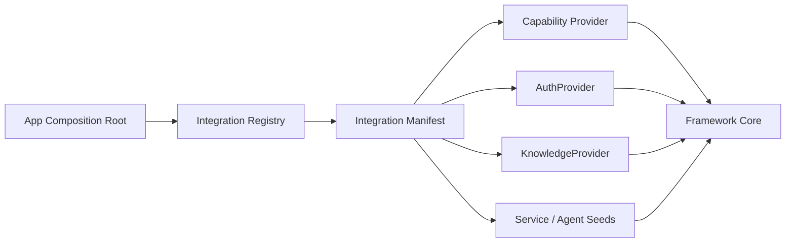

# Project Integration 与 Registry 模块需求与设计一体化文档

> **文档编号**: MOD-INTG-1.0  
> **文档版本**: v1.1  
> **创建日期**: 2026-09-10  
> **文档状态**: 设计草稿（V1.7 整改对齐）  
> **设计基线**: 《通用智能服务执行框架 V1.6 总体设计说明书》+《05-变更记录/V1.6-to-V1.7-整改对齐说明》（D01/D08）  
> **模板类型**: design-full（跨模块/架构核心模块）

**评审边界说明**：

- 需求评审：第 2 章，确认模块职责和边界；
- 设计评审：第 3-4 章，确认技术实现、数据、接口、DFX、部署；
- 本文只设计 Framework Core，不引入任何具体项目业务字段。

---

## 1. 文档控制

### 1.1 责任人

| 角色 | 姓名 | 职责范围 |
|---|---|---|
| 产品/架构负责人 | 待定 | 模块边界、需求与总体设计一致性 |
| 开发负责人 | 待定 | 技术方案与实现 |
| 测试负责人 | 待定 | 场景与 Gate |
| 安全/运维评审 | 按需 | 安全、可靠性、部署评审 |

### 1.2 修订历史

| 版本 | 日期 | 变更描述 |
|---|---|---|
| v0.1 | 2026-09-10 | 基于总体设计 V1.6 首次形成模块详细设计 |
| v1.1 | 2026-09-10 | V1.7 整改：Manifest=YAML+Pydantic+canonical JSON+SHA256（D08）、resource_scope_types 声明（D01）、第二 Demo=local-weekly-report |
| v1.2 | 2026-09-10 | 补「归属」列；后置 E2E 段登记承接方 |

---

## 2. 需求分析

### 2.1 需求概述

| 项目 | 内容 |
|---|---|
| 模块名称 | Project Integration 与 Registry |
| 模块ID | MOD-INTG |
| 需求类型 | 新框架模块设计 |
| 业务背景 | 开源框架必须允许任意项目接入，而不能每新增业务都修改 Framework Core；但 V1 也不应提前建设复杂动态 Plugin Marketplace。 |
| 核心目标 | 定义项目 Integration 的打包边界、Manifest/Registry、装配生命周期和 Core Purity 规则。 |
| 运行形态 | 代码/配置扩展层；部署时由 apps 装配，不独立常驻服务 |

### 2.2 痛点与价值

| 维度 | 内容 |
|---|---|
| 目标用户 | Integration Developer、Builder、框架维护者 |
| 当前问题 | 如果项目代码散落在 Core，首个 MSS 用例会把框架绑死；如果过早做动态插件系统又会增加版本、权限、热加载复杂度。 |
| 框架影响 | Integration 边界决定项目是否真正可开源复用。 |
| 预期价值 | 业务项目通过清晰目录和 SPI 接入；Core 保持稳定；未来可逐步增强插件机制。 |

### 2.3 功能方案

#### 2.3.1 功能清单

| 功能ID | 功能名称 | 功能描述 | 优先级 | 来源 |
|---|---|---|---|---|
| FEAT-01 | Integration Package | 封装 services/agents/capabilities/auth/knowledge/tests。 | P0 | 总体设计 V1.6 |
| FEAT-02 | Manifest/Registry | V1.7 D08：Authoring=YAML → Pydantic 校验 → canonical JSON → SHA-256；声明 provider/seed/channel adapter + resource_scope_types；key 冲突 fail-fast。 | P0 | 总体设计 V1.7 |
| FEAT-03 | 部署装配 | apps 启动时加载选定 Integration。 | P0 | 总体设计 V1.6 |
| FEAT-04 | Core Purity Gate | 禁止 Framework Core 反向 import Project Integration。 | P0 | 总体设计 V1.6 |
| FEAT-05 | 第二样例 | 锁定 `local-weekly-report`（Workspace glob/read → Agent summarize → write → Artifact，零 MSS/外部API/Auth，V1.7 D08）。 | P0 | 总体设计 V1.7 |

#### 2.4 范围与边界

| 类别 | 内容 |
|---|---|
| 范围（In Scope） | Integration 目录规范、manifest、registration、provider 装配、测试边界、Core Purity。 |
| 非范围（Out of Scope） | 动态 Marketplace、在线安装第三方不可信插件、复杂 Hook 系统、跨版本依赖求解器。 |
| 前置假设 | V1 Integration 在部署时选定，管理员无需热安装 Python 包。 |
| 有意妥协/技术债 | 动态扩展、签名包、第三方市场在真实生态需求出现后再设计。 |

### 2.5 验收条件

#### 2.5.1 业务规则与约束

| ID | 类型 | 描述 | 验证场景 |
|---|---|---|---|
| RULE-01 | 系统约束 | framework/** 不得 import integrations/**。 | S-01/E-01 |
| RULE-02 | 系统约束 | Integration 只能依赖公开 Framework Contract/SPI，不得 monkey patch Core。 | E-02 |
| RULE-03 | 系统约束 | 至少两个不同领域 Integration 使用同一 Core 跑通。 | S-02 |

#### 2.5.2 功能验收场景

**正常场景**

| 场景ID | 功能ID | 优先级 | 测试层级 | 关键真实边界 | 归属 | 前置条件 | 操作步骤 | 预期结果 |
|---|---|---|---|---|---|---|---|---|
| S-01 | FEAT-04 | P0 | integration | CI dependency scan | 本模块 | 已完成基础配置 | 新增 integrations/demo 并运行 Core Purity test | Core 无反向依赖，测试通过 |
| S-02 | FEAT-05 | P0 | integration | MSS Demo + Generic Demo → same Runtime/Worker/DB model | 本模块 + 后置段 → 模块 03 / 06 | 已完成基础配置 | 分别注册两个 Integration 的 Service/Capability | 均不修改 Core 即可执行 |
| S-03 | FEAT-01 | P0 | integration | Integration Package → Loader | 本模块 | 已完成基础配置 | 按约定目录提供 services/agents/capabilities/auth/knowledge/tests | Loader 可发现 manifest 声明的扩展，不要求 Core import 项目包 |
| S-04 | FEAT-02 | P0 | integration | Manifest → Registry | 本模块 | 已完成基础配置 | 加载 manifest_hash 与 provider/seed definition 清单 | registration 可审计，provider key 唯一且冲突显式失败 |

**异常场景**

| 场景ID | 功能ID | 测试层级 | 关键真实边界 | 归属 | 触发条件 | 系统行为 | 用户感知 |
|---|---|---|---|---|---|---|---|
| E-01 | FEAT-04 | integration | Architecture Gate | 本模块 | framework/capability import integrations/mss | CI 失败 | 返回可识别错误，不泄露内部细节 |
| E-02 | FEAT-03 | integration | Integration Loader | 本模块 | Manifest 声明未知/冲突 Provider key | 启动失败并给出明确冲突错误，不静默覆盖 | 返回可识别错误，不泄露内部细节 |

#### 2.5.3 非功能指标

| 指标ID | 指标名称 | 目标值 | 测量方法 |
|---|---|---|---|
| NFR-REL-01 | 可靠性 | 不得丢失/破坏框架权威状态；具体 SLA 待真实部署压测后确定 | 故障注入 + integration/E2E |
| NFR-SEC-01 | 安全边界 | 不得信任 LLM 提供的身份/权限/Host 路径等安全上下文 | Architecture Gate + integration |
| NFR-OBS-01 | 可观测性 | 关键操作必须携带 request_id/trace_id 或 execution_id | 日志/Trace 断言 |

性能/QPS/延迟阈值当前没有真实压测依据，本文不虚构固定数字；上线门槛在真实 Reference Integration 跑通后补充。

---

## 3. 技术设计

### 3.1 方案选型

#### 关键决策记录

| 决策点 | 选择 | 被否决项 | 理由 | 可逆性 |
|---|---|---|---|---|
| V1 插件形态 | 部署时装配 Integration | 运行时 Marketplace | 简单、安全、可测试 | 易 |
| 边界 | 物理目录 + SPI + Gate | 仅靠文档约定 | 自动化防止污染 | 难 |
| 通用性证明 | 第二非 MSS demo | 只用 MSS | 减少错误泛化 | 易 |

#### 技术栈

| 类别 | 选型 | 版本 | 选型理由 |
|---|---|---|---|
| 语言 | Python/TS 按 Adapter | 3.12+/5.7+ | 跟随扩展类型 |
| Manifest | YAML/JSON/Pydantic | 待实现 | 声明式装配 |
| Registry | Framework Registry | V1 | 启动时注册 |
| CI | pytest/custom dependency scan | V1 | Core Purity |

### 3.2 架构设计



#### 分层职责

| 层级 | 职责 |
|---|---|
| Manifest | 声明 Integration 能力 |
| Loader | 校验、发现、装配 |
| Registry | 统一 provider/definition 注册 |
| Integration Code | 项目 API/Auth/Knowledge 实现 |
| Core Gate | 防止反向依赖 |

### 3.3 数据设计

> **统一数据库公共字段约束**：本模块凡新增 Framework 自建表，均必须包含 `is_deleted BOOLEAN NOT NULL DEFAULT FALSE`、`create_time TIMESTAMPTZ NOT NULL DEFAULT now()`、`update_time TIMESTAMPTZ NOT NULL DEFAULT now()`；Repository 默认过滤 `is_deleted=false`，删除默认逻辑删除。第三方自管理表（如 LangGraph Checkpointer）不修改其内部 Schema。


| 数据对象/表 | 关键字段 | 约束/索引 | 说明 |
|---|---|---|---|
| integration_registration | key、name、package_ref、integration_type、manifest_hash、enabled、loaded_at | key unique | 装配登记，不做重版本 |


### 3.4 接口设计

| 接口ID | 接口/函数 | 形态 | 说明 | 关联功能 |
|---|---|---|---|---|
| LIB-01 | IntegrationLoader.load(manifest) | 函数库 | 加载/校验 | FEAT-02,FEAT-03 |
| LIB-02 | IntegrationRegistry.register(provider) | 函数库 | 注册扩展 | FEAT-02 |
| FILE-01 | integration manifest | 配置契约 | 声明 Service/Agent/Provider | FEAT-01,FEAT-02 |

Manifest 不保存 Secret 明文，只保存 secret/profile ref。冲突 key 默认 fail-fast，不采用隐式后注册覆盖。

所有普通 HTTP JSON 接口必须复用统一响应 Envelope：

```json
{
  "code": "OK",
  "message": "success",
  "data": {},
  "request_id": "req-xxx",
  "timestamp": "2026-09-10T15:00:00+00:00"
}
```

SSE/WebSocket/文件流属于协议例外，但必须复用统一错误码 taxonomy 和 request/trace 关联策略。

### 3.5 质量实现方案

#### 可靠性

启动时验证所有 required provider；加载失败不进入 Ready；已发布 Execution 使用的 Contract 不允许被未兼容实现静默破坏。

#### 安全性

不可信第三方动态代码安装不在 V1 范围；Integration 包随部署制品审计；Secret 只走 SecretProvider。

#### 可观测性

integration_loaded/failed、provider registration、manifest hash、conflict；health 中显示加载状态。

#### 测试策略

```text
unit
→ 纯规则/状态机/转换

integration
→ Repository / Provider / Runtime 边界

E2E
→ 真实进程/API/数据库/用户可见结果

architecture
→ 依赖方向、Stateless、统一响应、Core Purity 等硬约束
```

---

## 4. 部署与运维

### 4.1 部署架构

Integration 与 selected app images 一起打包/安装；不额外起常驻 Integration Service，除非项目 Provider 自身就是外部服务。

### 4.2 发布与回滚

- 框架代码通过镜像/包版本发布；
- Schema 变化使用 Alembic expand → migrate → switch → contract；
- 只有 `Service` 采用草稿/已发布两态，`Agent` 统一 direct-effect + revision（V1.7 D04），不把代码发布和业务定义发布混成一套版本系统；
- 运行配置可直接生效时必须保留 revision/audit；
- 回滚不得恢复已经撤销的用户权限、Credential 或安全禁用状态。

### 4.3 监控告警

integration load failures、missing provider、registry conflicts；阈值待定。

阈值当前统一标记为**待定**，由 Reference Integration 实测建立基线后配置。

---

## 5. 风险与依赖

### 5.1 项目依赖

| 依赖模块/团队 | 依赖内容 | 状态 | 风险等级 |
|---|---|---|---|
| Framework Contracts | 扩展接口 | 必需 | 低 |
| Project APIs/SDK | 具体业务 | 按 Integration | 高 |
| CI Gate | Core purity | 必需 | 低 |
| Packaging/Helm | 选择 Integration | 必需 | 中 |

### 5.2 风险识别

| 风险ID | 类型 | 描述 | 概率 | 影响 | 应对措施 | 验证场景 |
|---|---|---|---|---|---|---|
| RISK-01 | 开源性 | 首个项目领域泄漏到 Core | 中 | 高 | Core Purity + second demo integration | S-02 |
| RISK-02 | 复杂度 | 过早演变成插件市场 | 中 | 高 | V1 只做部署时装配 | S-01 |

---

## 6. 需求追溯矩阵

| 来源 | 功能ID | 接口ID | 测试场景 | 测试层级 | 状态 |
|---|---|---|---|---|---|
| 总体设计 V1.6 | FEAT-01 | FILE-01 | S-03 | integration/E2E | 待实现 |
| 总体设计 V1.6 | FEAT-02 | LIB-01, LIB-02, FILE-01 | S-04 | integration/E2E | 待实现 |
| 总体设计 V1.6 | FEAT-03 | LIB-01 | E-02 | integration/E2E | 待实现 |
| 总体设计 V1.6 | FEAT-04 | 内部契约 | S-01, E-01 | integration/E2E | 待实现 |
| 总体设计 V1.6 | FEAT-05 | 内部契约 | S-02 | integration/E2E | 待实现 |

> **后置 E2E 承接方登记**（依据 design-full 模板 §2.5.2「归属」列规则：标 `后置` 的场景必须写出承接方）：
>
> | 本模块场景 | 后置段 | 承接方 | 承接场景 |
> |---|---|---|---|
> | S-02 | 同一 Runtime/Worker 执行两个 Integration | `03-Agent Runtime.md` + `06-Worker Engine.md` | `03-S-04`（动态解析 AgentDefinition）、`06-S-01`（Worker claim 执行） |


---

## Spec Compliance Matrix

| Spec/Rule | enforcement | 设计影响 | 设计落点 | 验证场景 | verifier | 状态 |
|---|---|---|---|---|---|---|
| framework#RULE-ARCH-001 | required | Core 不反向依赖 Integration | §3.2 | S-01/E-01 | `test_core_purity.py` | applied |

---

## 附录：术语表

| 术语 | 定义 |
|---|---|
| Framework Core | 与具体业务项目解耦的框架内核 |
| Integration | 具体项目对框架 SPI/Contract 的实现和配置 |
| Capability | 稳定的“系统能做什么”合同 |
| Execution | 一次可靠业务服务执行实例 |
| SoT | Source of Truth，权威事实源 |
| SPI | Service Provider Interface，扩展接口 |
| DFX | 面向可靠性、安全性、可测试性、可运维性等质量属性的设计 |

---