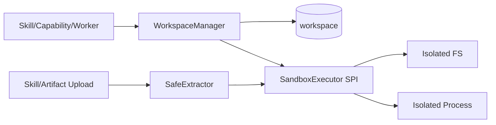

<!-- V1.11 module-split metadata -->
> **文档分档**：`Full`（模板 `design-full.md`）  
> **分档理由**：受控工作区与代码/脚本执行安全边界  
> **文档边界**：本文件是该模块唯一详细设计事实源；DB Owner 与接口 Owner 必须落在本模块，不允许在其他模块重复定义。  
> **拆分原则**：仅按可独立评审/编码/验收的一级模块拆分；不按单表/单接口继续碎片化。

# Workspace 与 Sandbox 模块需求与设计一体化文档

> **文档编号**: MOD-WS-V1.11 模块分档拆分版
> **文档版本**: V1.11 模块分档拆分版
> **创建日期**: 2026-09-11
> **文档状态**: 设计基线草案（待仓库 Spec Context 绑定后进入正式评审）
> **模板**: `design-full.md`；生成流程按 `cf-task:align` 的复杂后端/架构模块路径执行。
> **上游基线**: V1.8 完整总体设计 + V6 完整 Playbook + Console V0.8 Final。


**评审边界说明**：
- 第 2 章是需求基线（What），禁止实现阶段自行改变领域语义；
- 第 3-4 章是设计基线（How），DB 与每个接口必须以本文为准；
- `Spec Compliance Matrix` 当前依据设计基线生成，因本轮未提供仓库 `spec-context.yml` 与代码目录，**不得声称已通过 cf-task:align 的 repo Spec Gate**；落码前必须在真实仓库执行 `refresh/catalog/bind`。


## 1. 文档控制

### 1.1 责任人

| 角色 | 姓名 | 职责范围 |
|---|---|---|
| 产品/架构负责人 | 待定 | 需求定义、领域边界、与总设/Playbook 一致性 |
| 开发负责人 | 待定 | 技术方案、DB/API、实现 |
| 测试负责人 | 待定 | S/E/B 场景、E2E Gate |
| 安全/运维 | 待定 | Secret、隔离、发布、监控 |

### 1.2 修订历史

| 版本 | 日期 | 作者 | 变更描述 |
|---|---|---|---|
| V1.11 模块分档拆分版 | 2026-09-11 | ChatGPT / 待项目负责人确认 | 按 cf-task:align + design-full 从最新完整总设/Playbook/交互稿重新生成；细化 DB 与全部接口 |

## 2. 需求分析

### 2.1 需求概述

| 项目 | 内容 |
|---|---|
| 模块名称 | Workspace 与 Sandbox |
| 模块ID | MOD-WS |
| 所属系统/产品线 | Fluxion 通用智能服务执行框架 |
| 需求类型 | 中大型功能 / 架构演进 |
| 业务背景 | Skill/文件处理/Sandbox Capability 需要受控文件与命令执行，但不能恢复为用户固定 Pod/Home 或让 Agent Runtime 直接操作 Host。 |
| 核心目标 | 提供 Conversation/Execution scoped Workspace、SafeExtractor、SandboxExecutor SPI、路径/配额/网络策略和生命周期治理。 |

### 2.2 痛点与价值

| 维度 | 内容 |
|---|---|
| 目标用户 | Skill Runtime、Capability Sandbox Provider、Worker、运维 |
| 当前问题 | Host filesystem/shell 会突破租户隔离；用户固定 workspace/pod 又让 Runtime 有状态。 |
| 业务影响 | 越权读写、供应链执行风险、Pod 难扩缩。 |
| 预期价值 | 代码/文件处理能力可用且隔离，不污染 Runtime 无状态模型。 |

### 2.3 功能方案

#### 2.3.1 功能清单

| 功能ID | 功能名称 | 功能描述 | 优先级 | 来源 |
|---|---|---|---|---|
| FEAT-WS-01 | Workspace Metadata | owner scoped opaque ref。 | P0 | 总设 P15 |
| FEAT-WS-02 | Sandbox Executor | 受控命令/文件执行 SPI。 | P0 | Built-in Tool |
| FEAT-WS-03 | Safe Extract | Skill/Artifact 安全解压。 | P0 | 供应链 |
| FEAT-WS-04 | Quota/Lifecycle | 配额、过期、seal/cleanup。 | P0 | 运维 |
| FEAT-WS-05 | Path Policy | realpath/symlink/escape 检查。 | P0 | 安全 |

### 2.4 范围与边界

| 类别 | 内容 |
|---|---|
| 范围（In Scope） | workspace 表、manager、sandbox port、文件/命令策略、归档解压、配额和清理。 |
| 非范围（Out of Scope） | 用户固定本地目录、任意 Host shell、ObjectStore 底层实现。 |
| 前置假设 | 上游总设、公共 DB/API 规范、外部基础设施可用 |
| 有意妥协 / 技术债 | 无；未来扩展必须有真实旅程驱动 |

### 2.5 验收条件

#### 2.5.1 业务规则与约束

| ID | 类型 | 描述 | 验证场景 |
|---|---|---|---|
| RULE-WS-01 | 所有权 | Workspace 属于 Conversation 或 Execution，不属于 Runtime Pod。 | S-WS-01 |
| RULE-WS-02 | Opaque | 上层只持 workspace_ref/handle，不持 Host path。 | S-WS-02 |
| RULE-WS-03 | 路径 | 拒绝 absolute/../symlink escape。 | S-WS-03 |
| RULE-WS-04 | Shell | Agent Runtime 不直接 host exec；只能 SandboxExecutor。 | S-WS-04 |
| RULE-WS-05 | 生产 | Local executor 只开发使用；生产必须隔离实现（ADR-035：V1 = LinuxNamespaceExecutor）。 | S-WS-05 |

**生产隔离执行器合同（ADR-035；V1=LinuxNamespaceExecutor）**

本合同是 V1 的必备隔离，不把“独立进程”当成安全边界。仅支持满足以下条件的 Linux 生产节点；任何强制隔离设置失败返回 SANDBOX_ISOLATION_UNAVAILABLE 并拒绝执行，不能 fallback Local。开发 Mock 可显式 Local，生产配置禁止。

- 为每 invocation 创建独立 user/mount/PID/IPC/network namespace；子进程 non-root UID、无宿主 capabilities、no_new_privs，seccomp 拒绝 mount/ptrace/namespace 逃逸等调用。子进程只能看到预构建最小只读 Python rootfs，不挂宿主根目录、容器 socket、宿主 /proc、home 或 Secret volume；/proc 仅本 PID namespace 的最小只读视图。
- Artifact 和已校验依赖只读挂载，当前 Workspace 可写，临时目录独立；所有其他路径不可见。路径解析拒绝绝对/../symlink escape，挂载和 OS 权限同时强制，不依赖 Python SDK 自律。
- network namespace 默认无外部网络接口/路由，Skill 的业务网络只能经宿主 Capability RPC；依赖由 CI/受控离线 wheelhouse 预构建并按 digest 挂载，运行时不执行联网 pip。Sandbox Capability 若确需网络必须由其策略显式配置受限代理与目的 allowlist，不能共享宿主网络。
- 每 invocation 独立 cgroup v2，memory.max/pids.max/CPU 配额；rlimit 辅助限制文件/CPU，stdout/stderr 由宿主有界读取，超过输出限额主动终止。超时/取消先标取消事实，再 cgroup.kill（含后代）及进程组清理，回收临时挂载/Workspace lease。
- 启动设置 parent-death 终止并复查父 PID；宿主为 invocation 注册持久过期 lease，重启扫描过期 cgroup/挂载清理。子进程失联不能继续发外部请求，已执行副作用按 operation_id 恢复，不用进程存活作执行事实。

**SDK IPC**：私有 FD3（子→宿主）/FD4（宿主→子），普通 stdout/stderr 仅 FD1/2，禁止复用业务输出作协议。帧=4 字节长度前缀+UTF-8 JSON（上限 1 MiB），字段 version=1/request_id/sequence/op/arguments；op 为 CAPABILITY_CALL/ARTIFACT_WRITE/ARTIFACT_READ，响应 request_id/result 或受控 error。同 invocation 序列严格递增，重放返回已记录结果或拒绝；帧过大/非法类型/未知 op 终止调用。

调用身份取宿主 invocation registry 的 tenant/actor/Agent/Skill/checksum/workspace/projection/test_mode，不相信子进程传 ctx/user/Secret。Capability 请求验证 manifest dependency_keys、当前 enabled/grant/风险、DRY_RUN，再交模块 07；Artifact 请求走模块 05/14，只允许当前 Workspace/Execution。子进程持有 IPC FD 不等于可以调用任意 Capability。HMAC 不用于替代这些授权检查。

SDK 公共 API 同步；子进程在 request/response 上等待，宿主异步泵处理 IO。宿主不在线程中 import entrypoint，不让 Skill 获得运行进程的内存/凭据。runtime rootfs 是同一发布的受控制品，不增加第五个常驻生产角色。

#### 2.5.2 功能验收场景

**正常场景**

| 场景ID | 功能ID | 优先级 | 测试层级 | 关键真实边界 | 归属 | 前置条件 | 操作步骤 | 预期结果 |
|---|---|---|---|---|---|---|---|---|
| S-WS-04 | FEAT-WS-02 | P1 | integration | Shell 仅经 SandboxExecutor | 本模块 | Agent 请求 shell 工具 | 执行 shell.execute | 由 SandboxExecutor 受控执行；Runtime 进程无直接 exec 路径 |
| S-WS-05 | FEAT-WS-02 | P1 | integration | 生产用隔离 Executor | 本模块 | 生产环境运行 Skill | 选择 executor | 仅隔离实现可用；Local executor 被配置拒绝 |
| S-WS-01 | FEAT-WS-01 | P0 | integration | Manager→PG→Sandbox | 本模块 | Execution 无 workspace | get_or_create | 创建 opaque workspace，Pod 重启后可重新解析 |
| S-WS-02 | FEAT-WS-03 | P0 | integration | SafeExtractor | 本模块 | 合法 Skill zip | extract | 只写 workspace 内文件 |
| S-WS-03 | FEAT-WS-02 | P0 | E2E | Skill→Sandbox | 本模块 | 允许命令/网络策略 | 运行脚本 | 按 quota/deadline 输出 stdout/stderr ref |

**异常场景**

| 场景ID | 功能ID | 测试层级 | 关键真实边界 | 归属 | 触发条件 | 系统行为 | 用户感知 |
|---|---|---|---|---|---|---|---|
| E-WS-01 | FEAT-WS-03 | integration | SafeExtractor | 本模块 | ../evil 或 symlink escape | 拒绝 ARCHIVE_PATH_TRAVERSAL | 无越界文件 |
| E-WS-02 | FEAT-WS-02 | integration | Sandbox policy | 本模块 | 未授权命令/网络 | SANDBOX_POLICY_DENIED | 可追踪拒绝 |

#### 2.5.3 非功能指标

| 指标ID | 指标名称 | 目标值 | 测量方法 |
|---|---|---|---|
| NFR-REL-01 | 可靠执行 | 不得因单 Runtime/Worker 进程退出丢失权威状态 | SIGKILL/E2E |
| NFR-SEC-01 | 可信身份 | LLM/客户端不得覆盖 tenant/actor/secret | 安全测试 |
| NFR-OBS-01 | 可追踪 | 关键路径可按 request_id/trace_id/execution_id 定位 | 集成/E2E |

## 3. 技术设计

### 3.1 方案选型

#### 3.1.1 关键决策记录

| 决策点 | 选择 | 被否决项 | 理由 | 可逆性 |
|---|---|---|---|---|
| Workspace owner | Conversation/Execution | 每用户固定 workspace | 与无状态 Runtime 一致 | 难 |
| 生产执行 | Sandbox SPI 隔离实现 | Host shell | 信任边界 | 难 |

#### 3.1.2 技术栈

| 类别 | 选型 | 版本 | 选型理由 |
|---|---|---|---|
| 语言 | Python | 3.12+（仓库实际版本落码前确认） | 与 Agent/LLM 生态一致 |
| Web/API | FastAPI + Pydantic | 仓库实际版本确认 | 类型契约与异步 IO |
| ORM | SQLAlchemy 2 Async | 仓库实际版本确认 | 异步 PostgreSQL |
| 数据库 | PostgreSQL | 外部部署 | 业务 SoT |

### 3.2 架构设计



#### 3.2.1 模块职责分层

| 层级 | 职责 | 禁止事项 |
|---|---|---|
| Handler/API | 协议解析、DTO、权限入口、统一错误映射 | 业务逻辑/直接 SQL |
| Application Service | 用例编排、事务边界、领域校验 | 依赖具体 Web 框架 |
| Domain | 领域对象/规则 | 基础设施依赖 |
| Repository/Port | 持久化/外部能力抽象 | 泄露 Secret/跨领域修改 |
| Adapter | PostgreSQL/HTTP/MCP 等实现 | 改变领域语义 |

#### 3.2.2 外部依赖清单

| 外部系统/模块 | 依赖类型 | 协议/接口 | 超时/一致性 | 降级策略 |
|---|---|---|---|---|
| Sandbox backend | 执行/文件 | SPI | 隔离/deadline | 不可用返回 sandbox error |
| ObjectStore | 持久 Artifact | Port | 外部 | 可从 workspace seal 到 object store |
| PostgreSQL | Workspace metadata | SQL | SoT | 不可本地代替 |

### 3.3 数据设计

#### 3.3.1 表清单

| 表名 | 职责 | 所有权 |
|---|---|---|
| workspace | Conversation/Execution 的受控工作目录元数据；实际文件在 Sandbox/ObjectStore，不等于用户固定 Home/Pod。 | Workspace 与 Sandbox |

#### 表 `workspace`

**职责**：Conversation/Execution 的受控工作目录元数据；实际文件在 Sandbox/ObjectStore，不等于用户固定 Home/Pod。

| 字段名 | 类型 | 可空 | 默认值 | 索引 | 说明 |
|---|---|---|---|---|---|
| tenant_id | UUID | N |  | IDX | 租户 |
| owner_type | VARCHAR(32) | N |  | IDX | CONVERSATION/EXECUTION |
| owner_id | UUID | N |  | IDX | 对应 owner |
| backend_type | VARCHAR(32) | N | SANDBOX |  | SANDBOX/OBJECT_STORE_MOUNT |
| workspace_ref | VARCHAR(1024) | N |  |  | Sandbox Executor 可识别引用 |
| status | VARCHAR(32) | N | ACTIVE | IDX | ACTIVE/SEALED/DELETED |
| quota_bytes | BIGINT | Y |  |  | 可选配额 |
| expires_at | TIMESTAMPTZ | Y |  | IDX | 临时工作区过期 |
| id | UUID | N | gen_random_uuid() | PK | 主键 |
| is_deleted | BOOLEAN | N | FALSE | IDX | 软删除标记；默认查询必须过滤 FALSE |
| create_time | TIMESTAMPTZ | N | CURRENT_TIMESTAMP |  | 创建时间 |
| update_time | TIMESTAMPTZ | N | CURRENT_TIMESTAMP |  | 更新时间 |

**约束**

- UNIQUE (tenant_id,owner_type,owner_id) WHERE is_deleted=false
- Runtime 不直接拼 host path

**索引设计**

| 索引名 | 类型 | 字段 | 使用场景 |
|---|---|---|---|
| uk_workspace_owner | UNIQUE(partial) | tenant_id,owner_type,owner_id | WHERE is_deleted=false；owner→workspace |
| idx_workspace_expiry | BTREE | tenant_id,status,expires_at,is_deleted | 清理 |

#### 3.3.2 ER 图

本模块没有需要单独表达的多表 ER；跨模块关系见《数据库表所有权与字段索引》。

#### 3.3.3 数据一致性与软删除规则

- 所有 Framework 自建可变表使用 `is_deleted/create_time/update_time`；查询默认过滤 `is_deleted=false`。
- FK 只引用同一租户可见对象；跨租户引用必须在 Application Service 拒绝。
- Secret/Token/Password 不落业务表明文，只保存 `secret_ref/credential_ref`。
- 不可变 Release/Snapshot/Artifact 使用 append-only；需要更新时新建记录。
- `revision` 用于 direct-effect 配置的乐观并发和审计，不等同于发布版本。

### 3.4 接口设计

#### 3.4.1 接口清单

| 接口ID | 名称 | 形态 | 方法/签名 | 路径/用途 |
|---|---|---|---|---|
| WS-LIB-01 | 获取/创建 Workspace | Library | async def get_or_create_workspace(ctx: TrustedExecutionContext, owner_type: str, owner_id: UUID) -> WorkspaceHandle |  |
| WS-LIB-02 | 安全解压 Artifact | Library | def safe_extract(archive_path: Path, target: WorkspaceHandle, limits: ExtractionLimits) -> ExtractReport |  |
| WS-LIB-03 | Sandbox 命令执行 | Library | async def execute_sandbox(handle: WorkspaceHandle, command: SandboxCommand, policy: SandboxPolicy) -> SandboxResult |  |

#### WS-LIB-01: 获取/创建 Workspace

**入口类型**：Library

**函数签名**

```python
async def get_or_create_workspace(ctx: TrustedExecutionContext, owner_type: str, owner_id: UUID) -> WorkspaceHandle
```

**入参**

| 参数 | 类型 | 必填 | 说明 |
|---|---|---|---|
| owner_type | string | Y | CONVERSATION/EXECUTION |
| owner_id | uuid | Y | owner |

**返回**

| 字段 | 类型 | 说明 |
|---|---|---|
| handle | WorkspaceHandle | 受控 ref/quota/expiry |

**异常/错误**

| 错误码 | 场景 | HTTP 状态 |
|---|---|---|
| WORKSPACE_QUOTA_EXCEEDED | 配额不足 | 409 |

**处理逻辑**

```text
DB resolve workspace → SandboxExecutor.allocate if missing → INSERT metadata → 返回 opaque handle；不得返回 host path。
```

#### WS-LIB-02: 安全解压 Artifact

**入口类型**：Library

**函数签名**

```python
def safe_extract(archive_path: Path, target: WorkspaceHandle, limits: ExtractionLimits) -> ExtractReport
```

**入参**

| 参数 | 类型 | 必填 | 说明 |
|---|---|---|---|
| archive_path | Path | Y | 上传临时文件 |
| target | WorkspaceHandle | Y | 受控目标 |
| limits | ExtractionLimits | Y | 文件数/大小/深度/后缀限制 |

**返回**

| 字段 | 类型 | 说明 |
|---|---|---|
| report | ExtractReport | 文件清单/总大小/拒绝项 |

**异常/错误**

| 错误码 | 场景 | HTTP 状态 |
|---|---|---|
| ARCHIVE_PATH_TRAVERSAL | 路径穿越 | 400 |
| ARCHIVE_BOMB | 压缩炸弹/超限 | 400 |

**处理逻辑**

```text
拒绝绝对路径、..、symlink escape → 限制 entries/expanded bytes → 原子写入受控 workspace。
```

#### WS-LIB-03: Sandbox 命令执行

**入口类型**：Library

**函数签名**

```python
async def execute_sandbox(handle: WorkspaceHandle, command: SandboxCommand, policy: SandboxPolicy) -> SandboxResult
```

**入参**

| 参数 | 类型 | 必填 | 说明 |
|---|---|---|---|
| command | SandboxCommand | Y | 受控 argv/env/timeout |
| policy | SandboxPolicy | Y | 网络/文件/资源权限 |

**返回**

| 字段 | 类型 | 说明 |
|---|---|---|
| exit_code | integer | 退出码 |
| stdout_ref | string | 大输出 ref |
| stderr_ref | string | 错误输出 ref |

**异常/错误**

| 错误码 | 场景 | HTTP 状态 |
|---|---|---|
| SANDBOX_TIMEOUT | 超时 | 504 |
| SANDBOX_POLICY_DENIED | 命令/路径/网络被拒绝 | 403 |

**处理逻辑**

```text
验证 workspace ownership → policy check → executor run → 截断/外置大输出 → telemetry；Agent Runtime 不调用 host shell。
```

### 3.5 质量实现方案

#### 3.5.1 性能与容量

| 热点路径 | 负载量级 | 潜在瓶颈 | 实现方案 | 目标值 |
|---|---|---|---|---|
| 文件 IO | Skill/报告处理 | 大文件复制 | streaming、同 backend move、ObjectStore ref | 按文件大小上限 |
| Sandbox start | 高频脚本 | 冷启动 | 池化/预热需真实负载后再做 | V1 先正确性 |

#### 3.5.2 可靠性

所有外部调用有 deadline；重试有界且只对可安全重试错误；业务权威状态外置；进程崩溃后能恢复或明确失败。

#### 3.5.3 安全性

默认无 host mount/privileged；network deny-by-default 或 capability policy；资源 CPU/memory/process/file count 限制；文件名和 MIME 不可信。

#### 3.5.4 可观测性

日志、Metrics、Trace 统一关联 request_id/trace_id；Execution 路径附带 execution_id/step_id；错误码稳定。

#### 3.5.5 测试策略

Domain/validator 单测；Repository/Provider 真 PG/外部 Stub 集成；核心用户旅程做 E2E；安全和崩溃恢复不得只靠 mock。

## 4. 部署与运维

### 4.1 部署架构

随其所属运行角色部署；PostgreSQL/Redis/Object Store/Secret Provider/OTel Backend 均为外部依赖，不打包进应用 Compose/Helm。

### 4.2 发布与回滚

DB 变更使用向前兼容迁移；应用支持滚动回滚；若涉及不可变 Release/Artifact，只切换 current 指针，不覆盖历史。

### 4.3 监控告警

至少监控请求/调用量、错误率、延迟、外部依赖失败、关键队列/执行积压和配置加载失败；阈值由环境基线确定。

### 4.4 数据迁移

若无历史生产数据则直接按新 Schema 建表；若已有部署，使用 Alembic 等可回滚/可前滚迁移，禁止运行时隐式改表。

## 5. 风险与依赖

| 风险ID | 描述 | 影响 | 应对措施 | 验证场景 |
|---|---|---|---|---|
| RISK-WS-01 | 跨模块边界在实现中被绕过 | 形成双事实源/不可测试 | Architecture Gate + code review | E2E/静态检查 |

## 6. 需求追溯矩阵

| 功能ID | 接口ID | 验证场景 | 测试层级 | 状态 |
|---|---|---|---|---|
| FEAT-WS-01 | WS-LIB-01, WS-LIB-02 | S-WS-01 | E2E/integration | 待实现/评审 |
| FEAT-WS-02 | WS-LIB-02, WS-LIB-03 | S-WS-03, E-WS-02 | E2E/integration | 待实现/评审 |
| FEAT-WS-03 | WS-LIB-03 | S-WS-02, E-WS-01 | E2E/integration | 待实现/评审 |
| FEAT-WS-04 |  | 见 §2.5 | E2E/integration | 待实现/评审 |
| FEAT-WS-05 |  | 见 §2.5 | E2E/integration | 待实现/评审 |

## Spec Compliance Matrix

| Spec/Rule | enforcement | 设计影响 | 设计落点 | 验证场景 | 状态/N/A 理由 |
|---|---|---|---|---|---|
| DESIGN/WS#RULE-WS-01 | design-baseline | 约束实现与验收 | §2.5 RULE-WS-01 / §3 | S/E/B 场景 | applied；仓库 spec-context 待绑定 |
| DESIGN/WS#RULE-WS-02 | design-baseline | 约束实现与验收 | §2.5 RULE-WS-02 / §3 | S/E/B 场景 | applied；仓库 spec-context 待绑定 |
| DESIGN/WS#RULE-WS-03 | design-baseline | 约束实现与验收 | §2.5 RULE-WS-03 / §3 | S/E/B 场景 | applied；仓库 spec-context 待绑定 |
| DESIGN/WS#RULE-WS-04 | design-baseline | 约束实现与验收 | §2.5 RULE-WS-04 / §3 | S/E/B 场景 | applied；仓库 spec-context 待绑定 |
| DESIGN/WS#RULE-WS-05 | design-baseline | 约束实现与验收 | §2.5 RULE-WS-05 / §3 | S/E/B 场景 | applied；仓库 spec-context 待绑定 |

## 附录 A：接口与 DB 落码检查清单

- [ ] 每个 HTTP Endpoint 已有 DTO、鉴权、错误码、处理逻辑、测试。
- [ ] 每个 Library/CLI 接口有稳定签名和异常语义。
- [ ] 每张表字段、类型、NULL、默认值、唯一约束、索引、软删除策略已落实迁移。
- [ ] Request/Response 字段不接受客户端传入可信 tenant/actor/credential。
- [ ] 列表接口使用服务端分页，避免无界返回。
- [ ] 修改类接口有 revision/冲突语义；高风险/副作用路径满足幂等和审计。
- [ ] 仓库 Spec Context 已 refresh/catalog/bind 且 required Rules 映射到 S/E/B verifier。
