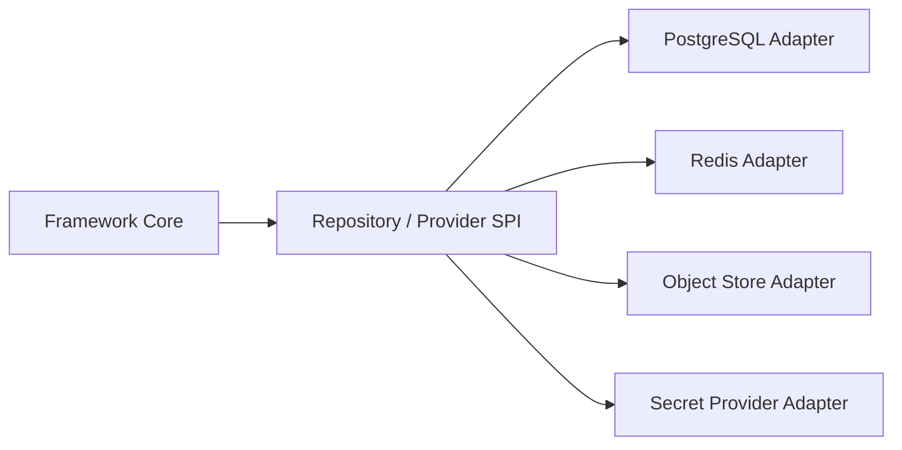

# 存储与基础设施适配 模块需求与设计简报

> **文档编号**: MOD-STORE-1.0  
> **文档版本**: v1.0  
> **创建日期**: 2026-09-10  
> **文档状态**: 设计草稿  
> **设计基线**: 《通用智能服务执行框架 V1.6 总体设计说明书》  
> **模板类型**: design-lite

## 1. 文档控制

| 项目 | 内容 |
|---|---|
| 开发负责人 | 待定 |
| 测试负责人 | 待定 |
| 首次版本 | v0.1 / 2026-09-10 |

---

## 2. 需求分析

### 2.1 需求概述

| 项目 | 内容 |
|---|---|
| 模块名称 | 存储与基础设施适配 |
| 需求类型 | 框架基础模块 |
| 业务背景 | Framework Core 需要 PostgreSQL、Redis、Object Store、Secret Provider，但不能把具体云厂商/组件 SDK 写入 Domain。 |
| 核心目标 | 通过 Repository/Provider/Adapter 隔离基础设施，实现生产外部依赖、开发可替换且业务 SoT 清晰。 |

### 2.2 功能方案

| 功能ID | 功能名称 | 功能描述 | 优先级 | 来源 |
|---|---|---|---|---|
| FEAT-01 | PostgreSQL Adapter | Domain Repository 的异步 SQLAlchemy/asyncpg 实现。 | P0 | 总体设计 V1.6 |
| FEAT-02 | Redis Coordination | wake-up/cancel/cache/pubsub；不可作为唯一 SoT。 | P0 | 总体设计 V1.6 |
| FEAT-03 | Object Store | Artifact/Skill/Knowledge 静态对象存储。 | P0 | 总体设计 V1.6 |
| FEAT-04 | Secret Provider | Credential/Secret 只通过 ref 解析。 | P0 | 总体设计 V1.6 |

### 2.3 范围与边界

| 类别 | 内容 |
|---|---|
| 范围（In Scope） | Repository Adapter、连接池、事务、基础 health、对象/Secret 接口。 |
| 非范围（Out of Scope） | 把 PG/Redis/ObjectStore 嵌入应用 Helm；跨云统一运维平台。 |
| 有意妥协/技术债 | 具体供应商适配按部署环境增加；V1 先保持接口稳定。 |

### 2.4 验收条件

**正常场景**

| 场景ID | 功能ID | 优先级 | 测试层级 | 关键真实边界 | 操作步骤 | 预期结果 |
|---|---|---|---|---|---|---|
| S-01 | FEAT-01 | P0 | integration | Repository → PostgreSQL | 创建 Execution 并重启进程 | 状态可从 PG 恢复 |
| S-02 | FEAT-02 | P0 | integration | Redis Down → PG Polling | 关闭 Redis | 可靠执行正确性不受破坏，仅实时性可能下降 |

**异常场景**

| 场景ID | 功能ID | 测试层级 | 关键真实边界 | 触发条件 | 系统行为 |
|---|---|---|---|---|---|
| E-01 | FEAT-04 | integration | Secret Provider | secret ref 不存在 | 显式失败，不回退日志/配置明文 |
| E-02 | FEAT-03 | integration | Object Store | 上传失败 | Artifact 不标记为成功，Execution 可按策略重试/失败 |

性能数值没有实测依据时统一记为“待定”，不照抄模板示例值。

---

## 3. 技术设计

> **统一数据库公共字段约束**：本模块凡新增 Framework 自建表，均必须包含 `is_deleted BOOLEAN NOT NULL DEFAULT FALSE`、`create_time TIMESTAMPTZ NOT NULL DEFAULT now()`、`update_time TIMESTAMPTZ NOT NULL DEFAULT now()`；Repository 默认过滤 `is_deleted=false`，删除默认逻辑删除。第三方自管理表（如 LangGraph Checkpointer）不修改其内部 Schema。

### 3.1 技术选型

| 类别 | 选型 | 版本 | 理由 |
|---|---|---|---|
| 数据库 | PostgreSQL + asyncpg | 待部署确定 | 事务/索引/claim |
| ORM | SQLAlchemy Async | 2.x | Repository Adapter |
| 缓存协调 | Redis | 5+ | 非权威 |
| 对象存储 | S3-compatible | 待部署确定 | artifact |

### 3.2 架构设计

所有 Adapter 失败必须映射统一 infra error class；业务层不得捕获厂商 SDK 私有异常作为正常控制流。

### 3.3 接口设计

| 接口ID | 接口/函数 | 形态 | 说明 |
|---|---|---|---|
| SPI-01 | Repository Protocol | 函数库 | 领域持久化 |
| SPI-02 | ArtifactStore.put/get | SPI | 对象存储 |
| SPI-03 | SecretProvider.resolve(ref) | SPI | Secret 获取 |
| SPI-04 | CoordinationClient.wake/cancel | SPI | 非权威协调 |

普通 JSON API 统一使用 `ApiResponse<T>`；函数/SPI 使用明确异常/错误码，不返回不受约束的任意错误结构。

### 3.4 性能与容量考量

| 热点路径 | 预估负载 | 潜在瓶颈 | 应对策略 | 目标值 |
|---|---|---|---|---|
| Worker claim / Execution step persist | 待定 | 数据库锁竞争、连接池、索引缺失 | SKIP LOCKED、正确组合索引、短事务、连接池监控 | 待定 |

---

## 4. 风险与依赖

### 4.1 项目依赖

| 依赖模块 | 依赖内容 | 风险等级 |
|---|---|---|
| PostgreSQL | 业务 SoT | 高 |
| Redis | 协调 | 低 |
| Object Store | Artifact | 中 |
| Secret Backend | 凭据 | 高 |

### 4.2 风险识别

| 风险ID | 描述 | 影响 | 应对措施 | 验证场景 |
|---|---|---|---|---|
| RISK-01 | Redis 被误用为任务唯一队列 | Redis 数据丢失导致任务丢失 | PG polling/recovery Gate | S-02 |
| RISK-02 | Secret 明文进入配置/日志 | 凭据泄漏 | 只保存 ref + redaction | E-01 |

---

## Spec Compliance Matrix

| Spec/Rule | enforcement | 设计影响 | 设计落点 | 验证场景 | verifier | 状态 |
|---|---|---|---|---|---|---|
| framework#RULE-DB-001 | required | 所有自建表含三公共字段 | §3 | S-01 | `test_database_common_fields.py` | applied |
| framework#RULE-DB-002 | required | Repository 默认过滤软删除 | §3 | S-01 | `test_soft_delete_queries.py` | applied |

---

## 附录：术语表

| 术语 | 定义 |
|---|---|
| Adapter | Framework Contract 的基础设施实现 |
| SoT | 权威事实源 |
| OTel | OpenTelemetry |
| Envelope | 统一 API 响应外壳 |

---
