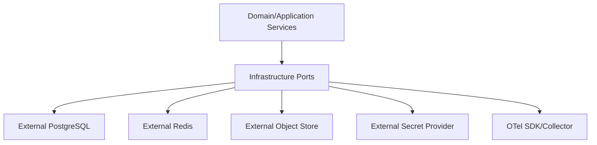

<!-- V1.11 module-split metadata -->
> **文档分档**：`Full`（模板 `design-full.md`）  
> **分档理由**：PG/Redis/ObjectStore/SecretProvider 跨基础设施适配  
> **文档边界**：本文件是该模块唯一详细设计事实源；DB Owner 与接口 Owner 必须落在本模块，不允许在其他模块重复定义。  
> **拆分原则**：仅按可独立评审/编码/验收的一级模块拆分；不按单表/单接口继续碎片化。

# 存储与基础设施适配 模块需求与设计一体化文档

> **文档编号**: MOD-INFRA-V1.13
> **文档版本**: V1.13
> **创建日期**: 2026-09-11
> **文档状态**: 设计基线草案（待仓库 Spec Context 绑定后进入正式评审）
> **模板**: `design-full.md`；生成流程按 `cf-task:align` 的复杂后端/架构模块路径执行。
> **上游基线**: V1.8 完整总体设计 + V6 完整 Playbook + Console V0.8 Final。


**评审边界说明**：
- 第 2 章是需求基线（What），禁止实现阶段自行改变领域语义；
- 第 3-4 章是设计基线（How），DB 与每个接口必须以本文为准；
- `Spec Compliance Matrix` 当前依据设计基线生成，因本轮未提供仓库 `spec-context.yml` 与代码目录，**不得声称已通过 cf-task:align 的 repo Spec Gate**；落码前必须在真实仓库执行 `refresh/catalog/bind`。


## 1. 文档控制

### 1.1 责任人

| 角色 | 姓名 | 职责范围 |
|---|---|---|
| 产品/架构负责人 | 待定 | 需求定义、领域边界、与总设/Playbook 一致性 |
| 开发负责人 | 待定 | 技术方案、DB/API、实现 |
| 测试负责人 | 待定 | S/E/B 场景、E2E Gate |
| 安全/运维 | 待定 | Secret、隔离、发布、监控 |

### 1.2 修订历史

| 版本 | 日期 | 作者 | 变更描述 |
|---|---|---|---|
| V1.11 模块分档拆分版 | 2026-09-11 | ChatGPT / 待项目负责人确认 | 按 cf-task:align + design-full 从最新完整总设/Playbook/交互稿重新生成；细化 DB 与全部接口 |
| V1.13 第三轮 Review 修复 | 2026-09-12 | Claude Code | 修正 §2.5.1 RULE→场景指向并重写 §6 追溯矩阵（消除错位与空接口列）；补 INFRA-LIB-01..05 认证/授权行；合规矩阵填真实 verifier；修正 S-INFRA-04 场景列缺失 |

## 2. 需求分析

### 2.1 需求概述

| 项目 | 内容 |
|---|---|
| 模块名称 | 存储与基础设施适配 |
| 模块ID | MOD-INFRA |
| 所属系统/产品线 | Fluxion 通用智能服务执行框架 |
| 需求类型 | 中大型功能 / 架构演进 |
| 业务背景 | PostgreSQL、Redis、Object Store、Secret Provider、Observability Backend 必须外部独立部署；Framework 通过 Port/Adapter 使用，不把这些基础设施生命周期放应用 Compose。 |
| 核心目标 | 定义基础设施 Port、故障语义、连接/Secret/Object 生命周期和 Redis 非 SoT 原则。 |

### 2.2 痛点与价值

| 维度 | 内容 |
|---|---|
| 目标用户 | 所有后端模块、运维、Integration Developer |
| 当前问题 | 把 PG/Redis 内嵌应用 Compose 与本地文件当生产 SoT 会让部署、HA、恢复和安全不清晰；上层若直接依赖具体 SDK 难替换。 |
| 业务影响 | 生产同形态不足、数据丢失、Secret 泄露、难做托管/私有化适配。 |
| 预期价值 | 业务模块依赖稳定 Port，基础设施可由不同环境独立运维/替换。 |

### 2.3 功能方案

#### 2.3.1 功能清单

| 功能ID | 功能名称 | 功能描述 | 优先级 | 来源 |
|---|---|---|---|---|
| FEAT-INFRA-01 | PostgreSQL Adapter | Async SQLAlchemy/session/transaction。 | P0 | SoT |
| FEAT-INFRA-02 | Redis Adapter | cache/wakeup/cancel hint，不做 SoT。 | P0 | 可靠性 |
| FEAT-INFRA-03 | ObjectStore Port | 大结果/Artifact/Skill 包。 | P0 | 存储 |
| FEAT-INFRA-04 | SecretProvider Port | Credential/Token/Bot/Model Secret。 | P0 | 安全 |
| FEAT-INFRA-05 | Config/Connection | 外部 endpoint/health/pool。 | P0 | 运维 |

### 2.4 范围与边界

| 类别 | 内容 |
|---|---|
| 范围（In Scope） | 基础设施 Port/Adapter、连接池、timeout、health、错误、Secret/Object lifecycle；外部部署契约。 |
| 非范围（Out of Scope） | 具体云厂商运维平台、把 PG/Redis/ObjectStore/SecretProvider 打进 Fluxion Compose/Helm。 |
| 前置假设 | 上游总设、公共 DB/API 规范、外部基础设施可用 |
| 有意妥协 / 技术债 | 无；未来扩展必须有真实旅程驱动 |

### 2.5 验收条件

#### 2.5.1 业务规则与约束

| ID | 类型 | 描述 | 验证场景 |
|---|---|---|---|
| RULE-INFRA-01 | 外置 | PG/Redis/ObjectStore/SecretProvider/OTel Backend 外部部署。 | S-INFRA-01 |
| RULE-INFRA-02 | Redis | Redis 丢失后业务 truth 不丢，Worker 可 PG polling 自愈。 | S-INFRA-02 |
| RULE-INFRA-03 | Secret | 业务表只保存 secret_ref；上层不拿长期明文。 | S-INFRA-04, E-INFRA-01 |
| RULE-INFRA-04 | Object | 大内容使用 ObjectRef，不无界写 PostgreSQL JSONB。 | S-INFRA-03, E-INFRA-02 |

#### 2.5.2 功能验收场景

**正常场景**

| 场景ID | 功能ID | 优先级 | 测试层级 | 关键真实边界 | 归属 | 前置条件 | 操作步骤 | 预期结果 |
|---|---|---|---|---|---|---|---|---|
| S-INFRA-01 | FEAT-INFRA-01 | P0 | integration | App→external PG | 本模块 | 外部 PG 可用 | 启动/事务读写 | 健康且事务正确 |
| S-INFRA-02 | FEAT-INFRA-02 | P0 | E2E | Worker→PG + Redis down | 后置 → 模块 06 | Redis 停止 | 新 due execution | PG polling 仍执行 |
| S-INFRA-03 | FEAT-INFRA-03 | P0 | integration | ObjectStore | 本模块 | 100MB artifact stream | put/get range | 内存不复制整对象 |
| S-INFRA-04 | FEAT-INFRA-04 | P0 | integration | SecretProvider | 本模块 | 已配置 SecretProvider | 写/resolve secret | 业务 DB 仅 ref，日志无明文 |

**异常场景**

| 场景ID | 功能ID | 测试层级 | 关键真实边界 | 归属 | 触发条件 | 系统行为 | 用户感知 |
|---|---|---|---|---|---|---|---|
| E-INFRA-01 | FEAT-INFRA-04 | integration | SecretProvider unavailable | 本模块 | resolve 失败 | SECRET_PROVIDER_UNAVAILABLE | 调用 fail closed |
| E-INFRA-02 | FEAT-INFRA-03 | integration | ObjectStore partial write | 本模块 | 上传中断 | 不返回 finalized ref/清理临时 multipart | 上层可重试 |

#### 2.5.3 非功能指标

| 指标ID | 指标名称 | 目标值 | 测量方法 |
|---|---|---|---|
| NFR-REL-01 | 可靠执行 | 不得因单 Runtime/Worker 进程退出丢失权威状态 | SIGKILL/E2E |
| NFR-SEC-01 | 可信身份 | LLM/客户端不得覆盖 tenant/actor/secret | 安全测试 |
| NFR-OBS-01 | 可追踪 | 关键路径可按 request_id/trace_id/execution_id 定位 | 集成/E2E |

## 3. 技术设计

### 3.1 方案选型

#### 3.1.1 关键决策记录

| 决策点 | 选择 | 被否决项 | 理由 | 可逆性 |
|---|---|---|---|---|
| 部署 | 外部基础设施 | 应用内 compose dependencies | 生产职责清晰 | 难 |
| 抽象 | Ports/Adapters | 业务代码 import vendor SDK | 可替换/可测 | 中 |
| Redis | 优化层 | queue truth | 避免消息丢失造成业务丢失 | 难 |

#### 3.1.2 技术栈

| 类别 | 选型 | 版本 | 选型理由 |
|---|---|---|---|
| 语言 | Python | 3.12+（仓库实际版本落码前确认） | 与 Agent/LLM 生态一致 |
| Web/API | FastAPI + Pydantic | 仓库实际版本确认 | 类型契约与异步 IO |
| ORM | SQLAlchemy 2 Async | 仓库实际版本确认 | 异步 PostgreSQL |
| 数据库 | PostgreSQL | 外部部署 | 业务 SoT |

### 3.2 架构设计



#### 3.2.1 模块职责分层

| 层级 | 职责 | 禁止事项 |
|---|---|---|
| Handler/API | 协议解析、DTO、权限入口、统一错误映射 | 业务逻辑/直接 SQL |
| Application Service | 用例编排、事务边界、领域校验 | 依赖具体 Web 框架 |
| Domain | 领域对象/规则 | 基础设施依赖 |
| Repository/Port | 持久化/外部能力抽象 | 泄露 Secret/跨领域修改 |
| Adapter | PostgreSQL/HTTP/MCP 等实现 | 改变领域语义 |

#### 3.2.2 外部依赖清单

| 外部系统/模块 | 依赖类型 | 协议/接口 | 超时/一致性 | 降级策略 |
|---|---|---|---|---|
| External PostgreSQL | SoT | TCP/SQL | 强 | 不可用核心持久化不可工作 |
| External Redis | 优化 | Redis protocol | best-effort | 降级到 PG/无 cache |
| Object Store | Artifact | S3-like/port | 强于大结果 | 按调用失败 |
| Secret Provider | Secrets | Port | fail closed | 不可降级明文 |

### 3.3 数据设计

本模块**不拥有独立业务表**。这是刻意设计：权威状态由其领域所有者持久化，本模块只读取/调用 Port。禁止为了实现方便新增 shadow truth、本地 SQLite 或进程内业务事实。


本模块不拥有业务表；PostgreSQL schema 由各领域模块迁移共同组成。基础设施连接配置通过环境/Secret/部署配置，不建 Console 系统设置表。

### 3.4 接口设计

#### 3.4.1 接口清单

| 接口ID | 名称 | 形态 | 方法/签名 | 路径/用途 |
|---|---|---|---|---|
| INFRA-LIB-01 | ObjectStore 写对象 | Library | async def put_object(scope: StorageScope, stream: AsyncIterator[bytes], metadata: ObjectMetadata) -> ObjectRef |  |
| INFRA-LIB-02 | ObjectStore 读对象 | Library | async def get_object(ref: ObjectRef, *, byte_range: Range \| None = None) -> AsyncIterator[bytes] |  |
| INFRA-LIB-03 | Secret 写入 | Library | async def put_secret(scope: SecretScope, value: SecretValue, metadata: SecretMetadata) -> SecretRef |  |
| INFRA-LIB-04 | Secret 解析 | Library | async def resolve_secret(ref: SecretRef, ctx: TrustedExecutionContext) -> SecretLease |  |
| INFRA-LIB-05 | Redis Wake-up | Library | async def publish_wakeup(topic: str, key: str) -> None |  |
| INFRA-LIB-06 | ObjectStore 删除对象 | Library | async def delete_object(ref: ObjectRef, *, reason: str) -> None | 幂等；被引用时拒绝 |
| INFRA-LIB-07 | Secret 删除引用 | Library | async def delete_secret(ref: SecretRef, *, reason: str) -> None | 幂等；凭据轮换/撤销的补偿清理 |

#### INFRA-LIB-01: ObjectStore 写对象

**入口类型**：Library

**认证/授权**：Library；调用方必须持有 CORE-LIB-06 的可信上下文，`StorageScope` 的 tenant 必须取自 `ctx`；不接受上游自报 scope 或 access key。

**函数签名**

```python
async def put_object(scope: StorageScope, stream: AsyncIterator[bytes], metadata: ObjectMetadata) -> ObjectRef
```

**入参**

| 参数 | 类型 | 必填 | 说明 |
|---|---|---|---|
| scope | StorageScope | Y | tenant/execution/artifact scope |
| stream | bytes stream | Y | 内容 |
| metadata | ObjectMetadata | Y | mime/name/checksum |

**返回**

| 字段 | 类型 | 说明 |
|---|---|---|
| ref | ObjectRef | opaque ref/checksum/size |

**异常/错误**

| 错误码 | 场景 | HTTP 状态 |
|---|---|---|
| OBJECT_STORE_UNAVAILABLE | 外部对象存储不可用 | 503 |

**处理逻辑**

```text
流式上传 → checksum → 原子 finalize → 返回 opaque ref；禁止把 access key 暴露上层。
```

#### INFRA-LIB-02: ObjectStore 读对象

**入口类型**：Library

**认证/授权**：Library；读取前必须由模块 05 校验 Artifact/Workspace 所有权；禁止直接使用外部提供的 `object_ref`。`sign_read` 仅限服务到服务取流，不进入 Console/IM/SDK 响应。

**函数签名**

```python
async def get_object(ref: ObjectRef, *, byte_range: Range | None = None) -> AsyncIterator[bytes]
```

**入参**

| 参数 | 类型 | 必填 | 说明 |
|---|---|---|---|
| ref | ObjectRef | Y | 对象引用 |

**返回**

| 字段 | 类型 | 说明 |
|---|---|---|
| stream | AsyncIterator[bytes] | 内容流 |

**异常/错误**

| 错误码 | 场景 | HTTP 状态 |
|---|---|---|
| OBJECT_NOT_FOUND | 对象不存在 | 404 |

**处理逻辑**

```text
tenant/scope validate → stream；模块 05 校验 Artifact/Workspace owner 后读取，模块 10 经 CH-DATA-04 调用同一 Application，禁止直接用外部提供的 object_ref。
```

**签名 URL 范围**：`sign_read(object_ref, ttl=600)` 若由 ObjectStore Adapter 内部使用，仅服务到服务取流，不进入 Console/IM/SDK 响应；它是有时效的 bearer 访问，不声明一次性或用户绑定。公开下载固定经 EXE-API-06 授权字节流；IM 用原生文件和 `/result` 重新取件。签发仅限 Artifact Application 的受信调用上下文。

#### INFRA-LIB-03: Secret 写入

**入口类型**：Library

**认证/授权**：Library；仅限已认证控制面写路径（Admin 角色或持有 AUTH-LIB-02 service token 的服务身份）经领域 Application Service 调用；`SecretScope` 的 tenant 必须取自 `ctx`。

**函数签名**

```python
async def put_secret(scope: SecretScope, value: SecretValue, metadata: SecretMetadata) -> SecretRef
```

**入参**

| 参数 | 类型 | 必填 | 说明 |
|---|---|---|---|
| value | SecretValue | Y | 仅内存 |
| scope | SecretScope | Y | tenant/resource |

**返回**

| 字段 | 类型 | 说明 |
|---|---|---|
| ref | SecretRef | opaque ref |

**异常/错误**

| 错误码 | 场景 | HTTP 状态 |
|---|---|---|
| SECRET_PROVIDER_UNAVAILABLE | 不可用 | 503 |

**处理逻辑**

```text
写外部 Secret Provider → 返回 ref；value 禁止日志/Trace。
```

#### INFRA-LIB-04: Secret 解析

**入口类型**：Library

**认证/授权**：Library；调用方必须持有 CORE-LIB-06 的可信上下文并以该 `ctx` 校验 tenant/resource scope；Node 角色（如 channel-gateway）不得直接调用，必须经模块 10 的内部契约入口。

**函数签名**

```python
async def resolve_secret(ref: SecretRef, ctx: TrustedExecutionContext) -> SecretLease
```

**入参**

| 参数 | 类型 | 必填 | 说明 |
|---|---|---|---|
| ref | SecretRef | Y | 引用 |
| ctx | TrustedExecutionContext | Y | 可信访问者 |

**返回**

| 字段 | 类型 | 说明 |
|---|---|---|
| lease | SecretLease | 短生命周期 secret handle/value |

**异常/错误**

| 错误码 | 场景 | HTTP 状态 |
|---|---|---|
| SECRET_ACCESS_DENIED | scope 不允许 | 403 |
| SECRET_NOT_FOUND | 不存在 | 404 |

**处理逻辑**

```text
校验 tenant/resource scope → resolve → 内存短时使用；禁止缓存为业务事实。
```

#### INFRA-LIB-05: Redis Wake-up

**入口类型**：Library

**认证/授权**：Library；仅进程内运行角色（platform-api/agent-runtime/worker）在自身 `ctx` 内调用；topic/key 必须基于 `ctx.tenant_id` 派生，不得接受外部指定跨租户 key。

**函数签名**

```python
async def publish_wakeup(topic: str, key: str) -> None
```

**入参**

| 参数 | 类型 | 必填 | 说明 |
|---|---|---|---|
| topic | string | Y | execution/channel/cache |
| key | string | Y | 对象 key |

**处理逻辑**

```text
best-effort publish；失败不得造成业务事实丢失，Worker 必须能依赖 PG polling 自愈。
```

**补充约束**：Redis 不是 SoT。

#### INFRA-LIB-06: ObjectStore 删除对象

**入口类型**：Library

**认证/授权**：Library；允许调用方为模块 05（产物保留期清理）、模块 08（未引用 Artifact 回收）、模块 13（Workspace 过期清理）。必须携带 `ctx`：只允许删除同 `tenant_id` 且 `scope` 匹配的对象。

**函数签名**

```python
async def delete_object(ref: ObjectRef, *, reason: str) -> None
```

**入参**：`ref`（必填）、`reason`（必填，写入审计）。

**异常/错误**

| 错误码 | 场景 | HTTP 状态 |
|---|---|---|
| OBJECT_NOT_FOUND | 对象不存在（幂等：视为成功并记录） | 404 |
| OBJECT_STILL_REFERENCED | 仍被 artifact/Workspace/执行引用 | 409 |

**处理逻辑**

```text
校验 tenant/scope → 检查引用（artifact.object_ref / workspace.root_ref）→ 删除对象并写审计；
幂等：重复删除返回成功；被引用时拒绝并提示先解除引用。
```

#### INFRA-LIB-07: Secret 删除引用

**入口类型**：Library

**认证/授权**：Library；允许调用方为模块 09（凭据撤销的补偿清理，CRED-API-04）与模块 19（模型 Secret 轮换/删除的补偿）。

**函数签名**

```python
async def delete_secret(ref: SecretRef, *, reason: str) -> None
```

**异常/错误**：`SECRET_NOT_FOUND`（幂等成功）、`SECRET_STILL_REFERENCED`（409，仍被 Credential/ModelConfig 引用；Owner=本模块 14，已补基线，与对象域 `OBJECT_STILL_REFERENCED` 区分使用）。

**处理逻辑**

```text
校验 tenant/scope → 检查引用 → 删除并写审计（只记 ref 摘要，不记值）；幂等。
```

**保留与回收责任（本模块声明边界）**：基础设施 Port 只提供删除能力，**保留期与清理触发点由业务 Owner 决定**——`artifact` 的保留期与 GC 由模块 05 拥有，SkillArtifact 的回收由模块 08 拥有，Workspace 过期清理由模块 13 拥有，Credential/模型 Secret 的补偿清理分别由模块 09/19 拥有。本模块不自行决定"何时删"，也不提供跨租户批量清理。

### 3.5 质量实现方案

#### 3.5.1 性能与容量

| 热点路径 | 负载量级 | 潜在瓶颈 | 实现方案 | 目标值 |
|---|---|---|---|---|
| PG connection | 所有请求 | 连接耗尽 | 异步池 + role 独立 pool + timeout | 按实例/DB 容量调 |
| Object IO | 大文件 | 内存峰值 | stream/multipart/range | 不整对象入内存 |
| Redis | 高频 cache/wakeup | 网络/热 key | 小 value、TTL、低基数 key | 非 SoT |

#### 3.5.2 可靠性

连接失败要有 bounded backoff/readiness；Redis 故障可降级；PG/SecretProvider 属于关键依赖需 fail closed。

#### 3.5.3 安全性

可信 tenant/actor/context 服务端解析；输入做 Schema/语义校验；Secret 仅保存引用；审计中脱敏。

#### 3.5.4 可观测性

日志、Metrics、Trace 统一关联 request_id/trace_id；Execution 路径附带 execution_id/step_id；错误码稳定。

#### 3.5.5 测试策略

Domain/validator 单测；Repository/Provider 真 PG/外部 Stub 集成；核心用户旅程做 E2E；安全和崩溃恢复不得只靠 mock。

## 4. 部署与运维

### 4.1 部署架构

随其所属运行角色部署；PostgreSQL/Redis/Object Store/Secret Provider/OTel Backend 均为外部依赖，不打包进应用 Compose/Helm。

### 4.2 发布与回滚

DB 变更使用向前兼容迁移；应用支持滚动回滚；若涉及不可变 Release/Artifact，只切换 current 指针，不覆盖历史。

### 4.3 监控告警

至少监控请求/调用量、错误率、延迟、外部依赖失败、关键队列/执行积压和配置加载失败；阈值由环境基线确定。

### 4.4 数据迁移

若无历史生产数据则直接按新 Schema 建表；若已有部署，使用 Alembic 等可回滚/可前滚迁移，禁止运行时隐式改表。

## 5. 风险与依赖

| 风险ID | 描述 | 影响 | 应对措施 | 验证场景 |
|---|---|---|---|---|
| RISK-INFRA-01 | 跨模块边界在实现中被绕过 | 形成双事实源/不可测试 | Architecture Gate + code review | S-INFRA-01 |

## 6. 需求追溯矩阵

| 功能ID | 接口ID | 验证场景 | 测试层级 | 状态 |
|---|---|---|---|---|
| FEAT-INFRA-01 | （无独立 Library；经各模块 Repository 基类使用 async session/transaction） | S-INFRA-01 | E2E/integration | 待实现/评审 |
| FEAT-INFRA-02 | INFRA-LIB-05 | S-INFRA-02 | E2E/integration | 待实现/评审 |
| FEAT-INFRA-03 | INFRA-LIB-01, INFRA-LIB-02, INFRA-LIB-06 | S-INFRA-03, E-INFRA-02 | E2E/integration | 待实现/评审 |
| FEAT-INFRA-04 | INFRA-LIB-03, INFRA-LIB-04, INFRA-LIB-07 | S-INFRA-04, E-INFRA-01 | E2E/integration | 待实现/评审 |
| FEAT-INFRA-05 | （无独立 Library；endpoint/pool/readiness 由部署配置与各 Port 适配器加载） | S-INFRA-01 | E2E/integration | 待实现/评审 |

## Spec Compliance Matrix

| Spec/Rule | enforcement | 设计影响 | 设计落点 | 验证场景 | 状态/N/A 理由 |
|---|---|---|---|---|---|
| DESIGN/INFRA#RULE-INFRA-01 | design-baseline | 约束实现与验收 | §2.5 RULE-INFRA-01 / §3 | S-INFRA-01 | applied；仓库 spec-context 待绑定 |
| DESIGN/INFRA#RULE-INFRA-02 | design-baseline | 约束实现与验收 | §2.5 RULE-INFRA-02 / §3.4.1 INFRA-LIB-05 | S-INFRA-02 | applied；仓库 spec-context 待绑定 |
| DESIGN/INFRA#RULE-INFRA-03 | design-baseline | 约束实现与验收 | §2.5 RULE-INFRA-03 / §3.4.1 INFRA-LIB-03/04 | S-INFRA-04, E-INFRA-01 | applied；仓库 spec-context 待绑定 |
| DESIGN/INFRA#RULE-INFRA-04 | design-baseline | 约束实现与验收 | §2.5 RULE-INFRA-04 / §3.4.1 INFRA-LIB-01/02 | S-INFRA-03, E-INFRA-02 | applied；仓库 spec-context 待绑定 |

## 附录 A：接口与 DB 落码检查清单

- [ ] 每个 HTTP Endpoint 已有 DTO、鉴权、错误码、处理逻辑、测试。
- [ ] 每个 Library/CLI 接口有稳定签名和异常语义。
- [ ] 每张表字段、类型、NULL、默认值、唯一约束、索引、软删除策略已落实迁移。
- [ ] Request/Response 字段不接受客户端传入可信 tenant/actor/credential。
- [ ] 列表接口使用服务端分页，避免无界返回。
- [ ] 修改类接口有 revision/冲突语义；高风险/副作用路径满足幂等和审计。
- [ ] 仓库 Spec Context 已 refresh/catalog/bind 且 required Rules 映射到 S/E/B verifier。
