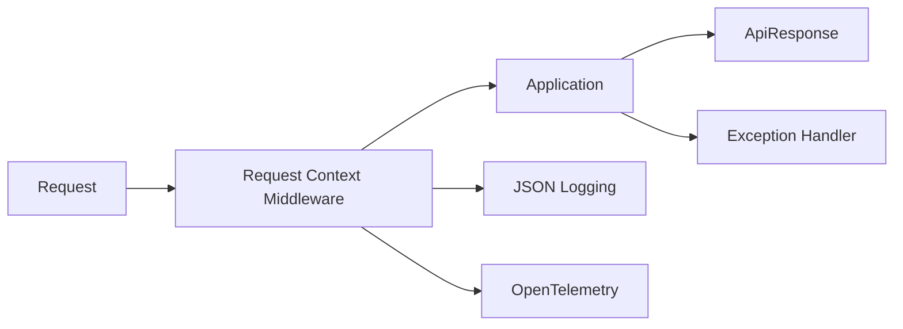

# 可观测性与 Web 公共基础 模块需求与设计简报

> **文档编号**: MOD-OBS-1.0  
> **文档版本**: v1.0  
> **创建日期**: 2026-09-10  
> **文档状态**: 设计草稿  
> **设计基线**: 《通用智能服务执行框架 V1.6 总体设计说明书》  
> **模板类型**: design-lite

## 1. 文档控制

| 项目 | 内容 |
|---|---|
| 开发负责人 | 待定 |
| 测试负责人 | 待定 |
| 首次版本 | v0.1 / 2026-09-10 |

### 1.2 修订历史

| 版本 | 日期 | 变更描述 |
|---|---|---|
| v0.1 | 2026-09-10 | 基于总体设计 V1.6 首次形成模块详细设计 |
| v0.2 | 2026-09-10 | 新增 S-03（OTel Trace 与 execution_id/conversation_id 关联）；补「归属」列；补 1.2 修订历史 |

---

## 2. 需求分析

### 2.1 需求概述

| 项目 | 内容 |
|---|---|
| 模块名称 | 可观测性与 Web 公共基础 |
| 需求类型 | 框架基础模块 |
| 业务背景 | 四个运行角色和所有 REST API 需要统一 request_id、日志、异常、Response、Trace，否则模块实现会逐渐分叉。 |
| 核心目标 | 提供统一 Web App Factory、ApiResponse、Exception Pipeline、Logging/Context 和 OTel 基础封装。 |

### 2.2 功能方案

| 功能ID | 功能名称 | 功能描述 | 优先级 | 来源 |
|---|---|---|---|---|
| FEAT-01 | 统一 Response | 普通 JSON REST 返回 code/message/data/request_id/timestamp。 | P0 | 总体设计 V1.6 |
| FEAT-02 | 统一异常 | AppError/Validation/HTTP/Unknown 统一转换。 | P0 | 总体设计 V1.6 |
| FEAT-03 | 统一日志 | JSON stdout、request_id、service、event、敏感信息脱敏。 | P0 | 总体设计 V1.6 |
| FEAT-04 | Trace | OTel trace 与 execution_id/conversation_id 关联。 | P0 | 总体设计 V1.6 |

### 2.3 范围与边界

| 类别 | 内容 |
|---|---|
| 范围（In Scope） | Web middleware、response、error taxonomy、logging、context、OTel bootstrap。 |
| 非范围（Out of Scope） | 业务日志内容、APM 后端选型、各部署环境告警阈值。 |
| 有意妥协/技术债 | OTel backend 与采样率根据部署环境确定；V1 先固定 SDK/字段 Contract。 |

### 2.4 验收条件

**正常场景**

| 场景ID | 功能ID | 优先级 | 测试层级 | 关键真实边界 | 归属 | 操作步骤 | 预期结果 |
|---|---|---|---|---|---|---|---|
| S-01 | FEAT-01 | P0 | integration | FastAPI → Middleware → Response | 本模块 | 请求普通 JSON API | 响应带统一 Envelope 与 X-Request-ID |
| S-02 | FEAT-03 | P0 | integration | Request → Log Context | 本模块 | 请求触发业务日志 | 所有日志带同一 request_id/service/event |
| S-03 | FEAT-04 | P0 | integration | Request/Worker → OTel Span → Exporter | 本模块 | 触发一次带 execution_id 的 REST 请求，并跑一次 Worker step | span 建立且与 `request_id`/`trace_id` 及 `execution_id`/`conversation_id` 关联；V1 字段 Contract 固定（不随 backend 变化）；exporter 异步/批量，不阻塞请求链路 |

**异常场景**

| 场景ID | 功能ID | 测试层级 | 关键真实边界 | 归属 | 触发条件 | 系统行为 |
|---|---|---|---|---|---|---|
| E-01 | FEAT-02 | integration | Exception Pipeline | 本模块 | Pydantic 校验失败或 AppError | 统一错误 Envelope，不返回框架堆栈 |
| E-02 | FEAT-03 | integration | Redaction | 本模块 | 日志 extra 中出现 Authorization/token/password | 字段脱敏 |

性能数值没有实测依据时统一记为“待定”，不照抄模板示例值。

---

## 3. 技术设计

> **统一数据库公共字段约束**：本模块凡新增 Framework 自建表，均必须包含 `is_deleted BOOLEAN NOT NULL DEFAULT FALSE`、`create_time TIMESTAMPTZ NOT NULL DEFAULT now()`、`update_time TIMESTAMPTZ NOT NULL DEFAULT now()`；Repository 默认过滤 `is_deleted=false`，删除默认逻辑删除。第三方自管理表（如 LangGraph Checkpointer）不修改其内部 Schema。

### 3.1 技术选型

| 类别 | 选型 | 版本 | 理由 |
|---|---|---|---|
| Web | FastAPI | 0.115+ | 统一 app factory |
| Schema | Pydantic v2 | 2.x | ApiResponse |
| Logging | Python logging JSON formatter | 3.12+ | stdout |
| Tracing | OpenTelemetry | 待定 | 跨进程追踪 |

### 3.2 架构设计

SSE/WebSocket/File Stream 不套 JSON Envelope，但建立/终止错误仍复用统一 error code 和 trace context。

### 3.3 接口设计

| 接口ID | 接口/函数 | 形态 | 说明 |
|---|---|---|---|
| LIB-01 | create_app(title,service_name) | 函数库 | 统一 FastAPI factory |
| LIB-02 | ok(data) -> ApiResponse | 函数库 | 成功响应 |
| LIB-03 | AppError | 异常类型 | 业务/应用错误 |
| LIB-04 | configure_logging(service_name,level) | 函数库 | 结构化日志 |

普通 JSON API 统一使用 `ApiResponse<T>`；函数/SPI 使用明确异常/错误码，不返回不受约束的任意错误结构。

### 3.4 性能与容量考量

| 热点路径 | 预估负载 | 潜在瓶颈 | 应对策略 | 目标值 |
|---|---|---|---|---|
| HTTP middleware / Worker log event | 待定 | 过度日志和同步 exporter | 结构化字段最小化、异步/批量 exporter、采样策略 | 待定 |

---

## 4. 风险与依赖

### 4.1 项目依赖

| 依赖模块 | 依赖内容 | 风险等级 |
|---|---|---|
| FastAPI | Web | 中 |
| OTel Collector | Trace/Metrics | 中 |
| Runtime Context | request/trace ids | 低 |

### 4.2 风险识别

| 风险ID | 描述 | 影响 | 应对措施 | 验证场景 |
|---|---|---|---|---|
| RISK-01 | 模块手写不同 Response | 前端/调用方分支增加 | Architecture test 禁止裸错误结构 | S-01 |
| RISK-02 | 日志记录敏感 payload | 安全/隐私泄漏 | redaction + 代码规范 + 测试 | E-02 |

---

## Spec Compliance Matrix

| Spec/Rule | enforcement | 设计影响 | 设计落点 | 验证场景 | verifier | 状态 |
|---|---|---|---|---|---|---|
| framework#RULE-BE-001 | required | 统一 Response | §3.2/§3.3 | S-01/E-01 | `test_response.py` | applied |
| framework#RULE-BE-002 | required | 统一日志/request_id/脱敏 | §3.2/§3.3 | S-02/E-02 | `test_redaction.py` | applied |

---

## 附录：术语表

| 术语 | 定义 |
|---|---|
| Adapter | Framework Contract 的基础设施实现 |
| SoT | 权威事实源 |
| OTel | OpenTelemetry |
| Envelope | 统一 API 响应外壳 |

---
