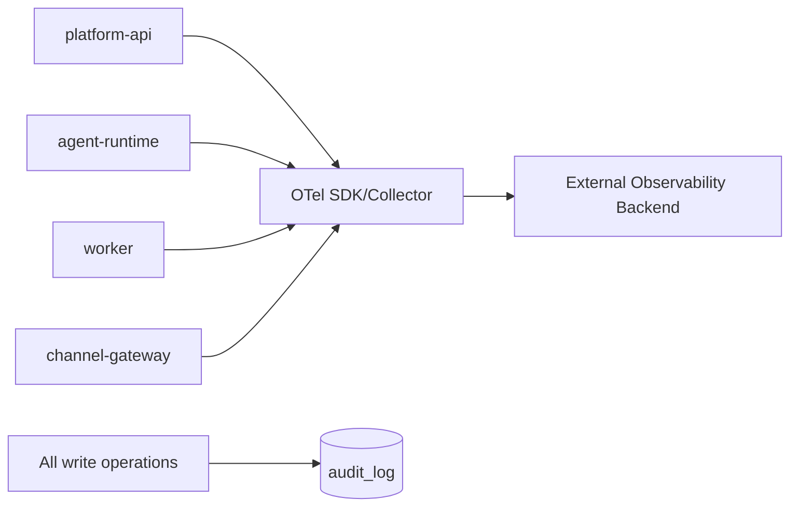

<!-- V1.11 module-split metadata -->
> **文档分档**：`Full`（模板 `design-full.md`）  
> **分档理由**：拥有 audit_log 与公共 API，属于跨切面架构模块  
> **文档边界**：本文件是该模块唯一详细设计事实源；DB Owner 与接口 Owner 必须落在本模块，不允许在其他模块重复定义。  
> **拆分原则**：仅按可独立评审/编码/验收的一级模块拆分；不按单表/单接口继续碎片化。

# 可观测性与 Web 公共基础 模块需求与设计一体化文档

> **文档编号**: MOD-OBS-V1.11 模块分档拆分版
> **文档版本**: V1.11 模块分档拆分版
> **创建日期**: 2026-09-11
> **文档状态**: 设计基线草案（待仓库 Spec Context 绑定后进入正式评审）
> **模板**: `design-full.md`；生成流程按 `cf-task:align` 的复杂后端/架构模块路径执行。
> **上游基线**: V1.8 完整总体设计 + V6 完整 Playbook + Console V0.8 Final。


**评审边界说明**：
- 第 2 章是需求基线（What），禁止实现阶段自行改变领域语义；
- 第 3-4 章是设计基线（How），DB 与每个接口必须以本文为准；
- `Spec Compliance Matrix` 当前依据设计基线生成，因本轮未提供仓库 `spec-context.yml` 与代码目录，**不得声称已通过 cf-task:align 的 repo Spec Gate**；落码前必须在真实仓库执行 `refresh/catalog/bind`。


## 1. 文档控制

### 1.1 责任人

| 角色 | 姓名 | 职责范围 |
|---|---|---|
| 产品/架构负责人 | 待定 | 需求定义、领域边界、与总设/Playbook 一致性 |
| 开发负责人 | 待定 | 技术方案、DB/API、实现 |
| 测试负责人 | 待定 | S/E/B 场景、E2E Gate |
| 安全/运维 | 待定 | Secret、隔离、发布、监控 |

### 1.2 修订历史

| 版本 | 日期 | 作者 | 变更描述 |
|---|---|---|---|
| V1.11 模块分档拆分版 | 2026-09-11 | ChatGPT / 待项目负责人确认 | 按 cf-task:align + design-full 从最新完整总设/Playbook/交互稿重新生成；细化 DB 与全部接口 |

## 2. 需求分析

### 2.1 需求概述

| 项目 | 内容 |
|---|---|
| 模块名称 | 可观测性与 Web 公共基础 |
| 模块ID | MOD-OBS |
| 所属系统/产品线 | Fluxion 通用智能服务执行框架 |
| 需求类型 | 中大型功能 / 架构演进 |
| 业务背景 | Admin 需要从 Execution 定位用户/服务/版本/步骤/能力/重试/投递；同时日志指标 Trace 必须贯穿四运行角色并避免敏感信息/高基数指标。 |
| 核心目标 | 统一 Audit、structured logging、Metrics、OTel Trace、health/readiness、request/trace/execution correlation 和查询接口。 |

### 2.2 痛点与价值

| 维度 | 内容 |
|---|---|
| 目标用户 | Admin/运维/开发/测试；所有 Runtime roles |
| 当前问题 | 如果每模块各自打印日志或用 execution_id/user_id 做 metrics label，会造成不可检索/高基数；没有审计无法解释配置/授权变化。 |
| 业务影响 | 故障定位慢、合规风险、监控成本失控。 |
| 预期价值 | 按一个 execution_id/request_id 可追完整链路，关键写操作可审计。 |

### 2.3 功能方案

#### 2.3.1 功能清单

| 功能ID | 功能名称 | 功能描述 | 优先级 | 来源 |
|---|---|---|---|---|
| FEAT-OBS-01 | Structured Log | 统一字段/脱敏。 | P0 | DFX |
| FEAT-OBS-02 | OTel Trace | 跨 API/Runtime/Worker/Gateway/Provider。 | P0 | DFX |
| FEAT-OBS-03 | Metrics | 低基数 RED/USE/Execution 指标。 | P0 | DFX |
| FEAT-OBS-04 | Audit Log | 配置/授权/发布/Secret refs 操作审计。 | P0 | 治理 |
| FEAT-OBS-05 | Health | live/ready/metrics。 | P0 | K8S |

### 2.4 范围与边界

| 类别 | 内容 |
|---|---|
| 范围（In Scope） | audit_log、OTel/log/metrics contract、health endpoints、error detail refs、correlation IDs。 |
| 非范围（Out of Scope） | 自建 APM/日志存储后端、Console 系统状态大盘、PG/Redis 运维管理。 |
| 前置假设 | 上游总设、公共 DB/API 规范、外部基础设施可用 |
| 有意妥协 / 技术债 | 无；未来扩展必须有真实旅程驱动 |

### 2.5 验收条件

#### 2.5.1 业务规则与约束

| ID | 类型 | 描述 | 验证场景 |
|---|---|---|---|
| RULE-OBS-01 | 关联 | 请求至少 request_id/trace_id；Execution 路径还含 execution_id/step_id。 | S-OBS-01 |
| RULE-OBS-02 | 脱敏 | 日志/trace/audit 禁止 Secret/password/token/完整 credential。 | S-OBS-02 |
| RULE-OBS-03 | 指标 | Prometheus labels 禁止 user_id/execution_id 等无界高基数字段。 | S-OBS-03 |
| RULE-OBS-04 | 审计 | 关键配置写/授权/发布/Skill 导入/绑定码/Credential 操作写 audit。 | S-OBS-04 |

#### 2.5.2 功能验收场景

**正常场景**

| 场景ID | 功能ID | 优先级 | 测试层级 | 关键真实边界 | 归属 | 前置条件 | 操作步骤 | 预期结果 |
|---|---|---|---|---|---|---|---|---|
| S-OBS-04 | FEAT-OBS-03 | P1 | integration | 关键写操作落审计 | 本模块 | 执行发布/授权/导入/绑定码/凭据操作 | 查询 audit-logs | 每类操作均产生 audit 记录且不含 Secret |
| S-OBS-01 | FEAT-OBS-02 | P0 | E2E | Gateway→Runtime→Worker→Provider→OTel | 本模块 | 一次异步服务 | 执行完成 | 可按 trace/execution 关联所有 span |
| S-OBS-02 | FEAT-OBS-04 | P0 | E2E | Admin API→audit_log | 本模块 | 修改 Agent grant | 提交 | 记录 actor/action/resource/before-after digest |
| S-OBS-03 | FEAT-OBS-05 | P0 | integration | K8S probe→role | 本模块 | 各角色启动 | 调用 live/ready | 依赖状态正确反映 readiness |

**异常场景**

| 场景ID | 功能ID | 测试层级 | 关键真实边界 | 归属 | 触发条件 | 系统行为 | 用户感知 |
|---|---|---|---|---|---|---|---|
| E-OBS-01 | FEAT-OBS-03 | integration | metrics scrape | 本模块 | 大量用户/execution | 抓 metrics | label 集合不按 ID 线性增长 |
| E-OBS-02 | FEAT-OBS-01 | integration | log capture | 本模块 | SecretProvider/credential 错误 | 记录日志 | 无明文 Secret |

#### 2.5.3 非功能指标

| 指标ID | 指标名称 | 目标值 | 测量方法 |
|---|---|---|---|
| NFR-REL-01 | 可靠执行 | 不得因单 Runtime/Worker 进程退出丢失权威状态 | SIGKILL/E2E |
| NFR-SEC-01 | 可信身份 | LLM/客户端不得覆盖 tenant/actor/secret | 安全测试 |
| NFR-OBS-01 | 可追踪 | 关键路径可按 request_id/trace_id/execution_id 定位 | 集成/E2E |

## 3. 技术设计

### 3.1 方案选型

#### 3.1.1 关键决策记录

| 决策点 | 选择 | 被否决项 | 理由 | 可逆性 |
|---|---|---|---|---|
| Tracing | OpenTelemetry | 自研 Trace store | 标准生态 | 易 |
| Audit | append-only DB metadata | 只靠日志 | 查询/审计稳定 | 中 |
| 运维 UI | 不做系统设置/基础设施状态页 | Console 管 PG/Redis | 职责归运维系统 | 易 |

#### 3.1.2 技术栈

| 类别 | 选型 | 版本 | 选型理由 |
|---|---|---|---|
| 语言 | Python | 3.12+（仓库实际版本落码前确认） | 与 Agent/LLM 生态一致 |
| Web/API | FastAPI + Pydantic | 仓库实际版本确认 | 类型契约与异步 IO |
| ORM | SQLAlchemy 2 Async | 仓库实际版本确认 | 异步 PostgreSQL |
| 数据库 | PostgreSQL | 外部部署 | 业务 SoT |

### 3.2 架构设计



#### 3.2.1 模块职责分层

| 层级 | 职责 | 禁止事项 |
|---|---|---|
| Handler/API | 协议解析、DTO、权限入口、统一错误映射 | 业务逻辑/直接 SQL |
| Application Service | 用例编排、事务边界、领域校验 | 依赖具体 Web 框架 |
| Domain | 领域对象/规则 | 基础设施依赖 |
| Repository/Port | 持久化/外部能力抽象 | 泄露 Secret/跨领域修改 |
| Adapter | PostgreSQL/HTTP/MCP 等实现 | 改变领域语义 |

#### 3.2.2 外部依赖清单

| 外部系统/模块 | 依赖类型 | 协议/接口 | 超时/一致性 | 降级策略 |
|---|---|---|---|---|
| OTel Collector/Backend | Telemetry | OTLP | best-effort | Telemetry failure 不应让业务失败 |
| PostgreSQL | Audit SoT | SQL | 强 | 关键写与 audit 可按事务/outbox策略权衡 |
| K8S | Probe | HTTP | 低延迟 | readiness 控制流量 |

### 3.3 数据设计

#### 3.3.1 表清单

| 表名 | 职责 | 所有权 |
|---|---|---|
| audit_log | 不可变审计记录，覆盖配置写、授权、发布、Credential/Channel/Skill 导入和关键执行操作。 | 可观测性与 Web 公共基础 |

#### 表 `audit_log`

**职责**：不可变审计记录，覆盖配置写、授权、发布、Credential/Channel/Skill 导入和关键执行操作。

| 字段名 | 类型 | 可空 | 默认值 | 索引 | 说明 |
|---|---|---|---|---|---|
| tenant_id | UUID | N |  | IDX | 租户 |
| actor_user_id | UUID | Y |  | IDX | 系统动作可为空 |
| action | VARCHAR(128) | N |  | IDX | 动作 |
| resource_type | VARCHAR(128) | N |  | IDX | 资源类型 |
| resource_id | VARCHAR(256) | Y |  | IDX | 资源 ID |
| request_id | VARCHAR(128) | Y |  | IDX | 请求关联 |
| trace_id | VARCHAR(128) | Y |  | IDX | Trace |
| before_digest | JSONB | N | {} |  | 脱敏前值摘要 |
| after_digest | JSONB | N | {} |  | 脱敏后值摘要 |
| details | JSONB | N | {} |  | 事件明细（脱敏后）；AUDIT-API-01 行展开即投影本字段 |
| execution_id | UUID | Y |  | IDX | 关联 Execution（可空：发布/授权/凭据类审计不关联执行；前端无此值时不显示跳转） |
| result | VARCHAR(32) | N | SUCCESS | IDX | SUCCESS/DENIED/FAILED |
| occurred_at | TIMESTAMPTZ | N | CURRENT_TIMESTAMP | IDX | 发生时间 |
| id | UUID | N | gen_random_uuid() | PK | 主键 |
| is_deleted | BOOLEAN | N | FALSE | IDX | 软删除标记；默认查询必须过滤 FALSE |
| create_time | TIMESTAMPTZ | N | CURRENT_TIMESTAMP |  | 创建时间 |
| update_time | TIMESTAMPTZ | N | CURRENT_TIMESTAMP |  | 更新时间 |

**约束**

- 禁止记录明文 Secret/password/token
- append-only

**索引设计**

| 索引名 | 类型 | 字段 | 使用场景 |
|---|---|---|---|
| idx_audit_resource | BTREE | tenant_id,resource_type,resource_id,occurred_at DESC | 资源审计 |
| idx_audit_actor | BTREE | tenant_id,actor_user_id,occurred_at DESC | 用户审计 |
| idx_audit_request | BTREE | tenant_id,request_id | 请求关联 |

**不可变约束**：创建后禁止业务 UPDATE/DELETE；如需演进创建新记录并更新上层 current 指针。

#### 3.3.2 ER 图

本模块没有需要单独表达的多表 ER；跨模块关系见《数据库表所有权与字段索引》。

#### 3.3.3 数据一致性与软删除规则

- 所有 Framework 自建可变表使用 `is_deleted/create_time/update_time`；查询默认过滤 `is_deleted=false`。
- FK 只引用同一租户可见对象；跨租户引用必须在 Application Service 拒绝。
- Secret/Token/Password 不落业务表明文，只保存 `secret_ref/credential_ref`。
- 不可变 Release/Snapshot/Artifact 使用 append-only；需要更新时新建记录。
- `revision` 用于 direct-effect 配置的乐观并发和审计，不等同于发布版本。

### 3.4 接口设计

#### 3.4.1 接口清单

| 接口ID | 名称 | 形态 | 方法/签名 | 路径/用途 |
|---|---|---|---|---|
| OPS-API-01 | Liveness | HTTP | GET | /health/live |
| OPS-API-02 | Readiness | HTTP | GET | /health/ready |
| OPS-API-03 | Metrics | HTTP | GET | /metrics |
| OPS-API-04 | Console 概览聚合统计 | HTTP | GET | /api/v1/console/overview/stats |
| AUDIT-API-01 | 审计日志查询 | HTTP | GET | /api/v1/audit-logs |

#### OPS-API-01: Liveness

**入口类型**：HTTP

**契约**：`GET /health/live`

**认证/授权**：无业务认证；仅部署网络暴露

**请求体**：无。

**响应 data**

| 字段 | 类型 | 说明 |
|---|---|---|
| status | string | ok |

**响应示例**

```json
{
  "code": 0,
  "message": "success",
  "data": {
    "status": "<status>"
  },
  "request_id": "req_xxx"
}
```

**错误码**

仅使用公共错误码。

**处理逻辑**

```text
只判断进程 event loop/主线程存活；不依赖外部系统。
```

#### OPS-API-02: Readiness

**入口类型**：HTTP

**契约**：`GET /health/ready`

**认证/授权**：集群内/受控

**请求体**：无。

**响应 data**

| 字段 | 类型 | 说明 |
|---|---|---|
| status | string | ready/not_ready |
| checks | object | db/config/required provider readiness |

**响应示例**

```json
{
  "code": 0,
  "message": "success",
  "data": {
    "status": "<status>",
    "checks": {}
  },
  "request_id": "req_xxx"
}
```

**错误码**

仅使用公共错误码。

**处理逻辑**

```text
检查角色必须依赖；不得因为可选 Integration 故障让无关角色全局不 ready。
```

#### OPS-API-03: Metrics

**入口类型**：HTTP

**契约**：`GET /metrics`

**认证/授权**：集群内/受控

**请求体**：无。

**响应 data**

| 字段 | 类型 | 说明 |
|---|---|---|
| prometheus_text | string | Prometheus exposition |

**响应示例**

```json
{
  "code": 0,
  "message": "success",
  "data": {
    "prometheus_text": "<prometheus_text>"
  },
  "request_id": "req_xxx"
}
```

**错误码**

仅使用公共错误码。

**处理逻辑**

```text
暴露低基数指标；禁止 user_id/execution_id 作为无限基数 label。
```

#### OPS-API-04: Console 概览聚合统计

**入口类型**：HTTP

**契约**：`GET /api/v1/console/overview/stats`

**认证/授权**：登录会话（中间件解析，RULE-API-02）；Builder + Admin（ADR-021）

**请求体**：无。

**响应 data**

| 字段 | 类型 | 说明 |
|---|---|---|
| service_count / agent_count / skill_count / capability_count | int | 各领域对象数量 |
| today_execution_total / today_execution_failed / running_execution_count | int | 今日执行总数/失败数/当前运行中 |
| today_human_timeout | int | 今日人工超时失败数，独立列示 |
| pending_publish_draft_count | int | 待发布 Draft 数 |
| recent_executions | list | 最近执行引用（id/service/状态/时间，复用 EXE-API-01 摘要结构） |

**处理逻辑**

```text
对各领域表做 COUNT（过滤 is_deleted）；执行聚合仅 execution_source=FORMAL。今日按 tenant 配置时区的 [日初,次日初) 转 UTC 过滤；running 包含 RUNNING/WAITING/WAITING_HUMAN/RETRY_WAIT/CANCELLING，失败分类 HUMAN_TIMEOUT 单列 today_human_timeout。recent_executions 复用完整 ExecutionSummary；pending_publish_draft_count 以 draft hash 与 current release source hash 不同或未发布计数。短 TTL 缓存且跨租户隔离。
```

#### AUDIT-API-01: 审计日志查询

**入口类型**：HTTP

**契约**：`GET /api/v1/audit-logs`

**认证/授权**：Admin

**Query 参数**

| 参数 | 类型 | 必填 | 说明 |
|---|---|---|---|
| page | integer | N | 页码，从 1 开始；默认 1 |
| page_size | integer | N | 每页条数；默认 20，最大 100 |
| actor_user_id | uuid | N | 操作者 |
| resource_type | string | N | 资源类型 |
| resource_id | string | N | 资源 |
| action | string | N | 动作 |
| from | datetime | N | 时间 |
| to | datetime | N | 时间 |

**请求体**：无。

**响应 data**

| 字段 | 类型 | 说明 |
|---|---|---|
| items | array<AuditLogView> | 脱敏审计 |
| total | integer | 总数 |

**AuditLogView**：time、actor（用户名/标识）、action、resource_type、resource_id、result、trace_id、execution_id（可空，空则前端不显示跳转）、details（行展开投影 audit_log.details，已脱敏）。

**响应示例**

```json
{
  "code": 0,
  "message": "success",
  "data": {
    "items": [],
    "total": 1
  },
  "request_id": "req_xxx"
}
```

**错误码**

仅使用公共错误码。

**处理逻辑**

```text
时间窗口必须有限；走 tenant/resource/actor/time 索引分页；不返回 Secret。
```

### 3.5 质量实现方案

#### 3.5.1 性能与容量

| 热点路径 | 负载量级 | 潜在瓶颈 | 实现方案 | 目标值 |
|---|---|---|---|---|
| Audit query | 历史量增长 | 时间范围大 | 强制 tenant+时间窗+分页+组合索引 | Admin 低频 |
| Metrics | 所有请求 | 高基数 | 固定 label taxonomy，ID 放 exemplars/log | Prom scrape 稳定 |

#### 3.5.2 可靠性

所有外部调用有 deadline；重试有界且只对可安全重试错误；业务权威状态外置；进程崩溃后能恢复或明确失败。

#### 3.5.3 安全性

Observability 本身属于敏感面：payload 默认不全量记录；错误详情可放受控 ObjectStore ref；审计访问仅 Admin。

#### 3.5.4 可观测性

日志、Metrics、Trace 统一关联 request_id/trace_id；Execution 路径附带 execution_id/step_id；错误码稳定。

#### 3.5.5 测试策略

Domain/validator 单测；Repository/Provider 真 PG/外部 Stub 集成；核心用户旅程做 E2E；安全和崩溃恢复不得只靠 mock。

## 4. 部署与运维

### 4.1 部署架构

随其所属运行角色部署；PostgreSQL/Redis/Object Store/Secret Provider/OTel Backend 均为外部依赖，不打包进应用 Compose/Helm。

### 4.2 发布与回滚

DB 变更使用向前兼容迁移；应用支持滚动回滚；若涉及不可变 Release/Artifact，只切换 current 指针，不覆盖历史。

### 4.3 监控告警

至少监控请求/调用量、错误率、延迟、外部依赖失败、关键队列/执行积压和配置加载失败；阈值由环境基线确定。

### 4.4 数据迁移

若无历史生产数据则直接按新 Schema 建表；若已有部署，使用 Alembic 等可回滚/可前滚迁移，禁止运行时隐式改表。

## 5. 风险与依赖

| 风险ID | 描述 | 影响 | 应对措施 | 验证场景 |
|---|---|---|---|---|
| RISK-OBS-01 | 跨模块边界在实现中被绕过 | 形成双事实源/不可测试 | Architecture Gate + code review | E2E/静态检查 |

## 6. 需求追溯矩阵

| 功能ID | 接口ID | 验证场景 | 测试层级 | 状态 |
|---|---|---|---|---|
| FEAT-OBS-01 | OPS-API-01, OPS-API-02 | E-OBS-02 | E2E/integration | 待实现/评审 |
| FEAT-OBS-02 | OPS-API-02, OPS-API-03 | S-OBS-01 | E2E/integration | 待实现/评审 |
| FEAT-OBS-03 | OPS-API-03, AUDIT-API-01 | E-OBS-01 | E2E/integration | 待实现/评审 |
| FEAT-OBS-04 | AUDIT-API-01 | S-OBS-02 | E2E/integration | 待实现/评审 |
| FEAT-OBS-05 |  | S-OBS-03 | E2E/integration | 待实现/评审 |

## Spec Compliance Matrix

| Spec/Rule | enforcement | 设计影响 | 设计落点 | 验证场景 | 状态/N/A 理由 |
|---|---|---|---|---|---|
| DESIGN/OBS#RULE-OBS-01 | design-baseline | 约束实现与验收 | §2.5 RULE-OBS-01 / §3 | S/E/B 场景 | applied；仓库 spec-context 待绑定 |
| DESIGN/OBS#RULE-OBS-02 | design-baseline | 约束实现与验收 | §2.5 RULE-OBS-02 / §3 | S/E/B 场景 | applied；仓库 spec-context 待绑定 |
| DESIGN/OBS#RULE-OBS-03 | design-baseline | 约束实现与验收 | §2.5 RULE-OBS-03 / §3 | S/E/B 场景 | applied；仓库 spec-context 待绑定 |
| DESIGN/OBS#RULE-OBS-04 | design-baseline | 约束实现与验收 | §2.5 RULE-OBS-04 / §3 | S/E/B 场景 | applied；仓库 spec-context 待绑定 |

## 附录 A：接口与 DB 落码检查清单

- [ ] 每个 HTTP Endpoint 已有 DTO、鉴权、错误码、处理逻辑、测试。
- [ ] 每个 Library/CLI 接口有稳定签名和异常语义。
- [ ] 每张表字段、类型、NULL、默认值、唯一约束、索引、软删除策略已落实迁移。
- [ ] Request/Response 字段不接受客户端传入可信 tenant/actor/credential。
- [ ] 列表接口使用服务端分页，避免无界返回。
- [ ] 修改类接口有 revision/冲突语义；高风险/副作用路径满足幂等和审计。
- [ ] 仓库 Spec Context 已 refresh/catalog/bind 且 required Rules 映射到 S/E/B verifier。
