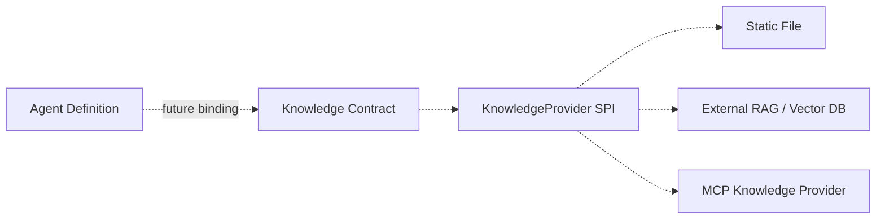

<!-- V1.11 module-split metadata -->
> **文档分档**：`Lite`（模板 `design-lite.md`）  
> **分档理由**：明确规划阶段，不冻结生产 DB/API  
> **文档边界**：本文件是该模块唯一详细设计事实源；DB Owner 与接口 Owner 必须落在本模块，不允许在其他模块重复定义。  
> **拆分原则**：仅按可独立评审/编码/验收的一级模块拆分；不按单表/单接口继续碎片化。

# Knowledge 规划 模块需求与设计简报

> **文档编号**: MOD-KNOW-V1.11 模块分档拆分版
> **文档版本**: V1.11 模块分档拆分版
> **创建日期**: 2026-09-11
> **文档状态**: 规划中 / 未冻结 DB 与 API
> **模板**: `design-lite.md`

**模板选择说明**：Knowledge 在当前产品结论中明确为“规划项”，没有批准 Provider、持久化模型、权限、Console CRUD 或 Runtime Contract。`cf-task:align` 要求不适用维度不强行展开，因此本模块使用 Lite 模板，并明确禁止为了文档完整度提前冻结生产 DB/API。

## 1. 文档控制

### 1.1 责任人

| 角色 | 姓名 | 职责范围 |
|---|---|---|
| 产品/架构负责人 | 待定 | 确认真实 Knowledge 用户旅程后再升级为 Full Design |
| 开发负责人 | 待定 | 仅维护扩展边界，不实现空转平台 |

### 1.2 修订历史

| 版本 | 日期 | 作者 | 变更描述 |
|---|---|---|---|
| V1.11 模块分档拆分版 | 2026-09-11 | ChatGPT / 待确认 | 按 design-lite 重生成；保持 Knowledge 后置决策 |

## 2. 需求分析

### 2.1 需求概述

| 项目 | 内容 |
|---|---|
| 模块名称 | Knowledge（规划） |
| 需求类型 | 规划 / 预留扩展点 |
| 业务背景 | 总体设计需要允许 Agent 未来绑定专业知识源，但当前没有足够真实用户旅程来决定本地文件、外部知识库、RAG、MCP Knowledge Provider 的产品模型。 |
| 核心目标 | 只固定“未来通过 KnowledgeProvider 扩展且不污染 Agent Runtime”这一边界，不冻结表、API、Console 字段。 |

### 2.2 功能方案

| 功能ID | 功能名称 | 功能描述 | 优先级 | 来源 |
|---|---|---|---|---|
| FEAT-KNOW-01 | KnowledgeProvider SPI 占位 | 定义概念边界，具体签名待真实 provider 旅程。 | P2 | 总体设计扩展性 |
| FEAT-KNOW-02 | Console 规划入口 | 菜单显示“知识库（规划）”，不提供 CRUD。 | P2 | V0.8 交互稿 |

### 2.3 范围与边界

| 类别 | 内容 |
|---|---|
| 范围（In Scope） | 概念边界、未来 Provider 类型候选、Agent 绑定预留。 |
| 非范围（Out of Scope） | 生产 DB、API、向量库 schema、文档上传/切片/Embedding、权限模型、索引重建、Provider Marketplace。 |
| 有意妥协 / 技术债 | 不是技术债，而是明确的阶段性不冻结；在真实 Knowledge 旅程确认前不得编码空壳 CRUD。 |

### 2.4 验收条件

| 场景ID | 功能ID | 优先级 | 测试层级 | 关键真实边界 | 归属 | 操作步骤 | 预期结果 |
|---|---|---|---|---|---|---|---|
| S-KNOW-01 | FEAT-KNOW-02 | P2 | E2E | Console Router/UI | 本模块 | 进入知识库菜单 | 显示规划说明且无新增/编辑/删除操作 |

| 场景ID | 功能ID | 测试层级 | 关键真实边界 | 触发条件 | 系统行为 |
|---|---|---|---|---|---|
| E-KNOW-01 | FEAT-KNOW-01 | manual | 设计评审 | 开发提出新增 knowledge_* 表/API | 要求先补真实用户旅程并升级 design-full | 阻止空转实现 |

## 3. 技术设计

### 3.1 技术选型

当前不选定向量数据库、Embedding 模型、RAG 框架或 Provider 协议。唯一约束：未来实现必须通过稳定 `KnowledgeProvider` Port，不允许 Agent Runtime 直接绑定某个向量数据库 SDK。

### 3.2 架构设计

### 3.3 接口设计

**当前无已批准的生产 HTTP/CLI/Library 接口。** 这是设计结论，不是文档缺失。后续如果确认 Knowledge 用户旅程，应重新运行 `cf-task:align`，切换 `design-full.md`，届时必须细化：Provider Contract、文档/Source/Chunk 数据模型、索引/权限、检索 API、Agent 绑定 API、错误码和 E2E。

### 3.4 性能与容量考量

未选型，不编造检索 P95、Chunk 数、Embedding TPS。真实实现前必须基于文档规模/并发/召回目标补齐。

## 4. 风险与依赖

| 风险ID | 描述 | 影响 | 应对措施 | 验证场景 |
|---|---|---|---|---|
| RISK-KNOW-01 | 为了“页面完整”提前实现知识库 CRUD/RAG schema | 中 | 保持规划态；真实旅程前不冻结 DB/API | E-KNOW-01 |
| RISK-KNOW-02 | Agent Runtime 直接依赖具体向量库 | 中 | 未来强制 KnowledgeProvider Port | 设计评审 |

## Spec Compliance Matrix

| Spec/Rule | enforcement | 设计影响 | 设计落点 | 验证场景 | 状态/N/A 理由 |
|---|---|---|---|---|---|
| repo spec-context.yml | required | 编码前需绑定 | 本文当前规划态 | E-KNOW-01 | pending-bind；本轮没有仓库 Spec Context，且模块未进入编码范围 |

*文档结束*
