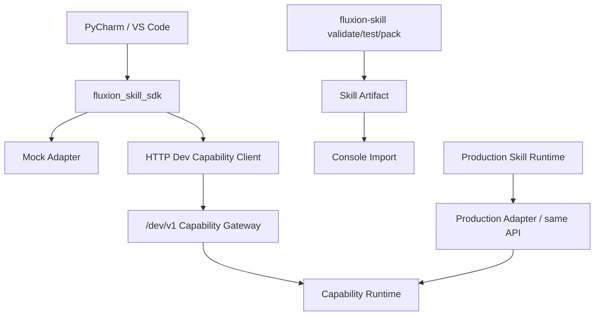

<!-- V1.11 module-split metadata -->
> **文档分档**：`Full`（模板 `design-full.md`）  
> **分档理由**：SDK/CLI/Mock/Dev Gateway/生产 Runtime 多边界  
> **文档边界**：本文件是该模块唯一详细设计事实源；DB Owner 与接口 Owner 必须落在本模块，不允许在其他模块重复定义。  
> **拆分原则**：仅按可独立评审/编码/验收的一级模块拆分；不按单表/单接口继续碎片化。

# Skill SDK与离线开发 模块需求与设计一体化文档

> **文档编号**: MOD-SDK-V1.11 模块分档拆分版
> **文档版本**: V1.11 模块分档拆分版
> **创建日期**: 2026-09-11
> **文档状态**: 设计基线草案（待仓库 Spec Context 绑定后进入正式评审）
> **模板**: `design-full.md`；生成流程按 `cf-task:align` 的复杂后端/架构模块路径执行。
> **上游基线**: V1.8 完整总体设计 + V6 完整 Playbook + Console V0.8 Final。


**评审边界说明**：
- 第 2 章是需求基线（What），禁止实现阶段自行改变领域语义；
- 第 3-4 章是设计基线（How），DB 与每个接口必须以本文为准；
- `Spec Compliance Matrix` 当前依据设计基线生成，因本轮未提供仓库 `spec-context.yml` 与代码目录，**不得声称已通过 cf-task:align 的 repo Spec Gate**；落码前必须在真实仓库执行 `refresh/catalog/bind`。


## 1. 文档控制

### 1.1 责任人

| 角色 | 姓名 | 职责范围 |
|---|---|---|
| 产品/架构负责人 | 待定 | 需求定义、领域边界、与总设/Playbook 一致性 |
| 开发负责人 | 待定 | 技术方案、DB/API、实现 |
| 测试负责人 | 待定 | S/E/B 场景、E2E Gate |
| 安全/运维 | 待定 | Secret、隔离、发布、监控 |

### 1.2 修订历史

| 版本 | 日期 | 作者 | 变更描述 |
|---|---|---|---|
| V1.11 模块分档拆分版 | 2026-09-11 | ChatGPT / 待项目负责人确认 | 按 cf-task:align + design-full 从最新完整总设/Playbook/交互稿重新生成；细化 DB 与全部接口 |

## 2. 需求分析

### 2.1 需求概述

| 项目 | 内容 |
|---|---|
| 模块名称 | Skill SDK与离线开发 |
| 模块ID | MOD-SDK |
| 所属系统/产品线 | Fluxion 通用智能服务执行框架 |
| 需求类型 | 中大型功能 / 架构演进 |
| 业务背景 | SOP 开发人员继续在 PyCharm/VS Code 按传统 Python 方式开发 Skill；平台提供稳定 SDK、Mock 和 HTTP Dev Capability Gateway 进行线下验证。 |
| 核心目标 | 定义同仓独立 Python Public Package、SkillContext/CapabilityClient、Mock/Dev/Production 三种适配、CLI validate/test/pack 和 Dev Gateway 全部接口。 |

### 2.2 痛点与价值

| 维度 | 内容 |
|---|---|
| 目标用户 | SOP/Skill Developer、Framework Maintainer |
| 当前问题 | 如果 Skill 直接 import Runtime 内部代码，框架重构会批量破坏 Skill；如果本地验证必须启动整个平台，上手成本仍高。 |
| 业务影响 | 开发效率低、Skill 与实现强耦合、测试环境难复现生产语义。 |
| 预期价值 | Skill 代码一份：本地 Mock、Dev HTTP 联调、导入平台生产运行无需改代码。 |

### 2.3 功能方案

#### 2.3.1 功能清单

| 功能ID | 功能名称 | 功能描述 | 优先级 | 来源 |
|---|---|---|---|---|
| FEAT-SDK-01 | Public Python Package | fluxion_skill_sdk 稳定 API。 | P0 | 最新讨论 |
| FEAT-SDK-02 | MockSkillContext | 本地单测/断点。 | P0 | 开发体验 |
| FEAT-SDK-03 | HTTP Dev Client | 调用 Dev Capability Gateway。 | P0 | 真实联调 |
| FEAT-SDK-04 | Production Adapter | Runtime 注入同语义 Context。 | P0 | 一致性 |
| FEAT-SDK-05 | CLI Validate/Test/Pack | 标准开发工具链。 | P0 | 开发规范 |
| FEAT-SDK-06 | SDK Versioning | skill.yaml sdk_version 兼容性。 | P0 | Artifact 校验 |

### 2.4 范围与边界

| 类别 | 内容 |
|---|---|
| 范围（In Scope） | SDK public surface、testing mocks、HTTP dev adapter、CLI、version compatibility、developer auth/scope。 |
| 非范围（Out of Scope） | 独立 PyPI 发布（V1 不需要）、Skill 在线编辑、业务 Capability 实现、Runtime 私有 API 暴露。 |
| 前置假设 | 上游总设、公共 DB/API 规范、外部基础设施可用 |
| 有意妥协 / 技术债 | 无；未来扩展必须有真实旅程驱动 |

### 2.5 验收条件

#### 2.5.1 业务规则与约束

| ID | 类型 | 描述 | 验证场景 |
|---|---|---|---|
| RULE-SDK-01 | 包边界 | Skill 只能依赖 fluxion_skill_sdk Public API，不 import runtime/domain/repository/infrastructure 私有模块。 | S-SDK-01 |
| RULE-SDK-02 | 语义一致 | Mock/HTTP Dev/Production 的 ctx.capability.call 语义一致。 | S-SDK-02 |
| RULE-SDK-03 | Dev 安全 | Dev Gateway 只在开发环境/受控网络暴露，Developer token 不等于生产用户 Secret。 | S-SDK-03 |
| RULE-SDK-04 | 版本 | skill.yaml 声明 sdk_version；导入时校验兼容。 | S-SDK-04 |
| RULE-SDK-05 | 打包 | pack 前必须 validate；产物 deterministic checksum。 | S-SDK-05 |

#### 2.5.2 功能验收场景

**正常场景**

| 场景ID | 功能ID | 优先级 | 测试层级 | 关键真实边界 | 归属 | 前置条件 | 操作步骤 | 预期结果 |
|---|---|---|---|---|---|---|---|---|
| S-SDK-05 | FEAT-SDK-03 | P1 | integration | pack 前 validate + 确定性 checksum | 本模块 | 合法 Skill 工程 | 两次 pack 相同内容 | 两次均先 validate；checksum 一致 |
| S-SDK-01 | FEAT-SDK-02 | P0 | unit | PyCharm→MockSkillContext | 本模块 | Capability mock 已配置 | 运行 Skill pytest | 断点/结果可验证，无平台依赖 |
| S-SDK-02 | FEAT-SDK-03 | P0 | E2E | PyCharm→HTTP Dev Gateway→Capability Runtime | 本模块 | Dev token/test user | ctx.capability.call | 真实认证/分页/服务发现语义与生产一致 |
| S-SDK-03 | FEAT-SDK-05 | P0 | integration | CLI→filesystem | 本模块 | 合法 Skill 目录 | validate/test/pack | 得到可导入 zip+checksum |
| S-SDK-04 | FEAT-SDK-04 | P0 | E2E | Imported Skill→Runtime | 后置 → 模块 08 | 同一 Skill zip | Agent 执行 | 无需修改代码，Production adapter 生效 |

**异常场景**

| 场景ID | 功能ID | 测试层级 | 关键真实边界 | 归属 | 触发条件 | 系统行为 | 用户感知 |
|---|---|---|---|---|---|---|---|
| E-SDK-01 | FEAT-SDK-01 | integration | import lint | 本模块 | Skill import fluxion.runtime.* | validate 失败 | 提示只能用 Public API |
| E-SDK-02 | FEAT-SDK-03 | E2E | Dev Gateway auth | 本模块 | 无效 token/超范围 test user | 401/403 | 不调用 Capability |
| E-SDK-03 | FEAT-SDK-06 | integration | version checker | 本模块 | sdk_version 不兼容 | validate/import fail | 给出支持范围 |

#### 2.5.3 非功能指标

| 指标ID | 指标名称 | 目标值 | 测量方法 |
|---|---|---|---|
| NFR-REL-01 | 可靠执行 | 不得因单 Runtime/Worker 进程退出丢失权威状态 | SIGKILL/E2E |
| NFR-SEC-01 | 可信身份 | LLM/客户端不得覆盖 tenant/actor/secret | 安全测试 |
| NFR-OBS-01 | 可追踪 | 关键路径可按 request_id/trace_id/execution_id 定位 | 集成/E2E |

## 3. 技术设计

### 3.1 方案选型

#### 3.1.1 关键决策记录

| 决策点 | 选择 | 被否决项 | 理由 | 可逆性 |
|---|---|---|---|---|
| 发布 | 同仓独立 package，V1 不发 PyPI | 直接 import Runtime/独立外部 SDK 仓库 | 边界清晰且维护简单 | 易 |
| 本地真实联调 | HTTP Dev Gateway | 本地复制所有 Provider/Secret | 复用平台真实能力 | 中 |
| Mock | SDK testing adapter | 所有单测依赖 Dev | 快速/稳定 | 易 |

#### 3.1.2 技术栈

| 类别 | 选型 | 版本 | 选型理由 |
|---|---|---|---|
| 语言 | Python | 3.12+（仓库实际版本落码前确认） | 与 Agent/LLM 生态一致 |
| Web/API | FastAPI + Pydantic | 仓库实际版本确认 | 类型契约与异步 IO |
| ORM | SQLAlchemy 2 Async | 仓库实际版本确认 | 异步 PostgreSQL |
| 数据库 | PostgreSQL | 外部部署 | 业务 SoT |

### 3.2 架构设计



#### 3.2.1 模块职责分层

| 层级 | 职责 | 禁止事项 |
|---|---|---|
| Handler/API | 协议解析、DTO、权限入口、统一错误映射 | 业务逻辑/直接 SQL |
| Application Service | 用例编排、事务边界、领域校验 | 依赖具体 Web 框架 |
| Domain | 领域对象/规则 | 基础设施依赖 |
| Repository/Port | 持久化/外部能力抽象 | 泄露 Secret/跨领域修改 |
| Adapter | PostgreSQL/HTTP/MCP 等实现 | 改变领域语义 |

#### 3.2.2 外部依赖清单

| 外部系统/模块 | 依赖类型 | 协议/接口 | 超时/一致性 | 降级策略 |
|---|---|---|---|---|
| Capability Runtime | Dev/Prod 调用 | HTTP/Library | 同 contract | 统一错误 taxonomy |
| Skill Runtime | 生产注入 | Python | SDK version | 不兼容拒绝运行 |
| Pytest/PyCharm | 本地测试 | Python tooling | 开发时 | 非生产依赖 |

### 3.3 数据设计

本模块**不拥有独立业务表**。这是刻意设计：权威状态由其领域所有者持久化，本模块只读取/调用 Port。禁止为了实现方便新增 shadow truth、本地 SQLite 或进程内业务事实。


SDK 不拥有业务 DB；Dev Gateway 调用现有 Capability/UserCredential 等 owner 数据。

### 3.4 接口设计

#### 3.4.1 接口清单

| 接口ID | 名称 | 形态 | 方法/签名 | 路径/用途 |
|---|---|---|---|---|
| SDK-API-01 | 开发环境 Capability Catalog | HTTP | GET | /dev/v1/capabilities |
| SDK-API-02 | 开发环境 Capability Contract | HTTP | GET | /dev/v1/capabilities/{capability_key}/contract |
| SDK-API-03 | 开发环境 Invoke | HTTP | POST | /dev/v1/capabilities/{capability_key}/invoke |
| SDK-CLI-01 | 校验 Skill 包 | CLI | fluxion-skill validate <skill-dir-or-archive> [--json] |  |
| SDK-CLI-02 | 运行 Skill 测试 | CLI | fluxion-skill test <skill-dir> [--mode mock\|dev] [--case CASE] |  |
| SDK-CLI-03 | 打包 Skill | CLI | fluxion-skill pack <skill-dir> --output <file.zip> |  |
| SDK-LIB-01 | Skill Capability Client | Library | class CapabilityClient: |  |
| SDK-LIB-02 | SkillContext | Library | class SkillContext: |  |

#### SDK-API-01: 开发环境 Capability Catalog

**入口类型**：HTTP

**契约**：`GET /dev/v1/capabilities`

**认证/授权**：Developer token + dev environment；禁止生产公开

**Query 参数**

| 参数 | 类型 | 必填 | 说明 |
|---|---|---|---|
| page | integer | N | 页码，从 1 开始；默认 1 |
| page_size | integer | N | 每页条数；默认 20，最大 100 |
| keyword | string | N | name/key |
| platform_label | string | N | 可选人类筛选 |

**请求体**：无。

**响应 data**

| 字段 | 类型 | 说明 |
|---|---|---|
| items | array<DevCapabilitySummary> | key/description/input/output/risk/provider info summary |
| total | integer | 总数 |

**响应示例**

```json
{
  "code": 0,
  "message": "success",
  "data": {
    "items": [],
    "total": 1
  },
  "request_id": "req_xxx"
}
```

**错误码**

仅使用公共错误码。

**处理逻辑**

```text
Developer identity → dev tenant/scope → 查询 enabled Capability Contract；不返回 Secret/内部敏感 config。
```

#### SDK-API-02: 开发环境 Capability Contract

**入口类型**：HTTP

**契约**：`GET /dev/v1/capabilities/{capability_key}/contract`

**认证/授权**：Developer token + dev environment

**请求体**：无。

**响应 data**

| 字段 | 类型 | 说明 |
|---|---|---|
| key | string | key |
| description | string | 说明 |
| input_schema | object | 输入 |
| output_schema | object | 输出 |
| risk_level | string | 风险 |
| side_effect | boolean | 副作用 |

**响应示例**

```json
{
  "code": 0,
  "message": "success",
  "data": {
    "key": "<key>",
    "description": "<description>",
    "input_schema": {},
    "output_schema": {},
    "risk_level": "<risk_level>",
    "side_effect": true
  },
  "request_id": "req_xxx"
}
```

**错误码**

仅使用公共错误码。

**处理逻辑**

```text
按 key resolve enabled Capability Contract。
```

#### SDK-API-03: 开发环境 Invoke

**入口类型**：HTTP

**契约**：`POST /dev/v1/capabilities/{capability_key}/invoke`

**认证/授权**：Developer token + dev environment

**请求体**

| 参数 | 类型 | 必填 | 说明 |
|---|---|---|---|
| input | object | Y | Capability 输入 |
| test_user_id | uuid | N | Platform Service 可指定受控测试用户 |
| result_mode | string | N | INLINE/SUMMARY/ARTIFACT |

**请求示例**

```json
{
  "input": {},
  "test_user_id": "<test_user_id>",
  "result_mode": "<result_mode>"
}
```

**响应 data**

| 字段 | 类型 | 说明 |
|---|---|---|
| output | object | 小结果 |
| artifact_ref | string | 大结果引用 |
| stats | object | 分页/调用统计 |
| trace_id | string | 调试 Trace |

**响应示例**

```json
{
  "code": 0,
  "message": "success",
  "data": {
    "output": {},
    "artifact_ref": "<artifact_ref>",
    "stats": {},
    "trace_id": "<trace_id>"
  },
  "request_id": "req_xxx"
}
```

**错误码**

| 错误码 | 场景 | HTTP 状态 |
|---|---|---|
| DEV_TOKEN_INVALID | 开发者认证失败 | 401 |
| TEST_USER_NOT_ALLOWED | 测试用户超出开发者允许范围 | 403 |
| CAPABILITY_ERROR | 透传统一 Capability 错误 taxonomy | 502 |

**处理逻辑**

```text
构造 DevTrustedExecutionContext → 复用生产 CapabilityExecutor.invoke → 返回；不得维护 dev-only 第二套调用逻辑。
```

#### SDK-CLI-01: 校验 Skill 包

**入口类型**：CLI

**命令**

```bash
fluxion-skill validate <skill-dir-or-archive> [--json]
```

**参数/Flag**

| 参数 | 类型 | 必填 | 说明 |
|---|---|---|---|
| path | path | Y | Skill 目录/包 |
| --json | flag | N | 机器可读输出 |

**输出**

| 字段 | 类型 | 说明 |
|---|---|---|
| stdout | ValidationReport | 通过/失败明细 |

**退出码/错误**

| 错误码 | 场景 | HTTP 状态 |
|---|---|---|
| 0 | 校验通过 | 200 |
| 2 | manifest/archive/entrypoint/sdk/dependency 校验失败 | 400 |

**处理逻辑**

```text
读取 skill.yaml → manifest schema → entrypoint → SDK version → capability catalog（可离线 lock 或 dev endpoint）→ 输出；不打包/上传。
```

#### SDK-CLI-02: 运行 Skill 测试

**入口类型**：CLI

**命令**

```bash
fluxion-skill test <skill-dir> [--mode mock|dev] [--case CASE]
```

**参数/Flag**

| 参数 | 类型 | 必填 | 说明 |
|---|---|---|---|
| --mode | string | N | mock 默认或 dev |
| --case | string | N | 测试用例 |

**输出**

| 字段 | 类型 | 说明 |
|---|---|---|
| stdout | TestSummary | pytest/runner 摘要 |

**退出码/错误**

| 错误码 | 场景 | HTTP 状态 |
|---|---|---|
| 0 | 测试通过 | 200 |
| 3 | 测试失败 | 400 |
| 4 | Dev Gateway 不可用 | 503 |

**处理逻辑**

```text
mock 模式构造 MockSkillContext；dev 模式构造 HttpCapabilityClient；执行相同 Skill entrypoint。
```

#### SDK-CLI-03: 打包 Skill

**入口类型**：CLI

**命令**

```bash
fluxion-skill pack <skill-dir> --output <file.zip>
```

**参数/Flag**

| 参数 | 类型 | 必填 | 说明 |
|---|---|---|---|
| --output | path | Y | 输出包 |

**输出**

| 字段 | 类型 | 说明 |
|---|---|---|
| stdout | PackSummary | checksum/file count/size |

**退出码/错误**

| 错误码 | 场景 | HTTP 状态 |
|---|---|---|
| 0 | 成功 | 200 |
| 2 | validate 未通过 | 400 |

**处理逻辑**

```text
先 validate → deterministic archive（稳定排序/mtime 策略）→ checksum → 输出 zip；不上传 Console。
```

#### SDK-LIB-01: 同步 Capability Client

**函数签名**：

```python
class CapabilityClient:
    def call(self, key: str, input: JsonObject, *, result_mode: str | None = None) -> JsonObject: ...
```

Public API 同步，Playbook def run 直接得到数据。Mock 本地执行，Dev 通过 HTTP client，Production 在 LinuxNamespaceExecutor 子进程通过 FD3/4 的 request/response 代理到异步宿主；业务代码不变。宿主只处理 RPC，绝不在工作线程 import/执行 Skill。超时/取消由模块 13 的 cgroup/进程清理处理。

入参 key 必须在 manifest 依赖中，input 过 Schema/风险校验；返回 CapabilityResult 对应的结构化数据，完整产物用 ArtifactRef。认证/分页/路由均由宿主模块 07 处理，客户端错误与生产 taxonomy 一致；输入中的 tenant/user/projection/test_mode 覆盖字段拒绝。

#### SDK-LIB-02: SkillContext 与 ArtifactClient

**Public API**：

```python
class ArtifactClient:
    def write(self, name: str, data: bytes, *, content_type: str) -> ArtifactRef: ...
    def read(self, artifact_id: str) -> bytes: ...

class SkillContext:
    capability: CapabilityClient
    artifact: ArtifactClient
    logger: SkillLogger
    user: PublicUserContext
    session: PublicSessionContext
```

宿主 SkillInvocationContext 包含 trusted identity、projection、operation_id、Workspace 和 test_mode；Public Context 不包含这些对象的可修改引用，也不包含认证材料。user/session 是安全只读标识。

Artifact write：校验 name 为无路径片段的文件名、大小/Workspace quota；SDK 通过 IPC 分块（每帧上限 1 MiB）传输，宿主计算 checksum，ObjectStore.put 完成后模块 05 事务写 artifact 元数据；返回 `{artifact_id,name,checksum,content_type,size_bytes}`。同 invocation request_id 幂等，失败不得返回可读的 finalized ref。Conversation Skill 输出使用 owner_type=CONVERSATION、owner_id=conversation_id 的产物归属（模块 05）；Execution 使用 owner_type=EXECUTION，子进程不能更改归属。

read：宿主根据 id 查元数据，验证属于当前 Workspace 的执行/会话，流式读取并按配额返回 bytes；不返回 ObjectStore 签名 URL，不允许指定任意 object_ref/host path。用户最终下载/取件单独走 EXE-API-06/CH-INT-02 RESULT，不由 SDK 签发外链。错误 ARTIFACT_SCOPE_DENIED（403）、ARTIFACT_TOO_LARGE（413）、ARTIFACT_NOT_FOUND（404）。

### 3.5 质量实现方案

#### 3.5.1 性能与容量

| 热点路径 | 负载量级 | 潜在瓶颈 | 实现方案 | 目标值 |
|---|---|---|---|---|
| Mock tests | 本地高频 | 无网络 | 纯内存 mock | 毫秒级，非业务 SLA |
| Dev invoke | 开发联调 | 网络+真实分页 | 复用平台硬 limit/deadline | 与能力配置一致 |

#### 3.5.2 可靠性

所有外部调用有 deadline；重试有界且只对可安全重试错误；业务权威状态外置；进程崩溃后能恢复或明确失败。

#### 3.5.3 安全性

SDK 不提供读取生产 Secret 的 API；Dev token 只允许 dev scope/test users；logger 默认 redaction；Artifact 包禁止内置 Credential。

#### 3.5.4 可观测性

日志、Metrics、Trace 统一关联 request_id/trace_id；Execution 路径附带 execution_id/step_id；错误码稳定。

#### 3.5.5 测试策略

Domain/validator 单测；Repository/Provider 真 PG/外部 Stub 集成；核心用户旅程做 E2E；安全和崩溃恢复不得只靠 mock。

## 4. 部署与运维

### 4.1 部署架构

随其所属运行角色部署；PostgreSQL/Redis/Object Store/Secret Provider/OTel Backend 均为外部依赖，不打包进应用 Compose/Helm。

### 4.2 发布与回滚

DB 变更使用向前兼容迁移；应用支持滚动回滚；若涉及不可变 Release/Artifact，只切换 current 指针，不覆盖历史。

### 4.3 监控告警

至少监控请求/调用量、错误率、延迟、外部依赖失败、关键队列/执行积压和配置加载失败；阈值由环境基线确定。

### 4.4 数据迁移

若无历史生产数据则直接按新 Schema 建表；若已有部署，使用 Alembic 等可回滚/可前滚迁移，禁止运行时隐式改表。

## 5. 风险与依赖

| 风险ID | 描述 | 影响 | 应对措施 | 验证场景 |
|---|---|---|---|---|
| RISK-SDK-01 | Public API 过大导致未来难演进 | 中 | V1 只暴露 capability/artifact/logger/user/session 最小面 | S-SDK-01 |
| RISK-SDK-02 | Mock 与生产语义漂移 | 中 | Contract test 同一 suite 跑 Mock/HTTP/Prod adapter | S-SDK-02 |

## 6. 需求追溯矩阵

| 功能ID | 接口ID | 验证场景 | 测试层级 | 状态 |
|---|---|---|---|---|
| FEAT-SDK-01 | SDK-API-01, SDK-API-02 | E-SDK-01 | E2E/integration | 待实现/评审 |
| FEAT-SDK-02 | SDK-API-02, SDK-API-03 | S-SDK-01 | E2E/integration | 待实现/评审 |
| FEAT-SDK-03 | SDK-API-03, SDK-CLI-01 | S-SDK-02, E-SDK-02 | E2E/integration | 待实现/评审 |
| FEAT-SDK-04 | SDK-CLI-01, SDK-CLI-02 | S-SDK-04 | E2E/integration | 待实现/评审 |
| FEAT-SDK-05 | SDK-CLI-02, SDK-CLI-03 | S-SDK-03 | E2E/integration | 待实现/评审 |
| FEAT-SDK-06 | SDK-CLI-03, SDK-LIB-01 | E-SDK-03 | E2E/integration | 待实现/评审 |

## Spec Compliance Matrix

| Spec/Rule | enforcement | 设计影响 | 设计落点 | 验证场景 | 状态/N/A 理由 |
|---|---|---|---|---|---|
| DESIGN/SDK#RULE-SDK-01 | design-baseline | 约束实现与验收 | §2.5 RULE-SDK-01 / §3 | S/E/B 场景 | applied；仓库 spec-context 待绑定 |
| DESIGN/SDK#RULE-SDK-02 | design-baseline | 约束实现与验收 | §2.5 RULE-SDK-02 / §3 | S/E/B 场景 | applied；仓库 spec-context 待绑定 |
| DESIGN/SDK#RULE-SDK-03 | design-baseline | 约束实现与验收 | §2.5 RULE-SDK-03 / §3 | S/E/B 场景 | applied；仓库 spec-context 待绑定 |
| DESIGN/SDK#RULE-SDK-04 | design-baseline | 约束实现与验收 | §2.5 RULE-SDK-04 / §3 | S/E/B 场景 | applied；仓库 spec-context 待绑定 |
| DESIGN/SDK#RULE-SDK-05 | design-baseline | 约束实现与验收 | §2.5 RULE-SDK-05 / §3 | S/E/B 场景 | applied；仓库 spec-context 待绑定 |

## 附录 A：接口与 DB 落码检查清单

- [ ] 每个 HTTP Endpoint 已有 DTO、鉴权、错误码、处理逻辑、测试。
- [ ] 每个 Library/CLI 接口有稳定签名和异常语义。
- [ ] 每张表字段、类型、NULL、默认值、唯一约束、索引、软删除策略已落实迁移。
- [ ] Request/Response 字段不接受客户端传入可信 tenant/actor/credential。
- [ ] 列表接口使用服务端分页，避免无界返回。
- [ ] 修改类接口有 revision/冲突语义；高风险/副作用路径满足幂等和审计。
- [ ] 仓库 Spec Context 已 refresh/catalog/bind 且 required Rules 映射到 S/E/B verifier。
