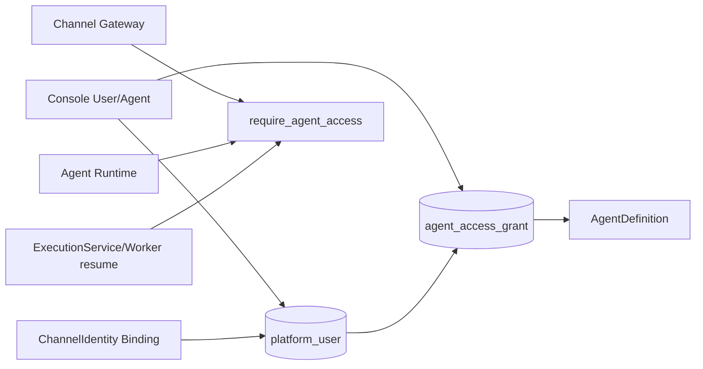
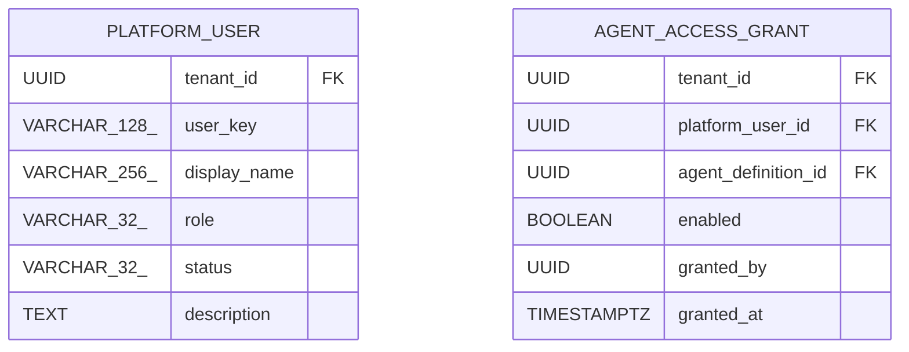

<!-- V1.11 module-split metadata -->
> **文档分档**：`Full`（模板 `design-full.md`）  
> **分档理由**：用户/授权独立领域、DB、运行时权限校验  
> **文档边界**：本文件是该模块唯一详细设计事实源；DB Owner 与接口 Owner 必须落在本模块，不允许在其他模块重复定义。  
> **拆分原则**：仅按可独立评审/编码/验收的一级模块拆分；不按单表/单接口继续碎片化。

# 用户与 Agent 授权 模块需求与设计一体化文档

> **文档编号**: MOD-USER-V1.13
> **文档版本**: V1.13
> **创建日期**: 2026-09-11
> **文档状态**: 设计基线草案（待仓库 Spec Context 绑定后进入正式评审）
> **模板**: `design-full.md`；生成流程按 `cf-task:align` 的复杂后端/架构模块路径执行。
> **上游基线**: V1.8 完整总体设计 + V6 完整 Playbook + Console V0.8 Final。


**评审边界说明**：
- 第 2 章是需求基线（What），禁止实现阶段自行改变领域语义；
- 第 3-4 章是设计基线（How），DB 与每个接口必须以本文为准；
- `Spec Compliance Matrix` 当前依据设计基线生成，因本轮未提供仓库 `spec-context.yml` 与代码目录，**不得声称已通过 cf-task:align 的 repo Spec Gate**；落码前必须在真实仓库执行 `refresh/catalog/bind`。


## 1. 文档控制

### 1.1 责任人

| 角色 | 姓名 | 职责范围 |
|---|---|---|
| 产品/架构负责人 | 待定 | 需求定义、领域边界、与总设/Playbook 一致性 |
| 开发负责人 | 待定 | 技术方案、DB/API、实现 |
| 测试负责人 | 待定 | S/E/B 场景、E2E Gate |
| 安全/运维 | 待定 | Secret、隔离、发布、监控 |

### 1.2 修订历史

| 版本 | 日期 | 作者 | 变更描述 |
|---|---|---|---|
| V1.11 模块分档拆分版 | 2026-09-11 | ChatGPT / 待项目负责人确认 | 按 cf-task:align + design-full 从最新完整总设/Playbook/交互稿重新生成；细化 DB 与全部接口 |
| V1.13 第三轮 Review 修复 | 2026-09-12 | Claude Code | 新增 AUTH-LIB-02/03（内部服务 token、Developer token）；Console 身份映射与 configured/session 字段补齐；Builder 安全只读 DTO 字段级冻结；auth_type↔ProviderKey 冻结；用户授权 revision_token 移除；Skill 入口校验与审核后置声明 |
| V1.13.1 第四轮合理性修复 | 2026-09-12 | Claude Code | Z-12 角色守卫：USR-API-04 补三条服务端校验（不得改当前登录用户自己的 `role` → 403 `SELF_ROLE_CHANGE_DENIED`；提升为 ADMIN 需前端二次确认且服务端接受；禁止降级/停用最后一名 Admin → 409 `LAST_ADMIN_PROTECTED`）；明确「最后一名 Admin」判定口径；补场景 E-USER-04/E-USER-05 并同步 §6 与合规矩阵 verifier |
| V1.14.1 第五轮 Review 裁决修复 | 2026-09-13 | Claude Code | D8：提案唯一谓词补 `superseded_at IS NULL`；D9：Step 显式 `execution_mode`/`reconcile_timeout_seconds`/`max_poll_attempts` 与能力 `async_submittable` 合取校验（ADR-062）；D10：`execution_source` 三态与 `CAPABILITY_TEST` 执行身份、产物统一走 `EXE-API-06`（ADR-063）；D11：投递按 `message_key` 取有效尝试聚合（ADR-066）；D12：`EXE-API-03` 承载全部运行态取消、`EXE-API-05` 收窄为 WAITING_HUMAN（ADR-065）；D13：Builder 可见范围统一为并集；D14：新增 `AUTH-API-01`/`SVC-API-11`；D16：集群槽位按持久占用对账（ADR-068、`slot_resource_class`）；新增场景 S-SVC-13..17、E-SVC-06..08 |

## 2. 需求分析

### 2.1 需求概述

| 项目 | 内容 |
|---|---|
| 模块名称 | 用户与 Agent 授权 |
| 模块ID | MOD-USER |
| 所属系统/产品线 | Fluxion 通用智能服务执行框架 |
| 需求类型 | 中大型功能 / 架构演进 |
| 业务背景 | 最新产品授权模型明确为 PlatformUser→AgentAccessGrant→Agent；身份绑定、Bot 路由、业务平台 Credential 都是独立关系。 |
| 核心目标 | 单独固化 PlatformUser 与 AgentAccessGrant 的 DB/API/运行时校验，避免旧 UserAgentBinding 路由语义复活。 |

### 2.2 痛点与价值

| 维度 | 内容 |
|---|---|
| 目标用户 | Admin、End User（间接）、Channel Gateway、Agent Runtime、ExecutionService |
| 当前问题 | 把 User-Agent 关系用于路由、授权、Runtime instance 绑定会混淆职责；没有独立授权对象时 Channel 已绑定用户仍可能越权使用 Agent。 |
| 业务影响 | 权限边界不清、难审计/撤销、跨渠道体验不一致。 |
| 预期价值 | 一次用户授权在所有身份/渠道上复用；撤销即时影响新请求和恢复执行。 |

### 2.3 功能方案

#### 2.3.1 功能清单

| 功能ID | 功能名称 | 功能描述 | 优先级 | 来源 |
|---|---|---|---|---|
| FEAT-USER-01 | PlatformUser CRUD | 统一用户主体。 | P0 | Console 用户 |
| FEAT-USER-02 | AgentAccessGrant | User↔Agent 授权集合。 | P0 | 最新结论 |
| FEAT-USER-03 | Reverse Grant View | Agent 详情反查授权用户。 | P0 | Console |
| FEAT-USER-04 | Runtime Check | 每次消息/执行恢复 current grant。 | P0 | 安全 |
| FEAT-USER-05 | Audit | 授权增删可追踪。 | P0 | 治理 |

### 2.4 范围与边界

| 类别 | 内容 |
|---|---|
| 范围（In Scope） | platform_user、agent_access_grant、用户 CRUD、双向授权管理、runtime require_access。 |
| 非范围（Out of Scope） | ChannelIdentity 绑定（模块10）、ProjectPlatform Credential（模块09）、Service/Capability 独立 End User Grant（V1 不做）。 |
| 前置假设 | 上游总设、公共 DB/API 规范、外部基础设施可用 |
| 有意妥协 / 技术债 | 无；未来扩展必须有真实旅程驱动 |

### 2.5 验收条件

#### 2.5.1 业务规则与约束

| ID | 类型 | 描述 | 验证场景 |
|---|---|---|---|
| RULE-USER-01 | 授权事实 | 唯一产品授权事实是 AgentAccessGrant；不得新建 UserAgentBinding 路由表。 | S-USER-01 |
| RULE-USER-02 | 跨渠道 | 同一 PlatformUser 的 Agent grant 在所有已绑定身份复用。 | S-USER-02 |
| RULE-USER-03 | 实时撤销 | 撤销 grant 后新消息/Execution 恢复立即拒绝。 | S-USER-03 |
| RULE-USER-04 | Admin | V1 Console 用户/授权管理仅 Admin 可写；Admin 角色本身受自改/最后一名 Admin 守卫（USR-API-04）。 | S-USER-04, E-USER-04, E-USER-05 |
| RULE-USER-05 | 外部权限 | Agent grant 不替代 MSS/CRM 等业务数据权限。 | S-USER-05 |

#### 2.5.2 功能验收场景

**正常场景**

| 场景ID | 功能ID | 优先级 | 测试层级 | 关键真实边界 | 归属 | 前置条件 | 操作步骤 | 预期结果 |
|---|---|---|---|---|---|---|---|---|
| S-USER-05 | FEAT-USER-02 | P1 | integration | grant 不替代业务权限 | 本模块 | 用户有 Agent grant 但无业务数据权限 | 经 Agent 访问业务数据 | 外部平台按自身 RBAC 拒绝；grant 仅是入口授权 |
| S-USER-01 | FEAT-USER-01 | P0 | E2E | Console→API→PG | 本模块 | Admin | 创建用户 | 用户列表/详情可见 |
| S-USER-02 | FEAT-USER-02 | P0 | E2E | User grant API→PG | 本模块 | 用户/Agent 存在 | 授权 Agent01/02 | 用户详情和 Agent 反查一致 |
| S-USER-03 | FEAT-USER-04 | P0 | E2E | Gateway/Runtime→Grant | 后置 → 模块 10/03 | 用户有 grant | 跨两个 Channel 发消息 | 均能使用同一 Agent |
| S-USER-04 | FEAT-USER-04 | P0 | E2E | Execution resume→Grant | 后置 → 模块 05 | 已有 WAITING execution | 撤销 grant 后恢复 | fail closed |

**异常场景**

| 场景ID | 功能ID | 测试层级 | 关键真实边界 | 归属 | 触发条件 | 系统行为 | 用户感知 |
|---|---|---|---|---|---|---|---|
| E-USER-01 | FEAT-USER-02 | integration | Unique grant | 本模块 | 重复授权同 user-agent | 幂等/enable existing | 无重复 row |
| E-USER-02 | FEAT-USER-04 | E2E | Runtime grant check | 本模块 | 用户无 grant 请求 Agent | AGENT_ACCESS_DENIED | 不调用模型/Skill/Capability |
| E-USER-03 | FEAT-USER-01 | E2E | Console 写权限与审计 | 本模块 | Builder 登录 Console 调 USR-API-02 或 USR-API-06 | 403 ADMIN_REQUIRED；写 audit_log（actor_user_id=该登录用户唯一 platform_user.id，含 action 与目标） | 写操作被拒绝，授权变更与操作者可追踪 |
| E-USER-04 | FEAT-USER-01 | integration | 授权并发不丢失 | 本模块 + 03 | 两个 Admin 基于同一份授权快照并发操作（A 新增 user-1，B 新增 user-2） | 各自提交单条 grant 操作 | 两条授权**都生效**（不存在后写者覆盖先写者）；同一 pair 并发重复操作由唯一约束收敛为一行并幂等返回（ADR-064） |
| E-USER-04 | FEAT-USER-01 | E2E | Admin 自改角色守卫 | 本模块 | 当前登录 Admin 编辑自己并提交 `role` 变更 | 403 SELF_ROLE_CHANGE_DENIED；整次请求原子拒绝，该用户 role 仍为 ADMIN、其他字段未被修改 | 角色未变；不会被自己降权锁死，其余字段修改需分次提交 |
| E-USER-05 | FEAT-USER-01 | E2E | 最后一名 Admin 保护 | 本模块 | 租户内仅剩一名 `role=ADMIN AND status=ACTIVE AND is_deleted=false` 用户时，降级（ADMIN→非 ADMIN）或停用（ACTIVE→DISABLED）该 Admin | 409 LAST_ADMIN_PROTECTED；不落库（原角色/状态不变） | 平台仍有至少一名可用 Admin，管理面不会自我锁死 |

#### 2.5.3 非功能指标

| 指标ID | 指标名称 | 目标值 | 测量方法 |
|---|---|---|---|
| NFR-REL-01 | 可靠执行 | 不得因单 Runtime/Worker 进程退出丢失权威状态 | SIGKILL/E2E |
| NFR-SEC-01 | 可信身份 | LLM/客户端不得覆盖 tenant/actor/secret | 安全测试 |
| NFR-OBS-01 | 可追踪 | 关键路径可按 request_id/trace_id/execution_id 定位 | 集成/E2E |

## 3. 技术设计

### 3.1 方案选型

#### 3.1.1 关键决策记录

| 决策点 | 选择 | 被否决项 | 理由 | 可逆性 |
|---|---|---|---|---|
| V1 授权层 | User→Agent | User→Service/Capability 多层 ABAC | 产品简单且 Agent 是用户入口 | 中 |
| 关系命名 | AgentAccessGrant | UserAgentBinding | 避免与路由历史语义混淆 | 难 |

#### 3.1.2 技术栈

| 类别 | 选型 | 版本 | 选型理由 |
|---|---|---|---|
| 语言 | Python | 3.12+（仓库实际版本落码前确认） | 与 Agent/LLM 生态一致 |
| Web/API | FastAPI + Pydantic | 仓库实际版本确认 | 类型契约与异步 IO |
| ORM | SQLAlchemy 2 Async | 仓库实际版本确认 | 异步 PostgreSQL |
| 数据库 | PostgreSQL | 外部部署 | 业务 SoT |

### 3.2 架构设计



#### 3.2.1 模块职责分层

| 层级 | 职责 | 禁止事项 |
|---|---|---|
| Handler/API | 协议解析、DTO、权限入口、统一错误映射 | 业务逻辑/直接 SQL |
| Application Service | 用例编排、事务边界、领域校验 | 依赖具体 Web 框架 |
| Domain | 领域对象/规则 | 基础设施依赖 |
| Repository/Port | 持久化/外部能力抽象 | 泄露 Secret/跨领域修改 |
| Adapter | PostgreSQL/HTTP/MCP 等实现 | 改变领域语义 |

#### 3.2.2 外部依赖清单

| 外部系统/模块 | 依赖类型 | 协议/接口 | 超时/一致性 | 降级策略 |
|---|---|---|---|---|
| Agent Definition | 授权目标 | DB | 同 tenant/current enabled | 禁用 Agent fail closed |
| Channel Identity | 身份映射 | DB | 独立关系 | 未绑定先 /bind |
| External business RBAC | 业务最终权限 | AuthProvider/Capability | 实时 | Grant 不能绕过 |

### 3.3 数据设计

#### 3.3.1 表清单

| 表名 | 职责 | 所有权 |
|---|---|---|
| platform_user | 平台统一用户主体，是 Agent 授权、Conversation、Memory、Execution 的用户根。 | 用户与 Agent 授权 |
| agent_access_grant | V1 产品授权关系：PlatformUser 是否可使用某个 AgentDefinition。与 Channel 路由、Service/Capability 技术绑定分离。 | 用户与 Agent 授权 |

#### 表 `platform_user`

**职责**：平台统一用户主体，是 Agent 授权、Conversation、Memory、Execution 的用户根。

| 字段名 | 类型 | 可空 | 默认值 | 索引 | 说明 |
|---|---|---|---|---|---|
| tenant_id | UUID | N |  | IDX | 租户 |
| user_key | VARCHAR(128) | N |  | UK | 租户内稳定用户标识 |
| display_name | VARCHAR(256) | N |  | IDX | 展示名 |
| role | VARCHAR(32) | N | END_USER |  | END_USER/BUILDER/ADMIN；`ADMIN`/`BUILDER` 同时是 Console 登录角色（见模块 09 §3.2.3）；`END_USER` 仅经 IM 使用，不登录 Console |
| status | VARCHAR(32) | N | ACTIVE | IDX | ACTIVE/DISABLED |
| revision | BIGINT | N | 1 |  | 乐观锁版本（R17：编辑必填回传；每次更新 +1） |
| description | TEXT | Y |  |  | 备注 |
| id | UUID | N | gen_random_uuid() | PK | 主键 |
| is_deleted | BOOLEAN | N | FALSE | IDX | 软删除标记；默认查询必须过滤 FALSE |
| create_time | TIMESTAMPTZ | N | CURRENT_TIMESTAMP |  | 创建时间 |
| update_time | TIMESTAMPTZ | N | CURRENT_TIMESTAMP |  | 更新时间 |

**约束**

- UNIQUE (tenant_id, user_key) WHERE is_deleted=false
- role/status 使用受控枚举或 CHECK

**索引设计**

| 索引名 | 类型 | 字段 | 使用场景 |
|---|---|---|---|
| uk_platform_user_tenant_key | UNIQUE | tenant_id,user_key | 按稳定 Key 解析用户 |
| idx_platform_user_tenant_status | BTREE | tenant_id,status,is_deleted | 用户列表/授权过滤 |

#### 表 `agent_access_grant`

**职责**：V1 产品授权关系：PlatformUser 是否可使用某个 AgentDefinition。与 Channel 路由、Service/Capability 技术绑定分离。

| 字段名 | 类型 | 可空 | 默认值 | 索引 | 说明 |
|---|---|---|---|---|---|
| tenant_id | UUID | N |  | IDX | 租户 |
| platform_user_id | UUID | N |  | FK,IDX | 用户 |
| agent_definition_id | UUID | N |  | FK,IDX | Agent |
| enabled | BOOLEAN | N | TRUE | IDX | 当前授权是否有效 |
| granted_by | UUID | N |  |  | 操作者的 `platform_user.id`（取登录用户对应的唯一 platform_user 行，见模块 09 的 Console 身份契约 §3.2.3） |
| granted_at | TIMESTAMPTZ | N | CURRENT_TIMESTAMP |  | 授权时间 |
| revoked_at | TIMESTAMPTZ | Y |  |  | 撤销时间 |
| id | UUID | N | gen_random_uuid() | PK | 主键 |
| is_deleted | BOOLEAN | N | FALSE | IDX | 软删除标记；默认查询必须过滤 FALSE |
| create_time | TIMESTAMPTZ | N | CURRENT_TIMESTAMP |  | 创建时间 |
| update_time | TIMESTAMPTZ | N | CURRENT_TIMESTAMP |  | 更新时间 |

**约束**

- 同一 tenant + user + agent 只允许一条未删除记录；重复授权仅切换 enabled（grant 无独立 revision） 或幂等返回
- 授权校验发生在身份解析之后、Runtime 执行之前

**索引设计**

| 索引名 | 类型 | 字段 | 使用场景 |
|---|---|---|---|
| uk_agent_access_grant_pair | UNIQUE(partial) | tenant_id,platform_user_id,agent_definition_id | WHERE is_deleted=false；防重复授权 |
| idx_agent_access_grant_agent | BTREE | tenant_id,agent_definition_id,enabled,is_deleted | Agent 反查授权用户 |
| idx_agent_access_grant_user | BTREE | tenant_id,platform_user_id,enabled,is_deleted | 用户可用 Agent |

#### 3.3.2 ER 图



#### 3.3.3 数据一致性与软删除规则

- 所有 Framework 自建可变表使用 `is_deleted/create_time/update_time`；查询默认过滤 `is_deleted=false`。
- FK 只引用同一租户可见对象；跨租户引用必须在 Application Service 拒绝。
- Secret/Token/Password 不落业务表明文，只保存 `secret_ref/credential_ref`。
- 不可变 Release/Snapshot/Artifact 使用 append-only；需要更新时新建记录。
- `revision` 用于 direct-effect 配置的乐观并发和审计，不等同于发布版本。

### 3.4 接口设计

#### 3.4.1 接口清单

| 接口ID | 名称 | 形态 | 方法/签名 | 路径/用途 |
|---|---|---|---|---|
| USR-API-01 | 用户列表 | HTTP | GET | /api/v1/users |
| USR-API-02 | 创建用户 | HTTP | POST | /api/v1/users |
| USR-API-03 | 用户详情 | HTTP | GET | /api/v1/users/{user_id} |
| USR-API-04 | 编辑用户 | HTTP | PUT | /api/v1/users/{user_id} |
| USR-API-05 | 获取用户 Agent 授权 | HTTP | GET | /api/v1/users/{user_id}/agent-grants |
| USR-API-06 | 新增用户 Agent 授权 | HTTP | POST | /api/v1/users/{user_id}/agent-grants |
| USR-API-06R | 撤销用户 Agent 授权 | HTTP | POST | /api/v1/users/{user_id}/agent-grants/{grant_id}/revoke |
| USR-API-07 | Agent 反向授权用户 | HTTP | GET | /api/v1/agents/{agent_id}/users |
| USR-API-08 | 新增 Agent 授权用户 | HTTP | POST | /api/v1/agents/{agent_id}/grants |
| USR-API-08R | 撤销 Agent 授权用户 | HTTP | POST | /api/v1/agents/{agent_id}/grants/{grant_id}/revoke |
| USR-LIB-01 | 运行时 Agent 授权校验 | Library | def require_agent_access(ctx: TrustedExecutionContext, agent_id: UUID) -> AgentAccessDecision |  |

#### USR-API-01: 用户列表

**入口类型**：HTTP

**契约**：`GET /api/v1/users`

**认证/授权**：Admin

**Query 参数**

| 参数 | 类型 | 必填 | 说明 |
|---|---|---|---|
| page | integer | N | 页码，从 1 开始；默认 1 |
| page_size | integer | N | 每页条数；默认 20，最大 100 |
| keyword | string | N | 名称/user_key 模糊搜索 |
| role | string | N | END_USER/BUILDER/ADMIN |
| status | string | N | ACTIVE/DISABLED |

**请求体**：无。

**响应 data**

| 字段 | 类型 | 说明 |
|---|---|---|
| items | array<UserSummary> | 用户摘要 |
| page | integer | 当前页 |
| page_size | integer | 每页条数 |
| total | integer | 总数 |

**响应示例**

```json
{
  "code": 0,
  "message": "success",
  "data": {
    "items": [],
    "total": 1
  },
  "request_id": "req_xxx"
}
```

**错误码**

仅使用公共错误码。

**处理逻辑**

```text
校验 Admin 身份 → 构造 tenant 过滤与软删除条件 → 走 keyword/role/status 索引查询 → 返回分页结果。
```

#### USR-API-02: 创建用户

**入口类型**：HTTP

**契约**：`POST /api/v1/users`

**认证/授权**：Admin

**请求体**

| 参数 | 类型 | 必填 | 说明 |
|---|---|---|---|
| user_key | string | N | 租户内稳定唯一 Key；缺省由服务端自动生成（交互稿 V0.8：系统自动生成，管理员不输入） |
| display_name | string | Y | 展示名 |
| role | string | Y | END_USER/BUILDER/ADMIN |
| status | string | N | 默认 ACTIVE |
| description | string | N | 备注 |

**请求示例**

```json
{
  "user_key": "<user_key>",
  "display_name": "<display_name>",
  "role": "<role>",
  "status": "<status>",
  "description": "<description>"
}
```

**响应 data**

| 字段 | 类型 | 说明 |
|---|---|---|
| id | uuid | 用户 ID |
| user_key | string | 稳定 Key |
| revision | integer | 初始 revision |

**响应示例**

```json
{
  "code": 0,
  "message": "success",
  "data": {
    "id": "<id>",
    "user_key": "<user_key>",
    "revision": 1
  },
  "request_id": "req_xxx"
}
```

**错误码**

| 错误码 | 场景 | HTTP 状态 |
|---|---|---|
| USER_KEY_EXISTS | user_key 已存在 | 409 |
| USER_ROLE_INVALID | 角色非法 | 400 |

**处理逻辑**

```text
Admin 鉴权 → DTO/枚举校验 → 唯一性检查 → INSERT platform_user → 写 audit_log → 返回。
```

**一致性/幂等**：user_key 唯一；重复请求如携带客户端 idempotency key 可返回同一资源。

#### USR-API-03: 用户详情

**入口类型**：HTTP

**契约**：`GET /api/v1/users/{user_id}`

**认证/授权**：Admin

**请求体**：无。

**响应 data**

| 字段 | 类型 | 说明 |
|---|---|---|
| id | uuid | 用户 ID |
| user_key | string | 稳定 Key |
| display_name | string | 名称 |
| role | string | 角色 |
| status | string | 状态 |
| agent_grant_count | integer | 有效 Agent 授权数 |
| im_identity_count | integer | 有效 IM 身份数 |
| project_credential_count | integer | 项目平台认证数 |
| create_time | datetime | 创建时间 |
| update_time | datetime | 更新时间 |
| revision | integer | 乐观锁版本（编辑时必填回传） |

**响应示例**

```json
{
  "code": 0,
  "message": "success",
  "data": {
    "id": "<id>",
    "user_key": "<user_key>",
    "display_name": "<display_name>",
    "role": "<role>",
    "status": "<status>",
    "agent_grant_count": 1,
    "im_identity_count": 1,
    "project_credential_count": 1,
    "create_time": "2026-09-11 10:00:00",
    "update_time": "2026-09-11 10:00:00"
  },
  "request_id": "req_xxx"
}
```

**错误码**

| 错误码 | 场景 | HTTP 状态 |
|---|---|---|
| USER_NOT_FOUND | 用户不存在 | 404 |

**处理逻辑**

```text
Admin 鉴权 → tenant scoped read platform_user → 聚合 count（批量子查询，不做 N+1） → 返回。
```

#### USR-API-04: 编辑用户

**入口类型**：HTTP

**契约**：`PUT /api/v1/users/{user_id}`

**认证/授权**：Admin

**请求体**

| 参数 | 类型 | 必填 | 说明 |
|---|---|---|---|
| display_name | string | Y | 展示名 |
| role | string | Y | 角色；① 不得修改当前登录用户自己的角色（403 `SELF_ROLE_CHANGE_DENIED`）；② 提升为 ADMIN 需前端二次确认，服务端接受确认后的请求；③ 不得使启用 Admin 数变为 0（409 `LAST_ADMIN_PROTECTED`） |
| status | string | Y | 状态 ACTIVE/DISABLED；最后一名启用 Admin 不得停用 |
| description | string | N | 备注 |
| revision | integer | Y | 乐观锁版本 |

**请求示例**

```json
{
  "display_name": "<display_name>",
  "role": "<role>",
  "status": "<status>",
  "description": "<description>",
  "revision": 1
}
```

**响应 data**

| 字段 | 类型 | 说明 |
|---|---|---|
| id | uuid | 用户 ID |
| revision | integer | 新 revision |

**响应示例**

```json
{
  "code": 0,
  "message": "success",
  "data": {
    "id": "<id>",
    "revision": 1
  },
  "request_id": "req_xxx"
}
```

**错误码**

| 错误码 | 场景 | HTTP 状态 |
|---|---|---|
| USER_NOT_FOUND | 用户不存在 | 404 |
| REVISION_CONFLICT | revision 冲突 | 409 |
| SELF_ROLE_CHANGE_DENIED | 修改当前登录用户自己的 `role` | 403 |
| LAST_ADMIN_PROTECTED | 降级（ADMIN→非 ADMIN）或停用（ACTIVE→DISABLED）会使启用 Admin 数变为 0 | 409 |

**处理逻辑**

```text
读取 current → 校验 revision → 禁止修改 user_key → 角色守卫三条 → UPDATE + revision+1 → audit before/after。
① 自改守卫：目标用户 == 请求上下文中的当前登录用户（同一 platform_user.id）且 role 发生变更 → SELF_ROLE_CHANGE_DENIED（403），整次请求原子拒绝（不修改任何字段）。
② Admin 升级确认：把某用户 role 提升为 ADMIN 需前端二次确认对话框；服务端接受确认后提交的同一请求（不引入独立确认令牌/二次接口）。
③ 最后一名 Admin 保护：判定口径为行数 COUNT(*) WHERE tenant_id=? AND role='ADMIN' AND status='ACTIVE' AND is_deleted=false 必须恒 >= 1；
   当本次变更会使该计数变为 0（ADMIN→非 ADMIN 的降级，或 ACTIVE→DISABLED 的停用，含两者同时）→ LAST_ADMIN_PROTECTED（409），不落库；
   同一事务内 SELECT ... FOR UPDATE 锁定本租户 Admin 行后再计数，避免两个并发请求各自降级导致同时通过。
```

**一致性/幂等**：乐观锁，禁止 last-write-wins 静默覆盖；三条守卫均为原子拒绝（拒绝时不得部分写入）。

#### USR-API-05: 获取用户 Agent 授权

**入口类型**：HTTP

**契约**：`GET /api/v1/users/{user_id}/agent-grants`

**认证/授权**：Admin

**请求体**：无。

**响应 data**

| 字段 | 类型 | 说明 |
|---|---|---|
| items | array<AgentGrantView> | 每条授权（含已撤销）：`grant_id`/`agent_id`/名称/key/`enabled`/`granted_by`/`granted_at`/`revoked_at?` |

**响应示例**

```json
{
  "code": 0,
  "message": "success",
  "data": {
    "items": []
  },
  "request_id": "req_xxx"
}
```

**错误码**

| 错误码 | 场景 | HTTP 状态 |
|---|---|---|
| USER_NOT_FOUND | 用户不存在 | 404 |

**处理逻辑**

```text
tenant scoped 用户存在性检查 → JOIN agent_access_grant + agent_definition → 返回每条授权的有效状态。
```

**读侧契约（ADR-064）**：返回**逐条授权的状态投影**（`grant_id` 是后续撤销操作的可寻址身份）。前端「全量加载 + 预勾选 + 差异确认」的交互据此实现，但**提交的是逐条显式操作**，不再有“整体集合覆盖”语义。`enabled=false` 的历史行保留并可见（`revoked_at` 非空），用于审计与“重新授权”判断；默认列表只展示 `enabled=true`，`include_revoked=true` 时附带历史。

#### USR-API-06: 新增用户 Agent 授权

**入口类型**：HTTP

**契约**：`POST /api/v1/users/{user_id}/agent-grants`

**认证/授权**：Admin

**请求体**

| 参数 | 类型 | 必填 | 说明 |
|---|---|---|---|
| agent_id | uuid | Y | 目标 Agent |
| idempotency_key | string | Y | 操作幂等键（同键同参返回原结果） |

**响应 data**：`{grant_id, user_id, agent_id, enabled: true, granted_at, granted_by}`

**处理逻辑**

```text
Admin 鉴权 → 校验 Agent 同租户 → 单事务：pair 未删除行不存在则 INSERT（enabled=true, granted_by=登录用户），
已存在且 enabled=false 则重新启用（enabled=true, granted_at=now, revoked_at=NULL）并保留原 grant_id →
幂等返回 → audit。
```

**一致性/幂等**：单条操作、单事务；`UNIQUE (tenant_id,platform_user_id,agent_definition_id) WHERE is_deleted=false` 保证同一 pair 恒为一行；重复提交按 `idempotency_key` 返回原结果，换参 `IDEMPOTENCY_CONFLICT`(409)。**并发安全由结构保证**：两个 Admin 分别新增不同用户/Agent 互不覆盖（不存在“后写者撤销先写者”的路径）。

**错误码**

| 错误码 | 场景 | HTTP 状态 |
|---|---|---|
| USER_NOT_FOUND | 用户不存在 | 404 |
| AGENT_NOT_FOUND | Agent 不存在/跨租户 | 400 |
| IDEMPOTENCY_CONFLICT | 同 idempotency_key 换参 | 409 |

#### USR-API-06R: 撤销用户 Agent 授权

**入口类型**：HTTP

**契约**：`POST /api/v1/users/{user_id}/agent-grants/{grant_id}/revoke`

**认证/授权**：Admin

**请求体**：`{idempotency_key: string}`；additionalProperties=false。

**响应 data**：`{grant_id, user_id, agent_id, enabled: false, revoked_at}`

**处理逻辑**

```text
Admin 鉴权 → 按 tenant + user_id + grant_id 定位未删除行（不存在 404 GRANT_NOT_FOUND）→
单事务：enabled=false, revoked_at=now, granted_by=操作者 → audit。
```

**一致性/幂等**：对已 `enabled=false` 的行重复撤销幂等返回原 `revoked_at`；**只影响该 grant_id 指向的一条授权**，不影响同一用户/Agent 的其他授权行。

**错误码**

| 错误码 | 场景 | HTTP 状态 |
|---|---|---|
| USER_NOT_FOUND | 用户不存在 | 404 |
| GRANT_NOT_FOUND | 授权不存在/已删除/不属于该用户 | 404 |

#### USR-API-07: Agent 反向授权用户

**入口类型**：HTTP

**契约**：`GET /api/v1/agents/{agent_id}/users`

**认证/授权**：Builder/Admin

**Query 参数**

| 参数 | 类型 | 必填 | 说明 |
|---|---|---|---|
| page | integer | N | 页码，从 1 开始；默认 1 |
| page_size | integer | N | 每页条数；默认 20，最大 100 |
| keyword | string | N | 用户筛选 |

**请求体**：无。

**响应 data**

| 字段 | 类型 | 说明 |
|---|---|---|
| items | array<UserGrantSummary> | 每条授权：`grant_id`/`user_id`/`user_key`/`display_name`/`enabled`/`granted_by`/`granted_at`/`revoked_at?` |
| total | integer | 总数 |

**响应示例**

```json
{
  "code": 0,
  "message": "success",
  "data": {
    "items": [],
    "total": 1
  },
  "request_id": "req_xxx"
}
```

**错误码**

| 错误码 | 场景 | HTTP 状态 |
|---|---|---|
| AGENT_NOT_FOUND | Agent 不存在 | 404 |

**处理逻辑**

```text
JOIN grant/user 分页；只读反向视图。
```

#### USR-API-08: 新增 Agent 授权用户

**入口类型**：HTTP

**契约**：`POST /api/v1/agents/{agent_id}/grants`

**认证/授权**：Admin

**请求体**：`{user_id: uuid, idempotency_key: string}`；additionalProperties=false。

**响应 data**：`{grant_id, agent_id, user_id, enabled: true, granted_at, granted_by}`

**处理逻辑**

```text
与 USR-API-06 操作同一 agent_access_grant 事实源（禁止建立第二张 AgentUserBinding 表）；
单事务：pair 不存在则 INSERT，已存在且 enabled=false 则重新启用并保留 grant_id → 幂等返回 → audit。
```

**一致性/幂等**：单条操作、单事务、`idempotency_key` 幂等；并发安全由“逐条可寻址操作 + pair 唯一约束”保证，不存在集合覆盖写的丢失更新路径。

**错误码**

| 错误码 | 场景 | HTTP 状态 |
|---|---|---|
| AGENT_NOT_FOUND | Agent 不存在 | 404 |
| USER_NOT_FOUND | 用户不存在或跨租户 | 400 |
| IDEMPOTENCY_CONFLICT | 同 idempotency_key 换参 | 409 |

#### USR-API-08R: 撤销 Agent 授权用户

**入口类型**：HTTP

**契约**：`POST /api/v1/agents/{agent_id}/grants/{grant_id}/revoke`

**认证/授权**：Admin

**请求体**：`{idempotency_key: string}`；additionalProperties=false。

**响应 data**：`{grant_id, agent_id, user_id, enabled: false, revoked_at}`

**处理逻辑**

```text
Admin 鉴权 → 按 tenant + agent_id + grant_id 定位未删除行（不存在 404 GRANT_NOT_FOUND）→ 单事务置
enabled=false/revoked_at=now/granted_by=操作者 → audit。
```

**一致性/幂等**：重复撤销幂等返回原 `revoked_at`；只影响该 grant_id。

**错误码**

| 错误码 | 场景 | HTTP 状态 |
|---|---|---|
| AGENT_NOT_FOUND | Agent 不存在 | 404 |
| GRANT_NOT_FOUND | 授权不存在/已删除/不属于该 Agent | 404 |

#### USR-LIB-01: 运行时 Agent 授权校验

**入口类型**：Library

**认证/授权**：仅宿主内部调用（Channel Gateway/Agent Runtime/ExecutionService）；身份一律取可信 `ctx`（tenant/actor），不接受 LLM/渠道/客户端提交的 user_id 或 access flag。

**函数签名**

```python
def require_agent_access(ctx: TrustedExecutionContext, agent_id: UUID) -> AgentAccessDecision
```

**入参**

| 参数 | 类型 | 必填 | 说明 |
|---|---|---|---|
| ctx | TrustedExecutionContext | Y | 服务端可信 tenant/user |
| agent_id | uuid | Y | 目标 Agent |

**返回**

| 字段 | 类型 | 说明 |
|---|---|---|
| allowed | boolean | 是否允许 |
| reason | string | 拒绝原因 |

**异常/错误**

| 错误码 | 场景 | HTTP 状态 |
|---|---|---|
| AGENT_ACCESS_DENIED | 无 Agent 授权 | 403 |

**处理逻辑**

```text
读取 current platform_user.status + agent_access_grant.enabled + agent_definition.enabled；任何一项无效立即 fail-closed。
```

**补充约束**：不接受 LLM 传入 user_id 覆盖 ctx.actor_user_id。

### 3.5 质量实现方案

#### 3.5.1 性能与容量

| 热点路径 | 负载量级 | 潜在瓶颈 | 实现方案 | 目标值 |
|---|---|---|---|---|
| Grant check | 每消息/执行恢复 | DB 热读 | unique pair index + 短 TTL/版本化 cache 可选；撤销需可失效 | 安全优先 |
| 授权列表 | Console | 多对多 | 双向组合索引 + pagination | 低频 |

#### 3.5.2 可靠性

所有外部调用有 deadline；重试有界且只对可安全重试错误；业务权威状态外置；进程崩溃后能恢复或明确失败。

#### 3.5.3 安全性

任何 grant 写入都审计 actor；Runtime 不信任 channel/client 提交的 user_id/agent access flag；disabled user 直接 deny。

#### 3.5.4 可观测性

日志、Metrics、Trace 统一关联 request_id/trace_id；Execution 路径附带 execution_id/step_id；错误码稳定。

#### 3.5.5 测试策略

Domain/validator 单测；Repository/Provider 真 PG/外部 Stub 集成；核心用户旅程做 E2E；安全和崩溃恢复不得只靠 mock。

## 4. 部署与运维

### 4.1 部署架构

随其所属运行角色部署；PostgreSQL/Redis/Object Store/Secret Provider/OTel Backend 均为外部依赖，不打包进应用 Compose/Helm。

### 4.2 发布与回滚

DB 变更使用向前兼容迁移；应用支持滚动回滚；若涉及不可变 Release/Artifact，只切换 current 指针，不覆盖历史。

### 4.3 监控告警

至少监控请求/调用量、错误率、延迟、外部依赖失败、关键队列/执行积压和配置加载失败；阈值由环境基线确定。

### 4.4 数据迁移

若无历史生产数据则直接按新 Schema 建表；若已有部署，使用 Alembic 等可回滚/可前滚迁移，禁止运行时隐式改表。

## 5. 风险与依赖

| 风险ID | 描述 | 影响 | 应对措施 | 验证场景 |
|---|---|---|---|---|
| RISK-USER-01 | 把 Service/Capability 业务权限误当成 Agent grant | 高 | 文档/代码命名 + Capability 外部 RBAC E2E | S-USER-05 |

## 6. 需求追溯矩阵

| 功能ID | 接口ID | 验证场景 | 测试层级 | 状态 |
|---|---|---|---|---|
| FEAT-USER-01 | USR-API-01, USR-API-02, USR-API-03, USR-API-04 | S-USER-01, E-USER-03, E-USER-04, E-USER-05 | E2E/integration | 待实现/评审 |
| FEAT-USER-02 | USR-API-05, USR-API-06/R, USR-API-08/R | S-USER-02, E-USER-01, E-USER-04 | E2E/integration | 待实现/评审 |
| FEAT-USER-03 | USR-API-07 | S-USER-02 | E2E/integration | 待实现/评审 |
| FEAT-USER-04 | USR-LIB-01 | S-USER-03, S-USER-04, E-USER-02 | E2E/integration | 待实现/评审 |
| FEAT-USER-05 | USR-API-06/R, USR-API-08/R | E-USER-03, E-USER-04 | E2E/integration | 待实现/评审 |

## Spec Compliance Matrix

| Spec/Rule | enforcement | 设计影响 | 设计落点 | 验证场景 | 状态/N/A 理由 |
|---|---|---|---|---|---|
| DESIGN/USER#RULE-USER-01 | design-baseline | 约束实现与验收 | §2.5 RULE-USER-01 / §3 | S-USER-02, E-USER-01 | applied；仓库 spec-context 待绑定 |
| DESIGN/USER#RULE-USER-02 | design-baseline | 约束实现与验收 | §2.5 RULE-USER-02 / §3 | S-USER-03 | applied；仓库 spec-context 待绑定 |
| DESIGN/USER#RULE-USER-03 | design-baseline | 约束实现与验收 | §2.5 RULE-USER-03 / §3 | S-USER-04, E-USER-02 | applied；仓库 spec-context 待绑定 |
| DESIGN/USER#RULE-USER-04 | design-baseline | 约束实现与验收 | §2.5 RULE-USER-04 / §3.4.1 USR-API-04 | E-USER-03, E-USER-04, E-USER-05 | applied；仓库 spec-context 待绑定 |
| DESIGN/USER#RULE-USER-05 | design-baseline | 约束实现与验收 | §2.5 RULE-USER-05 / §3 | S-USER-05 | applied；仓库 spec-context 待绑定 |

## 附录 A：接口与 DB 落码检查清单

- [ ] 每个 HTTP Endpoint 已有 DTO、鉴权、错误码、处理逻辑、测试。
- [ ] 每个 Library/CLI 接口有稳定签名和异常语义。
- [ ] 每张表字段、类型、NULL、默认值、唯一约束、索引、软删除策略已落实迁移。
- [ ] Request/Response 字段不接受客户端传入可信 tenant/actor/credential。
- [ ] 列表接口使用服务端分页，避免无界返回。
- [ ] 修改类接口有 revision/冲突语义；高风险/副作用路径满足幂等和审计。
- [ ] 仓库 Spec Context 已 refresh/catalog/bind 且 required Rules 映射到 S/E/B verifier。
