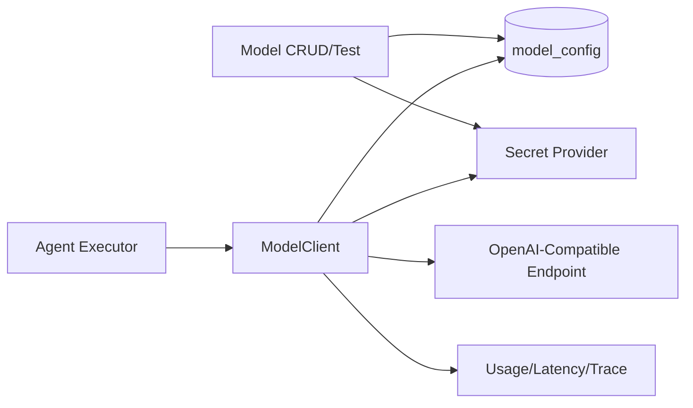

<!-- V1.11 module-split metadata -->
> **文档分档**：`Full`（模板 `design-full.md`）  
> **分档理由**：ModelConfig、Secret、Provider 调用和流式运行  
> **文档边界**：本文件是该模块唯一详细设计事实源；DB Owner 与接口 Owner 必须落在本模块，不允许在其他模块重复定义。  
> **拆分原则**：仅按可独立评审/编码/验收的一级模块拆分；不按单表/单接口继续碎片化。

# 模型配置与调用 模块需求与设计一体化文档

> **文档编号**: MOD-MODEL-V1.13
> **文档版本**: V1.13
> **创建日期**: 2026-09-11
> **文档状态**: 设计基线草案（待仓库 Spec Context 绑定后进入正式评审）
> **模板**: `design-full.md`；生成流程按 `cf-task:align` 的复杂后端/架构模块路径执行。
> **上游基线**: V1.8 完整总体设计 + V6 完整 Playbook + Console V0.8 Final。


**评审边界说明**：
- 第 2 章是需求基线（What），禁止实现阶段自行改变领域语义；
- 第 3-4 章是设计基线（How），DB 与每个接口必须以本文为准；
- `Spec Compliance Matrix` 当前依据设计基线生成，因本轮未提供仓库 `spec-context.yml` 与代码目录，**不得声称已通过 cf-task:align 的 repo Spec Gate**；落码前必须在真实仓库执行 `refresh/catalog/bind`。


## 1. 文档控制

### 1.1 责任人

| 角色 | 姓名 | 职责范围 |
|---|---|---|
| 产品/架构负责人 | 待定 | 需求定义、领域边界、与总设/Playbook 一致性 |
| 开发负责人 | 待定 | 技术方案、DB/API、实现 |
| 测试负责人 | 待定 | S/E/B 场景、E2E Gate |
| 安全/运维 | 待定 | Secret、隔离、发布、监控 |

### 1.2 修订历史

| 版本 | 日期 | 作者 | 变更描述 |
|---|---|---|---|
| V1.11 模块分档拆分版 | 2026-09-11 | ChatGPT / 待项目负责人确认 | 按 cf-task:align + design-full 从最新完整总设/Playbook/交互稿重新生成；细化 DB 与全部接口 |
| V1.13 第三轮 Review 修复 | 2026-09-12 | Claude Code | `request_timeout_ms` → `request_timeout_seconds`（秒，默认 60，1..600）；MODEL-API-02/04 补 `extra_headers` 并同步详情响应与 DDL；MODEL-API-01/03 补 Admin/Builder 角色投影与 ModelSummary 字段清单；统一 `api_key_configured`；修正 §2.5.1 RULE→场景指向并重写 §6 追溯矩阵与合规矩阵 verifier |
| V1.13.1 第四轮合理性修复 | 2026-09-12 | Claude Code | D2 字段级授权：MODEL-API-02/04 由「仅 Admin」改为「Builder + Admin（敏感字段仅 Admin）」，`api_key` 仅 Admin 可写、非 Admin 携带即 403 `FIELD_ADMIN_ONLY` 并原子拒绝；B9：`extra_headers` 改 Header 名 allowlist（拒绝凭据类 Header + 值 ≤ 1024）；`api_key_secret_ref` 允许为空（`api_key_configured=false`）并明确 fail closed；MODEL-API-05 二选一结论为**维持仅 Admin**并写明理由 |

## 2. 需求分析

### 2.1 需求概述

| 项目 | 内容 |
|---|---|
| 模块名称 | 模型配置与调用 |
| 模块ID | MOD-MODEL |
| 所属系统/产品线 | Fluxion 通用智能服务执行框架 |
| 需求类型 | 中大型功能 / 架构演进 |
| 业务背景 | V1 模型接入收敛为 OpenAI-Compatible；一个 Agent 选择一个 ModelConfig；模型配置保存后对新请求直接生效，不做产品级版本发布。 |
| 核心目标 | 设计 ModelConfig DB/API、Secret 管理、连通测试、流式 ModelClient、timeout/参数合并和 observability。 |

### 2.2 痛点与价值

| 维度 | 内容 |
|---|---|
| 目标用户 | Builder/Admin、Agent Runtime |
| 当前问题 | 模型新增入口曾缺失；Provider/模型名/Secret 若混在 Agent 或环境变量中，难管理、难测试、不同 Agent 难复用。 |
| 业务影响 | Console 不完整、Secret 风险、运行配置漂移。 |
| 预期价值 | 统一可复用模型配置，一个 Agent 一个模型，调用行为可观测且可切换。 |

### 2.3 功能方案

#### 2.3.1 功能清单

| 功能ID | 功能名称 | 功能描述 | 优先级 | 来源 |
|---|---|---|---|---|
| FEAT-MODEL-01 | Model CRUD | OpenAI-compatible 配置。 | P0 | Console 模型 |
| FEAT-MODEL-02 | Secret | API Key 外部存储。 | P0 | 安全 |
| FEAT-MODEL-03 | Connection Test | 最小真实请求验证。 | P0 | Builder |
| FEAT-MODEL-04 | ModelClient | 流式/工具调用统一 Event。 | P0 | Agent Executor |
| FEAT-MODEL-05 | Direct-effect | revision/audit，无 Draft/Publish。 | P0 | 总体设计 |

### 2.4 范围与边界

| 类别 | 内容 |
|---|---|
| 范围（In Scope） | model_config、CRUD/test、Secret ref、OpenAI-compatible async streaming client、usage/latency/error。 |
| 非范围（Out of Scope） | 多模型路由策略、A/B、模型 Marketplace、Agent 多模型编排。 |
| 前置假设 | 上游总设、公共 DB/API 规范、外部基础设施可用 |
| 有意妥协 / 技术债 | 无；未来扩展必须有真实旅程驱动 |

### 2.5 验收条件

#### 2.5.1 业务规则与约束

| ID | 类型 | 描述 | 验证场景 |
|---|---|---|---|
| RULE-MODEL-01 | 协议 | V1 protocol 固定 OPENAI_COMPATIBLE。 | S-MODEL-01 |
| RULE-MODEL-02 | Agent | 一个 Agent V1 只引用一个 ModelConfig。 | S-MODEL-03 |
| RULE-MODEL-03 | Secret | API key 不落 DB/响应/日志明文。 | S-MODEL-01, E-MODEL-01 |
| RULE-MODEL-04 | 生效 | 编辑 direct-effect + revision，新请求使用 current。 | S-MODEL-04, E-MODEL-02 |
| RULE-MODEL-05 | Deadline | 模型调用必须有 request deadline，禁止无限 retry。 | S-MODEL-05 |

#### 2.5.2 功能验收场景

**正常场景**

| 场景ID | 功能ID | 优先级 | 测试层级 | 关键真实边界 | 归属 | 前置条件 | 操作步骤 | 预期结果 |
|---|---|---|---|---|---|---|---|---|
| S-MODEL-05 | FEAT-MODEL-02 | P1 | integration | 模型调用有 deadline | 本模块 | 模型端点挂起 | 发起调用 | 到达 request deadline 后超时失败，无无限 retry |
| S-MODEL-01 | FEAT-MODEL-01 | P0 | E2E | Console→API→Secret+PG | 本模块 | Builder | 新增模型 | 列表可见且 Secret 仅 configured |
| S-MODEL-02 | FEAT-MODEL-03 | P0 | E2E | API→OpenAI-compatible endpoint | 本模块 | 配置有效 | Test | 返回 ok/latency/provider request id |
| S-MODEL-03 | FEAT-MODEL-04 | P0 | E2E | AgentExecutor→ModelClient SSE | 后置 → 模块 04 | Agent 引用模型 | 对话 | 逐 delta/tool events |
| S-MODEL-04 | FEAT-MODEL-05 | P0 | E2E | PUT→Runtime resolve | 本模块 | Agent 正在服务 | 更新 model_name r2 | 新请求使用 r2，不需 publish |

**异常场景**

| 场景ID | 功能ID | 测试层级 | 关键真实边界 | 归属 | 触发条件 | 系统行为 | 用户感知 |
|---|---|---|---|---|---|---|---|
| E-MODEL-01 | FEAT-MODEL-03 | integration | Model test | 本模块 | 401/timeout/protocol invalid | 稳定 MODEL_* 错误 | 不泄露 key |
| E-MODEL-02 | FEAT-MODEL-05 | integration | revision | 本模块 | 旧 revision PUT | REVISION_CONFLICT | 刷新后重试 |

#### 2.5.3 非功能指标

| 指标ID | 指标名称 | 目标值 | 测量方法 |
|---|---|---|---|
| NFR-REL-01 | 可靠执行 | 不得因单 Runtime/Worker 进程退出丢失权威状态 | SIGKILL/E2E |
| NFR-SEC-01 | 可信身份 | LLM/客户端不得覆盖 tenant/actor/secret | 安全测试 |
| NFR-OBS-01 | 可追踪 | 关键路径可按 request_id/trace_id/execution_id 定位 | 集成/E2E |

## 3. 技术设计

### 3.1 方案选型

#### 3.1.1 关键决策记录

| 决策点 | 选择 | 被否决项 | 理由 | 可逆性 |
|---|---|---|---|---|
| 协议 | OpenAI-Compatible only | 多个 Provider 专有适配 | V1 收敛 | 未来可扩展 |
| 模型关系 | Agent 1→1 ModelConfig | 策略多模型 | 避免过度设计 | 中 |
| Secret | SecretProvider ref | DB ciphertext/plain | 安全边界 | 中 |

#### 3.1.2 技术栈

| 类别 | 选型 | 版本 | 选型理由 |
|---|---|---|---|
| 语言 | Python | 3.12+（仓库实际版本落码前确认） | 与 Agent/LLM 生态一致 |
| Web/API | FastAPI + Pydantic | 仓库实际版本确认 | 类型契约与异步 IO |
| ORM | SQLAlchemy 2 Async | 仓库实际版本确认 | 异步 PostgreSQL |
| 数据库 | PostgreSQL | 外部部署 | 业务 SoT |

### 3.2 架构设计



#### 3.2.1 模块职责分层

| 层级 | 职责 | 禁止事项 |
|---|---|---|
| Handler/API | 协议解析、DTO、权限入口、统一错误映射 | 业务逻辑/直接 SQL |
| Application Service | 用例编排、事务边界、领域校验 | 依赖具体 Web 框架 |
| Domain | 领域对象/规则 | 基础设施依赖 |
| Repository/Port | 持久化/外部能力抽象 | 泄露 Secret/跨领域修改 |
| Adapter | PostgreSQL/HTTP/MCP 等实现 | 改变领域语义 |

#### 3.2.2 外部依赖清单

| 外部系统/模块 | 依赖类型 | 协议/接口 | 超时/一致性 | 降级策略 |
|---|---|---|---|---|
| Secret Provider | API Key | Port | fail closed | 不可降级 |
| OpenAI-compatible endpoint | 模型 | HTTPS/SSE | deadline | 稳定模型错误 |
| Agent Definition | FK | DB | current | 一个 Agent 一个模型 |

### 3.3 数据设计

#### 3.3.1 表清单

| 表名 | 职责 | 所有权 |
|---|---|---|
| model_config | OpenAI-Compatible 模型配置；V1 一个 Agent 选择一个 ModelConfig；编辑 direct-effect + revision。 | 模型配置与调用 |

#### 表 `model_config`

**职责**：OpenAI-Compatible 模型配置；V1 一个 Agent 选择一个 ModelConfig；编辑 direct-effect + revision。

| 字段名 | 类型 | 可空 | 默认值 | 索引 | 说明 |
|---|---|---|---|---|---|
| tenant_id | UUID | N |  | IDX | 租户 |
| name | VARCHAR(256) | N |  | IDX | 配置名称 |
| key | VARCHAR(128) | N |  | UK | 稳定标识 |
| protocol | VARCHAR(32) | N | OPENAI_COMPATIBLE |  | V1 固定协议 |
| base_url | VARCHAR(1024) | N |  |  | OpenAI-compatible API Base URL |
| model_name | VARCHAR(256) | N |  | IDX | 实际模型名 |
| api_key_secret_ref | VARCHAR(512) | Y |  |  | Secret Provider 引用；为空 = 尚未配置密钥（`api_key_configured=false`，仅 Admin 可写入） |
| default_parameters | JSONB | N | {} |  | temperature/max_tokens 等受控参数 |
| extra_headers | JSONB | N | {} |  | 附加请求 Header；键值均为字符串，须通过 Header 名 allowlist（见下方 B9 约束），禁止承载凭据 |
| request_timeout_seconds | INTEGER | N | 60 |  | 请求 deadline（**单位：秒**），允许 1..600 |
| enabled | BOOLEAN | N | TRUE | IDX | 是否可用于新请求 |
| revision | BIGINT | N | 1 |  | 乐观并发/审计版本 |
| id | UUID | N | gen_random_uuid() | PK | 主键 |
| is_deleted | BOOLEAN | N | FALSE | IDX | 软删除标记；默认查询必须过滤 FALSE |
| create_time | TIMESTAMPTZ | N | CURRENT_TIMESTAMP |  | 创建时间 |
| update_time | TIMESTAMPTZ | N | CURRENT_TIMESTAMP |  | 更新时间 |

**约束**

- UNIQUE (tenant_id,key) WHERE is_deleted=false
- protocol=OPENAI_COMPATIBLE
- api_key_secret_ref 不得保存明文 Key
- api_key_secret_ref 可空：为空表示该模型尚未配置密钥（`api_key_configured=false`）；此时 fail closed——MODEL-API-05 与 MODEL-LIB-01 一律不得以无凭据方式发起调用（`MODEL_AUTH_FAILED` 502）
- **`extra_headers` Header 名 allowlist 校验（B9）**：以下 Header 名一律拒绝——精确名（大小写不敏感）`Authorization`/`Cookie`/`Set-Cookie`/`Proxy-Authorization`，以及名字中（大小写不敏感）包含 `token`/`key`/`secret`/`auth`/`credential` 的任意 Header；值必须为字符串且长度 ≤ 1024；非法时 `MODEL_EXTRA_HEADERS_INVALID`(400) 并通过 `field_errors` 定位到 `extra_headers`（可精确到具体 Header 名）。需要凭据的 Header 必须走 SecretProvider 引用（`api_key_secret_ref`）而非明文
- request_timeout_seconds INTEGER NOT NULL DEFAULT 60，CHECK 1..600

**索引设计**

| 索引名 | 类型 | 字段 | 使用场景 |
|---|---|---|---|
| uk_model_config_key | UNIQUE(partial) | tenant_id,key | WHERE is_deleted=false；稳定引用 |
| idx_model_config_status | BTREE | tenant_id,enabled,is_deleted | 模型列表/解析 |

#### 3.3.2 ER 图

本模块没有需要单独表达的多表 ER；跨模块关系见《数据库表所有权与字段索引》。

#### 3.3.3 数据一致性与软删除规则

- 所有 Framework 自建可变表使用 `is_deleted/create_time/update_time`；查询默认过滤 `is_deleted=false`。
- FK 只引用同一租户可见对象；跨租户引用必须在 Application Service 拒绝。
- Secret/Token/Password 不落业务表明文，只保存 `secret_ref/credential_ref`。
- 不可变 Release/Snapshot/Artifact 使用 append-only；需要更新时新建记录。
- `revision` 用于 direct-effect 配置的乐观并发和审计，不等同于发布版本。

### 3.4 接口设计

#### 3.4.1 接口清单

| 接口ID | 名称 | 形态 | 方法/签名 | 路径/用途 |
|---|---|---|---|---|
| MODEL-API-01 | 模型列表 | HTTP | GET | /api/v1/models |
| MODEL-API-02 | 新增模型 | HTTP | POST | /api/v1/models |
| MODEL-API-03 | 模型详情 | HTTP | GET | /api/v1/models/{model_id} |
| MODEL-API-04 | 编辑模型 | HTTP | PUT | /api/v1/models/{model_id} |
| MODEL-API-05 | 模型连通性测试 | HTTP | POST | /api/v1/models/{model_id}/test |
| MODEL-LIB-01 | 模型流式调用 | Library | async def stream_model(ctx: TrustedExecutionContext, model_id: UUID, messages: list[Message], options: ModelCallOptions) -> AsyncIterator[ModelEvent] |  |

#### MODEL-API-01: 模型列表

**入口类型**：HTTP

**契约**：`GET /api/v1/models`

**认证/授权**：登录会话（中间件解析，RULE-API-02）；Builder + Admin；Builder 仅安全只读 DTO（ADR-021）

**Query 参数**

| 参数 | 类型 | 必填 | 说明 |
|---|---|---|---|
| page | integer | N | 页码，从 1 开始；默认 1 |
| page_size | integer | N | 每页条数；默认 20，最大 100 |
| keyword | string | N | name/key/model_name |
| enabled | boolean | N | 状态 |

**请求体**：无。

**角色投影**

| 字段 | Admin | Builder（ModelSummary 安全只读 DTO） |
|---|---|---|
| id / key / name / protocol / model_name / enabled / revision | ✓ | ✓ |
| api_key_configured（布尔，派生 `api_key_secret_ref IS NOT NULL`） | ✓ | ✓ |
| base_url（非凭据；写入受 SSRF allowlist 约束） | ✓ | ✓ |
| default_parameters（temperature/max_tokens 等，非凭据） | ✓ | ✓ |
| request_timeout_seconds（非凭据） | ✓ | ✓ |
| extra_headers（**可能承载网关凭据，仅 Admin**） | ✓ | ✗ |
| api_key_secret_ref | 仅内部使用，任何响应都不返回 | ✗ |

**ModelSummary**：`id`、`key`、`name`、`protocol`、`model_name`、`enabled`、`revision`、`api_key_configured`。**列表对 Builder 与 Admin 返回同一组字段，不含 `base_url`/`default_parameters`/`extra_headers`**（与 `90-Console交互规格.md` §6.1「列表不渲染接口地址、对 Admin 也只在详情展示」一致）。**列表不因角色产生字段差异**（两角色同一组摘要字段）；角色差异只在**详情/表单**按字段级敏感度体现（见下）。写操作是**字段级授权**（ADR-058）：敏感字段只有 `api_key`（Secret 引用）与 `extra_headers`（可能承载网关凭据），其余字段 Builder 与 Admin 均可写。**详情与表单的 Builder 可见字段（V1.13.1 统一口径，见 ADR-046 澄清与追加裁决#4）**：`id/key/name/protocol/model_name/base_url/default_parameters/request_timeout_seconds/enabled/revision/api_key_configured` —— 即「Builder 能写的字段就能看见」，避免出现「表单可填但详情不可见」的自相矛盾；**仅 Admin** 的是 `api_key` 与 `extra_headers`（`90-Console交互规格.md` §6.2 不渲染这两个控件，提交体不含；`extra_headers` 按 B9 Header 名 allowlist 校验，拒 `Authorization`/`Cookie`/`*Token*`/`*Key*`/`*Secret*`/`*Auth*`/`*Credential*`且值≤1024）。冻结交互稿的模型表单还包含「温度/最大输出令牌数」（= `default_parameters`）与「额外请求头」，前者按本口径对 Builder 开放（非凭据），后者因可能承载网关凭据保持仅 Admin（已在 `03-前端设计/README.md` 取代声明中登记）。连通性测试 MODEL-API-05 仍仅 Admin（理由见该接口段）。列表投影对两角色一致（不含 Secret/`base_url`/`default_parameters`/`extra_headers`/`request_timeout_seconds`）。

**响应 data**

| 字段 | 类型 | 角色投影 | 说明 |
|---|---|---|---|
| items | array<ModelSummary> | Builder + Admin | 仅上述 8 个字段；不返回 base_url/default_parameters/extra_headers/api_key_secret_ref |
| total | integer | Builder + Admin | 总数 |

**响应示例**

```json
{
  "code": 0,
  "message": "success",
  "data": {
    "items": [],
    "total": 1
  },
  "request_id": "req_xxx"
}
```

**错误码**

仅使用公共错误码。

**处理逻辑**

```text
Builder/Admin 鉴权 → tenant scoped 查询 → 按角色投影（Builder 只返回 ModelSummary 8 字段）→ Secret 只以 api_key_configured 布尔表达。
```

#### MODEL-API-02: 新增模型

**入口类型**：HTTP

**契约**：`POST /api/v1/models`

**认证/授权**：登录会话（中间件解析，RULE-API-02）；**Builder + Admin（敏感字段仅 Admin）**——其中 `api_key` 字段仅 Admin 可写（ADR-021 字段级授权）

**请求体**

| 参数 | 类型 | 必填 | 说明 |
|---|---|---|---|
| name | string | Y | 配置名 |
| key | string | Y | 稳定 Key |
| base_url | string | Y | OpenAI-compatible URL；非敏感字段，Builder 亦可写，但必须通过 §3.5.3 的 SSRF allowlist |
| model_name | string | Y | 模型名 |
| api_key | string | **仅 Admin：Y；非 Admin：必须缺省** | **仅 Admin 可写**；仅请求中出现，写 Secret Provider。非 Admin 请求中出现本字段（含 `null`/空串）一律 403 `FIELD_ADMIN_ONLY` 且不修改任何字段。缺省时 `api_key_secret_ref` 为空（`api_key_configured=false`），由 Admin 后续补齐 |
| default_parameters | object | N | 受控默认参数 |
| extra_headers | object | N（**仅 Admin 可写；非 Admin 必须缺省**） | 附加请求 Header；**仅 Admin 可写**，非 Admin 出现（含 `{}`）一律 403 `FIELD_ADMIN_ONLY` 且原子拒绝。键值均为字符串，须通过 **Header 名 allowlist（B9，见 §3.3 约束）**；命中拒绝名单即 `MODEL_EXTRA_HEADERS_INVALID`(400)，需要凭据的 Header 必须走 SecretProvider 的 `api_key_secret_ref` |
| request_timeout_seconds | integer | N | 默认 60；允许 1..600，单位为秒 |
| enabled | boolean | N | 默认 true |

**请求示例**

```json
{
  "name": "<name>",
  "key": "<key>",
  "base_url": "<base_url>",
  "model_name": "<model_name>",
  "api_key": "<api_key>",
  "default_parameters": {},
  "extra_headers": {},
  "request_timeout_seconds": 60,
  "enabled": true
}
```

**响应 data**

| 字段 | 类型 | 说明 |
|---|---|---|
| id | uuid | ModelConfig ID |
| key | string | 稳定 Key |
| revision | integer | 1 |

**响应示例**

```json
{
  "code": 0,
  "message": "success",
  "data": {
    "id": "<id>",
    "key": "<key>",
    "revision": 1
  },
  "request_id": "req_xxx"
}
```

**错误码**

| 错误码 | 场景 | HTTP 状态 |
|---|---|---|
| MODEL_KEY_EXISTS | key 重复 | 409 |
| MODEL_PROTOCOL_UNSUPPORTED | V1 仅 OpenAI-Compatible | 400 |
| MODEL_TIMEOUT_INVALID | request_timeout_seconds 不在 1..600 | 400 |
| MODEL_EXTRA_HEADERS_INVALID | extra_headers 值非字符串/长度 > 1024，或 Header 名命中 B9 allowlist（疑似凭据 Header） | 400 |
| FIELD_ADMIN_ONLY | 非 Admin 请求中出现 `api_key`（含 `null`/空串） | 403 |
| SECRET_WRITE_FAILED | Secret Provider 写入失败 | 502 |

**处理逻辑**

```text
字段级授权：非 Admin 请求中出现 api_key/extra_headers（含 null/空串/{}）→ 立即 403 FIELD_ADMIN_ONLY（原子拒绝：不得写入任何字段，也不得部分成功）。
校验 URL/参数（含 request_timeout_seconds 范围、base_url 的 SSRF allowlist、extra_headers 的 B9 Header 名 allowlist 与值长度）
→ 若请求含 api_key（仅 Admin 可能）：SecretProvider.put(api_key) → INSERT model_config(secret_ref) → audit；
   若缺省：INSERT model_config(api_key_secret_ref=NULL, api_key_configured=false)，不得发起无凭据调用。
若 DB 失败补偿删除刚写 Secret。
```

#### MODEL-API-03: 模型详情

**入口类型**：HTTP

**契约**：`GET /api/v1/models/{model_id}`

**认证/授权**：登录会话（中间件解析，RULE-API-02）；Builder + Admin；Builder 仅安全只读 DTO（ADR-021）

**请求体**：无。

**响应 data**（按角色投影：Builder 只收到标注 Builder 的字段，Admin 收到全部字段）

| 字段 | 类型 | 角色投影 | 说明 |
|---|---|---|---|
| id | uuid | Builder + Admin | ID |
| name | string | Builder + Admin | 名称 |
| key | string | Builder + Admin | Key |
| protocol | string | Builder + Admin | OPENAI_COMPATIBLE |
| model_name | string | Builder + Admin | 模型 |
| enabled | boolean | Builder + Admin | 状态 |
| revision | integer | Builder + Admin | revision |
| api_key_configured | boolean | Builder + Admin | 派生 `api_key_secret_ref IS NOT NULL`；不返回 ref 本体 |
| base_url | string | Builder + Admin | Base URL；非凭据，Builder 可见可写（写入受 SSRF allowlist 约束） |
| default_parameters | object | Builder + Admin | 默认参数；非凭据，Builder 可见可写 |
| extra_headers | object | 仅 Admin | 附加 Header；可能承载网关凭据，仅 Admin 可见可写 |
| request_timeout_seconds | integer | Builder + Admin | 超时（秒）；非凭据，Builder 可见可写 |

**响应示例**（Admin）

```json
{
  "code": 0,
  "message": "success",
  "data": {
    "id": "<id>",
    "name": "<name>",
    "key": "<key>",
    "protocol": "<protocol>",
    "model_name": "<model_name>",
    "enabled": true,
    "revision": 1,
    "api_key_configured": true,
    "base_url": "<base_url>",
    "default_parameters": {},
    "extra_headers": {},
    "request_timeout_seconds": 60
  },
  "request_id": "req_xxx"
}
```

**错误码**

| 错误码 | 场景 | HTTP 状态 |
|---|---|---|
| MODEL_NOT_FOUND | 模型不存在 | 404 |

**处理逻辑**

```text
tenant scoped 查询 → 按调用者角色投影：Builder 返回 id/name/key/protocol/model_name/base_url/default_parameters/request_timeout_seconds/enabled/revision/api_key_configured；Admin 追加 extra_headers。永不返回 api_key_secret_ref 本体或 Secret 值。
```

#### MODEL-API-04: 编辑模型

**入口类型**：HTTP

**契约**：`PUT /api/v1/models/{model_id}`

**认证/授权**：登录会话（中间件解析，RULE-API-02）；**Builder + Admin（敏感字段仅 Admin）**——其中 `api_key` 字段仅 Admin 可写（ADR-021 字段级授权）

**请求体**

| 参数 | 类型 | 必填 | 说明 |
|---|---|---|---|
| name | string | Y | 名称 |
| base_url | string | Y | URL；非敏感字段，Builder 亦可写，但必须通过 §3.5.3 的 SSRF allowlist |
| model_name | string | Y | 模型名 |
| api_key | string | N | **仅 Admin 可写**；非空才替换 Secret。非 Admin 请求中出现本字段（含 `null`/空串）一律 403 `FIELD_ADMIN_ONLY` 且不修改任何字段 |
| default_parameters | object | N | 参数 |
| extra_headers | object | N（**仅 Admin 可写；非 Admin 必须缺省**） | 附加请求 Header；**仅 Admin 可写**，非 Admin 出现（含 `{}`）一律 403 `FIELD_ADMIN_ONLY` 且原子拒绝。键值均为字符串，须通过 **Header 名 allowlist（B9，见 §3.3 约束）**；命中拒绝名单即 `MODEL_EXTRA_HEADERS_INVALID`(400)；传空对象即清空 |
| request_timeout_seconds | integer | Y | 允许 1..600，单位为秒 |
| enabled | boolean | Y | 状态 |
| revision | integer | Y | 乐观锁 |

**请求示例**

```json
{
  "name": "<name>",
  "base_url": "<base_url>",
  "model_name": "<model_name>",
  "api_key": "<api_key>",
  "default_parameters": {},
  "extra_headers": {},
  "request_timeout_seconds": 60,
  "enabled": true,
  "revision": 1
}
```

**响应 data**

| 字段 | 类型 | 说明 |
|---|---|---|
| id | uuid | ID |
| revision | integer | 新 revision |

**响应示例**

```json
{
  "code": 0,
  "message": "success",
  "data": {
    "id": "<id>",
    "revision": 1
  },
  "request_id": "req_xxx"
}
```

**错误码**

| 错误码 | 场景 | HTTP 状态 |
|---|---|---|
| MODEL_NOT_FOUND | 不存在 | 404 |
| REVISION_CONFLICT | 并发冲突 | 409 |
| MODEL_TIMEOUT_INVALID | request_timeout_seconds 不在 1..600 | 400 |
| MODEL_EXTRA_HEADERS_INVALID | extra_headers 值非字符串/长度 > 1024，或 Header 名命中 B9 allowlist（疑似凭据 Header） | 400 |
| FIELD_ADMIN_ONLY | 非 Admin 请求中出现 `api_key`/`extra_headers`（含 `null`/空串/`{}`） | 403 |

**处理逻辑**

```text
字段级授权：非 Admin 请求中出现 api_key/extra_headers（含 null/空串/{}）→ 立即 403 FIELD_ADMIN_ONLY（原子拒绝：整次请求不修改任何字段；同一请求里的非敏感字段变更也不生效）。
校验 revision → 校验 request_timeout_seconds 范围、base_url 的 SSRF allowlist、extra_headers 的 B9 Header 名 allowlist 与值长度
→ 仅 Admin 且 api_key 非空时才 rotate Secret → UPDATE config/revision → audit（details.changed_fields 记字段级 before/after，api_key 类只记 "***"）；
新请求使用新 revision，运行中调用按其开始时 resolve 语义。
Admin 之外的角色编辑其他字段不受影响（同一次请求不含敏感字段时正常成功）。
```

#### MODEL-API-05: 模型连通性测试

**入口类型**：HTTP

**契约**：`POST /api/v1/models/{model_id}/test`

**认证/授权**：登录会话（中间件解析，RULE-API-02）；**仅 Admin（ADR-021）**——D2 二选一结论：本接口**不放给 Builder**，理由写死如下：① 测试会用已存 Secret 向 `base_url` 发起真实出站请求，是「凭据使用 + 出站探测」动作而非纯读；② `base_url` 属非敏感字段、Builder 可写，若放开测试，Builder 可采用任意 `base_url` 触发带凭据的出站请求（SSRF/内网探测 oracle，可由 latency 与 `provider_request_id` 反馈），与 RISK-MODEL-01 冲突；③ 响应虽只含 ok/latency_ms/provider_request_id/model_name（不含 base_url/Secret），但上述能力面已属敏感面，且前端规格（`03-前端设计/07-模型管理`）已冻结「测试按钮仅 Admin 渲染、Builder 直调 403」。

**请求体**

| 参数 | 类型 | 必填 | 说明 |
|---|---|---|---|
| prompt | string | N | 默认短探针，不存储 |
| timeout_seconds | integer | N | 本次连通性测试的超时（秒，1..600）；缺省取模型配置的 `request_timeout_seconds`，**不得超过该 hard limit** |

**请求示例**

```json
{
  "prompt": "<prompt>",
  "timeout_seconds": 1
}
```

**响应 data**

| 字段 | 类型 | 说明 |
|---|---|---|
| ok | boolean | 测试结果 |
| latency_ms | integer | 耗时 |
| provider_request_id | string | 可选下游 request id |
| model_name | string | 实际模型 |

**响应示例**

```json
{
  "code": 0,
  "message": "success",
  "data": {
    "ok": true,
    "latency_ms": 1,
    "provider_request_id": "<provider_request_id>",
    "model_name": "<model_name>"
  },
  "request_id": "req_xxx"
}
```

**错误码**

| 错误码 | 场景 | HTTP 状态 |
|---|---|---|
| MODEL_DISABLED | 已禁用 | 409 |
| MODEL_AUTH_FAILED | 认证失败 | 502 |
| MODEL_TIMEOUT | 超时 | 504 |
| MODEL_PROTOCOL_ERROR | 响应不兼容 | 502 |

**处理逻辑**

```text
读取当前模型 → 若 api_key_secret_ref 为空（api_key_configured=false）→ fail closed，直接 MODEL_AUTH_FAILED（502），不得以无凭据方式发起请求
→ SecretProvider.resolve → 校验 base_url 通过 SSRF allowlist → OpenAI-compatible client 发最小请求 → 解析
→ 返回脱敏结果（仅 ok/latency_ms/provider_request_id/model_name，永不回显 base_url、请求 Header、上游原始响应体）；不写 Conversation/Execution。
```

#### MODEL-LIB-01: 模型流式调用

**入口类型**：Library

**认证/授权**：Library；调用方必须持有 CORE-LIB-06 的可信上下文（AgentExecutor/Runtime 注入）；Execution 路径必须使用 `ctx.projection` 中的模型事实，Chat 路径取 current；Secret 一律按当前 `model_id` 实时解析，不从快照或调用方参数获取。

**函数签名**

```python
async def stream_model(ctx: TrustedExecutionContext, model_id: UUID, messages: list[Message], options: ModelCallOptions) -> AsyncIterator[ModelEvent]
```

**入参**

| 参数 | 类型 | 必填 | 说明 |
|---|---|---|---|
| ctx | TrustedExecutionContext | Y | 可信上下文 |
| model_id | uuid | Y | 模型 |
| messages | array<Message> | Y | 上下文 |
| options | ModelCallOptions | N | 受控覆盖项 |

**返回**

| 字段 | 类型 | 说明 |
|---|---|---|
| events | AsyncIterator<ModelEvent> | delta/tool_call/usage/completed |

**异常/错误**

| 错误码 | 场景 | HTTP 状态 |
|---|---|---|
| MODEL_DISABLED | 禁用 | 409 |
| MODEL_TIMEOUT | deadline | 504 |
| MODEL_AUTH_FAILED | `api_key_secret_ref` 为空（`api_key_configured=false`）或 Secret 解析失败；fail closed | 502 |

**处理逻辑**

```text
ctx.execution_id 非空：要求 ctx.projection.models[model_id]，只取冻结 protocol/base_url/model_name/default_parameters/extra_headers/request_timeout_seconds；禁止缺失时回退 current。Chat 取 current。实时检查 Model enabled 与 api_key_secret_ref 非空（为空即 fail closed 返回 MODEL_AUTH_FAILED 502，禁止无凭据调用），以当前 model_id 定位 SecretProvider，不冻结 Secret。options 只能覆盖快照策略允许项，不得换 endpoint/model；统一 event/error/usage。
```

### 3.5 质量实现方案

#### 3.5.1 性能与容量

| 热点路径 | 负载量级 | 潜在瓶颈 | 实现方案 | 目标值 |
|---|---|---|---|---|
| Model stream | 用户热路径 | 网络/首 token 延迟 | 真流式、连接池、合理 timeout；不缓冲完整响应 | 以 provider 实测 |
| Model list | 低频 | 无 | key/status 索引 | 低频 |

#### 3.5.2 可靠性

所有外部调用有 deadline；重试有界且只对可安全重试错误；业务权威状态外置；进程崩溃后能恢复或明确失败。

#### 3.5.3 安全性

Base URL 需要 SSRF allowlist/部署策略——因 `base_url` 是非敏感字段（Builder 可写，见 §3.4 MODEL-API-02/04），该 allowlist 是**强制**控制而非可选项；`extra_headers` 按 Header 名 allowlist（B9）强制校验，禁止承载凭据/密钥类 Header（敏感值必须走 SecretProvider 的 api_key_secret_ref）；`api_key` 为字段级 Admin-only，非 Admin 出现即 403 `FIELD_ADMIN_ONLY` 且原子拒绝；Prompt/response 日志按隐私策略采样/脱敏。

#### 3.5.4 可观测性

日志、Metrics、Trace 统一关联 request_id/trace_id；Execution 路径附带 execution_id/step_id；错误码稳定。

#### 3.5.5 测试策略

Domain/validator 单测；Repository/Provider 真 PG/外部 Stub 集成；核心用户旅程做 E2E；安全和崩溃恢复不得只靠 mock。

## 4. 部署与运维

### 4.1 部署架构

随其所属运行角色部署；PostgreSQL/Redis/Object Store/Secret Provider/OTel Backend 均为外部依赖，不打包进应用 Compose/Helm。

### 4.2 发布与回滚

DB 变更使用向前兼容迁移；应用支持滚动回滚；若涉及不可变 Release/Artifact，只切换 current 指针，不覆盖历史。

### 4.3 监控告警

至少监控请求/调用量、错误率、延迟、外部依赖失败、关键队列/执行积压和配置加载失败；阈值由环境基线确定。

### 4.4 数据迁移

若无历史生产数据则直接按新 Schema 建表；若已有部署，使用 Alembic 等可回滚/可前滚迁移，禁止运行时隐式改表。

## 5. 风险与依赖

| 风险ID | 描述 | 影响 | 应对措施 | 验证场景 |
|---|---|---|---|---|
| RISK-MODEL-01 | 自定义 base_url SSRF | 高 | URL allowlist/DNS/IP policy + network egress policy | S-MODEL-01 |
| RISK-MODEL-02 | 模型配置修改影响新请求 | 中 | revision/audit + test before enable | S-MODEL-04 |

## 6. 需求追溯矩阵

| 功能ID | 接口ID | 验证场景 | 测试层级 | 状态 |
|---|---|---|---|---|
| FEAT-MODEL-01 | MODEL-API-01, MODEL-API-02, MODEL-API-03, MODEL-API-04 | S-MODEL-01, S-MODEL-04, E-MODEL-02 | E2E/integration | 待实现/评审 |
| FEAT-MODEL-02 | MODEL-API-02, MODEL-API-03 | S-MODEL-01, E-MODEL-01 | E2E/integration | 待实现/评审 |
| FEAT-MODEL-03 | MODEL-API-05 | S-MODEL-02, E-MODEL-01 | E2E/integration | 待实现/评审 |
| FEAT-MODEL-04 | MODEL-LIB-01 | S-MODEL-03, S-MODEL-05 | E2E/integration | 待实现/评审 |
| FEAT-MODEL-05 | MODEL-API-04 | S-MODEL-04, E-MODEL-02 | E2E/integration | 待实现/评审 |

## Spec Compliance Matrix

| Spec/Rule | enforcement | 设计影响 | 设计落点 | 验证场景 | 状态/N/A 理由 |
|---|---|---|---|---|---|
| DESIGN/MODEL#RULE-MODEL-01 | design-baseline | 约束实现与验收 | §2.5 RULE-MODEL-01 / §3.3 DDL 约束 | S-MODEL-01 | applied；仓库 spec-context 待绑定 |
| DESIGN/MODEL#RULE-MODEL-02 | design-baseline | 约束实现与验收 | §2.5 RULE-MODEL-02 / §3.4.1 MODEL-LIB-01 | S-MODEL-03 | applied；仓库 spec-context 待绑定 |
| DESIGN/MODEL#RULE-MODEL-03 | design-baseline | 约束实现与验收 | §2.5 RULE-MODEL-03 / §3.4.1 MODEL-API-03 | S-MODEL-01, E-MODEL-01 | applied；仓库 spec-context 待绑定 |
| DESIGN/MODEL#RULE-MODEL-04 | design-baseline | 约束实现与验收 | §2.5 RULE-MODEL-04 / §3.4.1 MODEL-API-04 | S-MODEL-04, E-MODEL-02 | applied；仓库 spec-context 待绑定 |
| DESIGN/MODEL#RULE-MODEL-05 | design-baseline | 约束实现与验收 | §2.5 RULE-MODEL-05 / §3.4.1 MODEL-LIB-01 | S-MODEL-05 | applied；仓库 spec-context 待绑定 |

## 附录 A：接口与 DB 落码检查清单

- [ ] 每个 HTTP Endpoint 已有 DTO、鉴权、错误码、处理逻辑、测试。
- [ ] 每个 Library/CLI 接口有稳定签名和异常语义。
- [ ] 每张表字段、类型、NULL、默认值、唯一约束、索引、软删除策略已落实迁移。
- [ ] Request/Response 字段不接受客户端传入可信 tenant/actor/credential。
- [ ] 列表接口使用服务端分页，避免无界返回。
- [ ] 修改类接口有 revision/冲突语义；高风险/副作用路径满足幂等和审计。
- [ ] 仓库 Spec Context 已 refresh/catalog/bind 且 required Rules 映射到 S/E/B verifier。
