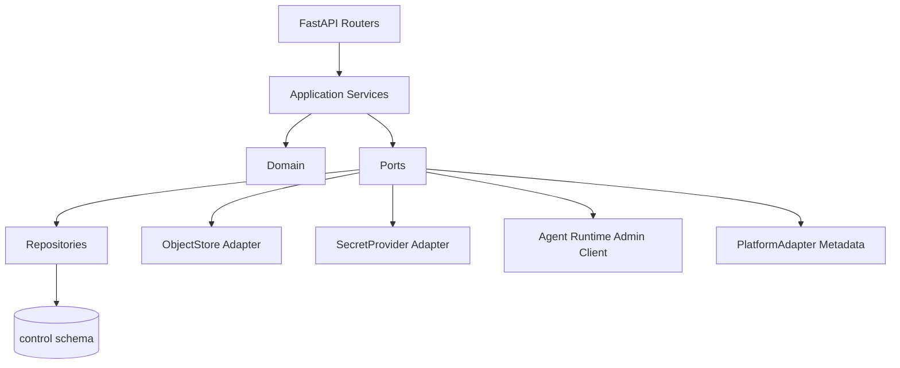
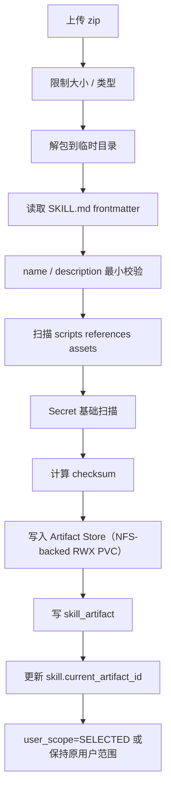
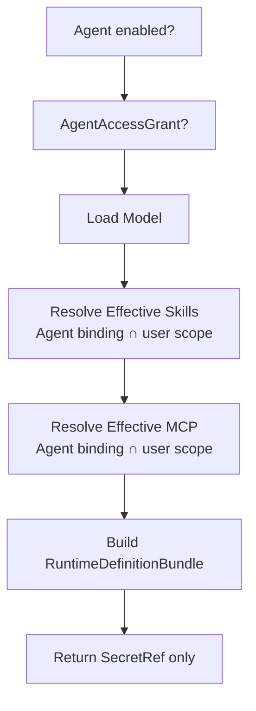
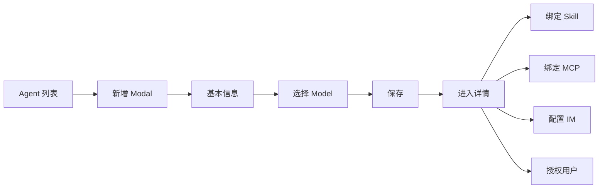
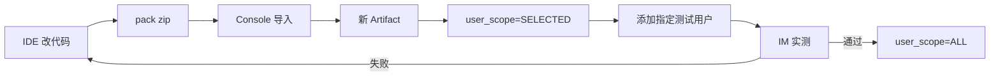

# 03 Console Platform 详细设计

## 1. 职责

`console-platform` 是 Agent Runtime 的控制面。它提供：

- React/Semi Design Console；
- Agent、Model、Skill、MCP CRUD；
- PlatformUser 与 AgentAccessGrant；
- ProjectPlatform、PlatformAdapter Metadata 与 CredentialRef；
- 企业微信 Bot 配置与绑定码；
- Skill Artifact 导入/校验/用户范围管理；
- Runtime Definition Resolve Internal API；
- 配置审计；
- Run/Memory 的管理查询入口；
- Background Task 与 Schedule 的管理查询/启停入口。

不执行 Agent，不执行 Skill，不维持 WeCom WS。

---

## 2. 后端分层



建议目录：

```text
backend/
├── api/
│   ├── agents.py
│   ├── skills.py
│   ├── mcp.py
│   ├── models.py
│   ├── users.py
│   ├── platforms.py
│   ├── runtime_internal.py
│   └── channel_internal.py
├── application/
│   ├── agent_service.py
│   ├── skill_import_service.py
│   ├── grant_service.py
│   ├── identity_service.py
│   └── runtime_definition_service.py
├── domain/
├── infrastructure/
│   ├── repositories/
│   ├── object_store/
│   └── secret_provider/
└── main.py
```

---

## 3. Console 页面结构

```text
首页/概览
Agent
Skill
MCP
模型
用户
项目平台
后台任务
定时任务
运行审计
```

### 3.1 统一列表规范

所有资源列表统一：

```text
┌────────────────────────────────────────────────────┐
│ [新增]                         [搜索][筛选][刷新]   │
├────────────────────────────────────────────────────┤
│                    Table                           │
├────────────────────────────────────────────────────┤
│                                  20条/页  < 1 2 > │
└────────────────────────────────────────────────────┘
```

- 页面进入后不重复展示“Tab 标题/页面说明”大块内容，直接进入工具栏和列表；
- 新增按钮：左上；
- 搜索/筛选：右上；
- 分页：右下；
- 新增/编辑：标准 Modal/Drawer，不在列表内直接铺大型表单；
- 时间：`YYYY-MM-DD HH:mm:ss`；
- 删除：二次确认；
- Secret：仅显示是否配置和引用，不回显明文。


### 3.2 Console 字段词典

同一个领域字段进入 Console 后必须全局使用同一中文名称：

| 领域字段/语义 | Console 统一名称 | 说明 |
|---|---|---|
| `name` | 名称 | 主展示字段，可点击进入详情 |
| `key` | 标识 | 平台内部稳定 key |
| `enabled` | 启用状态 | 只表示管理侧启停 |
| MCP `connection_status` | 连接状态 | 不与启用状态混用 |
| Model `last_test_status` | 测试状态 | 批量测试结果 |
| Task `status` | 任务状态 | QUEUED/RUNNING/... |
| Schedule `status` | 调度状态 | ACTIVE/PAUSED |
| `delivery_status` | 投递状态 | PENDING/SENT/... |
| `instructions` | 系统 Prompt | Agent 顶层系统指令 |
| Skill current artifact | 当前版本 | 不使用“当前制品版本” |
| Skill/MCP `user_scope` | 用户范围 | ALL=全部授权用户；SELECTED=指定用户 |
| Model `base_url` | Base URL | OpenAI-compatible 根地址 |
| Model `model_id` | 模型 ID | OpenAI 请求 `model` 字段 |
| ProjectPlatform `resolver_type` | 接入方式 | Base URL / 服务发现 |
| `resolver_config` | 访问配置 | Base URL 或服务名 |
| `external_user_id` | 外部用户 ID | IM 外部用户标识 |
| `bot_id` | bot_id | 不改写为“来源 bot_id” |
| MCP Tool `effect` | 操作类型 | READ/WRITE/EXTERNAL |
| `last_discovered_at` | 最近工具发现时间 | MCP tools/list 成功时间 |
| `started_at` / `finished_at` | 开始时间 / 完成时间 | 不合并为“开始 / 完成” |

数量字段统一使用“xx 数量/xx 数”，例如：`IM 通道数`、`授权用户数`、`使用 Agent 数`、`指定用户数`、`已配置用户凭据数`。

“状态”不得作为跨模块通用裸字段；必须通过列名明确是启用、连接、测试、任务、调度还是投递状态。

---

## 4. Agent 页面

### 4.1 Agent 列表

字段建议：

```text
名称 / 标识 / 模型 / Skill 数量 / MCP 数量 / IM 通道数 / 授权用户数 / 启用状态 / 修订版本 / 更新时间 / 操作
```

这里展示的是**逻辑 Agent Definition**，不是运行实例。

- `IM 通道数` 显示该 Agent 已配置的通道账号数量；一个 Agent 可配置多个企业微信 Bot 或未来其他 IM ChannelAccount；
- 不显示 Pod IP、Runtime replica、Pod 名称；
- Runtime/Worker/Redis/PostgreSQL 等健康状态属于外部运维体系，不进入业务 Console；
- 同一个 Agent 的请求可以在不同 Runtime Pod 上执行。

### 4.2 Agent 详情 Tabs

```text
基本信息
Skill
MCP
用户授权
IM 接入
```

“基本信息”内部统一展示 Agent 属性、模型、**系统 Prompt** 与最近运行；不再使用“指令”作为另一个字段名。


### 4.2.1 IM 接入交互

Agent 详情的“IM 接入”允许维护 0..N 条 ChannelAccount：

```text
企业微信机器人 A / bot_id=A ─┐
企业微信机器人 B / bot_id=B ─┼──> AgentDefinition
未来其他 IM Account       ───┘
```

约束：

- 一个 `bot_id` 只能绑定一个 Agent；
- 一个 Agent 可以绑定多个 `bot_id`；
- 删除/停用一个通道账号不影响该 Agent 的其他通道；
- 通道账号只绑定逻辑 Agent，不绑定 Runtime/Worker Pod。

### 4.3 更新规则

Agent 保存成功：

```text
revision = revision + 1
config_audit_log append
```

已运行 Run 不更新 Snapshot；下一次 Run 使用新 revision。

---

## 5. Skill 导入设计

### 5.1 导入流程



### 5.1.1 Skill 元数据原则

Console 不要求维护另一份复杂 `skill.yaml`。导入时从 `SKILL.md` frontmatter 提取 `name`、`description` 和可选 `execution`；脚本、参考资料和资源按目录扫描。Artifact 的版本、checksum 属于制品元数据；Skill 的 `user_scope` 和指定用户授权属于平台控制面元数据。

### 5.2 Artifact 不可变

- 相同 `skill_id + version` 不允许覆盖；
- 相同 checksum 可返回“已存在”；
- 修改代码必须产生新 Artifact；
- `current_artifact_id` 只是新 Run 的默认选择；
- 旧 Run Snapshot 继续引用旧 Artifact。

### 5.3 Skill Detail

Tabs：

```text
基本信息
版本记录
使用 Agent
指定用户
```

其中：

- “基本信息”展示名称、标识、执行模式、用户范围、当前版本、描述与 SKILL.md 预览；
- “版本记录”展示不可变 Artifact、校验和与校验结果；
- “使用 Agent”展示 AgentSkillBinding；
- “指定用户”只管理 `user_scope=SELECTED` 时的 SkillUserGrant；
- `user_scope=ALL` 时，“指定用户”页只提示“当前对所有拥有对应 Agent 使用权的用户开放”，不要求白名单。

Artifact 内容只读，不在 Console 编辑 Python。


---

## 6. User / Agent / Skill / MCP 权限解析

### 6.1 三类关系

```text
User -> Agent
    AgentAccessGrant

Agent -> Skill
    AgentSkillBinding

Agent -> MCP
    AgentMcpBinding

User -> Skill
    SkillUserGrant，仅 user_scope=SELECTED 时参与

User -> MCP
    McpUserGrant，仅 user_scope=SELECTED 时参与
```

它们回答三个不同问题：

1. **User -> Agent**：这个用户能不能使用这个 Agent；
2. **Agent -> Skill/MCP**：这个 Agent 理论上具备哪些能力；
3. **User -> Skill/MCP**：当资源为 SELECTED 时，这个能力对哪些 Agent 授权用户开放。

### 6.2 Skill

```text
AgentAccessGrant(user, agent)
AND AgentSkillBinding(agent, skill)
AND Agent enabled
AND Skill enabled
AND (
    Skill.user_scope = ALL
    OR SkillUserGrant(skill, user) exists
)
```

### 6.3 MCP

```text
AgentAccessGrant(user, agent)
AND AgentMcpBinding(agent, mcp)
AND Agent enabled
AND MCP enabled
AND (
    MCP.user_scope = ALL
    OR McpUserGrant(mcp, user) exists
)
```

### 6.4 关键语义

- `ALL` = “全部 Agent 授权用户”，不是平台所有用户；
- `ALL` 不会绕过 AgentSkillBinding/AgentMcpBinding；
- `SELECTED` 不会自动授予 AgentAccessGrant；
- Skill/MCP 用户授权是**资源级**，不是 `(user, agent, resource)` 三元授权；
- V1.3 不做 MCP Tool 级用户白名单；
- 未授权资源在 Runtime Definition 中完全不返回，因此：
  - `/skills` 不显示；
  - Skill Catalog 不出现；
  - MCP Tool Schema 不进入 ToolRegistry；
  - 错误信息不泄露“资源存在但无权使用”。


### 6.5 Console 管理位置

```text
用户详情
 -> Agent 授权
 -> 只管理 User -> Agent

Agent 详情
 -> Skill
 -> MCP
 -> 只管理 Agent -> Skill/MCP

Skill 详情
 -> 用户范围
 -> 指定用户
 -> 管理 Skill -> User

MCP 详情
 -> 用户范围
 -> 指定用户
 -> 管理 MCP -> User
```

不在任何页面建设 `User × Agent × Skill/MCP` 三元授权编辑器。

关系操作（绑定/解绑/授权/移除/变更用户范围）保存后立即影响**后续新 Run/Task**，不需要 Agent 详情顶部再做一次全局保存。已经开始的 Run/Task 继续使用 RuntimeSnapshot。


### 6.6 MCP 字段语义

MCP 列表/详情必须区分：

```text
启用状态 = enabled，管理员是否允许使用
连接状态 = connection_status，MCP Server 当前连接/发现结果
最近工具发现时间 = last_discovered_at
```

工具明细使用“操作类型”；V1 不提供 Tool 级启停，MCP Server 自身使用“启用状态/连接状态”。

MCP Tool Catalog 说明：

- Console 工具数/工具明细读取 `mcp_server.tool_catalog_json`；
- “刷新工具目录”调用显式 `discover-tools` 接口；
- V1 不提供 Tool 级用户白名单；
- Tool 的 READ/WRITE/EXTERNAL 只用于审计/策略。

### 6.7 Model 字段语义

当前仅支持 OpenAI-compatible：

```text
名称       = 人类可读名称
标识       = model_definition.key，平台内部稳定 key
协议       = OpenAI（当前只读）
Base URL   = model_definition.base_url
模型 ID    = model_definition.model_id，即 OpenAI 请求 model 字段
```

“标识”和“模型 ID”不得合并。新增/编辑模型支持修改全部字段；保存后 revision+1、测试状态重置为未测试；模型测试只提供列表批量测试入口。

当前不设计“平台默认模型”。Agent 创建/编辑必须显式选择 `model_definition.id`，不存在自动回退。

---

## 7. RuntimeDefinitionService

这是 Console 与 Runtime 最关键的控制面接口。

输入：

```json
{
  "agent_id": "uuid",
  "actor_user_id": "uuid",
  "channel": "WECOM"
}
```

执行：



输出中不包含 Secret Value。仅返回当前 `actor_user_id + agent_id` 的 Effective Skill/MCP；未授权资源的名称、描述、Tool Schema 不返回。Skill Artifact 同时返回解析后的 `execution_mode`，供 Runtime `ExecutionRouter` 使用。

---

## 8. 用户与授权

### 8.1 用户详情 Tabs

```text
基本信息
智能体授权
项目平台凭据
IM 身份
User Memory（通过 Runtime Admin API）
```

### 8.2 AgentAccessGrant 与资源级用户范围

授权关系唯一：

```text
(user_id, agent_id)
```

不对普通用户逐个授权 Skill 内部 API。

---


AgentAccessGrant 是用户进入 Agent 的第一层权限。

Skill/MCP 的指定用户授权不放到用户详情中作为新的三元关系编辑器，而由 Skill/MCP 资源详情维护：

```text
用户详情：User -> Agent
Agent 详情：Agent -> Skill/MCP
Skill/MCP 详情：Resource -> Selected Users
```

这样避免 Console 同时维护重复的 `User-Agent-Skill` / `User-Agent-MCP` 组合。

## 9. `/bind` 绑定码

### 9.1 生成

Console：

```text
用户详情 → IM 身份 → 生成绑定码
```

后端：

- 生成高熵随机码；
- DB 只存 `code_hash`；
- 默认 TTL 建议 10 分钟；
- 单次使用；
- 可以管理员主动 revoke。

### 9.2 消费

由 IM Gateway 调用 Internal API：

```text
POST /internal/channel/bind
```

事务：

1. `SELECT bind_code FOR UPDATE`；
2. 校验 hash/status/expire；
3. upsert `channel_identity`；
4. 标记 bind_code USED；
5. 返回 platform_user_id。

---

## 10. 项目平台与 PlatformAdapter

### 10.1 项目平台列表

列表字段：

```text
名称 / 标识 / 平台适配器 / 接入方式 / 访问配置 / 凭据策略 / 已配置用户凭据数 / 启用状态 / 更新时间 / 操作
```

**不展示**统一的“Bearer/OAuth2/API Key 认证方式”字段，因为真实平台的认证协议可能完全不同。

### 10.1.1 接入方式字段

`resolver_type` 与 `resolver_config` 必须在 UI 中拆开，不使用“访问地址 / 服务发现”单一文本框：

```text
BASE_URL
 -> 接入方式：Base URL
 -> 访问配置：base_url

SERVICE_DISCOVERY
 -> 接入方式：服务发现
 -> 访问配置：service_name
```

### 10.2 新增项目平台

步骤：

```text
选择 PlatformAdapter
 -> 根据 Adapter.platform_config_schema 动态渲染平台配置
 -> 选择接入方式（BASE_URL / SERVICE_DISCOVERY）并填写对应访问配置
 -> 选择凭据策略 credential_mode
 -> 保存
```

平台适配器下拉来自：

```text
GET /api/v1/platform-adapters
```

示例：

```text
MSSW 平台适配器
MSSP 平台适配器
通用 HTTP Session 适配器
...
```

选择 Adapter 后，Console 根据 Schema 动态渲染字段，不为每个平台手写前端页面。

### 10.3 项目平台详情 Tabs

```text
基本信息
凭据管理
```

“平台配置”“凭据定义”合并到基本信息；“调用测试”作为详情右上角对象级操作，不单独占 Tab。

#### 基本信息

展示：

```text
名称
标识
平台适配器
接入方式
访问配置
凭据策略
已配置用户凭据数
启用状态
更新时间
```

#### 平台配置

由 `platform_config_schema` 动态渲染，例如某平台可能要求：

```text
base_url
login_endpoint
health_endpoint
branch_tag
csrf_enabled
```

这些字段是示例，实际字段由 Adapter 声明。

#### 凭据定义

只读展示 Adapter 的 `credential_schema`，例如：

```text
AK
SK
```

或者：

```text
username
password
domain
```

Console 不持有真实 Secret Value。

#### 用户凭据

```text
PlatformUser
 -> ProjectPlatform
 -> 根据 credential_schema 填写凭据
 -> Secret Provider
 -> UserCredentialRef.secret_ref
```

共享凭据同理，只是主体为平台级。

### 10.4 PlatformAdapter Metadata

Adapter 是 Python 代码注册项，不是数据库脚本。Console 只消费 Metadata：

```json
{
  "key": "mssw",
  "name": "MSSW 平台适配器",
  "version": "1",
  "platform_config_schema": {...},
  "credential_schema": {...},
  "session_mode": "SESSION"
}
```

新增平台时：

- 如果已有 Adapter 能覆盖：只创建 ProjectPlatform；
- 如果认证/签名/Session 协议不同：开发新的 PlatformAdapter，并随应用发布。

### 10.5 CredentialRef

用户级：

```text
UserCredentialRef(user_id, platform_id, secret_ref)
```

共享级：

```text
SharedCredentialRef(platform_id, secret_ref, priority)
```

`credential_mode` 决定 Resolver 选择策略：

```text
USER_ONLY
SHARED_ONLY
USER_THEN_SHARED
NONE
```

它不代表具体认证协议。


## 11. 前端关键流程

### 11.1 Agent 创建



### 11.2 Skill 快改快传




### 11.3 后台任务页面

后台任务是运维/管理视图，不要求普通用户进入 Console。

列表字段建议：

```text
任务 ID / 业务意图 / Agent / 执行用户 / Skill / 触发方式 / 任务状态 / 子任务进度 / 开始时间 / 完成时间 / 投递状态 / 操作
```

支持：

- 按 Agent/User/Skill/Status/时间筛选；
- 查看 Parent/Child 树；
- 查看 Task Timeline；
- 查看 execution snapshot；
- 查看最终 Artifact；
- 管理员取消仍未完成的 Task；
- 不在 Console 手工编辑 Task 的业务输入。

### 11.4 定时任务页面

定时任务主要由用户通过 Agent 创建；Console 提供管理员可见性和必要治理。

列表字段：

```text
名称 / Agent / 执行用户 / 业务意图 / Skill / 调度规则 / 时区 / 下次触发时间 / 最近触发时间 / 调度状态 / 操作
```

允许：

- PAUSE / RESUME；
- 查看历史触发 Task；
- 删除；
- 查看原始用户创建来源与 delivery route；
- 不允许 Console 把定时任务改造成 Workflow 编排器。

定时任务变更只影响未来触发；已经创建的 TaskExecution 不漂移。

历史触发必须按 `task_execution.schedule_id = 当前 schedule.id` 查询并按 `create_time DESC` 展示，禁止在不同 Schedule 详情复用同一组硬编码历史记录。

---

## 12. 事务边界

必须单事务：

- bind code 消费 + identity 建立；
- Agent 更新 + revision++ + audit log；
- Skill Artifact DB 元数据写入 + current artifact 更新（NFS Artifact 写入在事务外，失败需清理或标 orphan）；
- grant 增删 + config audit。

不得把文件复制/校验或外部网络调用放在 DB transaction 内。

---

## 13. Console 错误码

| 错误码 | HTTP | 说明 |
|---|---:|---|
| `AGENT_NOT_FOUND` | 404 | Agent 不存在 |
| `AGENT_DISABLED` | 409 | Agent 已禁用 |
| `AGENT_ACCESS_DENIED` | 403 | 无 AgentAccessGrant |
| `SKILL_PACKAGE_INVALID` | 400 | 包结构/manifest 不合法 |
| `SKILL_VERSION_EXISTS` | 409 | 版本已存在 |
| `MCP_CONFIG_INVALID` | 400 | MCP 配置错误 |
| `BIND_CODE_INVALID` | 400 | 绑定码无效 |
| `BIND_CODE_EXPIRED` | 410 | 已过期 |
| `CREDENTIAL_MISSING` | 409 | 平台认证未配置 |

---

## 14. Console 内部非职责

以下逻辑不得回流 Console：

- Tool dispatch；
- Model retry；
- Context compaction；
- Skill execute；
- MCP Tool execute；
- WeCom ACK；
- SSE stream formatting。
