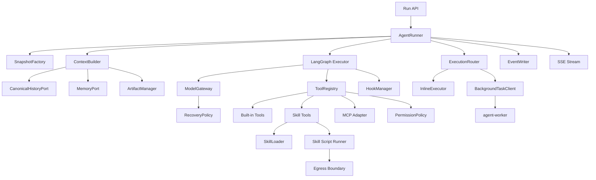
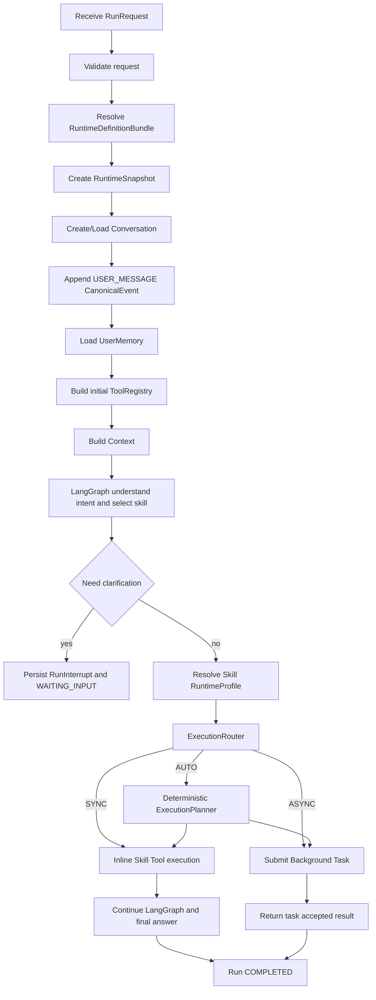
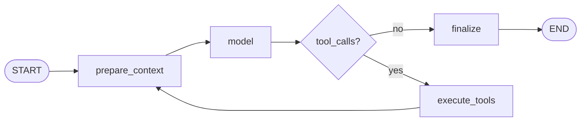
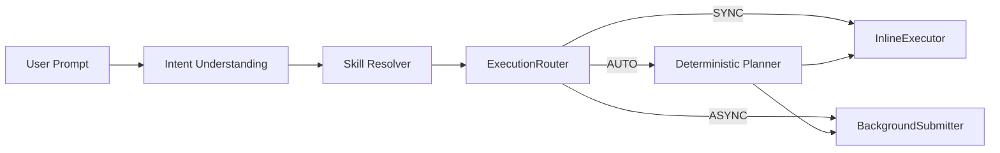
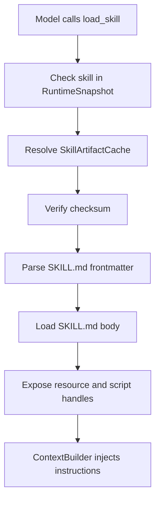
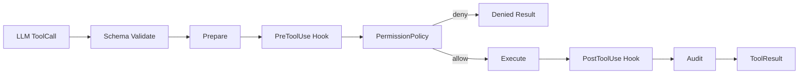
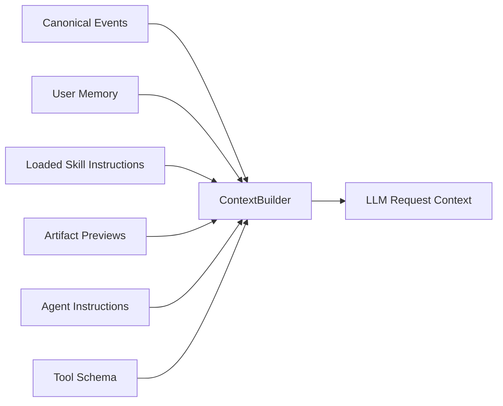
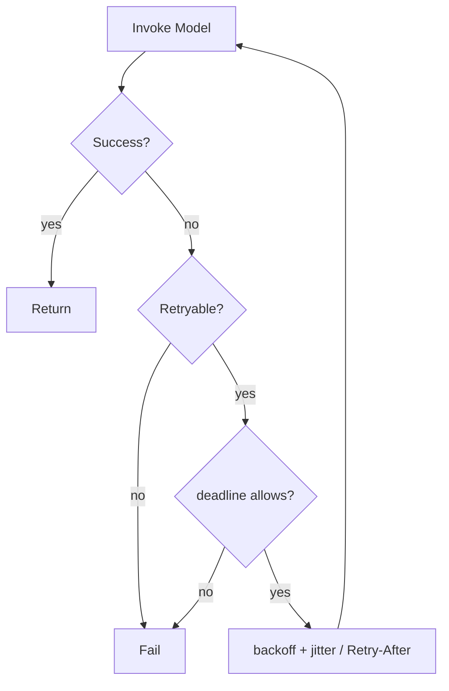

# 04 Agent Runtime 详细设计

## 1. 目标

Agent Runtime 是实时交互执行服务，必须同时满足：

- Python + LangGraph；
- 完全无状态；
- Skill-first；
- Skill Lazy Load；
- Unified ToolRegistry；
- MCP 统一 Tool 化；
- Canonical History 与 Request Context 分离；
- User Memory 外置；
- RuntimeSnapshot 版本确定；
- Model Recovery；
- Artifact 外置；
- Hook/Policy 可扩展；
- HTTP/SSE Streaming；
- Business Intent 与 Execution Policy 分离；
- Background/Schedule Task 提交。

---

## 1.1 从 learn-agent 吸收的 Harness 原则

本 Runtime 不照搬 learn-agent 的 TypeScript 实现，而吸收其工程边界：

1. Agent Loop 保持小，复杂能力放到 ToolRegistry/Hook/Context/Recovery 周围；
2. Skill 采用渐进式披露：catalog -> SKILL.md -> resources/scripts；
3. Tool 调用统一经过 prepare/schema/hook/policy/audit；
4. Canonical History 是事实源，发给模型的是可裁剪 Request Context；
5. 大结果转 Artifact，避免重复塞入上下文；
6. Model Recovery 尊重 deadline/cancel/retry budget；
7. MCP Tool 适配后进入同一 ToolRegistry；
8. Background/Cron 已被真实旅程证明需要，纳入 V1.2；Multi-Agent/Worktree 仍不引入。

---

## 2. 内部架构



---

## 3. 目录建议

```text
packages/agent-core/
├── agent/
│   ├── runner.py
│   ├── graph.py
│   ├── state.py
│   └── snapshot.py
├── prompt/
│   ├── builder.py
│   └── providers.py
├── skill/
│   ├── catalog.py
│   ├── loader.py
│   ├── executor.py
│   └── adapter.py
├── tools/
│   ├── definition.py
│   ├── registry.py
│   ├── prepare.py
│   ├── executor.py
│   └── result.py
├── mcp/
│   ├── client.py
│   └── adapter.py
├── hooks/
│   └── manager.py
├── policy/
│   └── engine.py
├── context/
│   ├── builder.py
│   ├── budget.py
│   ├── compaction.py
│   └── history.py
├── memory/
│   └── port.py
├── artifact/
│   └── manager.py
├── model/
│   ├── gateway.py
│   ├── provider.py
│   └── recovery.py
└── telemetry/
```

---

## 4. AgentRunner 生命周期



---

## 5. LangGraph Graph 边界

建议最小 Graph：



LangGraph 只持有：

```python
class AgentGraphState(TypedDict):
    run_id: str
    conversation_id: str
    request_messages: list
    loaded_skills: list[str]
    tool_registry_revision: int
    iteration: int
    interrupt: dict | None
```

不得把完整 Console ORM Entity 放入 Graph State。

---

## 5.1 Runtime Pod 与逻辑 Agent 的关系

```text
logical Agent A ─┐
logical Agent B ─┼─> agent-runtime Service ─> Pod 1 / Pod 2 / Pod N
logical Agent C ─┘
```

Runtime Pod 不预加载“自己的 Agent”，也不维护 `agent_id -> pod` 映射。每次 Run 都以 `agent_id` 为输入，由当前被负载均衡选中的 Pod 获取 RuntimeDefinition、创建 Snapshot 并执行。

---

## 6. RuntimeSnapshotFactory

### 6.1 创建时机

每个新 Run 在第一轮模型调用前创建。

### 6.2 步骤

```text
Console Internal API resolve
→ 校验 Agent enabled + access grant
→ 得到 Model/Skill/MCP bundle
→ canonical normalize
→ hash
→ runtime_snapshot insert
→ run_record.snapshot_id update
```


### 6.2.1 Effective Capability 解析

Console Platform 的 `resolve-definition` 不返回“Agent 绑定的全部资源”，而只返回当前用户的 Effective Skill/MCP：

```text
Effective Skill
=
AgentAccessGrant
∩ AgentSkillBinding
∩ Skill user_scope

Effective MCP
=
AgentAccessGrant
∩ AgentMcpBinding
∩ MCP user_scope
```

因此 Runtime 在进入 PromptBuilder 前得到的已经是**用户有效能力集合**：

```text
resolve-definition
 -> effective_skills
 -> SkillCatalog

resolve-definition
 -> effective_mcp_servers
 -> MCP tools/list
 -> ToolRegistry
```

未授权 Skill：

- 不进入 Skill Catalog；
- `load_skill` 无法按名字发现；
- 不进入 Prompt；
- 不返回“存在但无权”的旁路提示。

未授权 MCP：

- 不建立 MCP ToolDefinition；
- 工具名、描述、JSON Schema 不进入 ToolRegistry/Prompt。

这比“让模型先看到、执行时再 403”更安全，也能减少上下文噪音。

### 6.2.2 为什么不能执行阶段再 403

如果 Runtime 先把 Agent 绑定的全部 Skill/MCP 暴露给模型，再在真正执行时检查用户授权，会产生两个问题：

1. 未授权资源的名称、描述、Tool Schema 已经泄露给 LLM；
2. 模型可能持续选择一个最终必然被拒绝的能力，造成错误体验和上下文浪费。

因此授权判定必须发生在：

```text
Agent Definition Resolve
 -> Effective Capability Resolve
 -> RuntimeSnapshot
 -> SkillCatalog / ToolRegistry
 -> PromptBuilder
```

而不是：

```text
PromptBuilder
 -> LLM
 -> Tool Call
 -> 403
```

### 6.3 Snapshot 冻结与实时项

| 配置 | 当前 Run |
|---|---|
| Agent instructions/revision | 冻结 |
| Model/params | 冻结 |
| Effective Skill artifact/version/checksum | 冻结 |
| Effective MCP endpoint/tool schema | 冻结 |
| Secret value | 不冻结，调用时解析 |
| Egress emergency deny | 实时 |
| cancel | 实时 |

---


## 6.4 单一 Business Intent 与 Execution Policy

Agent 的职责是理解用户要完成的业务目标，不负责自由决定底层执行生命周期。

示例：

```text
用户：
“帮 A 客户做一次策略检查”

Agent 解析：
intent_key = policy_check
parameters = {customer: A}
resolved_skill = policy-check
```

随后进入 `ExecutionRouter`。



**图说明**：

- LLM 负责 `Intent Understanding + Skill Selection`；
- Runtime 负责 `Execution Routing`；
- 不允许模型直接输出 `use_async=true` 并绕过 Runtime 策略；
- 同一意图可因 Trigger/Skill Profile 采用不同物理执行方式。

### 6.4.1 执行策略来源

优先级：

```text
1. SCHEDULED trigger -> 强制 Background
2. Skill Artifact execution_mode = ASYNC -> Background
3. Skill Artifact execution_mode = SYNC -> Inline
4. execution_mode = AUTO -> Deterministic ExecutionPlanner
```

`AUTO` 可使用的确定性信号：

- Skill/脚本返回 `BackgroundDirective`；
- 需要 durable wait / external async task；
- 请求被明确构造成 Batch Parent Task；
- 系统配置的硬约束。

禁止仅用“LLM 觉得可能耗时较长”作为判断。

### 6.4.2 为什么不使用时间阈值

不采用“>30 秒异步、<30 秒同步”之类规则。一个 `create_scan` HTTP 调用可能 200ms 返回，但真实扫描需要数小时。判断标准是是否需要 **durable lifecycle**，而不是单次 HTTP 延迟。


## 7. Skill Catalog + Progressive Disclosure

### 7.1 Skill 不等于一个固定函数 Tool

V1.2 延续将 Skill 定义为 `SKILL.md + 可选 scripts/references/assets`。Runtime 不再要求每个 Skill 必须有 `skill.yaml` 或固定 `entrypoint`。

Skill 加载分三层：

```text
L1 Catalog       : name + description
L2 Instructions  : 完整 SKILL.md
L3 Resources     : scripts/references/assets 按需读取或执行
```

这与 learn-agent 强调的渐进式加载一致：大量 Skill 可以挂到同一个 Agent，但初始 Prompt 只包含当前用户的 Effective Skill Catalog，因此既控制 catalog 成本，也不会暴露未授权 Skill。

### 7.2 初始 Prompt

只注入：

```text
Skill key
name
description
platform_label（如有）
```

### 7.3 内置 Skill Tools

ToolRegistry 常驻四个框架工具：

```text
load_skill(skill_key)
read_skill_resource(skill_key, path)
execute_skill(skill_key, input)
run_skill_script(skill_key, script_path, args)
```

其中：

- `load_skill` 加载并注入完整 SKILL.md；
- `read_skill_resource` 读取 references/assets 中按需资料；
- `execute_skill` 是业务执行的统一边界：先进入 `ExecutionRouter`，再选择 Inline 或 Background；它不是为每个 Skill 单独生成一个 Tool；
- `run_skill_script` 是已进入某个 Skill 执行上下文后的脚本原语，执行 Skill 自带 Python 脚本，脚本通过受控 `SkillContext` 调业务平台/MCP。

### 7.4 加载流程



> **图说明**：Skill 的业务流程仍由 SKILL.md 和脚本表达；平台只负责发现、按需加载、资源访问和安全执行，不重复建设 Workflow DSL。

---


### 7.4.1 为什么需要通用 `execute_skill`

Skill 不是固定函数 Tool，但同步/异步必须存在一个统一的生命周期切换点。

推荐对话过程：

```text
Catalog
 -> load_skill
 -> 根据 SKILL.md 澄清/补齐输入
 -> execute_skill(skill_key, normalized_input)
 -> ExecutionRouter
```

同步 Skill 的 `execute_skill` 在当前 Runtime 中建立 `SkillExecutionSession`，允许继续使用 `run_skill_script/read_skill_resource/MCP`。

异步 Skill 的 `execute_skill` 不在当前 Pod 继续跑业务步骤，而是将规范化输入与 Snapshot 提交给 Worker。这样 Agent 仍然只理解一个业务意图，且执行策略有明确的框架控制点。

### 7.5 内置任务工具

ToolRegistry 增加框架级 Tool：

```text
create_schedule
list_schedules
update_schedule
delete_schedule
get_task
list_tasks
cancel_task
```

这些 Tool 不让 LLM 直接写 task schema，而是调用 Agent Worker API。

对于即时异步执行，`ExecutionRouter` 可直接调用 `BackgroundTaskClient.submit()`；不要求 LLM 再显式调用一个“异步 Tool”。


## 8. ToolRegistry

### 8.1 ToolDefinition

```python
@dataclass(frozen=True)
class ToolDefinition:
    name: str
    description: str
    input_schema: dict
    kind: Literal["BUILTIN", "SKILL", "MCP"]
    effect: Literal["READ", "WRITE", "EXTERNAL"]
    handler: ToolHandler
    metadata: dict
```

### 8.2 执行链



### 8.3 PreparedToolCall

Tool 参数完成 normalize 后形成不可变对象：

```python
@dataclass(frozen=True)
class PreparedToolCall:
    call_id: str
    tool_name: str
    args: Mapping[str, Any]
    args_hash: str
    effect: str
```

Hook/审批/审计看到的和真正执行的必须是同一 PreparedToolCall。

---

## 8.1 SkillArtifactCache（NFS PVC + local emptyDir）

Runtime 不直接从共享 NFS 目录执行 Skill。

```text
共享事实源：
/mnt/muad-artifacts/{storage_key}

Pod 本地执行缓存：
/var/cache/muad/skills/{checksum}/
```

每次 `load_skill / execute_skill` 都调用：

```python
local_path = await skill_artifact_cache.ensure(
    artifact_id=artifact_id,
    storage_key=storage_key,
    checksum=checksum,
)
```

内部顺序：

```text
L1 memory map
 -> local READY
 -> miss -> per-checksum singleflight
 -> copy skill.zip from NFS
 -> checksum
 -> unzip to temp
 -> atomic rename
 -> READY
```

cache hit 不访问 NFS；Pod 重建后缓存消失是正常行为。


## 9. MCP Adapter

### 9.1 发现

Run 创建后只对 Snapshot 中已经通过用户范围过滤的 Effective MCP Server：

```text
connect/list_tools
→ namespace
→ MCP ToolDefinition
→ ToolRegistry
```

工具命名：

```text
mcp::<server_key>::<tool_name>
```

### 9.2 约束

- V1 仅 `streamable-http`；
- endpoint 来自 Snapshot；
- Secret Value 从 SecretProvider 解析；
- Tool execute 必须走 ToolRegistry Hook/Policy/Audit；
- 单个 Server 工具数设置上限；
- discovery 结果允许 Redis 短期 cache，但 Snapshot 记录本 Run 使用的 schema hash。

---

## 10. ContextBuilder

### 10.1 输入来源



### 10.2 Context Budget

预算优先级：

```text
1. System/Agent Instructions
2. 当前用户输入
3. 当前 Run 必要 Tool/Skill 结果
4. 最近对话
5. User Memory
6. 较旧历史摘要
```

不得修改 CanonicalEvent 以实现压缩。

### 10.3 大结果

若 Tool Result 超过阈值：

```text
full result -> Artifact Store
request context -> preview + ArtifactRef
canonical event -> metadata + artifact_id
```

---

## 11. User Memory

### 11.1 Read

Run 开始时按：

```text
tenant_id + platform_user_id + enabled=true
```

加载受控条目。

### 11.2 Write

V1 仅允许：

- 用户明确要求“记住”；
- 明确的稳定偏好；
- 受控规则生成的候选并通过 MemoryWriter policy。

不得写入：

- 实时客户设备；
- 扫描状态；
- 当前权限；
- 临时任务结果。

---

## 12. Hook 生命周期

```text
on_user_message
pre_model
post_model
pre_tool_use
post_tool_use
on_interrupt
on_stop
```

Phase 1 Hook 只在代码层注册，不做动态 Hook Console。

应用场景：

- Trace；
- 脱敏；
- 业务审计；
- Tool 参数防护；
- 结果过滤；
- 未来安全策略。

---

## 13. PermissionPolicy

最小决策：

```text
ALLOW
DENY
ASK
```

默认：

- `load_skill`：ALLOW；
- 只读平台调用：按 Egress Policy；
- 明确高风险写 Tool：ASK 或 DENY；
- 未知/未注册 Tool：DENY。

Phase 1 不做复杂 Policy DSL。

---

## 14. ModelGateway 与 Recovery



处理：

- 429；
- 5xx/529；
- connection reset；
- timeout；
- cancellation；
- prompt too long（触发一次 Context rebuild/compaction）。

必须满足：

```text
retry wait <= remaining deadline
```

---

## 15. Interrupt / Resume

### 15.1 触发

当需要澄清/确认：

```text
LangGraph interrupt
→ run_interrupt insert
→ run_record WAITING_INPUT
→ SSE interrupt.required
```

### 15.2 Resume

```text
POST /v1/runs/{run_id}/resume
→ validate WAITING_INPUT
→ resolve interrupt
→ append user canonical event
→ LangGraph resume
```

---

## 16. Cancellation

`/stop`：

```text
Gateway -> POST /v1/runs/{id}/cancel
Runtime:
  DB cancel_requested=true
  Redis run:cancel:{id}=1  # hint
  CancellationToken set
  Model/Tool cooperative cancel
  status=CANCELLED
```

Phase 1 不承诺已经提交到外部系统的不可逆业务动作自动回滚。

---

## 17. Streaming

SSE 事件：

```text
run.created
message.delta
skill.loaded
tool.started
tool.completed
artifact.created
task.accepted
interrupt.required
run.completed
run.failed
heartbeat
```

Gateway 只消费面向渠道需要的事件；Audit 事件不要求全部转给最终用户。

---

## 18. Agent Runtime API 边界

对 IM Gateway：

```text
POST /v1/runs
POST /v1/runs/{run_id}/resume
POST /v1/runs/{run_id}/cancel
POST /v1/conversations
GET  /v1/runs/{run_id}
```

对 Console Admin：

```text
GET /internal/admin/runs
GET /internal/admin/runs/{run_id}
GET /internal/admin/users/{user_id}/memory
DELETE /internal/admin/users/{user_id}/memory/{memory_id}
```

Runtime 调 Console：

```text
POST /internal/runtime/resolve-definition
POST /internal/runtime/resolve-egress-access
```

Runtime 调 Agent Worker：

```text
POST /internal/tasks
POST /internal/schedules
GET  /internal/tasks/{task_id}
POST /internal/tasks/{task_id}/cancel
```

---

## 19. 无状态 Architecture Gate

- Runtime 不得从 Agent binding 全量加载 Skill/MCP 后再由执行阶段做用户权限拒绝；必须在 Prompt/ToolRegistry 构建前完成用户范围过滤。


以下代码审查直接判失败：

- `global dict[user_id] = conversation`；
- 本地文件保存 Memory/Conversation；
- 依赖 sticky session；
- 通过 Runtime Pod 名判断用户归属；
- Skill Artifact 只保存在本地磁盘且无 NFS Artifact Store source-of-truth；
- Runtime 缓存成为唯一配置来源。
