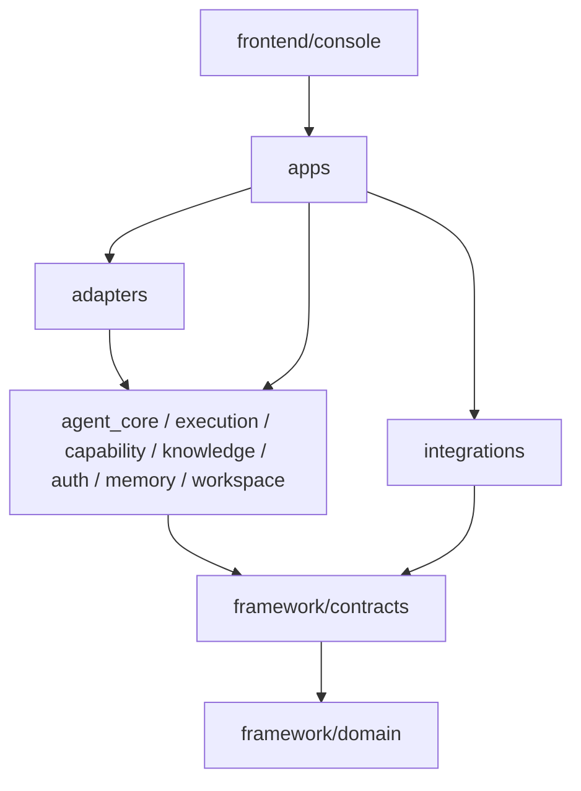
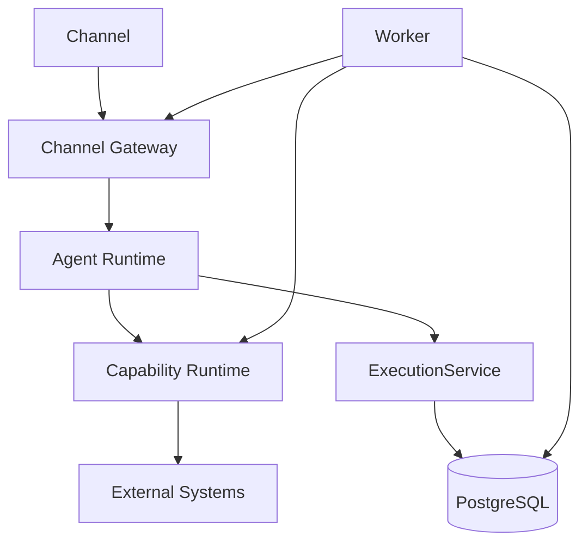

# 模块划分与依赖矩阵

## 1. 模块到运行角色映射

| 模块 | 类型 | platform-api | agent-runtime | worker | channel-gateway | 是否独立部署 |
|---|---|---:|---:|---:|---:|---:|
| 核心领域与发布模型 | Core Library | ✅ | ✅ | ✅ | 仅 Contract | 否 |
| Platform API 与控制面 | App | ✅ | - | - | - | ✅ |
| Agent Runtime | App | - | ✅ | - | - | ✅ |
| Agent Core / AgentExecutor | Core Library | - | ✅ | ✅ | - | 否 |
| ExecutionService | Application Library | ✅ | ✅ | - | - | 否 |
| Worker Engine | App/Core | - | - | ✅ | - | ✅ |
| Capability Runtime | Core Library | 按管理测试 | ✅ | ✅ | - | 否 |
| Knowledge Runtime | Core Library | 按管理测试 | ✅ | ✅ Agent Step | - | 否 |
| Auth Runtime | Core Library | 按管理测试 | ✅ | ✅ | - | 否 |
| Channel Gateway | App | - | 调用目标 | Delivery 目标 | ✅ | ✅ |
| Workspace/Sandbox | Core + Adapter | 按配置 | ✅ | ✅ | - | 否 |
| Conversation/User Memory | Core Library | 管理 | ✅ | 按 Agent Step | - | 否 |
| Project Integration/Registry | Extension | 装配 | 装配 | 装配 | 可装配 Channel | 否 |
| Storage/Infrastructure | Adapter | ✅ | ✅ | ✅ | ✅ | 外部基础设施独立 |
| Observability/Web Common | Core Library | ✅ | ✅ | ✅ logging | ✅ TS 侧同 Contract | 否 |
| Console Frontend | Frontend | 静态资源承载 | - | - | - | 不单独镜像 |

## 2. 核心依赖方向



说明：图表示代码依赖方向，不表示网络调用方向。

## 3. 禁止依赖

```text
framework/** -> integrations/**
framework/domain -> FastAPI
framework/domain -> SQLAlchemy ORM
framework/domain -> WeCom/某项目 SDK
agent-runtime -> subprocess / os.system
worker -> 具体 Channel SDK
ServiceDefinition -> 具体业务 URL
```

## 4. 运行调用关系



## 5. 模块设计模板选择

| 模块 | 模板 | 理由 |
|---|---|---|
| Core/Control/Agent/Execution/Worker/Capability/Knowledge/Auth/Channel/Workspace/Memory/Integration | design-full | 数据、接口、可靠性、安全和跨模块边界较多 |
| Storage/Observability | design-lite | 支撑模块，逻辑较集中 |
| Console | design-frontend | 页面、组件、路由、UI 四态与交互为主 |
