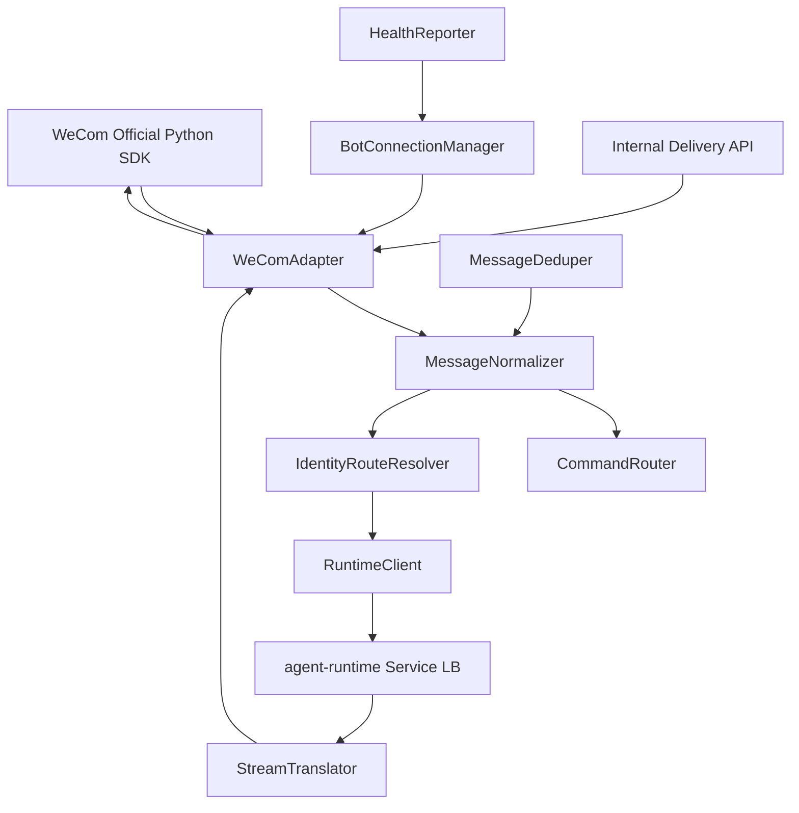
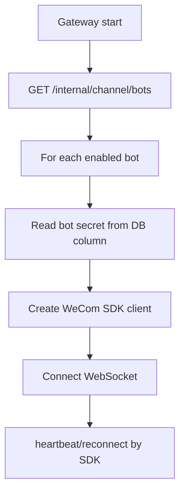
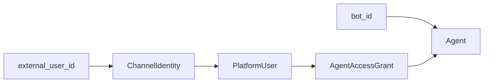
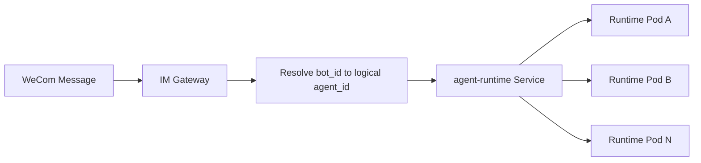
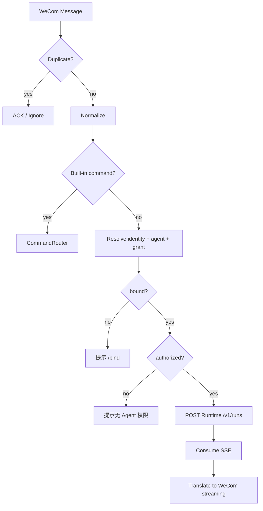
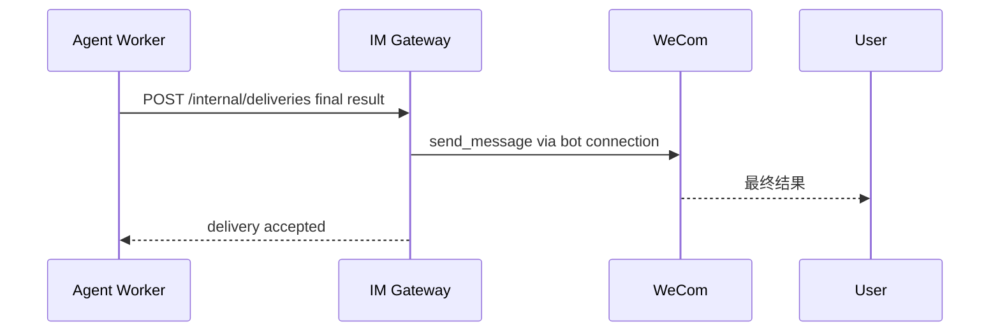

# 05 IM Gateway 详细设计

## 1. 定位

IM Gateway 是渠道协议适配层。**每个 `bot_id` 绑定一个逻辑 AgentDefinition；一个 Agent 可以配置多个 IM 通道账号；任何通道账号都不绑定 Agent Runtime/Worker Pod。**当前只实现企业微信 WeCom Adapter，但内部设计支持未来其他 Channel Adapter。

后端统一 Python，企业微信协议层直接复用官方 Python AI Bot SDK。

---

## 2. 内部结构



目录：

```text
im-gateway/
├── channels/
│   ├── base.py
│   └── wecom/
│       ├── adapter.py
│       ├── connection.py
│       ├── normalize.py
│       └── stream.py
├── application/
│   ├── command_router.py
│   ├── identity_router.py
│   └── runtime_client.py
├── infrastructure/
│   ├── console_client.py
│   └── redis_dedupe.py
└── main.py
```

---

## 3. ChannelAdapter SPI

```python
class ChannelAdapter(Protocol):
    async def start(self) -> None: ...
    async def stop(self) -> None: ...
    async def iter_events(self) -> AsyncIterator["ChannelEnvelope"]: ...
    async def send(self, route: "ChannelRoute", message: "OutboundMessage") -> None: ...
    async def stream(self, route: "ChannelRoute", events: AsyncIterator["StreamEvent"]) -> None: ...
```

`start()` 之后由 `iter_events()` 产出规范化后的 `ChannelEnvelope`；Gateway 业务层不依赖 WeCom 原始 SDK 类型。

---

## 4. ChannelEnvelope

```json
{
  "channel": "WECOM",
  "bot_id": "bot_xxx",
  "external_user_id": "wotv...",
  "external_conversation_id": "...",
  "message_id": "msg_xxx",
  "message_type": "text",
  "text": "帮 A 客户做一次策略检查",
  "attachments": [],
  "received_at": "2026-09-17T11:00:00+08:00",
  "raw_metadata": {}
}
```

Runtime 不接触 WeCom 原始帧。

---


### 4.1 Agent 与 IM 通道的 1:N 关系

```text
Agent A
├── WeCom Bot 1 (bot_id_1)
├── WeCom Bot 2 (bot_id_2)
└── Future Channel Account N
```

Gateway 启动/配置刷新时按 ChannelAccount 建立连接；收到消息后先通过当前连接上下文或 `bot_id` 得到 `agent_id`。Agent Runtime 不感知“哪个 Pod 属于哪个 Bot”。

一个 ChannelAccount 被停用，只断开该账号连接，不影响同 Agent 的其他账号。

## 5. BotConnectionManager

### 5.1 启动



Bot secret 由 Gateway 从 Bot 快照的明文字段读取（DB 存储）；Console Internal API 返回该字段。

### 5.2 动态刷新

Gateway 启动时全量拉取 `GET /internal/channel/bots`，之后每 30s 轮询该接口；`revision` 变化即热更新连接。变更 Bot 配置后，不要求重启整个 Gateway。

---

## 6. 身份、路由、授权

三者严格分离。这里的 `Agent` 均指 Console 中的逻辑 AgentDefinition：



> **图说明**：每条 `bot_id -> agent_id` 只决定“这个通道账号用哪个逻辑 Agent 配置”；同一个 `agent_id` 可以被多条 bot_account 引用。IM Gateway 随后把请求发送给 `agent-runtime` Service，由 K8s/LB 选择任意 Runtime Pod。Gateway 不保存 `agent_id -> pod`。

普通消息解析调用：

```text
POST /internal/channel/resolve
```

返回：

```json
{
  "bound": true,
  "platform_user_id": "uuid",
  "agent_id": "uuid",
  "authorized": true
}
```

未绑定：

```json
{"bound": false, "agent_id": "uuid", "authorized": false}
```

---

## 6.1 Runtime 随机路由



约束：

- Runtime 扩容、滚动升级、Pod 重建不修改 BotAccount；
- 同一用户 Turn 1/Turn 2 可以落到不同 Pod；
- Conversation、Memory、Run、Snapshot 均从外部状态重建；
- IM Gateway 不做 sticky routing。

---

## 7. 内置命令

### 7.1 `/bind <code>`

Gateway 本地识别命令，不发送 LLM。

### 7.2 `/skills`

调用 Console 获取当前 actor + Agent 的 **Effective Skill Catalog**，只显示 name/platform_label/description。该结果已经同时满足 AgentAccessGrant、AgentSkillBinding、Skill.user_scope 与指定用户 Grant；无权限 Skill 不返回。

### 7.3 `/new`

调用 Runtime：

```text
POST /v1/conversations
```

创建新的 Conversation；不改变身份、Agent、Memory。

### 7.4 `/stop`

Gateway 不查询、不缓存 active run，仅在 `/stop` 时发起一次调用：

```text
POST /v1/runs/cancel-active
{
  "agent_id": "uuid",
  "platform_user_id": "uuid"
}
```

- 无活跃 Run：返回 `404 NO_ACTIVE_RUN`，回复“当前没有执行中的任务”；
- 有活跃 Run：`WAITING_INPUT` 直接 CAS 置 `CANCELLED`；`CREATED/RUNNING` 写 `cancel_requested` + Redis hint 并返回 `status="CANCELLING"`，回复受理文案“正在停止当前任务…”。

---

## 8. 普通消息流程



---

## 9. 去重

Redis：

```text
SET im:dedupe:WECOM:{message_id} 1 NX EX 600
```

若 Redis 不可用：

- Gateway 可以降级继续处理；
- 通过 WeCom SDK 的 message id 与 Runtime idempotency 尽量降低重复；
- Redis 不作为业务事实源。

---

## 10. SSE -> WeCom Streaming

Runtime SSE 事件全集（与 07 §3 一致）：

```text
run.created
message.delta
skill.loaded
tool.started
tool.completed
task.accepted
artifact.created
interrupt.required
run.completed
run.failed
```

`heartbeat` 是 SSE 注释帧（`:` 开头），直接忽略，不作为事件处理。

Gateway 处理策略：

- 所有事件按 `seq` 保证顺序；
- `run.created`：捕获 `run_id`；`resumed:true` 表示 Runtime 已将本次消息自动作为 `WAITING_INPUT` Run 的 resume 输入；
- `message.delta` 按 SDK 最小发送间隔节流；
- `tool.started` 展示策略由 Gateway 统一控制，默认不展示；
- `task.accepted`：finalize 当前流并展示受理文案；
- `artifact.created`：不面向 IM 用户提供 Artifact 下载，大结果消息只给摘要（完整结果可在 Console 运行审计查看）；
- `interrupt.required` 立即 flush；
- `run.completed` finalize stream；
- `run.failed` 输出可理解错误；
- SSE 流未收到终态而断开：向用户提示“服务暂时中断，请重发消息”，该 Run 由 Runtime lease 回收为 `FAILED(RUN_ABANDONED)`。

---


## 10.1 Background Final Delivery

后台任务默认 `delivery_mode=FINAL_ONLY`。Agent Runtime 在提交 Task/Schedule 时持久化 `DeliveryRoute`，Worker 完成后调用：

```text
POST /internal/deliveries
```

请求必须携带 `delivery_key`（格式 `task:{task_id}:final`）。IM Gateway 根据 `bot_id + external_user_id/external_conversation_id` 使用官方 WeCom SDK 主动推送，并用 Redis 去重：

```text
SET delivery:dedupe:{delivery_key} 1 NX EX 604800
```

重复请求直接返回 200；Redis 不可用时按 at-least-once 继续发送。



**图说明**：

- Bot 仍绑定逻辑 Agent，不绑定 Worker；
- Worker 不维护 WeCom WebSocket；
- 任务完成事实与消息投递状态分离；发送失败时 Worker 可重试 Delivery；
- 默认不推送每个 Child Task 的中间进度，避免批量任务刷屏。


## 11. 错误映射

| Runtime/Console 错误 | IM 用户提示 |
|---|---|
| `IDENTITY_NOT_BOUND` | 请先使用 `/bind <绑定码>` 完成身份绑定 |
| `AGENT_ACCESS_DENIED` | 当前账号未获得该智能体使用权限 |
| `AGENT_DISABLED` | 当前智能体暂不可用 |
| `RUN_BUSY` | 当前会话已有任务执行中，可发送 /stop 停止 |
| `NO_ACTIVE_RUN` | 当前没有执行中的任务 |
| `CANCEL_REQUESTED` | 正在停止当前任务… |
| `RUN_CANCELLED` | 当前任务已停止 |
| `MODEL_UNAVAILABLE` | 服务暂时繁忙，请稍后重试 |

不向用户暴露内部堆栈、URL、SecretRef。

---

## 12. Health

`/healthz`：进程活着。

`/readyz` 至少检查：

- Console Internal API 可达或已有可用 bot snapshot；
- Bot secret 字段存在或已有缓存 bot secret；
- 必要 Bot connection manager 已初始化；
- Event loop 正常。

Metrics：

```text
wecom_ws_connected{bot_id}
im_messages_total{channel,type}
im_message_failures_total{reason}
im_runtime_request_latency_ms
im_stream_latency_ms
im_dedupe_hits_total
im_background_delivery_total{status}
```

---

## 13. 扩展到其他 Channel

未来新增 Adapter 只实现：

```text
raw event -> ChannelEnvelope
OutboundMessage/StreamEvent -> channel protocol
external identity extraction
connection lifecycle
```

入站事件规范化由 Adapter 的 `iter_events()` 负责：原始帧转换为 `ChannelEnvelope`（含 `message_id`、`external_user_id`、`external_conversation_id` 等），Gateway 核心只消费规范化事件，不感知通道原始协议。

不复制 Identity、AgentAccessGrant、Conversation、Memory、Runtime 逻辑。
