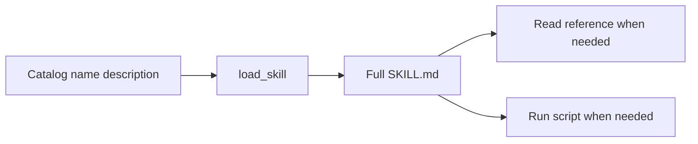
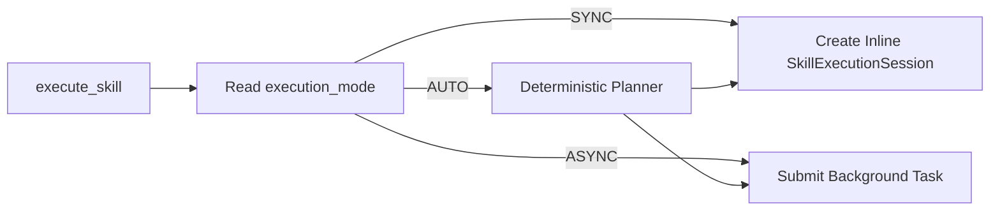
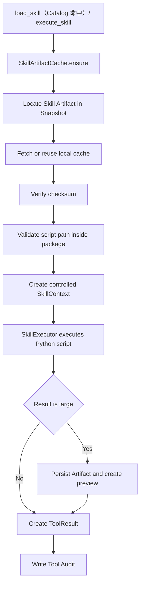
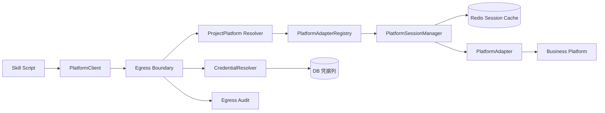
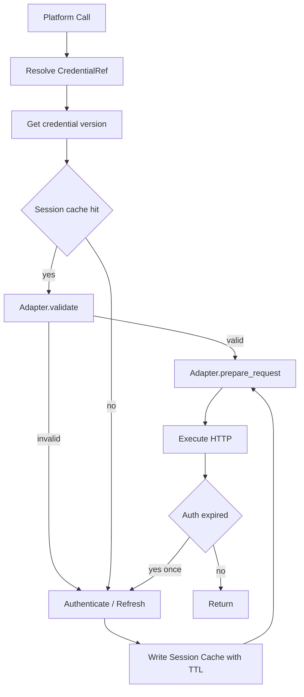

# 06 Skill SDK 与 Egress Boundary 详细设计

## 1. 设计目标

Skill 继续保持最接近 OpenClaw/Agent Skills 的开发体验：**SKILL.md 描述何时使用和怎么做，scripts/ 承载需要确定性处理的 Python 逻辑**。平台不再要求开发者把接口、数据转换、条件和循环拆成 Capability，也不要求维护一份复杂的 `skill.yaml`。

Runtime 只抽离必须统一的基础设施：

- 用户/共享凭据解析；
- Secret 获取与注入；
- 业务平台逻辑寻址；
- Trace/Audit；
- Artifact；
- Tool/MCP 调用边界。

---

## 2. Skill Package

### 2.1 最小目录

```text
policy-check/
├── SKILL.md
├── scripts/
│   └── main.py          # 可选
├── references/          # 可选
├── assets/              # 可选
└── tests/               # 可选
```

V1 **不要求 `skill.yaml`**。

### 2.2 SKILL.md

使用最小 frontmatter：

```markdown
---
name: policy-check
description: 为指定客户执行设备策略检查；当用户要求策略检查、基线检查或检查异常策略时使用。
execution: async
platform_label: MSS
---

# 设备策略检查

## Workflow
1. 确认客户唯一；
2. 查询客户设备；
3. 用户确认检查范围；
4. 按需要调用 scripts/main.py；
5. 汇总异常和建议。

## Constraints
- 客户不唯一时必须询问；
- 不得猜测设备范围；
- 底层权限不足时返回真实授权失败。
```

导入时 Console 从 SKILL.md frontmatter 提取 `name/description/execution/platform_label`：`name + description` 用于 Skill Catalog；`execution` 是可选的最小 Runtime 元数据，取值 `sync|async|auto`，缺省为 `sync`；`platform_label` 为可选人类标签，允许缺失。正文只在 `load_skill` 后进入上下文。版本、checksum 属于平台 Artifact 元数据；`user_scope` 和指定用户授权属于控制面元数据，不在 SKILL.md 重复维护。

### 2.3 为什么不再使用复杂 skill.yaml

复杂 manifest 会重新引入双重事实源：业务流程在 SKILL.md/代码里一份，平台 manifest 又维护一份接口依赖、schema、entrypoint。V1 内部 Skill 都是受控代码，因此采用：

```text
SKILL.md = Agent 可读的使用说明和流程规则
scripts/ = 数据处理、接口串接、算法
Platform = Artifact/版本/Agent 绑定/用户范围授权/审计/解析后的 execution_mode
```

仅当未来出现第三方 Skill、强沙箱或自动依赖审批需求时，再增加独立 manifest。

---


### 2.4 `execution` 为什么保留在 SKILL.md frontmatter

该字段只回答一个运行时问题：

```text
这个 Skill 默认应在当前实时请求内完成，还是提交 durable background task？
```

取值：

| 值 | 含义 |
|---|---|
| `sync` | 当前 Agent Runtime 内联执行 |
| `async` | 由 ExecutionRouter 提交 Agent Worker |
| `auto` | 允许确定性 ExecutionPlanner 根据 durable wait/batch/directive 决定 |

它**不描述**：

- 业务步骤；
- 接口 URL；
- 输入/输出 schema；
- for/if/while；
- 分页；
- retry；
- fan-out 规则。

这些仍然在 SKILL.md 正文和 scripts 中。导入时 Console 将 `execution` 规范化为 `skill_artifact.execution_mode`，Runtime 只读数据库/Definition Bundle 中的解析结果。

定时任务不依赖这个字段决定是否进 Worker：`SCHEDULED` 触发一律进入 Worker。


### 2.5 Skill 用户范围不进入 SKILL.md

Skill 包只描述“这个业务能力是什么、怎么执行”，不描述“哪些平台用户可以使用”。

用户范围由控制面维护：

```text
Skill.user_scope = ALL | SELECTED

SELECTED
 -> control.skill_user_grant
```

这样同一份不可变 Artifact 可以在不重新打包的情况下调整指定用户；调整只影响后续新 Run/Task。

`ALL` 仍然要求：

```text
用户有 AgentAccessGrant
AND
Agent 已绑定该 Skill
```

所以 `ALL` 不是全平台公开，也不是自动绑定所有 Agent。

## 3. Progressive Disclosure



**图说明**：Runtime 启动时不加载所有 Skill 正文。模型先根据少量 name/description 判断是否需要 Skill，再加载完整说明；references 和 scripts 继续按需使用，避免上下文膨胀。

---


## 3.1 Skill 执行入口

在模型已经加载 SKILL.md、完成必要澄清后，统一调用：

```text
execute_skill(skill_key, normalized_input)
```



**图说明**：`execute_skill` 是同步/异步切换点；`run_skill_script` 只是 SkillExecutionSession 内部的脚本原语，不能取代 ExecutionRouter。


## 4. SkillExecutor



**图说明**：此处不再把 Skill 包装成 `skill::<key>` 固定 Tool。ToolRegistry 常驻的是框架工具 `load_skill/read_skill_resource/execute_skill/run_skill_script`；`load_skill`（Catalog 命中）与 `execute_skill` 都先经 `SkillArtifactCache.ensure`，再由 `SkillExecutor` 执行脚本。具体业务流程由已加载的 SKILL.md 指导，脚本只是其中可按需执行的一部分。

### 4.1 本地 cache

V1 文件来源：

```text
Artifact Store = NFS-backed RWX PVC
/mnt/muad-artifacts
```

Runtime/Worker 执行目录：

```text
emptyDir
/var/cache/muad/skills/{checksum}/
```

```text
load_skill（Catalog 命中）/ execute_skill
 -> SkillArtifactCache.ensure(artifact_id, storage_key, checksum)
 -> memory/local READY hit? 直接执行
 -> miss 才读取 NFS
 -> copy + checksum + unzip temp
 -> atomic rename
 -> READY
 -> SkillExecutor
```

同一 Pod 对同一 checksum 使用 singleflight。


---

### 4.2 Python 依赖策略

V1 不允许 Skill 在运行时执行任意 `pip install`。

Runtime/Worker 基础镜像统一提供 Python 标准库、平台 Skill SDK 和批准的公共依赖。Skill 包不携带独立虚拟环境，也不在运行时修改 Python 环境。

未来确有冲突/特殊依赖时再引入独立 Runner Image。


## 5. Skill Public API

脚本使用稳定 `SkillContext`，不 import Runtime/Console 内部代码。

```python
class SkillContext(Protocol):
    user: UserContext
    logger: SkillLogger
    artifact: ArtifactClient
    platform: PlatformClient
    http: HttpClient
    mcp: McpClient
    task: TaskContext
```

`ctx.http` 提供 `get/post/request`，一律经 Egress Boundary，规则见 §6.8。

### 5.1 PlatformClient

推荐只暴露**逻辑平台调用**，不让 Skill 随意拼真实 host：

```python
customer = await ctx.platform.call(
    platform="mss",
    service="customer-service-mgr",
    operation="get_customer",
    payload={"customer_id": "C-1001"},
)
```

如果某平台只能按 HTTP path 工作：

```python
resp = await ctx.platform.request(
    platform="mss",
    method="GET",
    path="/api/customer/C-1001",
)
```

Skill 看不到实际 Token/Cookie/Password。

### 5.2 MCP

优先由 Agent Runtime 的 MCP Adapter 作为 Tool 暴露给模型。只有脚本确实需要确定性调用 MCP 时，才通过：

```python
hits = await ctx.mcp.call("knowledge", "search", {"q": "策略偏差"})
```

---


### 5.3 TaskContext

TaskContext 仅在 Worker/后台执行场景提供，用于确定性地创建子任务或等待外部任务：

```python
children = await ctx.task.map(
    items=customers,
    script="scripts/check_one.py",
    max_concurrency=10,
)
```

该接口形成 Parent/Child Task 并由 Worker fan-out/fan-in。它表示一个业务意图的多个执行实例，不创建多个 Agent。

对于简单 Skill，可以完全不使用 `ctx.task`。

### 5.4 HttpClient

当 Skill 必须直连受控 HTTP 服务（例如已进入部署 allowlist 的内部 API）时：

```python
resp = await ctx.http.get(
    "https://mss-internal.example/api/devices",
    timeout=10,
)
```

`ctx.http` 不绕过 Egress Boundary，完整规则见 §6.8。


## 6. Egress Boundary

### 6.1 定位

Egress Boundary 是 Runtime/Worker 共享的**业务平台访问边界**，不是独立 Image，也不是简单的“给 HTTP Header 塞 Token”。

旧项目经验表明，不同平台可能存在完全不同的：

- 登录流程；
- AK/SK 或 HMAC 签名；
- Cookie/Session；
- CSRF；
- challenge；
- Session health check；
- refresh；
- 每请求动态签名。

因此 V1.3 使用 PlatformAdapter：



**图说明**：

1. Skill 只表达 `platform/service/operation/path` 等业务调用信息；
2. ProjectPlatform 解析真实平台实例和 `adapter_key`；
3. CredentialResolver 根据 `credential_mode` 找用户或共享 SecretRef；
4. PlatformSessionManager 根据 Adapter 能力复用/刷新 Session；
5. PlatformAdapter 完成登录、签名、Cookie、CSRF 或请求认证；
6. Runtime/Worker 只拿 PreparedRequest，不把 Secret/Session 写进 LLM Context。

### 6.2 PlatformAdapter 接口

权威定义见 12 §3.1：

```python
class PlatformAdapter(Protocol):
    key: str
    name: str
    version: str
    session_mode: Literal["NONE", "SESSION", "REQUEST_SIGNING"]

    platform_config_schema: dict
    credential_schema: dict

    async def authenticate(
        self,
        platform: PlatformConfig,
        credential: SecretValue,
    ) -> PlatformSession | None:
        ...

    async def validate(
        self,
        platform: PlatformConfig,
        session: PlatformSession,
    ) -> bool:
        ...

    async def prepare_request(
        self,
        platform: PlatformConfig,
        session: PlatformSession | None,
        request: PlatformRequest,
        credential: SecretValue | None,
    ) -> PreparedRequest:
        ...
```

`refresh` 不是独立方法，刷新逻辑属于 `authenticate` 内部实现。对于“每请求签名”的平台，`authenticate()` 可以不生成长期 Session，由 `prepare_request()` 每次计算签名。

### 6.3 Adapter Registry

```text
PlatformAdapterRegistry
├── mssw -> MSSWAdapter
├── mssp -> MSSPAdapter / shared protocol adapter
├── generic_http_session -> GenericHTTPSessionAdapter
└── ...
```

Registry 是受控代码注册表。

**不支持**：

- Console 上传任意 Python Adapter；
- 数据库保存认证执行代码；
- Skill 自己绕过 Registry 获取 Secret。

### 6.4 ProjectPlatform 解析

`ProjectPlatform` 只保存：

```text
key
name
resolver_type
resolver_config
adapter_key
adapter_config
adapter_schema_version
credential_mode
enabled
```

其中 `adapter_config` 只允许非敏感配置。

### 6.5 Credential 解析

```text
USER_ONLY
  -> UserCredentialRef(user, platform)

SHARED_ONLY
  -> SharedCredentialRef(platform)

USER_THEN_SHARED
  -> UserCredentialRef
  -> missing 时 SharedCredentialRef

NONE
  -> credential = None
```

随后从凭据表读取 `credential_json`（`credential_schema` 定义的明文凭据）。

`credential` / `session` 是否可选由 `session_mode` 决定：

```text
NONE            -> credential = None，session = None
REQUEST_SIGNING -> credential 可选，authenticate 可选
SESSION         -> credential + PlatformSession
```

Secret Value 禁止写入：

```text
RuntimeSnapshot
TaskExecution
CanonicalEvent
Audit
日志
LLM Context
PlatformSession Cache 的原始 credential 字段
```

### 6.6 PlatformSessionManager

Session Cache Key 建议：

```text
platform_session:
  {tenant_id}:
  {platform_id}:
  {actor_scope}:
  {credential_version}:
  {adapter_key}:
  {adapter_version}
```

流程：



**图说明**：

- Session 是派生缓存，Redis 丢失后重新认证；
- Runtime/Worker Pod 本地 Session 不是权威源；
- 凭据更新通过 `credential_version/fingerprint` 让旧 Session 自动失效；
- 同一 Session Key 需要短锁/SingleFlight，避免多个 Pod 同时重复登录；
- 认证失败最多执行受控的一次 refresh/re-auth，避免无限登录循环；
- `session_mode=NONE` 时 `credential/session` 均为 `None`，跳过 authenticate 与 Session Cache；`REQUEST_SIGNING` 的 `credential` 与 `authenticate` 可选。

### 6.7 V1.3 必要检查

由于系统整体在内网、Skill 为内部受控代码，只做必要控制：

1. ProjectPlatform 存在且启用；
2. adapter_key 已注册，配置通过 Schema 校验；
3. 当前 actor 的用户/共享凭据可用；
4. Session 失效可以重建；
5. timeout、请求大小、有限重试；
6. 调用审计和日志脱敏。

仍不引入：

- 独立 egress-proxy Image；
- 通用 URL Policy DSL；
- Service Mesh 零信任；
- 对内部 Skill 的恶意代码强沙箱。


### 6.8 `ctx.http` 出口规则

`ctx.http.get/post/request` 与 PlatformClient 一样必须经过 Egress Boundary：

- host 必须命中租户/部署级 allowlist，allowlist 来源为平台配置，不写入 SKILL.md；
- `timeout` 必填；
- 禁止重定向到未授权 host；
- 响应体上限 5 MiB，超限按错误返回；
- 审计 `target_type=HTTP`，记录 host/method/status/耗时/大小；
- Skill 禁止直接 `import httpx/requests/aiohttp`，由入口静态检查拦截。

Egress `target_type` 统一为 `PLATFORM_SERVICE/HTTP/MCP`。


---

## 7. 本地开发与联调

### 7.1 Mock

```python
ctx = MockSkillContext()
ctx.platform.when(...).returns(...)
await run(ctx, input)
```

### 7.2 Dev 联调

```text
PyCharm / pytest
  -> Skill SDK Dev Client
  -> 开发环境 Runtime/Egress API
  -> 指定测试用户 Credential
  -> 内部业务平台
```

生产与本地保持同一 SkillContext 语义。

---

## 8. Artifact 导入校验

导入时只做：

- 必须存在 `SKILL.md`；
- frontmatter `name/description` 有效；
- 路径穿越检查；
- Python/资源文件基础大小限制；
- 基础 Secret Scan；
- checksum；
- 可选脚本语法检查。

不解析业务流程，不要求把脚本内调用复制成配置。

---

## 9. 未来升级条件

以下真实需求出现后再扩展：

- 第三方不可信 Skill：独立 Sandbox + Physical Egress Proxy；
- 大量 Skill 需要静态依赖审批：增加可选 manifest；
- 长任务/跨进程恢复：已由 Agent Worker 落地；
- 复杂可视化编排：有明确业务需求后再评估 Workflow。
