# 08 关键流程、时序与状态机详细设计

## 1. `/bind` 首次绑定时序

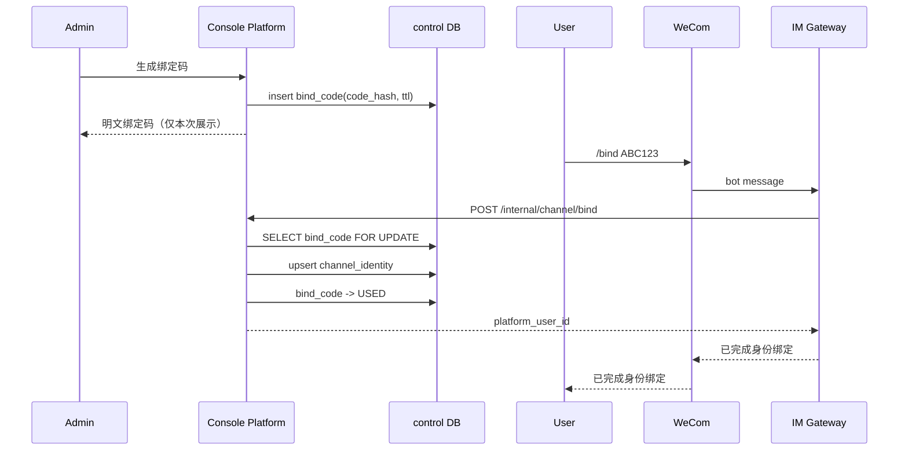
```mermaid
sequenceDiagram
    participant A as Admin
    participant CP as Console Platform
    participant DB as control DB
    participant U as User
    participant WC as WeCom
    participant IG as IM Gateway

    A->>CP: 生成绑定码
    CP->>DB: insert bind_code(code_hash, ttl)
    CP-->>A: 明文绑定码（仅本次展示）

    U->>WC: /bind ABC123
    WC->>IG: bot message
    IG->>CP: POST /internal/channel/bind
    CP->>DB: SELECT bind_code FOR UPDATE
    CP->>DB: upsert channel_identity
    CP->>DB: bind_code -> USED
    CP-->>IG: platform_user_id
    IG-->>WC: 已完成身份绑定
    WC-->>U: 已完成身份绑定
```

关键规则：

- `/bind` 只建立 ChannelIdentity → PlatformUser；
- 不绑定 Agent；
- 不创建 AgentAccessGrant；
- `bot_id -> logical agent_id` 由 BotAccount 决定；不绑定 Runtime Pod。

---

## 2. 普通对话时序

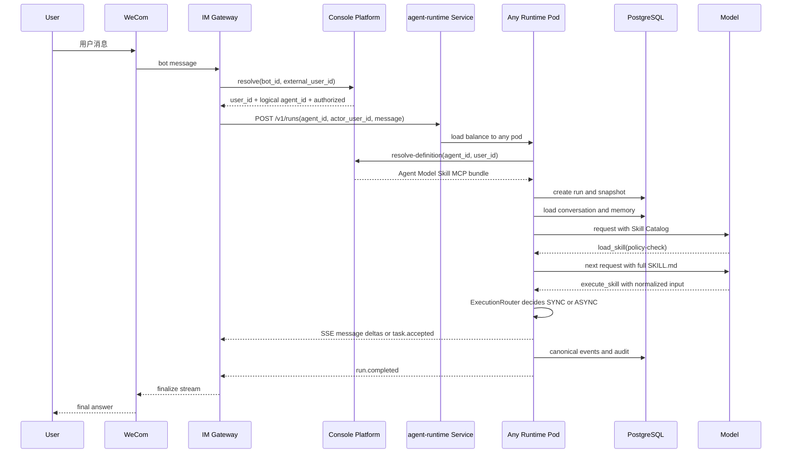
```mermaid
sequenceDiagram
    participant U as User
    participant WC as WeCom
    participant IG as IM Gateway
    participant CP as Console Platform
    participant RS as agent-runtime Service
    participant AR as Any Runtime Pod
    participant PG as PostgreSQL
    participant LLM as Model

    U->>WC: 用户消息
    WC->>IG: bot message
    IG->>CP: resolve(bot_id, external_user_id)
    CP-->>IG: user_id + logical agent_id + authorized
    IG->>RS: POST /v1/runs(agent_id, actor_user_id, message)
    RS->>AR: load balance to any pod
    AR->>CP: resolve-definition(agent_id, user_id)
    CP-->>AR: Agent Model Skill MCP bundle
    AR->>PG: create run and snapshot
    AR->>PG: load conversation and memory
    AR->>LLM: request with Skill Catalog
    LLM-->>AR: load_skill(policy-check)
    AR->>LLM: next request with full SKILL.md
    LLM-->>AR: execute_skill with normalized input
    AR->>AR: ExecutionRouter decides SYNC or ASYNC
    AR-->>IG: SSE message deltas or task.accepted
    AR->>PG: canonical events and audit
    AR-->>IG: run.completed
    IG-->>WC: finalize stream
    WC-->>U: final answer
```

**图说明**：Service/LB 才负责选择 Runtime Pod。下一轮消息再次进入 Service，可命中另一个 Pod；由于 Conversation、Memory、Snapshot 都外置，结果应保持一致。

---

## 2.1 Effective Capability 解析时序

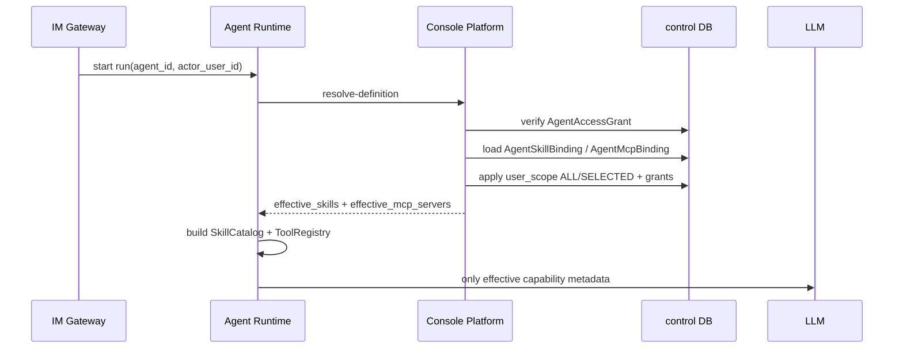
```mermaid
sequenceDiagram
    participant IG as IM Gateway
    participant AR as Agent Runtime
    participant CP as Console Platform
    participant DB as control DB
    participant LLM as LLM

    IG->>AR: start run(agent_id, actor_user_id)
    AR->>CP: resolve-definition
    CP->>DB: verify AgentAccessGrant
    CP->>DB: load AgentSkillBinding / AgentMcpBinding
    CP->>DB: apply user_scope ALL/SELECTED + grants
    CP-->>AR: effective_skills + effective_mcp_servers
    AR->>AR: build SkillCatalog + ToolRegistry
    AR->>LLM: only effective capability metadata
```

未授权能力不会先暴露给模型再在执行时拒绝。

## 3. Skill Lazy Load + 脚本执行时序

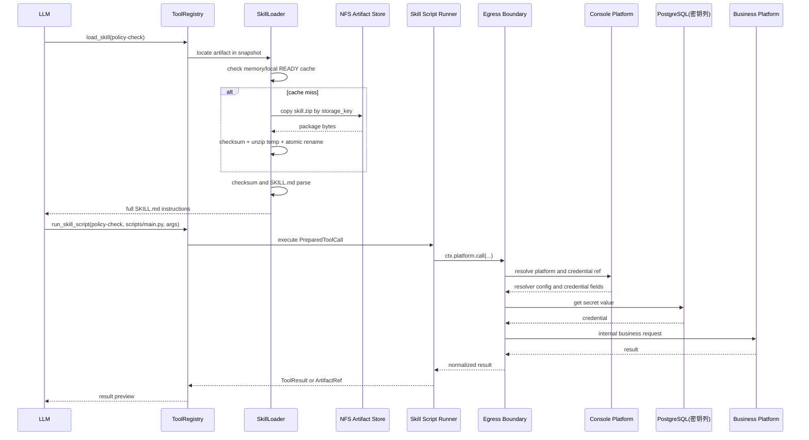
```mermaid
sequenceDiagram
    participant L as LLM
    participant TR as ToolRegistry
    participant SL as SkillLoader
    participant FS as NFS Artifact Store
    participant SR as Skill Script Runner
    participant EB as Egress Boundary
    participant CP as Console Platform
    participant SP as PostgreSQL(密钥列)
    participant BIZ as Business Platform

    L->>TR: load_skill(policy-check)
    TR->>SL: locate artifact in snapshot
    SL->>SL: check memory/local READY cache
    alt cache miss
        SL->>FS: copy skill.zip by storage_key
        FS-->>SL: package bytes
        SL->>SL: checksum + unzip temp + atomic rename
    end
    SL->>SL: checksum and SKILL.md parse
    SL-->>L: full SKILL.md instructions

    L->>TR: run_skill_script(policy-check, scripts/main.py, args)
    TR->>SR: execute PreparedToolCall
    SR->>EB: ctx.platform.call(...)
    EB->>CP: resolve platform and credential ref
    CP-->>EB: resolver config and credential fields
    EB->>SP: get secret value
    SP-->>EB: credential
    EB->>BIZ: internal business request
    BIZ-->>EB: result
    EB-->>SR: normalized result
    SR-->>TR: ToolResult or ArtifactRef
    TR-->>L: result preview
```

**图说明**：SKILL.md 是流程说明，脚本是可选确定性实现；没有 `skill.yaml -> 动态 skill::<key> Tool` 这一层。所有脚本执行仍进入 ToolRegistry，从而统一 Hook、审计和错误处理。

---

## 4. MCP Tool 时序

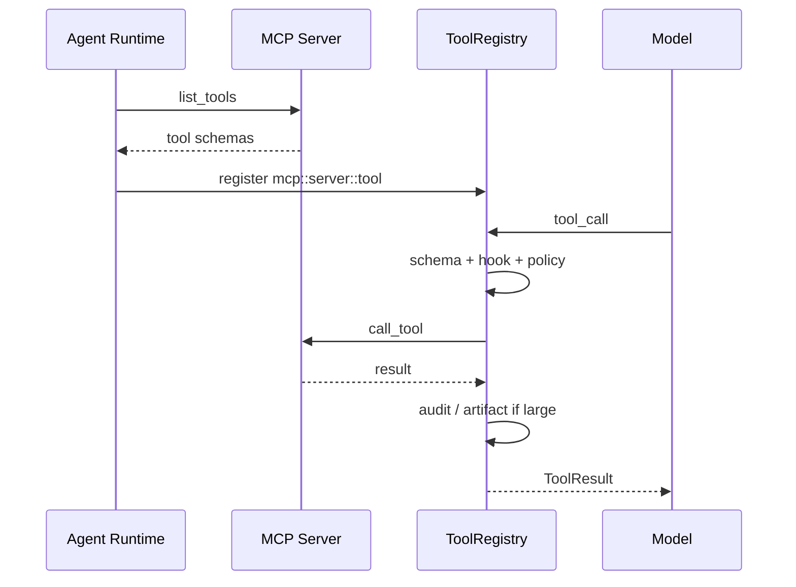
```mermaid
sequenceDiagram
    participant AR as Agent Runtime
    participant MCP as MCP Server
    participant TR as ToolRegistry
    participant LLM as Model

    AR->>MCP: list_tools
    MCP-->>AR: tool schemas
    AR->>TR: register mcp::server::tool
    LLM->>TR: tool_call
    TR->>TR: schema + hook + policy
    TR->>MCP: call_tool
    MCP-->>TR: result
    TR->>TR: audit / artifact if large
    TR-->>LLM: ToolResult
```

---

## 5. 会话内澄清/确认时序

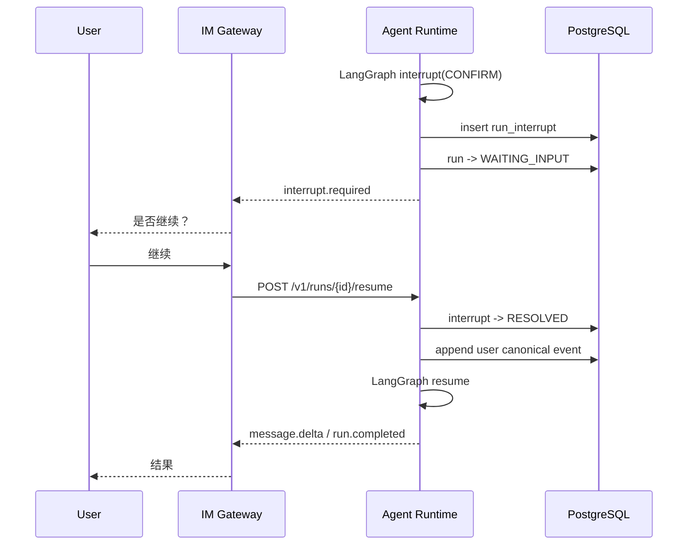
```mermaid
sequenceDiagram
    participant U as User
    participant IG as IM Gateway
    participant AR as Agent Runtime
    participant PG as PostgreSQL

    AR->>AR: LangGraph interrupt(CONFIRM)
    AR->>PG: insert run_interrupt
    AR->>PG: run -> WAITING_INPUT
    AR-->>IG: interrupt.required
    IG-->>U: 是否继续？

    U->>IG: 继续
    IG->>AR: POST /v1/runs/{id}/resume
    AR->>PG: interrupt -> RESOLVED
    AR->>PG: append user canonical event
    AR->>AR: LangGraph resume
    AR-->>IG: message.delta / run.completed
    IG-->>U: 结果
```

---

## 6. `/stop` 取消时序

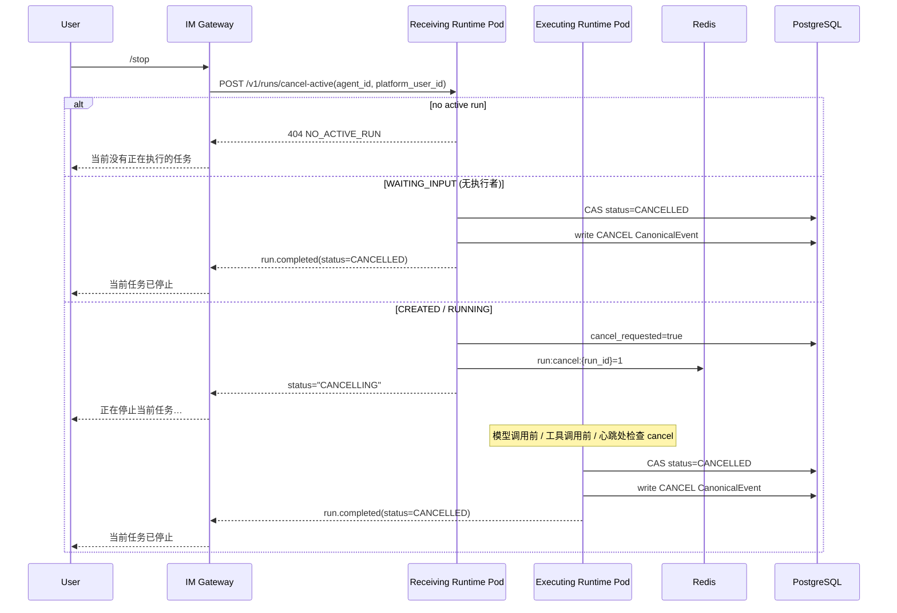
```mermaid
sequenceDiagram
    participant U as User
    participant IG as IM Gateway
    participant RP as Receiving Runtime Pod
    participant EP as Executing Runtime Pod
    participant RD as Redis
    participant PG as PostgreSQL

    U->>IG: /stop
    IG->>RP: POST /v1/runs/cancel-active(agent_id, platform_user_id)
    alt no active run
        RP-->>IG: 404 NO_ACTIVE_RUN
        IG-->>U: 当前没有正在执行的任务
    else WAITING_INPUT (无执行者)
        RP->>PG: CAS status=CANCELLED
        RP->>PG: write CANCEL CanonicalEvent
        RP-->>IG: run.completed(status=CANCELLED)
        IG-->>U: 当前任务已停止
    else CREATED / RUNNING
        RP->>PG: cancel_requested=true
        RP->>RD: run:cancel:{run_id}=1
        RP-->>IG: status="CANCELLING"
        IG-->>U: 正在停止当前任务…
        Note over EP: 模型调用前 / 工具调用前 / 心跳处检查 cancel
        EP->>PG: CAS status=CANCELLED
        EP->>PG: write CANCEL CanonicalEvent
        EP-->>IG: run.completed(status=CANCELLED)
        IG-->>U: 当前任务已停止
    end
```

**图说明**：

- Gateway 调用 `POST /v1/runs/cancel-active`（`agent_id + platform_user_id`）；无活跃 Run 返回 `404 NO_ACTIVE_RUN`；
- `WAITING_INPUT` 没有执行者，接收 Pod 直接 CAS 置 `CANCELLED`；
- `CREATED/RUNNING` 接收 Pod 只写 `cancel_requested=true` 与 Redis hint `run:cancel:{run_id}=1`，返回 `status="CANCELLING"`；执行 Pod 协作停止后 CAS 写终态、写 CANCEL CanonicalEvent 并发 `run.completed(status=CANCELLED)`；
- 用户侧为受理语义：“正在停止当前任务…”。

外部系统已经完成的不可逆写操作不自动回滚。

---

## 7. Skill 按用户范围验证/放开时序

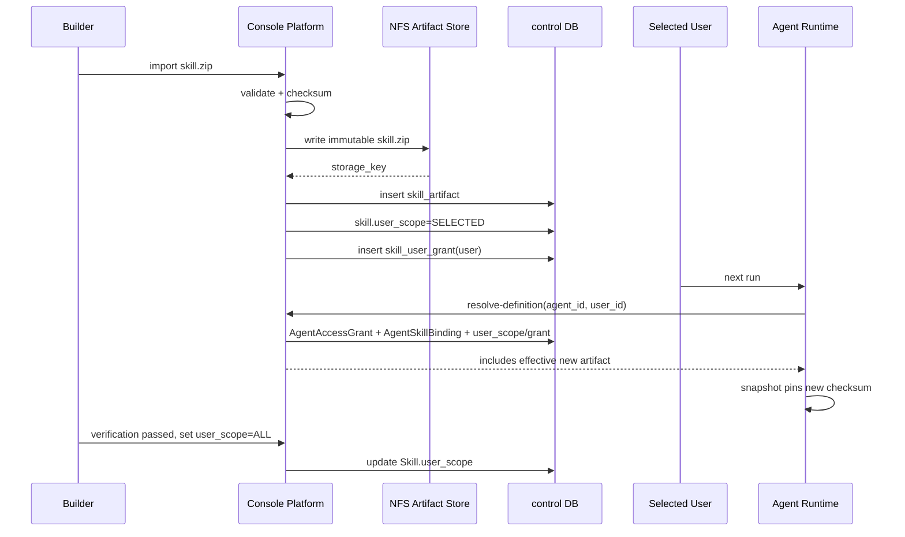
```mermaid
sequenceDiagram
    participant B as Builder
    participant CP as Console Platform
    participant FS as NFS Artifact Store
    participant DB as control DB
    participant U as Selected User
    participant AR as Agent Runtime

    B->>CP: import skill.zip
    CP->>CP: validate + checksum
    CP->>FS: write immutable skill.zip
    FS-->>CP: storage_key
    CP->>DB: insert skill_artifact
    CP->>DB: skill.user_scope=SELECTED
    CP->>DB: insert skill_user_grant(user)

    U->>AR: next run
    AR->>CP: resolve-definition(agent_id, user_id)
    CP->>DB: AgentAccessGrant + AgentSkillBinding + user_scope/grant
    CP-->>AR: includes effective new artifact
    AR->>AR: snapshot pins new checksum

    B->>CP: verification passed, set user_scope=ALL
    CP->>DB: update Skill.user_scope
```

**图说明**：

- `SELECTED` 用于指定测试用户/小范围业务用户，不再使用 PRIVATE 作为产品语义；
- 非指定用户在 `user_scope=SELECTED` 时看不到该 Skill；
- 改为 `ALL` 后，也只有拥有目标 AgentAccessGrant 且该 Agent 已绑定 Skill 的用户可用；
- 当前已开始 Run 不受 user_scope/grant 修改影响；新的 Run/Task 重新解析当前权限。

---

## 8. Agent/Skill 更新与 Snapshot 时序

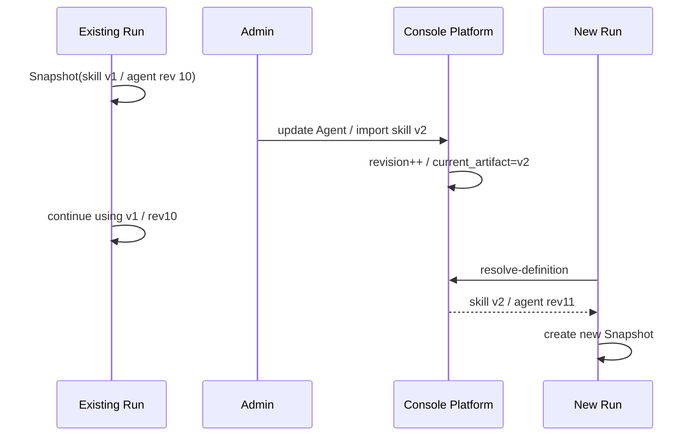
```mermaid
sequenceDiagram
    participant R1 as Existing Run
    participant A as Admin
    participant CP as Console Platform
    participant R2 as New Run

    R1->>R1: Snapshot(skill v1 / agent rev 10)
    A->>CP: update Agent / import skill v2
    CP->>CP: revision++ / current_artifact=v2
    R1->>R1: continue using v1 / rev10
    R2->>CP: resolve-definition
    CP-->>R2: skill v2 / agent rev11
    R2->>R2: create new Snapshot
```

---

## 9. User Memory 跨会话流程

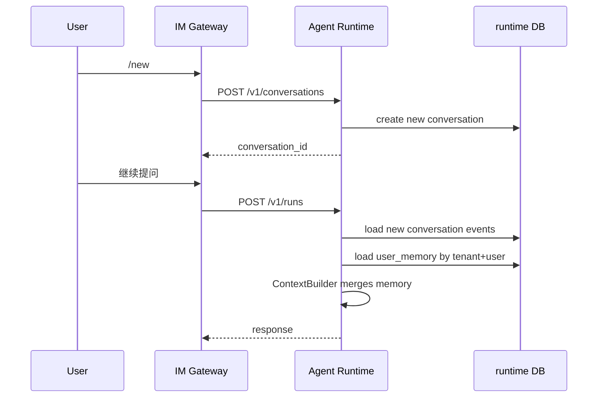
```mermaid
sequenceDiagram
    participant U as User
    participant IG as IM Gateway
    participant AR as Agent Runtime
    participant PG as runtime DB

    U->>IG: /new
    IG->>AR: POST /v1/conversations
    AR->>PG: create new conversation
    AR-->>IG: conversation_id

    U->>IG: 继续提问
    IG->>AR: POST /v1/runs
    AR->>PG: load new conversation events
    AR->>PG: load user_memory by tenant+user
    AR->>AR: ContextBuilder merges memory
    AR-->>IG: response
```

Memory 不从旧 Conversation “复制”，而是按同一 PlatformUser 重新读取。

---

## 10. Runtime 状态机

状态属于 Run，不属于 Runtime Pod；Pod 只是本次状态推进的计算实例。

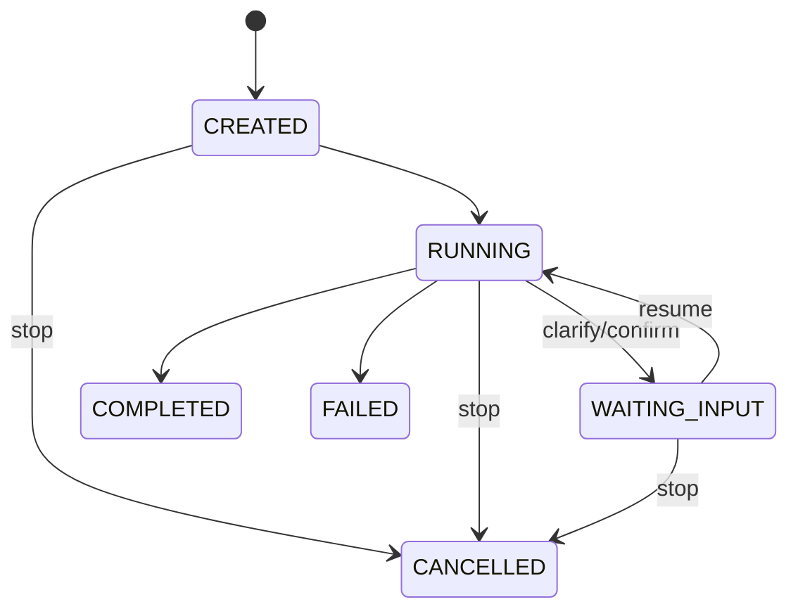
```mermaid
stateDiagram-v2
    [*] --> CREATED
    CREATED --> RUNNING
    RUNNING --> WAITING_INPUT: clarify/confirm
    WAITING_INPUT --> RUNNING: resume
    RUNNING --> COMPLETED
    RUNNING --> FAILED
    CREATED --> CANCELLED: stop
    RUNNING --> CANCELLED: stop
    WAITING_INPUT --> CANCELLED: stop
```

---

## 11. Bot 连接状态机

该状态机属于 IM Gateway 中的 Bot WebSocket 连接，与 Agent Runtime 实例生命周期无关。

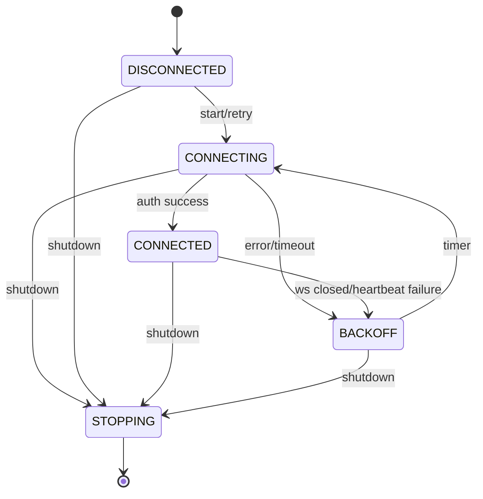
```mermaid
stateDiagram-v2
    [*] --> DISCONNECTED
    DISCONNECTED --> CONNECTING: start/retry
    CONNECTING --> CONNECTED: auth success
    CONNECTING --> BACKOFF: error/timeout
    CONNECTED --> BACKOFF: ws closed/heartbeat failure
    BACKOFF --> CONNECTING: timer
    CONNECTING --> STOPPING: shutdown
    DISCONNECTED --> STOPPING: shutdown
    CONNECTED --> STOPPING: shutdown
    BACKOFF --> STOPPING: shutdown
    STOPPING --> [*]
```

---

## 12. Egress / PlatformAdapter 决策流程

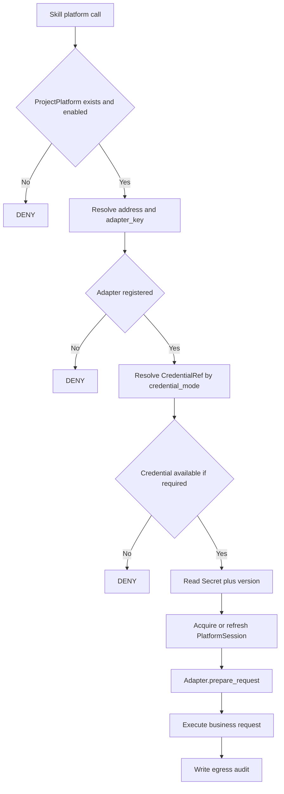
```mermaid
flowchart TD
    A[Skill platform call] --> B{ProjectPlatform exists and enabled}
    B -->|No| X1[DENY]
    B -->|Yes| C[Resolve address and adapter_key]
    C --> D{Adapter registered}
    D -->|No| X2[DENY]
    D -->|Yes| E[Resolve CredentialRef by credential_mode]
    E --> F{Credential available if required}
    F -->|No| X3[DENY]
    F -->|Yes| G[Read Secret plus version]
    G --> H[Acquire or refresh PlatformSession]
    H --> I[Adapter.prepare_request]
    I --> J[Execute business request]
    J --> K[Write egress audit]
```

**图说明**：V1.3 不把认证简化为统一 Header。ProjectPlatform 只选择 Adapter；Adapter 负责平台特有登录、签名、Cookie/CSRF 和 Session 生命周期。Session Cache 可丢失重建，Secret 不进入 Skill。

---

## 13. Model Recovery 流程

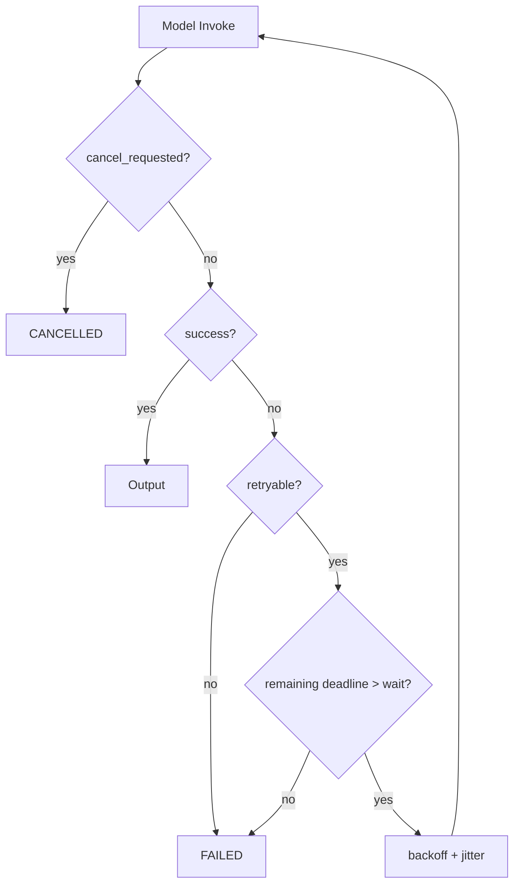
```mermaid
flowchart TD
    I[Model Invoke] --> C{cancel_requested?}
    C -->|yes| X[CANCELLED]
    C -->|no| S{success?}
    S -->|yes| O[Output]
    S -->|no| R{retryable?}
    R -->|no| F[FAILED]
    R -->|yes| T{remaining deadline > wait?}
    T -->|no| F
    T -->|yes| B[backoff + jitter]
    B --> I
```

**图说明**：每轮 invoke 前检查 `cancel_requested`；等待时长优先使用响应 `Retry-After`，缺省时使用指数退避 + jitter。

---

## 14. 即时异步任务时序

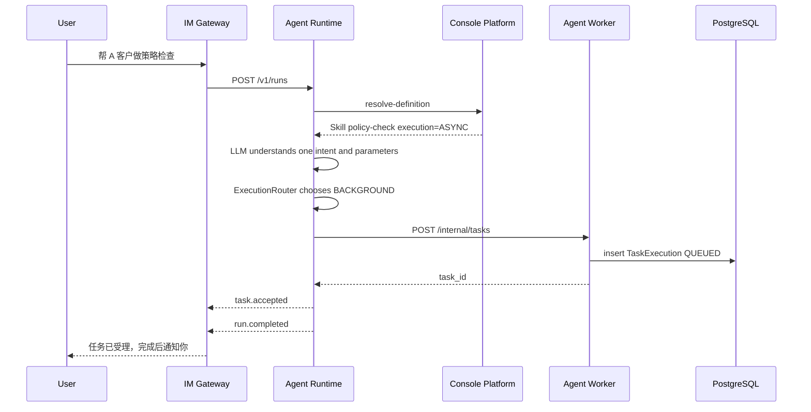
```mermaid
sequenceDiagram
    participant U as User
    participant IG as IM Gateway
    participant AR as Agent Runtime
    participant CP as Console Platform
    participant AW as Agent Worker
    participant PG as PostgreSQL

    U->>IG: 帮 A 客户做策略检查
    IG->>AR: POST /v1/runs
    AR->>CP: resolve-definition
    CP-->>AR: Skill policy-check execution=ASYNC
    AR->>AR: LLM understands one intent and parameters
    AR->>AR: ExecutionRouter chooses BACKGROUND
    AR->>AW: POST /internal/tasks
    AW->>PG: insert TaskExecution QUEUED
    AW-->>AR: task_id
    AR-->>IG: task.accepted
    AR-->>IG: run.completed
    IG-->>U: 任务已受理，完成后通知你
```

**图说明**：

- Agent 只理解 `policy_check` 一个业务意图；
- `ASYNC` 来自 Skill Runtime Profile，不来自 LLM 自由判断；
- 当前实时 Run 在提交成功后即可结束；
- 后台 Task 与当前 Runtime Pod 生命周期脱离。

---

## 15. 定时任务创建与触发时序

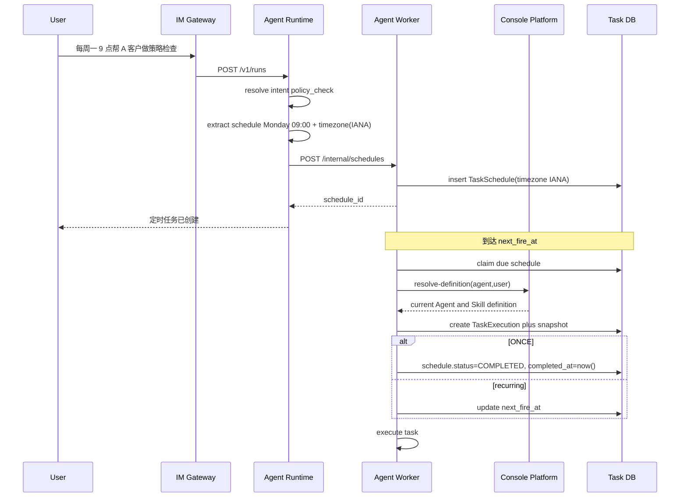
```mermaid
sequenceDiagram
    participant U as User
    participant IG as IM Gateway
    participant AR as Agent Runtime
    participant AW as Agent Worker
    participant CP as Console Platform
    participant DB as Task DB

    U->>IG: 每周一 9 点帮 A 客户做策略检查
    IG->>AR: POST /v1/runs
    AR->>AR: resolve intent policy_check
    AR->>AR: extract schedule Monday 09:00 + timezone(IANA)
    AR->>AW: POST /internal/schedules
    AW->>DB: insert TaskSchedule(timezone IANA)
    AW-->>AR: schedule_id
    AR-->>U: 定时任务已创建

    Note over AW,DB: 到达 next_fire_at
    AW->>DB: claim due schedule
    AW->>CP: resolve-definition(agent,user)
    CP-->>AW: current Agent and Skill definition
    AW->>DB: create TaskExecution plus snapshot
    alt ONCE
        AW->>DB: schedule.status=COMPLETED, completed_at=now()
    else recurring
        AW->>DB: update next_fire_at
    end
    AW->>AW: execute task
```

**图说明**：

- Schedule 保存的是稳定业务意图模板与触发规则，提取与入库必须包含 `timezone`（IANA 名称）；
- `ONCE` 触发创建唯一 TaskExecution 后，Schedule 置 `status=COMPLETED`、`completed_at=now()`，不写 `next_fire_at`；
- 错过触发按 `SKIP` 处理（V1 唯一策略），不补发，记录审计事件并累加 `scheduled_misfire_total`；
- 不永久 pin 旧 Artifact；
- 每次真正触发时重新校验授权，并为该次 Task 生成 Snapshot；
- 定时触发不依赖某个 Agent Runtime Pod 在线。

---

## 16. 批量并行 Fan-out / Fan-in 时序

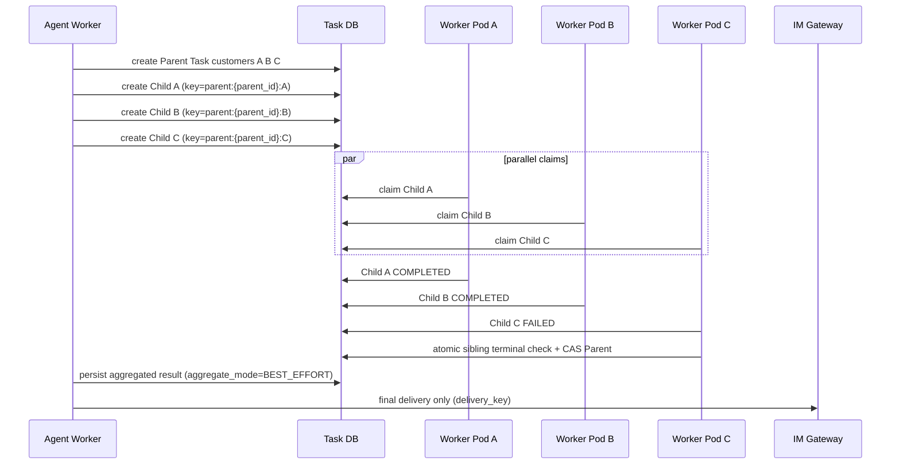
```mermaid
sequenceDiagram
    participant AW as Agent Worker
    participant DB as Task DB
    participant W1 as Worker Pod A
    participant W2 as Worker Pod B
    participant W3 as Worker Pod C
    participant IG as IM Gateway

    AW->>DB: create Parent Task customers A B C
    AW->>DB: create Child A (key=parent:{parent_id}:A)
    AW->>DB: create Child B (key=parent:{parent_id}:B)
    AW->>DB: create Child C (key=parent:{parent_id}:C)

    par parallel claims
      W1->>DB: claim Child A
      W2->>DB: claim Child B
      W3->>DB: claim Child C
    end

    W1->>DB: Child A COMPLETED
    W2->>DB: Child B COMPLETED
    W3->>DB: Child C FAILED
    W3->>DB: atomic sibling terminal check + CAS Parent
    AW->>DB: persist aggregated result (aggregate_mode=BEST_EFFORT)
    AW->>IG: final delivery only (delivery_key)
```

**图说明**：

- Child 幂等键为 `parent:{parent_id}:{item_key}`，唯一约束 `(parent_id, item_key)`；Parent reclaim 后已有 Child 则继续等待/聚合，不重复创建；
- Child 进入终态时原子检查兄弟终态计数，满足 `aggregate_mode` 后 CAS 完成/唤醒 Parent，不依赖 Redis wake-up 时序；
- 示例中 Child C FAILED 使用 `aggregate_mode=BEST_EFFORT`：Parent 仍 `COMPLETED`，结果中标注成功/失败数量；若为 `ALL` 则 Parent `FAILED`；
- Parent/Child 全部继承同一个 `intent_key`；
- 并行度由 Worker 配置限制，例如 `max_concurrency=10`；
- 这是一个 Agent 意图的多个执行实例，不是 Multi-Agent；
- 默认只推送 fan-in 后的最终结果，投递使用 `delivery_key=task:{task_id}:final` 去重。

---

## 17. Worker Lease / Crash Recovery 时序

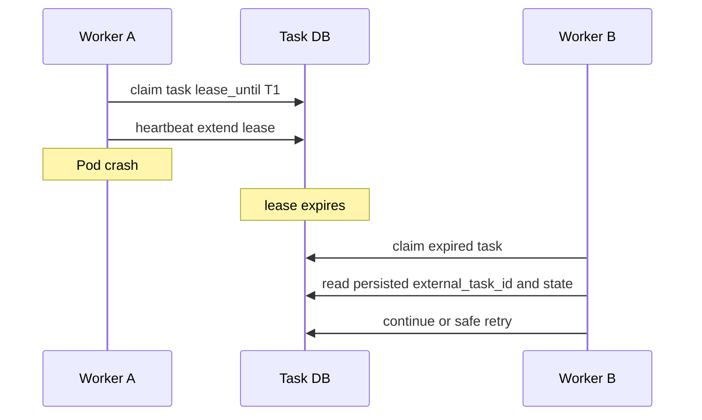
```mermaid
sequenceDiagram
    participant A as Worker A
    participant DB as Task DB
    participant B as Worker B

    A->>DB: claim task lease_until T1
    A->>DB: heartbeat extend lease
    Note over A: Pod crash
    Note over DB: lease expires
    B->>DB: claim expired task
    B->>DB: read persisted external_task_id and state
    B->>DB: continue or safe retry
```

**图说明**：

- Task 不永久属于 Worker A；
- Reclaim 条件为 `status='RUNNING' AND lease_until < now() AND cancel_requested = false`，命中后置回 `QUEUED` 并保留 `attempts`；
- 对有副作用的外部创建操作必须先持久化 `idempotency_key/external_task_id`；
- Reclaim 后继续查询已有外部任务，不能重复创建；已有 Child 的 Parent 继续等待/聚合，不重复 fan-out；
- 终态投递使用 `delivery_key` 幂等：Gateway Redis `delivery:dedupe:{delivery_key}` SET NX EX 7d 去重，重复请求返回 200。

---

## 18. Task 状态机

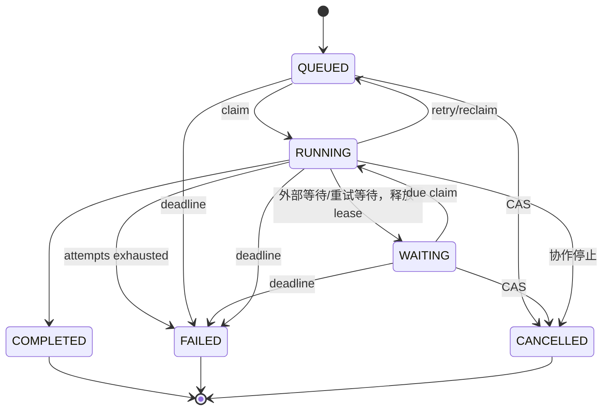
```mermaid
stateDiagram-v2
    [*] --> QUEUED
    QUEUED --> RUNNING: claim
    RUNNING --> WAITING: 外部等待/重试等待，释放 lease
    WAITING --> RUNNING: due claim
    RUNNING --> QUEUED: retry/reclaim
    RUNNING --> COMPLETED
    RUNNING --> FAILED: attempts exhausted
    QUEUED --> FAILED: deadline
    WAITING --> FAILED: deadline
    RUNNING --> FAILED: deadline
    QUEUED --> CANCELLED: CAS
    WAITING --> CANCELLED: CAS
    RUNNING --> CANCELLED: 协作停止
    COMPLETED --> [*]
    FAILED --> [*]
    CANCELLED --> [*]
```

**说明**：

- 终态为 `COMPLETED / FAILED / CANCELLED`；
- `deadline` 由 Scheduler 每 30s CAS 将过期非终态 Task 置为 `FAILED(TASK_DEADLINE_EXCEEDED)`；
- 进入 `WAITING` 时释放 lease；claim/reclaim 始终排除 `cancel_requested=true`。

---

## 19. 同步 / 异步 / 定时决策流程

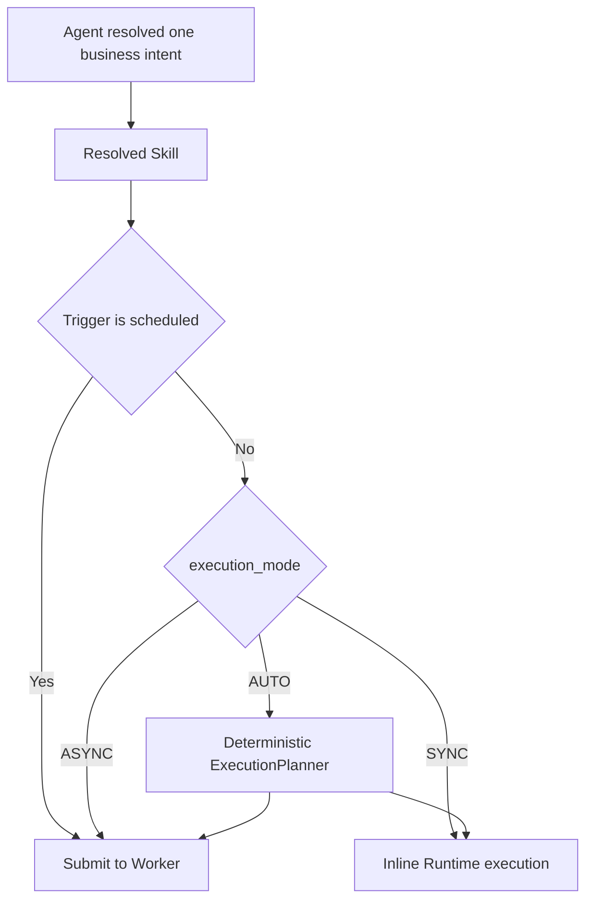
```mermaid
flowchart TD
    A[Agent resolved one business intent] --> B[Resolved Skill]
    B --> C{Trigger is scheduled}
    C -->|Yes| W[Submit to Worker]
    C -->|No| D{execution_mode}
    D -->|SYNC| S[Inline Runtime execution]
    D -->|ASYNC| W
    D -->|AUTO| P[Deterministic ExecutionPlanner]
    P --> S
    P --> W
```

**图说明**：LLM 只完成意图理解与 Skill 选择；真正的执行方式由 Runtime 元数据和确定性规则决定。

---

## 20. ProjectPlatform / PlatformAdapter 调用时序

```mermaid
sequenceDiagram
    participant SK as Skill
    participant PC as PlatformClient
    participant EB as Egress Boundary
    participant PP as ProjectPlatform Resolver
    participant REG as PlatformAdapterRegistry
    participant CR as CredentialResolver
    participant SP as PostgreSQL(密钥列)
    participant SM as PlatformSessionManager
    participant RD as Redis
    participant AD as PlatformAdapter
    participant BP as Business Platform

    SK->>PC: ctx.platform.call(platform_key, request)
    PC->>EB: PlatformRequest
    EB->>PP: resolve platform_key
    PP-->>EB: adapter_key + adapter_config + credential_mode
    EB->>REG: get(adapter_key)
    REG-->>EB: Adapter
    EB->>CR: resolve actor credential
    CR->>SP: get Secret by SecretRef
    SP-->>CR: SecretValue + credential_version
    CR-->>EB: credential_ref + SecretValue + credential_version
    EB->>SM: acquire session(platform, actor, credential_ref, credential_version)
    SM->>RD: get session cache
    alt cache miss or invalid
        SM->>AD: authenticate(platform, credential_ref, SecretValue, credential_version)
        AD->>BP: platform-specific login/sign
        BP-->>AD: session/token/cookie
        AD-->>SM: PlatformSession
        SM->>RD: set session TTL
    end
    SM-->>EB: PlatformSession
    EB->>AD: prepare_request(request, session, credential_ref, SecretValue, credential_version)
    AD-->>EB: PreparedRequest
    EB->>BP: execute
    BP-->>EB: response
    EB-->>SK: normalized result
```

**图说明**：

- Skill 不感知 AK/SK、Cookie、Session、签名规则；
- ProjectPlatform 只选择 Adapter 并提供非敏感配置；
- `PlatformSessionManager.authenticate` 与 `Adapter.prepare_request` 使用同一份 `credential_ref + SecretValue + credential_version`（见 12 §8）；
- Session 缓存在 Redis，可丢失重建；
- Runtime/Worker 任意 Pod 都能复用同一外置 Session；
- 新平台若复用已有 Adapter，只新增 ProjectPlatform 配置，不增加认证代码。

---

## 21. Agent 多 IM 通道路由

```mermaid
flowchart LR
    B1[WeCom bot_id A] --> A[AgentDefinition]
    B2[WeCom bot_id B] --> A
    B3[Future Channel Account] --> A
    A --> RS[agent-runtime Service]
    RS --> P1[Runtime Pod A]
    RS --> P2[Runtime Pod B]
    RS --> PN[Runtime Pod N]
```

**图说明**：

- 一个 Agent 可以配置多条通道账号；
- 每个 bot_id 只能解析到一个 Agent；
- 通道账号与 Runtime Pod 无固定绑定；
- 同一个 Agent 不同通道来的请求也可以落到不同 Runtime Pod。
