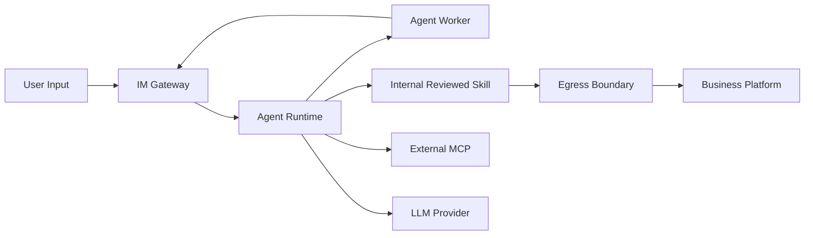
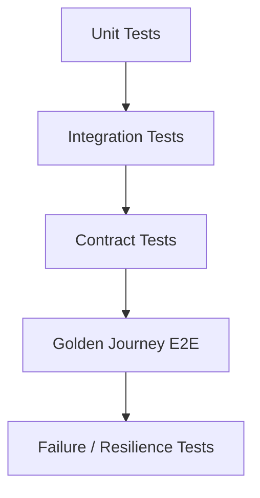

# 09 DFX、安全、可靠性、测试与验收详细设计

## 1. 部署安全前提与安全模型

### 1.0 部署前提

- 整个平台部署在内网；
- 普通用户只通过企业微信 IM 与平台交互；
- Console 仅 Builder/Admin 在内网访问；
- Agent Runtime、Agent Worker、PostgreSQL、Redis、NFS/PVC、Secret Provider 不直接暴露给普通用户；
- Skill 为内部开发、审核、导入的受控代码。

因此 Phase 1 安全设计以“身份、授权、Secret、审计、隔离”五个必要边界为主，不把公网攻击面、恶意第三方插件和复杂零信任网络作为首期建设重点。

### 1.1 安全模型

### 1.1 信任边界



重点边界：

- 外部用户输入不可信；
- LLM 输出不可信；
- MCP Tool result 不可信；
- Phase 1 Skill 视为内部受控代码，但不赋予 Secret 明文；
- Egress Boundary 是访问生产业务平台的可信边界。

---

## 2. V1.2 必要威胁与控制

| 风险 | Phase 1 控制 |
|---|---|
| 未绑定企业微信身份访问 | `/bind` + ChannelIdentity |
| 已绑定但无 Agent 权限 | AgentAccessGrant |
| LLM 误调用未开放 Tool/MCP | RuntimeSnapshot + ToolRegistry 可见集 |
| Skill 获取用户 Secret | SkillContext 只提供逻辑调用；SecretRef/SecretProvider |
| Runtime Pod 保存用户专属状态 | PostgreSQL/ObjectStore 外置，禁止 sticky session |
| MCP 绕开调用审计 | MCP Adapter 统一进入 ToolRegistry |
| 大结果拖垮上下文 | Artifact + preview |
| 模型接口临时错误 | retry budget + deadline + cancel |
| 配置升级影响运行中 Run/Task | RuntimeSnapshot / Task execution snapshot |
| Worker Pod crash 导致长任务丢失 | PostgreSQL Task + lease/heartbeat/reclaim |
| 定时任务重复触发 | DB schedule claim + idempotency |
| 批量任务压垮业务平台 | Worker concurrency limit + Parent/Child |
| 后台完成但用户收不到结果 | 持久化 DeliveryRoute + delivery retry |
| 内部业务调用难以排查 | EgressAudit + trace_id |

当前不建设：公网 WAF 规则体系、通用 ABAC/Policy DSL、Service Mesh mTLS 治理平台、恶意 Skill 强沙箱、复杂 Approval Center。

---

## 3. Secret 处理规则

Secret Value 只能存在于：

```text
Secret Provider
Runtime/Egress 临时内存
外部请求认证 Header/Cookie/签名材料
```

禁止存在于：

```text
RuntimeSnapshot
CanonicalEvent
ToolCallAudit
EgressAudit
Console API Response
Skill package
SKILL.md / scripts
LLM Prompt
普通日志
```

日志脱敏至少识别：

```text
Authorization
Cookie
Set-Cookie
api_key
access_token
secret
password
```

---

## 4. 可靠性目标

Phase 1 明确承诺：

1. Runtime Pod 变化不丢 User/Conversation/Memory；
2. 不依赖 sticky session；
3. Gateway WS 自动重连；
4. Model 临时错误可恢复；
5. 当前 Run 失败有可定位审计；
6. Skill Artifact 可按 checksum 重取；
7. Redis 丢失不丢业务事实；
8. Worker Pod crash 后 lease 到期可由其他 Worker 恢复；
9. 定时任务触发不依赖 Agent Runtime Pod 常驻；
10. 后台 Task 结果先持久化，再进行最终 IM 投递。

当前仍不承诺：

- 实时 Run 在 Runtime Pod crash 后逐 token 无感续流；
- 通用 Workflow/BPMN；
- durable 人工审批中心；
- 任意外部副作用自动补偿。

后台 Task 则必须支持数小时运行、lease reclaim、定时触发与安全重试。

---

## 5. 故障场景

| 故障 | 预期行为 | 验收 |
|---|---|---|
| Runtime Pod crash | 当前实时 Run 可失败；新请求进其他 Pod；历史不丢 | 删除 Pod 后新会话正常 |
| Worker Pod crash | lease 到期后其他 Worker reclaim | kill Worker 后 Task 最终进入终态且副作用不重复 |
| Scheduler 多副本 | 同一 schedule fire 只创建一次 Task | 并发触发压测无重复 |
| IM Gateway 暂时不可用 | Task 结果已持久化，Delivery 重试 | Gateway 恢复后最终结果可补发 |
| Console 暂时不可用 | 新 Run resolve 失败；已进入模型/Tool 的当前步骤尽量继续 | 不读取本地旧配置当权威 |
| Redis down | cache miss / dedupe 降级；业务事实不丢 | PG 数据完整 |
| PG down | fail closed，不本地落状态 | health/readiness 告警 |
| NFS/PVC 暂不可用 | 本地已有 READY Skill 可继续；cache miss/新 Artifact 写入明确失败 | 不返回假成功 |
| WeCom WS down | SDK backoff 重连 | reconnect metric |
| Model 429 | Retry-After + deadline | 无无限等待 |
| MCP down | Tool failed，Run 可由 Agent解释 | 有 ToolAudit |
| Egress denied | 业务调用不发出 | 有 DENY Audit |

---

## 6. 可观测性

### 6.1 Trace 关联字段

```text
trace_id
request_id
run_id
conversation_id
platform_user_id
agent_id
snapshot_id
skill_artifact_id
tool_call_id
task_id
schedule_id
```

### 6.2 Runtime Metrics

```text
agent_runs_total{agent,status}
agent_run_latency_ms{agent}
agent_active_runs
model_invocations_total{provider,model,status}
model_latency_ms{provider,model}
model_retry_total{reason}
tool_calls_total{kind,tool,status}
tool_latency_ms{kind,tool}
skill_load_total{skill,status}
egress_calls_total{platform,status}
egress_latency_ms{platform}
context_tokens{agent}
artifact_bytes_total{type}
```

### 6.3 Worker Metrics

```text
tasks_total{type,status}
task_queue_depth
task_claim_latency_ms
task_execution_latency_ms{skill,status}
task_retry_total{reason}
task_reclaim_total
task_lease_expired_total
scheduled_fire_total{status}
scheduled_misfire_total{policy}
batch_children_active
delivery_total{status}
```

### 6.4 Gateway Metrics

```text
wecom_ws_connected{bot_id}
im_messages_total{type}
im_runtime_errors_total{code}
im_stream_first_chunk_ms
```

### 6.5 Console Metrics

```text
console_api_requests_total{path,status}
skill_import_total{status}
runtime_definition_resolve_total{status}
bind_total{status}
```

---

## 7. 性能预算（V1.2 初始目标）

以下为设计目标，不等于最终容量承诺，需压测校准：

| 指标 | 初始目标 |
|---|---:|
| Console 普通列表 API P95 | < 500ms（不含外部依赖） |
| Runtime 创建 Snapshot P95 | < 300ms |
| Runtime 首个 SSE `run.created` | < 500ms |
| Gateway -> Runtime 连接建立 | < 500ms |
| ToolRegistry 本地 dispatch | < 20ms |
| Skill Artifact cache hit load | < 100ms |
| Skill Artifact cache miss | 受 NFS/PVC IO 影响，单独计量 |

模型首 Token 不设固定业务 SLA，按 Provider 独立观测。

---

## 8. 测试分层



### 8.1 Unit

- Visibility Resolver；
- Snapshot hash；
- Tool prepare/policy；
- Context budget；
- Memory writer policy；
- ProjectPlatform 解析、PlatformAdapter Registry、CredentialResolver；
- PlatformSessionManager / Session 失效重建；
- WeCom normalizer；
- Bind code hash/expire；
- ExecutionRouter sync/async/auto 决策；
- Cron next_fire_at 计算；
- Task claim/lease；
- Parent/Child fan-in。

### 8.2 Integration


- `ALL` Skill 未绑定 Agent 时不可使用；
- `ALL` Skill 对无 AgentAccessGrant 用户不可使用；
- `SELECTED` Skill 缺少 SkillUserGrant 时不进入 Catalog；
- `SELECTED` MCP 缺少 McpUserGrant 时不建立 ToolDefinition；
- 用户有 SkillUserGrant 但无 AgentAccessGrant 时仍拒绝；
- 用户有 AgentAccessGrant + SkillUserGrant，但 Agent 未绑定 Skill 时仍不可用；
- 撤销 Grant 后新 Run 不可见、已有 Snapshot 不变；
- MCP Tool 名称/Schema 对未授权用户不泄露。


- Console + PG；
- Runtime + PG Checkpointer；
- Runtime + NFS-backed Artifact Store；
- Runtime + mock MCP；
- Runtime + fake Model Provider；
- Gateway + Runtime SSE；
- Skill SDK + Dev Egress；
- Worker + PostgreSQL Task claim；
- Worker + fake external async task；
- PlatformAdapter authenticate/validate/prepare_request；
- Session Cache miss/hit/invalid/re-auth；
- Worker -> Gateway final delivery。

### 8.3 Contract

- `resolve-definition` Pydantic/OpenAPI contract；
- `resolve-egress-access` contract；
- SSE schema；
- ChannelEnvelope；
- SKILL.md frontmatter 校验（含 execution）；
- Runtime -> Worker Task/Schedule contract；
- Worker -> Gateway Delivery contract。

---

## 9. Golden Journey 验收矩阵

| 场景 | 验收点 |
|---|---|
| U01 发起服务 | 一句话触发 Agent；Lazy Load 正确 Skill；必要时澄清 |
| U03 人工介入 | Run -> WAITING_INPUT；resume 后继续 |
| U05 首次使用 | 未绑定提示 `/bind`；绑定后身份稳定 |
| U06 Memory | `/new` 后 Memory 仍可读取；Conversation 不复用旧消息 |
| A02 Agent 授权 | 无 Grant 不能使用 Agent |
| A03 IM 接入 | 多个 bot_id 可路由同一 Agent；每个 bot_id 唯一归属 Agent；WS 自动重连 |
| A04 排障 | Run/Tool/Egress/Model 可按 trace_id 关联 |
| A05 版本确定 | 运行中上传 Skill v2 不改变旧 Run |
| A06 用户范围 | SELECTED 仅指定用户可见；切换 ALL 后仅对拥有对应 Agent 权限且 Agent 已绑定资源的用户开放；移除 Grant 后新 Run 不可见 |
| D05 Mock | Skill 不启平台即可 pytest |
| D06 Dev 联调 | 使用 test user 真实接口，Skill 不拿 Secret |
| D07 导入 | Artifact checksum 不可变 |
| D10 快改快传 | 新 Artifact 对 SELECTED 指定测试用户下一次 Run 生效；验证后可切换 ALL |
| Background 长任务 | 实时 Run 快速返回 task_id；用户离开后 Worker 完成并最终通知 |
| 定时任务 | Agent 创建 Schedule；到点只触发一次；按原 actor 权限执行 |
| 批量并行 | 一个意图生成 Parent/Child；受并发限制；fan-in 后只推最终结果 |

---

## 10. 无状态与横向扩展专项测试

额外断言：每个 `bot_id` 只解析到一个逻辑 `agent_id`，一个 Agent 可有多个 bot_id，且不存在 bot 到 Pod 的持久绑定。

```text
1. 用户发 Turn 1 -> Runtime A
2. Runtime A Pod 删除
3. 用户发 Turn 2 -> Runtime B
4. Runtime B 从 PG/ObjectStore 重建上下文
5. Conversation/UserMemory/Skill Version 正确
```

断言：

- 不依赖 Pod 本地用户目录；
- 不依赖 sticky session；
- Artifact cache miss 能重新拉取；
- CanonicalEvent 顺序完整。

---

## 11. Snapshot 专项测试

```text
Run R1 snapshot: agent rev10 + skill v1
Admin: agent -> rev11, skill -> v2
R1 resume/next model call
=> 仍然 rev10 + v1

Run R2 start
=> rev11 + v2
```

---

## 12. Egress 专项测试

必须覆盖：

- ProjectPlatform 不存在/被禁用；
- service/path 无法解析；
- user credential 缺失；
- shared fallback；
- SecretProvider 错误；
- timeout；
- Adapter 未注册/配置 Schema 非法；
- Session Cache miss；
- Session 过期后受控 re-auth；
- Credential 轮换后旧 Session 不复用；
- 多 Pod 冷启动 SingleFlight；
- 401/403；
- 5xx；
- 审计无 Secret Value。

---

## 13. Architecture Gate

CI/评审必须检查：

1. Runtime 不 import Console ORM/Repository；
2. Skill 不 import `apps/*`；
3. Runtime 不用本地文件作为权威 User/Memory/Conversation；
4. MCP execute 不能绕过 ToolRegistry；
5. Skill 访问业务平台必须使用 SkillContext/PlatformClient；
6. Snapshot 不含 Secret；
7. Artifact 使用 checksum；
8. Redis 不作权威源；
9. Worker 不复制第二套 Agent/Skill/MCP 实现，必须复用 agent-core/skill-sdk；
10. Task/Schedule 权威状态不得只存 Redis；
11. Worker 不依赖 sticky worker / agent-to-worker 绑定；
12. 同步/异步决策不得由 LLM 自由布尔值直接驱动；
13. 仍不引入 Workflow Designer/Capability Center/独立 Egress Proxy；
14. 新平台对象必须能回溯到 Playbook 用户旅程；
15. ProjectPlatform 不得用固定 `auth_type` 枚举替代 PlatformAdapter；
16. Adapter 可执行代码不得从数据库/Console 动态上传；
17. PlatformSession 不得存原始用户长期凭据，Redis 丢失必须可重新认证；
18. Console 不承担中间件/Pod 健康监控；
19. Skill/MCP 用户范围只能使用 `ALL/SELECTED`，不得恢复 PUBLIC/PRIVATE 作为用户可见性语义；
20. 不得新增 User-Agent-Skill/User-Agent-MCP 三元授权表；
21. 未授权 Skill/MCP 必须在 PromptBuilder/ToolRegistry 之前过滤，不能仅依赖执行阶段 403；
22. V1.3 不做 MCP Tool 级用户白名单。

可通过 import-linter、pytest architecture tests、自定义静态检查实现。

---

## 14. 安全/可靠性上线门禁

发布前至少：

- SCA/Mend；
- Image Scan；
- Secret Scan；
- DB Migration Dry Run；
- Golden Journey；
- Egress Deny Test；
- Snapshot Determinism Test；
- Runtime A/B Stateless Test；
- WeCom reconnect test；
- Model 429 recovery test；
- Worker lease reclaim test；
- Schedule duplicate-fire test；
- Background final-delivery retry test；
- Batch concurrency limit test；
- Log redaction test。
