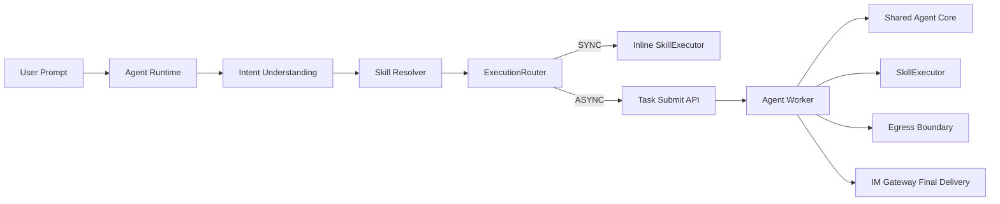
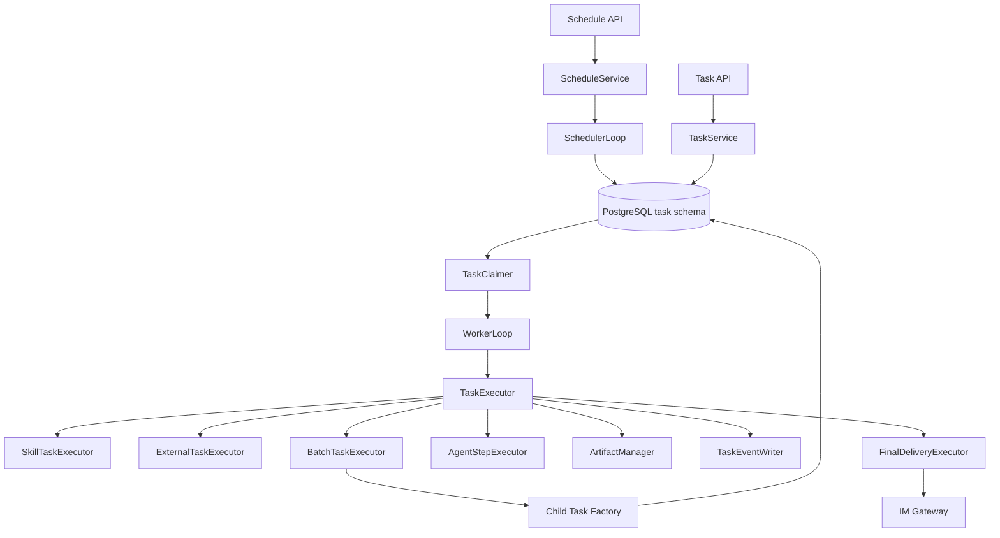

# 10 Agent Worker 与异步任务详细设计

## 1. 设计目标

Agent Worker 用于承载已经被真实旅程证明需要的：

- Background 长任务；
- 定时任务；
- 用户离开后继续执行；
- 并行批量任务；
- 外部异步任务等待/轮询；
- retry / timeout / cancel；
- Worker crash 后恢复；
- 最终结果主动投递。

它不是第二个 Agent 系统，也不是通用 Workflow Engine。

核心原则：

```text
Agent Runtime = 理解“做什么”
Agent Worker  = 可靠地把已经明确的任务执行完
```

---

## 2. 与 Agent Runtime 的边界



**图说明**：

- Agent 只理解一个业务意图；
- Runtime 依据 Skill Runtime Profile 决定 Inline/Background；
- Worker 收到的是确定 TaskSpec，不重新理解用户 Prompt；
- Runtime 与 Worker 共享 Agent Core、SkillExecutor、MCP Adapter、Egress Boundary；
- Worker Pod 与 Agent、User、bot_id 均无固定绑定。

---

## 3. Worker 内部结构



### 3.1 组件职责

| 组件 | 职责 |
|---|---|
| TaskService | 创建/查询/取消 Task |
| ScheduleService | 创建/更新/暂停/删除 Schedule |
| SchedulerLoop | claim 到期 Schedule，创建 TaskExecution，计算 next_fire_at |
| TaskClaimer | `FOR UPDATE SKIP LOCKED` claim 可执行 Task |
| WorkerLoop | heartbeat、deadline、cancel、执行调度 |
| SkillTaskExecutor | 使用共享 SkillExecutor 执行 Skill |
| ExternalTaskExecutor | create/poll 外部异步任务 |
| BatchTaskExecutor | Parent/Child fan-out/fan-in |
| AgentStepExecutor | 必要时复用 Agent Core 做认知步骤；当前不等价于 Multi-Agent |
| FinalDeliveryExecutor | 最终结果推送到 IM Gateway |

---

## 4. Task 创建模型

### 4.1 一个意图一个 Parent Task

用户：

```text
“帮 A、B、C、D 四个客户做策略检查”
```

Agent Runtime 解析：

```json
{
  "intent_key": "policy_check",
  "skill_id": "uuid",
  "input": {
    "customers": ["A", "B", "C", "D"]
  }
}
```

`execute_skill` 进入 ExecutionRouter，看到 Skill `execution_mode=ASYNC` 后只创建一个 Parent Task。

Worker 后续由 Skill/TaskPlan 确定性 fan-out：

```text
Parent(policy_check)
  -> Child(A)
  -> Child(B)
  -> Child(C)
  -> Child(D)
```

所有 Child 的 `intent_key` 与 Parent 相同。

### 4.2 TaskPlan

Worker 不要求通用 DAG DSL。当前只支持最小结构：

```python
class TaskPlan:
    kind: Literal["SINGLE", "BATCH"]
    items: list[dict] | None
    max_concurrency: int | None
    aggregate_mode: Literal["ALL", "BEST_EFFORT"]
```

TaskPlan 来源：

- Skill script 确定性返回；
- `ctx.task.map()`；
- 系统内置批量执行器。

LLM 不直接生成任意 DAG。

---

## 5. Claim / Lease / Heartbeat

### 5.1 Claim

PostgreSQL 为权威任务队列：

```sql
SELECT id
FROM task.task_execution
WHERE status = 'QUEUED'
  AND not_before <= now()
ORDER BY priority ASC, create_time ASC
FOR UPDATE SKIP LOCKED
LIMIT :n;
```

claim 后原子更新：

```text
status = RUNNING
lease_owner = worker_instance_id
lease_until = now + lease_duration
heartbeat_at = now
```

### 5.2 Heartbeat

Worker 在执行期间周期性续租。

推荐：

```text
lease_duration = 60s
heartbeat_interval = 20s
```

具体值通过压测校准。

### 5.3 Reclaim

当：

```text
status IN (RUNNING, WAITING)
AND lease_until < now()
```

可由其他 Worker reclaim。

不得因为 Pod 名称变化而判定 Task 所属。

---

## 5.1 Worker Skill Artifact 准备

Worker 与 Runtime 使用同一个 `SkillArtifactCache`：

```text
NFS RWX PVC
 -> local emptyDir
 -> checksum cache
 -> SkillExecutor
```

Task Snapshot 必须包含 `schema_version/skill_id/skill_artifact_id/checksum/storage_key`。Worker 被其他 Pod reclaim 后可以重新从共享 PVC 准备同一不可变 Artifact。


## 6. 外部异步任务

典型：

```text
create scan
 -> external_task_id
 -> wait
 -> poll status
 -> fetch result
```

关键要求：

1. 外部 create 前生成幂等键；
2. create 成功后立即持久化 `external_task_id`；
3. 进入 `WAITING`，使用 `not_before` 表达下次轮询；
4. reclaim 后如已有 `external_task_id`，继续 poll，不再次 create。

V1.2 不要求通用 Compensation。

---

## 7. Retry / Timeout / Cancel

### 7.1 Retry

可重试错误：

- 下游短暂 5xx；
- 网络临时错误；
- provider rate limit；
- Worker crash reclaim。

不可重试：

- Task 创建阶段权限/资源解析失败；
- 参数校验失败；
- 业务明确拒绝；
- 外部平台明确认证/授权拒绝且不可恢复。

**注意**：已经成功创建并冻结 RuntimeSnapshot 的 Task，不因为之后撤销 AgentAccessGrant、SkillUserGrant/McpUserGrant 或 Agent Binding 而中途改变能力集合；撤销影响后续新 Run/Task。外部业务平台凭据/权限仍按真实调用时的当前状态校验。

Backoff 默认采用指数退避 + jitter，并受 `max_attempts` 和 Task deadline 约束。

### 7.2 Cancel

用户通过 Agent：

```text
“停止刚才那个任务”
```

Agent 使用 `cancel_task` Tool。

取消流程：

```text
task.cancel_requested = true
Redis cancel hint
Worker cooperative cancel
status -> CANCELLED
```

已经在外部系统创建且不可撤销的任务，不伪造“已回滚”。

---

## 8. Scheduler / Cron

### 8.1 Agent 创建 Schedule

用户：

```text
“每周一上午 9 点帮 A 客户做策略检查”
```

Agent 只理解：

```text
intent = policy_check
input = customer A
schedule = Monday 09:00
```

调用 `create_schedule` Tool。

### 8.2 Schedule 与版本

Schedule 保存：

```text
agent_id
actor_user_id
intent_key
skill_id
input_template
cron/run_at
timezone
delivery_route
```

不保存永久 Skill Artifact checksum。

每次 Schedule 触发都视为创建一个新的 Task，因此必须重新解析当前 Effective Capability：验证 `actor_user_id` 的 AgentAccessGrant、Agent 与 Skill/MCP Binding、资源 `user_scope=ALL/SELECTED` 以及对应 SkillUserGrant/McpUserGrant。实际业务调用时 CredentialResolver 继续使用该用户当前凭据；任一新任务前置权限不满足则 fail closed。

每次触发：

```text
claim schedule
 -> revalidate AgentAccessGrant
 -> resolve Agent Binding
 -> resolve Skill/MCP user_scope + grant
 -> resolve current Skill
 -> create TaskExecution
 -> create execution snapshot
 -> update next_fire_at
```

因此 Skill 更新可自然作用于下一次定时执行，而已经创建的 Task 不漂移。

### 8.3 多副本安全

Scheduler 可以随 Worker 横向扩展，通过数据库 claim 保证同一 `schedule_id + fire_time` 只生成一次 Task。

建议幂等键：

```text
schedule:{schedule_id}:{scheduled_fire_time}
```

---

## 9. Fan-out / Fan-in

### 9.1 Fan-out

Parent 在事务内创建 Child Task：

```text
root_id = parent.id
parent_id = parent.id
```

并发上限优先使用：

```text
min(TaskPlan.max_concurrency, system_max, platform_limit)
```

### 9.2 Fan-in

Parent 不占用一个 Worker 线程等待所有 Child。

Parent 可转为 `WAITING`。Child 状态变化后通过 DB 查询或 Redis wake-up hint 触发重新聚合。

聚合条件：

```text
all children terminal
```

`BEST_EFFORT` 允许部分 Child 失败，最终 Parent 仍 `COMPLETED`，结果中明确成功/失败数量。

---

## 10. Final Delivery

默认：

```text
delivery_mode = FINAL_ONLY
```

执行期间：

- Task 状态持续落库；
- 用户可通过 Agent 查询进度；
- 不主动推送每个步骤/Child 完成消息。

最终：

```text
persist result
 -> task status terminal
 -> call IM Gateway
 -> update delivery_status
```

重要顺序：

> **先持久化最终结果，再发送消息。**

这样 IM Gateway 暂时不可用时结果不会丢，Delivery 可以独立重试。

---

## 11. Worker 无状态与横向扩展

Worker Pod 可本地持有：

- 当前 lease 内的临时对象；
- Skill Artifact cache；
- HTTP connection pool；
- 非权威 metrics buffer。

Worker Pod 不得作为权威源保存：

- Task 当前状态；
- Schedule；
- external_task_id；
- Parent/Child 关系；
- 最终结果；
- DeliveryRoute。

扩缩容不修改 Agent/Bot/Schedule 配置。

---

## 12. 与 learn-agent 的取舍

本项目正式吸收：

- Background durable execution 思想；
- Cron/Scheduled Task 思想；
- Task lifecycle、cancel、恢复与后台完成通知；
- Agent Loop 与 Background Engine 分离。

当前仍不采用：

- Multi-Agent Team；
- Mailbox/Teammate 协作模型；
- Worktree；
- Coding Agent 专属 workspace 隔离。

批量并发使用 Worker Parent/Child，不通过 Multi-Agent 实现。

---

## 13. V1.2 不做

- BPMN；
- 通用 Workflow Designer；
- 任意 DAG 产品化；
- Temporal/DBOS 强依赖；
- Kafka/NATS 强依赖；
- Multi-Agent Team；
- 通用分布式事务补偿。

PostgreSQL + 可选 Redis hint 足够支撑当前规模验证；若未来任务规模/可靠性目标证明不足，再评估成熟 durable engine。
