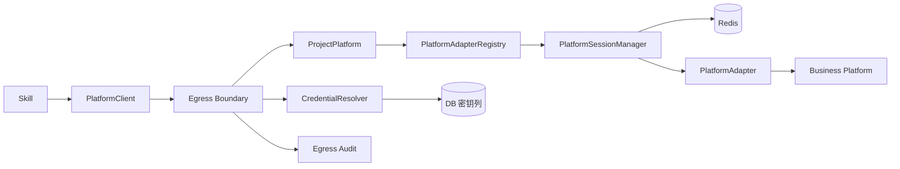
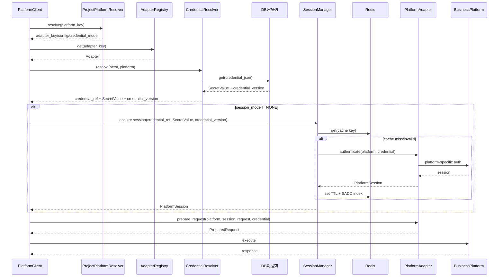

# 12 项目平台适配与 Session 详细设计

## 1. 背景

旧项目 `tools/session-manager` 已经验证了一个重要事实：

> “业务平台认证”通常不是统一的 Bearer/API Key 模型，而可能包含平台特有登录、签名、Cookie、CSRF、Session 健康检查和刷新逻辑。

因此 V1.3 不再把认证方式硬编码在 ProjectPlatform 中，而是拆成：

```text
ProjectPlatform    = 平台实例配置
PlatformAdapter    = 平台认证/Session 协议实现
CredentialRef      = Secret 引用
PlatformSession    = 可重建 Session Cache
```

目标：

- 新增平台优先复用已有 Adapter；
- 不要求每个平台复制认证代码；
- 特殊协议允许增加 Python Adapter；
- Runtime/Worker 无状态；
- Console 不为每个平台手写认证页面；
- Skill 不接触明文凭据。

---

## 2. 总体架构



### 2.1 图说明

- `ProjectPlatform` 是数据；
- `PlatformAdapter` 是受控代码；
- `CredentialRef` 以主键指向凭据表（credential_json 明文）；
- `PlatformSessionManager` 让任意 Runtime/Worker Pod 都能共享 Session；
- Redis 中的 Session 可失效重建，不是业务权威状态。

---

## 3. PlatformAdapter 抽象

### 3.1 基础协议

```python
class PlatformAdapter(Protocol):
    key: str
    name: str
    version: str
    session_mode: Literal["NONE", "SESSION", "REQUEST_SIGNING"]

    platform_config_schema: dict
    credential_schema: dict

    async def authenticate(
        self,
        platform: PlatformConfig,
        credential: SecretValue,
    ) -> PlatformSession | None:
        ...

    async def validate(
        self,
        platform: PlatformConfig,
        session: PlatformSession,
    ) -> bool:
        ...

    async def prepare_request(
        self,
        platform: PlatformConfig,
        session: PlatformSession | None,
        request: PlatformRequest,
        credential: SecretValue | None,
    ) -> PreparedRequest:
        ...
```

`refresh` 不是独立方法，刷新逻辑属于 `authenticate` 内部实现。

### 3.2 为什么需要 `prepare_request`

不是所有平台都采用“登录一次拿 Cookie”。

有的平台可能：

```text
每次请求
 -> canonical request
 -> HMAC
 -> timestamp
 -> nonce
 -> auth header
```

因此“SessionManager”不能代替每请求签名，`prepare_request()` 是统一请求认证边界。

### 3.3 Session Mode

| 模式 | 场景 | authenticate | prepare_request |
|---|---|---|---|
| `NONE` | 无认证 | 无 | 原样请求 |
| `SESSION` | 登录后 Cookie/Token | 生成/刷新 Session | 注入 Session |
| `REQUEST_SIGNING` | 每请求签名 | 可选 | 每次计算签名 |

复杂平台也可以同时使用 Session + request signing；`session_mode` 只是运行提示，不限制 Adapter 内部实现。

---

## 4. Adapter Registry

目录建议：

```text
packages/platform-sdk/
├── adapter/
│   ├── base.py
│   ├── registry.py
│   └── adapters/
│       ├── mssw.py
│       ├── mssp.py
│       └── generic_http_session.py
├── credential/
│   ├── resolver.py
│   └── types.py
├── session/
│   ├── manager.py
│   ├── store.py
│   └── lock.py
└── client.py
```

注册：

```python
registry.register(MSSWAdapter())
registry.register(MSSPAdapter())
registry.register(GenericHTTPSessionAdapter())
```

原则：

- Adapter 必须代码评审；
- Adapter key 稳定；
- Adapter 版本可进入审计；
- 不允许运行时从 DB 下载 Python 代码；
- Runtime、Worker、Console Metadata 使用同一 `platform-sdk` 版本。

---

## 5. Adapter Schema 与 Console 动态表单

### 5.1 Platform Config Schema

Adapter 声明平台公共配置，例如：

```json
{
  "type":"object",
  "properties":{
    "login_endpoint":{"type":"string","title":"登录接口"},
    "health_endpoint":{"type":"string","title":"健康检查接口"},
    "branch_tag":{"type":"string","title":"Branch Tag"},
    "csrf_enabled":{"type":"boolean","title":"启用 CSRF"}
  }
}
```

Console 根据 Schema 动态生成“平台配置”表单。

### 5.2 Credential Schema

例如：

```json
{
  "type":"object",
  "properties":{
    "ak":{"type":"string","title":"AK","x-secret":true},
    "sk":{"type":"string","title":"SK","x-secret":true}
  },
  "required":["ak","sk"]
}
```

Console 根据 Schema 生成用户/共享凭据表单；提交后明文写入对应凭据表。

数据库只保存：

```text
credential_json
credential_schema_version
```

### 5.3 前后端职责

前端：

- 渲染；
- 基础必填；
- 不缓存明文 Secret。

后端：

- 使用同一 JSON Schema 再校验；
- 写凭据表（credential_json）；
- 保存 SecretRef；
- 记录配置审计。

---

## 6. ProjectPlatform

```text
ProjectPlatform
├── key
├── name
├── resolver_type
├── resolver_config
├── adapter_key
├── adapter_config
├── adapter_schema_version
├── credential_mode
└── enabled
```

### 6.1 Credential Mode

```text
USER_ONLY
SHARED_ONLY
USER_THEN_SHARED
NONE
```

含义仅是“凭据从哪里来”，与认证协议无关。

---

### 6.2 Shared Credential V1 边界

V1 每个 ProjectPlatform 最多一套共享凭据：

```text
ProjectPlatform 1 -> 0..1 SharedCredentialRef
```

不做多共享账号池、priority、负载均衡或主备账号切换。

### 6.3 修改 Adapter 的凭据失效

`adapter_key` 变化时必须：

```text
user_credential_ref -> INVALID
shared_credential_ref -> INVALID
按索引集合删除该平台全部 Session（见 §7.1）
credential_reconfigure_required=true
```

Session 失效通过 Redis Set 索引 `platform_sessions:{tenant_id}:{platform_id}` 完成：`SMEMBERS` 取出完整 session key 成员后逐个 `DEL`。概念上等价于 `platform_session:{tenant_id}:{platform_id}:*`，但禁止使用 `KEYS/SCAN` 或通配符删除。


## 7. PlatformSessionManager

### 7.1 Session Key

```text
platform_session:
{tenant_id}:
{platform_id}:
{actor_scope}:
{credential_version}:
{adapter_key}:
{adapter_version}
```

`actor_scope`：

```text
user:{user_id}
shared:{shared_credential_id}
none
```

写入 Session 时同时登记索引集合：

```text
SADD platform_sessions:{tenant_id}:{platform_id} {session_key}
```

失效（`adapter_key` 变更/凭据失效）时按索引集合删除，禁止 `KEYS/SCAN`：

```text
SMEMBERS platform_sessions:{tenant_id}:{platform_id}
  -> DEL {session_key}
```

### 7.2 Session State

允许缓存：

```text
session_id
cookie
access_token
csrf_token
adapter_state
expires_at
```

禁止缓存：

```text
raw password
raw AK/SK
凭据表原始对象
```

Adapter 如确实必须在 `authenticate`（refresh 属于其内部实现）中再次使用长期凭据，SessionManager 再次通过 SecretRef 读取，不把长期 Secret 放进 Session Cache。

### 7.3 Credential Version

凭据解析应返回：

```text
SecretValue
SecretVersion / Fingerprint
```

凭据修改后 version 变化，新的 Session Key 自然不复用旧 Session。

### 7.4 SingleFlight

多 Runtime/Worker 同时命中失效 Session 时：

```text
Acquire short distributed lock
 -> double check cache
 -> one authenticate
 -> write session
 -> other callers reuse
```

避免账号被并发登录打爆。

---

## 8. 一次平台调用流程



**图说明**：`credential_ref + SecretValue + credential_version` 由 CredentialResolver 输出，`PlatformSessionManager` 用其调用 `adapter.authenticate`；`prepare_request` 按 `session_mode` 接收 `session + credential`（`NONE` 时均为 `None`，`REQUEST_SIGNING` 的 `credential` 可选）。SecretValue 不进入 SkillContext、LLM Context、Snapshot 或审计。

---

## 9. 错误与重试语义

统一错误：

```text
PLATFORM_ADAPTER_NOT_FOUND
PLATFORM_CONFIG_INVALID
CREDENTIAL_MISSING
CREDENTIAL_INVALID
SESSION_AUTH_FAILED
SESSION_VALIDATE_FAILED
PLATFORM_AUTH_EXPIRED
PLATFORM_REQUEST_FAILED
```

> `PLATFORM_ADAPTER_NOT_FOUND`（HTTP 404）与 `CREDENTIAL_MISSING`（HTTP 409）已注册到 `config/api-messages.yaml`（同步 `ErrorCode`）；其余为 platform-sdk 内部错误分类，待有 HTTP 出口时再注册。

规则：

- Session 认证失败不无限重试；
- 平台返回明确认证过期时最多受控 re-auth 一次；
- 账号锁定/密码错误类业务错误不得快速重试；
- Adapter 可以把平台特有错误映射为统一错误码和 `retryable`。

---

## 10. 旧项目经验的保留与删除

### 保留

- Adapter Registry；
- 平台专属 Adapter；
- `authenticate`（refresh 属于其内部实现）+ `validate`；
- Session TTL；
- Credential 变化后 Session 失效；
- 相同协议的平台复用 Adapter；
- 通用 HTTP Adapter 作为可选复用路径。

### 删除/替换

- 不保存 Agent Pod 本地 session-store 作为权威；
- 不依赖 OpenClaw 用户目录；
- 不强依赖 browser profile/storageState；
- 不要求一个平台一个 Runtime 实例；
- 不允许 Adapter 直接读取 Console ORM。

---

## 11. 测试

### 11.1 Adapter 单测

每个 Adapter 必须覆盖：

```text
config schema
credential schema
authenticate success/fail
validate valid/expired
prepare_request
platform error mapping
secret log redaction
```

### 11.2 Session 集成测试

```text
首次调用 -> 登录
第二次调用 -> cache hit
Redis 清空 -> 自动重新登录
Credential 更新 -> 不复用旧 Session
Runtime A 登录 -> Runtime B 可复用
并发 20 请求冷启动 -> 单次/受控登录
```

### 11.3 Console Contract

```text
Adapter Metadata Schema
ProjectPlatform create/update validation
Credential dynamic form validation
Secret 不回显
```
