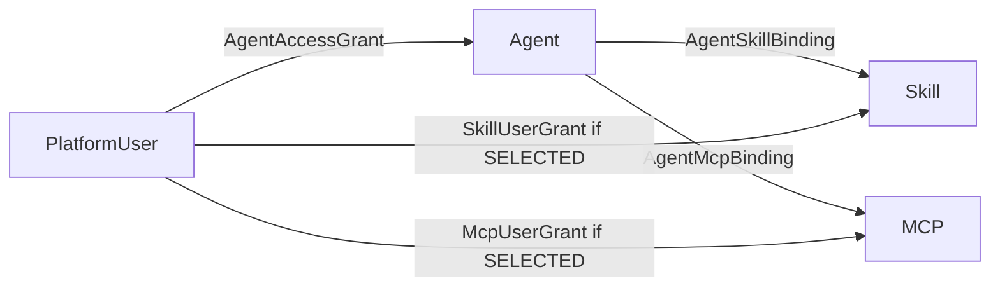

# 14 用户范围与能力授权模型详细说明

## 1. 为什么从 PUBLIC/PRIVATE 改为 ALL/SELECTED

Skill/MCP 的“可见范围”并不是 Console 页面可见性，普通用户也不登录 Console。

真正需要表达的是：

> 当一个 Agent 已经绑定某个 Skill/MCP 后，该能力对这个 Agent 的哪些授权用户开放。

因此 V1.3 使用：

```text
user_scope = ALL
user_scope = SELECTED
```

UI 文案：

```text
ALL      -> 全部授权用户
SELECTED -> 指定用户
```

---

## 2. 三层关系



### User -> Agent

回答：

> 用户能不能使用这个 Agent？

### Agent -> Skill/MCP

回答：

> Agent 理论上具备哪些能力？

### User -> Skill/MCP

回答：

> 当资源是 SELECTED 时，这个能力对哪些 Agent 授权用户开放？

---

## 3. 最终权限公式

### Skill

```text
AgentAccessGrant(user, agent)
AND AgentSkillBinding(agent, skill)
AND Agent.enabled
AND Skill.enabled
AND (
    Skill.user_scope = ALL
    OR SkillUserGrant(skill, user) exists
)
```

### MCP

```text
AgentAccessGrant(user, agent)
AND AgentMcpBinding(agent, mcp)
AND Agent.enabled
AND MCP.enabled
AND (
    MCP.user_scope = ALL
    OR McpUserGrant(mcp, user) exists
)
```

---

## 4. ALL 不等于全平台公开

`user_scope=ALL` 仍要求：

```text
User 有目标 Agent 的 AgentAccessGrant
AND
目标 Agent 已经绑定该 Skill/MCP
```

所以：

```text
Skill.user_scope=ALL
```

不会：

- 自动绑定到所有 Agent；
- 让所有平台用户直接使用；
- 绕过 AgentAccessGrant。

---

## 5. SELECTED 是资源级授权

例如 Skill X：

```text
user_scope=SELECTED
指定用户：张明、李雪
```

如果 Agent A、Agent B 都绑定 Skill X：

- 张明有 Agent A 权限 -> 可在 A 中使用 X；
- 张明没有 Agent B 权限 -> 不可在 B 中使用 X；
- 王涛即使有 A 权限，但不在 X 指定用户中 -> 不可使用 X。

因此无需建立：

```text
(user_id, agent_id, skill_id)
```

三元授权。

---

## 6. Runtime 过滤时机

```text
IM Message
 -> PlatformUser
 -> AgentAccessGrant
 -> AgentDefinition
 -> Agent Skill/MCP Bindings
 -> User Scope Filter
 -> Effective Skill/MCP
 -> RuntimeSnapshot
 -> PromptBuilder / SkillCatalog / ToolRegistry
 -> LLM
```

未授权资源：

- 不进入 Skill Catalog；
- 不进入 MCP ToolRegistry；
- 不进入 Prompt；
- `/skills` 不返回；
- 不泄露资源名、描述和 Tool Schema。

---

## 7. MCP Tool 级权限

V1.3 不做：

```text
User -> MCP Tool
```

MCP Server 下的 Tool 全部继承 MCP Server 的 `user_scope`。

Tool 仍保留：

```text
enabled
effect = READ / WRITE / EXTERNAL
policy
```

用于运行时 Policy/Hook/Audit，不用于用户白名单。

---

## 8. Console 管理位置

```text
用户详情
 -> Agent 授权

Agent 详情
 -> Skill 绑定
 -> MCP 绑定

Skill 详情
 -> 用户范围
 -> 指定用户

MCP 详情
 -> 用户范围
 -> 指定用户
```

不建设独立的“用户 × Agent × Skill/MCP”授权页面。

---

## 9. 生效规则

| 操作 | 新 Run/Task | 已开始 Run/Task |
|---|---|---|
| AgentAccessGrant 新增/撤销 | 立即生效 | Snapshot 不变 |
| AgentSkillBinding/McpBinding 修改 | 立即生效 | Snapshot 不变 |
| user_scope ALL/SELECTED 修改 | 立即生效 | Snapshot 不变 |
| SkillUserGrant/McpUserGrant 修改 | 立即生效 | Snapshot 不变 |


## 10. 默认值与 Console 交互

新导入 Skill / 新注册 MCP 默认：

```text
user_scope = SELECTED
```

原因：避免新能力在未验证时直接对所有 Agent 授权用户开放。

推荐交互：

```text
导入/注册
 -> 用户范围：指定用户（默认） / 全部授权用户
 -> 保存

若为指定用户：
 -> 进入详情
 -> “指定用户”
 -> 添加用户
```

三个管理入口严格分工：

```text
用户详情 -> Agent 授权
Agent 详情 -> Skill/MCP 绑定
Skill/MCP 详情 -> 用户范围/指定用户
```

所有关系操作完成后立即影响后续新 Run/Task，不要求额外“全局保存”。

