# Fluxion Console / Control Plane 详细设计 V1.6

> **文档编号**: MOD-CONSOLE-CP-V1  
> **文档版本**: v1.6  
> **创建日期**: 2026-08-23  
> **文档状态**: 设计评审中  
> **上位架构基线**: `docs/architecture/fluxion-architecture-baseline-v1.md`  
> **前置设计依赖**: 《Fluxion Runtime 详细设计 V1》

**评审边界说明**:
- **需求评审**: 第 2 章（需求分析）→ 通过后锁定为需求基线 v1.0
- **设计评审**: 第 3-4 章（技术设计 + 部署运维）→ 通过后锁定设计基线 v1.x
- **交接契约**: 2.5 验收条件 — 需求定义 What，设计实现 How

**ID 体系**: US（用户故事）、FEAT（功能）、API（接口）、RULE（业务规则/系统约束）、TC（测试用例）、RISK（风险）、NFR（非功能指标）  
场景编号：S-（正常）、E-（异常）、B-（边界）

**核心定位**: Console 与 Agent Runtime **同仓开发、配套发布**，是 Fluxion 产品默认的 Control Plane 和配置入口。Runtime Kernel 仍保持可被 SDK/CLI 独立调用，但标准 dev/prod 产品形态均包含 Console。Console 管理 Resource、Binding、Version、Publish、Policy、Channel、SOP 和 Observability，不创建普通 Agent Pod，也不成为 Runtime 配置事实源。

---

## 目录

- [1. 文档控制](#1-文档控制)
- [2. 需求分析](#2-需求分析)
- [3. 技术设计](#3-技术设计)
- [4. 部署与运维](#4-部署与运维)
- [5. 风险与依赖](#5-风险与依赖)
- [6. 需求追溯矩阵](#6-需求追溯矩阵)
- [Spec Compliance Matrix](#spec-compliance-matrix)
- [附录：术语表](#附录术语表)

---

## 1. 文档控制

### 1.1 责任人

| 角色 | 姓名 | 职责范围 |
|------|------|---------|
| 产品经理 | 项目指定 | Console 用户流程与验收 |
| 开发负责人 | 项目指定 | Control Plane/API/前端实现 |
| 测试负责人 | 项目指定 | 发布、权限、版本和 UI/E2E |
| 架构师 | 项目指定 | Resource Contract、边界与 ADR |

### 1.2 修订历史

| 版本 | 日期 | 作者 | 变更描述 |
|------|------|------|---------|
| v0.1 | 2026-08-23 | 项目组 | 基于 Fluxion Architecture Baseline V1 和 Runtime V1 初稿 |
| v1.0 | 需求评审通过日 | 项目组 | 需求评审通过 |
| v1.1 | 设计评审通过日 | 项目组 | 设计评审通过 |

---

## 2. 需求分析

### 2.1 需求概述 [必填]


> **核心领域语义**：Console 不创建 Agent Runtime 实例。Console 创建/编辑/发布的是 `RuntimeProfile`；Agent Runtime Deployment/Pod 由本地启动、Docker 或 Kubernetes/Helm 管理。所有 Runtime Pod 都从 Registry 读取同一套 RuntimeProfile、Binding 和 Policy。


| 项目 | 内容 |
|------|------|
| **模块名称** | Fluxion Console / Control Plane |
| **模块ID** | MOD-CONSOLE-CP |
| **所属系统/产品线** | Fluxion Harness |
| **需求类型** | 新功能 + 平台化重构 |
| **业务背景** | Runtime 被定义为 Stateless Executor；为解决 SQLite dev 模式下缺少配置入口、资源 Schema 漂移和用户接入问题，Console 必须与 Agent 同仓开发并作为产品默认配套组件发布。Console 统一管理 RuntimeProfile、Skill/MCP/Plugin、SOP/Workflow、Channel、Policy、Binding、版本、发布、回滚、Eval 和 Trace，同时保持 Console 故障不影响 Runtime 对已发布资源的读取执行。 |
| **核心目标** | 建立与 Agent Runtime 同仓、同 Contract、同版本演进的统一 Control Plane，并同时提供超管配置后台与 Web Chat 用户入口，使资源可创建、绑定、验证、版本化、发布、回滚、审计并驱动 Runtime 热加载。 |

#### 2.1.1 直接设计依据

重点解决 Design Drivers：

`P01 P03 P04 P05 P06 P07 P13 P15 P16 P17 P18 P19 P21 P22`

并承接 Runtime V1 的 RuntimeProfile、Binding、RegistryStore、ExecutionSnapshot、Plugin/Hook 等 Contract。

---

### 2.2 痛点与价值 [必填]

| 维度 | 内容 |
|------|------|
| **目标用户** | 平台管理员、Agent/SOP 开发者、租户管理员、企业业务管理员、安全/审计人员、运维人员 |
| **当前问题** | 旧配置集中于单文件；资源与 Agent 强绑定；缺少版本/发布/回滚；渠道用户和内部用户容易形成两套管理；Skill/MCP 私有/公共边界不清；Runtime 配置更新依赖进程 |
| **业务影响** | 线上变更风险高；用户资源重复；多租户难治理；缺少审计；SOP 发布依赖代码；Console 与 Runtime 容易产生强耦合 |
| **预期价值** | 统一 Resource Control Plane；配置发布零 Runtime 重启；同一用户跨 Agent 共享一致资源；支持 private/tenant/public；SOP/Skill/MCP 独立版本发布；形成治理与审计闭环 |

**用户故事**

| 编号 | 用户故事 | 优先级 |
|------|---------|--------|
| US-01 | 作为平台管理员，我希望创建和发布 RuntimeProfile，而不是创建 Pod，以便运行态配置 与基础设施解耦 | P0 |
| US-02 | 作为 Agent 开发者，我希望发布新版本后新请求自动生效，以便不中断用户 | P0 |
| US-03 | 作为用户/租户管理员，我希望 Skill/MCP 支持 public/tenant/private 并绑定到用户，以便多个 Agent 共享一致资源 | P0 |
| US-04 | 作为 SOP 开发者，我希望在线维护、验证、版本化和发布 WorkflowDefinition，以便业务流程不写死在代码里（归业务接入层，开源 V1 范围外） | P2 |
| US-05 | 作为安全管理员，我希望配置 Policy、审批和 Tool/MCP 授权，以便高风险操作受控 | P0 |
| US-06 | 作为管理员，我希望管理 Channel 和平台用户映射，以便渠道用户与内部用户统一身份 | P0 |
| US-07 | 作为运维/审计人员，我希望查看 Trace、ExecutionSnapshot、版本和发布记录，以便定位问题和审计 | P0 |
| US-08 | 作为平台开发者，我希望 Console 与 Agent 同仓配套发布，并通过 Registry 与 Runtime 解耦，以便配置体验完整且 Console 故障不影响已发布 Agent 执行 | P0 |
| US-09 | 作为对话用户，我希望通过 Web 对话入口与已授权 Agent 交流，并在首次访问时使用 `/bind <code>` 完成平台身份绑定，以便 Web 作为与 Mattermost/企业微信同等的一种 IM Channel | P0 |

---

### 2.3 功能方案 [必填]

#### 2.3.1 功能清单

| 功能ID | 功能名称 | 功能描述 | 优先级 | 来源 |
|--------|---------|---------|--------|------|
| FEAT-01 | Runtime Profile 管理 | RuntimeProfile Draft/Create/Edit/Validate/Publish/Deprecate | P0 | US-01/02 |
| FEAT-02 | Runtime Profile 版本与回滚 | Published Version、diff、rollback、canary metadata | P0 | US-02 |
| FEAT-03 | Skill Registry | SkillDefinition、Artifact、Version、Visibility | P0 | US-03 |
| FEAT-04 | Skill Binding | User/Tenant 与 Skill 配置/授权 Binding | P0 | US-03 |
| FEAT-05 | MCP Registry | MCPDefinition、Endpoint/Transport/Tools metadata | P0 | US-03 |
| FEAT-06 | MCP Binding | CredentialRef、enabled_tools、private config | P0 | US-03/05 |
| FEAT-07 | Plugin Registry | PluginDefinition、manifest、compatibility、trust_level | P1 | Runtime V1 |
| FEAT-08 | Plugin Binding/Hook Policy | global/tenant/agent/user scope | P1 | US-05 |
| FEAT-09 | Workflow/SOP 管理 | WorkflowDefinition、DSL、Validate、Publish、Version（归业务接入层，开源 V1 范围外，先不实现） | P2 | US-04 |
| FEAT-10 | Capability Registry View | 查看/引用业务 Capability Contract，不在 Console 实现业务逻辑 | P1 | P12 |
| FEAT-11 | Policy 管理 | Tenant/Agent/User Policy、Risk、Approval Rule | P0 | US-05 |
| FEAT-12 | Platform User/Identity | 统一平台用户及 Channel identity mapping | P0 | US-06/P13 |
| FEAT-13 | Channel 管理 | Mattermost/企业微信/Web/API 等 Channel Definition/Binding（接入协议契约见 FEAT-26） | P0 | US-06 |
| FEAT-14 | CredentialRef 管理 | 管理 Secret 引用元数据，不展示明文 | P0 | US-03/05 |
| FEAT-15 | 发布中心 | Draft→Validate→Publish→Event→Audit | P0 | US-02/08 |
| FEAT-16 | Config Change Event | 发布 Resource ID/version 变更事件 | P0 | US-02/08 |
| FEAT-17 | Trace/Run Explorer | Execution/Trace/Snapshot/Tool/MCP/Workflow 调用查询 | P0 | US-07 |
| FEAT-18 | Eval 管理 | Eval Set/Version/Run/Regression 入口 | P1 | US-07/P18 |
| FEAT-19 | Audit Log | 资源编辑/发布/回滚/Binding/权限变更审计 | P0 | US-05/07 |
| FEAT-20 | Runtime 状态视图 | 查看 Runtime/Plugin capability/版本健康，不管理普通 Agent Pod | P1 | US-08 |
| FEAT-24 | 统一 API Response | Console/Channel API 统一 `{code,message,data,request_id}`、错误码与全局异常映射 | P0 | US-01/02/05/08 |
| FEAT-25 | 统一结构化日志 | RequestContext、JSON Log、字段脱敏、Trace/Audit 关联 | P0 | US-05/07/08 |
| FEAT-26 | Channel Adapter Contract（统一 IM Gateway） | 统一 IM 通道接入契约：入站事件规范化（验签/解密 → 统一消息结构）、出站推送（channel 原生消息）、身份映射钩子；Web Chat 作为首个实现，后续飞书/QQ 等新增通道仅实现该契约即接入 | P0 | US-06/09 / P13 |
| FEAT-21 | Web Chat | 独立前台 Web 对话入口，展示用户可用 Agent、会话和流式消息 | P0 | US-09 |
| FEAT-22 | Web Channel Binding | 首次访问通过 `/bind <code>` 将 Web Channel Identity 绑定到 Platform User | P0 | US-09/P13 |
| FEAT-23 | Bind Code 管理 | 生成一次性/短时效 bind code，完成 Channel Identity 与 Platform User 的安全绑定 | P0 | US-06/09 |

#### 2.3.2 字段约束

**Resource 通用字段**

| 字段名 | 字段类型 | 必填 | 约束 | 说明 |
|--------|---------|------|------|------|
| resource_id | string | Y | scope 内唯一 | |
| resource_type | enum | Y | runtime_profile/skill/mcp/plugin/workflow/policy/... | |
| tenant_id | string | Y | system resource 使用约定值 | |
| version | string/int | Y | Published 后不可变 | |
| status | enum | Y | draft/published/deprecated | |
| visibility | enum | Y | system/public/tenant/private | |
| spec | object | Y | 对应 Runtime Contract | |
| created_by | string | Y | | 审计 |
| created_at | datetime | Y | | |
| published_at | datetime | N | | |

**Binding 通用字段**

| 字段名 | 类型 | 必填 | 约束 | 说明 |
|--------|------|------|------|------|
| binding_id | string | Y | 唯一 | |
| subject_type | enum | Y | tenant/user/agent/global | |
| subject_id | string | Y | 与 tenant scope 一致 | |
| resource_id | string | Y | | |
| version_selector | string | N | 默认 latest-published | |
| config | object | N | 不允许 Secret 明文 | |
| credential_ref | string | N | SecretRef | |
| enabled | bool | Y | 默认 true | |

---

### 2.4 范围与边界 [必填]

| 类别 | 内容 |
|------|------|
| **范围（In Scope）** | Agent/Skill/MCP/Plugin/Workflow/Policy Resource 管理；Definition+Binding；版本、发布、回滚；User/Channel Mapping；Web Chat；统一 Channel Adapter Contract（IM Gateway，Web Chat 为首个实现）；`/bind <code>` 首次绑定；Trace/Eval/Audit；Config Change Event；与 Agent Runtime 同仓配套发布 |
| **非范围（Out of Scope）** | Agent Runtime 内部执行；K8s 创建普通 Agent Pod；Workflow Engine/DSL 执行与业务 WorkflowDefinition（归业务接入层，开源 V1 范围外）；业务 Capability 实现；Secret 明文存储；企业 IAM 本身实现 |
| **前置假设** | Runtime V1 Contract 稳定；Registry 作为 Source of Truth；有可信 tenant/user identity 来源；Secret Provider 可通过引用访问 |
| **有意妥协 / 技术债** | V1 可先以单 Control Plane Service + 单前端实现，不急于拆多个微服务；Workflow Editor/DSL 执行归业务接入层，开源 V1 不实现（仅保留 WorkflowDefinition 资源 Schema 占位）；FEAT-07/08/10/18/20 均纳入 TASK-106，不再静默延后；具体 IM 通道 Adapter（飞书/QQ/企微）V1 不实现，V1 仅定义 Channel Adapter Contract 并以 Web Chat 作为首个实现（FEAT-26） |

---

### 2.5 验收条件 [必填]

#### 2.5.1 业务规则与约束

| ID | 类型 | 描述 | 验证场景 |
|----|------|------|---------|
| RULE-01 | 系统约束 | Console 创建运行态配置 时只能创建 RuntimeProfile，不默认创建 Runtime Pod | S-C101 |
| RULE-02 | 系统约束 | Published Resource 不允许原地修改，只能产生新版本 | E-C101 |
| RULE-03 | 系统约束 | 发布后必须写 Registry 并发送 config.changed 事件 | S-C102 |
| RULE-04 | 系统约束 | Console 不得成为 Runtime 读取配置的必要在线依赖 | S-C103 |
| RULE-05 | 资源规则 | Skill/MCP/Plugin 支持 system/public/tenant/private 或相应 scope | S-C104 |
| RULE-06 | 安全规则 | Binding 只能引用同 tenant 可见 Resource | E-C102 |
| RULE-07 | 安全规则 | Credential 只保存 SecretRef，不展示明文 | E-C103 |
| RULE-08 | 用户规则 | Channel identity 必须映射至统一 Platform User | S-C105 |
| RULE-09 | Workflow 规则 | WorkflowDefinition 必须通过 DSL/Schema/引用校验后才允许 Publish | E-C104 |
| RULE-10 | 审计规则 | 发布、回滚、权限/Binding 变更必须产生 Audit Log | S-C106 |
| RULE-11 | 追溯规则 | Trace 页面必须能查看 ExecutionSnapshot 对应资源版本 | S-C107 |
| RULE-12 | 多租户 | Tenant 管理员不得查看/编辑其他 tenant private Resource | E-C105 |
| RULE-13 | 发布约束 | Console 与 Agent Runtime 必须在同一仓库维护共享 Schema/Contract，并使用兼容版本矩阵 | S-C109 |
| RULE-14 | Channel 规则 | Web Chat 与其他 IM Channel 一样必须先映射到 Platform User，未绑定用户只能执行绑定流程 | S-C110/E-C108 |
| RULE-15 | Bind 安全 | bind code 必须单次使用、短时有效、绑定成功后立即失效，且不能在日志中明文长期保留 | S-C110/E-C109 |
| RULE-16 | API 规范 | 所有 Console/Channel JSON API 必须走统一 Response Factory 和全局异常映射，响应包含 request_id | S-C111/E-C110 |
| RULE-17 | 日志规范 | 所有 Console/Channel 请求必须建立 RequestContext 并输出结构化 JSON 日志；Secret/Token/BindCode 必须统一脱敏 | S-C112/E-C111 |
| RULE-18 | 审计边界 | Publish/Rollback/权限/Binding/Policy/Bind 等高影响操作必须写 AuditLog，不能只依赖普通日志 | S-C113/E-C112 |
| RULE-19 | 审批分级 | Tool/Workflow/Policy 写操作按 low/medium/high risk 执行不同 Approval Policy，高风险不得因审批疲劳降级为默认允许 | S-C116/E-C113 |
| RULE-20 | Eval 可追溯 | EvalSet/EvalRun 必须关联 RuntimeProfile/ExecutionSnapshot/Trace 的精确版本 | S-C117/E-C114 |
| RULE-21 | Console UI 覆盖 | P0 管理能力必须具备可操作 UI 验收；P1 Registry/Runtime/Eval 页面必须有明确任务归属，不允许只存在设计无 TASK | S-C114/S-C115/S-C118 |
| RULE-23 | Channel Adapter 约束 | 所有 IM 通道必须实现统一 Channel Adapter Contract（入站规范化/出站推送/身份映射钩子）；新增通道只允许新增 Adapter，禁止修改 Agent Runtime 与通道无关核心 | S-C119 |
| RULE-22 | NFR Gate | Resource/Publish/Trace/Bind/Chat 的量化性能目标必须有 benchmark/load verifier，不得只写在 DoD | B-C104/B-C105/B-C106 |

#### 2.5.2 功能验收场景

**正常场景**

| 场景ID | 功能ID | 优先级 | 测试层级 | 关键真实边界 | 前置条件 | 操作步骤 | 预期结果 |
|--------|--------|--------|---------|-------------|---------|---------|---------|
| S-C101 | FEAT-01 | P0 | E2E | Browser → Console API → Registry | 管理员登录 | 创建运行态配置 Draft 并 Publish | 产生 RuntimeProfile Version，无 K8s Agent Pod 创建动作 |
| S-C102 | FEAT-02/15/16 | P0 | E2E | Console → Registry → Event → Runtime | Runtime 正在服务 v1 | 发布 RuntimeProfile v2 | Registry 保存 v2，事件发出，新执行使用 v2 |
| S-C103 | FEAT-15 | P0 | E2E | Runtime → Registry；Console 独立停机 | 已发布资源 | 停止 Console，再执行 Agent | Runtime 仍可读取 Registry 并正常运行 |
| S-C104 | FEAT-03/04/05/06 | P0 | E2E | UI/API → Binding Store | User A 有 private MCP | 为 User A 建 Binding，在 任意 Runtime Pod / 执行上下文 中使用 | 两 Agent 解析同一用户 Binding |
| S-C105 | FEAT-12/13 | P0 | E2E | Channel identity → User mapping Store | 外部 Channel 用户首次绑定 | 完成身份映射 | 得到统一 platform_user_id，可继续 Skill/MCP Binding |
| S-C106 | FEAT-15/19 | P0 | E2E | Publish API → Audit Store | 用户有发布权限 | 发布/回滚 Resource | Audit 包含 actor/resource/version/action/time |
| S-C107 | FEAT-17 | P0 | E2E | Trace Store → Snapshot Store → UI | 已存在一次执行 | 打开 Run Detail | 可查看 Agent/Skill/MCP/Policy 精确版本 |
| S-C108 | FEAT-09 | P2 | E2E | Workflow Editor/API → Validator → Registry | 有有效 Capability refs | 发布 Workflow | 校验通过并产生 Published Version |
| S-C109 | FEAT-01/20 | P0 | integration | Shared Schema Package → Console API → Runtime | 同一仓库同一版本 | CI 构建 Console 与 Runtime | Resource Schema/Contract compatibility test 100% 通过 |
| S-C110 | FEAT-21/22/23 | P0 | E2E | Browser → Chat Web → Bind Service → Platform User Store → Runtime | 用户已获得有效 bind code | 在 Web Chat 输入 `/bind ABC123` 后发送消息 | Web identity 绑定成功；后续消息以统一 platform_user_id 调用 Agent |
| S-C111 | FEAT-24 | P0 | integration | FastAPI → Response Factory → Client | API 正常返回 | 请求 Resource Detail | 响应结构固定为 code/message/data/request_id，X-Request-ID 与 body request_id 一致 |
| S-C112 | FEAT-25 | P0 | integration | Middleware → Logger → Log Capture | 已认证管理请求 | 执行一次 Resource 查询 | 请求完成日志包含 request_id/trace_id/tenant_id/actor_id/route/status/biz_code/latency_ms |
| S-C113 | FEAT-25/19 | P0 | E2E | Publish API → AuditService → AuditStore | 有发布权限 | 发布 RuntimeProfile | 普通请求日志与独立 AuditLog 均可追踪同一 request_id/publish_id，但职责分离 |
| S-C114 | FEAT-01/02/15 | P0 | E2E | Console Web → API → Registry | 管理员登录 | 在 UI 创建/编辑/Validate/Publish RuntimeProfile，并执行 Rollback 确认流程 | Draft/Validate/Publish/Rollback 均可操作；高影响操作有明确确认与结果状态 |
| S-C115 | FEAT-03/04/05/06/11/14 | P0 | E2E | Console Web → Binding/Policy/CredentialRef API → Registry | 已有用户与可见资源 | 在 UI 管理 Skill/MCP Binding、Policy、CredentialRef metadata | UI 与 API 状态一致，Secret 不回显，跨 tenant 不可选 |
| S-C116 | FEAT-11 | P0 | E2E | Policy → Approval Service → Tool/Workflow execution | 已定义 low/medium/high risk rule | 分别触发三档风险操作 | low 按策略自动/轻确认；medium 明确确认；high 强审批且不可默认放行，记录 decision/audit |
| S-C117 | FEAT-18 | P1 | integration | EvalSet/EvalRun → Snapshot/Trace Store | 已存在 RuntimeProfile 与 Trace | 创建版本化 EvalSet 并执行 EvalRun | EvalRun 固定关联 RuntimeProfile/ExecutionSnapshot/Trace 版本，可做 regression 对比 |
| S-C118 | FEAT-07/08/10/12/13/18/20 | P1 | E2E | Console Web → Control Plane API | 管理员登录且存在示例数据 | 访问 Users/Channels、Plugin/Hook Policy、Capability、Eval、Runtime Status 页面 | 所有 P1 页面有明确入口、列表/详情/错误态；Runtime Status 只观测不创建 Pod |
| S-C119 | FEAT-26 | P0 | E2E | Web Channel Adapter + Stub IM Adapter → Channel Adapter Contract → 统一 Channel API → PlatformUser → Runtime | Web Channel 已绑定 PlatformUser | 经 Web Channel 发起对话；再以同一契约挂载 Stub IM Adapter 发起等价请求 | 两 Adapter 共用同一契约进入 Runtime；切换 Adapter 不修改 Runtime 与通道无关核心 |

**异常场景**

| 场景ID | 功能ID | 测试层级 | 关键真实边界 | 触发条件 | 系统行为 | 用户感知 |
|--------|--------|---------|-------------|---------|---------|---------|
| E-C101 | FEAT-01/02 | integration | API → Registry | 修改 Published Version | 拒绝原地 UPDATE；要求创建新 Draft Version | 显示“已发布版本不可直接修改” |
| E-C102 | FEAT-04/06/08 | E2E | Tenant scope → Binding validation | tenant A 绑定 tenant B private resource | 拒绝 | 无权限/资源不可见 |
| E-C103 | FEAT-14 | E2E | API → DB/Secret metadata | 尝试提交/读取明文 Secret | 拒绝存储或脱敏 | 只显示 SecretRef/状态 |
| E-C104 | FEAT-09 | integration | Workflow Validator → Capability Registry | DSL 语法错误/Capability 不存在 | Publish 被阻止 | 显示具体校验错误 |
| E-C105 | FEAT-01/03/05/09 | E2E | AuthZ → Tenant-scoped Registry | tenant A 管理员访问 tenant B private resource | 403/404 按安全策略 | 不泄露资源内容 |
| E-C106 | FEAT-15/16 | integration | Registry → Event Bus | Event 发布失败 | Resource 发布事务按定义策略处理；不得出现“UI 显示成功但无可追踪状态” | 明确发布失败/待补偿 |
| E-C107 | FEAT-02 | integration | Rollback → Registry | 回滚目标版本已 deprecated/不兼容 | 阻止或要求强制审批 | 明确兼容性风险 |
| E-C108 | FEAT-21/22 | E2E | Chat Web → Runtime | Web identity 尚未绑定 | 用户直接发送普通对话消息 | 不进入 Agent 执行，仅提示先使用 `/bind <code>` | 用户看到绑定提示 |
| E-C109 | FEAT-23 | integration | Bind Service → Binding Store | code 过期/已使用/租户不匹配 | 执行 `/bind` | 拒绝绑定并记录安全审计 | 显示无效或已过期 code |
| E-C110 | FEAT-24 | integration | Exception → Global Handler → Client | Resource 不存在或发生业务冲突 | 请求 API | HTTP Status 与业务 code 按映射返回，响应仍保持统一结构且不暴露堆栈 | 稳定错误结构 |
| E-C111 | FEAT-25 | integration | Logger → Redaction Processor → Log Capture | 请求包含 token/authorization/bind_code/secret | 执行请求 | 日志中敏感值全部脱敏，不出现完整明文 | 无敏感泄漏 |
| E-C112 | FEAT-19/25 | integration | AuditService → AuditStore | AuditStore 写入失败 | 执行高影响操作 | 操作按设计失败/回滚或进入明确不可成功状态，不允许仅记录普通日志后继续成功 | 明确失败，不伪成功 |
| E-C113 | FEAT-11 | E2E | Approval Service → Execution Gate | high risk 审批超时/拒绝/审批人不可用 | 尝试继续执行 | fail closed，不允许通过重复点击/超时默认放行 | 明确显示审批未通过 |
| E-C114 | FEAT-18 | integration | EvalRun → Snapshot Resolver | EvalRun 引用不存在/已撤销的 Snapshot/Resource Version | 启动 EvalRun | 拒绝执行，不静默换成 latest | 显示可追溯版本错误 |

**边界场景**

| 场景ID | 测试层级 | 关键真实边界 | 字段/条件 | 边界值 | 预期行为 |
|--------|---------|-------------|----------|--------|---------|
| B-C101 | integration | Version service | 并发两人从同一 base draft 发布 | 同 base version | 只能一个成功，另一个得到 version conflict |
| B-C102 | E2E | Visibility resolver | public + tenant + private 同名资源 | 同 display name | 按 resource_id 区分，不允许名称歧义覆盖 |
| B-C103 | E2E | Audit/Trace retention | 大量历史版本/Run | 单 Resource 1000 版本；Audit 100 万条/日、热查询 30 天 | 分页稳定；1000 版本首屏 P95 ≤ 800ms；超过在线阈值后归档，不影响核心管理页面 |
| B-C104 | benchmark | Resource List/Detail | 典型 tenant 数据集 | P95 ≤ 300ms | benchmark verifier 达标 |
| B-C105 | benchmark | Publish API | 不等待 Runtime ACK | P95 ≤ 500ms | benchmark verifier 达标 |
| B-C106 | benchmark | Bind/Chat framework | `/bind` 与首字节框架开销 | Bind P95 ≤ 300ms；Chat P95 ≤ 200ms（不含模型首 Token） | benchmark/load verifier 达标 |
| B-C107 | benchmark | Trace Query | 最近 7 天、单 execution | P95 ≤ 500ms | benchmark verifier 达标 |

#### 2.5.3 非功能指标

**性能指标**

| 指标ID | 指标名称 | 目标值 | 测量方法 |
|--------|---------|-------|---------|
| NFR-PERF-01 | Resource 列表/详情 P95 | ≤ 300ms | APM |
| NFR-PERF-02 | Publish API P95（不含异步 Runtime 生效） | ≤ 500ms | APM |
| NFR-PERF-03 | Trace 查询 P95 | ≤ 500ms（最近7天、单 execution） | APM |
| NFR-PERF-04 | 大版本历史页面性能 | 1000 个版本内首屏 P95 ≤ 800ms | 压测 |

**Web Chat / Bind 指标**

| 指标ID | 指标名称 | 目标值 | 测量方法 |
|--------|---------|-------|---------|
| NFR-CHAT-01 | Web Chat 首字节框架开销（不含模型首 Token）P95 | ≤ 200ms | APM |
| NFR-CHAT-02 | `/bind` API P95 | ≤ 300ms | APM |
| NFR-CHAT-03 | Bind Code 有效期 | 10 分钟，单次使用 | E2E |
| NFR-CHAT-04 | 未绑定身份进入 Agent Runtime 比例 | 0 | 安全监控 |

**可靠性指标**

| 指标ID | 指标名称 | 目标值 |
|--------|---------|-------|
| NFR-REL-01 | Control Plane 可用性 | ≥ 99.9% |
| NFR-REL-02 | Console 故障对 Runtime 已发布配置执行影响 | 0 |
| NFR-REL-03 | Publish/Audit 丢失 | 0（事务/补偿设计需保证） |

**安全性要求**

| 指标ID | 安全域 | 验收标准 |
|--------|--------|---------|
| NFR-SEC-01 | 多租户 | 资源/Binding/API/Cache 全链路 tenant scoped |
| NFR-SEC-02 | RBAC/ABAC | 未授权用户不能发布/回滚/绑定敏感 Resource |
| NFR-SEC-03 | Secret | UI/API/日志/Audit 不出现明文 Secret |
| NFR-SEC-04 | 审计 | 高影响操作可追溯 actor、before/after、version |

---

## 3. 技术设计

### 3.1 方案选型 [必填]

#### 3.1.1 Console 与 Runtime 关系

| 对比维度 | 权重 | 方案A：Console 直接控制 Runtime/Pod | 得分 | 方案B：Console→Registry，Runtime 独立读取 | 得分 |
|---------|------|-------|------|-------|------|
| 解耦 | 30% | 低 | 1/5 | 高 | 5/5 |
| Runtime 可用性 | 25% | Console 故障有影响 | 2/5 | Console 故障不影响已发布资源 | 5/5 |
| 本地/开源体验 | 15% | 重 | 1/5 | 本地 SQLite 零依赖启动 + Kernel 可独立调用 | 5/5 |
| 发布可追溯 | 15% | 中 | 3/5 | Resource Version 天然支持 | 5/5 |
| 实现复杂度 | 15% | 初期低 | 4/5 | 中 | 3/5 |
| **最终得分** | **100%** | | **2.0/5** | | **4.7/5** |

#### 3.1.2 Resource 管理模型

选择 **Resource + Immutable Published Version + Binding + Publish Event**，否决直接编辑运行中 Agent 对象。

#### 关键决策记录

| 决策点 | 选择 | 被否决项 | 理由 | 可逆性 |
|--------|------|---------|------|--------|
| Console 定位 | 产品默认配套 Control Plane；Runtime Kernel 仍可 SDK/CLI 独立调用 | Console 与 Runtime 强进程耦合 / 产品完全不带 Console | Dev SQLite 需要标准配置入口，同时保持 Runtime 内核可复用 | 难 |
| Agent create | RuntimeProfile | 创建 K8s Pod | 逻辑与算力解耦 | 难 |
| 发布 | Immutable version | 原地修改 Published | 可回滚/审计/一致性 | 难 |
| Skill/MCP | Definition + Binding | 挂 Agent | 用户资源一致性 | 难 |
| Secret | SecretRef | Console DB 明文 | 安全边界 | 难 |
| Workflow | Definition/Publish（归业务接入层） | Python 代码部署 | SOP 资产化 | 中 |
| 服务拆分 | 初期单 Control Plane Service | 一开始多微服务 | 降低运维复杂度 | 易 |

#### 技术栈

| 类别 | 选型 | 版本 | 选型理由 |
|------|------|------|---------|
| 后端语言 | Python 或与现有平台一致的后端语言 | 待最终项目约束 | Console 是普通 Web Control Plane，不强制与 Runtime 同进程 |
| API | REST/JSON 优先 | v1 | Resource CRUD/Publish 易理解 |
| 前端 | React 19 + TypeScript 5.x + Vite 7 + Semi Design 2.102.x | 固定 V1 主栈 | Console Web 与 Chat Web 共用 Semi Design、主题和 API Client；禁止 Ant Design |
| DB | PostgreSQL 16+；Dev 使用 SQLite 3.x | V1 | 共享 Resource Schema；通过 SQLAlchemy 2.x Repository 隔离方言 |
| Cache/Event | Redis 7+ Streams；Dev 无 Redis 时使用 SQLite revision polling | V1 | 生产 config.changed 事件；发布采用 PostgreSQL Outbox 保证可靠投递 |
| Auth | OIDC/OAuth2 + HttpOnly Session Cookie | V1 | 超管/管理用户对接现有 IAM；Chat 用户走 Channel Identity + bind 流程 |
| Observability | OpenTelemetry + Prometheus | V1 | 与 Runtime 统一 trace_id/execution_id |

---

### 3.2 架构设计 [必填]

> **Mermaid 兼容性约束**：本文所有 Mermaid 图仅使用 `graph TD` / `graph LR`、基础节点和 `-->` 连线，不使用 `flowchart`、`stateDiagram`、`erDiagram`、虚线、复杂边标签或特殊字符，以兼容较老的 Mermaid Renderer。


#### 3.2.1 Control Plane 架构

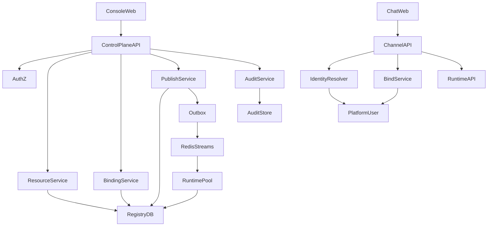

**读图说明：**

1. Console Web 面向超管/租户管理员；Chat Web 面向普通对话用户，两者是两个独立前端应用。
2. Console API 负责 Resource、Binding、Publish、Audit；Chat Channel API 负责身份解析、Bind 和对话入口。
3. Registry DB 是配置事实源。Console Publish 通过事务写入 Resource + Outbox，Redis Streams 只承担通知，不承担事实存储。
4. Runtime 从 Registry 读取资源；Console API 挂掉不会阻断已有 Published Resource 的执行。
5. PlatformUser 是所有 Channel 统一身份，Web/Mattermost/企业微信最终都映射到这里。


#### 3.2.2 Console 信息架构

```text
Fluxion Console
├── Runtime Profiles
│   ├── Definitions
│   ├── Versions
│   ├── Bindings/Policies
│   └── Publish/Rollback
├── Skills
│   ├── Registry
│   ├── Versions
│   └── Bindings
├── MCP
│   ├── Servers
│   ├── Bindings
│   └── Tool visibility
├── Plugins
│   ├── Registry
│   ├── Compatibility
│   └── Scope/Hook policy
├── Workflows / SOP
│   ├── Definitions
│   ├── Versions
│   ├── Validation
│   └── Publish
├── Users / Channels
├── Policies / Approvals
├── Credentials (Refs only)
├── Runs / Traces
├── Eval
└── Audit
```

#### 3.2.3 同仓与产品进程边界

推荐 Monorepo：

```text
fluxion-harness/
├── runtime/
├── console-api/
├── console-web/        # 超管管理后台
├── chat-web/           # 对话用户前台
├── shared/
│   ├── schemas/
│   ├── contracts/
│   └── migrations/
├── plugins/
├── cli/
├── sdk/
└── deploy/
```

同仓保证 RuntimeProfile、Binding、Event、Error Model、数据库 Migration 的代码审查和版本演进统一。

但生产部署仍按职责拆进程：

```text
Console Web
Chat Web
Console API
Agent Runtime Pool
PostgreSQL
Event Bus
```

开发模式则默认一键启动：

```text
Console Web + Chat Web + Console API + Agent Runtime + SQLite
```

#### 3.2.4 Web Chat 作为 Channel

Web 对话入口不是 Console 管理后台中的“测试聊天框”，而是正式 Channel：

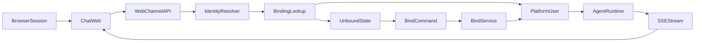

**读图说明：**

- 浏览器会话先形成 Web Channel Identity，不代表已经是 PlatformUser。
- `IdentityResolver` 查询不到绑定关系时进入 `UnboundState`；此时只允许 `/bind <code>`，普通消息不得进入 Runtime。
- 绑定成功后所有后续消息都使用统一 `platform_user_id`，因此能够与其他 Channel 共享 Skill/MCP/UserContext。
- Agent 响应通过 SSE 回到 Chat Web；SSE 断线和重连属于 Channel 层职责，不写进 Agent Core。


Channel Context 至少包含：

```text
channel_type = web
channel_user_id
tenant_id
platform_user_id   # 绑定后才存在
conversation_id
message_id
```

Web Channel 与 Mattermost、企业微信等通道共享同一 Identity/Binding Contract。

#### 3.2.5 `/bind <code>` 首次绑定

首次未绑定用户：

```text
Browser session / web channel identity
        ↓
发送普通消息
        ↓
IdentityResolver: unbound
        ↓
仅允许 /bind <code>
```

绑定流程：

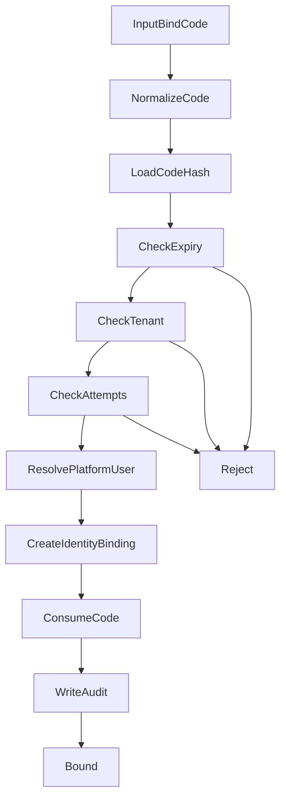

**绑定规则：**

- Code 只在创建响应时展示一次，服务端数据库只保存 Hash。
- 默认有效期 10 分钟，成功后立即消费；同一 Code 不能重复绑定。
- Tenant 不一致、过期、失败次数达到 5 次都直接拒绝。
- 创建 Identity Binding、消费 Code、写 Audit 必须在一致性边界内完成，禁止出现“身份已绑定但 Code 仍可使用”的状态。


Bind Code 安全要求：

- 单次使用；
- 默认有效期 10 分钟；
- 使用后立即失效；
- 绑定 tenant 必须一致；
- 服务端只保存 code hash；
- 日志/Audit 不记录完整明文 code；
- 同一 code 连续失败 5 次立即冻结；
- 绑定操作必须记录 actor/channel/tenant/result。

绑定完成后，Web Chat 后续请求统一携带 `platform_user_id` 进入 Resource Resolver，从而与其他 Channel 共享同一 Skill/MCP/User Context。

#### 3.2.6 发布状态机

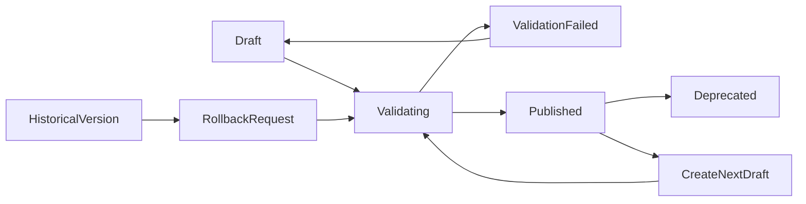

**状态说明：**

- Draft 可编辑；Published 不可原地编辑。
- Validate 失败回到 Draft 并保留明确错误。
- 修改 Published Resource 时创建 Next Draft，而不是修改原版本。
- Rollback 不是覆盖历史数据，而是基于历史版本创建一次新的发布动作，并重新做兼容性和引用校验。


Published Version 不允许原地修改。Rollback 本质是将一个历史兼容版本重新作为目标 Published Version/Active Version，不回写历史内容。

#### 3.2.7 RuntimeProfile 发布链路

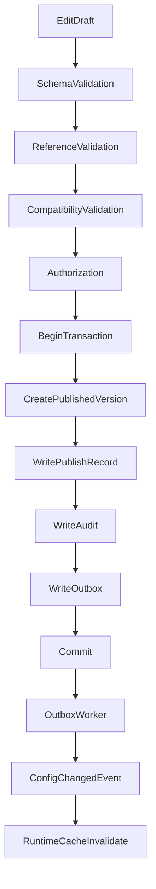

**一致性说明：**

- Published Version、PublishRecord、Audit、Outbox 必须在同一个 PostgreSQL 事务内写入。
- API 在数据库事务成功后即可认为“发布事实成功”；Redis 暂时不可用时 `event_status=pending`，由 Outbox Worker 重试，不返回 424。
- Runtime 不需要逐 Pod ACK 才算发布成功；事件只是加速热加载，Revision/TTL Check 负责最终一致性。


#### 3.2.8 Skill/MCP User Resource 模型

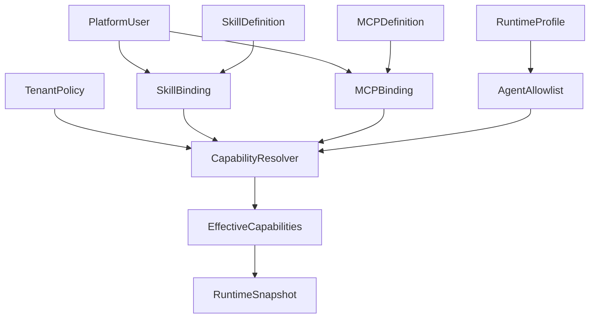

**资源归属说明：**

- Skill/MCP Definition 可以是 system/public/tenant 级定义；用户自己的 Credential、启用 Tool、私有配置放 Binding。
- RuntimeProfile 只描述允许使用哪些资源，不拥有用户 Binding。
- `CapabilityResolver` 计算用户授权、Agent Allowlist、Tenant Policy 的交集，结果写入 Snapshot。


#### 3.2.9 Channel 用户统一

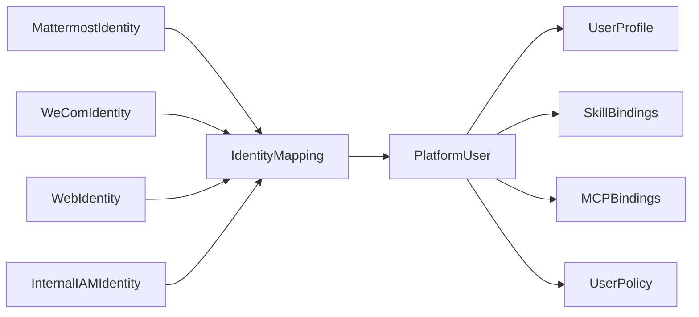

**身份模型说明：**

- Channel Identity 只是登录/消息来源身份，不是第二套 User。
- PlatformUser 可以缺少工号、部门等内部员工字段，但仍然是同一个用户主实体。
- Profile、Skill Binding、MCP Binding、User Policy 都以 PlatformUser 为主体，从而保证跨 Channel、跨 Agent 一致。


Platform User 可以缺少工号/部门等内部字段，但不形成第二套用户实体。

#### 3.2.10 Workflow/SOP

Console 只维护 WorkflowDefinition、DSL、Version、Validation 和 Publish；执行状态由 Workflow Engine 管理。

```text
Console → Workflow Registry → Workflow Engine
Agent Runtime → Workflow Tool Adapter → Workflow Engine
```


#### 3.2.11 前端 Semi Design 约束

Console Web 和 Chat Web 统一使用 Semi Design：

```text
React 19
  + TypeScript
  + Vite
  + @douyinfe/semi-ui
  + @douyinfe/semi-icons
```

React 19 应用入口必须在任何 Semi 组件之前导入：

```ts
import '@douyinfe/semi-ui/react19-adapter';
```

开发约束：

- Console 的 Navigation、Table、Form、Modal、Tabs、Select、Tag、Toast/Notification 等通用能力直接使用 Semi。
- Chat Web 可自定义 MessageBubble 等业务组件，但 Input、Button、Avatar、Dropdown、Spin、Toast 等基础交互优先 Semi。
- 禁止引入 `antd`、`@ant-design/icons` 或另一套通用设计系统。
- `frontend/packages/shared/` 只封装 Fluxion 业务语义组件和主题，不重复封装 Semi 已经提供的通用组件。
- 发布、回滚、删除、权限修改等高风险操作必须使用清晰确认 Modal，并展示影响 Resource 与 Version。
- 页面不得散落硬编码品牌色/状态色，统一使用 Semi Token/共享主题。
- 关键错误必须在页面内有持久反馈，Toast 仅作为辅助短提示。

#### 3.2.12 Channel Adapter Contract（统一 IM Gateway，FEAT-26 / RULE-23）

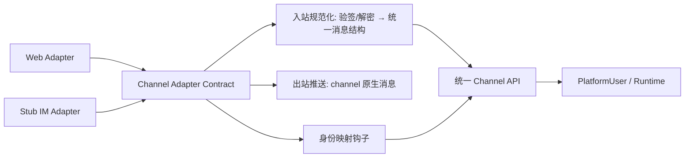

**说明：**

- 所有 IM 通道（Web、飞书、QQ、企微等）必须实现统一 Channel Adapter Contract：入站事件规范化（验签/解密 → 统一消息结构）、出站推送（channel 原生消息）、身份映射钩子（RULE-23）。
- Web Chat 作为首个实现（§3.2.4）；新增通道只允许新增 Adapter，禁止修改 Agent Runtime 与通道无关核心。
- 所有通道身份统一收敛到 PlatformUser（§3.2.9）；Adapter 与 Runtime 之间只经统一 Channel API 交互。
- 具体 IM 通道 Adapter（飞书/QQ/企微）V1 不实现，业务接入时仅实现该契约即接入。

#### 外部依赖清单

| 外部系统 | 依赖类型 | 协议 | 超时 | 降级策略 |
|---------|---------|------|------|---------|
| Registry DB | 核心数据 | SQL | 2s | 写操作失败直接失败；不伪成功 |
| Event Bus | 发布通知 | Redis Streams 7+ | 1s 写入超时 | PostgreSQL Transactional Outbox 重试，Runtime TTL/version check 兜底 |
| Identity/IAM | 认证授权 | OIDC/OAuth2 | 3s | 管理面使用 8h HttpOnly session，30min 无操作自动失效；IAM 不可用时禁止新登录，已有未过期 session 可继续 |
| Secret Store | Credential | internal SecretStore SPI | 2s | V1 使用 AES-256-GCM 加密后存 SQLite/PostgreSQL，Master Key 由环境/K8s Secret 注入；UI 永不回显明文 |
| Runtime/Trace Store | 观测 | PostgreSQL/API | 3s | Trace 查询失败仅降级 Runs/Trace 页面，不影响配置发布 |
| Workflow Registry/Engine | SOP | HTTP API | 5s | Engine 不可用时允许保存 Draft，禁止发布需要在线引用验证的 Workflow；运行入口返回明确依赖错误 |

---

### 3.3 数据设计 [必填]

**新增表: `resource_definition`**

| 字段名 | 类型 | 可空 | 默认值 | 索引 | 说明 |
|--------|------|------|--------|------|------|
| resource_pk | UUID | N | | PK | 内部主键 |
| tenant_id | VARCHAR | N | | IDX | |
| resource_type | VARCHAR | N | | IDX | runtime_profile/skill/mcp/plugin/workflow/policy |
| resource_id | VARCHAR | N | | IDX | 稳定逻辑 ID |
| version | VARCHAR | N | | | immutable version |
| status | VARCHAR | N | draft | IDX | |
| visibility | VARCHAR | N | tenant | IDX | |
| spec_json | JSONB | N | | | |
| created_by | VARCHAR | N | | | |
| created_at | TIMESTAMP | N | now | | |
| published_at | TIMESTAMP | Y | | | |

唯一约束建议：`(tenant_id, resource_type, resource_id, version)`。

**新增表: `resource_binding`**

| 字段名 | 类型 | 可空 | 默认值 | 索引 | 说明 |
|--------|------|------|--------|------|------|
| binding_id | UUID | N | | PK | |
| tenant_id | VARCHAR | N | | IDX | |
| subject_type | VARCHAR | N | | IDX | tenant/user/agent/global |
| subject_id | VARCHAR | N | | IDX | |
| resource_type | VARCHAR | N | | IDX | |
| resource_id | VARCHAR | N | | IDX | |
| version_selector | VARCHAR | Y | latest-published | | |
| config_json | JSONB | Y | | | 无 Secret |
| credential_ref | VARCHAR | Y | | | |
| enabled | BOOL | N | true | | |
| created_by | VARCHAR | N | | | |
| created_at | TIMESTAMP | N | now | | |

**新增表: `platform_user_identity`**

| 字段名 | 类型 | 可空 | 默认值 | 索引 | 说明 |
|--------|------|------|--------|------|------|
| id | UUID | N | | PK | |
| tenant_id | VARCHAR | N | | IDX | |
| platform_user_id | VARCHAR | N | | IDX | |
| source_type | VARCHAR | N | | IDX | internal/mattermost/wecom/web/api |
| external_subject_id | VARCHAR | N | | IDX | |
| profile_json | JSONB | Y | | | 可选属性 |
| status | VARCHAR | N | active | | |

**新增表: `bind_code`**

| 字段名 | 类型 | 可空 | 默认值 | 索引 | 说明 |
|--------|------|------|--------|------|------|
| bind_code_id | UUID | N | | PK | |
| tenant_id | VARCHAR | N | | IDX | |
| code_hash | VARCHAR | N | | UK | 不保存明文 code |
| platform_user_id | VARCHAR | N | | IDX | 目标用户 |
| expires_at | TIMESTAMP | N | | IDX | 默认 10 分钟 |
| consumed_at | TIMESTAMP | Y | | | 单次使用 |
| failed_attempts | INT | N | 0 | | 达 5 次冻结 |
| created_by | VARCHAR | N | | | |
| created_at | TIMESTAMP | N | now | | |

**新增表: `publish_record`**

| 字段名 | 类型 | 可空 | 默认值 | 索引 | 说明 |
|--------|------|------|--------|------|------|
| publish_id | UUID | N | | PK | |
| tenant_id | VARCHAR | N | | IDX | |
| resource_type | VARCHAR | N | | IDX | |
| resource_id | VARCHAR | N | | IDX | |
| version | VARCHAR | N | | | |
| action | VARCHAR | N | | | publish/rollback/deprecate |
| actor_id | VARCHAR | N | | | |
| status | VARCHAR | N | | IDX | |
| event_status | VARCHAR | N | | | |
| created_at | TIMESTAMP | N | now | | |

**新增表: `audit_log`**

| 字段名 | 类型 | 可空 | 默认值 | 索引 | 说明 |
|--------|------|------|--------|------|------|
| audit_id | UUID | N | | PK | |
| tenant_id | VARCHAR | N | | IDX | |
| actor_id | VARCHAR | N | | IDX | |
| action | VARCHAR | N | | IDX | |
| target_type | VARCHAR | N | | | |
| target_id | VARCHAR | N | | IDX | |
| before_json | JSONB | Y | | | 脱敏 |
| after_json | JSONB | Y | | | 脱敏 |
| created_at | TIMESTAMP | N | now | IDX | |

**ER图**

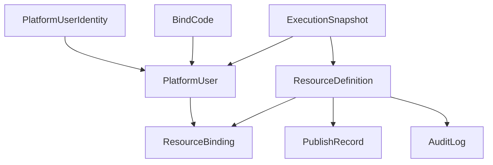

**数据关系说明：**

- ResourceDefinition 保存不可变版本；ResourceBinding 保存主体和资源之间的配置/授权。
- PlatformUserIdentity 负责外部 Channel Identity 到 PlatformUser 的映射。
- BindCode 只用于首次映射，不承载长期登录凭证。
- PublishRecord/AuditLog 是管理面治理数据；ExecutionSnapshot 来自 Runtime，用于 Console 追溯真实执行版本。


**索引设计**

| 索引名 | 类型 | 字段 | 使用场景 |
|--------|------|------|---------|
| uk_resource_version | unique | tenant_id,resource_type,resource_id,version | 防重复版本 |
| idx_resource_list | composite | tenant_id,resource_type,status,updated/created_at | Console 列表 |
| idx_binding_subject | composite | tenant_id,subject_type,subject_id,resource_type | Binding 查询 |
| uk_identity_source | unique | tenant_id,source_type,external_subject_id | Channel User 映射 |
| idx_audit_target | composite | tenant_id,target_type,target_id,created_at | 审计追溯 |

**容量预估**

| 维度 | 预估值 |
|------|--------|
| Resource 设计容量 | 平台 100,000 个逻辑 Resource；单租户 10,000 |
| Resource 平均/上限版本 | 平均按 20 估算；单 Resource 在线保留上限 1000，超出归档 |
| Binding 设计容量 | 平台 1,000,000 |
| Audit 设计容量 | 1,000,000 条/日；热查询 30 天，之后归档 |
| Trace 数据 | 不建议全部放 Control Plane 主库，具体由 Observability 设计决定 |

---


#### 3.3.1 Console 统一响应、错误与日志封装

Console/Control Plane 与 Channel API 的基础设施必须在第一阶段统一，禁止每个 Handler 自行决定响应和日志格式。

**统一响应：**

```json
{
  "code": 0,
  "message": "success",
  "data": {},
  "request_id": "req_xxx"
}
```

其中：

- `code=0` 表示成功。
- 非 0 code 使用整数命名空间：`30xxx` 通用校验、`31xxx` Resource、`32xxx` Binding、`33xxx` Publish/Version、`34xxx` Identity/Bind、`35xxx` Auth/AuthZ、`36xxx` Workflow 引用、`39xxx` 内部/依赖。
- `request_id` 同时写入 `X-Request-ID` 响应头，并贯穿 Log/Audit/Trace。
- 分页统一为 `data.items/page/page_size/total`。
- Domain/Application 层抛类型化异常；仅 API Exception Mapper 负责转换 HTTP Status 和业务 code。

推荐代码边界：

```text
backend/src/fluxion/
├── api/
│   ├── middleware/
│   │   └── request_context.py
│   ├── responses.py
│   ├── exception_handlers.py
│   └── dependencies/
├── errors/
│   ├── base.py
│   ├── resource.py
│   ├── binding.py
│   ├── publish.py
│   └── identity.py
└── observability/
    ├── logging.py
    ├── redaction.py
    └── context.py
```

**RequestContext：**

```text
request_id
trace_id
tenant_id
actor_id
method
route
client_ip
user_agent
```

请求入口统一建立 Context；业务 Logger 从 ContextVar/等价机制自动绑定字段，业务代码不得到处手工传 `request_id`。

**结构化日志：**

V1 使用 Python 标准 logging + `structlog` JSON Renderer，输出 stdout/stderr。

请求完成日志至少包含：

```text
timestamp level service environment event
request_id trace_id tenant_id actor_id
method route status_code biz_code latency_ms
```

资源操作按需增加：

```text
resource_type resource_id resource_version
binding_id publish_id execution_id channel_type
```

**统一脱敏：**

至少屏蔽 `password/token/access_token/refresh_token/authorization/cookie/secret/client_secret/bind_code/credential/api_key`，Key 大小写不敏感。

**日志和 Audit 的边界：**

普通日志用于运行诊断；AuditLog 用于治理事实。Publish、Rollback、Binding/权限/Policy、Bind、CredentialRef 等高影响动作必须写独立 AuditLog。Audit 失败不能被普通日志替代。

对应 code-flow required Spec：`fluxion-console-api-contract#RULE-fluxion-console-api-001`。


### 3.4 接口设计 [必填]

本模块主入口为 HTTP API，前端调用同一 API；CLI/SDK 管理入口可后续按需增加。

#### 接口清单

| 接口ID | 名称 | 方法 | 路径 | 说明 |
|--------|------|------|------|------|
| API-01 | 创建 Resource Draft | POST | `/api/v1/resources/{type}` | runtime_profile/skill/mcp/plugin/workflow/policy |
| API-02 | 更新 Draft | PUT | `/api/v1/resources/{type}/{id}/versions/{version}` | 仅 Draft |
| API-03 | 获取 Resource | GET | `/api/v1/resources/{type}/{id}` | 含版本列表 |
| API-04 | 校验版本 | POST | `/api/v1/resources/{type}/{id}/versions/{version}:validate` | Schema+Reference+Policy |
| API-05 | 发布版本 | POST | `/api/v1/resources/{type}/{id}/versions/{version}:publish` | Immutable Publish |
| API-06 | 回滚 | POST | `/api/v1/resources/{type}/{id}:rollback` | 目标版本 |
| API-07 | 创建 Binding | POST | `/api/v1/bindings` | user/tenant/agent/global |
| API-08 | 更新/禁用 Binding | PATCH | `/api/v1/bindings/{binding_id}` | |
| API-09 | Channel User 映射 | POST | `/api/v1/users/identities:bind` | external → platform user |
| API-10 | 查询 Run/Trace | GET | `/api/v1/runs/{execution_id}` | Read-only |
| API-11 | 查询 Audit | GET | `/api/v1/audit` | tenant scoped |
| API-12 | 查询 Runtime 状态 | GET | `/api/v1/runtimes` | 非 Agent Pod 管理入口 |
| API-13 | 创建 Bind Code | POST | `/api/v1/bind-codes` | 超管/授权用户生成绑定码 |
| API-14 | Web Channel Bind | POST | `/api/v1/channels/web:bind` | `/bind <code>` 后端入口 |
| API-15 | Web Chat Send | POST | `/api/v1/chat/messages` | 绑定后对话；流式响应可使用 SSE |

#### API-05: 发布 Resource Version

**请求**

| 参数 | 类型 | 必填 | 说明 |
|------|------|------|------|
| type | path | Y | resource type |
| id | path | Y | resource id |
| version | path | Y | draft version |
| publish_note | string | N | 发布说明 |
| expected_base_version | string | N | 乐观并发控制 |

**响应示例**

```json
{
  "code": 0,
  "message": "success",
  "data": {
    "resource_id": "agent_assistant",
    "version": "12",
    "status": "published",
    "publish_id": "pub_xxx",
    "event_status": "published"
  },
  "request_id": "req_xxx"
}
```

**错误码**

| 错误码 | 信息 | 场景 | HTTP状态码 |
|--------|------|------|----------|
| CP-40001 | validation failed | Schema/Reference/Policy 不通过 | 400 |
| CP-40301 | forbidden | 无发布权限 | 403 |
| CP-40401 | resource/version not found | 资源不存在 | 404 |
| CP-40901 | version conflict | 并发发布/版本冲突 | 409 |
| CP-50301 | registry transaction failed | Registry/Publish 事务未提交 | 503 |

**处理逻辑**

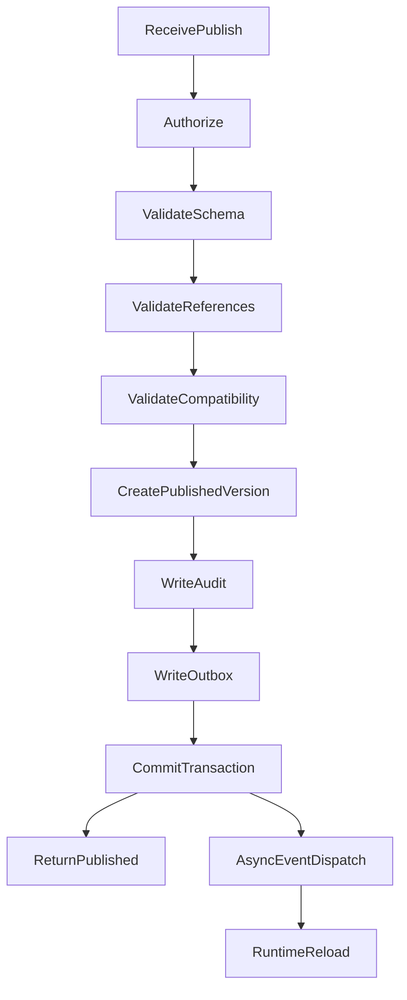

**API 语义：**

- Publish API 的同步成功条件是数据库事务提交成功，不等待所有 Runtime 收到事件。
- Redis/Event Dispatch 暂时失败时返回发布成功，同时 `event_status=pending`；后台 Outbox 继续投递。
- 只有 Registry 事务本身失败时 Publish API 才失败。


#### API-07: 创建 Binding

**请求示例**

```json
{
  "subject_type": "user",
  "subject_id": "user_001",
  "resource_type": "mcp",
  "resource_id": "github",
  "version_selector": "latest-published",
  "credential_ref": "secret://github/user_001",
  "config": {
    "enabled_tools": ["list_pr", "get_repository"]
  }
}
```

校验必须覆盖 tenant visibility、resource status、credential_ref 格式、Policy。

---

### 3.5 质量实现方案 [必填]

#### 性能设计

| 指标ID | 热点路径 | 目标值 | 实现方案（含被放弃的较慢方案） |
|--------|---------|-------|------------------------------|
| NFR-PERF-01 | Resource 列表 | P95 ≤ 300ms | tenant/type/status 组合索引；避免全 JSON scan |
| NFR-PERF-02 | Publish | P95 ≤ 500ms | DB transaction + outbox/event；不在请求内等待所有 Runtime Ack |
| NFR-PERF-03 | Trace 查询 | P95 ≤ 500ms | 独立 Trace 表/索引；避免 Resource 主查询被 Trace 拖慢 |
| NFR-PERF-04 | Version diff | 1MB Resource 内 P95 ≤ 300ms | 结构化 JSON diff；大于 1MB 使用后台预计算并缓存 |

#### 可靠性设计

| 风险ID | 失效模式 | 影响 | 应对措施 | 验证场景 |
|--------|---------|------|---------|---------|
| RISK-01 | DB 成功、Event 失败 | Runtime 延迟生效 | Transactional outbox/补偿重发 | E-C106 |
| RISK-02 | Console 故障 | 无法管理配置 | Runtime 与 Console 解耦 | S-C103 |
| RISK-03 | 并发编辑覆盖 | 配置丢失 | version/etag optimistic lock | B-C101 |
| RISK-04 | 错误跨租户 Binding | 数据泄露/越权 | tenant scope + authz + validation | E-C102/E-C105 |
| RISK-05 | Workflow 引用失效 | 发布后无法执行 | publish-time reference validation | E-C104 |
| RISK-06 | Audit 不完整 | 合规/排障困难 | write path mandatory audit | S-C106 |

#### 安全性设计

| 指标ID | 验收标准 | 实现方案 |
|--------|---------|---------|
| NFR-SEC-01 | tenant 资源隔离 | 所有 repository query 强制 tenant scope；授权测试 |
| NFR-SEC-02 | 发布权限 | RBAC/ABAC，对 Agent/Workflow/Policy 等资源分权 |
| NFR-SEC-03 | Secret | CredentialRef only；前端不接受/展示明文长期 Secret |
| NFR-SEC-04 | 审计 | Publish/Rollback/Binding/Policy 变更强制 Audit |
| NFR-SEC-05 | HTML/DSL/Input | 输入编码/Schema 校验，防止注入和恶意渲染 |

#### DFX 设计要求 [必填]

| DFX ID | 维度 | Console/Chat 设计要求 | 验证 |
|--------|------|----------------------|------|
| DFX-CP-01 | Availability | Console 故障不得影响 Runtime 读取已发布资源；Chat Web 与管理后台故障域可分离 | 故障注入 |
| DFX-CP-02 | Scalability | Console API、Chat Web、Runtime 可独立扩容 | 压测 |
| DFX-CP-03 | Security | 管理面和对话面权限模型分离；Bind Code 单次/短时/hash 存储 | 安全 E2E |
| DFX-CP-04 | Maintainability | Agent/Console 同仓共享 Schema/Contract，不复制模型 | CI dependency check |
| DFX-CP-05 | Testability | SQLite/PG migration、Resource Contract、Web bind/chat 具备 E2E | CI |
| DFX-CP-06 | Observability | bind_id/channel_user/platform_user/execution_id 全链路可追溯 | Trace |
| DFX-CP-07 | Deployability | 同仓多产物，可独立发布 Console/Chat/Runtime | 发布演练 |
| DFX-CP-08 | Usability | 超管管理入口与普通用户 Chat 入口清晰隔离 | UX 验收 |

#### 可观测性设计

| 场景 | 实现方案 |
|------|---------|
| API | structured log + trace_id + actor_id + tenant_id |
| 发布 | publish_id/resource_id/version/event_status |
| Event | outbox lag / retry count |
| UI | 前端错误与 API trace_id 关联 |
| Runtime | Read-only Runtime status/health aggregation |

---

## 4. 部署与运维

### 4.1 部署架构

V1 建议先作为普通 Web Control Plane 服务部署，不因为逻辑模块多就立即拆成多个微服务。

| 环境 | 配置 | 实例数 | 用途 |
|------|------|--------|------|
| local/dev | 2C4G 以内 | 1 套 bundle | Console Web + Chat Web + Console API + Agent Runtime + SQLite |
| staging | 2C4G/服务起步 | 1+ | E2E/发布验证 |
| prod | Console API 2C4G 起步 | 2+ | Control Plane HA；Chat Web/API 与 Runtime 可独立扩容 |

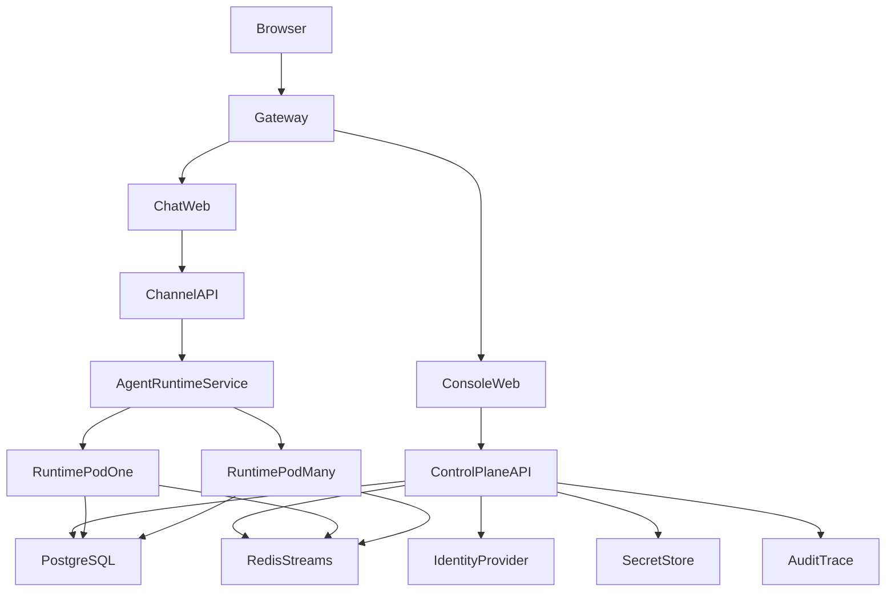

**部署说明：**

- 同仓并不代表同进程：Console Web、Chat Web、Control Plane API、Runtime 可以分别构建镜像和扩缩容。
- PostgreSQL 是生产 Resource Source of Truth；Redis Streams 仅用于事件通知。
- Dev Bundle 使用 SQLite，可不启动 Redis，通过 Revision Polling 保持热加载语义。
- 管理面和 Chat 面应使用不同路由/权限域，避免普通对话用户获得 Console 管理权限。


### 4.2 发布与回滚

**Console 程序发布**与**Resource 发布**必须分离。

Console 程序走应用发布/回滚；Agent/Skill/MCP/Workflow/Policy 走 Resource Version 发布。

| 阶段 | 范围 | 持续 | 进入条件 | 回滚条件 |
|------|------|------|---------|---------|
| App Canary | 10% 流量 | ≥30min | unit/integration/E2E/DFX 全通过，5min API error <0.5% | 5min error ≥1% 或 P95 超目标 2 倍持续10min |
| App Full | 100% | - | Canary 稳定 | 生产异常 |
| Resource Publish | 指定 Resource | 即时/灰度 | Validate 通过 | Eval/错误/人工回滚 |

### 4.3 监控告警

| 指标 | 阈值 | 级别 | 处理SLA |
|------|------|------|---------|
| Publish failure rate | 5min >1% | P1 | 10min响应 |
| Outbox/Event lag | P95 >5s 持续5min | P1 | 10min响应 |
| DB error rate | 5min >0.5% | P1 | 10min响应 |
| AuthZ deny anomaly | 单用户10min内 >50 次或租户基线3倍 | P2 | 30min响应 |
| Audit write failure | 任意连续 3 次失败 | P1 | 10min响应 |
| Runtime Registry read error | 5min >0.5% | P1 | 10min响应 |

### 4.4 数据迁移

从旧 Console/OpenClaw 配置迁移：

| 阶段 | 操作 | 验证方法 |
|------|------|---------|
| 1 | 导入 openclaw Agent 配置为 Draft Resource | Schema/数量核对 |
| 2 | Skill/MCP 拆 Definition | 资源去重 |
| 3 | 按用户建立 Binding | 同用户跨 Agent 对比 |
| 4 | Channel Identity 迁移为 Platform User mapping | 身份映射核对 |
| 5 | Credential 移出配置并生成 SecretRef | 明文扫描 |
| 6 | Shadow publish | Runtime 解析一致性 |
| 7 | 切换 Console/Registry | E2E |
| 8 | 冻结旧配置入口 | Audit |

---

## 5. 风险与依赖

### 5.1 项目依赖

| 依赖模块/团队 | 依赖内容 | 状态 | 风险等级 |
|-------------|---------|------|---------|
| Agent Runtime | Resource/Binding/Snapshot Contract | V1 设计中 | 高 |
| Workflow Engine | WorkflowDefinition/Validate/Run Contract | 待设计 | 高 |
| Identity/IAM | tenant/user/authz | 待对接 | 高 |
| Secret Provider | CredentialRef/SecretStore | V1 内置 AES-256-GCM SecretStore；Master Key 由环境/K8s Secret 提供；SPI 预留 Vault/KMS | 高 |
| Event Bus | config.changed/outbox | PostgreSQL Transactional Outbox + Redis Streams 7+ | 中 |
| Trace/Eval | Run 数据模型 | 待设计 | 中 |

### 5.2 风险识别

| 风险ID | 类型 | 描述 | 概率 | 影响 | 应对措施 | 验证场景 |
|--------|------|------|------|------|---------|---------|
| RISK-01 | 架构 | Console/Runtime 同仓但 Contract 边界不清导致代码耦合 | 中 | 高 | shared/contracts 只放稳定 Schema/Contract；禁止 Console 直接依赖 Runtime 内部实现 | 设计评审/依赖检查 |
| RISK-02 | 一致性 | 发布成功但 Runtime 未及时收到事件 | 中 | 高 | Outbox + TTL/version check | E-C106 |
| RISK-03 | 安全 | 复杂 visibility/scope 导致越权 | 中 | 高 | 单一 resolver + E2E authz matrix | E-C102/E-C105 |
| RISK-04 | 产品 | 把“万物皆插件”直接暴露给普通用户造成认知复杂 | 中 | 中 | UI 保留 Agent/Skill/MCP/Workflow 产品概念 | 用户评审 |
| RISK-05 | 数据 | 版本无限增长导致主库膨胀 | 中 | 中 | retention/archive，指标待容量评估 | B-C103 |
| RISK-06 | 流程 | 审批策略过多造成操作疲劳 | 中 | 中 | Risk-based approval，默认最少必要审批 | 业务验收 |

---

## 6. 需求追溯矩阵

| 用户故事 | 功能ID | 接口ID | 测试用例ID | 测试层级 | 状态 |
|---------|--------|--------|-----------|---------|------|
| US-01 | FEAT-01/02 | API-01/05/06 | S-C101/E-C101 | E2E | 待实现 |
| US-02 | FEAT-02/15/16 | API-05/06 | S-C102/E-C106/B-C101 | E2E | 待实现 |
| US-03 | FEAT-03/04/05/06 | API-07/08 | S-C104/E-C102/E-C103 | E2E | 待实现 |
| US-04 | FEAT-09 | API-01/04/05 | S-C108/E-C104 | E2E | 待实现 |
| US-05 | FEAT-11/14 | API-07/08 | E-C102/E-C103 | E2E | 待实现 |
| US-06 | FEAT-12/13 | API-09 | S-C105 | E2E | 待实现 |
| US-07 | FEAT-17/18/19 | API-10/11 | S-C106/S-C107 | E2E | 待实现 |
| US-08 | FEAT-15/16/20/24/25 | API-05/12 | S-C103/S-C109/S-C111/S-C112 | E2E/integration | 待实现 |
| US-09 | FEAT-21/22/23 | API-13/14/15 | S-C110/E-C108/E-C109 | E2E | 待实现 |

---

## Spec Compliance Matrix

| Spec/Rule | enforcement | 设计影响 | 设计落点 | 验证场景 | 状态/N/A 理由 |
|-----------|-------------|---------|---------|---------|----------------|
| DesignDrivers#P01 | required | Publish 不重启 Runtime | FEAT-15/16 | S-C102 | applied |
| DesignDrivers#P03 | required | Skill/MCP User Binding | FEAT-03~06 | S-C104 | applied |
| DesignDrivers#P04 | required | Registry 可供 Runtime 独立读取 | §3.2 | S-C103 | applied |
| DesignDrivers#P05 | required | Create RuntimeProfile，不创建 Pod | RULE-01 | S-C101 | applied |
| DesignDrivers#P06 | required | Console 与 Agent 产品配套发布，Runtime Kernel 独立可调用 | RULE-04 | S-C103 | applied |
| DesignDrivers#P07 | required | 版本不可变/Runtime Snapshot | FEAT-02/15 | S-C102/S-C107 | applied |
| DesignDrivers#P13 | required | Unified Platform User | FEAT-12/13 | S-C105 | applied |
| DesignDrivers#P15 | required | Risk-based Approval | FEAT-11 | E2E：低/中/高风险审批分级策略 | applied |
| DesignDrivers#P16 | required | Tool/MCP Policy/Binding | FEAT-06/11 | E-C102 | applied |
| DesignDrivers#P17 | required | User context/resource 独立 | FEAT-12 + Binding | S-C104/S-C105 | applied |
| DesignDrivers#P18 | required | Eval versioning | FEAT-18 | integration：EvalSet/EvalRun 版本关联 Trace/Snapshot | applied |
| DesignDrivers#P19 | required | 发布/策略链路性能预算 | NFR-PERF | 按 §2.5.3 和 §3.5 性能基线压测 | applied |
| DesignDrivers#P21 | required | Workflow DSL/发布 | FEAT-09 | S-C108/E-C104 | applied |
| DesignDrivers#P22 | required | Problem-driven | 全文 | 评审 | applied |
| RuntimeV1#RULE-02 | required | Published Config 热更新 | FEAT-15/16 | S-C102 | applied |
| RuntimeV1#RULE-05 | required | SecretRef | FEAT-14 | E-C103 | applied |

---

## 附录：术语表

| 术语 | 定义 |
|------|------|
| Control Plane | 负责 Resource 定义、Binding、发布、治理和可观测管理，不承担 Agent 执行 |
| Resource | 可配置、版本化、可发布的管理对象 |
| Definition | 描述资源“是什么” |
| Binding | 描述“谁可以怎样使用资源” |
| Published Version | 不可原地修改的已发布资源版本 |
| Registry | Runtime/Console 共享的配置事实源 |
| RuntimeProfile | 运行态配置 资源，不是 Pod |
| Platform User | 统一用户实体，可映射不同 Channel/Internal Identity |
| SecretRef | 对外部 Secret Store 中 Credential 的引用 |
| SOP | Standard Operating Procedure，由 WorkflowDefinition 表达 |
| Audit | 管理面高影响操作审计 |
| ADR | Architecture Decision Record |

---

*文档结束*
